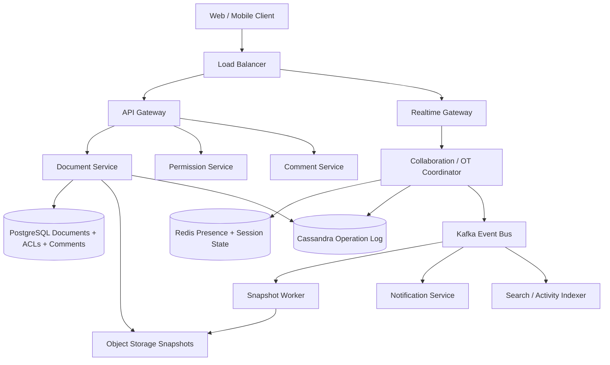
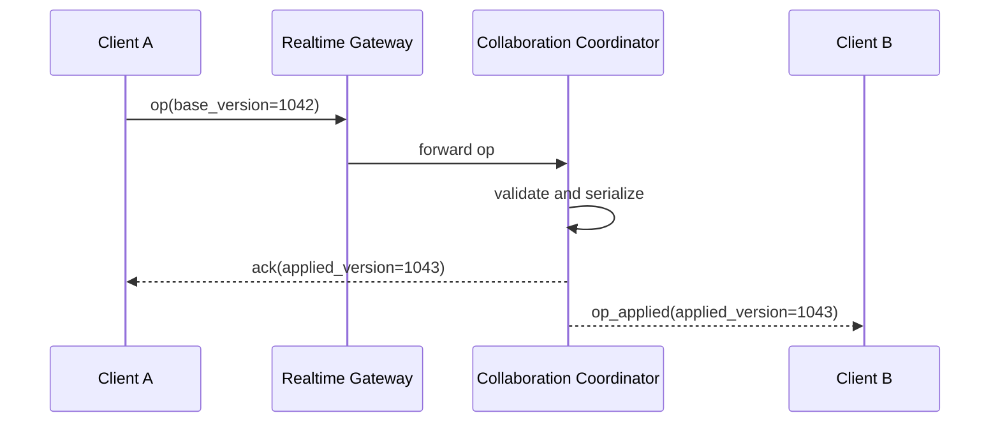
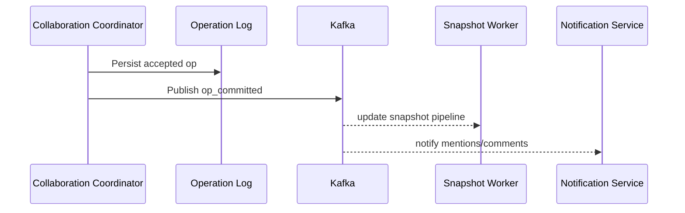
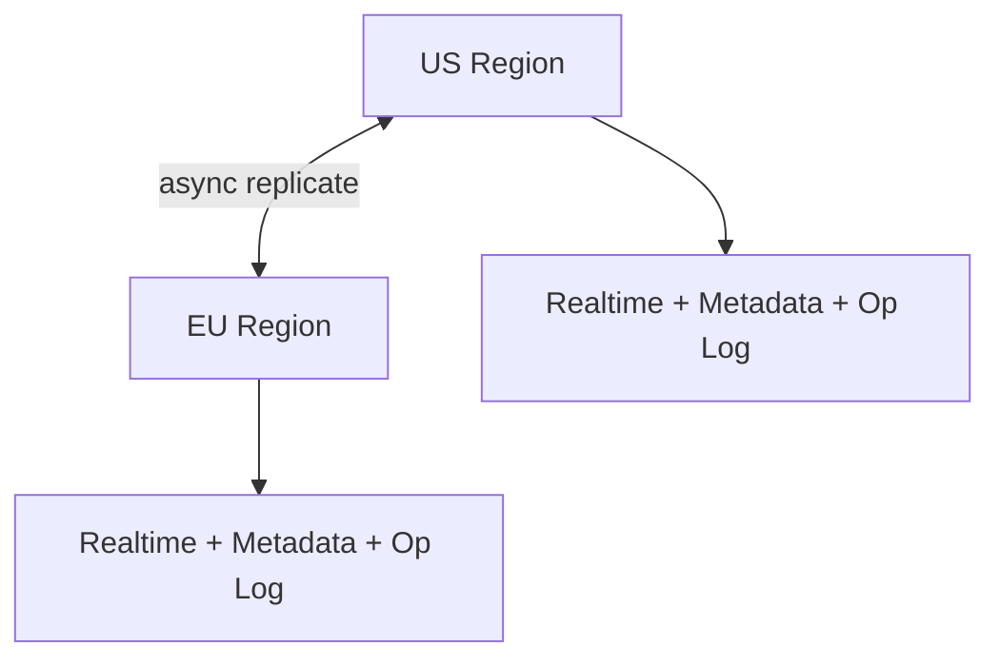

# Design Google Docs

Google Docs is a classic system design interview problem because it combines a read-heavy document platform with a correctness-critical real-time collaboration engine. Users expect typing to feel instant, collaborators to appear live, comments to land in the right place, and document state to survive reconnects and crashes without losing accepted edits.

The surface looks simple: open a document and type. The depth lies in concurrent edits, per-document ordering, cursor presence, version history, permission checks, snapshot compaction, reconnect replay, and making sure one viral document does not melt the whole collaboration system.

---

## Functional Requirements

**In Scope:**
- Users can create, open, rename, and edit documents
- Multiple users can collaboratively edit the same document in real time
- Users can see collaborator presence, cursors, and selection ranges
- Users can add comments and reply to comment threads
- Users can share a document with view, comment, or edit permissions
- The system autosaves edits and maintains revision history
- Clients can reconnect and catch up from a missed revision range

**Out of Scope:**
- Spreadsheet formulas, slides rendering, and rich drawing tools
- Full offline-first sync for days of disconnected editing
- AI writing assistants and grammar suggestions
- Export conversion internals for PDF, DOCX, or HTML
- Enterprise admin, DLP, and legal-hold policies

---

## Non-Functional Requirements

| Property | Target | Reasoning |
|---|---|---|
| **Edit Latency** | p99 < 150ms for active collaborators in one region | Typing must feel near-instant or collaboration feels broken |
| **Open Document Latency** | p99 < 300ms for snapshot + recent ops | Opening a document should be fast even with large revision history |
| **Availability** | 99.99% for open/read/edit flows | Docs is a daily productivity tool; outages block active work immediately |
| **Durability** | No loss of acknowledged edits or comments | Once an edit is accepted, users expect it to persist forever |
| **Ordering** | Strict per-document operation order | Concurrent edits must resolve deterministically |
| **Consistency** | Strong for accepted edit order and permissions; eventual for search indexing, notifications, and analytics | Stale search results are acceptable; split-brain document versions are not |
| **Scale** | 100M+ DAU, millions of active documents, millions of concurrent editing sessions | The architecture must handle both broad load and hot-doc concentration |

**Key tradeoff:** Google Docs prioritizes **deterministic collaborative correctness over globally perfect latency everywhere**. An edit taking 80ms longer across regions is acceptable. Losing an acknowledged operation or applying operations in the wrong order is not.

---

## Capacity Estimation

**Editing traffic:**
- Assume **100M daily active users**
- If 10M users actively edit documents on a busy day and each generates 300 operations/day, the platform processes roughly **3B edit operations/day**
- That is about **35K ops/sec average**, with peak traffic easily reaching **200K+ ops/sec** during work hours

**Concurrent sessions:**
- Assume **5M concurrent open documents/sessions** at peak across web and mobile
- A much smaller subset is actively typing, but all active sessions still maintain presence and catch-up state
- Real-time channels therefore dominate connection management even when edit QPS is lower than read QPS

**Storage:**
- Final document content is comparatively small; most text docs are KB to low MB scale
- Revision history, snapshots, comments, embedded objects, and exports dominate long-term storage growth
- A hot document may accumulate thousands of operations in one meeting or class session, so compaction and snapshots are mandatory

**Bandwidth:**
- Individual edit operations are tiny, often tens to hundreds of bytes after encoding
- Presence, cursor broadcasts, and snapshot delivery still create significant fanout for heavily shared documents

---

## Core Entities

| Entity | Purpose | Key Fields | Relationships |
|---|---|---|---|
| **User** | Account identity and collaborator profile | `user_id`, `email`, `display_name`, `avatar_url`, `created_at` | owns documents, comments, and share edges |
| **Document** | Canonical document metadata | `document_id`, `owner_user_id`, `title`, `latest_version`, `created_at`, `updated_at` | has permissions, operations, snapshots, and comments |
| **DocumentPermission** | Sharing and ACL edge | `document_id`, `principal_id`, `role`, `granted_at` | links users or groups to a document |
| **DocumentOperation** | Atomic accepted edit | `op_id`, `document_id`, `actor_user_id`, `base_version`, `applied_version`, `op_payload`, `created_at` | belongs to one document and one version step |
| **DocumentSnapshot** | Materialized checkpoint of document state | `document_id`, `snapshot_version`, `object_key`, `created_at` | derived from operations for fast open/catch-up |
| **CommentThread** | Anchored discussion on document content | `thread_id`, `document_id`, `anchor_range`, `status`, `created_at` | has comment messages and replies |
| **PresenceSession** | Active collaborative session state | `session_id`, `document_id`, `user_id`, `cursor_range`, `last_heartbeat_at` | ephemeral state used for realtime UX |
| **RevisionMarker** | Named or restorable historical point | `revision_id`, `document_id`, `version`, `label`, `created_at` | points to document history |

**Critical modeling decisions:**
- `DocumentOperation` is the source of truth for collaborative mutation history. The latest rendered document can be rebuilt from a snapshot plus subsequent operations.
- `DocumentSnapshot` is derived state used for performance. If it is lost, it can be regenerated from the operation log.
- `PresenceSession` is ephemeral and should not live only in the primary transactional database because it changes constantly and has TTL semantics.

---

## Databases and Database Design

### Storage Tier Decisions

| Data | Access Pattern | Engine | Why |
|---|---|---|---|
| Document metadata, permissions, comments | transactional writes, exact lookups, strong consistency | **PostgreSQL** | sharing rules, titles, and comment metadata benefit from ACID guarantees |
| Accepted edit operation log | append-heavy writes, ordered reads by document | **Cassandra / ScyllaDB** | high write throughput and efficient per-document timeline reads |
| Presence, active sessions, hot document state | sub-millisecond reads/writes, TTLs, fanout helpers | **Redis** | ideal for cursor state, doc membership, leader hints, and hot caches |
| Document snapshots and exports | write-once checkpoints, read-many | **Object Storage + CDN** | cheap and scalable for snapshots and exported blobs |
| Notifications, indexing, activity feed, analytics side effects | durable append-only stream | **Kafka** | decouples accepted edits from non-critical downstream consumers |

This is intentionally polyglot. Collaborative editing needs **strong metadata correctness**, **fast append-only operation history**, **ephemeral session state**, and **cheap snapshot storage**. One database is a poor fit for all four.

### Schema 1 - Documents (PostgreSQL)

```sql
CREATE TABLE documents (
  document_id         UUID PRIMARY KEY DEFAULT gen_random_uuid(),
  owner_user_id       UUID NOT NULL,
  title               TEXT NOT NULL,
  latest_version      BIGINT NOT NULL DEFAULT 0,
  created_at          TIMESTAMPTZ DEFAULT NOW(),
  updated_at          TIMESTAMPTZ DEFAULT NOW()
);

CREATE INDEX idx_documents_owner_updated
  ON documents (owner_user_id, updated_at DESC);
```

### Schema 2 - Document Permissions (PostgreSQL)

```sql
CREATE TABLE document_permissions (
  document_id         UUID NOT NULL REFERENCES documents(document_id),
  principal_id        UUID NOT NULL,
  role                VARCHAR(16) NOT NULL,
  granted_at          TIMESTAMPTZ DEFAULT NOW(),
  PRIMARY KEY (document_id, principal_id)
);
```

### Schema 3 - Document Operations (Cassandra)

```sql
CREATE TABLE document_operations (
  document_id         UUID,
  bucket_id           INT,
  applied_version     BIGINT,
  op_id               UUID,
  actor_user_id       UUID,
  base_version        BIGINT,
  op_type             TEXT,
  op_payload          TEXT,
  created_at          TIMESTAMP,
  PRIMARY KEY ((document_id, bucket_id), applied_version, op_id)
) WITH CLUSTERING ORDER BY (applied_version ASC, op_id ASC);
```

`bucket_id` can be derived from version ranges such as `floor(applied_version / 10000)` so very active documents do not create unbounded partitions.

### Schema 4 - Snapshot Metadata (PostgreSQL)

```sql
CREATE TABLE document_snapshots (
  document_id         UUID NOT NULL REFERENCES documents(document_id),
  snapshot_version    BIGINT NOT NULL,
  object_key          TEXT NOT NULL,
  created_at          TIMESTAMPTZ DEFAULT NOW(),
  PRIMARY KEY (document_id, snapshot_version)
);
```

Snapshot contents live in object storage; the SQL row just points to the blob and version.

### Schema 5 - Comment Threads (PostgreSQL)

```sql
CREATE TABLE comment_threads (
  thread_id           UUID PRIMARY KEY DEFAULT gen_random_uuid(),
  document_id         UUID NOT NULL REFERENCES documents(document_id),
  anchor_range_json   JSONB NOT NULL,
  status              VARCHAR(16) NOT NULL DEFAULT 'open',
  created_by          UUID NOT NULL,
  created_at          TIMESTAMPTZ DEFAULT NOW()
);

CREATE INDEX idx_comment_threads_document
  ON comment_threads (document_id, created_at DESC);
```

### Schema 6 - Logical Realtime Operation Payload

```json
{
  "op_id": "op_123",
  "document_id": "doc_456",
  "base_version": 1042,
  "type": "insert_text",
  "range": { "start": 230, "end": 230 },
  "text": "hello",
  "client_ts": "2026-06-03T10:00:00Z"
}
```

The stored operation is intentionally small and immutable. Expensive document rendering should not happen inline with every write.

### Sharding and Replication Strategy

| Store | Shard Key | Strategy | Replication |
|---|---|---|---|
| Documents / Permissions / Comments | `document_id` | logical hash sharding after single-cluster growth | primary + read replicas |
| Document Operations | `(document_id, bucket_id)` | consistent hashing across Cassandra nodes | RF=3, `LOCAL_QUORUM` writes |
| Redis Presence | `document_id` or `session_id` | Redis Cluster | 1 replica per master |
| Kafka | `document_id` | partitioned durable log preserving per-document order | RF=3 |
| Snapshots | `document_id/snapshot_version` | object storage namespace | cross-AZ replicated |

**Consistency model:**
- Strong consistency for permissions, document metadata, and accepted operation ordering within one document
- Eventual consistency for notifications, search indexing, activity feeds, and snapshot generation

**Read/write patterns:**
- **Open path:** fetch latest snapshot metadata -> load snapshot blob -> fetch operations after that version -> join realtime room
- **Edit path:** client operation -> realtime collaboration service -> validate against current version -> transform if needed -> append to operation log -> acknowledge and fan out
- **Side-effect path:** accepted operations -> Kafka -> notifications, revision markers, search indexing, analytics, and background snapshot compaction

---

## API Design

**Create a document:**
```http
POST /v1/documents
Authorization: Bearer <jwt>

{
  "title": "Quarterly Planning Notes"
}

201 Created
{
  "document_id": "doc_456",
  "title": "Quarterly Planning Notes",
  "latest_version": 0
}
```

**Get a document snapshot:**
```http
GET /v1/documents/doc_456
Authorization: Bearer <jwt>

200 OK
{
  "document_id": "doc_456",
  "title": "Quarterly Planning Notes",
  "latest_version": 1042,
  "snapshot_version": 1000,
  "snapshot_url": "https://cdn.docs.example/snapshots/doc_456/v1000.json",
  "pending_ops_after_snapshot": 42
}
```

**Share a document:**
```http
POST /v1/documents/doc_456/permissions
Authorization: Bearer <jwt>

{
  "principal_id": "user_789",
  "role": "editor"
}

201 Created
{
  "document_id": "doc_456",
  "principal_id": "user_789",
  "role": "editor"
}
```

**Create a comment thread:**
```http
POST /v1/documents/doc_456/comments
Authorization: Bearer <jwt>

{
  "anchor_range": { "start": 120, "end": 156 },
  "body": "Can we tighten this paragraph?"
}

201 Created
{
  "thread_id": "thr_123",
  "status": "open"
}
```

**List revision markers:**
```http
GET /v1/documents/doc_456/revisions?cursor=eyJ2ZXJzaW9uIjoxMDAwfQ==&limit=20

200 OK
{
  "items": [
    {
      "revision_id": "rev_001",
      "version": 1000,
      "label": "Before review",
      "created_at": "2026-06-03T09:00:00Z"
    }
  ],
  "next_cursor": "eyJ2ZXJzaW9uIjo5MDB9",
  "has_more": true
}
```

**Realtime collaboration channel (WebSocket):**
```text
WSS wss://docs.example.net/v1/realtime/connect?document_id=doc_456
Authorization: Bearer <jwt>

Client -> {"type":"join","last_seen_version":1040}
Client -> {"type":"op","op_id":"op_123","base_version":1042,"op":{"type":"insert_text","start":230,"end":230,"text":"hello"}}
Server -> {"type":"ack","op_id":"op_123","applied_version":1043}
Server -> {"type":"op_applied","op_id":"op_987","applied_version":1044,"actor_user_id":"user_999","op":{...}}
```
Document edits belong on a realtime channel, not ordinary REST writes. REST is used for snapshot load, sharing, comments, and revision history.

---

## High-Level Design



**Component responsibilities:**

| Component | Role |
|---|---|
| **API Gateway** | Auth, routing, rate limiting, and request termination |
| **Document Service** | Loads document metadata, snapshots, revision markers, and recent operation ranges |
| **Permission Service** | Validates sharing roles and ACL changes |
| **Comment Service** | Creates and reads comment threads and replies |
| **Realtime Gateway** | Holds persistent client connections and routes them to the right collaboration shard |
| **Collaboration / OT Coordinator** | Applies per-document ordering, transforms concurrent edits, and broadcasts committed operations |
| **Redis** | Presence, collaborator lists, room membership, hot version cache, and heartbeat state |
| **Cassandra** | Durable append-only accepted operation log |
| **Kafka** | Durable side-effect stream for snapshots, notifications, indexing, and analytics |
| **Snapshot Worker** | Periodically compacts operation history into new document snapshots |

**Collaborative edit flow:**
1. Client -> `GET /v1/documents/{id}` -> Document Service loads the latest snapshot and any recent operations
2. Client opens a WebSocket to the Realtime Gateway and joins the document room with its last seen version
3. Collaboration Coordinator validates permissions, serializes operations for that document, and transforms concurrent edits against the latest committed version
4. Accepted operations are appended durably, acknowledged to the sender, and broadcast to other collaborators
5. Snapshot Worker compacts old operation ranges asynchronously so future opens do not replay the full document history

---

## Deep Dives

### 1. WebSockets: Required for Realtime Editing

Google Docs absolutely needs a persistent realtime channel on the active editing path. HTTP polling is too slow and wasteful for keystroke-level collaboration, cursor presence, and sub-second remote updates.

The key design point is that the realtime connection is not just for broadcasting text. It also carries cursor positions, selection ranges, reconnect catch-up, presence joins/leaves, and acknowledgements for accepted operations.



**Why the problem happens:** collaborators expect remote edits to appear almost immediately while everyone is typing.

**Why it becomes difficult at scale:**
- millions of open sessions create steady connection pressure even when edit QPS is moderate
- reconnect storms happen during deploys, network blips, and laptop sleep/wake cycles
- hot documents can produce much higher fanout than the average document

**Production-grade solutions:**
- use WebSockets or a similarly persistent bidirectional channel for active editing
- keep HTTP APIs for snapshot load, sharing, comments, and revision browsing
- shard realtime rooms by `document_id` so one coordinator owns ordering for an active document
- support resumable join with `last_seen_version` so reconnects can catch up without full reload

**Tradeoffs:** persistent connections add operational complexity, but they are mandatory for high-quality collaborative editing.

### 2. Concurrent Edits: OT or CRDT, but Deterministic Either Way

The core difficulty in Google Docs is concurrent editing. Two users can insert, delete, or format overlapping ranges at nearly the same time. The system must accept both operations and converge to one deterministic result.

This design assumes an **OT-style coordinator** that serializes accepted operations per document version and transforms concurrent incoming operations against already committed ones. A CRDT-based design can also work, but the fundamental requirements are the same: stable identifiers or versions, deterministic merge rules, and replayable operation history.

**Why the problem happens:** concurrent edits target the same logical text structure.

**Why it becomes difficult at scale:**
- clients operate on slightly stale local versions by design
- edits can overlap, nest, or interleave in ways that are unintuitive to users
- latency differences make out-of-order arrival common even within one region

**Production-grade solutions:**
- assign a monotonic `applied_version` for each accepted operation per document
- require every client operation to declare its `base_version`
- transform stale operations against intervening committed ops before acceptance
- make the operation log replayable so bugs can be debugged and snapshots can be rebuilt

**Tradeoffs:** OT coordinators are conceptually simpler for centralized realtime rooms, but they rely on a per-document ordering authority. CRDTs reduce central coordination pressure at the cost of more complex data structures and payloads.

### 3. Kafka: Useful, but Not on the Hot Edit Loop

Kafka is useful in a Docs-like system, but the hot edit loop should not depend on it. A user typing a character should not block on notification fanout, search indexing, analytics, or background snapshot jobs.

Accepted operations can be appended durably to the primary operation log first, then emitted to Kafka for downstream consumers.



**Why the problem happens:** one committed edit has many secondary consumers, but they do not all belong in the low-latency write path.

**Why it becomes difficult at scale:**
- snapshots, activity feeds, comment notifications, and indexing have different SLAs
- a burst of edits on one popular document can create large downstream fanout
- replay and recovery matter for secondary pipelines too

**Production-grade solutions:**
- keep the canonical accepted-operation path separate from Kafka delivery guarantees
- publish small `op_committed` events keyed by `document_id`
- prioritize snapshot and permission-sensitive consumers over low-priority analytics if lag grows
- use Kafka retention to replay side effects after incidents

**Tradeoffs:** Kafka improves decoupling and recovery for secondary systems, but it should not decide whether an edit is accepted in the first place.

### 4. Redis: Presence, Hot Document State, and Reconnect Support

Redis is required because collaboration has a large amount of ephemeral state that changes constantly and expires naturally.

| Redis Use | Example Key | Why Redis Fits |
|---|---|---|
| **Presence sessions** | `presence:doc_456:user_789` | heartbeat-driven TTL state for active collaborators |
| **Room membership** | `room:doc_456` | fast collaborator list and broadcast targeting |
| **Hot version cache** | `doc:doc_456:latest_version` | avoids durable reads for every small check |
| **Reconnect cursor** | `resume:session_123` | lets a client resume from its recent version quickly |

**Why the problem happens:** cursor positions, room membership, and active session state change much faster than durable document metadata.

**Why it becomes difficult at scale:**
- presence writes can outnumber actual edit writes on quiet documents
- hot documents create heavy fanout and frequent heartbeat churn
- stale presence must disappear quickly when a tab crashes or a laptop sleeps

**Production-grade solutions:**
- store presence and room state in Redis with short TTL heartbeats
- separate ephemeral presence keys from authoritative document version state
- cache the latest committed version and active coordinator hint for hot docs
- expire resume tokens and session state automatically to avoid manual cleanup

**Tradeoffs:** Redis delivers excellent latency for presence, but it is not the source of truth for document content.

### 5. Hot Documents, Partition Hotspots, and Snapshot Compaction

Most documents are cold. A few become extremely hot during meetings, classes, or public collaboration sessions. Those documents create hotspots in the realtime room, the operation log, and the fanout path.

**Why the problem happens:** collaboration is highly skewed; one hot doc can have hundreds or thousands of viewers while most docs are idle.

**Why it becomes difficult at scale:**
- every accepted op must fan out to many recipients on the same hot document
- unbounded operation history makes open and catch-up slower over time
- one document can dominate a single shard if `document_id` ownership never rebalances

**Production-grade solutions:**
- assign one active coordinator shard per document, but allow fast reassignment on load or failure
- bucket operation log partitions by document and version range so very active docs do not create infinite partitions
- generate snapshots periodically, for example every N operations or every M seconds on hot docs
- degrade presence fidelity before degrading accepted edit durability or ordering

**Tradeoffs:** snapshots and load-aware room ownership add complexity, but they keep hot documents from overwhelming the system.

### 6. Reconnects, Offline Buffering, and Catch-Up

Users close laptops, switch networks, and lose connectivity mid-edit. The collaboration system has to decide what to do with local edits, how to resume a session, and when to force a full reload.

This design assumes short-lived disconnect buffering, not fully disconnected multi-day offline-first editing. Clients can queue local edits briefly and attempt replay on reconnect using the last acknowledged version.

**Why the problem happens:** realtime editors operate over unreliable networks and battery-constrained devices.

**Why it becomes difficult at scale:**
- reconnect storms can happen after regional network issues or deploys
- queued local edits may reference stale ranges after many intervening remote edits
- operation history windows may be compacted into snapshots while the client is gone

**Production-grade solutions:**
- reconnect with `last_seen_version` and replay only the missing operation range when available
- if the gap is too large or the replay window is compacted, force snapshot reload plus fresh catch-up
- keep client operation IDs so replayed edits are idempotent
- distinguish between acknowledged edits and merely local optimistic edits in the client UI

**Tradeoffs:** limited reconnect buffering keeps the system practical. Full offline-first collaborative editing is much harder and belongs outside the core interview design unless explicitly requested.

### 7. Multi-Region Deployment and Replication Lag

Google Docs is globally used, but collaborative correctness is still easiest when one active document session has a clear ordering authority. The usual pattern is regional proximity for reads and room entry, with a per-document active region or shard handling the realtime coordinator.



**Why the problem happens:** users collaborate across regions, but strict per-document ordering still matters more than perfect local latency everywhere.

**Why it becomes difficult at scale:**
- cross-region RTT can materially affect typing latency for some collaborators
- active-active per-document ordering is hard without split-brain risk
- metadata, snapshots, and operation logs replicate at different speeds

**Production-grade solutions:**
- choose a per-document active coordinator region and route all edit operations there
- replicate operation logs and snapshots asynchronously to secondary regions
- keep open/read paths regional when possible, but do not allow multiple concurrent ordering authorities for the same document
- fail over deliberately with version fencing rather than optimistic multi-writer assumptions

**Tradeoffs:** one region may be slightly farther from some collaborators, but the system avoids split-brain document histories.

### 8. Architecture Evolution

| Stage | Design | Why It Breaks | Next Step |
|---|---|---|---|
| **1. MVP** | Single SQL database, naive polling, overwrite-on-save | concurrent editors overwrite each other and polling feels slow | add realtime channel and operation-based edits |
| **2. Growth** | Realtime rooms plus ordered operation log | document open gets slower as op history grows | add snapshots and catch-up windows |
| **3. Scale** | Separate metadata, operation log, presence, and snapshot systems | hot docs and reconnect storms create shard hotspots | add load-aware room ownership, Redis presence, and backpressure controls |
| **4. Global** | Multi-region read serving with per-document active coordinator | active-active editing risks split-brain ordering | keep one ordering authority per doc and replicate asynchronously |

This is the interview pattern to emphasize: keep the edit loop deterministic, keep side effects off the hot path, and evolve the storage layers around snapshots, presence, and hotspots only when scale requires it.
