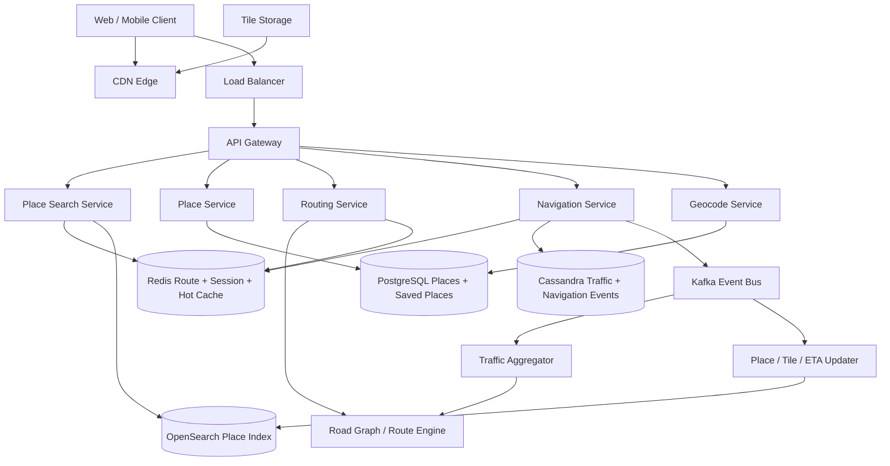
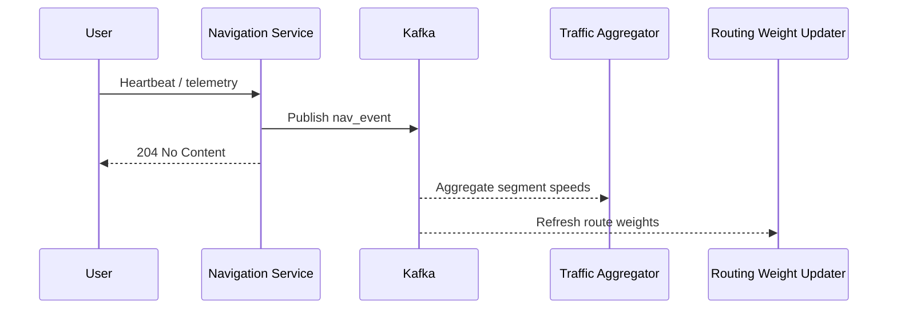
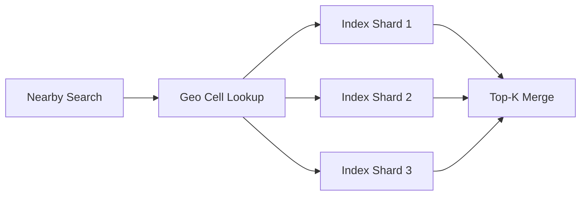
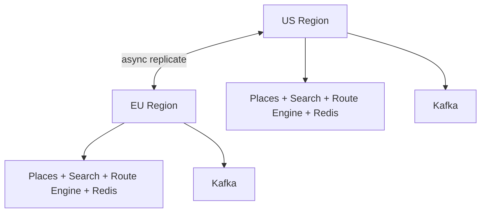

# Design Google Maps

Google Maps is a classic system design interview problem because it combines an enormous read-heavy **map serving and place discovery system** with a continuously updating **routing, traffic, and navigation pipeline**. Users expect panning and zooming to feel instant, search to find the right place nearby, and ETAs to stay credible even while traffic conditions change in real time.

The surface looks simple: open the map, search a place, get directions, start navigation. The depth lies in tile generation, geospatial indexing, road-graph routing, traffic aggregation, rerouting, hot-city skew, and deciding which data needs to be strongly correct versus merely fresh enough.

---

## Functional Requirements

**In Scope:**
- Users can pan and zoom the map and load vector or raster map tiles
- Users can search for places by name, category, and location
- The system supports geocoding and reverse geocoding
- Users can request routes for driving, walking, biking, and transit-like modes
- Active navigation sessions receive ETA refreshes and rerouting suggestions
- Users can view place details such as address, hours, rating, and photos
- Users can save favorite places and recent destinations
- The platform ingests traffic and navigation telemetry to improve ETAs

**Out of Scope:**
- Street View imagery capture and stitching internals
- Ride-hailing dispatch and marketplace logistics
- Ads and promoted places ranking internals
- Full offline-first world-map synchronization for long disconnected use
- HD maps for autonomous driving

---

## Non-Functional Requirements

| Property | Target | Reasoning |
|---|---|---|
| **Tile Latency** | p99 < 100ms from edge cache | Map pan and zoom must feel immediate |
| **Place Search Latency** | p99 < 200ms | Nearby search is interactive and often repeated during exploration |
| **Route Computation Latency** | p99 < 500ms for common city routes | Directions must return quickly enough to keep users engaged |
| **ETA Refresh Latency** | < 2-3s for active navigation sessions | Navigation must react to changing traffic and progress |
| **Availability** | 99.99% for map, search, and route reads | Maps is a utility product that users expect to always work |
| **Durability** | No loss of accepted place edits, saved places, or navigation history events that were acknowledged | User and business data should not disappear after commit |
| **Consistency** | Strong for saved places and accepted place edits; eventual for traffic, POI indexing, and ETA recalculation | Slightly stale traffic is acceptable; corrupted map metadata is not |
| **Scale** | Billions of tile requests/day, tens of millions of route requests/day, millions of concurrent navigation sessions | Global geographic skew dominates both serving and updates |

**Key tradeoff:** Google Maps prioritizes **fast map and route serving over perfectly fresh global traffic and place data everywhere**. A road closure taking a short time to propagate globally is acceptable. Slow map pan, bad routing correctness, or broken navigation state is not.

---

## Capacity Estimation

**Map tile traffic:**
- Assume **1B daily active users** and heavy repeated pan/zoom behavior
- A single session can request dozens to hundreds of tiles depending on movement and zoom level
- Total traffic can easily reach **10B-50B tile requests/day**, with heavy CDN offload but very high edge demand

**Search and routing traffic:**
- Assume **200M place searches/day** -> ~2.3K/sec average, but much higher during commute and travel peaks
- Assume **50M route requests/day** -> ~580/sec average, with large city and rush-hour spikes
- Route recomputation and rerouting multiply backend work beyond the initial route request

**Navigation telemetry:**
- Assume **10M concurrent navigation sessions** at peak
- If each client uploads one location heartbeat every 5 seconds, the platform ingests roughly **2M telemetry updates/sec** globally
- That data is highly skewed toward a relatively small set of dense metro corridors

**Storage:**
- Road graphs and place metadata fit in large but manageable structured datasets
- Tiles, snapshots, photos, traffic history, and telemetry archives push total storage into PB scale over time

---

## Core Entities

| Entity | Purpose | Key Fields | Relationships |
|---|---|---|---|
| **User** | End-user identity and preferences | `user_id`, `locale`, `home_region`, `created_at` | owns saved places and navigation history |
| **Place** | Canonical point of interest | `place_id`, `name`, `category_ids`, `lat`, `lng`, `status`, `updated_at` | appears in search, routes, and saved places |
| **RoadSegment** | Directed edge in the road graph | `segment_id`, `start_node_id`, `end_node_id`, `distance_m`, `speed_limit_kph`, `flags` | belongs to one graph partition |
| **MapTile** | Versioned map-rendering unit | `tile_id`, `zoom`, `x`, `y`, `style`, `version` | derived from roads, boundaries, and places |
| **TrafficObservation** | Telemetry-derived traffic sample | `segment_id`, `sample_ts`, `avg_speed_kph`, `confidence`, `source` | updates traffic models for road segments |
| **RoutePlan** | Computed route response snapshot | `route_id`, `origin`, `destination`, `mode`, `eta_sec`, `polyline`, `created_at` | references road segments |
| **NavigationSession** | Active turn-by-turn session | `session_id`, `user_id`, `route_id`, `current_segment_id`, `last_heartbeat_at` | streams telemetry and rerouting state |
| **SavedPlace** | User bookmark edge | `user_id`, `place_id`, `label`, `saved_at` | many-to-many between users and places |

**Critical modeling decisions:**
- `RoadSegment` is the authoritative routing primitive; directions are not computed from rendered tiles.
- `MapTile` is derived serving data. If a tile cache is lost, it can be regenerated from the road graph and map features.
- `TrafficObservation` is append-heavy telemetry, not a source-of-truth road definition. It continuously updates derived routing costs.

---

## Databases and Database Design

### Storage Tier Decisions

| Data | Access Pattern | Engine | Why |
|---|---|---|---|
| Places, saved places, accepted map edits | transactional writes, exact lookups, location-aware admin queries | **PostgreSQL + PostGIS** | strong consistency for curated place data and user bookmarks |
| Place search index | text + geo filtering, top-K retrieval | **OpenSearch / Elasticsearch** | ideal for nearby search, category filters, and ranking |
| Traffic telemetry and navigation events | append-heavy writes, segment-scoped reads, time windows | **Cassandra / ScyllaDB** | high write throughput with predictable partitioned reads |
| Hot tiles, route cache, navigation session state | sub-millisecond reads/writes, TTLs, hot geospatial keys | **Redis** | good fit for hot tile metadata, route cache, and active session state |
| Tile blobs, place photos, static map assets | write-once, read-many, globally cached | **Object Storage + CDN** | scalable and cost-effective for tile and media delivery |
| Telemetry, map edits, index refresh, reroute side effects | durable event stream | **Kafka** | decouples ingestion from traffic aggregation, indexing, and notifications |

This is intentionally polyglot. Google Maps has distinct workloads: **transactional place metadata**, **geo/text search**, **high-volume telemetry ingestion**, **hot ephemeral navigation state**, and **globally cached tile assets**.

### Schema 1 - Places (PostgreSQL + PostGIS)

```sql
CREATE TABLE places (
  place_id             UUID PRIMARY KEY DEFAULT gen_random_uuid(),
  name                 TEXT NOT NULL,
  category_ids         TEXT[] NOT NULL DEFAULT '{}',
  location             GEOGRAPHY(POINT, 4326) NOT NULL,
  status               VARCHAR(16) NOT NULL DEFAULT 'active',
  average_rating       DECIMAL(3,2) DEFAULT 0,
  updated_at           TIMESTAMPTZ DEFAULT NOW()
);

CREATE INDEX idx_places_location ON places USING GIST(location);
```

This is the source of truth for accepted place metadata, but it is not the primary nearby-search serving layer at scale.

### Schema 2 - Saved Places (PostgreSQL)

```sql
CREATE TABLE saved_places (
  user_id              UUID NOT NULL,
  place_id             UUID NOT NULL REFERENCES places(place_id),
  label                VARCHAR(32),
  saved_at             TIMESTAMPTZ DEFAULT NOW(),
  PRIMARY KEY (user_id, place_id)
);
```

### Schema 3 - Traffic Observations (Cassandra)

```sql
CREATE TABLE traffic_observations (
  segment_id           UUID,
  bucket_minute        TEXT,
  sample_ts            TIMESTAMP,
  observation_id       UUID,
  avg_speed_kph        DOUBLE,
  confidence           DOUBLE,
  source               TEXT,
  PRIMARY KEY ((segment_id, bucket_minute), sample_ts, observation_id)
) WITH CLUSTERING ORDER BY (sample_ts DESC, observation_id DESC);
```

Minute buckets prevent very hot road segments from becoming unbounded partitions while still enabling efficient recent-window reads.

### Schema 4 - Route Cache Metadata (PostgreSQL)

```sql
CREATE TABLE route_requests (
  route_id             UUID PRIMARY KEY DEFAULT gen_random_uuid(),
  origin_lat           DOUBLE PRECISION NOT NULL,
  origin_lng           DOUBLE PRECISION NOT NULL,
  destination_lat      DOUBLE PRECISION NOT NULL,
  destination_lng      DOUBLE PRECISION NOT NULL,
  mode                 VARCHAR(16) NOT NULL,
  eta_sec              INT NOT NULL,
  created_at           TIMESTAMPTZ DEFAULT NOW()
);
```

Long-lived route history can be persisted, but hot route serving should use cache and routing engines rather than depend on this table.

### Schema 5 - Navigation Events (Cassandra)

```sql
CREATE TABLE navigation_events (
  session_id           UUID,
  sample_ts            TIMESTAMP,
  event_id             UUID,
  lat                  DOUBLE,
  lng                  DOUBLE,
  heading              DOUBLE,
  speed_kph            DOUBLE,
  PRIMARY KEY (session_id, sample_ts, event_id)
) WITH CLUSTERING ORDER BY (sample_ts ASC, event_id ASC);
```

### Schema 6 - Logical Search Document

```json
{
  "place_id": "place_123",
  "name": "Blue Bottle Coffee",
  "categories": ["coffee", "cafe"],
  "location": { "lat": 37.776, "lon": -122.423 },
  "average_rating": 4.6,
  "is_open": true,
  "city": "San Francisco",
  "updated_at": "2026-06-03T10:00:00Z"
}
```

This denormalized search document keeps the hot search path off the transactional places database.

### Sharding and Replication Strategy

| Store | Shard Key | Strategy | Replication |
|---|---|---|---|
| Places / Saved Places | `place_id` or `user_id` | logical hash sharding after single-cluster growth | primary + read replicas |
| Traffic Observations | `(segment_id, bucket_minute)` | consistent hashing across Cassandra nodes | RF=3, `LOCAL_QUORUM` writes |
| Search Index | geo/text shard ranges | shard and replica fanout | 2-3 serving replicas |
| Redis | tile key, route key, session key | Redis Cluster | 1 replica per master |
| Kafka | `segment_id`, `place_id`, or `region_id` | partitioned durable log | RF=3 |
| Tile Assets | `zoom/x/y/version` | object-store namespace + CDN | multi-AZ replicated |

**Consistency model:**
- Strong consistency for saved places, accepted place edits, and permissioned user data
- Eventual consistency for traffic, place search freshness, ETA refresh, and tile regeneration

**Read/write patterns:**
- **Map view path:** client tile request -> CDN -> tile store fallback on miss -> rendered tile returned from nearest edge
- **Search path:** query + location -> Redis head cache -> OpenSearch geo/text retrieval -> place summary enrichment
- **Navigation path:** route request -> routing engine -> Redis hot route cache -> active session heartbeats -> Kafka + traffic aggregator -> reroute decisions

---

## API Design

**Search nearby places:**
```http
GET /v1/places/search?q=coffee&lat=37.776&lng=-122.423&radius_m=3000&cursor=eyJzY29yZSI6MTIzLjQ1fQ==&limit=20

200 OK
{
  "items": [
    {
      "place_id": "place_123",
      "name": "Blue Bottle Coffee",
      "average_rating": 4.6,
      "distance_m": 420,
      "is_open": true
    }
  ],
  "next_cursor": "eyJzY29yZSI6MTE4LjIyfQ==",
  "has_more": true
}
```

> Cursor-based pagination on ranking cursor. Offset pagination (`?page=N`) becomes unstable and expensive once search fans out across geo shards.

**Get place details:**
```http
GET /v1/places/place_123

200 OK
{
  "place_id": "place_123",
  "name": "Blue Bottle Coffee",
  "address": "300 Linden St, San Francisco, CA",
  "average_rating": 4.6,
  "hours": { "open_now": true },
  "photos": ["https://cdn.maps.example/p/photo_1.jpg"]
}
```

**Reverse geocode coordinates:**
```http
GET /v1/geocode/reverse?lat=37.776&lng=-122.423

200 OK
{
  "formatted_address": "300 Linden St, San Francisco, CA",
  "place_id": "place_123"
}
```

**Request a route:**
```http
POST /v1/routes
Authorization: Bearer <jwt>

{
  "origin": { "lat": 37.776, "lng": -122.423 },
  "destination": { "lat": 37.793, "lng": -122.396 },
  "mode": "driving"
}

201 Created
{
  "route_id": "route_789",
  "eta_sec": 960,
  "distance_m": 6200,
  "polyline": "encoded_polyline_here"
}
```

**Send navigation heartbeat:**
```http
PUT /v1/navigation/sessions/session_456/heartbeat
Authorization: Bearer <jwt>

{
  "lat": 37.779,
  "lng": -122.418,
  "heading": 75,
  "speed_kph": 28,
  "sent_at": "2026-06-03T10:04:00Z"
}

204 No Content
```

**Save a place:**
```http
POST /v1/users/me/saved-places
Authorization: Bearer <jwt>

{
  "place_id": "place_123",
  "label": "favorite"
}

201 Created
{
  "place_id": "place_123",
  "label": "favorite"
}
```

**Live navigation stream (SSE):**
```http
GET /v1/navigation/sessions/session_456/stream
Authorization: Bearer <jwt>
Accept: text/event-stream
```
Map browse and search remain standard request-response APIs. Persistent streaming is most useful for active navigation sessions where ETA and reroute updates matter continuously.

---

## High-Level Design



**Component responsibilities:**

| Component | Role |
|---|---|
| **API Gateway** | Auth, routing, rate limiting, regional steering |
| **Place Search Service** | Nearby place search, ranking, filtering, and result assembly |
| **Place Service** | Source-of-truth place details, saved places, and place metadata reads |
| **Geocode Service** | Forward and reverse geocoding lookups |
| **Routing Service** | Computes routes on the road graph using current edge weights |
| **Navigation Service** | Handles active navigation sessions, heartbeats, reroute checks, and ETA updates |
| **Road Graph / Route Engine** | Stores graph partitions and performs shortest-path computations |
| **Kafka** | Durable stream for telemetry, map edits, traffic aggregation, and indexing side effects |
| **Redis** | Route cache, hot tile metadata, active session state, and rate limits |
| **CDN + Tile Storage** | Globally serves tiles and static map assets close to the user |

**Route and navigation flow:**
1. Client -> `POST /v1/routes` -> API Gateway -> Routing Service
2. Routing Service reads graph weights, computes candidate routes, and returns the best route plus ETA
3. Client starts navigation and sends periodic heartbeats to Navigation Service
4. Heartbeats flow into Kafka and traffic aggregation, which updates segment speeds and routing weights asynchronously
5. Navigation Service compares the current session against updated graph costs and pushes ETA refreshes or reroutes when needed

---

## Deep Dives

### 1. Kafka: Required for Telemetry and Traffic Aggregation, Not Tile Serving

Kafka is required for a Google Maps-like platform, but not on the tile-serving path. Tile requests must be served from edge cache or tile storage as directly as possible. Kafka is required because navigation heartbeats, passive traffic observations, place edits, and map-quality events all feed multiple downstream consumers such as traffic aggregation, ETA updates, fraud filtering, and analytics.

If Navigation Service synchronously updated every downstream system before acknowledging a heartbeat or accepted map edit, latency and reliability would degrade immediately.



**Why the problem happens:** one telemetry event has many downstream consumers, but most do not belong on the user-facing critical path.

**Why it becomes difficult at scale:**
- telemetry is continuous and extremely high volume during commute peaks
- traffic, place quality, and ETA consumers have very different SLAs
- replay is necessary after incidents because aggregated traffic weights are derived state

**Production-grade solutions:**
- use topics such as `navigation.event`, `traffic.sample`, `place.updated`, and `tile.invalidate`
- keep events small: IDs, timestamps, coordinates, and deltas rather than full objects
- prioritize traffic and routing-weight consumers over low-priority analytics when lag grows
- use Kafka retention and replay to rebuild derived traffic state after outages

**Tradeoffs:** Kafka adds operational cost and eventual consistency for derived views, but it keeps telemetry ingestion scalable and resilient.

### 2. Redis: Hot Tiles, Route Cache, and Active Sessions

Redis is required because maps has a large amount of hot, low-latency state that is either repetitive or short-lived.

| Redis Use | Example Key | Why Redis Fits |
|---|---|---|
| **Route cache** | `route:drive:orig_hash:dest_hash:v42` | many common routes repeat for popular corridors |
| **Hot tile metadata** | `tile:z12:x654:y1583:v109` | hot downtown tiles are requested repeatedly |
| **Navigation session state** | `nav:session_456` | active session progress and last heartbeat are short-lived |
| **Rate limiting** | `rl:user:{user_id}:route_create` | protects expensive route computation APIs |

**Why the problem happens:** popular tiles, route requests, and active navigation sessions create strong locality and repetition.

**Why it becomes difficult at scale:**
- hot cities and commute corridors generate huge skew
- navigation sessions update frequently and expire naturally
- a cache stampede on popular tiles or routes can spill into expensive backend services

**Production-grade solutions:**
- cache only high-hit routes and tile metadata rather than every long-tail request
- use short TTLs and generation/version keys so invalidation is cheap when road weights or tiles change
- keep active navigation session state in Redis with heartbeat-driven TTL expiration
- coalesce misses on hot keys to prevent thundering herds on route engines or tile storage

**Tradeoffs:** Redis dramatically improves latency, but it introduces staleness windows that are acceptable for hot caches, not for authoritative place data.

### 3. Geospatial Search and Place Ranking

Place discovery is fundamentally a geo-indexing problem. A user searches `coffee` or `gas station`, and the system has to combine text relevance, proximity, popularity, open-now status, and map viewport context.

The wrong design is querying the transactional places store for every nearby search at scale. The right design is a geo-aware serving index with shard-local top-K retrieval and global merge.



**Why the problem happens:** map search must combine text relevance and geography in one interactive query.

**Why it becomes difficult at scale:**
- dense urban cells can contain huge candidate sets
- sparse areas need progressively wider search radii
- ranking is not just distance; quality, recency, and business state matter too

**Production-grade solutions:**
- partition the search index by geo cells such as geohash or H3 plus text shards
- retrieve shard-local top-K candidates and merge globally instead of scanning everything
- widen the search ring only until enough candidates are found
- cache popular nearby queries and viewport combinations

**Tradeoffs:** wider search radii improve recall but increase latency. Dense urban and sparse rural regions need different defaults.

### 4. Routing, Rerouting, and Road-Graph Computation

Directions are a graph problem, not a search-index problem. The road network is modeled as a weighted directed graph where segment costs depend on distance, speed limits, turn penalties, closures, traffic, and sometimes historical patterns.

**Why the problem happens:** users expect the fastest or most appropriate route, not merely the geographically shortest line.

**Why it becomes difficult at scale:**
- the graph is massive and must be partitioned efficiently
- live traffic continuously changes edge weights
- rerouting during navigation has tighter latency constraints than an initial route query

**Production-grade solutions:**
- partition the road graph geographically and use algorithms such as A*, contraction hierarchies, or hierarchical routing for faster shortest-path search
- maintain separate static graph structure and dynamic weight overlays so traffic refresh does not rewrite the whole graph
- cache hot origin-destination pairs and corridor subpaths where reuse is high
- reroute only when projected gains exceed a threshold to avoid noisy route churn

**Tradeoffs:** more aggressive rerouting improves freshness but can make navigation unstable if ETAs fluctuate too often.

### 5. WebSockets or SSE: Useful for Navigation, Not Required for Browsing

Google Maps does not need persistent realtime channels for basic map browsing, search, or one-off route requests. Those fit request-response APIs naturally. But active navigation benefits from push updates for ETA changes, traffic incidents, and reroute instructions.

**Why the problem happens:** the product surface has both static browse flows and live turn-by-turn flows with very different latency needs.

**Why it becomes difficult at scale:**
- millions of active navigation sessions can create large connection counts
- reconnect storms happen when phones change networks or go through tunnels
- some updates are useful only when materially relevant, not on every telemetry sample

**Production-grade solutions:**
- keep browse, search, and directions requests on HTTP/JSON
- use SSE or WebSockets only for active navigation sessions or fleet-style live tracking features
- throttle pushed updates to meaningful ETA or route changes rather than every raw telemetry point
- fall back to polling gracefully when persistent connections are not available

**Tradeoffs:** realtime push improves active navigation, but applying it to the whole product would add complexity without clear benefit.

### 6. Hot Regions, Commute Corridors, and Partition Skew

Traffic and map usage are geographically skewed. A handful of cities, highways, airports, and downtown corridors produce disproportionate search, route, and telemetry volume.

**Why the problem happens:** human mobility is concentrated spatially and temporally.

**Why it becomes difficult at scale:**
- a small set of road segments becomes extremely hot during commute windows
- popular city-center tiles can dominate edge and cache traffic
- one incident or closure can trigger sudden rerouting spikes in a localized region

**Production-grade solutions:**
- shard traffic aggregation and route serving by region or corridor, then split hot regions further as needed
- cache hot tiles and popular route segments aggressively
- isolate hot-segment telemetry aggregation so one corridor does not delay unrelated regions
- degrade gracefully by widening ETA uncertainty before dropping route correctness

**Tradeoffs:** special handling for hot regions adds complexity, but treating every region uniformly performs badly in real-world traffic patterns.

### 7. Multi-Region Deployment, Replication Lag, and Freshness

Maps is global, but active routing still benefits from regional serving close to the user. Traffic, tile versions, and place updates replicate across regions with some lag, so the system must decide where strict correctness matters.



**Why the problem happens:** users need low-latency map responses locally, but traffic and map data are globally shared.

**Why it becomes difficult at scale:**
- cross-region RTT hurts search and reroute latency
- traffic observations and place updates do not propagate everywhere at the same speed
- active-active editing of the same derived state can create inconsistent generations if not versioned carefully

**Production-grade solutions:**
- serve browse, search, and routing from the nearest healthy region
- replicate telemetry aggregates, tiles, and place-index updates asynchronously across regions
- version tile generations and routing-weight snapshots explicitly so stale updates do not overwrite fresher ones
- accept short-lived regional freshness differences instead of globally synchronizing every update

**Tradeoffs:** slight cross-region freshness skew is cheaper than globally serialized map and traffic updates.

### 8. Architecture Evolution

| Stage | Design | Why It Breaks | Next Step |
|---|---|---|---|
| **1. MVP** | Single metadata store, pre-rendered tiles, basic route API | search and routing overload one stack quickly | add search index, route engine, and CDN-backed tile serving |
| **2. Growth** | Separate tiles, place search, routing, and transactional place metadata | telemetry and traffic updates couple too tightly to serving | add Kafka ingestion, traffic aggregation, and Redis hot-state caches |
| **3. Scale** | Dedicated traffic, navigation, and geo-index systems | hot cities and commute corridors create partition skew | add regional partitioning, hot-corridor isolation, and cache generation versioning |
| **4. Global** | Multi-region map, search, and routing replicas with async replication | exact global freshness is too expensive | keep strong consistency only for source-of-truth place data and accept eventual global convergence |

This is the interview pattern to emphasize: keep the serving path fast, keep routing correctness explicit, and push telemetry aggregation and freshness work off the hot path whenever possible.
