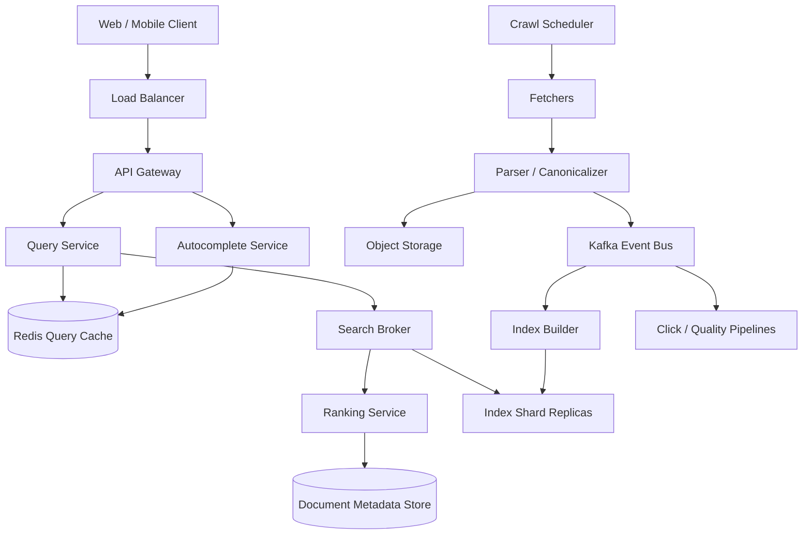
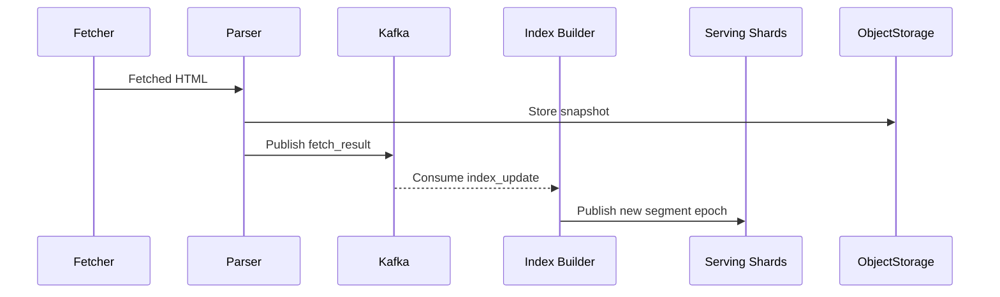
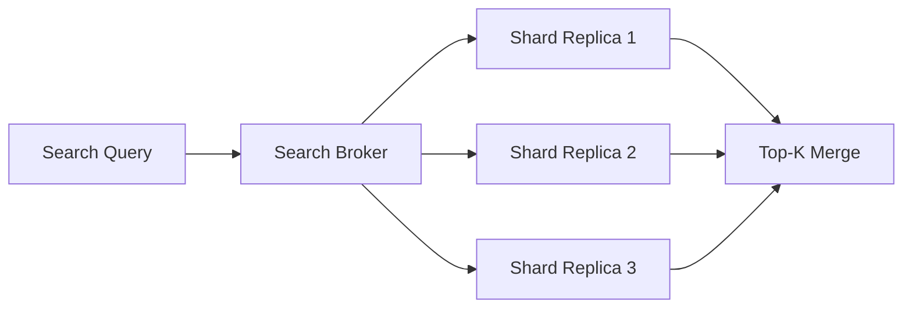
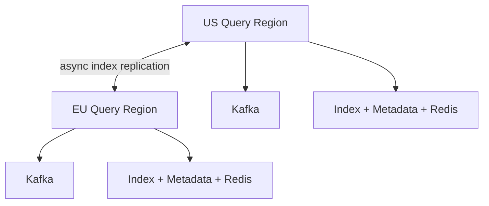

# Design Google Search

Google Search handles **billions of queries per day**, crawls a constantly changing web, and returns ranked results in a few hundred milliseconds. It is a strong interview problem because it forces you to design two very different systems at once: a write-heavy **crawl and indexing pipeline** and a latency-sensitive **query serving stack**.

The surface looks simple: type a query, get links. The depth lies in crawling politeness, canonicalization, inverted indexes, shard fanout, query ranking, hot-term skew, index freshness, and keeping the application tier off the heavy data path.

---

## Functional Requirements

**In Scope:**
- Crawl public web pages and discover new URLs
- Parse pages, canonicalize URLs, and build a searchable index
- Serve ranked web search results for keyword queries
- Support autocomplete, spelling correction, and snippet generation
- Return cached metadata such as title, URL, snippet, and last crawl time
- Track clicks and query refinements as ranking signals
- Keep results reasonably fresh as pages change

**Out of Scope:**
- Ads serving and auction systems
- Image, video, maps, and shopping vertical search internals
- Large language model answer generation
- Full SafeSearch and malware scanning internals
- Browser sync, account history UI, and personalization model training

---

## Non-Functional Requirements

| Property | Target | Reasoning |
|---|---|---|
| **Query Latency** | p99 < 200ms | Search feels broken if responses are visibly slow |
| **Autocomplete Latency** | p99 < 50ms | Users type continuously; suggestions must feel instant |
| **Availability** | 99.99% for query serving | Search is a core utility product with global expectations |
| **Durability** | No loss of crawl state, document metadata, or index segments | Rebuilding everything from scratch is too expensive |
| **Consistency** | Eventual for fresh results and counters; strong for admin policies and crawl ownership | A page appearing a minute late is acceptable; policy corruption is not |
| **Scale** | Billions of queries/day, tens of billions of indexed documents | Every design choice is shaped by fanout and storage scale |
| **Reliability** | Graceful degradation under hot-query spikes and shard failures | A popular breaking-news query cannot overload the entire fleet |

**Key tradeoff:** Google Search optimizes for **fast, cheap query serving over perfectly fresh global state**. A result set that is a few minutes stale is usually acceptable. A slow query is not. That is why indexing is asynchronous and why serving relies on immutable index segments, caches, and shard-level fanout.

---

## Capacity Estimation

**Queries:**
- Assume **8.5B queries/day** -> ~100K queries/sec average
- Peak traffic is often 8-10x average -> **~1M queries/sec** at peak
- Autocomplete can be several times higher than search QPS because users type multiple characters per query

**Crawling:**
- Assume **20B fetches/day** across the active crawl frontier -> ~230K fetches/sec average
- Crawl traffic is bursty and constrained by politeness rules per host, not only by fleet capacity

**Index size:**
- Assume **100B indexed documents**
- If the compressed inverted + forward index footprint averages 50 KB/document, hot serving data is **~5 PB** before replicas
- With 3 replicas and multiple regions, practical storage reaches **tens of PB**

**Internal fanout:**
- A single query may fan out to hundreds or thousands of logical shard replicas
- User QPS is large; internal shard QPS is much larger

---

## Core Entities

| Entity | Purpose | Key Fields | Relationships |
|---|---|---|---|
| **Document** | Canonical searchable web page | `doc_id`, `canonical_url`, `host_hash`, `title`, `language`, `page_rank`, `latest_version_id` | has many fetched versions and postings |
| **DocumentVersion** | One fetched snapshot of a page | `version_id`, `doc_id`, `content_hash`, `fetch_time`, `http_status`, `object_key` | belongs to one document; produces parsed fields |
| **CrawlTask** | URL waiting to be fetched | `url`, `host_hash`, `priority`, `next_fetch_at`, `depth`, `discovery_source` | consumed by fetchers; updates host state |
| **HostState** | Per-host crawl policy and health | `host_hash`, `robots_etag`, `crawl_delay_ms`, `last_fetch_at`, `quality_score` | used to schedule crawl tasks safely |
| **PostingList** | Term-to-document mapping in the inverted index | `term_hash`, `shard_id`, `doc_id`, `field_mask`, `term_weight` | derived from parsed document versions |
| **QuerySession** | One user search request | `query_id`, `query_text`, `locale`, `issued_at`, `cursor` | produces impressions and clicks |
| **ClickEvent** | Ranking feedback signal | `query_id`, `doc_id`, `position`, `clicked_at`, `dwell_ms` | linked to a query session and document |

**Critical modeling decisions:**
- `Document` and `DocumentVersion` are separate because freshness and deduplication are versioned problems, not just URL problems.
- `PostingList` is derived state, not a source-of-truth row. If needed, it can be rebuilt from parsed document versions.
- `HostState` is first-class because crawl scale is limited by politeness and host health, not just by how many fetchers you own.

---

## Databases and Database Design

### Storage Tier Decisions

| Data | Access Pattern | Engine | Why |
|---|---|---|---|
| Crawl frontier and document metadata | massive key-value writes, host- and doc-scoped reads | **Bigtable / Cassandra-like wide-column store** | predictable write throughput and easy partitioning |
| Inverted and forward index | read-heavy, immutable segment serving, top-k scans | **Custom distributed search index on SSD + object storage** | generic SQL/NoSQL stores are not efficient enough for ranked term retrieval at this scale |
| Admin policies and manual quality overrides | low write volume, exact updates, rich filtering | **PostgreSQL** | strong consistency and operational simplicity |
| Query cache, autocomplete cache, rate limits | sub-millisecond reads, TTLs, hot keys | **Redis** | ideal for head-query caching and short-lived coordination |
| Raw page snapshots and parsed artifacts | write-once, read-many | **Object Storage** | cheap durable storage for fetched content and index build inputs |
| Clicks, query logs, index update events | append-only streams with multiple consumers | **Kafka** | decouples crawl, indexing, serving, and analytics |

A pure SQL design does not fit search. SQL is useful for operational control data. The serving plane is fundamentally built on wide-column storage, immutable index segments, caches, and event pipelines.

### Schema 1 - Documents (Wide-Column)

```sql
CREATE TABLE documents_by_id (
  doc_id              BIGINT,
  canonical_url       TEXT,
  host_hash           BIGINT,
  title               TEXT,
  language            VARCHAR(8),
  page_rank           FLOAT,
  latest_version_id   UUID,
  index_state         VARCHAR(16),
  updated_at          TIMESTAMP,
  PRIMARY KEY (doc_id)
);
```

This is the primary metadata lookup during ranking and snippet assembly. It is not the full content store.

### Schema 2 - Document Versions (Wide-Column + Object Storage)

```sql
CREATE TABLE document_versions_by_doc (
  doc_id              BIGINT,
  fetch_time          TIMESTAMP,
  version_id          UUID,
  content_hash        CHAR(64),
  http_status         SMALLINT,
  object_key          TEXT,
  parse_status        VARCHAR(16),
  PRIMARY KEY (doc_id, fetch_time, version_id)
) WITH CLUSTERING ORDER BY (fetch_time DESC, version_id DESC);
```

The large page body lives in object storage at `object_key`. The table stores only the fetch metadata and version pointer.

### Schema 3 - Crawl Frontier (Wide-Column)

```sql
CREATE TABLE crawl_frontier (
  host_hash           BIGINT,
  next_fetch_at       TIMESTAMP,
  url_hash            BIGINT,
  url                 TEXT,
  priority            FLOAT,
  depth               INT,
  discovery_source    TEXT,
  PRIMARY KEY ((host_hash), next_fetch_at, url_hash)
) WITH CLUSTERING ORDER BY (next_fetch_at ASC, url_hash ASC);
```

Partitioning by `host_hash` makes host-level politeness easy: workers fetch the earliest eligible URLs for a host without scanning the whole frontier.

### Schema 4 - Host State (PostgreSQL)

```sql
CREATE TABLE host_policies (
  host_hash           BIGINT PRIMARY KEY,
  crawl_delay_ms      INT         NOT NULL DEFAULT 1000,
  robots_etag         TEXT,
  manual_blocked      BOOLEAN     NOT NULL DEFAULT FALSE,
  quality_tier        VARCHAR(16) NOT NULL DEFAULT 'normal',
  updated_at          TIMESTAMPTZ DEFAULT NOW()
);
```

This is intentionally SQL because manual overrides, abuse rules, and operational audits need exactness and easy tooling.

### Schema 5 - Posting Lists (Logical Inverted Index)

```sql
CREATE TABLE term_postings (
  term_hash           BIGINT,
  shard_id            INT,
  block_id            BIGINT,
  doc_id              BIGINT,
  field_mask          INT,
  term_weight         FLOAT,
  positions_blob      BLOB,
  PRIMARY KEY ((term_hash, shard_id), block_id, doc_id)
);
```

This is a logical schema. In production, postings are usually stored as compressed immutable blocks on SSD, not row-by-row in a general-purpose database.

### Schema 6 - Query Click Events (Wide-Column / Log Sink)

```sql
CREATE TABLE click_events_by_query (
  query_id            UUID,
  clicked_at          TIMESTAMP,
  doc_id              BIGINT,
  position            INT,
  dwell_ms            BIGINT,
  PRIMARY KEY (query_id, clicked_at, doc_id)
) WITH CLUSTERING ORDER BY (clicked_at ASC, doc_id ASC);
```

These events feed ranking and quality systems. They are append-only and tolerate eventual downstream processing.

### Sharding and Replication Strategy

| Store | Shard Key | Strategy | Replication |
|---|---|---|---|
| Document Metadata | `doc_id` | hash partitioning across tablet servers | RF=3, local quorum writes |
| Crawl Frontier | `host_hash` | host-based partitioning for politeness | RF=3 |
| Inverted Index | term/range shards with replica groups | shard + replica fanout | 2-3 serving replicas per shard, multi-region |
| Redis | query hash / prefix hash | Redis Cluster | 1 replica per shard |
| PostgreSQL Policies | single primary or small shard set | operational SQL cluster | primary + read replicas |

**Consistency model:**
- Strong consistency for admin policies, crawl ownership markers, and manual quality blocks
- Eventual consistency for document freshness, click signals, cached snippets, and result ordering across regions

**Read/write patterns:**
- **Crawl path:** frontier -> fetchers -> parser -> object storage + Kafka -> index builder -> segment publish
- **Query path:** query service -> Redis cache -> shard fanout -> rank merge -> metadata/snippet fetch -> result return
- **Serving path:** immutable segments are copied to shard replicas; queries never block on crawl-time parsing

---

## API Design

**Search web results:**
```http
GET /v1/search?q=distributed+systems&cursor=eyJzY29yZSI6MTIzfQ==&limit=10&locale=en-US

200 OK
{
  "results": [
    {
      "doc_id": 91238123,
      "title": "Distributed Systems Notes",
      "url": "https://example.com/distributed-systems",
      "snippet": "A practical introduction to consensus, sharding, and replication...",
      "last_crawled_at": "2026-06-03T09:58:00Z"
    }
  ],
  "next_cursor": "eyJzY29yZSI6MTE0fQ==",
  "has_more": true
}
```

> Cursor-based pagination on score and shard merge position. Offset pagination (`?page=N`) becomes unstable and expensive once ranking and freshness are changing continuously.

**Autocomplete suggestions:**
```http
GET /v1/autocomplete?prefix=distrib&limit=5&locale=en-US

200 OK
{
  "suggestions": [
    "distributed systems",
    "distributed systems design",
    "distributed tracing"
  ]
}
```

**Fetch cached result metadata:**
```http
GET /v1/results/91238123

200 OK
{
  "doc_id": 91238123,
  "canonical_url": "https://example.com/distributed-systems",
  "title": "Distributed Systems Notes",
  "snippet": "A practical introduction to consensus, sharding, and replication...",
  "language": "en",
  "last_crawled_at": "2026-06-03T09:58:00Z"
}
```

**Record click feedback:**
```http
POST /v1/click-events
Content-Type: application/json

{
  "query_id": "7c2a0f3e-930d-45b4-9067-6d19b7f03df5",
  "doc_id": 91238123,
  "position": 2,
  "clicked_at": "2026-06-03T10:00:04Z"
}

202 Accepted
{ "status": "accepted" }
```

**Submit fetched document for indexing (internal gRPC):**
```proto
rpc SubmitFetchResult(FetchResult) returns (FetchAck);

message FetchResult {
  string url = 1;
  int64 doc_id = 2;
  string object_key = 3;
  int32 http_status = 4;
  int64 fetch_epoch_ms = 5;
}

message FetchAck {
  string status = 1;
}
```

**Invalidate query cache by index epoch (internal):**
```http
POST /internal/v1/cache/invalidate
Content-Type: application/json

{
  "index_epoch": 48293,
  "affected_prefixes": ["distributed", "consensus"]
}

202 Accepted
{ "status": "scheduled" }
```

Core search is request-response. WebSockets are not part of the primary product path.

---

## High-Level Design



**Component responsibilities:**

| Component | Role |
|---|---|
| **API Gateway** | Request routing, auth for internal APIs, rate limiting, regional steering |
| **Query Service** | Parses queries, checks cache, invokes search broker, returns ranked results |
| **Autocomplete Service** | Serves prefix suggestions and spelling candidates with very low latency |
| **Search Broker** | Fans queries out to shard replicas and merges partial top-k results |
| **Ranking Service** | Applies BM25-like relevance, link signals, freshness, language, and quality features |
| **Crawl Scheduler** | Maintains crawl frontier, enforces host politeness, and allocates fetch work |
| **Fetchers** | Download pages while respecting robots and host quotas |
| **Parser / Canonicalizer** | Extracts text, links, titles, canonical URLs, and dedup signals |
| **Kafka** | Durable event backbone for fetch results, clicks, and index update side effects |
| **Redis** | Head-query cache, autocomplete cache, and rate-limit buckets |

**Search query flow:**
1. Client → `GET /v1/search` → API Gateway → Query Service
2. Query Service checks Redis for a cached head-query result; on miss it calls the Search Broker
3. Search Broker fans the query out to relevant shard replicas and asks each for local top-k candidates
4. Ranking Service merges candidates, fetches document metadata and snippets, and produces the final ranked page
5. Query Service returns results and asynchronously emits impression/click context for downstream ranking pipelines

---

## Deep Dives

### 1. Kafka: Required for Crawl and Index Pipelines

For Google Search, Kafka is required - but not on the query-serving critical path. Search queries must stay synchronous and low-latency. Kafka exists because crawling, parsing, click feedback, and index publishing are naturally asynchronous and have many downstream consumers.

If the crawler synchronously called the parser, index builder, quality systems, snippet generator, and analytics pipeline for every fetch, the crawl frontier would stall behind the slowest dependency. The same applies to clicks and query logs.



**Why the problem happens:** one fetch or click creates side effects for many independent systems.

**Why it becomes difficult at scale:**
- crawl throughput is huge and bursty
- index builds are CPU-heavy and can lag behind fetches
- retries and duplicate events are inevitable

**Production-grade solutions:**
- separate topics such as `crawl.fetch_result`, `index.segment_publish`, and `query.click`
- keep messages small by sending pointers like `doc_id` and `object_key`, never raw page bodies
- use idempotent consumers keyed by `doc_id + version_id`
- prioritize segment publish and frontier updates over low-priority analytics when lag grows

**Tradeoffs:** Kafka adds operational overhead, but it gives replay, backpressure absorption, and clean separation between crawl, serving, and analytics.

### 2. Redis: Head Queries, Autocomplete, and Rate Limits

Redis is required because search has many tiny, repetitive reads on hot prefixes and head queries.

| Redis Use | Example Key | Why Redis Fits |
|---|---|---|
| **Query cache** | `q:distributed+systems:en-US:v48293` | hot queries repeat constantly and benefit from short-lived caching |
| **Autocomplete cache** | `ac:distrib:en-US` | suggestions must be returned in a few milliseconds |
| **Rate limiting** | `rl:ip:203.0.113.7:search` | simple token buckets protect against abuse and scraping |

**Why the problem happens:** head queries and popular prefixes are requested repeatedly, especially during breaking news.

**Why it becomes difficult at scale:**
- cache invalidation is tied to index freshness
- long-tail queries have low reuse, so caching everything wastes memory
- hot keys can create stampedes on shard replicas

**Production-grade solutions:**
- cache only head queries and autocomplete prefixes, not the entire long tail
- version keys by `index_epoch` so new segments can invalidate safely without deleting everything
- use stale-while-revalidate for head queries when freshness tolerance allows it
- coalesce misses so one hot query does not trigger a thundering herd

**Tradeoffs:** Redis is cheap relative to query fanout, but memory is still expensive. Over-caching the long tail provides little value.

### 3. Fanout and Scatter-Gather Across Shards

Search is a textbook scatter-gather system. A user sends one query; the broker fans it out to many shard replicas, each computes local top-k matches, and the broker merges them into a final result page.

The hardest issue is not average latency. It is tail latency. One slow shard can dominate the whole query.



**Why the problem happens:** the inverted index is partitioned, so no single machine has the full answer.

**Why it becomes difficult at scale:**
- common queries touch many shards and very large posting lists
- network fanout amplifies small broker inefficiencies
- the query is only as fast as the slowest critical shard response

**Production-grade solutions:**
- use replica selection and hedged requests to cut tail latency
- ask each shard for a slightly larger local top-k than strictly needed, then merge centrally
- maintain champion lists or top-doc shortcuts for very common terms
- early-terminate shard scans once enough high-confidence results are available

**Tradeoffs:** aggressive early termination reduces latency and cost, but it can slightly reduce recall for rare relevant documents.

### 4. Hot Partitions, Term Skew, and Viral Queries

Not all terms are equal. Queries like "weather", "youtube", or a breaking-news topic create enormous posting lists and heavy cache concentration. The same thing happens on the crawl side when one host suddenly exposes millions of discoverable URLs.

**Why the problem happens:** popularity follows a heavy-tail distribution. A small set of terms and domains drives a disproportionate amount of traffic.

**Why it becomes difficult at scale:**
- very common terms can overload specific index shards or caches
- one hot query can dominate broker traffic globally
- a large host can consume too much crawl budget if frontier scheduling is naive

**Production-grade solutions:**
- use stop words, term pruning, and compressed skip data for very common terms
- split hot shards or replicate them more aggressively than average shards
- partition crawl frontier by `host_hash` and enforce per-host budgets
- shard hot query counters and cache them independently from long-tail traffic

**Tradeoffs:** special-casing hot terms and hosts adds operational complexity, but a uniform strategy performs badly at internet scale.

### 5. Ordering, Freshness, and Replication Lag

Freshness is an ordering problem. A crawler may fetch version `N+1` of a page, while a delayed indexer is still processing version `N`. If the older version publishes later, stale content can overwrite fresh content.

That same issue appears across regions. One region may have already published a newer segment epoch while another still serves the previous one.

**Why the problem happens:** crawls, parsing, and indexing are asynchronous and can complete out of order.

**Why it becomes difficult at scale:**
- huge backlogs make out-of-order completion common
- index publication is multi-stage and often multi-region
- click and quality features may lag behind newly published documents

**Production-grade solutions:**
- stamp every fetched document with a monotonic `version_id` or fetch epoch
- publish index segments immutably and switch serving via atomic index-epoch pointers
- reject stale index updates when `version_id < latest_version_id`
- accept short-lived cross-region freshness lag rather than globally synchronizing every publish

**Tradeoffs:** globally synchronized freshness is too expensive for the hot path. Atomic epoch publish plus eventual regional convergence is the practical answer.

### 6. WebSockets and Offline Delivery: Usually Not Required

Core web search does not require WebSockets. Search is naturally request-response, and autocomplete is still cheap over short-lived HTTP calls. Long-lived connections add state management without improving result quality or latency enough to justify them.

Offline delivery is also not a core requirement for Google Search. Browsers and apps can cache recent pages locally, but the serving system itself should not be optimized around offline query execution.

**Why the problem happens:** candidates often add real-time infrastructure because it feels modern, not because the product needs it.

**Why it becomes difficult at scale:**
- persistent connections consume memory and connection slots
- reconnect storms happen during failures or deploys
- offline indexes on clients create consistency and storage problems with little product benefit

**Production-grade solutions:**
- keep search and autocomplete stateless over HTTP
- use client-side caching for recent results or query history if needed
- reserve WebSockets for adjacent products like live dashboards, not core search serving

**Tradeoffs:** avoiding WebSockets here is not a limitation. It is the simpler and more scalable design.

### 7. Multi-Region Deployment, Queue Backpressure, and Rate Limiting

Search must be served from multiple regions close to users. Queries should hit the nearest healthy region, while index builds and crawl pipelines can replicate asynchronously. The serving plane must continue even if one crawler region or one index-publish pipeline is behind.



**Why the problem happens:** query traffic is global, but crawl and indexing backlogs are uneven and region-specific.

**Why it becomes difficult at scale:**
- cross-region round trips are too slow for the query path
- crawl spikes or shard rebuilds can cause queue lag
- search endpoints attract scraping, abuse, and bot traffic

**Production-grade solutions:**
- route user queries to the nearest healthy query region with local shard replicas
- let crawl and index pipelines replicate asynchronously across regions
- when backpressure rises, prioritize frontier updates and new-segment publication over low-priority analytics
- use Redis-backed token buckets for search, autocomplete, and internal crawl APIs

**Tradeoffs:** some regions will briefly serve slightly older results than others. That is much cheaper than forcing global synchronous index updates.
