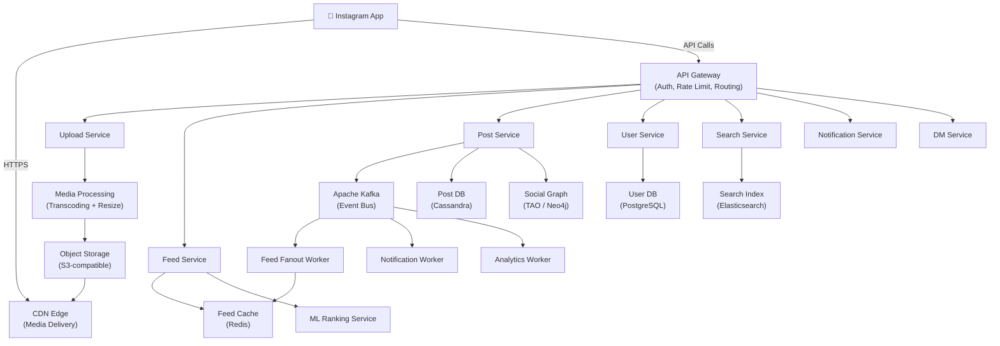
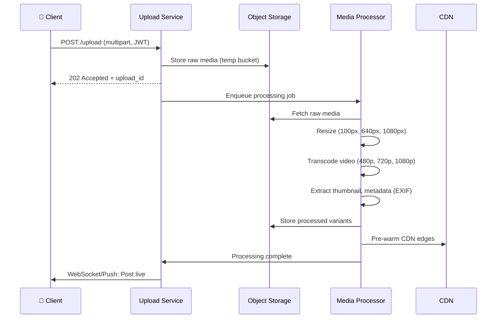
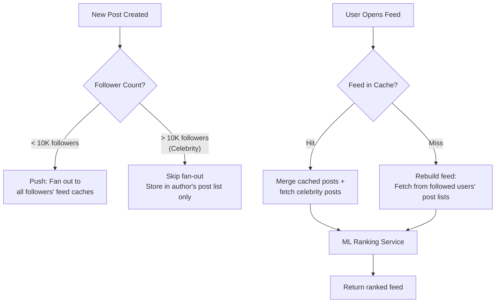
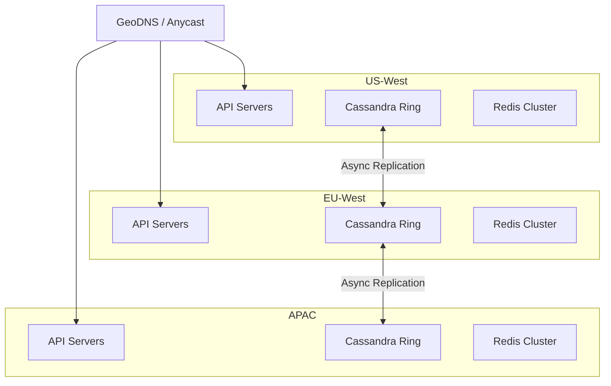
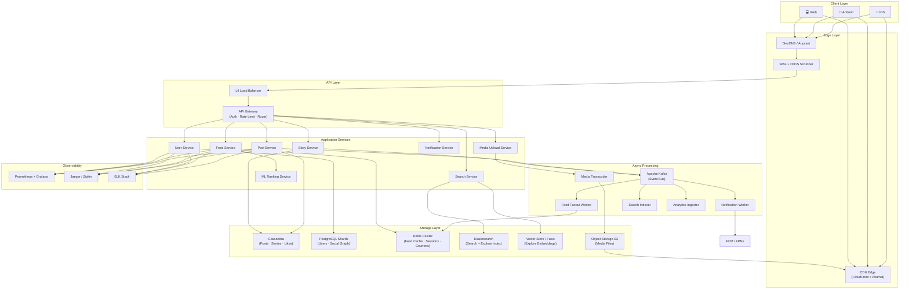

# Designing Instagram: A Production-Scale Photo & Video Sharing Platform

> **Difficulty:** Medium | **Category:** Social Media / Content Platform | **Companies:** Meta, Pinterest, Flickr, TikTok, Snapchat

---

## Introduction

Instagram is a photo and video sharing social network with **2 billion+ monthly active users**, **100 million+ photos and videos uploaded daily**, and **4.2 billion likes per day**. Users follow each other, post content (photos, videos, Reels, Stories), interact via likes/comments, and consume a personalized algorithmic feed.

What makes Instagram architecturally fascinating is the **intersection of three fundamentally different hard problems**:

1. **Content ingestion at scale** — uploading, transcoding, and storing 100M media files/day
2. **Feed generation** — algorithmically ranking and delivering personalized feeds for 2B users
3. **Social graph** — managing follow relationships and computing social signals across billions of edges

Add to this: Stories (ephemeral content), Reels (short-form video), Live (real-time streaming), DMs (messaging), and Search — and you have one of the most architecturally complex products in existence.

Instagram was acquired by Facebook for $1 billion in 2012 when it had **13 employees**. Its original architecture (Python/Django + PostgreSQL + Nginx) scaled to 30M users. That stack didn't survive 2B users — understanding what changed and why is the real interview insight.

---

## Requirements Clarification

### Functional Requirements

- **Post creation** — upload photos/videos with captions, tags, and location
- **Follow/Unfollow** — users follow other users; feed built from followed users' posts
- **News feed** — personalized, ranked feed of posts from followed accounts
- **Likes & Comments** — interact with posts
- **Stories** — ephemeral content, expires in 24 hours
- **Reels** — short-form video (up to 90 seconds), algorithmic discovery
- **Search & Explore** — search users, hashtags; content discovery
- **Notifications** — likes, comments, follows, mentions
- **Direct Messages** — private 1:1 and group messaging

### Non-Functional Requirements

- **High availability** — 99.99% uptime; feeds should load even if ranking service is degraded
- **Low latency** — feed load < 200ms, media upload feedback < 500ms
- **Eventual consistency acceptable** — a like count being off by a few seconds is fine
- **High read throughput** — reads vastly outnumber writes (read:write ratio ~100:1)
- **Durability** — uploaded content must never be lost
- **CDN-first** — media must be served from edge globally
- **Scalability** — support 2B users, 100M uploads/day, 4.2B likes/day

### Out of Scope

- Instagram Shopping / Ads engine
- Live streaming (separate real-time video subsystem)
- IGTV (long-form video)

---

## Capacity Estimation

### Users & Traffic

| Metric | Estimate |
|---|---|
| Monthly Active Users (MAU) | 2 billion |
| Daily Active Users (DAU) | 500 million |
| Posts uploaded per day | 100 million |
| Likes per day | 4.2 billion |
| Feed requests per day | ~10 billion |
| Peak feed RPS | ~500,000 requests/sec |
| Peak upload RPS | ~1,200 uploads/sec |
| Stories views per day | 500 million |

### Storage Estimation

**Photos:**
- ~70% of uploads are photos; avg compressed size: 3 MB
- 70M photos/day × 3 MB = **210 TB/day**
- Multiple resolutions stored (thumbnail 100px, medium 640px, full 1080px): ~3× = **630 TB/day**

**Videos:**
- ~30% of uploads are videos; avg transcoded size: 50 MB (multiple bitrates)
- 30M videos/day × 50 MB = **1.5 PB/day**

**Total media storage: ~2.1 PB/day**

- With 7-year retention: ~5.3 EB (exabytes) total
- S3-Glacier for content older than 6 months (80% cost reduction)

### Metadata Storage

- Post metadata: ~500 bytes/post × 100M = **50 GB/day**
- Likes: ~50 bytes × 4.2B = **210 GB/day**
- Follows (social graph edges): ~2B users × avg 200 follows × 50 bytes = **20 TB** (graph)

### Bandwidth

- Feed: 500K RPS × avg 10 posts × 3 media URLs = resolved via CDN
- CDN egress: ~50 TB/hour at peak (Meta serves ~100 Tbps at edge)
- Upload ingress: 1,200 uploads/sec × avg 3 MB = **~3.6 GB/s** inbound

---

## High-Level Architecture

Instagram's architecture separates cleanly into five major planes:

1. **Write path** — post ingestion, media processing, metadata storage
2. **Read path** — feed generation, media delivery
3. **Social graph** — follow relationships, social signals
4. **Discovery** — search, Explore, hashtags
5. **Interaction path** — likes, comments, notifications



---

## Core Components Deep Dive

### 1. API Gateway

The API Gateway is the single entry point for all client traffic. It handles:

- **TLS termination** — offloads SSL from application servers
- **Authentication** — validates JWT/OAuth tokens before forwarding
- **Rate limiting** — per-user and per-IP limits (prevents abuse and DDoS)
- **Request routing** — routes to appropriate microservice
- **Request/Response transformation** — protocol bridging (HTTP → gRPC internally)
- **Circuit breaking** — fast-fails if downstream services are overloaded

Instagram uses a combination of **Nginx** at the edge and internal service mesh (**Envoy**) for east-west traffic.

### 2. Upload Service & Media Processing Pipeline

This is the most complex write-path component. When a user uploads a photo or video:



**Why async processing?**
- Video transcoding is CPU-intensive (a 60-second video can take 30-120 seconds to transcode)
- Client gets immediate feedback while processing happens in the background
- Worker pools can scale independently of the upload endpoint

**Media variants stored:**
- Photos: `thumb_100`, `medium_640`, `standard_1080`, `original`
- Videos: `360p`, `480p`, `720p`, `1080p`, HLS manifest for adaptive streaming
- Stories: 750×1334 (9:16 aspect ratio), compressed HEVC

### 3. Post Service & Event Sourcing

When a post is created, the Post Service:
1. Writes post metadata to Cassandra
2. Publishes a `post.created` event to Kafka

Everything downstream (feed fanout, notifications, search indexing, analytics) is driven by Kafka events. This decoupling is critical — the Post Service doesn't need to know about feed logic or notification logic.

### 4. Feed Generation — The Hardest Problem

Instagram's feed is **algorithmic**, not chronological. This is architecturally the most challenging component.

**Two approaches to feed generation:**

| Strategy | Description | Used When |
|---|---|---|
| **Push (Fanout on write)** | On post creation, fan out to all followers' feed caches | User has < N followers (e.g., < 10K) |
| **Pull (Fanout on read)** | When a user opens the feed, pull posts from followed accounts | User is a celebrity (millions of followers) |

**Hybrid approach (what Instagram actually uses):**



**Why not pure push?**
- Kylie Jenner has 400M followers. One post = 400M write operations to feed caches. At ~1 post/hour, that's ~110K writes/sec just for one account.
- This is the classic **celebrity problem** / **hot key problem**.

**Why not pure pull?**
- If a user follows 1000 accounts and all are active, pulling 1000 post lists on every feed load is too slow and expensive.
- Most users follow < 1000 accounts; average follower count is < 500.

### 5. ML Ranking Service

The Ranking Service scores and orders feed candidates using signals:

- **Affinity** — how often does the user interact with this account?
- **Post quality** — image quality score (ML model), video completion rate
- **Recency** — newer posts ranked higher, all else equal
- **Interest graph** — hashtags, topic clusters the user engages with
- **Social proof** — how many of user's followees liked this?

The ranking model runs as a **low-latency inference service** (< 20ms per feed request) using pre-computed feature vectors stored in a feature store (Redis + Cassandra).

### 6. Social Graph (TAO)

Instagram's social graph (who follows whom) is stored in **TAO** — Meta's distributed social graph store, built on top of MySQL shards with a tiered memory cache.

- **Object types:** `User`, `Post`, `Comment`, `Like`
- **Association types:** `follows`, `liked_by`, `commented_on`, `tagged_in`
- TAO supports **association counts** (follower count, like count) as first-class cached values
- Reads served from in-memory cache (L1/L2), writes to MySQL with async cache invalidation

For companies without TAO: **Neo4j** or **Amazon Neptune** for smaller scales; **custom sharded MySQL** for larger.

### 7. Search & Explore

```
Search index (Elasticsearch):
  - Users: indexed by username, display_name
  - Hashtags: indexed with post_count, trending_score
  - Locations: geo-indexed
  - Posts: indexed for Explore (visual embeddings, not full-text)
```

Explore is an **embedding-based retrieval** system:
1. Every post gets a visual embedding (ResNet/CLIP model) stored in a **vector store** (Faiss / Pinecone)
2. User interest profile = average of embeddings of liked/engaged posts
3. Explore = approximate nearest-neighbor search in embedding space

### 8. Notification Service

Notifications are driven entirely by Kafka events:

```
Events → Kafka → Notification Worker → [
  Push (FCM/APNs) for mobile
  In-app notification (WebSocket push)
  Email (for certain events)
]
```

**Batching strategy:** Notifications are batched within a 5-second window to avoid spamming users. "Alice, Bob, and 47 others liked your photo" is a single notification, not 49.

### 9. Stories

Stories are ephemeral — they disappear after 24 hours. Implementation:

- Stored in a **separate Cassandra table** with TTL = 86400 seconds
- Viewed-by list stored in Redis (expires with TTL)
- Story ring order: unviewed stories appear first, ordered by closeness score
- On expiry: Cassandra auto-deletes; CDN cache purged; object storage file retained for 30 days (for abuse reporting)

---

## Database Design

### Storage Tier Decisions

| Data | Store | Justification |
|---|---|---|
| Post metadata | Cassandra | Write-heavy, time-series access, TTL support |
| User profiles | PostgreSQL | Strong consistency, relational joins |
| Social graph (follows) | MySQL via TAO | Consistent counts, graph traversal |
| Feed cache | Redis | Sub-ms feed reads, sorted sets |
| Likes (counters) | Redis + async flush to Cassandra | High-frequency increments |
| Stories | Cassandra (with TTL) | Auto-expiry, write-heavy |
| Search index | Elasticsearch | Full-text, geo, faceting |
| Media files | S3-compatible Object Storage | Unlimited scale, 11 nines durability |
| Embeddings (Explore) | Faiss / Pinecone | ANN search on vectors |
| Analytics | ClickHouse / Druid | OLAP, columnar, aggregations |

### Post Schema (Cassandra)

```sql
CREATE TABLE posts (
    user_id         UUID,
    post_id         TIMEUUID,
    media_urls      LIST<TEXT>,
    caption         TEXT,
    hashtags        LIST<TEXT>,
    location        TEXT,
    like_count      COUNTER,
    comment_count   COUNTER,
    post_type       TEXT,       -- photo | video | reel | story | carousel
    visibility      TEXT,       -- public | followers | close_friends
    created_at      TIMESTAMP,
    PRIMARY KEY (user_id, post_id)
) WITH CLUSTERING ORDER BY (post_id DESC);
```

Partitioned by `user_id` → all posts for a user co-located. `post_id` is a TIMEUUID → newest-first ordering for free.

### Feed Cache Schema (Redis Sorted Set)

```
Key:    feed:{user_id}
Type:   Sorted Set
Score:  ranking_score (float)
Member: post_id

ZREVRANGE feed:user_123 0 49  → Top 50 feed posts by score
```

Feed cache is pre-populated by the Fan-out Worker and refreshed every 15 minutes or on next open.

### Like Counter Design

Naive approach: `UPDATE posts SET like_count = like_count + 1` → write amplification, lock contention.

**Production approach:**
- Redis `INCR like_count:{post_id}` → atomic, sub-ms
- Async batch flush to Cassandra every 5 seconds
- On read: Redis value (latest) overrides Cassandra value

```
Redis: like_count:post_abc = 10,482
       (flushed to Cassandra every 5s)
Cassandra: posts.like_count = 10,450 (slightly stale)
```

### Indexing Strategy

```sql
-- PostgreSQL user table
CREATE INDEX idx_users_username ON users(username);
CREATE INDEX idx_users_phone ON users(phone_number);

-- Cassandra: secondary indexes avoided for high-cardinality columns
-- Use materialized views or separate lookup tables:
CREATE TABLE posts_by_hashtag (
    hashtag         TEXT,
    created_at      TIMESTAMP,
    post_id         UUID,
    user_id         UUID,
    PRIMARY KEY (hashtag, created_at, post_id)
) WITH CLUSTERING ORDER BY (created_at DESC);
```

### Sharding Strategy

- **PostgreSQL (users):** Shard by `user_id` mod N; 256 logical shards on 32 physical nodes
- **Cassandra (posts):** Natural partitioning by `user_id`; virtual nodes handle data distribution
- **Social graph (MySQL/TAO):** Shard by `(user_id1 XOR user_id2)` to co-locate both sides of an edge
- **Redis (feed cache):** Redis Cluster with consistent hashing; 16,384 hash slots

### Replication Strategy

- Cassandra: Replication factor 3, `LOCAL_QUORUM` for writes, `LOCAL_ONE` for reads
- PostgreSQL: 1 primary + 2 read replicas per shard; synchronous replication for durability
- Redis: 1 master + 1 replica per shard; Redis Sentinel for automatic failover
- Object Storage: Cross-region replication for popular content; single-region for archived content

---

## API Design

### Upload Post

```http
POST /v1/posts
Authorization: Bearer <jwt>
Content-Type: multipart/form-data

Fields:
  - media[]: <file1>, <file2>  (up to 10 files for carousel)
  - caption: "Sunset at the beach 🌅 #travel"
  - hashtags: ["travel", "sunset", "beach"]
  - location: { "lat": 19.0760, "lng": 72.8777, "name": "Mumbai" }
  - visibility: "public"

Response 202 Accepted:
{
  "post_id": "post_abc123",
  "status": "processing",
  "upload_id": "upload_xyz789",
  "estimated_ready_in_ms": 5000
}
```

### Get Feed

```http
GET /v1/feed?limit=20&cursor=<pagination_token>
Authorization: Bearer <jwt>

Response 200 OK:
{
  "posts": [
    {
      "post_id": "post_abc123",
      "author": {
        "user_id": "user_def456",
        "username": "john_doe",
        "profile_pic_url": "https://cdn.instagram.com/pics/def456_thumb.jpg",
        "is_verified": true
      },
      "media": [
        {
          "type": "image",
          "url": "https://cdn.instagram.com/posts/abc123_1080.jpg",
          "width": 1080,
          "height": 1080
        }
      ],
      "caption": "Sunset at the beach 🌅",
      "like_count": 10482,
      "comment_count": 342,
      "is_liked": false,
      "created_at": "2026-05-26T10:00:00Z",
      "ranking_score": 0.94
    }
  ],
  "next_cursor": "<opaque_token>",
  "has_more": true
}
```

### Like a Post

```http
POST /v1/posts/{post_id}/like
Authorization: Bearer <jwt>

Response 200 OK:
{
  "post_id": "post_abc123",
  "like_count": 10483,
  "is_liked": true
}
```

### Get User Profile

```http
GET /v1/users/{username}
Authorization: Bearer <jwt>

Response 200 OK:
{
  "user_id": "user_def456",
  "username": "john_doe",
  "display_name": "John Doe",
  "bio": "📍 Mumbai | 📸 Travel & Food",
  "profile_pic_url": "https://cdn.instagram.com/pics/def456.jpg",
  "post_count": 342,
  "follower_count": 15400,
  "following_count": 872,
  "is_following": false,
  "is_private": false
}
```

### Search

```http
GET /v1/search?q=sunset&type=all&limit=10
Authorization: Bearer <jwt>

Response 200 OK:
{
  "users": [ { "username": "sunset_photography", "follower_count": 120000 } ],
  "hashtags": [ { "name": "sunset", "post_count": 450000000 } ],
  "places": [ { "name": "Sunset Boulevard", "city": "Los Angeles" } ]
}
```

---

## Scalability Challenges

### 1. The Celebrity/Hot Key Problem

**Problem:** A post from Selena Gomez (400M followers) triggers 400M write operations to feed caches. At 10 bytes/entry, that's 4 GB of data written for a single post.

**Solution:** Hybrid fanout strategy (described above) + **dedicated celebrity post cache**:
- Celebrity posts stored in a hot-post cache with high replication
- All feed reads check: "is any followed account a celebrity?" → merge celebrity posts at read time
- Threshold: > 100K followers = celebrity tier

### 2. Feed Cache Staleness

**Problem:** User hasn't opened the app in 3 days. Their feed cache is stale. On open, they see old content.

**Solution:**
- Feed cache has a TTL of 24 hours
- On cache miss: rebuild feed from social graph + post lists (slower but correct)
- **Pre-warm strategy:** Background worker pre-builds feeds for users predicted to open the app (based on historical patterns — ML model)

### 3. Like Count Inconsistency

**Problem:** Like counts are stored in Redis and flushed async to Cassandra. During a flush, the Redis node fails. We lose ~5 seconds of likes.

**Solution:**
- **Write-ahead log (WAL)** for like events published to Kafka before Redis write
- On Redis failure: Kafka consumer replays events to rebuild counter
- Accept: like count may be off by a small margin (eventual consistency)

### 4. Hashtag Trending Hot Partition

**Problem:** `#WorldCup` receives 1M posts in an hour. The Cassandra partition for this hashtag becomes a hot spot.

**Solution:**
- **Time-bucketed partitions:** `PRIMARY KEY ((hashtag, bucket), created_at)` where `bucket = hour_of_day`
- Queries scatter-gather across all buckets for the past N hours
- Trending hashtag rankings computed by a Flink streaming job on Kafka events

### 5. Replication Lag on Read-After-Write

**Problem:** User posts, then immediately refreshes their profile. Their post is in primary PostgreSQL but not yet in the read replica. User sees stale profile.

**Solution:**
- **Sticky reads:** After a write, route reads for that user to the primary for a 30-second window (tracked in Redis: `sticky_read:{user_id}`)
- Alternatively: always read the user's own profile from primary; read others from replicas

### 6. Story Fanout at Scale

Stories expire after 24 hours, creating a **burst write pattern** — millions of stories expire simultaneously at midnight.

**Solution:**
- TTL-based expiry in Cassandra (distributed, no central expiry job)
- CDN purge is batched and spread: don't purge all expired stories simultaneously
- Story ring computation (who has an unviewed story) done lazily on feed open, not eagerly

---

## Scaling Strategies

### Read Path Optimization

Instagram is **read-heavy** (100:1 read-to-write ratio). The entire read path is optimized for latency:

```
Client request → CDN (media) → API Gateway → Feed Service
                                                   ↓
                                          Feed Cache (Redis) ← 95% hit rate
                                                   ↓ (miss)
                                          Rebuild from Cassandra + Social Graph
                                                   ↓
                                          ML Ranking Service
                                                   ↓
                                          Return ranked feed
```

**Target:** p99 feed load < 200ms, p50 < 50ms

### CDN Strategy

- All media (photos, videos) served exclusively from CDN — origin servers never see media reads
- **Push CDN** for celebrity content: pre-warm edges when a celebrity posts (predict high traffic)
- **Pull CDN** for regular users: CDN fetches from origin on first request, caches at edge
- Cache-Control headers: `max-age=31536000` (1 year) for immutable media with content-addressed URLs
- Multiple CDN providers (CloudFront + Akamai) for resilience

### Async Everything Non-Critical

```
Synchronous (in the request path):
  ✅ Upload acknowledgment
  ✅ Feed read
  ✅ Like toggle (Redis)

Asynchronous (via Kafka):
  ✅ Feed fanout to followers
  ✅ Push notifications
  ✅ Search index update
  ✅ Analytics events
  ✅ Like count flush to Cassandra
  ✅ Story expiry side-effects
```

### Horizontal Scaling

- **Stateless services** (Feed Service, Post Service, User Service): Auto-scaling groups, scale based on CPU/RPS
- **Stateful services** (Redis, Cassandra): Scale by adding nodes to the cluster; data auto-rebalances
- Chat servers for DMs: Stateful but connection-aware (same pattern as WhatsApp)

### Feature Flags & Gradual Rollouts

Large-scale systems use **feature flags** to roll out algorithmic changes (new ranking model) to 1% → 5% → 25% → 100% of users, monitoring error rates and engagement metrics at each stage.

---

## Reliability & Fault Tolerance

### Graceful Degradation

Instagram is designed to **partially function** even during component failures:

| Component Fails | Degraded Behavior |
|---|---|
| ML Ranking Service | Fall back to chronological feed |
| Feed Cache (Redis) | Rebuild feed from Cassandra (slower, ~800ms) |
| Media Processing | Post visible with placeholder; media appears later |
| Notification Service | Notifications delayed; core features unaffected |
| Search Service | Search unavailable; feed/posts/DMs unaffected |

This is **defense in depth** for availability — critical paths never depend on non-critical services.

### Retries & Idempotency

```python
# Upload idempotency key
POST /v1/posts
X-Idempotency-Key: <client_generated_uuid>

# Server checks: has this key been seen before?
# Yes → return previous response (no duplicate post)
# No  → process normally, store key with 24h TTL
```

Kafka consumers use **manual offset commit** — only commit after successful processing to prevent message loss on crash.

### Circuit Breakers

```
Ranking Service → Circuit Breaker → [CLOSED]
  If error rate > 50% in 10s window → [OPEN]
  Fast-fail: return chronological feed (fallback)
  After 30s: [HALF-OPEN] — probe with 1 request
  If success: [CLOSED] again
```

### Multi-Region Active-Active



- User data written to local region; async replicated globally
- Post metadata replicated globally (eventual consistency)
- Media stored in one region; CDN distributes globally

### Disaster Recovery

- **RPO:** < 5 minutes (Kafka replay from last checkpoint)
- **RTO:** < 15 minutes (automated failover to secondary region via DNS switch)
- Daily Cassandra snapshots to object storage
- Chaos engineering (similar to Netflix's Chaos Monkey) — regularly kill services in staging to test resilience

---

## Security Considerations

### Authentication & Authorization

- **OAuth 2.0 + JWT** for API authentication
- Access tokens: 1-hour expiry; refresh tokens: 60 days
- Per-device token invalidation (logout from specific device)
- Private accounts: all content endpoints check `is_following` before returning data

### Content Moderation

A massive challenge at Instagram's scale — 100M uploads/day with harmful content filtering:

- **Hash-based filtering:** PhotoDNA hashes all uploaded media against known CSAM hashes — match → immediate block
- **ML classifiers:** nudity, violence, hate symbols detected at upload time
- **Human review queue:** borderline content flagged for human moderators
- All filtering happens **before** content is published (pre-moderation for new accounts, post-moderation for established ones)

### Media URL Security

Media URLs must not be guessable. Instagram uses **signed URLs with expiry**:

```
https://cdn.instagram.com/posts/abc123_1080.jpg
  ?Expires=1748307600
  &Signature=HMAC-SHA256(secret, path+expires)
  &KeyId=cf-key-001
```

Expired or tampered signatures → 403 Forbidden at CDN edge.

### Encryption

- All API traffic: TLS 1.3 with certificate pinning in the app
- Media at rest: AES-256 server-side encryption in object storage
- DMs: E2E encrypted (Signal Protocol, rolled out 2023)
- Database encryption at rest (Transparent Data Encryption)

### Abuse Prevention

- **Rate limiting** at API Gateway: 100 posts/day per user, 500 follows/day, 1000 likes/hour
- **Spam detection:** ML model on posting patterns, follow/unfollow velocity, comment content
- **CAPTCHA challenges** on suspicious login attempts (velocity, geo anomaly)
- **IP reputation scoring:** Block known malicious IP ranges at edge

### DDoS Protection

- Anycast routing absorbs volumetric L3/L4 attacks
- CDN WAF for application-layer attacks (L7)
- Connection throttling at load balancer: max 50 new connections/sec per IP
- Scrubbing centers for large-scale volumetric attacks (100 Gbps+)

---

## Tradeoffs & Alternatives

### Why Cassandra for Posts vs. PostgreSQL?

| | Cassandra | PostgreSQL |
|---|---|---|
| **Write throughput** | Millions/sec (LSM-tree, append-only) | ~50K/sec (B-tree, in-place updates) |
| **Horizontal scale** | Linear, masterless | Complex sharding required |
| **Query flexibility** | Limited to partition key | Full SQL |
| **Consistency** | Tunable (AP system) | Strong (CP system) |
| **Use case fit** | Time-series, write-heavy | Relational, complex queries |

Posts are append-only, time-series, write-heavy, and queried by `user_id`. Cassandra is a natural fit. User profiles require relational joins (e.g., mutual followers) — PostgreSQL wins there.

### Why Redis Sorted Sets for Feed vs. a Dedicated Feed DB?

The feed is fundamentally a **ranked list** — exactly what Redis Sorted Sets model:
- `ZADD feed:{user_id} {score} {post_id}` — O(log N)
- `ZREVRANGE feed:{user_id} 0 49` — O(log N + k)
- `ZREMRANGEBYRANK` to evict old entries and cap cache size

Alternatives like Memcached lack ordered set primitives. A dedicated feed database adds operational complexity without meaningful benefit at this specific access pattern.

### Why Not Use a Single Global Database?

Two reasons: **scale** and **latency**.
- A single DB can't handle 500K RPS of reads and 1.2K uploads/sec of writes at global scale
- Users in Mumbai would experience 150ms latency hitting a US datacenter for every API call
- Sharding + regional deployment solves both

### Algorithm Feed vs. Chronological Feed

| | Algorithmic | Chronological |
|---|---|---|
| **Engagement** | +40-60% more time spent | Lower |
| **User satisfaction** | Mixed (some prefer chron.) | Preferred by power users |
| **Architecture complexity** | High (ranking service, feature store) | Simple (sort by timestamp) |
| **Abuse vectors** | Gaming the algorithm | Spam flooding timeline |

Instagram offers both: algorithmic default with a chronological option. Architecturally, chronological feed is just `ZRANGEBYSCORE` on a time-sorted set — trivially cheap.

---

## Real-World Engineering Insights

### Meta's TAO for the Social Graph

TAO (The Associations and Objects) is Meta's custom distributed data store for social graphs, used by both Facebook and Instagram. It's built on top of MySQL shards but exposes a simple objects-and-associations API:

```
Objects:  User(id, data), Post(id, data), Comment(id, data)
Associations: (id1, type, id2) e.g., User follows User
```

TAO uses a two-tier cache (L1 per datacenter, L2 regional) to serve **billions of reads per second** on social graph data. The key insight: most social graph reads are for popular users (celebrities), so caching their data is extremely effective.

### Pinterest's Smart Feed Architecture

Pinterest (similar problem to Instagram's Explore) built a **candidate generation → ranking → diversity** pipeline:

1. **Candidate generation:** ANN search on user interest embeddings (Faiss) → 1000 candidates
2. **Ranking:** XGBoost model on 200+ features → top 100
3. **Diversity:** Ensure no two adjacent pins from the same board → final 20

Instagram's Explore works similarly, but uses neural network rankers (deep learning) instead of gradient-boosted trees.

### Netflix's Content Delivery Lessons

Netflix's Open Connect CDN is the gold standard for media delivery. Key lessons applicable to Instagram:

- **Proactive caching:** Pre-push popular content to ISP-embedded CDN boxes before demand spikes
- **Adaptive bitrate streaming (HLS/DASH):** Start at lower quality, ramp up as buffer fills
- **Per-ISP optimization:** Different CDN strategies for Jio (India) vs. Comcast (US)

Instagram applies these exact techniques for Reels and Stories video.

### Google Photos' Storage Tiering

Google Photos handles 28 billion new photos per week (vs Instagram's 70M/day). Their tiering:
- **Hot tier (Colossus):** Recently uploaded, frequently accessed
- **Warm tier:** >30 days old, occasionally accessed
- **Cold tier (Tape):** >1 year old, rarely accessed, 10× cheaper

Instagram uses S3 → S3-IA → Glacier in the same pattern, auto-tiering based on last access time.

---

## Final Architecture Diagram



---

## Key Takeaways

1. **Separate the write path from the read path** completely. Post creation (write) and feed generation (read) are fundamentally different workloads — they should be independently scalable.

2. **Hybrid fanout is the pragmatic solution** to the celebrity problem. Pure push fails for celebrities. Pure pull fails for regular users. Mixing both based on follower count is the industry standard.

3. **The feed is a cache, not a database.** Pre-compute and cache feeds in Redis Sorted Sets. Rebuild on miss. This makes the read path blazing fast at the cost of eventual consistency — which is perfectly acceptable.

4. **Counters (likes, followers) are a special problem.** Don't store them in rows. Use Redis INCR + async flush to your durable store. TAO's association counts solve this elegantly at Meta's scale.

5. **Object Storage + CDN is the only viable media architecture** at billions of files. Never store media in a database. Content-addressed URLs (hash-based filenames) make CDN caching trivially effective.

6. **Algorithmic ranking requires a feature store.** Pre-compute user interest signals offline; serve at read time from Redis. You can't compute ML features on the fly for 500K feed requests/second.

7. **Graceful degradation beats 100% availability of every feature.** Design fallbacks: chronological feed if ranking fails, empty notifications if notification service is down.

8. **Stories are not just posts with TTL.** They require a separate data model, delivery pipeline, and expiry mechanism. Cassandra TTLs handle expiry elegantly without a cron job.

9. **Media pipeline is async by necessity.** Video transcoding takes seconds to minutes. Acknowledge the upload immediately and process in the background.

10. **Security at Instagram scale is a product decision, not an afterthought.** Signed CDN URLs, PhotoDNA integration, rate limiting at multiple layers — these are table stakes for a 2B-user platform.

---

## Interview Tips

### Common Follow-Up Questions

> **"How would you implement the Explore page?"**
- User interest vector = average embedding of recently liked posts (computed offline by ML pipeline)
- Candidate generation: ANN search in Faiss vector store → 1000 candidates
- Ranking: engagement prediction model → top 20
- Diversity filter: no more than 2 posts from same author in top 10

> **"What happens to someone's feed when they follow a new account?"**
- Immediately: fetch the new account's recent posts (last 30 days) from Cassandra
- Merge with existing feed cache using ranking scores
- Background: fan-out new posts from this account going forward

> **"How do you handle a viral post that gets 10M likes in 1 hour?"**
- Like counter in Redis INCR — handles millions of ops/sec easily
- Feed fanout already handled by hybrid model
- CDN serves media — origin not impacted
- The real risk: comment flood → rate limit comments per user, paginate aggressively

> **"How would you implement Stories ring ordering?"**
- Priority 1: Close friends with unviewed stories
- Priority 2: All others with unviewed stories (sorted by interaction frequency)
- Priority 3: Viewed stories (sorted by recency)
- Computed lazily on feed open; cached in Redis with 5-min TTL

> **"How would you support offline posting?"**
- Client queues the post locally with a `client_post_id`
- On connectivity restoration, uploads with idempotency key
- Server deduplicates on `client_post_id` — no double posts

> **"How would you scale the social graph to support 500M follow relationships per user (like a Twitter-style scenario)?"**
- Move from MySQL/TAO to a graph-native store (Neo4j, Amazon Neptune) for complex traversals
- Shard by user community (graph partitioning)
- Accept eventual consistency on follower counts

### What Interviewers Expect

- ✅ Distinguish the read path from the write path early
- ✅ Proactively raise the celebrity/hot key problem
- ✅ Justify database choices with access patterns, not just "Cassandra is fast"
- ✅ Design the media pipeline with async transcoding
- ✅ Discuss CDN as the primary media serving mechanism
- ✅ Acknowledge that like counts are eventually consistent and explain why that's acceptable
- ✅ Mention the ranking service and what signals it uses

### Mistakes Candidates Make

- ❌ Storing media in a database (instant red flag)
- ❌ Pure push fan-out without addressing the celebrity problem
- ❌ Forgetting the feed is a read-heavy system requiring caching
- ❌ Not distinguishing between user profile data (SQL) and post data (NoSQL)
- ❌ Treating likes as simple DB increments — this doesn't scale
- ❌ Ignoring content moderation entirely
- ❌ Designing a chronological feed when asked for Instagram (it's algorithmic)
- ❌ Not addressing CDN — mentioning S3 URLs directly in feed responses is wrong at this scale

---

*This design synthesizes publicly available engineering blogs from Meta/Instagram Engineering, Pinterest Engineering, and distributed systems literature including "Designing Data-Intensive Applications" by Martin Kleppmann.*
