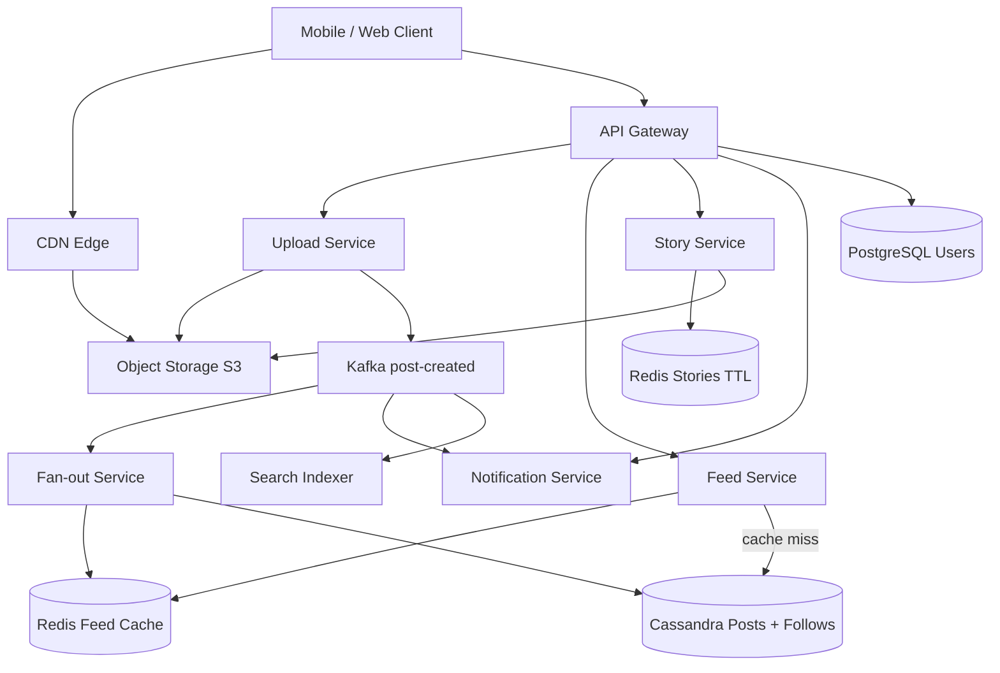
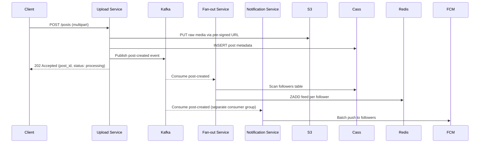
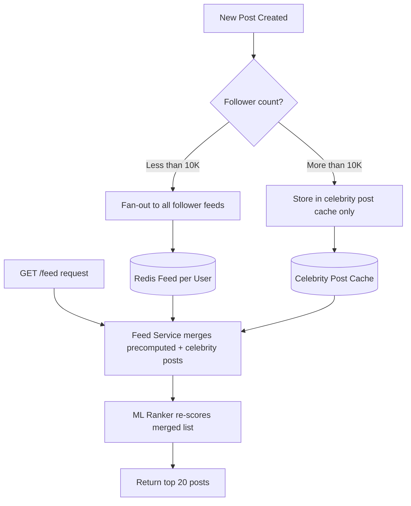
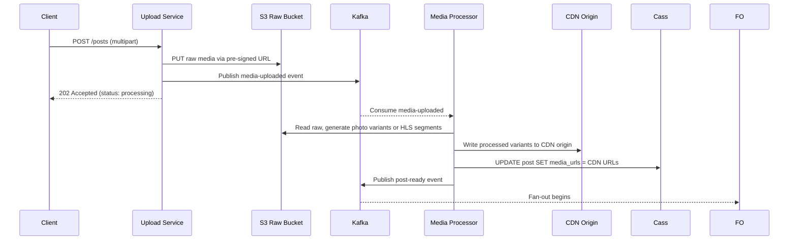

# Design Instagram

Instagram is a photo and video sharing platform with **2 billion registered users** and **500 million daily active users**. Users upload media, follow others, and consume a personalized feed of posts and stories. At its core, Instagram is a media-heavy social graph — but the real engineering challenge is the **news feed**: generating a personalized, ranked timeline for half a billion people in under 200ms.

This problem tests social graph storage, media upload pipelines, fan-out at scale, and the infamous **celebrity problem** — the hardest challenge in social feed systems.

---

## Functional Requirements

**In Scope:**
- Upload a photo or video post (caption, hashtags, location tag)
- Follow / unfollow a user
- News feed: personalized, ranked timeline of posts from followed accounts
- Stories: full-screen ephemeral media, visible for 24 hours
- Like and comment on posts
- Direct Messages: basic 1:1 and group chat
- Explore / Search: discover posts, users, and hashtags
- Push notifications: new follower, like, comment, DM

**Out of Scope:**
- Reels ML recommendation algorithm (deep model design)
- Instagram Shopping / product tagging
- Live streaming infrastructure
- AR filter rendering pipeline
- Ad targeting and serving

---

## Non-Functional Requirements

| Property | Target | Reasoning |
|---|---|---|
| **Feed Latency** | p99 < 200ms | Core UX metric; users abandon slow feeds |
| **Upload Latency** | < 5s for photos; async for video | Photo upload is synchronous; video transcoding runs in background |
| **Availability** | 99.99% for feed reads | Feed downtime at scale means millions of concurrent errors |
| **Consistency** | Eventual for likes/comments; strong for follow graph | Stale like count is tolerable; wrong follow state corrupts the feed |
| **Durability** | Zero media loss | Photos are user memories — loss is unacceptable |
| **Scale** | 500M DAU, 100M posts/day, 5B feed reads/day | Every architecture decision flows from this |
| **Notification Latency** | < 3s push delivery | Engagement drops sharply with delayed social signals |

**The defining tradeoff:** Feed generation is the architecture's central decision. Precomputing feeds (fan-out on write) trades storage and write amplification for O(1) reads. Computing on demand (fan-out on read) trades read-time compute for write simplicity. At Instagram's scale you need **both** — a hybrid model based on follower count.

---

## Capacity Estimation

**Uploads:**
- 100M posts/day → ~1,200/sec average; ~3,600/sec peak (3×)
- Average photo: 3MB → ~3.6 GB/sec media ingestion at peak
- Video (10% of uploads, 50MB average) → additional ~600 MB/sec

**Feed reads:**
- 500M DAU × 10 feed opens/day = 5B reads/day → ~58,000 reads/sec
- Each fetch returns 20 posts → ~1.2B post-level cache lookups/sec

**Storage:**
- Photos: 100M × 0.9 × 3MB = ~270 TB/day
- Videos: 100M × 0.1 × 50MB = ~500 TB/day
- After compression and deduplication: ~300 TB/day net new; 5-year projection: ~550 PB

**Feed cache:**
- 500M users × 500 post IDs × 8 bytes = **~2 TB RAM** across a Redis cluster — feasible

---

## Core Entities

| Entity | Purpose | Key Fields |
|---|---|---|
| **User** | Account and profile | `user_id`, `username`, `email`, `bio`, `profile_pic_url`, `follower_count`, `following_count` |
| **Post** | A photo or video upload | `post_id`, `user_id`, `media_urls[]`, `caption`, `hashtags[]`, `location`, `created_at`, `deleted_at` |
| **Story** | Ephemeral 24h media | `story_id`, `user_id`, `media_url`, `created_at`, `expires_at` |
| **Follow** | Directed social graph edge | `follower_id`, `followee_id`, `created_at` |
| **Like** | User reaction to a post | `post_id`, `user_id`, `created_at` |
| **Comment** | Text reply on a post | `comment_id`, `post_id`, `user_id`, `text`, `created_at` |
| **Feed** | Materialized timeline (cache only) | `user_id`, `post_ids[]` sorted by rank score |
| **Notification** | In-app / push event | `notification_id`, `recipient_id`, `type`, `actor_id`, `entity_id`, `created_at`, `read` |

**Critical modeling decisions:**
- `follower_count` and `following_count` are **denormalized counters** on User — recomputing from the Follow table on every profile load is O(followers) and prohibitive. Updated asynchronously; eventually consistent.
- `Feed` is **not a database table** — it is a Redis sorted set materialized by the Fan-out Service. It is an ephemeral, re-computable cache.
- Stories have a hard `expires_at`. Redis TTL handles active-story eviction; S3 lifecycle rules handle media deletion.

---

## Databases and Database Design

### Storage Tier Decisions

| Data | Access Pattern | Engine | Why |
|---|---|---|---|
| User profiles, auth | Point reads, low write volume | **PostgreSQL** | ACID, relational integrity, consistent auth lookups |
| Post metadata | High write throughput, wide fan-out reads | **Cassandra** | Linear write scale; wide-column suits adjacency lists |
| Follow graph | Adjacency list scans per user | **Cassandra** | Partition by `followee_id` for fast fan-out membership reads |
| Media binaries | Write-once, read-many, PB scale | **S3 + CDN** | Object storage scales natively; CDN delivers at edge |
| Precomputed feeds | Low-latency sorted reads, append/trim | **Redis Sorted Set** | O(1) ZREVRANGE; TTL evicts inactive users automatically |
| Likes, comments | High write volume, eventual consistency OK | **Cassandra** | High throughput; no join needed |
| Stories (active) | TTL-driven expiry | **Redis TTL + S3** | Zero-cost expiry; media durability via S3 |
| Notifications | Fan-out writes, per-user reads | **Cassandra** | High write throughput; partition by `recipient_id` |

### Schema 1 — Posts (Cassandra)

```sql
CREATE TABLE posts_by_user (
  user_id    UUID,
  created_at TIMESTAMP,
  post_id    UUID,
  media_urls LIST<TEXT>,
  caption    TEXT,
  hashtags   LIST<TEXT>,
  deleted_at TIMESTAMP,
  PRIMARY KEY (user_id, created_at)
) WITH CLUSTERING ORDER BY (created_at DESC);
```

Partition by `user_id` — all posts for a user on one partition. Profile page reads are a single partition scan.

### Schema 2 — Follow Graph (Cassandra)

```sql
-- Who does user X follow? (used at follow-time for feed backfill)
CREATE TABLE following (
  follower_id UUID,
  followee_id UUID,
  created_at  TIMESTAMP,
  PRIMARY KEY (follower_id, followee_id)
);

-- Who follows user X? (used by fan-out service on every post)
CREATE TABLE followers (
  followee_id UUID,
  follower_id UUID,
  created_at  TIMESTAMP,
  PRIMARY KEY (followee_id, follower_id)
);
```

Two separate tables — one per direction of the follow graph. The `followers` table is the hot read path during fan-out: scan all followers of the posting user to push `post_id` into their Redis feeds.

### Schema 3 — Likes (Cassandra)

```sql
CREATE TABLE likes_by_post (
  post_id    UUID,
  user_id    UUID,
  created_at TIMESTAMP,
  PRIMARY KEY (post_id, user_id)
);
```

`INSERT IF NOT EXISTS` makes like idempotent. Re-liking the same post is a no-op.

### Schema 4 — Users (PostgreSQL)

```sql
CREATE TABLE users (
  user_id        UUID         PRIMARY KEY DEFAULT gen_random_uuid(),
  username       VARCHAR(30)  UNIQUE NOT NULL,
  email          VARCHAR(255) UNIQUE NOT NULL,
  bio            TEXT,
  profile_pic_url TEXT,
  follower_count  INT          DEFAULT 0,
  following_count INT          DEFAULT 0,
  created_at     TIMESTAMPTZ  DEFAULT NOW()
);

CREATE UNIQUE INDEX idx_users_username ON users (username);
CREATE UNIQUE INDEX idx_users_email    ON users (email);
```

### Schema 5 — Notifications (Cassandra)

```sql
CREATE TABLE notifications_by_user (
  recipient_id UUID,
  created_at   TIMESTAMP,
  notif_id     UUID,
  type         TEXT,    -- 'like' | 'comment' | 'follow' | 'mention'
  actor_id     UUID,
  entity_id    UUID,
  read         BOOLEAN DEFAULT FALSE,
  PRIMARY KEY (recipient_id, created_at)
) WITH CLUSTERING ORDER BY (created_at DESC);
```

### Sharding and Replication

| Store | Shard Key | Strategy | Replication |
|---|---|---|---|
| PostgreSQL (users) | `user_id` | Range sharding, 32 shards | Primary + 2 read replicas |
| Cassandra (posts, follows, likes) | `user_id` / `post_id` (partition key) | Consistent hashing (Murmur3) | RF=3, `LOCAL_QUORUM` writes |
| Redis (feeds) | `user_id` | Hash slots (Redis Cluster) | 1 replica per primary shard |
| S3 (media) | Managed internally by AWS | Object storage partitioning | S3 cross-region replication |

**Indexing strategy:**
- Cassandra: no secondary indexes — all query patterns are pre-modeled as separate tables with appropriate partition keys
- PostgreSQL: B-tree unique indexes on `username`, `email`; covering index on `user_id` for profile lookups
- Redis: ZSET scores encode both recency and ranking signal; `ZREMRANGEBYRANK` trims feed size to 500

---

## API Design

**Upload a post:**
```http
POST /v1/posts
Authorization: Bearer <token>
Content-Type: multipart/form-data

{ media: <file>, caption: "Sunset in Santorini", hashtags: ["travel", "greece"], location: "Santorini" }

202 Accepted
{ "post_id": "post_abc", "status": "processing", "media_url": null }
// media_url populated asynchronously once CDN upload completes
```

**Get news feed (cursor-paginated):**
```http
GET /v1/feed?limit=20&cursor=eyJ0...
Authorization: Bearer <token>

200 OK
{
  "posts": [
    { "post_id": "post_abc", "user": { "user_id": "...", "username": "alice" },
      "media_urls": ["https://cdn.instagram.com/p/abc_750.jpg"],
      "caption": "...", "like_count": 1240, "comment_count": 87, "created_at": "..." }
  ],
  "next_cursor": "eyJ0c3..."
}
```

**Follow a user:**
```http
POST /v1/users/{user_id}/follow
Authorization: Bearer <token>

204 No Content
// Async: Fan-out Service injects followee's recent posts into caller's Redis feed
```

**Get Stories feed:**
```http
GET /v1/stories/feed
Authorization: Bearer <token>

200 OK
{
  "stories": [
    { "user_id": "user_x", "username": "alice", "profile_pic": "...",
      "stories": [{ "story_id": "s1", "media_url": "...", "expires_at": "..." }] }
  ]
}
```

**Like a post (idempotent):**
```http
POST /v1/posts/{post_id}/like
Authorization: Bearer <token>

204 No Content
// INSERT IF NOT EXISTS in Cassandra; re-liking same post is no-op
```

**Get comments (cursor-paginated):**
```http
GET /v1/posts/{post_id}/comments?limit=20&cursor=...

200 OK
{ "comments": [{ "comment_id": "...", "user": {...}, "text": "Beautiful!", "created_at": "..." }],
  "next_cursor": "..." }
```

---

## High-Level Design



**Component responsibilities:**

| Component | Role |
|---|---|
| **API Gateway** | Auth token validation, rate limiting, request routing |
| **Upload Service** | Accepts media, writes post metadata to Cassandra, publishes `post-created` to Kafka |
| **Feed Service** | Reads precomputed feed from Redis; falls back to on-demand Cassandra pull on cold miss |
| **Fan-out Service** | Kafka consumer; writes `post_id` into each follower's Redis sorted set |
| **Story Service** | Story upload and read; Redis TTL for active stories, S3 for durable storage |
| **Notification Service** | Kafka consumer; aggregates and delivers push via FCM / APNS |
| **Search Indexer** | Kafka consumer; indexes post captions and hashtags into Elasticsearch |
| **CDN** | Serves all media (photos, videos, stories) from edge nodes globally |

---

## Deep Dives

### 1. Kafka: Required for Decoupling the Write Path

The `post-created` event has **four independent consumers**, each with different reliability and latency requirements:

| Consumer | What It Does | Latency SLA |
|---|---|---|
| **Fan-out Service** | Writes `post_id` to follower feed caches | < 30 seconds |
| **Notification Service** | Sends push notifications to followers | < 3 seconds |
| **Search Indexer** | Indexes post captions and hashtags in Elasticsearch | < 60 seconds |
| **Analytics Pipeline** | Streams to data warehouse (Flink → S3 → Redshift) | Minutes |

Without Kafka, the Upload Service would synchronously call all four — a single slow consumer (Search Indexer under load) would stall post creation entirely. Kafka decouples producers from consumers, absorbs celebrity post bursts, and provides replay when consumers fall behind.



**Topic design:** `post-created` is partitioned by `poster_user_id`. All events from the same user land on the same partition — preserving per-user ordering. Fan-out workers own specific partition ranges; no cross-worker coordination.

**Backpressure:** Celebrity post storms cause fan-out lag. Kafka buffers the backlog — consumers catch up without data loss. Alert if consumer group lag exceeds 30 seconds; that means some feeds are stale.

**Tradeoff:** Kafka adds ~10ms event delivery overhead. For the fan-out path (SLA: 30s), this is trivial. For the notification path (SLA: 3s), the Notification Service consumer must process quickly — it uses a separate, higher-priority consumer group.

---

### 2. Redis: Caching Strategies and Cache Invalidation

Redis is the **primary performance lever** for the entire system — it serves the precomputed feed, caches post metadata, manages story TTLs, and backs the notification rate limiter.

**a) Feed Cache — Sorted Set per User**

Each user's feed is a Redis Sorted Set:
```
ZADD feed:{user_id}  {rank_score}  {post_id}
ZREVRANGE feed:{user_id} 0 19       // top 20 posts
ZREMRANGEBYRANK feed:{user_id} 0 -501  // trim to max 500 entries
```

**Cache population:** Fan-out Service appends new posts on every write (write-through). New followers trigger a backfill of the followee's recent 20 posts into the new follower's feed.

**Cache eviction:** Sorted sets for users inactive > 7 days are expired via a Redis key TTL set on the feed key itself (`EXPIRE feed:{user_id} 604800`). On next login, the Feed Service recomputes the feed from Cassandra — a cold start that adds ~300ms to the first feed load.

**b) Post Metadata Cache — Hash per Post**

Individual post metadata (like count, comment count, caption) is cached as a Redis Hash:
```
HSET post:{post_id}  like_count 1240  comment_count 87  caption "..."
EXPIRE post:{post_id} 3600
```

**Cache invalidation — the hard problem:**

| Event | Cache Action | Mechanism |
|---|---|---|
| New like on post | `HINCRBY post:{post_id} like_count 1` | Atomic increment in Redis (no read-modify-write) |
| New comment | `HINCRBY post:{post_id} comment_count 1` | Same |
| Post deleted | `DEL post:{post_id}` + soft delete in Cassandra | Synchronous DEL before returning 204 |
| Post edited (caption) | `HSET post:{post_id} caption {new}` | Write-through update |
| Post cache expires | Cache-aside: rebuild from Cassandra on next read | TTL expiry, lazy rebuild |

Using `HINCRBY` for counters is critical — it avoids the read-modify-write race condition where two concurrent likes both read `count=5`, both write `count=6`, and one increment is lost.

**c) Story Cache — TTL-based Expiry**

Story metadata stored with TTL = seconds until `expires_at`:
```
SET story:{story_id}  {json_payload}  EX {ttl_seconds}
```

When the TTL expires, the story disappears from reads immediately — no cron job, no scan. This is the most cost-efficient expiry mechanism at 500M daily story uploads.

**d) Notification Rate Limiter — Sliding Window**

```
INCR notif_rate:{user_id}:{type}
EXPIRE notif_rate:{user_id}:{type} 600    // 10-minute window
```

At most one push per notification type per user per 10 minutes — prevents spam on viral posts.

**Cache invalidation summary:**

| Cache | Strategy | Invalidation | Pattern |
|---|---|---|---|
| Feed sorted set | Write-through (Fan-out writes on post) | DEL on account deletion | Write-through + TTL on inactivity |
| Post metadata | Cache-aside with HINCRBY for counters | DEL on post delete; TTL expiry on update | Atomic increment + explicit delete |
| Story metadata | TTL mirrors `expires_at` | Auto-expiry only | TTL-based |
| Notification rate | TTL sliding window | Auto-expiry | TTL-based |
| Group membership (for DM fan-out) | Cache-aside, TTL 5min | DEL on member add/remove | Write-through delete |

---

### 3. Fan-out: The Celebrity Problem

**Why it breaks:** When a user with 10M followers posts a photo, the Fan-out Service must write `post_id` to 10M Redis sorted sets. At 1,200 posts/sec, even 0.1% of posters with 100K+ followers generates enormous write amplification. A single celebrity post can trigger **10M Redis writes in seconds**.

**Three models:**

| Model | Read Latency | Write Cost | Best For |
|---|---|---|---|
| Fan-out on Write | O(1) — single Redis read | O(followers) writes | Regular users (< 10K followers) |
| Fan-out on Read | O(followees × scan) | Zero extra writes | Celebrities (10M+ followers) |
| Hybrid | Near O(1) with merge | Moderate | Production default |

**The hybrid model:**



- **Regular users:** Fan-out Service pipelines `ZADD` commands in batches of 100. Reads are a single `ZREVRANGE` — O(1).
- **Celebrities:** Posts stored in `celebrity_posts:{user_id}` cache. At read time, Feed Service fetches precomputed feed + recent celebrity posts, merges, and re-ranks. One extra Redis lookup per followed celebrity (typically 2–5 per user).

---

### 4. Media Upload Pipeline: Async Processing

A 50MB video cannot block the API response for transcoding time. The entire media pipeline is async:



**Media processing output variants:**

| Input | Output Variants | Format | Use Case |
|---|---|---|---|
| Photo | 150px thumbnail | JPEG q60 | Grids, notifications |
| Photo | 750px medium | JPEG q80 | Feed display |
| Photo | 1080px full | JPEG q90 | Full-screen view |
| Video | 360p HLS | .m3u8 + .ts | Low-bandwidth |
| Video | 720p HLS | .m3u8 + .ts | Standard mobile |
| Video | 1080p HLS | .m3u8 + .ts | Wi-Fi / high quality |

Fan-out only begins after `post-ready` — prevents feeds from showing posts with null `media_url`.

---

### 5. Feed Ranking: Two-Stage Scoring

Chronological feeds don't maximize engagement. Instagram ranks on every read request via a two-stage pipeline that stays under 50ms:

**Stage 1 — Candidate retrieval:** `ZREVRANGE feed:{user_id} 0 199` — fetch top-200 candidates from Redis. O(1).

**Stage 2 — ML Re-ranking:** Pass 200 candidates to an in-process gradient-boosted model. Features:
- **User-author affinity:** Historical like/comment frequency for this author (from feature store)
- **Post engagement velocity:** Likes per second since posted — proxy for quality
- **Content type preference:** Per-user video/photo watch ratio
- **Recency decay:** Exponential decay on `created_at`

The model runs **in-process** inside the Feed Service (no network hop) and is refreshed every 6 hours from a model registry. Target: < 50ms for Stage 2.

---

### 6. Notification Fan-out: Avoiding Spam

A post accumulating 50,000 likes in one hour would naively trigger 50,000 push notifications to the author.

**Solutions:**
- **Aggregation window:** Buffer like events for the same `(recipient, post)` pair over 10 minutes. Send one notification: "Alice and 49,999 others liked your photo."
- **Redis rate limiting:** `INCR notif_rate:{user_id}:like EX 600` — at most one like-notification per user per 10-minute window.
- **Durable in-app store:** FCM/APNS drops pushes for offline devices. All notifications are written to Cassandra `notifications_by_user` and fetched on app open — guaranteeing at-least-once delivery to the in-app notification center.

---

## Summary: Key Engineering Decisions

| Decision | Choice | Why |
|---|---|---|
| Feed generation | Hybrid fan-out (push for regular, pull-merge for celebrities) | Pure push breaks on 10M-follower accounts; pure pull is too slow |
| Post metadata | Cassandra (partition by `user_id`) | Linear write scale; adjacency list for fan-out scans |
| Media storage | S3 + CDN | PB-scale object storage; CDN delivers at edge in < 10ms |
| Feed cache | Redis sorted set per user, cap 500 entries | O(1) reads; TTL evicts inactive users automatically |
| Counter updates | Redis `HINCRBY` (atomic increment) | Eliminates race condition from concurrent likes; no read-modify-write |
| Story expiry | Redis TTL + S3 lifecycle rules | Zero-cost accurate expiry at 500M uploads/day; no cron scan |
| Event bus | Kafka partitioned by `poster_user_id` | Four independent consumers; per-user ordering; absorbs celebrity bursts |
| Media processing | Async (Kafka + Media Processor) | Decouples API latency from multi-minute video transcoding |
| Feed ranking | Two-stage: Redis retrieval + in-process ML | < 50ms ranking; no network hop; model refreshed every 6h |
| Notification dedup | 10-min aggregation window + Redis sliding window | Prevents viral post spam; durable in-app fallback on FCM drop |

The defining insight: **the social graph's power-law follower distribution breaks any single architecture.** A user with 500 followers and a celebrity with 50 million are fundamentally different write workloads. Recognizing this and designing a hybrid fan-out system is what separates a good Instagram design from a great one in a senior interview.
