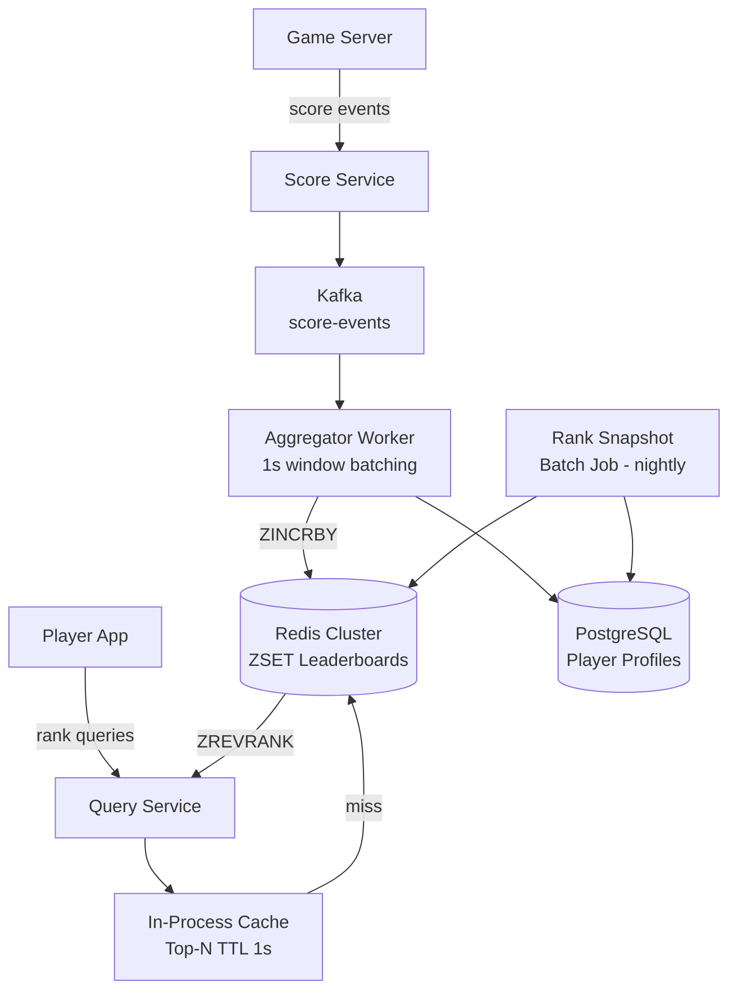
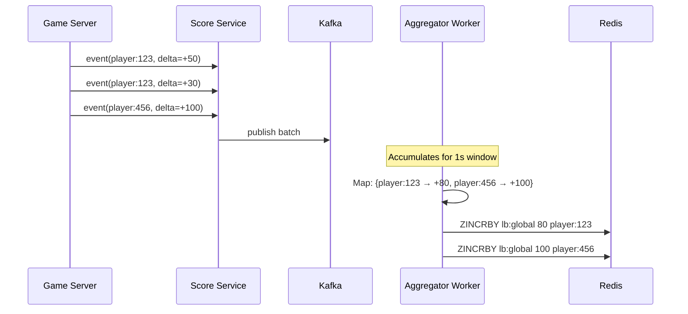
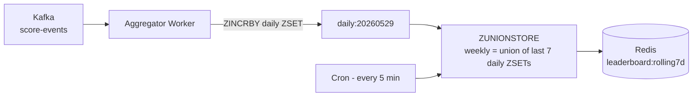
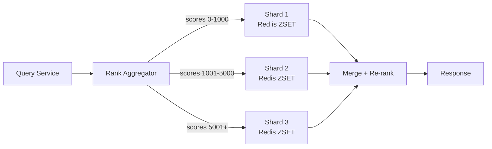
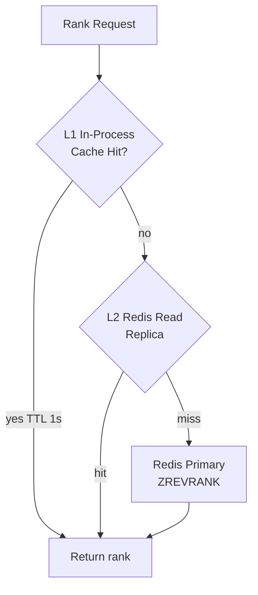

# Design a Real-Time Leaderboard System

A leaderboard ranks players (or users) by score in real time. It appears in gaming (Call of Duty, League of Legends), fintech (top traders), fitness (Strava segment rankings), and social platforms (most liked posts). The scale and real-time nature make it deceptively hard.

The easy version: sort 1,000 players by score. The hard version: rank 100 million players, update scores 1 million times per second, serve "what is my exact rank?" in under 50ms, and support daily/weekly/all-time windows — all concurrently.

Every architectural decision flows from one core insight: **global sort order is expensive to maintain at write time but cheap at read time when you use the right data structure.**

---

## Functional Requirements

**In Scope:**
- Submit score updates (absolute set or incremental delta) for a player
- Fetch the global top-N leaderboard with scores (default top 100)
- Get a specific player's rank and score
- **Neighborhood view:** show the 5 players ranked immediately above and below a player
- Support multiple leaderboard scopes: global, per-region, per-game-mode
- Time-windowed leaderboards: all-time, weekly, daily
- Leaderboard history: a player's rank over time (daily snapshots)

**Out of Scope:**
- Score validation and anti-cheat (a separate service; this system trusts submitted scores)
- Matchmaking or skill-based ranking (Elo/MMR systems — related but distinct)
- Push notifications for rank changes
- Per-player achievements or badges

---

## Non-Functional Requirements

| Property | Target | Reasoning |
|---|---|---|
| **Score Update Latency** | p99 < 200ms (fire-and-forget acceptable) | Game servers emit events continuously; slight delay is invisible to players |
| **Rank Query Latency** | p99 < 50ms for top-1000; p99 < 500ms for any player | Top players are read constantly; long-tail players can tolerate more latency |
| **Write Throughput** | 1M score updates/sec peak | 1M concurrent players × ~1 event/sec during peak gaming hours |
| **Read Throughput** | 500K rank reads/sec | Leaderboard pages refresh frequently; neighborhood queries on every session |
| **Availability** | 99.9% — momentarily stale leaderboard is acceptable | A slightly outdated rank is fine; returning errors is not |
| **Scale** | 100M registered players, 1M concurrent at peak | Mid-sized gaming platform baseline |
| **Freshness** | Rank updates visible within 1–2 seconds of score submission | Players notice > 2s lag in competitive contexts |

**Key tradeoff:** Exact global rank at any moment requires knowing every other player's score — O(log N) per query in a skip-list, but maintaining that structure under 1M writes/sec requires batching. The central tension is **write throughput vs. rank freshness**.

---

## Capacity Estimation

**Writes:**
- 1M score updates/sec peak → **3.6B events/hour** during tournaments
- Buffering into 1-second windows: reduces effective Redis writes to ~100K ops/sec

**Reads:**
- 500K rank/leaderboard reads/sec at peak
- Top-100 leaderboard: served from in-process cache (TTL 1s) — 99% of requests never hit Redis

**Storage:**
- Redis ZSET entry: ~60 bytes (member string + score float + skip-list node overhead)
- 100M players × 60 bytes = **~6 GB per leaderboard** — fits comfortably in Redis
- 3 leaderboards (global + weekly + daily) = ~18 GB — single Redis cluster handles this

**Score event log:**
- 1M events/sec × 200 bytes = ~200 MB/sec → **~17 TB/day** — land in Kafka, archive to S3

---

## Core Entities

| Entity | Purpose | Key Fields |
|---|---|---|
| **Player** | Registered user with profile metadata | `player_id`, `username`, `region`, `game_mode`, `created_at` |
| **Leaderboard** | A named ranking context with scope and time window | `leaderboard_id`, `name`, `scope` (global/region/mode), `window` (all-time/weekly/daily), `reset_schedule` |
| **PlayerScore** | A player's current score in a specific leaderboard | `leaderboard_id`, `player_id`, `score`, `last_updated` |
| **ScoreEvent** | Immutable log of every score change | `event_id`, `player_id`, `leaderboard_id`, `delta`, `new_score`, `source`, `timestamp` |
| **RankSnapshot** | Daily snapshot of a player's rank (for history) | `snapshot_id`, `player_id`, `leaderboard_id`, `rank`, `score`, `snapshot_date` |

**Relationships:**
- `PlayerScore` is the *derived state* from applying all `ScoreEvent`s; it's what Redis stores
- `RankSnapshot` is written by a nightly batch job reading the Redis ZSET — enables "rank over time" charts
- `Leaderboard` is configuration; the actual ranking lives in Redis, not in SQL

---

## Databases and Database Design

### Storage Tier Decisions

| Data | Access Pattern | Choice |
|---|---|---|
| Active leaderboard rankings | High read/write, sorted order queries | **Redis Sorted Set (ZSET)** |
| Score events (audit log) | Append-only, high throughput | **Kafka → S3 (Parquet)** |
| Player profiles | Low-write, indexed lookups | **PostgreSQL** |
| Rank history snapshots | Time-series, analytics queries | **PostgreSQL / ClickHouse** |
| Top-N cache (leaderboard page) | Read-heavy, refreshed every 1–2s | **In-process memory (per Query Service instance)** |

### Redis Sorted Set — The Core Data Structure

Redis ZSET is a skip-list + hash map. Every member has a floating-point score; the skip-list maintains sorted order. All the leaderboard primitives map directly to Redis commands:

```
// Update score (atomic increment)
ZINCRBY leaderboard:global 50 "player:123"        # O(log N) — adds 50 to player 123's score

// Get rank (0-indexed from top)
ZREVRANK leaderboard:global "player:123"           # O(log N) — returns rank 4521

// Top 10 with scores
ZRANGE leaderboard:global 0 9 REV WITHSCORES       # O(log N + k)

// Neighborhood view — 5 above and below rank 4521
ZRANGE leaderboard:global 4516 4526 REV WITHSCORES # O(log N + 10)

// Player's current score
ZSCORE leaderboard:global "player:123"             # O(1)
```

**Why ZSET over SQL `ORDER BY` with an index:** A PostgreSQL `SELECT rank() OVER (ORDER BY score DESC)` on 100M rows takes seconds even with a B-tree index on `score` — the index can find rows quickly, but computing exact rank at query time still requires counting all rows with a higher score. Redis's internal skip-list structure resolves rank in O(log N) at all times with no full-scan overhead.

**Why ZSET over a custom skip-list:** Redis is battle-tested at billion-key scale, ships with replication and persistence, and provides all required commands atomically. Building a custom skip-list adds operational burden without benefit.

### PostgreSQL — Player Profiles and Rank History

```sql
CREATE TABLE players (
  player_id   UUID         PRIMARY KEY,
  username    TEXT         NOT NULL UNIQUE,
  region      TEXT         NOT NULL,
  game_mode   TEXT,
  created_at  TIMESTAMPTZ  DEFAULT NOW()
);

CREATE TABLE rank_snapshots (
  player_id       UUID         NOT NULL,
  leaderboard_id  TEXT         NOT NULL,
  snapshot_date   DATE         NOT NULL,
  rank            BIGINT       NOT NULL,
  score           BIGINT       NOT NULL,
  PRIMARY KEY (player_id, leaderboard_id, snapshot_date)
);

CREATE INDEX idx_snapshots_leaderboard ON rank_snapshots (leaderboard_id, snapshot_date, rank);
```

- `rank_snapshots` is written by a nightly batch job that calls `ZRANGE leaderboard:X 0 -1 WITHSCORES` and records each player's rank
- This enables "rank over time" charts without any online computation
- Partition `rank_snapshots` by `snapshot_date` — old partitions are read-only and compressible

### Consistency Model

| Operation | Consistency | Reasoning |
|---|---|---|
| Score update | Eventual (buffered via Kafka) | 1–2s lag is imperceptible in gaming contexts |
| Rank query | Read-your-own-writes (with 1s lag max) | Player expects to see their own score update "immediately" |
| Top-N leaderboard | Eventual (1s TTL in-process cache) | All users see the same top-10; 1s staleness is fine |
| Neighborhood view | Eventual (from Redis replica) | Concurrent changes are rare for non-top players |

---

## API Design

**Submit a score update:**
```http
POST /v1/leaderboards/{leaderboard_id}/scores
{
  "player_id": "player-uuid-123",
  "delta":     50,              // incremental: add 50 points
  "source":    "match-end",
  "event_id":  "evt-abc-xyz"    // idempotency key
}
// 202 Accepted — async; score visible within 1-2 seconds
```

**Get top-N players:**
```http
GET /v1/leaderboards/{leaderboard_id}/top?limit=100&offset=0

200 OK
{
  "leaderboard_id": "global-all-time",
  "entries": [
    { "rank": 1, "player_id": "player-aaa", "username": "Faker",  "score": 98200 },
    { "rank": 2, "player_id": "player-bbb", "username": "Uzi",    "score": 97850 },
    ...
  ],
  "total_players": 100000000,
  "refreshed_at": "2026-05-29T10:32:01Z"
}
```

**Get a player's rank and score:**
```http
GET /v1/leaderboards/{leaderboard_id}/players/{player_id}/rank

200 OK
{
  "player_id":  "player-uuid-123",
  "rank":       4522,
  "score":      9850,
  "percentile": 99.99   // top 0.01% — derived from rank / total_players
}
```

**Get neighborhood view:**
```http
GET /v1/leaderboards/{leaderboard_id}/players/{player_id}/neighborhood?range=5

200 OK
{
  "player": { "rank": 4522, "username": "MyGuy", "score": 9850 },
  "above":  [ { "rank": 4521, ... }, { "rank": 4520, ... }, ... ],
  "below":  [ { "rank": 4523, ... }, { "rank": 4524, ... }, ... ]
}
```

**Get rank history for a player:**
```http
GET /v1/leaderboards/{leaderboard_id}/players/{player_id}/history?days=30

200 OK
{
  "history": [
    { "date": "2026-05-29", "rank": 4522, "score": 9850 },
    { "date": "2026-05-28", "rank": 5130, "score": 9200 },
    ...
  ]
}
```

---

## High-Level Design

Two planes: **write path** (score ingestion) and **read path** (rank queries).



**Write path:**
1. Game server emits `ScoreEvent` to Score Service (HTTP or gRPC)
2. Score Service publishes to Kafka — 202 Accepted immediately; no blocking on Redis
3. Aggregator Worker consumes Kafka, batches score deltas per player over a 1-second window
4. Worker issues one `ZINCRBY` per player per second to Redis (not one per event)

**Read path:**
1. Query Service checks in-process LRU cache for top-N result (1s TTL)
2. On miss: single Redis `ZRANGE` call — sub-millisecond
3. For player rank: `ZREVRANK` to Redis — O(log N), ~1–3ms

**Component responsibilities:**
| Component | Role |
|---|---|
| **Score Service** | Validates events; publishes to Kafka; handles idempotency |
| **Aggregator Worker** | Coalesces per-player score deltas; single Redis write per player per second |
| **Query Service** | Serves leaderboard reads; manages in-process top-N cache |
| **Batch Snapshot Job** | Nightly: reads full ZSET, writes `rank_snapshots` to PostgreSQL |
| **Redis Cluster** | Source of truth for current rankings; ZSET per leaderboard per window |

---

## Deep Dives

### 1. Score Update Pipeline: Kafka as a Write Buffer

**The problem:** 1M concurrent players × 1 event/sec = 1M `ZINCRBY` calls/sec to Redis. A single Redis instance handles ~100–200K write operations/sec. Naive direct writes saturate Redis well before peak load.

**Why Kafka is required here:** Score events are a firehose. Kafka acts as a durable buffer that decouples game servers (bursty writers) from Redis (limited write throughput). It also gives you a replay capability — if Redis is rebuilt from scratch, replay the Kafka topic.

**Aggregator Worker — 1-second batching:**



- A 1-second aggregation window reduces 1M Redis writes/sec to ~100K unique-player writes/sec (average player sends ~10 events/sec; aggregated to 1 write)
- Kafka consumer group with 32 partitions: each partition handles a disjoint set of players (keyed by `player_id` hash) — no cross-partition coordination needed
- **Tradeoff:** Rank updates are 0–2 seconds delayed. For casual gaming, this is invisible. For esports finals, the 2s lag is visible but accepted — real-time scoring has too high an operational cost.

**Idempotency:** Each score event carries an `event_id`. The aggregator deduplicates within a processing window using an in-memory set. Events seen twice are dropped. This prevents double-counting on Kafka consumer retry.

---

### 2. Time-Windowed Leaderboards (Daily, Weekly, All-Time)

**The problem:** "Top players this week" requires ignoring scores from last week. You can't just reset the all-time leaderboard — you need simultaneous all-time, weekly, and daily views.

**Solution: Separate ZSET per window + daily reset jobs:**

```
leaderboard:global:all-time       # never reset
leaderboard:global:weekly:2026W22  # reset Monday 00:00 UTC
leaderboard:global:daily:20260529  # reset midnight UTC
```

- Every score update writes to all three ZSETs simultaneously in a Redis pipeline (3 `ZINCRBY` calls per update — ~3× Redis write amplification; acceptable)
- Daily ZSET expires automatically after 48 hours (`EXPIREAT` set at creation time)
- Weekly ZSET expires after 14 days
- A cron job runs at midnight UTC: create the new daily ZSET; rotate weekly ZSET at week boundary

**Rolling 7-day window (hardest variant):**

Some products want "last 7 days" rather than "this calendar week". This means removing scores older than 7 days — which requires knowing when each point was earned.



- Maintain 7 daily ZSETs; every 5 minutes, `ZUNIONSTORE` them into a `rolling7d` ZSET
- `ZUNIONSTORE` on 7 × 100M-entry ZSETs is expensive (~10 seconds); run it on a replica
- **Tradeoff:** Rolling window rank is at most 5 minutes stale. Exact rolling-second freshness requires maintaining per-second ZSETs — impractical at this scale. 5-minute granularity is the production compromise.

---

### 3. Scaling to 1B+ Players: Sharding the ZSET

**The problem:** At 1B players, a single ZSET holds ~60 GB — exceeds Redis's per-instance memory and makes ZRANGE scans expensive. More critically, all writes go to one Redis primary, which becomes a bottleneck.

**Score-range based sharding:**



- Pre-defined score buckets; each bucket is a separate Redis ZSET on a separate shard
- Score update routes to the correct shard based on the player's score
- **Boundary problem:** When a player crosses a score boundary (e.g., score moves from 999 to 1001), they must be removed from Shard 1 and added to Shard 2 — atomically. Use a Lua script: `ZREM shard1 player AND ZADD shard2 player` in one round trip.
- **Global rank for top-N:** Easy — top players are all in the high-score shard. `ZREVRANGE shard3 0 99` gives the global top 100.
- **Global rank for mid-tier players:** Their rank = (count of players in all higher-score shards) + (their rank within their shard). The shard count is cached and refreshed every 30 seconds.

**Alternative — Consistent hash sharding:** Hash `player_id` to a shard. Global top-N requires querying all shards and merging — expensive. Score-range sharding is far more efficient for leaderboard use cases because the top-N only lives on one shard.

---

### 4. Hot Player Problem: When the Top-1 Gets 10M Reads/Sec

**The problem:** Famous esports players (Faker, s1mple) have tens of millions of fans. During a live tournament, 10M users refresh the leaderboard simultaneously — all reading `ZREVRANK leaderboard:global "player:faker"`. A single Redis key handling 10M reads/sec saturates even a well-provisioned Redis primary.

**Layered caching for hot players:**



- **L1:** Each Query Service pod caches the top-1000 player ranks in a local LRU with 1s TTL. Covers essentially all "famous player" reads.
- **L2:** Redis read replicas serve `ZREVRANK` queries for players outside the top-1000. Writes go to primary; reads spread across 5+ replicas.
- **Pre-computed top-100 response:** A background thread refreshes the full top-100 list every 1 second and stores it in the in-process cache. The vast majority of leaderboard page loads serve this pre-computed response without any Redis call.

**Write amplification for top players:** Score updates for top-ranked players cause no additional read load — `ZINCRBY` on the primary is the same cost regardless of rank.

---

### 5. Exact Rank vs. Approximate Rank for the Long Tail

**The problem:** `ZREVRANK` runs in O(log N) — fast. But at 100M players, even O(log N) = ~27 operations per query becomes expensive at 500K reads/sec: 500K × 27 = 13.5M internal skip-list traversals/sec per Redis instance.

**Tiered rank precision — what games actually ship:**

| Rank Tier | Players | Method | Precision |
|---|---|---|---|
| Top 10,000 | 0.01% | Exact ZREVRANK | Exact |
| Top 1M | 1% | Exact ZREVRANK (cached 30s) | Exact, 30s stale |
| Top 10M | 10% | Score bucket → estimated rank | ±500 ranks |
| Below top 10% | 90% | Score percentile display ("Top 15%") | Percentile |

- For the bottom 90% of players, showing "Top 15%" is more motivating than showing "Rank #45,231,892" — and it requires only a score threshold lookup, not a full ZREVRANK
- Score-to-percentile mappings are precomputed every 5 minutes: `percentile_map = {score: rank / total_players}`
- A player with score 4,200 looks up their percentile in O(1) from the precomputed map — no Redis `ZREVRANK` call needed
- Only the top-1M players need exact ranks; they get Redis `ZREVRANK` with read-replica load balancing

**Tradeoff:** Players outside the top 1M occasionally see a rank that's a few positions off. For competitive play, exact rank matters. For casual gaming, percentile is actually more meaningful and reduces Redis read load by ~90%.

---

### 6. Rate Limiting Score Updates

**The problem:** Malicious clients or buggy game servers can flood the Score Service with updates — artificially inflating a player's score or simply overwhelming the write pipeline.

- **Per-player rate limit:** Maximum 10 score update events/second per `player_id`. Enforced in Score Service using a sliding-window counter in Redis (`INCR + EXPIRE`). Events above the limit are silently dropped (not rejected — game servers shouldn't crash on rate-limit hits).
- **Per-source rate limit:** A game server instance is rate-limited to 50K events/sec. Circuit breaker opens if Kafka publish latency exceeds 500ms — score events are shed rather than backing up in service memory.
- **Score delta cap:** A single event cannot increase a player's score by more than 10,000 points (configurable per game). Any event exceeding this is routed to a fraud review queue instead of the normal write path.

---

## Summary: Key Engineering Decisions

| Decision | Choice | Why |
|---|---|---|
| Ranking data structure | Redis ZSET | O(log N) rank, range queries, neighborhood — exact match for leaderboard operations |
| Write pipeline | Kafka + Aggregator Worker (1s batching) | Decouples 1M events/sec from Redis's ~100K writes/sec capacity |
| Time windows | Separate ZSET per window + daily cron | Cleanest isolation; rolling window via ZUNIONSTORE on replicas |
| Sharding at 1B+ players | Score-range sharding | Top-N served from one shard; global rank = cross-shard count + local rank |
| Hot player reads | In-process L1 cache (1s TTL) + Redis replicas | Eliminates Redis load for famous players without sacrificing freshness |
| Long-tail ranks | Percentile display below top-1M | 90% reduction in `ZREVRANK` load; better UX for casual players |
| Write protection | Per-player rate limit + delta cap | Prevents score inflation and pipeline saturation |

A leaderboard is one of the best examples of **choosing the right data structure first, then building the system around it**. Once you choose Redis ZSET, most of the architecture flows naturally. The depth comes from handling write scale, time windows, sharding at extreme player counts, and the exact-vs-approximate rank tradeoff — precisely the questions that separate senior from junior system design answers.
