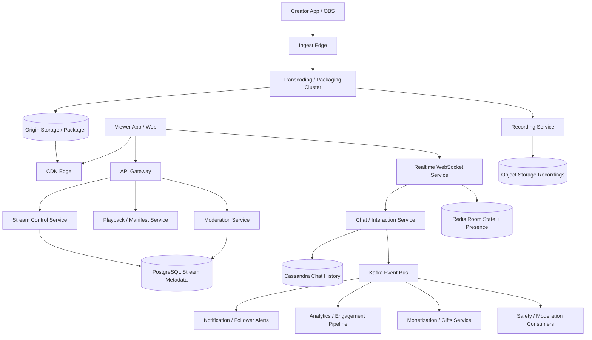
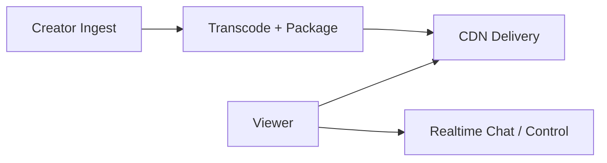
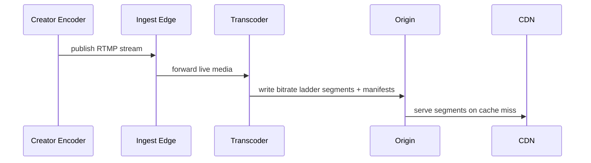
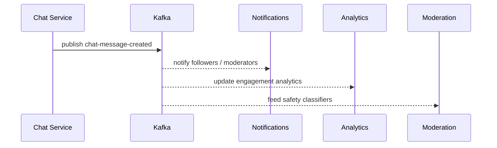
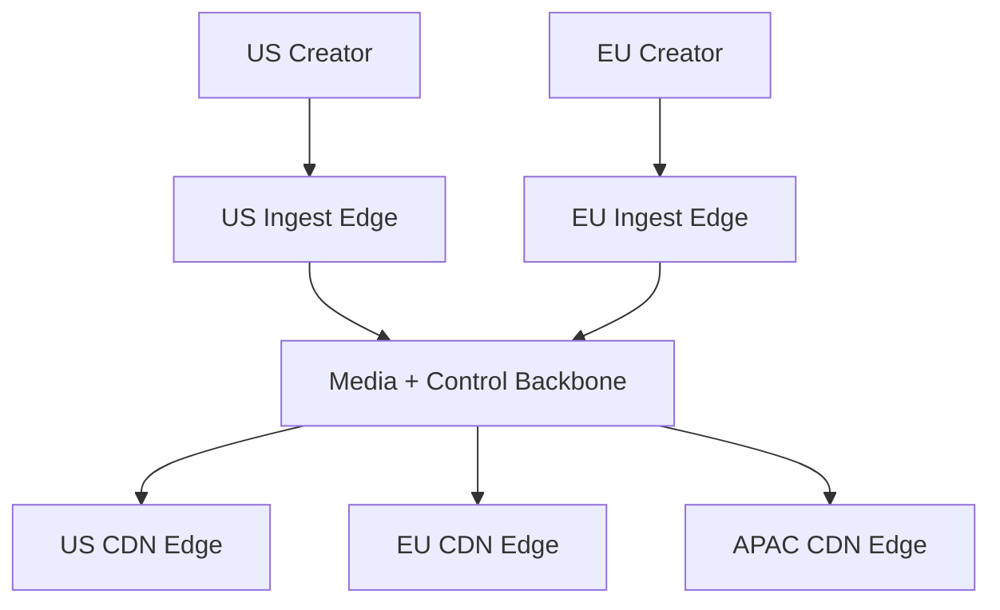

# Design Live Streaming

Designing a live-streaming platform is a classic system design interview problem because it combines realtime media ingest, fanout to massive viewer populations, chat and reactions, content moderation, and strict latency-cost tradeoffs. Creators expect to go live quickly, monitor stream health, and reach viewers reliably across weak mobile networks. Viewers expect smooth playback, low delay, synchronized chat, and graceful fallback when networks degrade. The hard part is that the platform is really several systems at once: a media pipeline, a control plane, a chat system, a recommendation and discovery system, and an analytics and moderation platform.

At a high level, the system has three distinct workloads. The first is the **broadcast path**, where a creator starts a stream, publishes video and audio to an ingest endpoint, and the platform transcodes and packages that stream for delivery. The second is the **viewer interaction path**, where millions of viewers join, fetch playback manifests, send chat messages, react, and optionally purchase gifts or subscriptions. The third is the **asynchronous platform path**, where moderation, recording, recommendations, notifications, analytics, and monetization events flow behind the scenes. A good design keeps media delivery cheap and scalable through packaging and CDNs, keeps the control path responsive, and isolates heavy asynchronous work from the latency-critical live experience.

---

## Functional Requirements

**In Scope:**
- Creators can schedule or start a livestream and obtain an ingest URL and stream key
- The platform supports creator broadcast ingest from mobile apps, browser tools, or desktop encoders
- Viewers can join a stream, fetch playback manifests, and watch with adaptive bitrate streaming
- Users can send chat messages, reactions, and optionally virtual gifts during a livestream
- The platform can record streams for later playback as VOD when enabled
- Operators can inspect stream health, ingest failures, viewer counts, latency, moderation incidents, and hot-stream pressure
- The system supports moderation actions such as muting chat users, ending streams, or flagging content for review
- The platform stores stream metadata, chat history, moderation events, and viewer engagement summaries

**Out of Scope:**
- Deep recommendation model internals for home-feed ranking
- Full ad-tech stack design for video ad auctions and measurement
- Detailed digital-rights-management workflows for premium licensed content
- Professional broadcast studio tooling and multi-camera production internals beyond basic control signals
- Full billing or payout engine internals for creator earnings

---

## Non-Functional Requirements

| Property | Target | Reasoning |
|---|---|---|
| **Stream Start Latency** | creator should begin streaming within a few seconds after pressing go live | creators abandon slow startup flows quickly |
| **Playback Latency** | target 2 to 10 seconds for standard low-latency HLS; lower when using specialized protocols | live experiences break if viewer delay is too large |
| **Playback Availability** | 99.99% for manifest and segment delivery | viewers tolerate quality shifts more than outright playback failures |
| **Scalability** | support millions of concurrent viewers and extreme skew on a handful of hot streams | livestream traffic is highly concentrated |
| **Chat Freshness** | p99 < 300ms for chat or reaction propagation in-region | audience engagement feels broken if chat lags badly |
| **Resilience** | stream should survive encoder jitter, CDN issues, and regional failures gracefully | broadcast sessions are time-sensitive and cannot simply be retried later |
| **Cost Efficiency** | media delivery must rely heavily on CDNs and adaptive bitrate ladders | egress dominates cost for large livestream products |
| **Moderation Safety** | abusive streams or chats must be detectable and actionable quickly | live content creates safety risk in real time |

**Key tradeoff:** the platform prioritizes **stable large-scale media delivery and low enough latency for engagement** over perfect sub-second end-to-end delay for every viewer. Very low latency is expensive and operationally harder at massive scale, so the design often uses different modes for premium low-latency versus broad fanout delivery.

---

## Capacity Estimation

**Creator and viewer assumptions:**
- Assume **2M creators** broadcast at least occasionally and **200K creators** may go live on a busy day
- Assume **50M daily viewers** with peak concurrency of **10M simultaneous viewers** across all active streams
- Traffic is highly skewed: a few celebrity or esports streams may hold hundreds of thousands or millions of concurrent viewers, while most streams stay small

**Media assumptions:**
- Suppose each creator ingests a **1080p source stream** at **4 to 8 Mbps**
- After transcoding into an adaptive bitrate ladder, each viewer may consume anything from **300 Kbps** on poor mobile networks to several Mbps on strong Wi-Fi
- Egress cost dominates the platform, so aggressive CDN use and bitrate adaptation are non-negotiable

**Control-path assumptions:**
- Chat, reactions, likes, gifts, moderation actions, and viewer join updates create a separate high-rate control plane
- A popular stream may see tens of thousands of chat and reaction events per second even though the media path is CDN-served
- Viewer counts, stream health pings, and heartbeat signals create additional control-plane writes and reads

**Storage assumptions:**
- Raw live media may be retained temporarily for DVR or recovery windows
- Recorded VOD assets and thumbnails can grow quickly if every stream is archived
- Chat history, moderation events, and engagement analytics are append-heavy and cheaper than video, but still large at scale

---

## Core Entities

| Entity | Purpose | Key Fields | Relationships |
|---|---|---|---|
| **Creator** | Stream owner and broadcaster identity | `creator_id`, `channel_id`, `status`, `verified` | owns many livestream sessions |
| **StreamSession** | One live broadcast lifecycle object | `stream_id`, `creator_id`, `title`, `category`, `status`, `started_at` | has ingest endpoints, playback manifests, and chat room |
| **IngestEndpoint** | Media publish target for the creator | `ingest_id`, `stream_id`, `protocol`, `ingest_url`, `stream_key` | belongs to one stream session |
| **PlaybackManifest** | Viewer-facing playlist or session descriptor | `manifest_id`, `stream_id`, `protocol`, `cdn_url`, `latency_mode` | references media segments or realtime transport sessions |
| **MediaSegment** | Packaged video or audio chunk | `segment_id`, `stream_id`, `quality`, `sequence_no`, `storage_key` | belongs to a manifest ladder |
| **ChatMessage** | Realtime audience message | `message_id`, `stream_id`, `sender_id`, `content`, `sent_at`, `status` | belongs to one chat room |
| **ReactionEvent** | Lightweight like, emoji, or applause signal | `event_id`, `stream_id`, `user_id`, `reaction_type`, `sent_at` | powers engagement overlays |
| **ModerationAction** | Enforcement or review event | `action_id`, `stream_id`, `actor_id`, `action_type`, `reason` | can affect chat users or stream visibility |
| **RecordingJob** | VOD archive lifecycle for a stream | `recording_id`, `stream_id`, `status`, `output_ref` | consumes media from the broadcast path |
| **ViewerSession** | Active viewer participation state | `viewer_session_id`, `stream_id`, `user_id`, `joined_at`, `edge_region` | feeds concurrency and engagement metrics |

**Critical modeling decisions:**
- `StreamSession` is separate from the creator’s long-lived channel. The platform must treat each broadcast as its own lifecycle with health, latency, moderation, and recording state.
- `PlaybackManifest` is a separate read model from ingest. Creator ingest and viewer playback should not share the same protocol assumptions.
- `ReactionEvent` is distinct from `ChatMessage`. Reactions are high-volume, lightweight, and often aggregated rather than persisted exactly like chat.

---

## Databases and Database Design

### Storage Tier Decisions

| Data | Access Pattern | Engine | Why |
|---|---|---|---|
| Creators, stream metadata, moderation state, stream lifecycle, recording metadata | transactional writes, exact reads, control-plane consistency | **PostgreSQL / MySQL** | control-plane state needs strong consistency and flexible querying |
| Chat messages, moderation timelines, viewer engagement history | append-heavy writes, stream-scoped reads | **Cassandra / ScyllaDB** | good fit for very high write volume and stream-oriented history retrieval |
| Realtime room state, presence, viewer counts, rate limits, routing hints | sub-millisecond reads/writes with TTLs | **Redis** | ideal for ephemeral hot state and connection routing |
| Chat, reactions, gifts, moderation events, analytics fanout | durable append-only backbone | **Kafka** | decouples live interactions from downstream consumers and replay workflows |
| Media segments, recordings, thumbnails, manifests | large immutable blobs and CDN distribution | **Object Storage + CDN** | media delivery should flow through cheap scalable blob storage and caching layers |
| Operational search for streams, incidents, and creator support views | filter-heavy operational queries | **OpenSearch** | useful for moderation and support dashboards without loading the control-plane database |

This is intentionally polyglot. A live-streaming platform needs **strongly consistent control-plane metadata**, **massive append-heavy interaction storage**, **fast ephemeral room state**, **durable event fanout**, and **cheap large-object media delivery**. One storage engine does not serve all of those workloads well.

### Schema 1 - Stream Metadata and Lifecycle (SQL)

```sql
CREATE TABLE stream_sessions (
  stream_id                   UUID PRIMARY KEY DEFAULT gen_random_uuid(),
  creator_id                  UUID NOT NULL,
  title                       VARCHAR(255) NOT NULL,
  category                    VARCHAR(64),
  status                      VARCHAR(24) NOT NULL,
  started_at                  TIMESTAMPTZ,
  ended_at                    TIMESTAMPTZ,
  created_at                  TIMESTAMPTZ DEFAULT NOW()
);

CREATE TABLE ingest_endpoints (
  ingest_id                   UUID PRIMARY KEY DEFAULT gen_random_uuid(),
  stream_id                   UUID NOT NULL REFERENCES stream_sessions(stream_id),
  protocol                    VARCHAR(16) NOT NULL,
  ingest_url                  TEXT NOT NULL,
  stream_key_hash             TEXT NOT NULL,
  region                      VARCHAR(32) NOT NULL,
  created_at                  TIMESTAMPTZ DEFAULT NOW()
);
```

### Schema 2 - Recording and Moderation Metadata (SQL)

```sql
CREATE TABLE recording_jobs (
  recording_id                UUID PRIMARY KEY DEFAULT gen_random_uuid(),
  stream_id                   UUID NOT NULL REFERENCES stream_sessions(stream_id),
  status                      VARCHAR(24) NOT NULL,
  output_ref                  TEXT,
  created_at                  TIMESTAMPTZ DEFAULT NOW(),
  completed_at                TIMESTAMPTZ
);

CREATE TABLE moderation_actions (
  action_id                   UUID PRIMARY KEY DEFAULT gen_random_uuid(),
  stream_id                   UUID NOT NULL REFERENCES stream_sessions(stream_id),
  actor_id                    UUID NOT NULL,
  action_type                 VARCHAR(32) NOT NULL,
  reason                      TEXT,
  created_at                  TIMESTAMPTZ DEFAULT NOW()
);
```

### Schema 3 - Chat Messages by Stream (Cassandra)

```sql
CREATE TABLE chat_messages_by_stream (
  stream_id                    UUID,
  bucket_minute                TEXT,
  sent_at                      TIMESTAMP,
  message_id                   UUID,
  sender_id                    UUID,
  content                      TEXT,
  status                       TEXT,
  PRIMARY KEY ((stream_id, bucket_minute), sent_at, message_id)
) WITH CLUSTERING ORDER BY (sent_at DESC, message_id DESC);
```

Minute buckets keep very hot streams bounded while preserving recent-history retrieval.

### Schema 4 - Stream Event Topic Payload (Kafka / Logical Schema)

```json
{
  "event_type": "reaction_sent",
  "stream_id": "str_123",
  "user_id": "usr_456",
  "reaction_type": "heart",
  "sent_at": "2026-06-03T10:00:00Z"
}
```

### Schema 5 - Recording Manifest (Object Storage JSON)

```json
{
  "recording_id": "rec_123",
  "stream_id": "str_123",
  "segments": [
    "s3://live-recordings/str_123/segment-0001.ts",
    "s3://live-recordings/str_123/segment-0002.ts"
  ],
  "duration_seconds": 5420,
  "created_at": "2026-06-03T11:30:00Z"
}
```

### Schema 6 - Active Stream Room State (Logical Redis Record)

```json
{
  "key": "stream:str_123:room_state",
  "value": {
    "viewer_count": 183200,
    "chat_mode": "slow",
    "primary_edge_region": "ap-south-1",
    "expires_at": "2026-06-03T10:05:00Z"
  }
}
```

### Sharding and Replication Strategy

| Store | Shard Key | Strategy | Replication |
|---|---|---|---|
| SQL control plane | `creator_id` or `stream_id` | logical shards as creator population grows | primary + replicas |
| Cassandra | `(stream_id, bucket_minute)` | consistent hashing across nodes | RF=3, `LOCAL_QUORUM` |
| Redis | `stream_id`, `viewer_session_id`, `creator_id` | Redis Cluster with hot-stream isolation | 1 replica per master |
| Kafka | `stream_id`, `creator_id`, or monetization entity depending on topic | partitioned durable log | RF=3 |
| Object Storage | `stream_id/quality/sequence` namespace | immutable object prefixes behind CDN | multi-AZ durable storage |
| OpenSearch | stream/date or creator routing | replicated operational search cluster | multi-node replicas |

**Consistency model:**
- Strong consistency for stream lifecycle, creator permissions, moderation commands, and recording metadata
- Eventual consistency for viewer counts, engagement summaries, analytics, and recommendation inputs
- Best-effort low-latency consistency for chat room state, presence, and reactions
- CDN-cached eventual consistency for media segments and manifests, with short enough TTLs to preserve live freshness

**Read/write patterns:**
- **Broadcast path:** creator ingest -> transcoding / packaging -> manifest generation -> CDN-served viewer playback
- **Realtime interaction path:** viewer joins -> websocket chat and reactions -> Kafka fanout -> moderation and analytics consumers
- **Archive path:** live segments -> recording job -> object storage manifest -> VOD publishing or post-processing

---

## API Design

**Create a stream session:**
```http
POST /v1/streams
Authorization: Bearer <jwt>
Idempotency-Key: stream-create-001

{
  "title": "Ranked Grind Tonight",
  "category": "gaming",
  "recording_enabled": true
}

201 Created
{
  "stream_id": "str_123",
  "status": "created",
  "recording_enabled": true
}
```

**Get ingest credentials:**
```http
POST /v1/streams/str_123/ingest-credentials
Authorization: Bearer <jwt>

200 OK
{
  "protocol": "rtmp",
  "ingest_url": "rtmp://ingest.justdoit.live/app",
  "stream_key": "live_sk_abc123",
  "backup_ingest_url": "rtmp://backup.justdoit.live/app"
}
```

**Start a stream:**
```http
POST /v1/streams/str_123/start
Authorization: Bearer <jwt>

200 OK
{
  "stream_id": "str_123",
  "status": "live",
  "started_at": "2026-06-03T10:00:00Z"
}
```

**Fetch playback manifest:**
```http
GET /v1/streams/str_123/playback?latency_mode=low

200 OK
{
  "stream_id": "str_123",
  "playback_url": "https://cdn.justdoit.live/hls/str_123/master.m3u8",
  "protocol": "ll-hls",
  "chat_room_id": "room_999"
}
```

**Fetch chat history (cursor-paginated):**
```http
GET /v1/streams/str_123/chat?before=2026-06-03T10:00:00Z&limit=50
Authorization: Bearer <jwt>

200 OK
{
  "messages": [
    {
      "message_id": "msg_456",
      "sender_id": "usr_777",
      "content": "gg",
      "sent_at": "2026-06-03T09:59:59Z"
    }
  ],
  "next_cursor": "2026-06-03T09:59:59Z",
  "has_more": true
}
```

> Cursor-based pagination on `sent_at` is preferred. Offset pagination (`?page=N`) becomes unstable and expensive for very active live-chat histories.

**Send a reaction:**
```http
POST /v1/streams/str_123/reactions
Authorization: Bearer <jwt>

{
  "reaction_type": "heart"
}

202 Accepted
```

**Real-time channel (WebSocket):**
```
WSS wss://realtime.justdoit.live/v1/connect
Authorization: Bearer <jwt>
```
Chat messages, reactions, live viewer counts, moderation actions, and creator-control events flow over this persistent connection. The video itself is not delivered over the WebSocket. Media is delivered through streaming protocols such as LL-HLS, HLS, or WebRTC depending on the latency target.

---

## High-Level Design



**Component responsibilities:**

| Component | Role |
|---|---|
| **Ingest Edge** | Terminates creator publish protocols such as RTMP or WebRTC ingest and forwards media into the processing pipeline |
| **Transcoding / Packaging Cluster** | Generates bitrate ladders, packages manifests, and stabilizes output for viewer delivery |
| **Origin Storage / Packager** | Stores nearline media segments and manifests for CDN fetches |
| **CDN Edge** | Delivers segments and manifests to massive viewer populations cheaply and globally |
| **API Gateway** | Handles authentication, routing, rate limiting, and control-plane API traffic |
| **Stream Control Service** | Owns stream lifecycle, start and stop actions, ingest credential issuance, and metadata |
| **Playback / Manifest Service** | Resolves playback mode, manifest URLs, and regional viewer routing |
| **Realtime WebSocket Service** | Maintains persistent connections for chat, reactions, viewer counts, and control events |
| **Chat / Interaction Service** | Persists chat, rate limits spam, fans out reactions, and enforces chat moderation rules |
| **Redis** | Holds room state, viewer presence, connection routing, and hot counters |
| **Kafka** | Durable fanout for interactions, monetization, moderation, analytics, and notifications |
| **Recording Service** | Archives live streams into VOD assets when recording is enabled |

**Broadcast and interaction flow:**
1. Creator requests ingest credentials and starts a stream through Stream Control Service
2. Creator encoder pushes media to the ingest edge, which forwards the stream into transcoding and packaging
3. Packaged manifests and segments are published to origin storage and served globally through the CDN
4. Viewers fetch playback URLs through Playback Service and consume video through HLS, LL-HLS, or other supported delivery modes
5. Viewers join the realtime channel for chat, reactions, counts, and moderation events; Chat Service persists durable messages and fans out lightweight events
6. Kafka carries downstream events for analytics, safety, notifications, gifting, and recording-related workflows without slowing the main playback path

---

## Deep Dives

### 1. Media Delivery: The Video Plane Is Not the Chat Plane

The first important design distinction is that livestream video delivery is fundamentally different from chat delivery. Video is high-bandwidth, segment-oriented, and usually CDN-cached. Chat is tiny, stateful, and latency-sensitive. If the system tries to treat them as one unified transport, it performs poorly at scale.



**Why the problem happens:** media and interaction have opposite networking and scaling characteristics.

**Why it becomes difficult at scale:**
- a single hot stream may have millions of viewers consuming cached media but only a smaller subset actively chatting
- video egress dominates cost, so delivery must leverage CDN caching aggressively
- control-plane failures should not immediately collapse media playback if the stream itself is healthy

**Production-grade solutions:**
- keep video on media protocols such as HLS, LL-HLS, or WebRTC depending on latency needs
- keep chat, reactions, and control events on WebSockets or similar realtime transports
- package multiple bitrates and let the player adapt to network quality dynamically
- design the playback plane so viewers can keep watching even if chat is degraded temporarily

**Tradeoffs:** separating media and interaction improves scalability and resilience, but it creates coordination complexity around latency, timing, and user perception.

### 2. Ingest, Transcoding, and Packaging: Creator Quality Versus Viewer Reach

Creators may ingest one high-quality stream, but viewers need multiple output qualities for different devices and networks. That means the platform must transcode or at least remux and package the input into delivery-friendly formats.



**Why the problem happens:** creator-upload quality and viewer-download conditions are very different.

**Why it becomes difficult at scale:**
- transcoding is compute-expensive, especially at higher resolutions and frame rates
- one ingest failure can disrupt millions of viewers on a hot stream
- packaging choices affect both latency and CDN efficiency

**Production-grade solutions:**
- deploy regionally distributed ingest edges near creators to reduce upstream packet loss and latency
- transcode into a defined bitrate ladder with adaptive fallback options
- use origin shielding and CDN hierarchies to reduce repeated origin fetch pressure
- maintain backup ingest paths and failover logic for important streams

**Tradeoffs:** richer bitrate ladders improve viewer reach and quality, but they increase compute cost and storage churn.

### 3. WebSockets: Required for Chat and Control, Not for Video

Live-streaming platforms usually do need persistent realtime connections, but mainly for chat, reactions, viewer counts, creator moderation actions, and control-plane updates. Video delivery itself usually should not go through ordinary WebSockets at large scale.

**Why the problem happens:** audience interaction is low-bandwidth but highly interactive, while video is high-bandwidth and benefits from CDN caching.

**Why it becomes difficult at scale:**
- hot streams can produce huge fanout for reactions and chat presence updates
- reconnect storms after mobile network changes or deploys can be severe
- the platform may need to multiplex chat, gifts, moderation, and stream-health signals on the same connection

**Production-grade solutions:**
- keep a dedicated realtime service tier for WebSocket traffic
- route messages through Redis-backed session routing and per-stream room state
- downsample or aggregate high-rate reactions before broadcasting to all clients
- use separate channel semantics for durable chat messages versus ephemeral reactions or viewer-count deltas

**Tradeoffs:** WebSockets make chat and control possible at low latency, but they add statefulness, connection management, and hot-room fanout complexity.

### 4. Kafka: Valuable for Interaction Events, Not for Segment Delivery

Kafka is extremely useful in a live-streaming platform, but it should not sit on the critical media-segment path. Video delivery depends on packaging, manifests, origin storage, and CDN behavior. Kafka is more appropriate for chat events, reactions, gifts, stream-state changes, analytics, notifications, and moderation workflows.



**Why the problem happens:** a livestream creates many side effects beyond just showing video.

**Why it becomes difficult at scale:**
- chat and reactions can spike wildly on hot streams
- analytics, moderation, monetization, and notifications all have different SLAs
- replay is valuable after model changes, bugs, or downstream outages

**Production-grade solutions:**
- acknowledge durable chat messages after the owning write succeeds, then publish events to Kafka for downstream consumers
- partition topics by `stream_id` or creator entity where ordering matters
- keep moderation, monetization, and analytics off the synchronous chat-ack path when possible
- use separate topics for durable chat, ephemeral reactions, and stream-state transitions

**Tradeoffs:** Kafka improves decoupling and replayability, but it should remain part of the control and analytics plane, not the raw media plane.

### 5. Redis: Room State, Presence, and Hot Counters

Redis is useful because livestream interaction includes many small pieces of ephemeral state: who is connected, viewer-count approximations, chat slow-mode settings, mute lists, and routing from user sessions to websocket nodes. Those are exactly the kinds of values that change too frequently for a primary transactional database.

| Redis Use | Example Key | Why Redis Fits |
|---|---|---|
| **Room state** | `stream:str_123:room_state` | hot stream metadata changes rapidly and is read often |
| **Viewer presence** | `stream:str_123:viewer:usr_456` | presence is TTL-based and ephemeral |
| **Chat moderation state** | `stream:str_123:mute:usr_999` | low-latency enforcement is needed during live abuse events |
| **Rate limiting** | `rl:stream:str_123:chat:usr_456` | protects hot chat rooms from spam bursts |

**Why the problem happens:** the live interaction plane depends on tiny hot pieces of state.

**Why it becomes difficult at scale:**
- hot streams create key hotspots and fanout pressure
- viewer counts can be approximate and still expensive to update naively on every join and leave
- stale room state can degrade moderation or chat behavior if TTLs and cleanup are poor

**Production-grade solutions:**
- use Redis for ephemeral routing, presence, counters, and room policies only
- batch or approximate viewer-count updates rather than writing exact counts on every event
- isolate hot streams across shards or dedicated Redis partitions when necessary
- rebuild durable truth from logs and stored events, not from Redis alone

**Tradeoffs:** Redis improves responsiveness on the live path, but hot-room management and counter semantics become operational concerns at scale.

### 6. Chat and Moderation: The Safety Plane Must Be Fast Enough

Chat is one of the most visible parts of livestream engagement, and it is also a primary abuse surface. Spam, harassment, doxxing, and illegal content references can spread in seconds. The platform must combine low-latency fanout with moderation controls that actually work during the stream, not hours later.

**Why the problem happens:** livestreams create synchronous audience interaction at very large scale.

**Why it becomes difficult at scale:**
- message rate on hot streams can exceed what humans can moderate directly
- moderation actions must propagate fast enough to matter during the live event
- different streams may need different chat modes: open, subscriber-only, slow mode, or emote-only

**Production-grade solutions:**
- run automated moderation filters inline for obvious spam or banned-content patterns
- support per-stream policies such as slow mode, user mute, shadow mute, or follower-only chat
- send durable chat messages to history storage, but keep high-frequency reaction overlays more lightweight
- route moderation events into both the realtime room and Kafka-backed review pipelines

**Tradeoffs:** stronger moderation improves safety, but it can introduce false positives and higher control-plane latency if applied too heavily inline.

### 7. Recording and Time-Shifted Playback: Live Often Becomes VOD

Many livestream platforms also want stream recording, clipping, and VOD playback. That means the live media pipeline must either archive segments as they are generated or mirror them into a recording path without disturbing viewer delivery.

**Why the problem happens:** users and creators want to replay, clip, and repurpose live content after the event ends.

**Why it becomes difficult at scale:**
- storing every stream indefinitely is expensive
- clipping and recording workloads can multiply storage and post-processing cost
- moderation rules for archived content may differ from truly live moderation behavior

**Production-grade solutions:**
- reuse packaged live segments for recording jobs when practical rather than re-encoding everything later
- store recordings in object storage with lifecycle rules and retention policies
- create recording manifests so VOD publishing is decoupled from live ingest state
- run post-processing pipelines for thumbnails, captions, moderation review, and highlight extraction asynchronously

**Tradeoffs:** recording increases product value and reuse, but it adds storage cost and post-stream processing complexity.

### 8. Hot Streams and Global Fanout

Livestream products are extremely skewed. A tiny percentage of streams drive the majority of traffic. That means the architecture must expect a few “super-hot” streams to dominate media egress, chat fanout, reaction processing, and notification spikes.

**Why the problem happens:** audience attention naturally concentrates around celebrities, esports finals, breaking news, or major events.

**Why it becomes difficult at scale:**
- one stream can stress every subsystem simultaneously: ingest, transcoding, CDN, chat, moderation, and metrics
- follower notifications can generate sudden join storms at stream start
- fanout costs for interactions rise much faster than the creator count

**Production-grade solutions:**
- lean on CDN caches and hierarchical origins for media fanout
- shard hot chat rooms and aggregate reactions before global broadcast
- pre-warm caches, notification pipelines, and moderation staffing around known tentpole events
- monitor stream-specific SLOs so one hot channel does not silently damage the rest of the platform

**Tradeoffs:** hotspot isolation improves reliability, but it introduces special-case routing and operational complexity for the largest streams.

### 9. Multi-Region Serving and Failover

Livestream platforms are globally consumed, but creator ingest and viewer playback each care about different locality constraints. Creator ingest benefits from regional proximity to reduce packet loss. Viewer playback wants nearby CDN edges. Control-plane failover must avoid ending streams unnecessarily when one region degrades.



**Why the problem happens:** creators and viewers are geographically distributed, and live sessions are not easy to retry.

**Why it becomes difficult at scale:**
- failing over a live creator ingest can interrupt the session or change latency abruptly
- control-plane state and chat-room ownership must remain consistent during regional issues
- some viewers may accept higher latency, while others are more sensitive to interactive lag

**Production-grade solutions:**
- place ingest edges close to creators and use backup ingest endpoints for important streams
- keep media packaging and origin layers regionally redundant where possible
- replicate control-plane metadata and room ownership cautiously to avoid split-brain behavior
- degrade gracefully by prioritizing media continuity even if chat or counts are temporarily imperfect

**Tradeoffs:** multi-region improves resilience and creator reach, but it complicates ingest routing, control ownership, and latency guarantees.

### 10. Architecture Evolution

| Stage | Design | Why It Breaks | Next Step |
|---|---|---|---|
| **1. MVP** | Single region ingest, simple chat service, basic HLS packaging, and object storage origin | hot streams and global viewers quickly overwhelm origin, chat, and moderation | add CDN, Redis-backed room state, and better media packaging |
| **2. Growth** | Dedicated ingest edges, transcoding cluster, websocket chat, and Kafka event fanout | hot-stream skew, moderation load, and recording cost strain shared infrastructure | isolate hot rooms, add moderation pipelines, and improve multi-region routing |
| **3. Scale** | Global CDN, regional ingest, sharded interaction services, recording pipeline, and ops search | the main complexity shifts to cost, safety, and regional resilience | harden failover, aggregate reactions, and separate premium low-latency modes |
| **4. Mature Platform** | Multi-region media backbone, rich control plane, monetization, moderation, and analytics systems | product breadth and operational cost dominate more than base throughput | keep media and control planes cleanly separated and evolve secondary systems independently |

This is the interview pattern to emphasize: separate the video plane from the chat plane, use ingest and transcoding to produce adaptive playback ladders, lean on object storage and CDNs for massive viewer fanout, use WebSockets for chat and control rather than video delivery, and push moderation, notifications, recording, and analytics through Kafka-backed asynchronous pipelines around that core.
