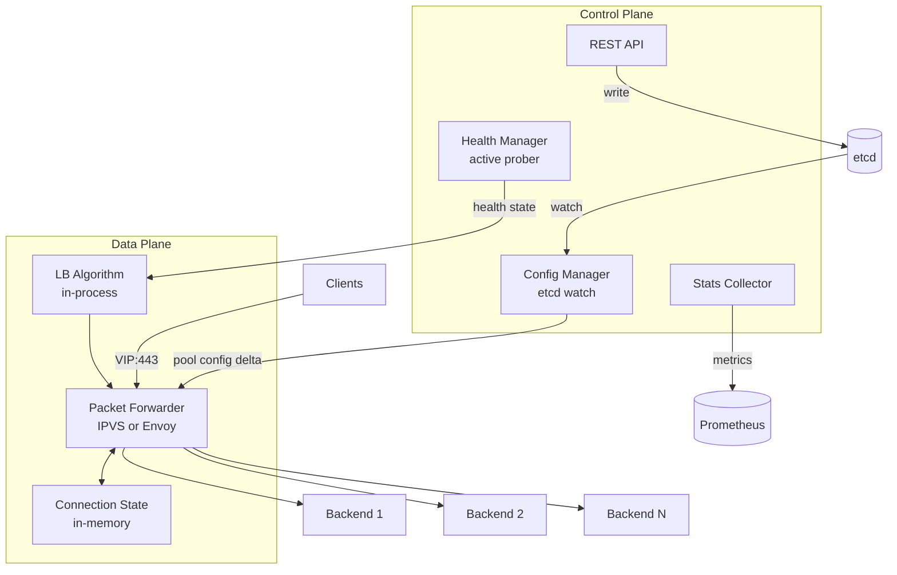
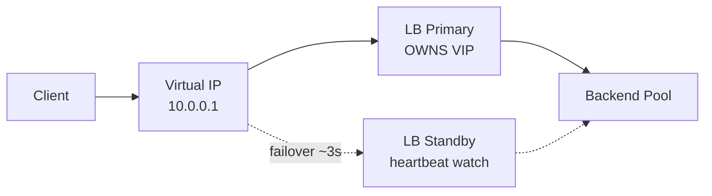
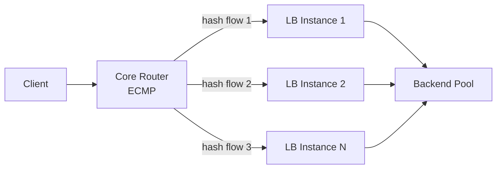
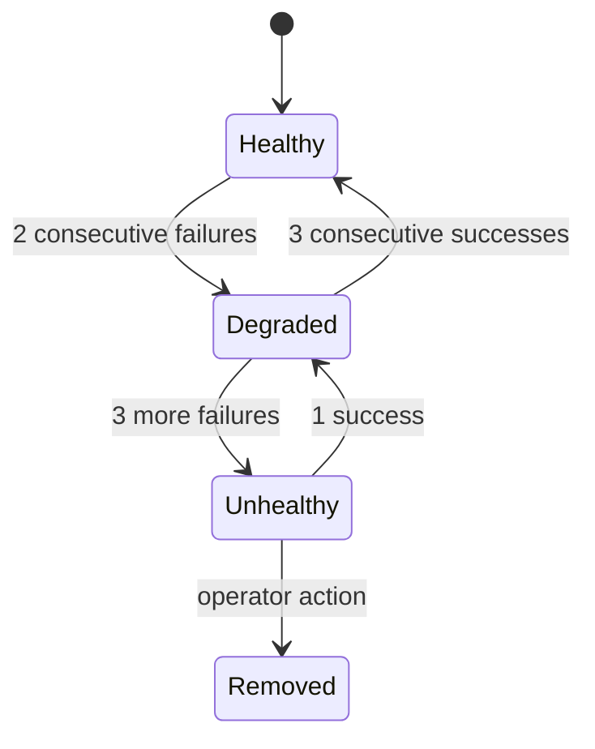

# Design a Load Balancer

A load balancer distributes incoming network traffic across a pool of backend servers. Every major internet system — from Google to Stripe to Netflix — sits behind one. But designing a load balancer from scratch is a senior-level question: the challenge isn't the round-robin algorithm, it's making the LB itself highly available, keeping its forwarding overhead under 1ms, detecting backend failures in seconds, and scaling the LB when it becomes the bottleneck.

This is the infrastructure problem behind the infrastructure.

---

## Functional Requirements

**In Scope:**
- Distribute incoming TCP/UDP and HTTP/HTTPS connections across a pool of backend servers
- Multiple load balancing algorithms: Round Robin, Weighted Round Robin, Least Connections, Consistent Hashing
- Active health checking: detect unhealthy backends and stop routing to them within seconds
- Layer 4 (TCP/UDP) and Layer 7 (HTTP/HTTPS) operating modes
- SSL/TLS termination (L7 mode only)
- Session persistence (sticky sessions) — route a client to the same backend for a session lifetime
- Connection draining: gracefully remove a backend without dropping in-flight requests
- Dynamic backend registration and deregistration (zero-downtime pool changes)

**Out of Scope:**
- Web Application Firewall (WAF) and DDoS scrubbing
- API Gateway concerns (authentication, request transformation, rate limiting at the app layer)
- Full CDN functionality (edge caching, media delivery)
- Service mesh sidecar proxy (that's Envoy/Istio territory)

---

## Non-Functional Requirements

| Property | Target | Reasoning |
|---|---|---|
| **Added Latency** | < 1ms per hop | LB overhead must be invisible to end users |
| **Throughput** | 1M concurrent connections, 500K new conn/sec | Production cloud LB baseline (AWS NLB scale) |
| **Availability** | 99.999% (five nines) | The LB itself must never be the SPOF for downstream services |
| **Health convergence** | Detect failure within 5–10 seconds | Faster = more false positives; slower = more user errors |
| **Config propagation** | Pool changes applied within 1–2 seconds | New backends must receive traffic quickly after registration |
| **Horizontal scalability** | LB tier must scale out linearly | At 1M+ RPS, a single LB instance becomes the bottleneck |

**Key tradeoff:** The LB data plane must be **stateless and blindingly fast** — every feature that requires state (sticky sessions, connection tracking) adds latency and complicates horizontal scaling. Design the data plane to be stateless by default; push state to external stores only when the feature truly requires it.

---

## Capacity Estimation

**Connections:**
- 1M concurrent connections sustained
- 500K new connections/sec peak (each connection is ~10μs CPU on a tuned kernel)
- 10 Gbps aggregate inbound throughput

**Backend pool scale:**
- Typical pool: 10–1,000 backend servers
- Health probes: 1 probe/2s per backend × 1,000 backends = 500 probe req/sec — negligible

**State overhead:**
- Per-connection state: ~200 bytes × 1M connections = **200 MB in-memory** — fits in a single process
- Sticky session table: 10M active sessions × 50 bytes = **500 MB** — fits in Redis

---

## Core Entities

| Entity | Purpose | Key Fields |
|---|---|---|
| **Frontend** | The client-facing entry point; what clients connect to | `frontend_id`, `vip` (Virtual IP), `port`, `protocol` (TCP/HTTP/HTTPS), `backend_pool_id` |
| **BackendPool** | Named group of backends associated with a frontend | `pool_id`, `name`, `algorithm`, `health_check_config`, `session_affinity` |
| **Backend** | A single upstream server in a pool | `backend_id`, `pool_id`, `ip`, `port`, `weight`, `health_state`, `active_connections` |
| **HealthCheck** | Configuration for probing a backend | `check_id`, `protocol` (TCP/HTTP), `path`, `interval_ms`, `timeout_ms`, `healthy_threshold`, `unhealthy_threshold` |
| **StickySession** | Binds a client key to a specific backend | `session_key` (hashed IP or cookie value), `backend_id`, `expires_at` |

**Relationships:**
- One `Frontend` → one `BackendPool` → many `Backends`
- Each `BackendPool` has exactly one `HealthCheck` configuration
- `StickySession` entries are optional (only exist if session affinity is enabled on the pool)

---

## Databases and Database Design

A load balancer's persistence needs are different from application services. The hot path (packet forwarding) must touch **zero databases** — all routing decisions happen in memory. Databases are only used by the control plane.

### Storage Tier Decisions

| Data | Access Pattern | Choice |
|---|---|---|
| Backend pool configuration | Low-write, must be strongly consistent, distributed | **etcd** |
| Per-instance connection state | Ultra-hot reads/writes (~500K/sec) | **In-process memory** (hash map) |
| Health state | Written by health manager, read by forwarder | **In-process memory** + gossip |
| Sticky session affinity | Cross-instance reads, TTL-based expiry | **Redis** |
| Metrics / observability | Time-series, high write volume | **Prometheus** |

### etcd — Configuration Store

etcd is the source of truth for backend pool definitions. LB instances watch etcd for changes and update their in-memory routing tables atomically.

```
Key:   /lbs/{lb_id}/pools/{pool_id}/backends/{backend_id}
Value: {
  "ip":     "10.0.1.45",
  "port":   8080,
  "weight": 100,
  "state":  "enabled"    // enabled | draining | disabled
}
```

- **Why etcd over ZooKeeper:** etcd's watch API is lower latency and simpler to operate; leader election and linearizable reads are built-in
- **Watch semantics:** Every LB instance maintains an etcd watch on its pool prefix — config changes propagate in < 100ms
- **Atomic pool updates:** Adding/removing multiple backends in a single etcd transaction prevents partial reads during batch changes

### In-Memory Connection State

The per-connection state table lives entirely in memory on each LB instance. It maps `(src_ip, src_port, dst_port) → backend_id` for active connections.

```
Connection Table (hash map in LB process):
Key:   5-tuple (src_ip, src_port, dst_ip, dst_port, protocol)
Value: { backend_id, established_at, bytes_in, bytes_out }
```

- No persistence — connection state is ephemeral. If the LB crashes, TCP connections reset and clients reconnect.
- At 1M concurrent connections × 200 bytes/entry = 200 MB — trivial for a modern server

### Redis — Sticky Session Store

When session affinity is enabled, the sticky session mapping must survive LB instance restarts and work across multiple LB instances.

```
Key:   sticky:{pool_id}:{session_key}         // session_key = HMAC of client IP or cookie value
Value: backend_id (string)
TTL:   session timeout (e.g., 3600s)

// Lookup on each request:
GET sticky:{pool_id}:{session_key}
// If not found: run load balancing algorithm, SET with NX + TTL
```

- **Why Redis over etcd for sessions:** Sessions are high-volume and ephemeral; etcd is designed for low-volume, durable config — using it for millions of session keys would be an anti-pattern
- **Sharding:** Partition by `pool_id` hash; each pool's sessions land on a predictable Redis shard

### Consistency Model

| Data | Consistency | Reasoning |
|---|---|---|
| Pool config | Strong (linearizable via etcd) | A backend added to the pool must immediately be eligible to receive traffic |
| Health state | Eventually consistent (gossip) | 1–2s lag in health propagation is acceptable |
| Sticky sessions | Eventual (Redis async replication) | A single session routing to a different backend momentarily is acceptable |
| Connection state | No persistence needed | Ephemeral — connection resets on LB failure are unavoidable at L4 |

---

## API Design

The load balancer exposes a **control plane REST API** for operators and automation (CI/CD pipelines, auto-scalers).

**Create a backend pool:**
```http
POST /v1/pools
{
  "name": "api-servers-prod",
  "algorithm": "least_connections",
  "health_check": {
    "protocol": "HTTP",
    "path": "/healthz",
    "interval_ms": 5000,
    "timeout_ms": 2000,
    "healthy_threshold": 2,
    "unhealthy_threshold": 3
  },
  "session_affinity": "cookie"
}
// 201 Created → { "pool_id": "pool_abc123", ... }
```

**Register a backend server:**
```http
POST /v1/pools/{pool_id}/backends
{ "ip": "10.0.1.45", "port": 8080, "weight": 100 }
// 201 Created → { "backend_id": "be_xyz", "state": "enabled" }
```

**Drain a backend (graceful removal):**
```http
PATCH /v1/pools/{pool_id}/backends/{backend_id}
{ "state": "draining" }
// 200 OK — no new connections routed; existing connections complete naturally
// Caller polls until active_connections == 0, then DELETEs the backend
```

**Get pool health status:**
```http
GET /v1/pools/{pool_id}/health

200 OK
{
  "pool_id": "pool_abc123",
  "healthy_backends": 18,
  "unhealthy_backends": 2,
  "backends": [
    { "backend_id": "be_001", "ip": "10.0.1.45", "state": "healthy",   "active_connections": 842 },
    { "backend_id": "be_002", "ip": "10.0.1.46", "state": "unhealthy", "active_connections": 0,  "last_failure": "HTTP 500" }
  ]
}
```

**Get real-time metrics:**
```http
GET /v1/pools/{pool_id}/metrics?window=1m

200 OK
{
  "rps": 48200,
  "active_connections": 94000,
  "p99_latency_ms": 12,
  "error_rate_pct": 0.02
}
```

---

## High-Level Design

The load balancer has two completely separate planes with different requirements:



**Control Plane (latency-tolerant, correctness-critical):**
- **Config Manager:** Watches etcd; atomically updates the in-memory routing table when backends are added/removed/drained
- **Health Manager:** Independently probes each backend on a timer; updates health state visible to the forwarding algorithm
- **REST API:** Operator interface for pool management; all writes go through etcd for consistency

**Data Plane (latency-critical, must never block):**
- **Packet Forwarder:** The actual forwarding engine — IPVS for L4 (kernel-space), Envoy/Nginx for L7 (user-space)
- **LB Algorithm:** Runs in-process; selects backend in O(1) or O(log N) using the current health table
- **Connection State:** In-memory hash map; never touches disk

**Critical design principle:** The data plane reads health state and pool config from memory — it **never calls etcd or Redis on the hot path**. The control plane asynchronously pushes updates to the data plane's in-memory tables.

---

## Deep Dives

### 1. The LB's Own High Availability (Who Guards the Guardian?)

**The problem:** If the load balancer is a single server, it's a single point of failure for every service behind it. You've distributed the backend tier but centralized the entry point.

**Active-Passive (VRRP / Keepalived):**



- VRRP protocol: primary advertises ownership of the VIP; standby promotes itself if heartbeat stops
- Failover time: ~3 seconds — acceptable for most services, unacceptable for high-frequency trading
- Simplest to operate; primary handles 100% of load; standby is idle waste

**Active-Active via ECMP (production standard):**



- **ECMP (Equal-Cost Multi-Path):** The upstream router hashes each TCP flow `(src_ip, src_port, dst_ip, dst_port)` and routes to one of N LB instances
- Flow affinity ensures packets for the same TCP connection always reach the same LB instance (connection state is per-instance in-memory)
- If one LB instance dies, the router redistributes its flows — TCP connections reset, clients reconnect within 1–2 seconds
- **Anycast:** All LB instances announce the same IP via BGP; the network routes each client to the topologically nearest LB instance. Used by Cloudflare, Google, Fastly for global LB

---

### 2. Layer 4 vs Layer 7 — Choosing the Right Mode

| | **Layer 4 (TCP/UDP)** | **Layer 7 (HTTP/HTTPS)** |
|---|---|---|
| **How it works** | Forward packets without parsing content; modify src/dst IP | Terminate TCP connection; parse HTTP; open new TCP to backend |
| **Latency overhead** | < 100μs (kernel IPVS / eBPF) | 1–5ms (full TCP handshake + HTTP parse) |
| **Protocol support** | Any TCP/UDP protocol | HTTP, WebSocket, gRPC only |
| **SSL termination** | Not supported | Yes — offloads crypto from backends |
| **Routing capabilities** | IP:port only | URL path, Host header, JWT claims, cookies |
| **Sticky sessions** | Source IP hash only | Cookie injection, header-based |
| **Observability** | Byte counts, connection counts | Request rate, latency percentiles, HTTP status codes |

**Production architecture typically layers both:**

```
Client → L4 LB (Anycast, ECMP) → L7 LB (Envoy/Nginx) → Backend
```

The L4 tier absorbs scale and provides HA (stateless, ECMP-friendly). The L7 tier provides SSL termination, path-based routing, and rich observability. L4 adds < 100μs; L7 adds 1–3ms — usually acceptable.

---

### 3. Health Check Design: Hysteresis and Connection Draining

**The problem:** Naive health checks create two failure modes:
- **False positives:** A briefly slow backend (GC pause, deploy restart) gets marked unhealthy, causing unnecessary traffic redistribution and thundering herd on remaining backends
- **False negatives:** A genuinely dead backend stays "healthy" for too long, causing user-visible errors

**Solution — Hysteresis thresholds:**



- Require **3 consecutive failures** before marking unhealthy (filters transient blips)
- Require **3 consecutive successes** to restore (prevents flapping)
- "Degraded" state: still receives traffic but with reduced weight (graceful degradation before full removal)

**Connection draining — Zero-downtime deploys:**

When a backend is removed (deploy, scale-down, maintenance), you cannot hard-remove it:
1. Set backend state to `draining` via the API
2. LB stops routing **new connections** to it
3. **Existing connections continue** until they naturally close
4. When `active_connections == 0`, the backend is safely removed
5. Deploy scripts poll the health API and wait for drain completion before terminating the server process

Without draining, every rolling deploy causes connection resets visible to users.

---

### 4. Load Balancing Algorithms — The Right Tool for Each Job

**Round Robin:** Cycles through backends in order. Simple and O(1). Fails when backends have heterogeneous capacity or when requests have wildly varying cost.

**Weighted Round Robin:** Same as Round Robin but a backend with `weight=2` gets twice the requests. Use when backends have different CPU/memory capacity.

**Least Connections:** Route to the backend with the fewest active connections. Better for long-lived connections (WebSockets, database proxies) where a burst of connections to one backend creates real imbalance. Requires reading `active_connections` from the connection state table — O(N) to find minimum, or O(log N) with a heap.

**Power of Two Choices (P2C):** Pick 2 backends at random; route to the one with fewer active connections. Near-optimal load distribution with O(1) overhead. Avoids the coordination overhead of global-minimum least-connections while being far better than pure random.

```
// P2C selection
a = pool.random()
b = pool.random()
return (a.active_connections < b.active_connections) ? a : b
```

**Consistent Hashing:** Hash the client key (IP or session cookie) to a position on a ring; route to the first backend clockwise. When backends are added/removed, only `1/N` of the key space remaps (vs. full remapping in modulo hashing). Essential for stateful services and cache backends.

**Recommendation:**
- Stateless HTTP APIs → **P2C** (best balance with lowest overhead)
- Cache backends → **Consistent Hashing** (minimize cache miss storms on pool changes)
- Long-lived connections → **Least Connections**
- Mixed-capacity pools → **Weighted Round Robin**

---

### 5. Scaling the LB Tier Itself

**The problem:** At 500K new connections/sec, even a beefy server running Nginx saturates. You need to scale the LB horizontally — but LBs have per-connection state.

**The key insight: make the data plane stateless.**

With ECMP + consistent flow hashing at the router layer, the same TCP flow always reaches the same LB instance. This means each LB instance only needs local in-memory state for its own flows — no shared state between LB instances (except sticky sessions in Redis).

Scaling procedure:
1. Add a new LB instance; register it with the upstream router as an ECMP next-hop
2. Router begins hashing some new flows to the new instance
3. Existing flows continue to their original LB instance uninterrupted
4. No redistribution of in-flight connections — TCP sessions are never disrupted during scale-out

**eBPF for ultra-low-latency L4:**

Modern production LBs (Facebook's Katran, Cloudflare's Unimog) use **eBPF programs attached to XDP (eXpress Data Path)** to forward packets entirely in the kernel NIC driver, bypassing the kernel networking stack. This achieves packet forwarding at 10–25 million packets/sec on commodity hardware — roughly 10× better than IPVS.

**Tradeoff:** eBPF/XDP requires Linux 4.8+ and careful kernel version management. For most teams, IPVS (kernel-space, simpler) is the right starting point; eBPF is a scaling optimization for the 10M+ RPS tier.

---

## Summary: Key Engineering Decisions

| Decision | Choice | Why |
|---|---|---|
| Config store | etcd | Linearizable reads, watch API, purpose-built for distributed config |
| Data plane state | In-process memory only | Zero latency; LB crashing resets connections, which is acceptable |
| HA strategy | ECMP + Anycast | Scales to any number of LB instances; no failover lag |
| L4 forwarding engine | IPVS → eBPF/XDP at scale | IPVS is operationally simple; eBPF handles 10M+ pps when needed |
| Default algorithm | Power of Two Choices | Near-optimal balance with O(1) selection overhead |
| Health check | Hysteresis (3-up / 5-down) | Filters transient failures; prevents flapping during slow deploys |
| Session affinity | Consistent Hashing + Redis | Minimizes remapping on pool changes; survives LB instance restarts |

The most important insight in a load balancer design interview: **the LB itself must be stateless on the data plane**. Every feature that requires cross-instance state (sticky sessions, rate limiting) must push that state to an external store — and every nanosecond you spend accessing that store on the hot path is latency you're adding to every user request.
