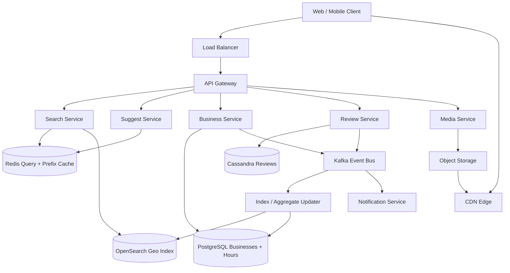
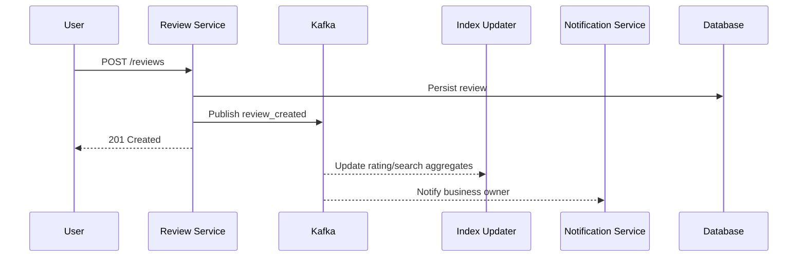
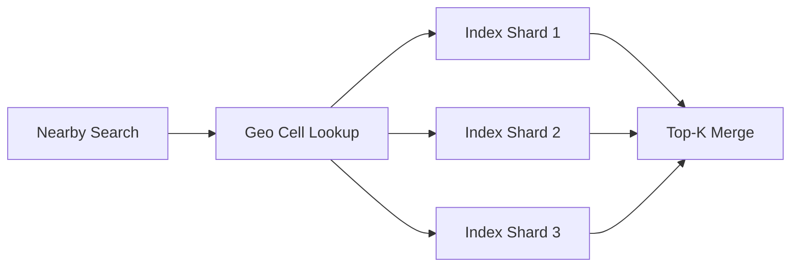
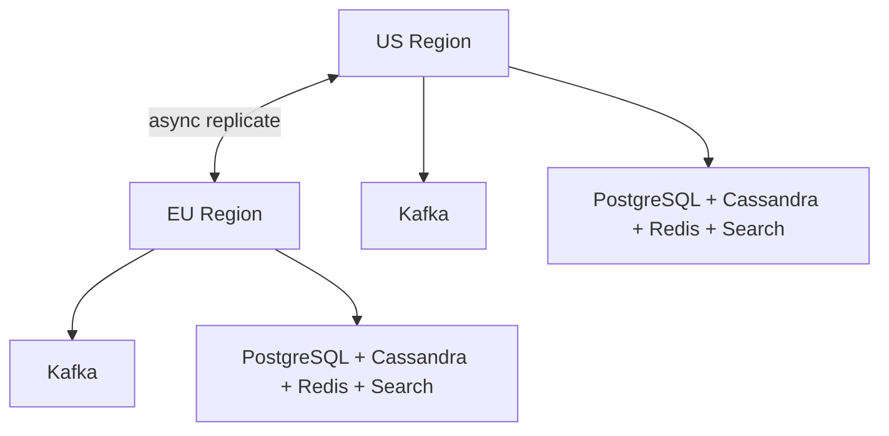

# Design Location-Based Service / Yelp

Yelp or a similar local discovery platform is a strong system design interview problem because it combines a read-heavy **geospatial search system** with a write-heavy **reviews, photos, and business-update pipeline**. The user experience looks simple, but the system still has to solve geo-indexing, hot-city skew, review consistency, cache invalidation, and search freshness at large scale.

---

## Functional Requirements

**In Scope:**
- Users can search nearby businesses by text query, category, and location
- Users can filter by rating, price tier, distance, open-now, and category
- Users can open a business detail page with address, hours, photos, and reviews
- Users can rate a business, write a review, and upload photos
- Business owners can update core metadata such as hours, phone, and menu links
- The system supports autocomplete and nearby popular queries
- Users can save businesses and view recent history

**Out of Scope:**
- Food delivery and checkout flows
- Reservation booking infrastructure
- Ads and sponsored ranking internals
- Advanced fraud-model training and review-spam detection internals
- Turn-by-turn navigation and route guidance

---

## Non-Functional Requirements

| Property | Target | Reasoning |
|---|---|---|
| **Nearby Search Latency** | p99 < 200ms | Local search must feel instant while users are moving or exploring |
| **Autocomplete Latency** | p99 < 50ms | Prefix suggestions are part of the typing loop |
| **Availability** | 99.99% for search and business detail reads | Discovery is the primary user path and must stay highly available |
| **Durability** | No loss of reviews, photos, or verified business edits | User-generated content and business data are long-lived assets |
| **Consistency** | Strong for review ownership and verified business edits; eventual for search index, aggregates, and ranking features | Slightly stale star counts are fine; dropped reviews are not |
| **Scale** | 100M+ MAU, 100M+ businesses, billions of reviews/photos | Geospatial skew and read amplification dominate the design |
| **Reliability** | Graceful degradation under hot-city and hot-business spikes | One trendy restaurant in Manhattan should not overload the whole fleet |

**Key tradeoff:** the platform optimizes for **fast local search over perfectly fresh secondary data everywhere**. A star count or open-now flag that lags by a few seconds is usually acceptable. Slow search, missing reviews, or broken business ownership updates are not.

---

## Capacity Estimation

**Search traffic:**
- Assume **1B local searches/day** -> ~11.5K/sec average
- With time-of-day and regional spikes, peak traffic can exceed **100K/sec**
- Autocomplete often multiplies that because one final query can generate 5-10 prefix lookups

**Data scale:**
- **100M businesses** globally
- **5B reviews** and **10B photos** over time
- Photos and search indexes push storage into PB-scale territory

**Write traffic:**
- Millions of review, photo, and business-update writes per day
- Hot neighborhoods and viral businesses create localized skew rather than uniform load

**Geospatial behavior:**
- Searches are highly clustered in dense urban zones, airports, downtowns, and tourist areas
- The system must handle local hotspots much better than a uniform-load assumption suggests

---

## Core Entities

| Entity | Purpose | Key Fields | Relationships |
|---|---|---|---|
| **User** | End-user identity | `user_id`, `name`, `home_city`, `created_at`, `status` | writes reviews, uploads photos, saves businesses |
| **Business** | Canonical local listing | `business_id`, `name`, `category_ids`, `address`, `lat`, `lng`, `status`, `updated_at` | has reviews, photos, and owner-managed metadata |
| **BusinessHours** | Structured open/close schedule | `business_id`, `day_of_week`, `opens_at`, `closes_at`, `timezone` | belongs to one business |
| **Review** | User rating and text review | `review_id`, `business_id`, `author_user_id`, `rating`, `body`, `created_at` | belongs to one business and one user |
| **Photo** | User- or owner-uploaded media | `photo_id`, `business_id`, `uploader_user_id`, `object_key`, `caption`, `created_at` | belongs to one business |
| **CheckInEvent** | Optional behavioral or popularity signal | `event_id`, `business_id`, `user_id`, `created_at`, `source` | used for trending and ranking signals |
| **SavedBusiness** | Bookmark or favorite edge | `user_id`, `business_id`, `saved_at` | many-to-many between users and businesses |
| **GeoCellAggregate** | Derived search/ranking helper per cell | `cell_id`, `business_count`, `top_categories`, `updated_at` | derived from business and interaction data |

**Critical modeling decisions:**
- `Business` and `BusinessHours` are separate because schedule logic changes often and needs structured queries.
- `GeoCellAggregate` is derived state, not a source-of-truth table. If lost, it can be rebuilt from business and interaction data.
- Reviews, photos, and bookmarks are append-heavy user content and should not live inside one monolithic business row.

---

## Databases and Database Design

### Storage Tier Decisions

| Data | Access Pattern | Engine | Why |
|---|---|---|---|
| Business metadata and owner edits | transactional writes, business-id lookups, moderate write volume | **PostgreSQL + PostGIS** | strong consistency for verified edits and rich location-aware admin queries |
| Geospatial search index | text + filter + geo ranking, top-K retrieval | **OpenSearch / Elasticsearch** | inverted index plus geo distance/filter support is ideal for nearby search |
| Reviews and user-generated text | append-heavy writes, business-scoped reads, time-ordered pagination | **Cassandra / ScyllaDB** | predictable writes and cheap wide-partition reads |
| Hot business cache, autocomplete cache, rate limits | sub-millisecond reads, TTL-driven hot keys | **Redis** | ideal for prefix caching, hot listing caches, and request coalescing |
| Photos and media | immutable large blobs | **Object Storage + CDN** | cheapest and most scalable path for user-uploaded media |
| Business updates, review events, indexing side effects | append-only durable streams | **Kafka** | decouples write path from indexing, notifications, and analytics |

This is intentionally polyglot. The system separates **transactional business metadata**, **geo/text serving index**, **append-heavy reviews**, and **hot caches** because their access patterns are fundamentally different.

### Schema 1 - Businesses (PostgreSQL + PostGIS)

```sql
CREATE TABLE businesses (
  business_id         UUID PRIMARY KEY DEFAULT gen_random_uuid(),
  name                VARCHAR(255) NOT NULL,
  owner_user_id       UUID,
  phone               VARCHAR(32),
  price_tier          SMALLINT,
  status              VARCHAR(16) NOT NULL DEFAULT 'active',
  location            GEOGRAPHY(POINT, 4326) NOT NULL,
  average_rating      DECIMAL(3,2) DEFAULT 0,
  review_count        BIGINT NOT NULL DEFAULT 0,
  updated_at          TIMESTAMPTZ DEFAULT NOW()
);

CREATE INDEX idx_businesses_location ON businesses USING GIST(location);
```

The source-of-truth business row stays transactional, but it is not the primary nearby-search serving path at scale. That job moves to the search index.

### Schema 2 - Business Hours (PostgreSQL)

```sql
CREATE TABLE business_hours (
  business_id         UUID NOT NULL REFERENCES businesses(business_id),
  day_of_week         SMALLINT NOT NULL,
  opens_at            TIME NOT NULL,
  closes_at           TIME NOT NULL,
  timezone            VARCHAR(64) NOT NULL,
  PRIMARY KEY (business_id, day_of_week, opens_at)
);
```

Structured hours make `open_now` filters simpler than trying to encode schedule state in unstructured text.

### Schema 3 - Reviews by Business (Cassandra)

```sql
CREATE TABLE reviews_by_business (
  business_id         UUID,
  bucket_month        TEXT,
  created_at          TIMESTAMP,
  review_id           UUID,
  author_user_id      UUID,
  rating              INT,
  body                TEXT,
  helpful_count       BIGINT,
  PRIMARY KEY ((business_id, bucket_month), created_at, review_id)
) WITH CLUSTERING ORDER BY (created_at DESC, review_id DESC);
```

Monthly buckets prevent one famous business from becoming an unbounded hot partition while preserving efficient recent-review reads.

### Schema 4 - Photos (PostgreSQL)

```sql
CREATE TABLE photos (
  photo_id            UUID PRIMARY KEY DEFAULT gen_random_uuid(),
  business_id         UUID NOT NULL REFERENCES businesses(business_id),
  uploader_user_id    UUID NOT NULL,
  object_key          TEXT NOT NULL,
  caption             TEXT,
  created_at          TIMESTAMPTZ DEFAULT NOW()
);

CREATE INDEX idx_photos_business_created
  ON photos (business_id, created_at DESC);
```

### Schema 5 - Saved Businesses (PostgreSQL)

```sql
CREATE TABLE saved_businesses (
  user_id             UUID NOT NULL,
  business_id         UUID NOT NULL REFERENCES businesses(business_id),
  saved_at            TIMESTAMPTZ DEFAULT NOW(),
  PRIMARY KEY (user_id, business_id)
);
```

### Schema 6 - Search Index Document (Logical)

```json
{
  "business_id": "biz_123",
  "name": "Blue Bottle Coffee",
  "categories": ["coffee", "cafes"],
  "location": { "lat": 37.776, "lon": -122.423 },
  "price_tier": 2,
  "rating": 4.6,
  "review_count": 2812,
  "open_now": true,
  "city": "San Francisco",
  "updated_at": "2026-06-03T10:00:00Z"
}
```

This denormalized search document is what nearby search actually queries. It avoids transactional joins in the hot path.

### Sharding and Replication Strategy

| Store | Shard Key | Strategy | Replication |
|---|---|---|---|
| Businesses / Hours | `business_id` | logical hash sharding after single-cluster growth | primary + read replicas |
| Reviews | `(business_id, bucket_month)` | consistent hashing across Cassandra nodes | RF=3, `LOCAL_QUORUM` writes |
| Search Index | geo/text shard ranges | shard + replica fanout | 2-3 serving replicas per shard |
| Redis | query hash / prefix / business key | Redis Cluster | 1 replica per master |
| Kafka | `business_id` or `review_id` | partitioned durable log | RF=3 |

**Consistency model:**
- Strong consistency for verified business edits, business ownership, and review ownership
- Eventual consistency for search indexing, autocomplete popularity, star aggregates, and `open_now` cache propagation

**Read/write patterns:**
- **Search path:** query normalization -> Redis head-query cache -> OpenSearch geo/text shard fanout -> business summary assembly
- **Write path:** business or review write -> transactional store -> Kafka -> indexer, aggregate updater, notifications
- **Media path:** photo upload -> object storage -> CDN; app servers stay off the heavy media path

---

## API Design

**Search nearby businesses:**
```http
GET /v1/search?q=coffee&lat=37.776&lng=-122.423&radius_m=3000&open_now=true&price_tier=2&cursor=eyJzY29yZSI6MTIzLjQ1fQ==&limit=20

200 OK
{
  "items": [
    {
      "business_id": "biz_123",
      "name": "Blue Bottle Coffee",
      "rating": 4.6,
      "review_count": 2812,
      "distance_m": 420,
      "open_now": true
    }
  ],
  "next_cursor": "eyJzY29yZSI6MTE4LjIyfQ==",
  "has_more": true
}
```

> Cursor-based pagination on ranking cursor. Offset pagination (`?page=N`) becomes expensive and unstable for deep paging across distributed search shards.

**Autocomplete suggestions:**
```http
GET /v1/suggest?prefix=cof&lat=37.776&lng=-122.423&limit=8

200 OK
{
  "suggestions": [
    "coffee",
    "coffee roasters",
    "coffee shops open now"
  ]
}
```

**Get business details:**
```http
GET /v1/businesses/biz_123

200 OK
{
  "business_id": "biz_123",
  "name": "Blue Bottle Coffee",
  "phone": "+1-415-555-0100",
  "rating": 4.6,
  "review_count": 2812,
  "hours": [{ "day": 1, "opens_at": "07:00", "closes_at": "19:00" }],
  "photos": ["https://cdn.yelp.example/p/photo_1.jpg"]
}
```

**Create a review:**
```http
POST /v1/businesses/biz_123/reviews
Authorization: Bearer <jwt>
Idempotency-Key: review-6d7f-001

{
  "rating": 5,
  "body": "Great espresso and very fast service."
}

201 Created
{
  "review_id": "rev_789",
  "business_id": "biz_123",
  "status": "published"
}
```

**Request photo upload URL:**
```http
POST /v1/businesses/biz_123/photos/upload-url
Authorization: Bearer <jwt>

{
  "content_type": "image/jpeg",
  "size_bytes": 2048000
}

200 OK
{
  "photo_id": "photo_456",
  "upload_url": "https://storage.yelp.example/upload/photo_456?sig=...",
  "expires_in": 300
}
```

**Update verified business info:**
```http
PATCH /v1/businesses/biz_123
Authorization: Bearer <jwt>

{
  "phone": "+1-415-555-0199",
  "hours": [{ "day": 1, "opens_at": "06:30", "closes_at": "20:00" }]
}

200 OK
{
  "business_id": "biz_123",
  "status": "updated"
}
```

**Real-time owner dashboard stream (SSE):**
```http
GET /v1/businesses/biz_123/owner-stream
Authorization: Bearer <jwt>
Accept: text/event-stream
```
Core local discovery remains request-response. Real-time streaming is optional and mainly useful for owner dashboards, moderation tools, or operational alerting.

---

## High-Level Design



**Component responsibilities:**

| Component | Role |
|---|---|
| **API Gateway** | Auth, routing, rate limiting, regional steering |
| **Search Service** | Nearby business search, ranking, filter handling, result assembly |
| **Suggest Service** | Prefix suggestions and popular nearby query completions |
| **Business Service** | Source-of-truth business metadata, verified owner edits, hours management |
| **Review Service** | Creates and reads reviews, rating aggregates, and business review pagination |
| **Media Service** | Photo metadata management and pre-signed upload flow |
| **OpenSearch Geo Index** | Geo + text retrieval, filtering, and top-K candidate serving |
| **Kafka** | Durable event backbone for reviews, business edits, indexing, and notifications |
| **Redis** | Head-query cache, autocomplete cache, hot business cache, rate limits |
| **CDN** | Serves business photos and static media |

**Nearby search flow:**
1. Client → `GET /v1/search` → API Gateway → Search Service
2. Search Service normalizes the query, checks Redis for a cached head query, and falls back to the geo/text search index on miss
3. Search index returns top candidate businesses filtered by location, category, price, and `open_now`
4. Search Service merges candidates with hot business summaries and lightweight aggregates
5. Results are returned immediately while impressions and click context can flow asynchronously to downstream systems

---

## Deep Dives

### 1. Kafka: Required for Review and Business Update Pipelines

Kafka is required for a Yelp-like system, but not on the hot nearby-search path. Every review, photo upload, or business metadata change has multiple downstream side effects: search reindexing, rating aggregates, owner notifications, moderation, and analytics. Keeping those asynchronous protects write latency.



**Why the problem happens:** one content write produces side effects for many different consumers.

**Why it becomes difficult at scale:**
- review and business-edit spikes are bursty around viral businesses or cities
- indexing and moderation have very different SLAs from the write path
- retries and duplicates happen during mobile/network failures

**Production-grade solutions:**
- use topics such as `review.created`, `business.updated`, `photo.added`
- publish from a transactional outbox so the write and the event cannot diverge silently
- keep messages small: business IDs, review IDs, and storage keys, not full media payloads
- prioritize index and aggregate consumers over low-priority analytics when lag grows

**Tradeoffs:** Kafka adds eventual consistency for search freshness and aggregates, but it protects the user-facing write path and gives replay for recovery.

### 2. Redis: Head Queries, Prefix Suggestions, and Hot Businesses

Redis is required because local search traffic is highly skewed. A small set of head queries and a small set of businesses in dense areas receive disproportionate traffic.

| Redis Use | Example Key | Why Redis Fits |
|---|---|---|
| **Query cache** | `q:coffee:sf:v48293` | hot nearby queries repeat constantly |
| **Prefix cache** | `ac:cof:sf` | autocomplete must return in tens of milliseconds |
| **Business summary cache** | `biz:biz_123` | hot listings are fetched repeatedly from search and detail pages |
| **Rate limiting** | `rl:user:{user_id}:review_create` | token buckets are cheap and simple |

**Why the problem happens:** nearby search and business detail pages have high read amplification and obvious hotspots.

**Why it becomes difficult at scale:**
- cache invalidation is tied to review writes, hours changes, and ranking updates
- hot neighborhoods create repeated reads for the same businesses and prefixes
- naive invalidation can trigger thundering herds on PostgreSQL or OpenSearch

**Production-grade solutions:**
- cache only head queries and popular prefixes, not the entire long tail
- version cache keys by index or aggregate generation where practical
- apply stale-while-revalidate for search and autocomplete where freshness tolerance allows it
- coalesce cache misses so one hot key does not trigger a stampede

**Tradeoffs:** Redis dramatically reduces query latency and backend load, but it introduces staleness windows and memory cost. That tradeoff is acceptable for discovery views.

### 3. Geospatial Indexing and Search Fanout

Location-based services are really geo-indexing systems. The main challenge is finding relevant businesses near a point while combining text, filters, and ranking. At scale, that belongs on a geo-aware serving index with cell-based pruning, not the transactional database.



**Why the problem happens:** one local search must combine text relevance, category filters, distance, popularity, and business state like `open_now`.

**Why it becomes difficult at scale:**
- dense urban cells contain huge candidate sets
- sparse suburban or rural cells require widening the search ring
- business ranking is not just distance; quality, popularity, and freshness matter too

**Production-grade solutions:**
- index businesses by hierarchical geo cells such as H3 or geohash
- search the rider's or viewer's cell first, then expand ring-by-ring until enough candidates are found
- use shard-local top-K and global merge instead of full scans
- precompute or cache cell-level category popularity to improve ranking and autocomplete

**Tradeoffs:** wider search radii improve recall but increase latency and reduce locality. Dense cities and sparse rural regions need different defaults.

### 4. Hot Partitions, Dense Cities, and Viral Businesses

Local search is geographically skewed. Manhattan, central Tokyo, airports, tourist districts, and major event zones produce much higher traffic than the median geo cell. On top of that, one viral business can receive a sudden flood of profile views, reviews, and photos.

**Why the problem happens:** local discovery traffic follows real-world population and trend concentration.

**Why it becomes difficult at scale:**
- some geo cells become much hotter than others
- famous businesses can create hotspots on review writes and business-detail reads
- rating aggregates and `open_now` derived state churn repeatedly for a small set of businesses

**Production-grade solutions:**
- split or over-replicate hot geo cells in the search serving tier
- bucket review partitions by time for very hot businesses
- cache hot business summaries aggressively and shard visible counters if needed
- keep media delivery on CDN and off the application servers entirely

**Tradeoffs:** special handling for hot cells and hot businesses adds complexity, but uniform treatment performs badly in real-world city traffic.

### 5. WebSockets and Offline Delivery: Usually Not Required

Core local search does not require WebSockets. Nearby search, autocomplete, and business details fit request-response APIs naturally. Mobile clients can cache recent results or saved businesses, but the backend does not need full offline-first synchronization.

**Why the problem happens:** teams often over-apply real-time infrastructure because it feels modern, not because the product requires it.

**Why it becomes difficult at scale:**
- persistent connections consume memory and connection slots
- reconnect storms complicate deploys and incident handling
- offline synchronization adds complexity with limited product value for a mostly stateless search experience

**Production-grade solutions:**
- keep core search, detail, and review flows on HTTP/JSON
- use SSE or WebSockets only for owner dashboards, moderation consoles, or operational tools if needed
- rely on client caching for saved businesses and recent history rather than backend-driven offline sync

**Tradeoffs:** avoiding unnecessary real-time infrastructure keeps the system simpler, cheaper, and easier to cache.

### 6. Ordering, Search Freshness, and Replication Lag

Business edits and reviews create an ordering problem. A delayed indexer can still process an older snapshot after a newer hours or phone update unless versioning is explicit. The same issue appears across regions, where one region may serve a fresher index generation than another.

**Why the problem happens:** writes, indexing, and cache refreshes are asynchronous and can complete out of order.

**Why it becomes difficult at scale:**
- indexing pipelines and aggregate updaters lag differently
- review count, average rating, and `open_now` views update at different cadences
- multi-region replicas never publish at exactly the same moment

**Production-grade solutions:**
- attach monotonic `version_id` or `updated_at` checks to search-index updates
- publish search generations atomically so readers see a consistent snapshot
- reject stale aggregate updates when they lag behind the latest business version
- accept short-lived cross-region freshness differences rather than globally synchronizing every edit

**Tradeoffs:** perfect global freshness is too expensive for the hot path. Atomic generation publish plus eventual regional convergence is the practical answer.

### 7. Multi-Region Deployment, Queue Backpressure, and Rate Limiting

The platform should run in multiple regions close to users. Nearby search and business details should be served from the nearest healthy region, while business writes replicate asynchronously.



**Why the problem happens:** local search is global, but traffic, business density, and update frequency differ sharply by region and city.

**Why it becomes difficult at scale:**
- cross-region round trips are too expensive for the hot search path
- queue lag can grow during mass business updates, viral review bursts, or indexing incidents
- review, photo-upload, and suggestion endpoints attract spam and abusive automation

**Production-grade solutions:**
- route nearby search to the nearest healthy region with local search replicas
- replicate writes asynchronously and tolerate short-lived freshness differences
- when queues lag, prioritize search index updates and aggregate refresh over lower-priority analytics
- use Redis-backed token buckets for search, suggest, review-create, and photo-upload endpoints

**Tradeoffs:** slight regional freshness skew is cheaper than globally synchronized writes. The practical design favors regional autonomy and eventual convergence.

### 8. Architecture Evolution

| Stage | Design | Why It Breaks | Next Step |
|---|---|---|---|
| **1. MVP** | Single relational DB with basic geo queries and business pages | text + geo search and review reads overload one store | add search index and review store |
| **2. Growth** | OpenSearch for nearby search, PostgreSQL for source-of-truth metadata | cache misses and hot businesses pound the backend | add Redis head-query/business caches |
| **3. Scale** | Separate business, review, search, and media services with Kafka side effects | dense-city skew and index freshness become bottlenecks | add geo-cell tuning, generation versioning, and queue prioritization |
| **4. Global** | Multi-region search replicas with async write replication | exact global freshness is too expensive | keep local search low-latency and accept eventual convergence |

This is the interview pattern to emphasize: start simple, then evolve only the subsystem that is actually hitting scale or correctness limits.
