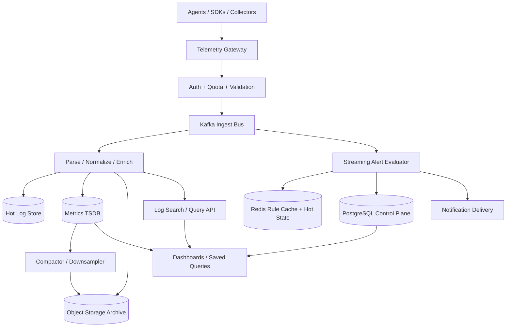
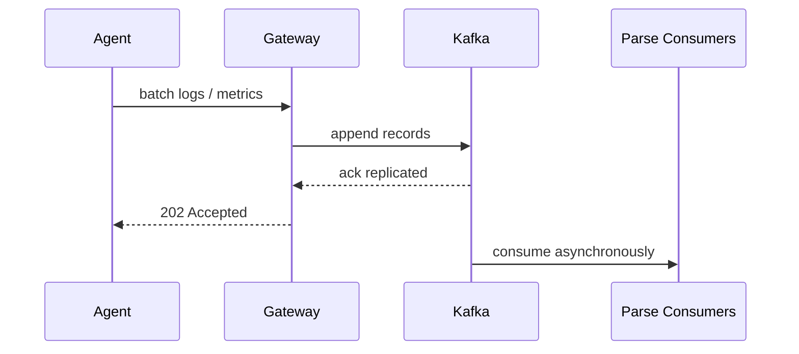
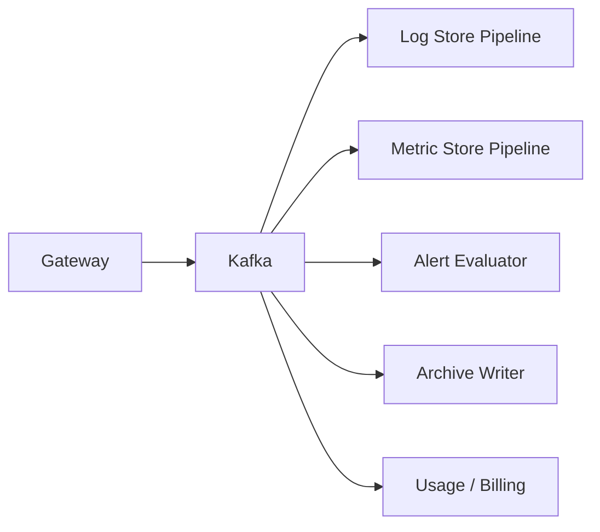
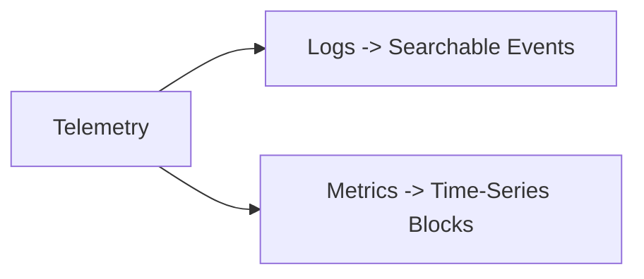
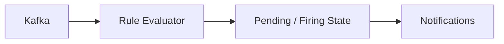
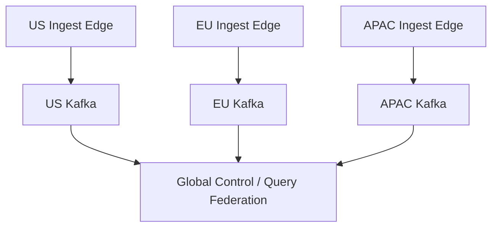

# Design Logging & Metrics Pipeline

Designing a logging and metrics pipeline is a classic observability-system interview problem because it mixes high-ingest streaming, low-latency alerting, long-term retention, cost control, search, and multi-tenant isolation. Every production system emits logs, counters, gauges, histograms, traces, heartbeats, and infrastructure signals, but the operators consuming those signals expect very different things from the platform. They want a live dashboard within seconds, searchable logs over hours or months, fast alert evaluation, durable archival, and enough structure to debug rare incidents without drowning in noisy data.

The surface looks straightforward: applications emit telemetry, the platform stores it, engineers query it. The depth lies in the shape mismatch between workloads. Logs are high-cardinality, semi-structured, append-only events. Metrics are compact numeric time series that need aggregation, rollups, and efficient downsampling. Alerting requires near-real-time stream processing. Long-term compliance retention wants cheap object storage. A good design separates ingestion from query-serving, treats Kafka as the durable fanout backbone, stores logs and metrics in engines optimized for their access patterns, and keeps expensive enrichment off the hot path so applications can keep shipping telemetry even during incidents.

---

## Functional Requirements

**In Scope:**
- Applications, hosts, containers, and network devices can send logs and metrics to the platform
- The platform supports structured and semi-structured logs with labels, severity, timestamps, and source metadata
- Users can query recent logs by service, host, environment, trace id, severity, and time range
- Users can write and query metrics such as counters, gauges, histograms, and summaries
- The system evaluates alert rules on streaming or recent telemetry and triggers notifications
- The platform supports retention policies, archival, downsampling, and tenant-specific quotas
- Operators can inspect ingestion lag, dropped samples, hot partitions, high-cardinality series, and storage health
- The pipeline supports dashboards, saved queries, and near-real-time live tail or metric streaming

**Out of Scope:**
- Full distributed tracing backend internals beyond references to trace ids in logs and metrics
- Detailed visualization engine design for every dashboard widget type
- Log agent internals for every operating system or sidecar runtime
- End-user incident management tooling beyond alert generation and webhook delivery
- ML-based anomaly detection internals beyond acknowledging it as an optional downstream consumer

---

## Non-Functional Requirements

| Property | Target | Reasoning |
|---|---|---|
| **Ingestion Availability** | 99.99% for telemetry acceptance APIs | observability systems are most needed during outages, not after them |
| **Log Query Latency** | p95 < 3s for recent filtered searches | incident response depends on fast narrowing during active failures |
| **Metric Query Latency** | p95 < 1s for common dashboard panels | dashboards are refreshed continuously and must feel interactive |
| **Alerting Freshness** | most alert rules evaluated within 10s of signal arrival | long delays turn alerts into postmortems instead of prevention |
| **Durability** | no acknowledged telemetry should be silently lost | operators must trust the system under retries and partial outages |
| **Scalability** | millions of events/sec and tens of millions of samples/sec | fleet-wide telemetry can dwarf product traffic |
| **Cost Efficiency** | cold retention should be dramatically cheaper than hot search | raw telemetry grows too quickly for all-hot storage |
| **Multi-Tenant Isolation** | one noisy tenant should not starve others | cardinality explosions and log storms are common failure modes |

**Key tradeoff:** the platform prioritizes **durable ingestion and clear hot-versus-cold storage boundaries** over forcing every query into one storage engine. Logs, metrics, alerts, dashboards, and archival have different access patterns, so a single-store design becomes expensive and brittle at scale.

---

## Capacity Estimation

**Fleet assumptions:**
- Assume the platform serves **100K nodes**, **500K containers**, and **20K services** across many tenants
- Suppose average log traffic is **5M log events/sec** with bursts above **20M/sec** during incidents, deploys, or cascading failures
- Suppose metric traffic is **50M metric samples/sec** across application, infrastructure, and business telemetry

**Data size assumptions:**
- Average structured log event after compression-friendly normalization is **300 to 800 bytes**
- Metric samples are small individually, but label cardinality multiplies total series count dramatically
- Histograms and exemplars increase sample count and storage pressure for high-traffic services

**Retention assumptions:**
- Hot searchable logs retained for **7 to 14 days**
- Warm summarized metrics retained for **30 to 90 days**
- Raw logs and metric blocks archived to object storage for **months or years** depending on compliance needs

**Operational profile:**
- Traffic spikes coincide with incidents, exactly when query traffic also spikes
- Misconfigured deployments can create cardinality explosions or log storms that are orders of magnitude above baseline
- Query skew is severe: most investigations focus on recent data, but rare postmortems need older cold data too

---

## Core Entities

| Entity | Purpose | Key Fields | Relationships |
|---|---|---|---|
| **Tenant** | Isolation and billing boundary | `tenant_id`, `name`, `plan_tier`, `retention_policy` | owns pipelines, alert rules, dashboards |
| **LogEvent** | One immutable log record | `event_id`, `tenant_id`, `timestamp`, `service`, `severity`, `body`, `labels` | belongs to one source stream and may reference a trace id |
| **MetricSeries** | Unique metric identity by name and labels | `series_id`, `tenant_id`, `metric_name`, `label_set_hash`, `type` | contains many metric samples |
| **MetricSample** | Numeric observation for a series | `series_id`, `timestamp`, `value`, `sample_type` | appended into time-series blocks |
| **AlertRule** | Declarative alert expression | `rule_id`, `tenant_id`, `query`, `window`, `threshold`, `severity` | evaluated against logs or metrics |
| **AlertInstance** | One triggered alert lifecycle | `instance_id`, `rule_id`, `state`, `started_at`, `fingerprint` | created from alert rule evaluation |
| **IngestionSource** | Agent, SDK, or collector identity | `source_id`, `tenant_id`, `kind`, `auth_key_id`, `environment` | emits logs and metrics |
| **Dashboard** | Saved visualization and query metadata | `dashboard_id`, `tenant_id`, `title`, `layout_json` | references queries and metrics |
| **RetentionPolicy** | Tiering and deletion policy | `policy_id`, `tenant_id`, `hot_days`, `warm_days`, `archive_days` | applied to logs, metrics, and artifacts |
| **DeliveryEndpoint** | Alert notification target | `endpoint_id`, `tenant_id`, `type`, `config_ref`, `status` | used by alert instances |

**Critical modeling decisions:**
- `LogEvent` is immutable. Redaction or deletion workflows should create controlled rewrite or tombstone paths rather than in-place mutation on hot storage.
- `MetricSeries` is separated from `MetricSample` because time-series storage is optimized for append and block compression, not repeated label metadata.
- `AlertInstance` is explicit because alert state transitions such as pending, firing, resolved, and deduplicated are operationally important and should not be inferred only from notifications.

---

## Databases and Database Design

### Storage Tier Decisions

| Data | Access Pattern | Engine | Why |
|---|---|---|---|
| Tenants, auth keys, alert rules, dashboards, quotas | transactional CRUD, exact reads, consistency-sensitive updates | **PostgreSQL** | control-plane metadata benefits from ACID semantics |
| Log ingest backbone, metric ingest backbone, alert evaluation fanout | durable append-only streaming | **Kafka** | decouples ingest from parsing, indexing, storage, and alerts |
| Recent searchable logs | time-range filters, text search, label filters | **ClickHouse or OpenSearch** | optimized for large append-heavy analytical log queries |
| Metrics hot store | time-series reads, rollups, window queries | **Mimir / VictoriaMetrics / Cortex-like TSDB** | optimized for compressed samples, label indexes, and downsampling |
| Raw logs, compacted metric blocks, replay archives | write-once, cheap long-term storage | **Object Storage** | lowest-cost durable retention and backfill source |
| Hot counters, rate limits, query-result hints, live tail cursors | sub-millisecond ephemeral state with TTLs | **Redis** | useful for small hot state, not telemetry truth |

This is intentionally polyglot. A logging and metrics platform needs **transactional control-plane metadata**, **streaming durability**, **search-friendly log storage**, **time-series optimized metric storage**, and **cheap archival**. Trying to force logs and metrics into the same storage layout usually hurts both performance and cost.

### Schema 1 - Tenants and Rules (SQL)

```sql
CREATE TABLE tenants (
  tenant_id                    UUID PRIMARY KEY DEFAULT gen_random_uuid(),
  name                         VARCHAR(255) NOT NULL UNIQUE,
  plan_tier                    VARCHAR(32) NOT NULL,
  retention_policy_id          UUID,
  created_at                   TIMESTAMPTZ DEFAULT NOW()
);

CREATE TABLE alert_rules (
  rule_id                      UUID PRIMARY KEY DEFAULT gen_random_uuid(),
  tenant_id                    UUID NOT NULL REFERENCES tenants(tenant_id),
  name                         VARCHAR(255) NOT NULL,
  rule_type                    VARCHAR(16) NOT NULL,
  query_text                   TEXT NOT NULL,
  window_seconds               INT NOT NULL,
  threshold_value              DOUBLE PRECISION,
  severity                     VARCHAR(16) NOT NULL,
  enabled                      BOOLEAN NOT NULL DEFAULT TRUE,
  created_at                   TIMESTAMPTZ DEFAULT NOW()
);
```

### Schema 2 - Log Events (Columnar Hot Store)

```sql
CREATE TABLE log_events (
  tenant_id                    UUID,
  event_date                   Date,
  timestamp                    DateTime64(3),
  service                      LowCardinality(String),
  environment                  LowCardinality(String),
  severity                     LowCardinality(String),
  trace_id                     String,
  host                         String,
  labels_json                  String,
  body                         String
)
ENGINE = MergeTree
PARTITION BY (tenant_id, event_date)
ORDER BY (tenant_id, service, timestamp);
```

Partitioning by tenant and date keeps recent scans bounded while preserving efficient service and time filters.

### Schema 3 - Metric Samples (Time-Series Block Layout)

```sql
CREATE TABLE metric_samples (
  tenant_id                    UUID,
  metric_name                  String,
  label_set_hash               UInt64,
  timestamp                    DateTime64(3),
  value                        Float64,
  sample_type                  LowCardinality(String)
)
ENGINE = MergeTree
PARTITION BY toDate(timestamp)
ORDER BY (tenant_id, metric_name, label_set_hash, timestamp);
```

In practice, most production systems use a dedicated TSDB that writes compressed blocks rather than a generic SQL table. The simplified schema is here to show the access pattern: append by time, filter by metric and labels, aggregate by windows.

### Schema 4 - Archived Log Manifest (Object Storage JSON)

```json
{
  "tenant_id": "ten_123",
  "segment_id": "logseg_2026_06_03_10_00",
  "time_range": {
    "start": "2026-06-03T10:00:00Z",
    "end": "2026-06-03T10:15:00Z"
  },
  "object_key": "s3://telemetry-archive/logs/ten_123/2026/06/03/logseg_2026_06_03_10_00.parquet",
  "compression": "zstd"
}
```

### Schema 5 - Live Tail Cursor (Logical Redis Record)

```json
{
  "key": "tail:tenant:ten_123:query:8f12ab",
  "value": {
    "last_offset": 982211,
    "expires_at": "2026-06-03T10:05:00Z"
  }
}
```

### Sharding and Replication Strategy

| Store | Shard Key | Strategy | Replication |
|---|---|---|---|
| PostgreSQL control plane | `tenant_id` or org shard | logical tenant sharding as metadata grows | primary + replicas |
| Kafka | `tenant_id`, service, or metric fingerprint depending on topic | partitioned durable log | RF=3 |
| Hot log store | `tenant_id` and date partition | distributed columnar shards | replicas across nodes |
| Metrics TSDB | metric fingerprint or tenant shard | block-based partitioning across ingesters and compactors | RF depends on TSDB mode |
| Redis | `tenant_id` and ephemeral query key | Redis Cluster | 1 replica per master |
| Object Storage | tenant/date namespace | immutable objects with lifecycle rules | multi-AZ durable storage |

**Consistency model:**
- Strong consistency for tenants, rules, quotas, and dashboard metadata
- Durable ordered append for logs and metrics once accepted into Kafka
- Eventual consistency for indexes, rollups, live dashboards, and archived query surfaces
- Best-effort low-latency consistency for query caches and live-tail cursors in Redis

**Read/write patterns:**
- **Ingest path:** agents push telemetry -> gateway validates and batches -> Kafka durable append -> parallel consumers parse, enrich, index, and store
- **Alert path:** stream processor reads Kafka and recent metric state -> evaluates rules -> creates alert instances and delivers notifications
- **Query path:** recent logs from hot log store, metric panels from TSDB, older data from archived blocks or precomputed summaries

---

## API Design

**Ingest logs in batch:**
```http
POST /v1/logs:ingest
Authorization: Bearer <ingest-token>
Content-Type: application/json

{
  "tenant_id": "ten_123",
  "source": {
    "service": "checkout-api",
    "environment": "prod",
    "host": "ip-10-0-4-18"
  },
  "events": [
    {
      "timestamp": "2026-06-03T10:00:00.123Z",
      "severity": "ERROR",
      "trace_id": "4d7f...",
      "message": "payment provider timeout",
      "labels": {
        "region": "us-east-1",
        "pod": "checkout-7d9f"
      }
    }
  ]
}

202 Accepted
{
  "accepted": 1,
  "rejected": 0,
  "ingestion_id": "ing_001"
}
```

**Ingest metrics in batch:**
```http
POST /v1/metrics:ingest
Authorization: Bearer <ingest-token>
Content-Type: application/json

{
  "tenant_id": "ten_123",
  "samples": [
    {
      "metric_name": "http_requests_total",
      "type": "counter",
      "labels": {
        "service": "checkout-api",
        "route": "/payments",
        "status": "500"
      },
      "timestamp": "2026-06-03T10:00:01Z",
      "value": 1
    }
  ]
}

202 Accepted
{
  "accepted": 1,
  "rejected": 0,
  "ingestion_id": "ing_002"
}
```

**Query logs:**
```http
GET /v1/logs/search?query=service:checkout-api%20severity:ERROR&start=2026-06-03T09:00:00Z&end=2026-06-03T10:00:00Z&limit=100
Authorization: Bearer <jwt>

200 OK
{
  "results": [
    {
      "timestamp": "2026-06-03T09:58:10.123Z",
      "service": "checkout-api",
      "severity": "ERROR",
      "message": "payment provider timeout"
    }
  ],
  "next_cursor": "cur_001",
  "has_more": true
}
```

> Cursor-based pagination is preferred for log search. Offset pagination becomes unstable and expensive when new data keeps arriving and query windows are large.

**Run a metric query:**
```http
POST /v1/metrics:query
Authorization: Bearer <jwt>
Content-Type: application/json

{
  "tenant_id": "ten_123",
  "query": "sum(rate(http_requests_total{service=\"checkout-api\",status=~\"5..\"}[5m]))",
  "start": "2026-06-03T09:00:00Z",
  "end": "2026-06-03T10:00:00Z",
  "step_seconds": 30
}

200 OK
{
  "series": [
    {
      "metric": {
        "service": "checkout-api"
      },
      "points": [
        ["2026-06-03T09:59:30Z", 17.2]
      ]
    }
  ]
}
```

**Create an alert rule:**
```http
POST /v1/alert-rules
Authorization: Bearer <jwt>
Content-Type: application/json

{
  "tenant_id": "ten_123",
  "name": "Checkout 5xx spike",
  "rule_type": "metric",
  "query": "sum(rate(http_requests_total{service=\"checkout-api\",status=~\"5..\"}[5m])) > 10",
  "window_seconds": 300,
  "severity": "critical"
}

201 Created
{
  "rule_id": "rule_123",
  "status": "enabled"
}
```

**Live tail stream (optional SSE):**
```http
GET /v1/logs/tail?query=service:checkout-api%20severity:ERROR
Authorization: Bearer <jwt>
Accept: text/event-stream
```
The core pipeline does not require WebSockets for telemetry ingestion. Ingestion is append-heavy and works well over batched HTTP or agent protocols. Optional SSE or WebSockets are useful for live dashboards or log tailing, but they are not the correctness boundary of the system.

---

## High-Level Design



**Component responsibilities:**

| Component | Role |
|---|---|
| **Telemetry Gateway** | Accepts batched logs and metrics from agents or SDKs and shields the backend from untrusted producers |
| **Auth + Quota + Validation** | Verifies tenant auth, schema limits, payload sizes, and rate limits before durable acceptance |
| **Kafka Ingest Bus** | Durable append backbone that decouples producers from parsing, storage, and alerting consumers |
| **Parse / Normalize / Enrich** | Adds normalized labels, parses structured payloads, redacts fields, and routes records to the correct stores |
| **Hot Log Store** | Serves recent searchable logs with time-range and label filters |
| **Metrics TSDB** | Stores compressed metric samples, supports rollups, and answers dashboard and alert queries |
| **Object Storage Archive** | Holds raw logs and compacted metric blocks for long retention and replay |
| **Streaming Alert Evaluator** | Evaluates rules on near-real-time logs and metrics and creates alert instances |
| **Redis Rule Cache + Hot State** | Stores ephemeral evaluation windows, dedup state, and live-tail cursors |
| **PostgreSQL Control Plane** | Stores tenants, alert rules, dashboards, endpoints, quotas, and audit metadata |
| **Notification Delivery** | Sends alert notifications to email, Slack, PagerDuty, webhooks, or internal incident systems |

**Telemetry flow:**
1. Agents and SDKs batch logs and metrics to the telemetry gateway
2. Gateway validates auth, quotas, payload size, and schema boundaries, then appends accepted data to Kafka durably
3. Parsing and enrichment consumers normalize labels, redact fields, and branch data into log storage, metric storage, archival, and downstream consumers
4. Streaming evaluators consume the same durable flow to compute alert conditions and create alert instances without blocking ingestion
5. Query APIs read recent logs from the hot store, metric panels from the TSDB, and older data from archive-backed or rolled-up paths
6. Optional live tail and dashboard streaming layers expose recent updates to users without becoming the core persistence mechanism

---

## Deep Dives

### 1. Ingestion: Durable Acceptance Matters More Than Immediate Queryability

The most important platform decision is where to draw the correctness boundary. Producers should receive success only after telemetry is durably accepted into the ingest backbone, not after parsing, indexing, search availability, and alert evaluation all finish. Otherwise one slow downstream system can backpressure or drop telemetry at exactly the wrong moment.



**Why the problem happens:** search, alerting, redaction, and storage consumers have different latencies and failure modes.

**Why it becomes difficult at scale:**
- incidents create simultaneous ingest spikes and query spikes
- a few slow consumers can otherwise stall the whole pipeline
- producers are often untrusted or lossy, so retries and dedup are unavoidable

**Production-grade solutions:**
- acknowledge telemetry after durable append, not after full processing
- batch aggressively at the edge to reduce per-event overhead
- isolate oversized payload rejection and schema validation before the durable path when possible
- expose consumer lag clearly so teams know ingestion succeeded even if query freshness lags slightly

**Tradeoffs:** durable asynchronous ingest keeps the system resilient, but it means dashboards or log search can temporarily trail raw acceptance during heavy load.

### 2. Kafka: Required and Central

Kafka is usually the backbone of a serious logging and metrics platform. One accepted payload can feed parsing, redaction, hot storage, alert evaluation, archiving, anomaly detection, and billing. Those consumers should not be tightly coupled to one synchronous ingestion service.



**Why the problem happens:** telemetry data needs multiple downstream consumers with different SLAs.

**Why it becomes difficult at scale:**
- replay is essential after parsing bugs, schema changes, or alert rule regressions
- alerting wants low latency, while archival wants throughput and cost efficiency
- tenants can create bursty or pathological traffic patterns

**Production-grade solutions:**
- partition topics by tenant, source, or fingerprint depending on ordering needs
- retain enough history to replay failed downstream pipelines safely
- keep parsing and redaction deterministic so replay gives consistent output
- isolate slow consumers from the ingest acknowledgement path

**Tradeoffs:** Kafka adds operational complexity, but without it the platform becomes harder to scale, recover, and evolve safely.

### 3. Logs and Metrics Need Different Storage Layouts

Logs and metrics are both telemetry, but they are not the same data model. Logs are verbose, high-cardinality events that support free-form search and filtering. Metrics are dense numeric series optimized for aggregation over windows. Trying to store both in one system usually produces a compromise that performs poorly for at least one of them.



**Why the problem happens:** observability combines event streams and numeric time series under one product experience.

**Why it becomes difficult at scale:**
- logs need flexible filters and sometimes full-text search
- metrics need compression, window queries, rates, histograms, and downsampling
- alerting often correlates both signal types in the same incident

**Production-grade solutions:**
- store logs in a columnar or search-oriented engine optimized for time and labels
- store metrics in a TSDB optimized for block compression and label indexes
- unify the query experience at the API or UI layer rather than forcing a single physical storage engine
- carry trace ids or correlation ids across both paths for cross-navigation

**Tradeoffs:** separate stores increase operational surface area, but they dramatically improve performance and cost for each workload.

### 4. Cardinality Explosion Is the Silent Platform Killer

High-cardinality labels such as `user_id`, `session_id`, or unbounded URL paths can destroy metric storage and query performance. A single bad instrumentation change can create millions of unique series in minutes, overwhelm memory, and crowd out useful telemetry from other tenants.

**Why the problem happens:** developers naturally add fine-grained labels to make debugging easier.

**Why it becomes difficult at scale:**
- series creation is far more expensive than incrementing existing series
- high-cardinality metadata spreads across indexes, caches, alert rules, and query planners
- one noisy tenant or service can poison shared infrastructure rapidly

**Production-grade solutions:**
- enforce cardinality budgets and reject or rewrite dangerous label keys at ingest
- sample or hash selected labels for logs while keeping exact values out of metrics
- surface top-cardinality offenders in operator dashboards immediately
- separate tenant quotas for ingestion throughput and active-series counts

**Tradeoffs:** aggressive cardinality controls protect the platform, but they can frustrate teams that want very fine-grained debug slices.

### 5. Alerting Must Run on Streams, Not Only on Query-Time Scans

If alert rules depend entirely on ad hoc query scans over large historical stores, alert latency and cost become unacceptable. Serious observability systems evaluate most alert conditions continuously on incoming streams or on compact recent state.



**Why the problem happens:** alerting needs fresh answers every few seconds even while ingest continues at high volume.

**Why it becomes difficult at scale:**
- querying large historical stores repeatedly is expensive and slow
- alerts need deduplication, inhibition, silencing, and state transitions
- log-based alerts and metric-based alerts have different evaluation shapes

**Production-grade solutions:**
- precompute evaluation windows from streams and hot TSDB state
- persist alert instances and fingerprints so retries do not generate duplicate pages
- separate evaluation from delivery so notification outages do not corrupt alert state
- allow slower historical checks for rare queries, but not for the core alert loop

**Tradeoffs:** stream-based alerting improves freshness and cost, but it requires careful state management and replay semantics.

### 6. Hot Storage Versus Archive: Cost Boundaries Matter

Keeping every raw log searchable at hot-tier speeds is rarely affordable. Most platforms need clear boundaries: recent hot data for rapid incident response, warm data for slower analytical access, and archive for compliance or rare retrospectives.

**Why the problem happens:** telemetry volume grows continuously, but most operational value is concentrated in recent data.

**Why it becomes difficult at scale:**
- engineers still occasionally need older raw data for audits or postmortems
- migrating data between tiers must preserve discovery metadata and ownership
- archive restore flows can create sudden expensive read bursts

**Production-grade solutions:**
- keep recent logs and high-resolution metrics in hot stores with short retention
- compact or downsample older metric data before archival
- write raw immutable segments to object storage continuously for cheap retention
- expose clear UX around hot, warm, and archive query boundaries so users understand latency and cost

**Tradeoffs:** tiering controls cost well, but it introduces operational complexity and uneven query latency across time ranges.

### 7. Redis: Useful for Hot Rule State, Not for Telemetry Truth

Redis is valuable for ephemeral state such as live-tail cursors, recent query caches, dedup keys, and alert evaluation windows, but it should never become the only durable copy of telemetry or rule outcomes. If Redis disappears, alerts may recompute and dashboards may slow down, but acknowledged telemetry must remain safe.

| Redis Use | Example Key | Why Redis Fits |
|---|---|---|
| **Live tail cursor** | `tail:tenant:ten_123:query:8f12ab` | short-lived stream progress is ephemeral |
| **Alert dedup key** | `alert:fingerprint:chk_5xx` | fast duplicate suppression with TTL |
| **Recent query cache** | `query:tenant:ten_123:panel:cpu` | dashboard panels are read frequently with repeated windows |
| **Rate limit** | `rl:ingest:tenant:ten_123` | protects the gateway from abusive or misconfigured senders |

**Why the problem happens:** some observability features need extremely fast mutable coordination state.

**Why it becomes difficult at scale:**
- cached answers can drift from durable truth if invalidation is weak
- large incidents can make hot keys even hotter, creating skew
- teams sometimes overextend Redis into storing telemetry windows that should remain replayable elsewhere

**Production-grade solutions:**
- keep Redis strictly as a cache and ephemeral coordination layer
- rebuild hot state from Kafka or durable stores after failures
- shard hot keys and tenant budgets to avoid noisy-neighbor issues
- avoid storing the only copy of alert lifecycle or telemetry in Redis

**Tradeoffs:** Redis improves latency for hot features, but leaning on it too heavily creates correctness and recovery risks.

### 8. Live Tail and Streaming Dashboards: Optional but Useful

Users often want a live log tail or streaming dashboard during incidents. That does not mean the ingestion plane itself should be built around persistent bidirectional connections. The core system is append-heavy and producer-driven. Streaming UX is an overlay on top of durable ingestion and query layers.

**Why the problem happens:** operators want to watch incidents unfold in real time.

**Why it becomes difficult at scale:**
- live tail queries can fan out to huge volumes if filters are broad
- dashboards that refresh every few seconds can amplify backend load significantly
- different clients have very different expectations for update cadence and reliability

**Production-grade solutions:**
- keep ingestion on batched HTTP or collector protocols, not on WebSockets
- support SSE or WebSockets for bounded live tail and dashboard subscriptions
- enforce server-side limits on tail filters, tenant fanout, and max concurrent live streams
- always let clients recover canonical state through durable query APIs if the live stream disconnects

**Tradeoffs:** live streaming improves incident UX, but it should stay a derived feature rather than the platform’s correctness boundary.

### 9. Multi-Region Ingestion and Query Locality

Observability platforms are global, but telemetry is often consumed near where workloads run. At the same time, central teams may want a global view across regions. The architecture should accept telemetry regionally, preserve durability locally, and replicate or aggregate where needed instead of forcing every write across continents synchronously.



**Why the problem happens:** workloads and operators are distributed geographically, but incident views sometimes need global correlation.

**Why it becomes difficult at scale:**
- synchronous cross-region writes increase latency and blast radius
- data residency constraints may limit where raw telemetry can be stored
- global queries over petabytes of recent logs are expensive and slow if not federated carefully

**Production-grade solutions:**
- accept and durably persist telemetry in-region first
- replicate selected aggregates or retained streams for global views instead of every raw event
- federate queries across regional hot stores and merge results when needed
- keep control-plane metadata globally consistent enough for rules and access control, while data-plane writes remain regional

**Tradeoffs:** regional ingest improves resilience and latency, but global correlation and rule management become more complex.

### 10. Architecture Evolution

| Stage | Design | Why It Breaks | Next Step |
|---|---|---|---|
| **1. MVP** | Single ingest service, one searchable log store, simple metric DB, manual alerts | incident spikes and retention cost overwhelm a unified stack quickly | add Kafka, tiered storage, and separate metric storage |
| **2. Growth** | Kafka-backed ingest, hot log store, TSDB, basic alert engine, archive writes | cardinality explosions, tenant isolation, and alert state complexity strain shared components | add quotas, richer rule state, and better hot/cold query boundaries |
| **3. Scale** | Multi-tenant quotas, separate parsing pipelines, rollups, live tail, federated queries | operational complexity moves to replay, cost management, and cross-region control | isolate tenants more strongly and harden replay and archive restore |
| **4. Mature Platform** | Distinct ingest, storage, alerting, archive, and query planes with strong control-plane metadata | hardest problems become cost, governance, and product ergonomics rather than raw throughput | keep correctness at durable ingest and evolve derived systems independently |

This is the interview pattern to emphasize: acknowledge telemetry after durable append, use Kafka as the central backbone, store logs and metrics in engines built for their distinct workloads, evaluate alerts on streams rather than full scans, tier storage aggressively for cost, and let Redis plus live streams accelerate UX without becoming the source of truth.
