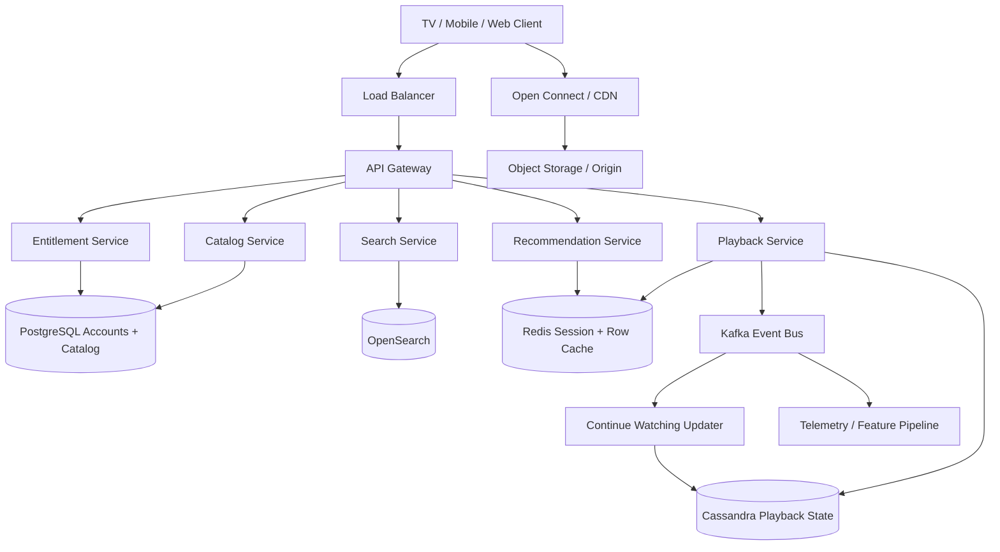
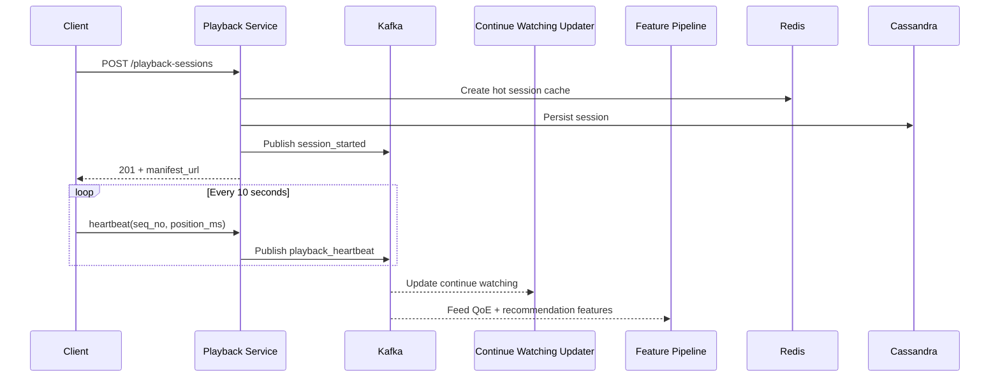
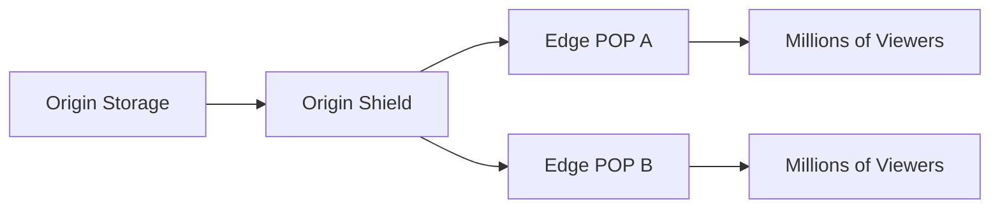
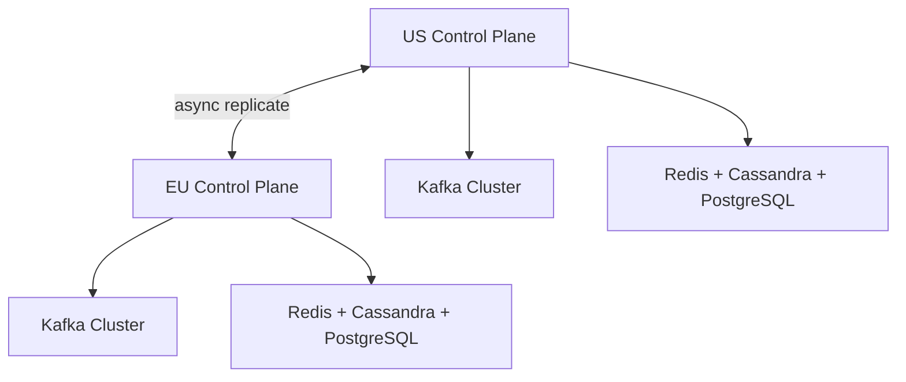

# Design Netflix

Netflix serves **300M+ paid memberships** across **190+ countries** and streams video at internet scale. It is a strong system design interview problem because the surface area is simple, but the system is not: one `Play` button triggers entitlement checks, personalized discovery, adaptive bitrate manifests, global CDN fanout, playback state updates, and a massive telemetry pipeline.

---

## Functional Requirements

**In Scope:**
- Browse a personalized home screen with recommendation rows
- Search and view movie or series details
- Start on-demand playback with adaptive bitrate streaming
- Resume from continue watching across devices
- Support multiple profiles per account
- Support subtitles, alternate audio tracks, and device-specific playback profiles
- Support offline downloads on supported devices
- Enforce stream concurrency limits and regional availability

**Out of Scope:**
- Billing and payment processing
- DRM internals and studio contract workflows
- Live streaming or live sports latency design
- Recommendation model training pipeline internals
- Ad insertion and ad auction systems

---

## Non-Functional Requirements

| Property | Target | Reasoning |
|---|---|---|
| **Playback Startup Latency** | p99 < 2s | Users tolerate a short buffer, but slow startup directly hurts engagement |
| **Rebuffer Rate** | < 0.5% playback time | Smooth playback matters more than theoretical peak quality |
| **Availability** | 99.99% for playback control APIs; graceful CDN failover | Playback must survive regional or POP-level failures |
| **Durability** | No loss of source assets, viewing state, or licenses | Content libraries and user state are long-lived data |
| **Consistency** | Strong for entitlement, stream limits, and download rights; eventual for continue watching and recommendations | A stale home row is acceptable; an invalid stream grant is not |
| **Scale** | 300M+ paid members, 40M peak concurrent streams | Every design choice is shaped by read-heavy global traffic |
| **Reliability** | Playback should degrade gracefully under hot-title spikes | A blockbuster release cannot overload the origin or control plane |

**Key tradeoff:** Netflix optimizes for **playback continuity over perfectly fresh metadata**. A recommendation row that is 30 seconds stale is acceptable. A video stall is not. That tradeoff drives a CDN-first design, pre-encoded renditions, aggressive caching, and asynchronous telemetry pipelines.

---

## Capacity Estimation

**Streams:**
- 250M playback sessions/day
- 40M peak concurrent streams globally
- Average viewing session ~90 minutes

**Bandwidth:**
- Weighted average delivered bitrate ~5 Mbps across mobile, TV, and web
- 40M concurrent streams x 5 Mbps = **~200 Tbps peak CDN egress**
- Control plane traffic is tiny compared to video: manifests and heartbeats are KBs, segments are MBs

**Storage:**
- 100K+ titles in the catalog
- Each title has 10-15 video renditions plus audio, subtitle, and thumbnail tracks
- Encoded library footprint reaches **tens of PB**, while edge caches hold only the hot working set

**Telemetry:**
- One playback heartbeat every 10 seconds at peak concurrency -> **~4M events/sec**

---

## Core Entities

| Entity | Purpose | Important Fields | Relationships |
|---|---|---|---|
| **User** | Billing identity and account owner | `user_id`, `email`, `plan`, `home_region`, `created_at` | Owns many profiles and devices |
| **Profile** | Personal viewing identity inside an account | `profile_id`, `user_id`, `display_name`, `maturity_rating`, `language` | Creates playback sessions and watch state |
| **Title** | Logical movie or episode entity | `title_id`, `name`, `title_type`, `synopsis`, `release_year`, `duration_sec` | Maps to many assets and availability windows |
| **Asset** | Encoded media track or subtitle file | `asset_id`, `title_id`, `kind`, `codec`, `bitrate_kbps`, `language`, `manifest_path` | Belongs to one title; served via CDN |
| **PlaybackSession** | Active or recent playback control record | `session_id`, `profile_id`, `title_id`, `device_id`, `started_at`, `last_position_ms`, `state` | References a title, profile, CDN POP, and manifest |
| **ViewingEvent** | Telemetry emitted during playback | `event_id`, `session_id`, `seq_no`, `event_type`, `position_ms`, `bitrate_kbps`, `occurred_at` | Feeds continue-watching, analytics, and recommendations |
| **MyListEntry** | Saved title for later viewing | `profile_id`, `title_id`, `added_at` | Many-to-many between profiles and titles |
| **DownloadLicense** | Offline playback authorization | `license_id`, `profile_id`, `title_id`, `device_id`, `expires_at`, `renewable` | Allows downloaded encrypted segments to play offline |

**Critical modeling decisions:**
- `Title` and `Asset` are separate because one title expands into many encoded renditions, audio tracks, subtitles, and thumbnails.
- `PlaybackSession` uses a server-issued `session_id` plus monotonic `seq_no` heartbeats so stale progress updates can be ignored safely.
- Personalized rows and continue-watching cards are **derived views**. If cache is lost, they can be rebuilt from durable state and event logs.

---

## Databases and Database Design

### Storage Tier Decisions

| Data | Access Pattern | Engine | Why |
|---|---|---|---|
| Users, profiles, entitlements | transactional, strongly consistent, moderate write volume | **PostgreSQL** | stream-limit checks and download rights need ACID guarantees |
| Title metadata and availability | read-heavy metadata with relational integrity | **PostgreSQL** | titles, seasons, and region windows fit relational modeling well |
| Playback sessions and continue watching | high write volume, time-series updates, user-scoped reads | **Cassandra** | predictable writes, easy horizontal scale, good user-key partitioning |
| Session cache, home-row cache, rate limits | sub-millisecond key-value access, TTL-driven | **Redis** | hot path acceleration and lightweight coordination |
| Search index | full-text title search and faceting | **OpenSearch** | optimized for text retrieval and filtering |
| Event streaming | ordered, durable event fanout | **Kafka** | decouples playback APIs from telemetry, recommendation, and analytics consumers |
| Video, audio, subtitle binaries | write-once, read-many, global distribution | **Object Storage + CDN** | origin durability plus low-latency edge delivery |

The system is intentionally polyglot. Interviews reward separating **source-of-truth transactional state**, **derived playback views**, and **byte delivery**.

### Schema 1 - Users and Profiles (PostgreSQL)

```sql
CREATE TABLE users (
  user_id      BIGSERIAL PRIMARY KEY,
  email        VARCHAR(255) UNIQUE NOT NULL,
  plan         VARCHAR(32)  NOT NULL,
  home_region  CHAR(2)      NOT NULL,
  created_at   TIMESTAMPTZ  DEFAULT NOW()
);

CREATE TABLE profiles (
  profile_id        BIGSERIAL PRIMARY KEY,
  user_id           BIGINT       NOT NULL REFERENCES users(user_id),
  display_name      VARCHAR(64)  NOT NULL,
  maturity_rating   VARCHAR(8)   NOT NULL,
  language          VARCHAR(8)   NOT NULL,
  created_at        TIMESTAMPTZ  DEFAULT NOW()
);

CREATE INDEX idx_profiles_user ON profiles (user_id);
```

### Schema 2 - Titles and Availability (PostgreSQL)

```sql
CREATE TABLE titles (
  title_id          BIGSERIAL PRIMARY KEY,
  title_type        VARCHAR(16)  NOT NULL,   -- movie | episode | season | series
  name              TEXT         NOT NULL,
  synopsis          TEXT,
  release_year      INT,
  duration_sec      INT,
  maturity_rating   VARCHAR(8),
  created_at        TIMESTAMPTZ  DEFAULT NOW()
);

CREATE TABLE title_availability (
  title_id          BIGINT       NOT NULL REFERENCES titles(title_id),
  region_code       CHAR(2)      NOT NULL,
  window_start      TIMESTAMPTZ  NOT NULL,
  window_end        TIMESTAMPTZ,
  PRIMARY KEY (title_id, region_code)
);

CREATE INDEX idx_title_region ON title_availability (region_code, window_start DESC);
```

### Schema 3 - Title Assets (PostgreSQL)

```sql
CREATE TABLE title_assets (
  asset_id          UUID PRIMARY KEY DEFAULT gen_random_uuid(),
  title_id          BIGINT       NOT NULL REFERENCES titles(title_id),
  kind              VARCHAR(16)  NOT NULL,   -- video | audio | subtitle | trickplay
  codec             VARCHAR(32)  NOT NULL,
  bitrate_kbps      INT          NOT NULL,
  language          VARCHAR(8),
  manifest_path     TEXT         NOT NULL,
  checksum          CHAR(64)     NOT NULL,
  created_at        TIMESTAMPTZ  DEFAULT NOW()
);

CREATE INDEX idx_title_assets_lookup
  ON title_assets (title_id, kind, codec, bitrate_kbps);
```

### Schema 4 - Playback Sessions (Cassandra)

```sql
CREATE TABLE playback_sessions (
  session_id         UUID PRIMARY KEY,
  user_id            BIGINT,
  profile_id         BIGINT,
  title_id           BIGINT,
  device_id          UUID,
  cdn_pop            TEXT,
  manifest_id        UUID,
  started_at         TIMESTAMP,
  last_seq_no        BIGINT,
  last_position_ms   BIGINT,
  state              TEXT
) WITH default_time_to_live = 86400;
```

This table is optimized for active-session lookups. Sessions are hot for hours, not forever, so a TTL keeps storage bounded.

### Schema 5 - Continue Watching by Profile (Cassandra)

```sql
CREATE TABLE continue_watching_by_profile (
  profile_id         BIGINT,
  updated_at         TIMESTAMP,
  title_id           BIGINT,
  position_ms        BIGINT,
  completion_pct     DECIMAL,
  artwork_url        TEXT,
  PRIMARY KEY (profile_id, updated_at, title_id)
) WITH CLUSTERING ORDER BY (updated_at DESC, title_id ASC);
```

The partition key `profile_id` makes the primary read path trivial: fetch the most recent 20 unfinished titles for one profile.

### Schema 6 - Download Licenses (PostgreSQL)

```sql
CREATE TABLE download_licenses (
  license_id         UUID PRIMARY KEY DEFAULT gen_random_uuid(),
  profile_id         BIGINT       NOT NULL REFERENCES profiles(profile_id),
  title_id           BIGINT       NOT NULL REFERENCES titles(title_id),
  device_id          UUID         NOT NULL,
  drm_key_id         UUID         NOT NULL,
  expires_at         TIMESTAMPTZ  NOT NULL,
  renewable          BOOLEAN      NOT NULL DEFAULT TRUE,
  created_at         TIMESTAMPTZ  DEFAULT NOW(),
  UNIQUE (profile_id, title_id, device_id)
);
```

### Sharding and Replication Strategy

| Store | Shard Key | Strategy | Replication |
|---|---|---|---|
| Users / Profiles (PostgreSQL) | `user_id` | hash-based logical sharding after a single-primary phase | primary + 2 read replicas; async cross-region replication |
| Catalog Metadata (PostgreSQL) | `title_id` | mostly read-replica scale; low write volume | primary + multiple read replicas |
| Playback Sessions (Cassandra) | `session_id` | consistent hashing across nodes | RF=3, `LOCAL_QUORUM` writes |
| Continue Watching (Cassandra) | `profile_id` | consistent hashing | RF=3, `LOCAL_ONE` reads |
| Redis | `profile_id` hash slot | Redis Cluster | 1 replica per master |
| Search Index | `title_id` | inverted-index shards | 1 primary + 1 replica |

**Consistency model:**
- **Strong consistency:** entitlement checks, stream concurrency, download rights, parental controls
- **Eventual consistency:** continue watching, recommendation rows, popularity counters, search freshness

**Read/write patterns:**
- **Write path:** playback start or heartbeat -> source store -> Kafka -> continue-watching updater, recommendations, analytics
- **Read path:** control plane APIs hit Redis first, then PostgreSQL/Cassandra on cache miss
- **Byte path:** signed manifests and segments are served from CDN; app services stay off the heavy media path

---

## API Design

**Get home page rows:**
```http
GET /v1/home?profile_id=9182&cursor=eyJyb3ciOjEwfQ==&limit=10
Authorization: Bearer <jwt>

200 OK
{
  "rows": [
    {
      "row_id": "because-you-watched",
      "title": "Because You Watched Dark",
      "items": [
        { "title_id": 101, "name": "1899", "artwork_url": "https://..." },
        { "title_id": 102, "name": "Bodies", "artwork_url": "https://..." }
      ]
    }
  ],
  "next_cursor": "eyJyb3ciOjIwfQ==",
  "has_more": true
}
```

> Cursor-based pagination on row position. Offset pagination (`?page=N`) becomes unstable once rows are personalized and frequently refreshed.

**Search titles:**
```http
GET /v1/search?q=stranger&profile_id=9182&cursor=eyJmcm9tIjoyMH0=&limit=20
Authorization: Bearer <jwt>

200 OK
{
  "results": [
    { "title_id": 700, "name": "Stranger Things", "title_type": "series", "year": 2016 }
  ],
  "next_cursor": "eyJmcm9tIjo0MH0=",
  "has_more": true
}
```

**Get title details:**
```http
GET /v1/titles/700?profile_id=9182
Authorization: Bearer <jwt>

200 OK
{
  "title_id": 700,
  "name": "Stranger Things",
  "synopsis": "A small town confronts supernatural events.",
  "duration_sec": 3120,
  "available_audio": ["en", "es", "fr"],
  "available_subtitles": ["en", "es", "de"],
  "can_download": true
}
```

**Start playback session:**
```http
POST /v1/playback-sessions
Authorization: Bearer <jwt>
Idempotency-Key: play-700-tv-001

{
  "profile_id": 9182,
  "title_id": 700,
  "device_id": "0d4f8b3f-1b56-4c9a-8c6c-7dbf61752111",
  "capabilities": {
    "max_resolution": "4k",
    "codecs": ["h264", "hevc"],
    "drm": "widevine"
  }
}

201 Created
{
  "session_id": "7c2a0f3e-930d-45b4-9067-6d19b7f03df5",
  "manifest_url": "https://cdn.netflix.example/manifests/7c2a0f3e.m3u8?sig=...",
  "license_token": "eyJhbGciOi...",
  "heartbeat_interval_sec": 10
}
```

**Send playback heartbeat:**
```http
POST /v1/playback-sessions/7c2a0f3e-930d-45b4-9067-6d19b7f03df5/heartbeat
Authorization: Bearer <jwt>

{
  "seq_no": 18,
  "position_ms": 540000,
  "bitrate_kbps": 4500,
  "buffer_ms": 18000,
  "event_type": "playing"
}

204 No Content
```

**Request download license:**
```http
POST /v1/downloads/licenses
Authorization: Bearer <jwt>

{
  "profile_id": 9182,
  "title_id": 700,
  "device_id": "0d4f8b3f-1b56-4c9a-8c6c-7dbf61752111"
}

201 Created
{
  "license_id": "12d8f08a-52b9-4924-9cf7-1dff19dd6209",
  "expires_at": "2026-06-10T10:00:00Z",
  "download_manifest_url": "https://cdn.netflix.example/offline/700.mpd?sig=..."
}
```

**Segment delivery path (CDN):**
```http
GET https://cdn.netflix.example/manifests/7c2a0f3e.m3u8?sig=...
GET https://cdn.netflix.example/video/asset-123/seg-000481.m4s?sig=...
```
After session setup, heavy video traffic bypasses the control plane. App services authorize playback and sign URLs; the CDN serves the bytes.

---

## High-Level Design



**Component responsibilities:**

| Component | Role |
|---|---|
| **API Gateway** | JWT validation, routing, rate limiting, device policy enforcement |
| **Catalog Service** | Serves title metadata, availability windows, audio/subtitle options |
| **Recommendation Service** | Returns personalized rows, top picks, and continue-watching cards |
| **Playback Service** | Creates playback sessions, signs manifests, chooses profiles, records heartbeats |
| **Entitlement Service** | Checks subscription plan, concurrent stream limits, download rights, parental controls |
| **Search Service** | Full-text title search and autocomplete |
| **Kafka** | Durable event log for playback telemetry and downstream consumers |
| **Redis** | Hot metadata cache, session cache, row cache, and token-bucket state |
| **CDN** | Serves manifests and segments from edge POPs; shields the origin from hot-title spikes |

**Playback start flow:**
1. Client → `POST /v1/playback-sessions` → API Gateway → Playback Service
2. Playback Service checks entitlement, device rules, and concurrency limits against Entitlement Service / PostgreSQL
3. Playback Service fetches title metadata, chooses the best manifest profile, signs a CDN URL, and writes session state to Redis and Cassandra
4. Client fetches the manifest and video segments from the nearest CDN POP
5. Client sends periodic heartbeats; Kafka fans them out to continue-watching, recommendation, and analytics consumers asynchronously

---

## Deep Dives

### 1. Kafka: Required, But Not on the Byte Path

For Netflix, Kafka is required - but not for serving video segments. The bytes should flow from CDN to client with as little control-plane coupling as possible. Kafka is required because playback creates massive side effects: continue-watching updates, recommendation features, QoE analytics, and audit logs. If the Playback Service synchronously called every downstream system on each heartbeat, the critical path would become fragile immediately.



**Why it becomes difficult at scale:**
- 40M concurrent streams can generate millions of heartbeat events per second
- not all consumers need the same durability or freshness
- retries can easily duplicate events unless keys and sequencing are explicit

**Production-grade approach:**
- partition `playback_heartbeat` by `session_id` so per-session ordering is preserved
- separate high-value events (`session_started`, `session_ended`, `download_granted`) from high-volume heartbeats
- use independent consumer groups for continue watching, QoE analytics, recommendations, and fraud detection
- apply backpressure policies that degrade non-critical consumers before touching playback APIs

**Tradeoff:** Kafka adds operational cost and eventual consistency. That is acceptable because playback continuity matters more than immediate downstream convergence.

### 2. Redis: Startup Latency, Personalization, and Cache Discipline

Redis is doing three jobs in this system.

| Redis Use | Example Key | Why Redis Fits |
|---|---|---|
| **Session cache** | `session:{session_id}` | active playback sessions need sub-millisecond reads |
| **Home row cache** | `home:{profile_id}:v42` | recommendation rows are read often and rebuilt asynchronously |
| **Rate limiting** | `rl:user:{user_id}:play` | token buckets and concurrency guards are simple and fast |

**Why the problem happens:** every `Play` click wants a fast answer, and most users repeatedly fetch the same small metadata working set.

**Why it becomes difficult at scale:**
- a hot new release causes the same titles and manifests to be requested across many regions simultaneously
- recommendation rows churn often, so naive invalidation can cause cache stampedes
- active session state is write-heavy during peak viewing hours

**Production-grade solutions:**
- use short TTLs plus versioned keys for home rows, e.g. `home:{profile_id}:v42`
- apply stale-while-revalidate for recommendation rows because slightly stale personalization is acceptable
- keep active session state in Redis for hot reads, then checkpoint durable progress to Cassandra asynchronously
- use single-flight request coalescing on cache miss to avoid thundering herds on hot metadata

**Tradeoff:** Redis is fast but memory-expensive and operationally sensitive. It should accelerate the hot path, not become the only copy of important user state.

### 3. Fanout at the Edge: CDN and Hot Titles

For Netflix, the hardest fanout problem is **byte fanout**. A new season release can trigger millions of concurrent segment requests across regions within minutes. Without an aggressive CDN strategy, every hot title becomes an origin outage waiting to happen.



**Why it becomes difficult at scale:**
- video is large, so a cache miss is expensive
- popular episodes create synchronized demand bursts
- each title expands into many segments, bitrates, audio tracks, and subtitle files

**Production-grade solutions:**
- pre-position hot assets on edge caches before major releases
- cache at segment granularity so ABR clients can switch quality without forcing full misses
- use origin shield layers so a miss storm hits an intermediate cache, not the source of truth directly
- sign manifest and segment URLs so edge delivery stays off the application servers
- support POP failover and, if needed, multi-CDN fallback during regional incidents

**Tradeoff:** prewarming too much wastes expensive edge storage; prewarming too little overloads origin during blockbuster launches. The right answer is popularity-aware placement, not caching everything everywhere.

### 4. Playback State Ordering, Hot Partitions, and Continue Watching

Playback state looks simple until networks become unreliable. Heartbeats can be delayed, duplicated, or reordered. If progress updates are applied blindly, older events can overwrite newer state and the continue-watching row becomes wrong.

**Why it becomes difficult at scale:**
- heartbeats arrive out of order under retries and reconnections
- a popular title can produce massive aggregate event volume
- per-title counters become hot if all writes target one key

**Production-grade solutions:**
- attach a monotonic `seq_no` to every heartbeat and reject events with `seq_no <= last_seq_no`
- partition durable progress by `profile_id` or `session_id`, not `title_id`, because progress is user-scoped
- coalesce heartbeats before writing to Cassandra so one session does not produce unbounded write amplification
- shard popularity counters for hot titles, then aggregate them asynchronously rather than incrementing one global counter key

**Tradeoff:** progress on a second device may be a few seconds stale, but that is much cheaper than globally serializing every heartbeat write.

### 5. WebSockets and Offline Delivery: Usually Not Required

WebSockets are not required for Netflix's core on-demand playback path. HLS and DASH over plain HTTP work better with CDNs, proxies, mobile networks, and adaptive bitrate clients. Periodic HTTPS heartbeats are simpler than holding long-lived bidirectional connections for every stream.

That does not mean WebSockets are useless. They may appear in watch parties, operator dashboards, or live-event overlays. The interview point is architectural discipline: keep them **out of the core video path** unless the product truly needs push semantics.

Offline delivery is the more relevant problem for Netflix:
- the client downloads encrypted segments and a per-device license
- licenses expire and may need renewal before playback starts
- device quotas and regional rights must still be enforced even if the user goes offline later

**Why it becomes difficult at scale:**
- downloads create bursty background traffic and large device-local storage pressure
- license renewal must work reliably when a device comes back online
- title rights can change after bytes are already on the device

**Production-grade solutions:**
- issue renewable download licenses with explicit expiry and device binding
- separate downloaded bytes from the license record so rights can expire without deleting files immediately
- enforce per-account device caps and per-profile offline limits in the entitlement layer

**Tradeoff:** offline playback improves UX materially, but it introduces license lifecycle complexity that does not exist for pure streaming.

### 6. Multi-Region Deployment, Replication Lag, Queue Backpressure, and Rate Limiting

Netflix must run globally. The correct mental model is **active-active reads with region-local control planes**, while the CDN handles most of the bandwidth close to the user.



**Why it becomes difficult at scale:**
- cross-region round trips are too slow for the playback startup path
- user progress and home rows change frequently, so full global synchronization is expensive
- downstream consumers can lag during prime-time spikes or major releases

**Production-grade solutions:**
- create playback sessions in the nearest healthy region, then replicate asynchronously to backup regions
- accept short-lived replication lag for continue watching and recommendation freshness
- prioritize critical control-plane events over best-effort telemetry when Kafka consumer lag grows
- use rate limits for `Play` requests, download grants, search abuse, and concurrent stream policy enforcement
- keep account-level stream concurrency strongly consistent enough to prevent obvious overuse, but avoid globally coordinating on every heartbeat

**Tradeoff:** global exactness on every user action is too expensive. Regional autonomy plus eventual convergence is the practical answer.

