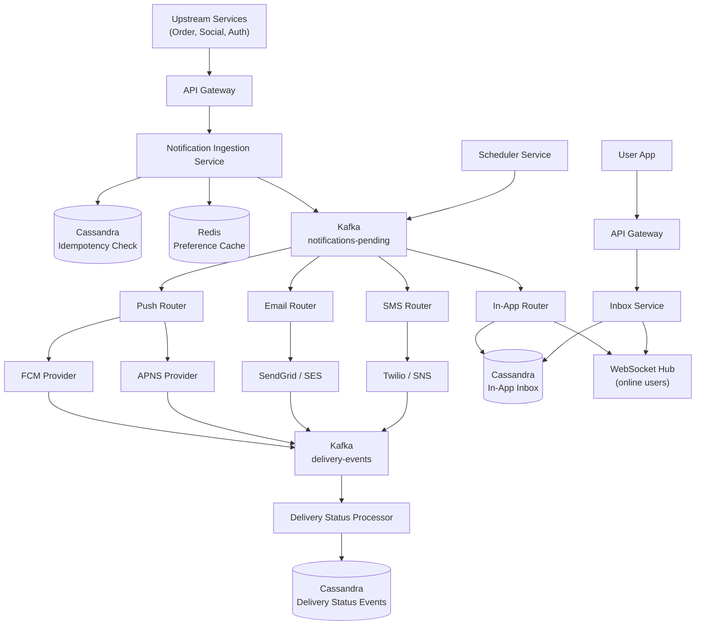
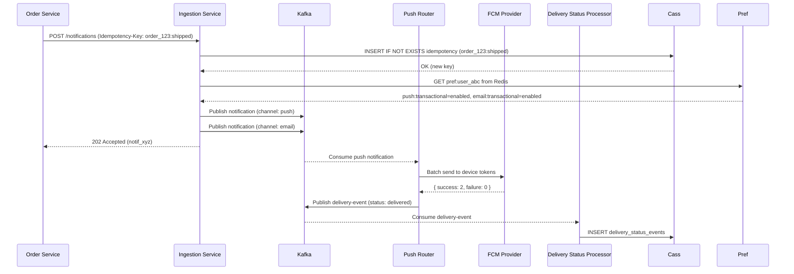
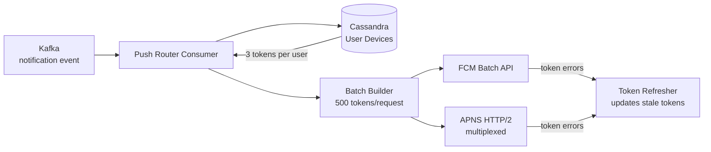
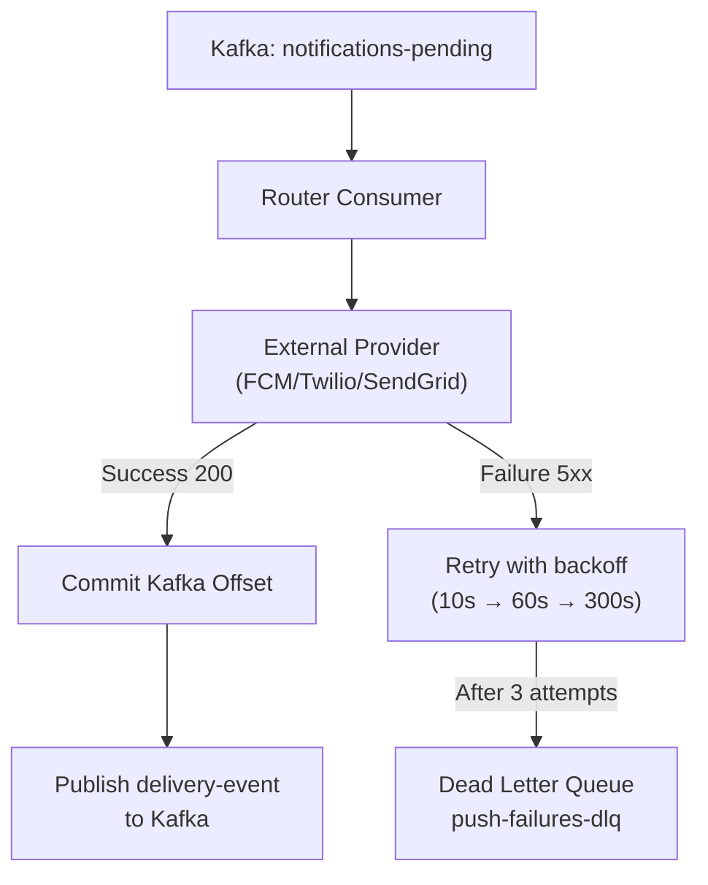
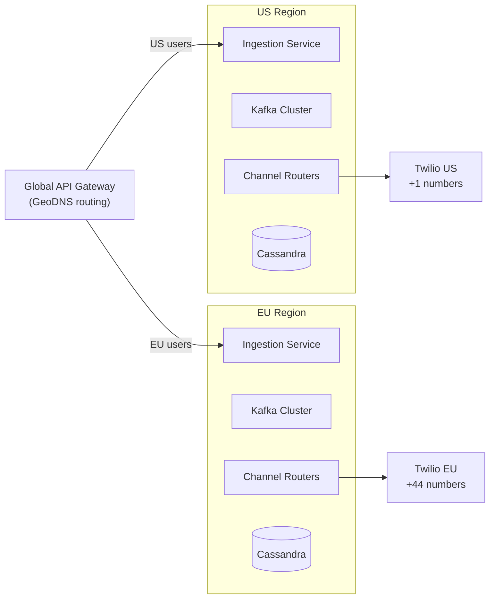

# Design a Notification Service

A notification service is foundational infrastructure — the system that Amazon uses to tell you your package shipped, Uber uses to say your driver arrived, and Instagram uses to say someone liked your post. It is not a glamorous product, but it is **the hardest infra problem to get right at scale**: low latency, high throughput, multi-channel delivery, guaranteed delivery with deduplication, and graceful degradation when third-party providers go down.

This problem tests event-driven architecture, idempotency, fan-out, rate limiting, and the subtle distinction between **at-least-once delivery** (what you want) and **exactly-once delivery** (what you wish you could have).

---

## Functional Requirements

**In Scope:**
- Send notifications across four channels: **Push** (iOS/Android), **SMS**, **Email**, and **In-App**
- Notifications are triggered by upstream services (Order Service, Social Service, etc.) via API or event
- Support **templated** notifications with dynamic variable substitution
- Support **scheduled** notifications (send at a specific future time)
- Support **user notification preferences** — users can opt out of specific channels or categories
- Delivery tracking: know whether a notification was sent, delivered, and read (in-app)
- Rate limiting: prevent notification spam to any user
- Support **batched** notifications (e.g., "You have 5 new likes" instead of 5 separate pushes)

**Out of Scope:**
- Building the push provider (FCM, APNS) — we integrate with them
- Building the SMS gateway — we use Twilio, SNS, etc.
- Building the email SMTP server — we use SendGrid, SES
- ML-based optimal send-time prediction
- A/B testing framework for notification content
- Two-way communication (SMS replies, email replies)

---

## Non-Functional Requirements

| Property | Target | Reasoning |
|---|---|---|
| **Delivery Latency** | p99 < 5s for push; < 30s for SMS/email | Push is real-time UX; SMS/email have looser SLAs |
| **Throughput** | 1M notifications/min at peak | Major e-commerce sale events, social viral moments |
| **Availability** | 99.99% for send API | Producers (Order Service) should never fail due to notification outage |
| **Delivery Guarantee** | At-least-once | Duplicate push is acceptable; missed delivery is not |
| **Deduplication** | Idempotent at consumer level | Prevent user from seeing same notification twice |
| **Durability** | Zero notification loss before delivery | Persisted before any external call is made |
| **Preference Enforcement** | 100% — never bypass user opt-out | Legal requirement (GDPR, CAN-SPAM, TCPA) |
| **Observability** | Per-notification delivery status | Producers need to know if a notification was delivered |

**The defining tradeoff:** Exactly-once delivery to end users is impossible — third-party providers (FCM, Twilio) give you **at-least-once semantics** from their side, and your own retry logic adds another at-least-once layer on top. The only safe contract you can offer is: **every notification will be attempted at least once, with best-effort deduplication**. Design around this reality.

---

## Capacity Estimation

**Send volume:**
- 1M notifications/minute at peak → **~16,700/sec**
- Channel split: Push 60%, Email 25%, SMS 10%, In-App 5%
- Push: ~10,000/sec; Email: ~4,200/sec; SMS: ~1,700/sec

**Storage:**
- Notification record: ~500 bytes (metadata + template variables)
- 1M/min × 60 min × 24 hr × 365 days = ~526B records/year at peak (unrealistic sustained)
- Realistic: 100M notifications/day → 50 GB/day raw; keep 90 days → **~4.5 TB** active storage
- In-App notification inbox: 1B users × 50 unread notifications × 200 bytes = **~10 TB**

**Delivery tracking events:**
- Each notification generates 2–4 status events (queued → sent → delivered → read)
- 100M notifications/day × 3 avg events = 300M events/day → **~3,500 events/sec** into the tracking pipeline

**Third-party rate limits (production reality):**
- FCM: no hard rate limit per project; practical throughput ~100K/sec with batching
- Twilio SMS: 1–3 messages/sec per phone number; 100+ numbers needed for high throughput
- SendGrid Email: 100K emails/min on Enterprise tier

---

## Core Entities

| Entity | Purpose | Key Fields |
|---|---|---|
| **Notification** | A single notification to be delivered | `notification_id`, `user_id`, `channel`, `template_id`, `variables{}`, `status`, `scheduled_at`, `created_at`, `idempotency_key` |
| **Template** | Reusable content definition per notification type | `template_id`, `name`, `channel`, `subject`, `body_template`, `variables[]`, `created_at` |
| **UserPreference** | Per-user channel and category opt-in/out | `user_id`, `channel`, `category`, `enabled`, `updated_at` |
| **UserDevice** | Push token per device | `device_id`, `user_id`, `platform` (ios/android), `push_token`, `registered_at`, `last_active` |
| **DeliveryStatus** | Audit log of each status transition | `event_id`, `notification_id`, `status`, `channel`, `provider`, `provider_response`, `timestamp` |
| **BatchGroup** | Aggregated notifications collapsed into one | `batch_id`, `user_id`, `category`, `count`, `first_created_at`, `flush_at` |

**Critical modeling decisions:**
- `idempotency_key` on Notification is supplied by the caller (e.g., `order_id:shipped`). The same key arriving twice produces only one notification — deduplication at ingestion.
- `UserDevice` has one row per device per user. A user with iPhone + Android + iPad has 3 rows. Push is sent to all active devices unless the caller specifies `device_id`.
- `DeliveryStatus` is an **append-only audit table** — never updated, only inserted. Status is derived by reading the latest event per `notification_id`. This makes the system fully auditable and replay-safe.

---

## Databases and Database Design

### Storage Tier Decisions

| Data | Access Pattern | Engine | Why |
|---|---|---|---|
| Notification records | High write throughput, status lookup by ID | **Cassandra** | Partition by `notification_id`; linear write scale; TTL-based expiry |
| In-App inbox (per user) | Per-user sorted read, mark-as-read updates | **Cassandra** | Partition by `user_id`; clustering on `created_at DESC` |
| Templates | Read-heavy, rarely updated, small dataset | **PostgreSQL** | Simple; fits in Redis cache; benefit of ACID on template updates |
| User preferences | Point reads on every notification send | **PostgreSQL + Redis** | PostgreSQL for durability; Redis cache for sub-ms reads |
| User devices (push tokens) | Per-user scan, token updates on app launch | **Cassandra** | Partition by `user_id`; high write on token refresh |
| Delivery status events | Append-only, time-series, observability | **Cassandra** | Time-series partitioning; never updated |
| Scheduled notifications | Range scans on `scheduled_at` | **PostgreSQL** | B-tree index on `scheduled_at`; low volume, simple query |
| Batch group state | Temporary, ephemeral aggregation | **Redis** | HINCRBY for atomic count; TTL-based flush trigger |

### Schema 1 — Notifications (Cassandra)

```sql
CREATE TABLE notifications (
  notification_id  UUID,
  user_id          UUID,
  channel          TEXT,      -- 'push' | 'sms' | 'email' | 'in_app'
  template_id      UUID,
  variables        MAP<TEXT, TEXT>,
  status           TEXT,      -- 'pending' | 'sent' | 'delivered' | 'failed' | 'suppressed'
  idempotency_key  TEXT,
  scheduled_at     TIMESTAMP,
  created_at       TIMESTAMP,
  PRIMARY KEY (notification_id)
);

-- Idempotency index (separate table for deduplication lookup)
CREATE TABLE notification_idempotency (
  idempotency_key    TEXT PRIMARY KEY,
  notification_id    UUID,
  created_at         TIMESTAMP
) WITH default_time_to_live = 604800;  -- 7-day TTL; key expires after window
```

Idempotency is enforced by a `INSERT IF NOT EXISTS` (Cassandra lightweight transaction) on `notification_idempotency`. If the key exists, return the existing `notification_id` without creating a duplicate.

### Schema 2 — In-App Inbox (Cassandra)

```sql
CREATE TABLE in_app_inbox (
  user_id         UUID,
  created_at      TIMESTAMP,
  notification_id UUID,
  title           TEXT,
  body            TEXT,
  deep_link_url   TEXT,
  read            BOOLEAN DEFAULT FALSE,
  PRIMARY KEY (user_id, created_at)
) WITH CLUSTERING ORDER BY (created_at DESC)
  AND default_time_to_live = 7776000;  -- 90-day TTL; old inbox items expire
```

The 90-day TTL handles data retention automatically — no cleanup job required. `ZREVRANGE`-style reads are replaced by Cassandra's native clustering order.

### Schema 3 — User Preferences (PostgreSQL)

```sql
CREATE TABLE user_preferences (
  user_id    UUID        NOT NULL,
  channel    VARCHAR(20) NOT NULL,   -- 'push' | 'sms' | 'email' | 'in_app'
  category   VARCHAR(50) NOT NULL,   -- 'marketing' | 'transactional' | 'social' | 'security'
  enabled    BOOLEAN     NOT NULL DEFAULT TRUE,
  updated_at TIMESTAMPTZ DEFAULT NOW(),
  PRIMARY KEY (user_id, channel, category)
);

-- Fast cache key: pref:{user_id} → JSON of all channel+category combos
```

Preferences are a small dataset per user (~20 rows). They are cached in Redis as a JSON blob: `GET pref:{user_id}` → deserialize → check. Cache is invalidated on any preference update (write-through delete). Cold miss reads from PostgreSQL.

### Schema 4 — User Devices (Cassandra)

```sql
CREATE TABLE user_devices (
  user_id        UUID,
  device_id      UUID,
  platform       TEXT,      -- 'ios' | 'android' | 'web'
  push_token     TEXT,
  app_version    TEXT,
  registered_at  TIMESTAMP,
  last_active    TIMESTAMP,
  PRIMARY KEY (user_id, device_id)
);
```

On every app launch, the client calls `PUT /v1/me/devices/{device_id}` with the current push token. Tokens rotate frequently (FCM rotates them proactively; APNS rotates on reinstall). Stale tokens cause silent push failures; keeping `last_active` lets you prune devices inactive > 90 days.

### Schema 5 — Delivery Status Events (Cassandra)

```sql
CREATE TABLE delivery_status_events (
  notification_id  UUID,
  timestamp        TIMESTAMP,
  event_id         UUID,
  status           TEXT,    -- 'queued' | 'dispatched' | 'sent' | 'delivered' | 'read' | 'failed'
  channel          TEXT,
  provider         TEXT,    -- 'fcm' | 'apns' | 'twilio' | 'sendgrid'
  provider_msg_id  TEXT,
  error_code       TEXT,
  PRIMARY KEY (notification_id, timestamp)
) WITH CLUSTERING ORDER BY (timestamp ASC)
  AND default_time_to_live = 7776000;   -- 90-day retention
```

### Schema 6 — Scheduled Notifications (PostgreSQL)

```sql
CREATE TABLE scheduled_notifications (
  notification_id  UUID         PRIMARY KEY DEFAULT gen_random_uuid(),
  user_id          UUID         NOT NULL,
  template_id      UUID         NOT NULL,
  variables        JSONB,
  channel          VARCHAR(20)  NOT NULL,
  scheduled_at     TIMESTAMPTZ  NOT NULL,
  status           VARCHAR(20)  DEFAULT 'pending',
  idempotency_key  TEXT         UNIQUE,
  created_at       TIMESTAMPTZ  DEFAULT NOW()
);

CREATE INDEX idx_scheduled_at_pending
  ON scheduled_notifications (scheduled_at)
  WHERE status = 'pending';
```

Partial index on `(scheduled_at) WHERE status = 'pending'` — the Scheduler polls only pending rows and the index stays small even with millions of historical scheduled notifications.

### Sharding and Replication

| Store | Shard Key | Replication |
|---|---|---|
| Cassandra (notifications, inbox, devices, events) | Partition key per table (see above); Murmur3 consistent hashing | RF=3; LOCAL_QUORUM writes; 2 DCs |
| PostgreSQL (templates, preferences, scheduled) | Not sharded initially; shard by `user_id` range if > 100M rows | Primary + 2 read replicas; async streaming replication |
| Redis (preference cache, batch groups, idempotency hot path) | Redis Cluster; hash slots by key prefix | 1 replica per primary shard |

---

## API Design

**Send a notification (producer-facing):**
```http
POST /v1/notifications
Authorization: Bearer <service_token>
Idempotency-Key: order_123:shipped   ← caller-supplied; prevents duplicates on retry

{
  "user_id": "user_abc",
  "template_id": "tmpl_order_shipped",
  "channels": ["push", "email"],
  "variables": {
    "order_id": "ORD-9876",
    "item_name": "Nike Air Max",
    "delivery_date": "June 2"
  },
  "scheduled_at": null   ← null means send immediately
}

202 Accepted
{
  "notification_id": "notif_xyz",
  "status": "queued",
  "channels": ["push", "email"],
  "idempotency_key": "order_123:shipped"
}
```

**Check delivery status:**
```http
GET /v1/notifications/{notification_id}/status
Authorization: Bearer <service_token>

200 OK
{
  "notification_id": "notif_xyz",
  "status": "delivered",
  "channels": {
    "push": { "status": "delivered", "delivered_at": "2026-05-29T10:00:05Z", "device_count": 2 },
    "email": { "status": "sent", "sent_at": "2026-05-29T10:00:08Z", "provider_msg_id": "sg_msg_abc" }
  },
  "events": [
    { "status": "queued", "timestamp": "2026-05-29T10:00:00Z" },
    { "status": "dispatched", "timestamp": "2026-05-29T10:00:01Z" },
    { "status": "delivered", "timestamp": "2026-05-29T10:00:05Z" }
  ]
}
```

**Get in-app inbox (user-facing, cursor-paginated):**
```http
GET /v1/me/notifications?limit=20&cursor=eyJ0...
Authorization: Bearer <user_token>

200 OK
{
  "notifications": [
    {
      "notification_id": "notif_xyz",
      "title": "Your order has shipped!",
      "body": "Nike Air Max will arrive by June 2",
      "deep_link_url": "app://orders/ORD-9876",
      "read": false,
      "created_at": "2026-05-29T10:00:00Z"
    }
  ],
  "unread_count": 7,
  "next_cursor": "eyJ0c3..."
}
```

**Mark notifications as read (batch idempotent):**
```http
PUT /v1/me/notifications/read
Authorization: Bearer <user_token>

{ "notification_ids": ["notif_xyz", "notif_abc"] }

204 No Content
// Cassandra UPDATE; re-sending same IDs is a no-op (last-write-wins)
```

**Update user preferences:**
```http
PUT /v1/me/preferences
Authorization: Bearer <user_token>

{
  "preferences": [
    { "channel": "email", "category": "marketing", "enabled": false },
    { "channel": "push",  "category": "social",    "enabled": true  }
  ]
}

204 No Content
// PostgreSQL upsert; Redis pref:{user_id} DEL for cache invalidation
```

**Register / refresh device token:**
```http
PUT /v1/me/devices/{device_id}
Authorization: Bearer <user_token>

{ "platform": "ios", "push_token": "apns_token_abc123", "app_version": "4.2.1" }

200 OK
{ "device_id": "device_abc", "registered_at": "2026-05-29T10:00:00Z" }
```

---

## High-Level Design



**Component responsibilities:**

| Component | Role |
|---|---|
| **Notification Ingestion Service** | Validates request, enforces idempotency, checks user preferences, enriches template, publishes to Kafka |
| **Push Router** | Kafka consumer; batches push tokens per provider; calls FCM/APNS; handles token refresh and failures |
| **Email Router** | Kafka consumer; renders HTML from template; calls SendGrid/SES; handles bounce and unsubscribe webhooks |
| **SMS Router** | Kafka consumer; formats message; selects phone number pool; calls Twilio; handles delivery receipts |
| **In-App Router** | Kafka consumer; writes to Cassandra inbox; pushes real-time via WebSocket for online users |
| **Scheduler Service** | Polls PostgreSQL for due scheduled notifications; publishes them to Kafka at send time |
| **Delivery Status Processor** | Kafka consumer; appends status events to Cassandra; updates `notifications.status` |
| **Inbox Service** | User-facing API for in-app inbox reads, mark-as-read, unread count |
| **WebSocket Hub** | Maintains persistent connections; pushes in-app notifications to online users |

---

## Deep Dives

### 1. Kafka: Required and Central

Kafka is the backbone of this system. Without it, the Notification Ingestion Service would synchronously call Push Router, Email Router, SMS Router, and In-App Router — coupling their latencies and failure modes together. A Twilio outage would block the entire send path.

**Topic design:**

| Topic | Partition Key | Consumers | Retention |
|---|---|---|---|
| `notifications-pending` | `user_id` | Push Router, Email Router, SMS Router, In-App Router | 7 days |
| `delivery-events` | `notification_id` | Delivery Status Processor, Analytics | 30 days |
| `push-failures` | `user_id` | Retry Handler, Dead Letter Queue | 14 days |
| `notification-scheduled` | `scheduled_at` bucket | Scheduler (internal trigger) | 24 hours |

**Why partition by `user_id`:**

Partitioning `notifications-pending` by `user_id` means all notifications for the same user land on the same partition — processed by the same router instance. This enables **per-user ordered processing** (important for batching: all N likes for user arrive at the same consumer before flush) without distributed coordination.



**Backpressure and lag:** If FCM is slow during a flash sale, Push Router consumers fall behind. Kafka buffers without loss. Alert at 30-second consumer group lag. Router instances auto-scale horizontally by adding consumers (up to partition count). Never add more consumers than partitions — extra consumers are idle.

**Dead-letter queue:** After 3 retry attempts, failed notifications are routed to `push-failures-dlq`. An on-call engineer can inspect and replay them after the provider recovers. Retry with exponential backoff: 10s → 60s → 300s.

---

### 2. Redis: Caching Strategies and Rate Limiting

Redis plays three distinct roles: preference caching, deduplication hot path, and rate limiting.

**a) User Preference Cache — Read-Through, Write-Invalidate**

Preferences are checked on **every single notification send** — before anything else. At 16,700 sends/sec this is 16,700 PostgreSQL reads/sec without caching: immediately fatal.

```
GET pref:{user_id}                     -- cache hit: ~0.2ms
→ miss: SELECT * FROM user_preferences WHERE user_id = ? → serialize → SET pref:{user_id} EX 3600
```

Cache key: `pref:{user_id}` → JSON map of `{channel:category → enabled}`.

**Invalidation:** When a user updates preferences, the API does:
1. PostgreSQL UPSERT (durable)
2. `DEL pref:{user_id}` (cache invalidation)

Next send reads from PostgreSQL and repopulates. Write-through (set new value immediately) risks a race condition if two updates arrive in parallel — write-invalidate is safer.

**TTL:** 1-hour TTL as a safety net. Even without explicit invalidation, stale preferences expire within an hour — acceptable for opt-out enforcement (a user who just opted out may get one more notification; the 7-day Cassandra idempotency TTL prevents indefinite spam).

**b) Deduplication Hot Path — Lua Atomic Check-and-Set**

Cassandra `INSERT IF NOT EXISTS` uses a Paxos-based lightweight transaction — ~10ms latency. At 16,700/sec this is a 167 Cassandra LWT ops/sec, which is fine, but for ultra-low ingestion latency, a Redis check before Cassandra eliminates most duplicates in <1ms:

```lua
-- Atomic check-and-set in Redis (EVAL = single round trip)
EVAL "
  if redis.call('EXISTS', KEYS[1]) == 1 then
    return redis.call('GET', KEYS[1])
  end
  redis.call('SET', KEYS[1], ARGV[1], 'EX', ARGV[2])
  return nil
" 1 idem:{idempotency_key} {notification_id} 604800
```

If returns `nil` → new key, proceed to Cassandra. If returns `notification_id` → duplicate, return existing ID immediately. Redis handles the common case (retry storms); Cassandra is the durable fallback for correctness.

**c) Batch Group Counter — Atomic Aggregation**

For social notifications ("5 people liked your post"), instead of sending 5 separate pushes, batch them:

```
HINCRBY batch:{user_id}:likes  count  1
HSET     batch:{user_id}:likes  first_at {timestamp}
EXPIRE   batch:{user_id}:likes  30        ← 30-second flush window
```

When TTL fires, the Batch Flush Worker reads the hash and sends one aggregated push: "5 people liked your post." This requires a separate **keyspace notification subscriber** to detect TTL expiry events and trigger the flush — not a cron job (which would require scanning all keys).

**d) Rate Limiting — Sliding Window per User**

Prevent notification spam — no more than N notifications of type T per user per time window:

```
-- Sliding window rate limit using sorted set
ZADD   rl:{user_id}:{channel}  {now_ms}  {notification_id}
ZREMRANGEBYSCORE rl:{user_id}:{channel}  0  {now_ms - window_ms}
count = ZCARD rl:{user_id}:{channel}
EXPIRE rl:{user_id}:{channel}  {window_seconds}
if count > limit: SUPPRESS notification
```

| Channel | Category | Rate Limit |
|---|---|---|
| Push | Marketing | 3 per day |
| Push | Social | 10 per hour |
| Push | Transactional | No limit |
| SMS | Marketing | 1 per week |
| SMS | Transactional | No limit |
| Email | Marketing | 1 per day |

Rate limits are stored in config (not hardcoded), loaded into Redis on startup. `Transactional` category (order updates, OTPs, security alerts) always bypasses rate limits — you must tell the user their credit card was charged.

**Cache invalidation summary:**

| Cache | Strategy | Invalidation | TTL |
|---|---|---|---|
| User preferences | Write-invalidate | DEL on any preference update | 1 hour safety TTL |
| Idempotency keys | SET NX | Auto-expiry only | 7 days |
| Batch group counters | HINCRBY | TTL-based flush + explicit DEL after send | 30 seconds |
| Rate limit windows | Sliding ZADD | Auto-evict stale entries + key TTL | Window size (1hr, 1d, 7d) |
| Push token lookup | Cache-aside | DEL on token rotation | 24 hours |

---

### 3. Fanout: Sending to Multiple Devices and Channels

**The multi-device push problem:** A user with 3 devices (iPhone, Android, iPad) must receive push on all active devices. At 10,000 push notifications/sec, this becomes 10,000–30,000 FCM/APNS API calls/sec.

**Batching is mandatory.** FCM's `/batch` endpoint accepts up to 500 tokens per request. Instead of 30,000 individual HTTP calls, Push Router groups tokens by provider and sends batch requests:



**Handling invalid tokens:** FCM and APNS return per-token error codes. `InvalidRegistration` means the token is permanently invalid (user uninstalled app) — delete from `user_devices`. `NotRegistered` means similar. Push Router must process these errors in the batch response and asynchronously clean up `user_devices`. Failure to do this means you accumulate millions of dead tokens and waste API budget.

**Channel fan-out ordering:** Channels are independent. A notification with `channels: ["push", "email"]` publishes two independent Kafka messages — one per channel — processed by different consumer groups in parallel. There is no strict ordering requirement between push and email delivery.

**Fan-out to a user vs. fan-out to a group:** Group notifications (e.g., notify all 10,000 members of a subreddit) require a **fan-out worker**: read membership list, publish one Kafka message per member. Cap fan-out at 10K members synchronously; for larger groups, paginate asynchronously and publish in batches to avoid partition hotspots.

---

### 4. Delivery Guarantee and Retry Architecture

**The core invariant:** A notification in Kafka is not consumed until it is successfully dispatched to the external provider. Kafka consumer offset is not committed until the dispatch succeeds (or retries are exhausted).



**Why not commit-then-send:** Committing offset before the external call means a crash between commit and send produces a **lost notification** — no retry. By committing only after success, a crash re-processes the message on restart — producing at-least-once delivery. Duplicates are handled by provider-side idempotency (FCM ignores duplicate message IDs within a 30-minute window) and user-side deduplication (the same notification body arriving twice is usually harmless).

**DLQ handling:** DLQ messages have a `retry_count` field. An on-call engineer can inspect DLQ, fix the root cause (provider outage, bad token), and replay with a DLQ replay tool. Never auto-replay without investigation — replaying spam notifications after a bug fix angers users.

---

### 5. Scheduled Notifications and the Scheduler Service

Scheduled notifications ("Send at 9 AM in the user's local timezone") are not trivial.

**Design:** The Scheduler polls `scheduled_notifications WHERE status = 'pending' AND scheduled_at <= NOW() + 60s`. It runs every 30 seconds. At pickup, it sets `status = 'processing'` (optimistic lock) and publishes to Kafka.

**Problem: multiple Scheduler instances and double-sending.** Two Scheduler instances can both pick up the same row within the 30-second poll window.

**Solution — optimistic locking with conditional update:**

```sql
UPDATE scheduled_notifications
SET    status = 'processing', locked_by = 'scheduler-instance-2'
WHERE  notification_id = 'notif_xyz'
  AND  status = 'pending';
-- Rows affected: 0 → already claimed by another instance → skip
-- Rows affected: 1 → claimed successfully → publish to Kafka
```

The atomic `UPDATE WHERE status = 'pending'` in PostgreSQL ensures exactly one Scheduler instance claims each row. This is a **distributed leader election via database** — simple, correct, no ZooKeeper needed at this scale.

**Timezone handling:** Store `scheduled_at` in UTC. Convert user's local time to UTC at schedule creation time. "9 AM PST" → `2026-05-30T17:00:00Z`. Do not store timezone strings in the Scheduler — convert at ingestion.

---

### 6. Multi-Region Deployment and Compliance

**Why multi-region:** SMS and email providers have regional endpoints. Routing an SMS from India through a US Twilio number incurs higher latency and costs. More critically: GDPR requires EU user data to stay in EU; PDPA requires India user data to stay in India.

**Architecture:**



- GeoDNS routes each request to the nearest regional ingestion endpoint
- User data (preferences, inbox, devices) is stored in the region matching the user's `country_code`
- No cross-region replication of user data — each region is independent
- Template definitions are replicated globally (they contain no PII) via a Global Config Service

**Tradeoff:** Isolated regions mean a US Scheduler cannot pick up an EU scheduled notification. Each region runs its own Scheduler against its own PostgreSQL — operationally simple, but you must partition the `scheduled_notifications` table by region at ingestion time.

---

### 7. Rate Limiting at Provider Level

Twilio limits SMS to 1 message/sec per long-code number. For 1,700 SMS/sec, you need **1,700 phone numbers** (long codes) or **30 short codes** at 30 SMS/sec each.

**Pool management:** SMS Router maintains a pool of sending numbers in Redis as a round-robin queue:
```
RPOPLPUSH sms-number-pool  sms-number-pool    -- atomic rotate
→ +14155551234   ← next number to use
```

This distributes send volume evenly across numbers, preventing any single number from being rate-limited by carriers.

**FCM quota exhaustion:** If your app reaches FCM's project-level quota (rare but possible during a sale event), the Push Router should fall back to lower-priority queue processing and emit a `push_throttled` metric. Alert at 80% quota utilization.

---

## Summary: Key Architectural Decisions

| Decision | Choice | Core Reason |
|---|---|---|
| Delivery guarantee | At-least-once via Kafka offset commit after dispatch | Lost notifications are worse than duplicates |
| Idempotency | Caller-supplied key; Redis check → Cassandra LWT | Eliminate retry duplicates at ingestion; Redis for speed |
| Notification storage | Cassandra | Linear write scale; TTL-based retention; partition by `notification_id` |
| Preference enforcement | Redis cache + PostgreSQL source of truth | 16,700 sends/sec cannot all hit PostgreSQL |
| In-App inbox | Cassandra partitioned by `user_id` | O(1) per-user reads; 90-day TTL handles cleanup |
| Batching (social) | Redis HINCRBY + TTL flush window | Aggregate N events into 1 push; keyspace TTL notification |
| Multi-channel fan-out | One Kafka message per channel, independent consumer groups | Channels fail independently; no serial coupling |
| Scheduled notifications | PostgreSQL + optimistic lock | Simple, correct, no ZooKeeper; small volume fits relational model |
| Push token hygiene | Process FCM/APNS error codes, delete dead tokens | Dead tokens waste quota and hide real delivery failures |
| Multi-region | GeoDNS + independent regional stacks | Data residency compliance; reduced provider latency |
