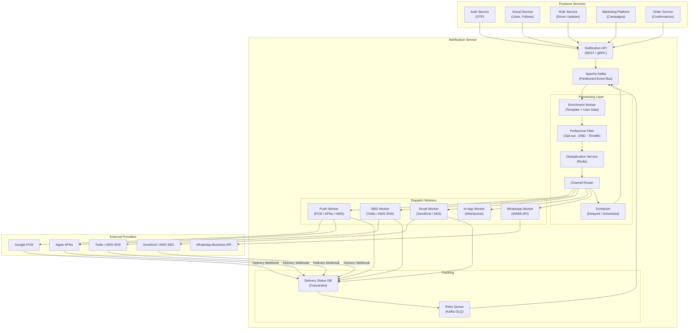
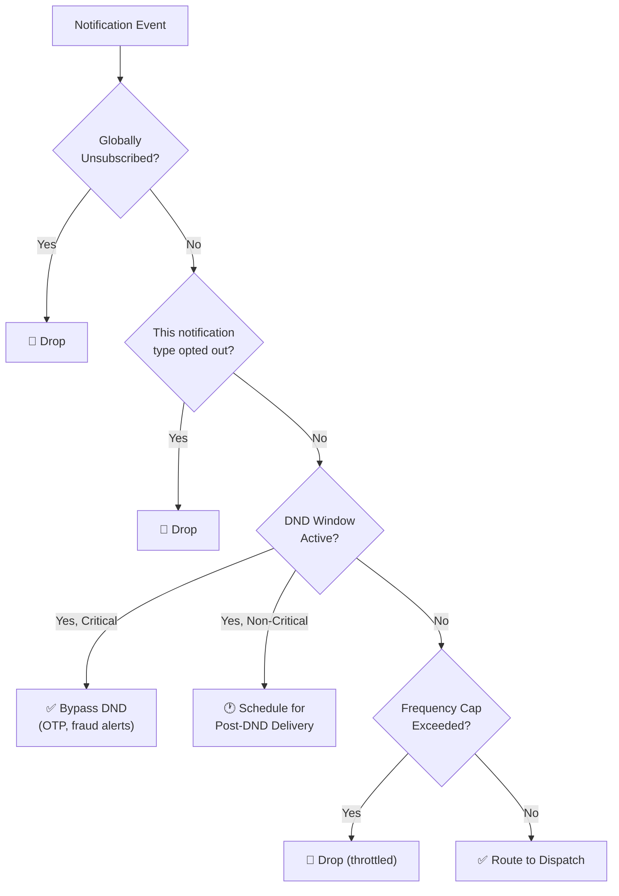
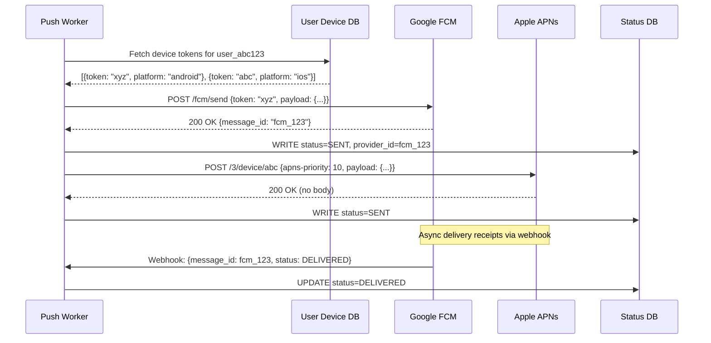
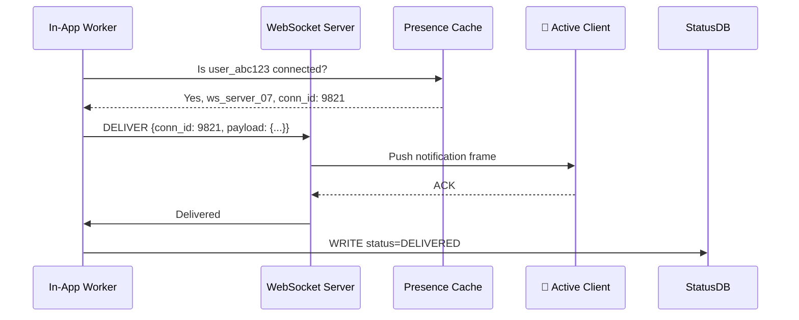
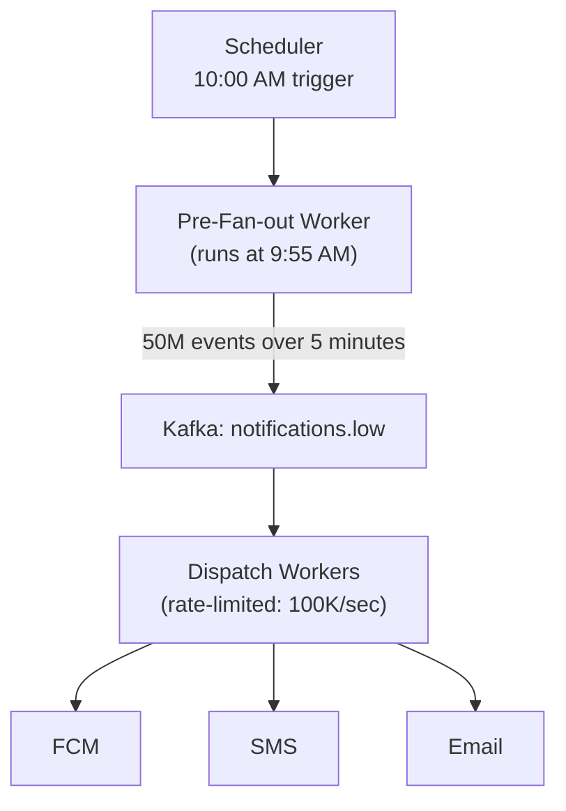
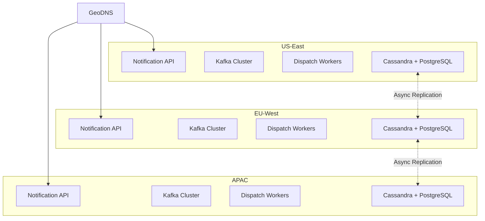
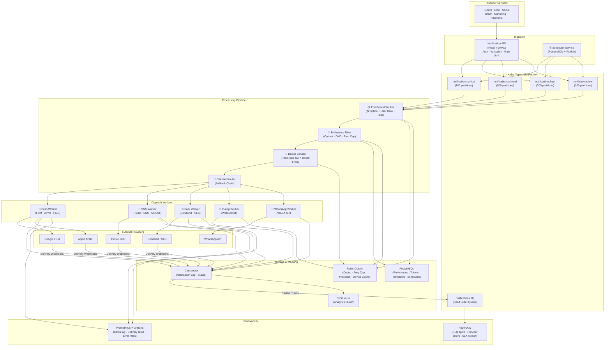

# Designing a Notification Service: The Backbone of Every Modern Platform

> **Difficulty:** Medium | **Category:** Infrastructure / Platform Service | **Companies:** Airbnb, Uber, Meta, Twilio, SendGrid, OneSignal

---

## Introduction

A **Notification Service** is the invisible backbone that powers nearly every user-facing action in a modern application. When someone likes your Instagram post, follows you on Twitter, your Uber driver arrives, or your flight is delayed — a notification service is firing. It's one of the most **cross-cutting platform services** in existence, consumed by dozens of product teams simultaneously.

What makes designing a notification service genuinely interesting is that it's deceptively simple on the surface — "just send a message" — but becomes architecturally complex at scale:

- **Multiple delivery channels** — push (FCM/APNs), SMS, email, in-app, WhatsApp, Slack
- **Massive fan-out** — a single event (a viral post) can trigger millions of notifications
- **Strict SLA requirements** — a ride-hailing "driver arrived" notification delayed by 30 seconds is a failed product experience
- **User preference management** — opt-outs, Do Not Disturb windows, frequency caps, channel preferences
- **Reliability guarantees** — a missed OTP notification means a lost user; a missed order confirmation means a support ticket
- **Deduplication** — retry storms must not flood users with duplicate notifications

Twilio processes **1 trillion+ interactions/year**. Meta sends **10 billion+ push notifications/day**. Uber sends real-time notifications to millions of concurrent rides. At this scale, notification delivery is a full distributed systems problem.

---

## Requirements Clarification

### Functional Requirements

- **Multi-channel delivery** — push (FCM/APNs/HMS), SMS (Twilio/AWS SNS), email (SendGrid/SES), in-app (WebSocket), WhatsApp Business API
- **Templating system** — define notification templates with dynamic variable substitution
- **User preference management** — per-channel, per-notification-type opt-outs; global mute; DND (Do Not Disturb) windows
- **Scheduling** — send notifications at a specific time or with a delay
- **Batching & throttling** — aggregate multiple events into a single notification ("Alice, Bob, and 47 others liked your post")
- **Deduplication** — prevent duplicate delivery on retries
- **Delivery tracking** — sent, delivered, opened, clicked, failed — per notification
- **Priority levels** — CRITICAL (OTP, fraud alert), HIGH (DMs, ride updates), NORMAL (likes, recommendations), LOW (newsletters)
- **A/B testing** — test different notification copy/timing on user segments

### Non-Functional Requirements

- **Low latency for critical notifications** — OTP/transactional: < 1 second end-to-end; ride updates: < 2 seconds
- **High throughput** — handle 1M+ notifications/sec during peak (marketing blast, viral event)
- **High availability** — 99.99% uptime; no single point of failure
- **At-least-once delivery** — notifications must not be silently dropped; retries on failure
- **Exactly-once display** — despite at-least-once delivery infrastructure, the user should never see a duplicate notification
- **Scalability** — scale horizontally with traffic; no per-channel scaling bottlenecks
- **Auditability** — every notification sent must be auditable for compliance and debugging

### Out of Scope

- In-app message rendering (client-side concern)
- Notification analytics dashboard (separate BI concern)
- Carrier-level SMS routing optimization

---

## Capacity Estimation

### Users & Traffic

| Metric | Estimate |
|---|---|
| Platform MAU | 500 million |
| Platform DAU | 200 million |
| Notifications sent per day | 5 billion |
| Notifications per second (avg) | ~58,000/sec |
| Notifications per second (peak) | ~1,000,000/sec |
| Marketing blasts (batch sends) | ~50M recipients in 10 minutes |
| OTP/transactional notifications | ~100M/day |
| Push : SMS : Email ratio | 70% : 20% : 10% |

### Storage Estimation

**Notification event log:**
- 5B notifications/day × 500 bytes/record = **2.5 TB/day**
- 90-day retention: **225 TB** for event logs

**User preferences:**
- 500M users × 2 KB per preference record = **1 TB** (fits in memory with Redis)

**Templates:**
- ~10,000 templates × 10 KB average = **100 MB** (trivially small, fully cacheable)

**Delivery status tracking:**
- 5B × 100 bytes (status record) = **500 GB/day**
- 30-day retention for status: **15 TB**

### Bandwidth Estimation

- Inbound (event ingestion): 58,000 events/sec × 1 KB avg = **~58 MB/s**
- Outbound (to FCM/APNs): 40,000 push/sec × 200 bytes payload = **~8 MB/s** (actual delivery handled by Google/Apple)
- Outbound (to SMS gateway): 12,000 SMS/sec × 160 bytes = **~2 MB/s**
- Outbound (email): 6,000 emails/sec × 50 KB avg = **~300 MB/s** — highest bandwidth channel

---

## High-Level Architecture

A production notification service has four logical layers:

1. **Ingestion layer** — accepts notification requests from upstream services
2. **Processing layer** — resolves templates, checks preferences, deduplicates, routes
3. **Dispatch layer** — channel-specific workers that interface with external providers
4. **Tracking layer** — records delivery status, powers analytics and retries



---

## Core Components Deep Dive

### 1. Notification API

The public interface for upstream services to request notifications. Two interaction models:

**a) Immediate Send (transactional)**
```
POST /v1/notifications/send
→ Validates request, publishes to Kafka, returns request_id
→ Latency: < 10ms (fire and forget)
```

**b) Scheduled Send (batch/marketing)**
```
POST /v1/notifications/schedule
→ Stores in Scheduler DB with trigger time
→ Scheduler Worker polls and publishes to Kafka at trigger time
```

**c) Broadcast (fan-out to segments)**
```
POST /v1/notifications/broadcast
→ Accepts segment definition (user filters, cohort IDs)
→ Async job: resolves segment → fans out to Kafka → workers deliver
→ Used for marketing blasts (50M recipients)
```

The API is intentionally thin — it accepts, validates, and enqueues. All intelligence lives downstream.

### 2. Apache Kafka — The Central Nervous System

Kafka is the backbone. Every notification event flows through it. This design decision provides:

- **Backpressure handling** — if FCM is slow, the Kafka queue builds up without losing events
- **Replay capability** — replay failed notifications from Kafka log (up to 7 days retention)
- **Fan-out** — one event consumed by multiple consumers (status tracking, analytics, retry logic)
- **Priority isolation** — separate Kafka topics per priority tier

```
Topics:
  notifications.critical    (OTP, fraud, account security)    → 100 partitions
  notifications.high        (DMs, ride updates, order status) → 200 partitions
  notifications.normal      (likes, follows, social)          → 500 partitions
  notifications.low         (newsletters, recommendations)    → 100 partitions
  notifications.dlq         (Dead Letter Queue — failed)      → 50 partitions
```

**Why partition by priority?** Critical notifications (OTP) must never be delayed by a flood of "someone liked your photo" notifications. Separate topics mean separate consumer groups with separate throughput budgets.

### 3. Enrichment Worker

The raw notification event from upstream contains minimal data:

```json
{
  "template_id": "ride_driver_arrived",
  "recipient_user_id": "user_abc123",
  "variables": { "driver_name": "Rajesh", "car": "Honda City" },
  "priority": "HIGH"
}
```

The Enrichment Worker resolves this into a deliverable notification:

1. **Fetch template** from Template Cache (Redis): `"Your driver {driver_name} has arrived in {car}"`
2. **Substitute variables**: `"Your driver Rajesh has arrived in Honda City"`
3. **Fetch user's device tokens** from User Device DB (all FCM/APNs tokens for this user)
4. **Fetch user's locale** for i18n (render in user's language)
5. **Determine channels** for this notification type (push + in-app for ride updates)

Template resolution is done entirely from Redis cache (TTL: 1 hour) to keep enrichment sub-millisecond.

### 4. Preference Filter

This is the "respect the user" layer. Before any notification is dispatched:



**Frequency capping example:**
- Max 3 marketing emails per user per week
- Max 10 push notifications per hour (non-critical)
- Max 1 SMS per 24 hours for the same topic

Frequency cap state stored in Redis:
```
Key:   freq_cap:{user_id}:{channel}:{topic}:{window}
Value: count (INCR)
TTL:   window duration (3600s for hourly cap)
```

### 5. Deduplication Service

The delivery pipeline uses **at-least-once semantics** (Kafka retries, worker retries). But users should receive **at-most-once display**. Deduplication bridges this gap.

```
Key:   dedup:{notification_id}
Value: "sent" (SET NX — only set if Not eXists)
TTL:   24 hours

Logic:
  IF SET NX succeeds → first time seen → proceed to dispatch
  IF SET NX fails → already processed → skip (idempotent)
```

`notification_id` is generated by the upstream service (UUID v4) and included in the event. The upstream service includes the same `notification_id` on all retries, ensuring idempotency across the entire pipeline.

### 6. Channel Router

Routes each enriched, filtered, deduplicated notification to the appropriate dispatch worker based on:

1. **User's preferred channel** (some users prefer SMS over push)
2. **Notification type priority** (SMS for OTP regardless of preferences)
3. **Device availability** (if user has no registered device token → skip push, fall back to SMS)
4. **Channel availability** (if FCM is reporting errors → route push to in-app temporarily)

**Fallback chain for OTP:**
```
Primary: Push notification (FCM/APNs)
  ↓ if no device token or delivery failure
Secondary: SMS via Twilio
  ↓ if SMS delivery failure
Tertiary: Email
```

### 7. Push Dispatch Worker (FCM / APNs)

The most complex dispatch channel due to platform fragmentation:



**Critical FCM/APNs error handling:**

| Error | Action |
|---|---|
| `InvalidRegistration` / `Unregistered` | Delete token from User Device DB immediately |
| `DeviceMessageRateExceeded` | Exponential backoff, retry after 60s |
| `Unavailable` (FCM 5xx) | Retry with exponential backoff + jitter; max 3 retries |
| `MessageTooBig` | Trim payload, retry |
| `QuotaExceeded` | Rate limit locally, drain queue gradually |

Stale device tokens are a major source of silent push failures. The worker must **proactively clean up invalid tokens** to maintain delivery rates.

### 8. SMS Dispatch Worker

SMS has unique constraints:
- **Character limits**: 160 chars (GSM-7), 70 chars (Unicode/emoji)
- **Multi-part SMS**: Messages > 160 chars split into multiple segments, each billed separately
- **DLT registration** (India): TRAI mandate — sender IDs and templates must be pre-registered
- **Carrier blacklists**: Some carriers block certain number patterns or keywords

```python
def send_sms(phone_number: str, message: str, provider: str):
    # Split if necessary
    segments = split_message(message)  # handles multi-part
    for segment in segments:
        response = twilio_client.messages.create(
            to=phone_number,
            from_=TWILIO_NUMBER,
            body=segment
        )
        record_status(response.sid, "QUEUED")
```

**Multi-provider strategy:**
```
Primary: Twilio (US, EU, APAC)
Failover: AWS SNS (if Twilio error rate > 5%)
Regional: MSG91 (India), Vonage (EU), Infobip (LATAM)
```

Route by cheapest provider per country (SMS cost varies 10-100× between countries).

### 9. Email Dispatch Worker

Email is the highest-latency channel (seconds to minutes for delivery) but critical for transactional use cases:

- **Transactional emails**: Order confirmations, OTPs (when SMS fails), account recovery → SendGrid/AWS SES, immediate send
- **Marketing emails**: Newsletters, promotions → SendGrid, batch send with hourly rate limits (respect ISP throttling)
- **Rendering**: HTML templates with Handlebars/Jinja2 → rendered server-side in the worker
- **Tracking pixels**: 1×1 transparent PNG embedded for open tracking; click-through links proxied via redirect service

**DMARC/DKIM/SPF compliance** is non-negotiable — without it, emails land in spam and domain reputation degrades rapidly.

### 10. In-App Notification Worker (WebSocket)

For users currently active in the app, in-app notifications are instant and free (no third-party cost):



If the user is offline (Redis lookup returns null), the In-App Worker publishes to Kafka to trigger a push notification fallback.

### 11. Scheduler

The Scheduler handles two use cases:

**a) Delayed notifications**: "Send this OTP in 30 seconds if user hasn't completed action"
**b) Time-zone-aware marketing**: "Send at 10 AM in the user's local time zone"

```
Implementation:
  - Store scheduled notifications in a Scheduler DB (PostgreSQL)
  - Scheduler Worker: polls every second for due notifications
  - On trigger time: publish to Kafka priority topic
  - Scale: use distributed locking (Redis SETNX) to ensure only one worker processes a given time slot
```

For high-volume scheduled sends (marketing blasts), the scheduler uses a **time-bucketed approach** — it pre-fans out the batch 5 minutes before send time to avoid a thundering herd when the send time hits.

---

## Database Design

### Storage Layer Decisions

| Data | Store | Justification |
|---|---|---|
| Notification event log | Cassandra | Write-heavy, time-series, TTL support |
| Delivery status tracking | Cassandra | High write throughput, query by notification_id |
| User preferences | PostgreSQL + Redis | Consistency for opt-outs, cache for reads |
| User device tokens | PostgreSQL + Redis | Consistent writes, cached reads |
| Templates | PostgreSQL + Redis | Infrequent writes, heavily cached |
| Scheduled notifications | PostgreSQL | ACID for scheduled job state |
| Frequency cap counters | Redis | Sub-ms atomic INCR, TTL-based windows |
| Deduplication keys | Redis | SET NX, 24h TTL |
| Analytics aggregates | ClickHouse | OLAP, columnar, high-compression |

### Notification Event Log Schema (Cassandra)

```sql
CREATE TABLE notification_log (
    notification_id UUID,
    recipient_id    UUID,
    template_id     TEXT,
    channel         TEXT,       -- push | sms | email | in_app | whatsapp
    priority        TEXT,       -- critical | high | normal | low
    status          TEXT,       -- pending | sent | delivered | failed | dropped
    provider_id     TEXT,       -- FCM message_id, Twilio SID, etc.
    payload         TEXT,       -- rendered notification content (JSON)
    created_at      TIMESTAMP,
    updated_at      TIMESTAMP,
    retry_count     INT,
    failure_reason  TEXT,
    PRIMARY KEY (notification_id)
) WITH default_time_to_live = 7776000;  -- 90 days TTL

-- Query by recipient (for user notification history):
CREATE TABLE notification_by_recipient (
    recipient_id    UUID,
    created_at      TIMEUUID,
    notification_id UUID,
    channel         TEXT,
    status          TEXT,
    PRIMARY KEY (recipient_id, created_at)
) WITH CLUSTERING ORDER BY (created_at DESC)
  AND default_time_to_live = 2592000;  -- 30 days
```

### User Device Token Schema (PostgreSQL + Redis)

```sql
CREATE TABLE user_device_tokens (
    token_id        UUID PRIMARY KEY DEFAULT gen_random_uuid(),
    user_id         UUID NOT NULL,
    device_token    TEXT NOT NULL,
    platform        TEXT NOT NULL,      -- ios | android | web | huawei
    app_version     TEXT,
    device_name     TEXT,
    is_active       BOOLEAN DEFAULT TRUE,
    registered_at   TIMESTAMP DEFAULT NOW(),
    last_used_at    TIMESTAMP,
    UNIQUE (device_token)
);

CREATE INDEX idx_tokens_user ON user_device_tokens(user_id) WHERE is_active = TRUE;
```

Redis cache: `device_tokens:{user_id}` → JSON array of active tokens (TTL: 1 hour)

### User Preference Schema (PostgreSQL)

```sql
CREATE TABLE notification_preferences (
    user_id             UUID,
    channel             TEXT,   -- push | sms | email | in_app | whatsapp
    notification_type   TEXT,   -- likes | follows | dms | marketing | system
    is_enabled          BOOLEAN DEFAULT TRUE,
    dnd_start           TIME,   -- e.g., 22:00
    dnd_end             TIME,   -- e.g., 08:00
    timezone            TEXT DEFAULT 'UTC',
    updated_at          TIMESTAMP DEFAULT NOW(),
    PRIMARY KEY (user_id, channel, notification_type)
);
```

### Sharding Strategy

- **Cassandra notification log**: Partitioned by `notification_id` (UUID) → uniform distribution; `notification_by_recipient` partitioned by `recipient_id`
- **PostgreSQL (preferences, tokens)**: Shard by `user_id` mod 64; 64 logical shards on 8 physical nodes
- **Redis**: Redis Cluster with 16,384 hash slots; frequency cap keys and dedup keys distributed by key hash

### Replication Strategy

- **Cassandra**: RF=3, `LOCAL_QUORUM` writes (durability), `LOCAL_ONE` reads (speed)
- **PostgreSQL**: 1 primary + 2 read replicas; synchronous replication for preference writes (opt-out must be immediately respected)
- **Redis**: 1 master + 1 replica per shard; persistence via AOF (Append-Only File) for durability of in-flight dedup state

---

## API Design

### Send Notification

```http
POST /v1/notifications/send
Authorization: Bearer <service_api_key>
Content-Type: application/json

{
  "notification_id": "notif_client_uuid_001",   // idempotency key
  "template_id": "otp_login",
  "recipient": {
    "user_id": "user_abc123",
    "phone": "+919876543210",                   // override if no user_id
    "email": "user@example.com"
  },
  "variables": {
    "otp": "482910",
    "expiry_minutes": 10
  },
  "channels": ["push", "sms"],                 // explicit override; else use routing rules
  "priority": "CRITICAL",
  "scheduled_at": null,                        // null = immediate
  "metadata": {
    "source_service": "auth-service",
    "trace_id": "trace_xyz789"
  }
}

Response 202 Accepted:
{
  "request_id": "req_srv_abc456",
  "notification_id": "notif_client_uuid_001",
  "status": "QUEUED",
  "estimated_channels": ["push", "sms"]
}
```

### Bulk / Broadcast Send

```http
POST /v1/notifications/broadcast
Authorization: Bearer <service_api_key>
Content-Type: application/json

{
  "campaign_id": "campaign_summer_sale",
  "template_id": "marketing_summer_sale",
  "segment": {
    "type": "cohort",
    "cohort_id": "cohort_premium_users_india"
  },
  "channels": ["push", "email"],
  "priority": "LOW",
  "scheduled_at": "2026-05-27T10:00:00+05:30",  // IST 10 AM
  "rate_limit_per_second": 50000                  // throttle to 50K/sec
}

Response 202 Accepted:
{
  "campaign_id": "campaign_summer_sale",
  "status": "SCHEDULED",
  "estimated_recipients": 15000000,
  "estimated_start": "2026-05-27T10:00:00+05:30"
}
```

### Get Notification Status

```http
GET /v1/notifications/{notification_id}/status
Authorization: Bearer <service_api_key>

Response 200 OK:
{
  "notification_id": "notif_client_uuid_001",
  "status": "DELIVERED",
  "channels": [
    {
      "channel": "push",
      "status": "DELIVERED",
      "provider": "FCM",
      "provider_id": "projects/myapp/messages/fcm_123",
      "sent_at": "2026-05-26T10:00:00.050Z",
      "delivered_at": "2026-05-26T10:00:00.820Z"
    },
    {
      "channel": "sms",
      "status": "SKIPPED",
      "reason": "push_delivered_successfully"
    }
  ]
}
```

### Update User Preferences

```http
PUT /v1/users/{user_id}/preferences
Authorization: Bearer <user_jwt>
Content-Type: application/json

{
  "preferences": [
    {
      "channel": "email",
      "notification_type": "marketing",
      "is_enabled": false
    },
    {
      "channel": "push",
      "notification_type": "likes",
      "is_enabled": true
    }
  ],
  "dnd": {
    "push": { "start": "22:00", "end": "08:00", "timezone": "Asia/Kolkata" }
  }
}

Response 200 OK:
{ "updated": 2, "dnd_updated": true }
```

### Webhook (Provider → Notification Service)

```http
POST /v1/webhooks/fcm
X-FCM-Signature: <hmac_signature>
Content-Type: application/json

{
  "message": {
    "name": "projects/myapp/messages/fcm_123",
    "delivery_receipt": {
      "status": "DELIVERED",
      "delivery_time": "2026-05-26T10:00:00.820Z"
    }
  }
}
```

Delivery webhooks update the `notification_log` in Cassandra and trigger retry logic if status is `FAILED`.

---

## Scalability Challenges

### 1. Marketing Blast Thundering Herd

**Problem:** A marketing team schedules a notification to 50M users at 10:00 AM IST. At 10:00:00, all 50M jobs become due simultaneously. This generates a massive write spike to Kafka and overwhelms dispatch workers.

**Solution: Pre-fan-out + rate-controlled dispatch**



- Pre-fan-out starts 5 minutes early, distributing events across Kafka at a controlled rate
- Dispatch workers consume at max 100K/sec → 50M notifications sent over ~8 minutes
- Zero thundering herd; CDN-like "pre-warm" model

### 2. Hot User Problem (Celebrities)

**Problem:** A celebrity (10M followers) posts something. The social service triggers 10M "follow activity" notifications simultaneously for a single event.

**Solution:**
- Rate-limit social notification fan-out at the **producer side**: social service batches notification requests into groups of 10K and publishes to Kafka with 10ms delay between batches
- Frequency cap: users already notified about this celebrity in the last 5 minutes → skip
- Notification aggregation: "Selena Gomez and 9,999,999 others posted new content" → single aggregated notification instead of 10M individual ones

### 3. FCM / APNs Rate Limits and Failures

Google and Apple impose per-app push quotas. Exceeding them means dropped notifications.

**Solution:**
- **Token bucket rate limiter** in each Push Worker, tuned to FCM/APNs quotas
- **Adaptive rate limiting**: monitor FCM error rate; if > 1% → slow down automatically
- **Multi-Firebase project**: If one Firebase project hits quota, route overflow to secondary Firebase project (different app_id)

### 4. Stale Device Tokens

Problem: 20-30% of push tokens become invalid within 6 months (users uninstall apps, upgrade devices). Sending to invalid tokens wastes quota and skews delivery metrics.

**Solution:**
- On FCM `InvalidRegistration` → immediately mark token inactive in PostgreSQL + Redis
- **Proactive cleanup**: weekly job queries tokens with `last_used_at > 90 days` → soft delete
- Track delivery rates per token: if a token has 10 consecutive failures → mark inactive

### 5. Consistency of Opt-Outs

**Problem:** User opts out of marketing emails. The preference update hits the primary PostgreSQL. But 500ms later, a marketing blast reads the cached preference (1-hour TTL) and sends the email anyway.

**Solution:**
- On opt-out write: **immediately invalidate** the Redis preference cache for that user
- Use **write-through caching**: any preference write updates both PostgreSQL and Redis atomically
- For critical opt-outs (global unsubscribe): bypass cache entirely, check PostgreSQL directly for the next 5 minutes (tracked via a Redis flag)

### 6. Deduplication at Scale

At 1M notifications/sec, the deduplication Redis cluster processes 1M `SET NX` operations/sec. With 24h TTL, this accumulates ~86B keys/day — too large for a single Redis cluster.

**Solution:**
- **Consistent hash the notification_id** across a 32-shard Redis cluster
- Each shard handles ~31K ops/sec — well within Redis's ~1M ops/sec capacity
- **Bloom Filter as first-pass**: a probabilistic filter (no false negatives, acceptable false positives) checks "have we seen this notification_id before?" in O(1) with < 1% false positive rate. Only confirmed novel IDs go to Redis for authoritative SET NX.

---

## Scaling Strategies

### Kafka Consumer Group Scaling

Each channel type has its own consumer group, independently scalable:

```
Consumer Group: push-workers        → 100 consumers (highest volume)
Consumer Group: sms-workers         → 30 consumers
Consumer Group: email-workers       → 20 consumers
Consumer Group: in-app-workers      → 50 consumers
Consumer Group: analytics-workers   → 10 consumers
```

Scale each group independently based on lag metrics. Kafka lag > 10,000 → auto-scale that consumer group.

### Horizontal Scaling of Stateless Workers

All processing workers (Enrichment, Preference Filter, Dedup, Router, Dispatch) are stateless — they read from databases and caches. Scale via:
- Kubernetes HPA (Horizontal Pod Autoscaler) based on Kafka consumer lag
- Target: Kafka lag < 30 seconds for HIGH priority, < 5 minutes for NORMAL priority

### Async Delivery Receipt Processing

Provider delivery receipts (FCM webhooks, Twilio status callbacks) arrive at high volume:
- Don't process synchronously in the webhook handler
- Webhook handler: validate signature → publish to Kafka → return 200 immediately
- Kafka consumer: update Cassandra status asynchronously

This decouples provider callback latency from your own processing capacity.

### Read Replicas for Preference Reads

Preference reads happen for every notification processed — extremely read-heavy:
- 1 PostgreSQL primary (writes only)
- 3 read replicas (preference reads)
- Redis cache layer: 99%+ hit rate → replicas handle < 1% of traffic

### CDN for Email Templates

Email templates are HTML files (with images, CSS). Serve template images from CDN:
- Template images: `Cache-Control: max-age=31536000` (1 year, content-addressed URLs)
- Click-through redirect service: `https://track.yourapp.com/click/{encoded_url}` — serves analytics + redirects

---

## Reliability & Fault Tolerance

### Retry Strategy Per Channel

Different channels have different retry semantics:

| Channel | Max Retries | Backoff | Retry Window |
|---|---|---|---|
| **Push (FCM/APNs)** | 3 | Exponential (1s, 5s, 30s) | 5 minutes |
| **SMS** | 5 | Linear (30s intervals) | 15 minutes |
| **Email (transactional)** | 3 | Exponential (1m, 5m, 15m) | 30 minutes |
| **Email (marketing)** | 1 | None (drop on failure) | — |
| **In-App** | 1 (fallback to push) | — | — |
| **Critical (OTP)** | 5 across channels | 30s, escalate channel | 10 minutes |

### Dead Letter Queue (DLQ)

After exhausting retries, events go to the DLQ (`notifications.dlq` Kafka topic):
- Dedicated DLQ consumer: logs failure reason, alerts on-call, optionally sends fallback channel
- DLQ events retained for 7 days — engineers can manually replay after fixing root cause
- Alert: DLQ spike > 100 events/minute → page on-call

### Circuit Breakers Per Provider

```
FCM Circuit Breaker:
  CLOSED: Normal operation
  → Error rate > 10% in 30s window → OPEN
  → Fast-fail: route to in-app; queue push for later
  → After 60s probe: if success → CLOSED

Twilio Circuit Breaker:
  → On OPEN: failover to AWS SNS automatically
```

### Multi-Region Active-Active



- Notifications processed in the **same region as the sending service** to minimize cross-region latency
- User preference data replicated globally — every region can make routing decisions independently
- Disaster recovery: if US-East goes down, GeoDNS shifts traffic to EU-West in < 60 seconds

### Idempotency Guarantee End-to-End

```
Producer (upstream service) → includes notification_id (UUID, their own)
  ↓
Kafka → at-least-once delivery
  ↓
Dedup Worker → SET NX on notification_id in Redis
  → First time: proceed
  → Second time (retry): discard
  ↓
Dispatch Worker → sends to FCM/APNs
  → FCM itself is idempotent on message_id
  ↓
User → receives exactly one push notification
```

---

## Security Considerations

### Authentication Between Services

The Notification API is an internal platform service. Upstream services authenticate with:
- **mTLS (mutual TLS)** — both client and server present certificates; strongest guarantee
- **Service API Keys** — signed JWTs with `service_name` claim; short-lived (1 hour), rotated automatically
- Per-service rate limits: Auth Service can send 10K OTPs/minute; Marketing Service is capped at 1M/hour

### Sensitive Data Handling

Notifications often contain sensitive data (OTPs, account details):
- OTP values must **never** be logged in plaintext — log only `otp_sent: true`
- Notification payloads in Cassandra should be encrypted at rest (AES-256 TDE)
- PII (phone numbers, emails) in logs must be masked: `+91987****210`
- SMS content must not be stored beyond 7 days (GDPR/DPDPA compliance)

### Webhook Security

Provider webhooks (FCM, Twilio) must be verified before processing:
- **HMAC-SHA256 signature verification** on every webhook request
- Signature computed by provider over the request body using a shared secret
- Reject any webhook with invalid or missing signature → prevents webhook injection attacks

```python
def verify_twilio_webhook(request_body: bytes, signature: str, url: str) -> bool:
    expected = hmac.new(TWILIO_SECRET.encode(), url.encode() + request_body, sha256).hexdigest()
    return hmac.compare_digest(expected, signature)  # constant-time comparison
```

### Abuse Prevention

- **OTP rate limiting**: max 5 OTP requests per phone number per hour; max 20 per day
- **Unsubscribe enforcement**: one-click unsubscribe in every marketing email (CAN-SPAM / GDPR); any bypass → legal liability
- **Spam keyword detection**: ML model scans outgoing notifications for phishing patterns before dispatch
- **Sending domain reputation monitoring**: track bounce rates, spam complaints per sender domain; degrade to fallback domain if reputation drops

### DDoS Protection

- API Gateway rate limits: 10K requests/sec per upstream service
- Kafka producer quotas: per-service byte-rate limits on Kafka topics
- External provider protection: signed webhook URLs with short-lived tokens prevent replay attacks

---

## Tradeoffs & Alternatives

### Kafka vs. SQS/RabbitMQ for Event Bus

| | Apache Kafka | AWS SQS | RabbitMQ |
|---|---|---|---|
| **Throughput** | Millions/sec | ~3K/sec per queue | ~50K/sec |
| **Retention** | Days/weeks (log) | 14 days | Until consumed |
| **Replay** | ✅ Native | ❌ | ❌ |
| **Ordering** | Per partition | Per FIFO queue | Per queue |
| **Operational overhead** | High (self-managed) | Zero (managed) | Medium |
| **Priority queues** | Separate topics | Separate queues | Priority queues |

At 1M notifications/sec, Kafka is the only choice that won't become the bottleneck. For smaller scale (< 100K/sec), SQS is operationally simpler.

### Build vs. Buy Notification Service

| | Build In-House | Use Twilio/OneSignal/Braze |
|---|---|---|
| **Time to market** | Months | Days |
| **Cost at scale** | Low (marginal infra cost) | High ($0.001-$0.01 per notification) |
| **Customization** | Full | Limited |
| **Reliability** | Your problem | Vendor SLA |
| **Vendor lock-in** | None | High |

**Rule of thumb:** < 1M notifications/day → use a managed service (Twilio, OneSignal). > 10M/day → the cost savings justify building in-house. **Always abstract the provider behind an interface** so you can swap vendors.

### Push vs. SMS vs. Email — When to Use Each

| Channel | Latency | Cost | Delivery Rate | Best For |
|---|---|---|---|---|
| **Push (FCM/APNs)** | < 1s | ~$0.0001 | 90%+ (if token valid) | Real-time alerts, rich media |
| **SMS** | 1-30s | $0.01-$0.10 | 98%+ | OTP, critical alerts (no app needed) |
| **Email** | Seconds-minutes | $0.0001 | 85-95% (deliverability varies) | Long-form, marketing, receipts |
| **In-App** | < 100ms | Free | 100% (if user is active) | Real-time, active session |
| **WhatsApp** | < 2s | $0.005-$0.10 | 95%+ | High-engagement markets (India, Brazil) |

### Redis vs. Memcached for Deduplication

Chose Redis over Memcached because:
- **SET NX** (atomic check-and-set) is a Redis primitive — Memcached lacks this
- Redis persistence (AOF) means dedup state survives restarts
- Redis Cluster for horizontal scaling — Memcached sharding is client-side only

---

## Real-World Engineering Insights

### Airbnb's Notification Platform — Trebuchet

Airbnb built **Trebuchet**, their internal notification platform, to handle 100M+ notifications/day across 220 countries. Key architectural decisions:

- **Centralized preference graph**: A single service owns all user preferences — eliminates the inconsistency problem of preferences scattered across microservices
- **Adaptive send-time optimization**: ML model predicts the optimal time to send a notification for each user (when they're most likely to open the app), improving CTR by 20%+
- **Template versioning**: Every template has a version; A/B tests run on template versions

### Meta's Notification Infrastructure

Meta sends 10 billion+ push notifications daily for Facebook, Instagram, and Messenger combined. Their architecture:

- **Push proxy layer**: Meta runs their own APNS/FCM proxy that batches multiple notifications to the same device, reducing API calls to Apple/Google by 5-10×
- **Coalescing**: If 3 notifications are queued for the same user in the same second, they're merged into one (prevents notification spam from viral content)
- **FAROS (Facebook Aqueduct for Notification Routing and Optimization System)**: Their internal real-time routing system uses user engagement history to decide channel + timing

### Uber's Real-Time Notification Requirements

Uber's "driver arrived" notification is arguably the highest-stakes notification in consumer tech — a 10-second delay means a cancelled ride. Their approach:

- **Triple-redundant delivery**: Simultaneously send push + SMS + in-app for ride-critical events — first delivery wins, others cancelled
- **Driver geofence trigger**: Notification triggered when driver is within 100 meters of pickup, not when they arrive — accounts for FCM delivery latency
- **Fallback escalation**: Push fails → SMS within 3 seconds; SMS fails → automated phone call within 10 seconds

### Google's Firebase Cloud Messaging Scale

FCM processes **500 billion+ messages/day** (not just push — all Firebase messaging). Key engineering feats:

- **Collapse keys**: Multiple notifications with the same collapse key collapse to one on the device. If a user has 10 undelivered "new message" notifications, only the latest is delivered when they reconnect
- **Priority management**: High-priority messages wake the device from Doze mode; normal-priority messages respect battery optimization
- **TTL (Time-To-Live)**: Push notifications with `ttl=0` are dropped if the device isn't connected right now (ideal for time-sensitive events like "your OTP expires in 5 minutes")

---

## Final Architecture Diagram



---

## Key Takeaways

1. **Priority isolation via separate Kafka topics is non-negotiable.** A flood of social notifications should never delay an OTP. Separate topics → separate consumer groups → independent throughput budgets.

2. **Deduplication must be idempotent at every layer.** Kafka guarantees at-least-once; your dedup layer (Redis SET NX + Bloom Filter) provides the exactly-once user experience. Never rely on external providers to deduplicate for you.

3. **Preference filtering must be fast AND consistent.** Cache preferences in Redis (1ms reads), but immediately invalidate on opt-out writes. A marketing email sent after a user unsubscribed is both a UX failure and a legal risk.

4. **The channel router's fallback chain is the product.** "Push → SMS on failure" for OTPs is what makes authentication work reliably across all user segments. Design the fallback chain intentionally, not as an afterthought.

5. **Marketing blasts require pre-fan-out + rate control.** Never publish 50M events to Kafka simultaneously. Pre-fan-out 5 minutes early at a controlled rate — this is the thundering herd solution for batch sends.

6. **Device token hygiene is a performance metric.** 20-30% of tokens become stale over time. Proactively cleaning invalid tokens improves delivery rates and prevents quota waste at FCM/APNs.

7. **Webhook signature verification is a security requirement.** An unverified delivery webhook endpoint is an injection vector. Always HMAC-verify + constant-time compare.

8. **Abstract providers behind interfaces.** If Twilio goes down, you need to switch to AWS SNS in < 5 minutes. A circuit breaker + provider interface abstraction makes this automatic.

9. **Royalties are to Spotify what delivery receipts are to notifications.** Both require accurate event counting with financial or SLA implications. Design your tracking pipeline with the same rigor as a financial system.

10. **Build vs. buy is a scale decision.** Below 1M/day, use Twilio/OneSignal. Above 10M/day, build in-house. But always abstract the provider so the transition is clean.

---

## Interview Tips

### Common Follow-Up Questions

> **"How do you ensure an OTP is delivered within 10 seconds, globally?"**
- CRITICAL priority Kafka topic → dedicated fast-path consumer group (no wait behind social notifications)
- Simultaneous push + SMS dispatch (don't wait for push to fail before trying SMS)
- Multi-region deployment → nearest region handles the request; FCM/APNs connect to nearest Google/Apple server
- Pre-warmed device token cache in Redis → no DB lookup in the critical path

> **"How would you implement Spotify Wrapped / Year-in-Review notifications?"**
- Pre-generate personalized content for all users offline (Spark batch job)
- Store rendered payloads in object storage (S3) keyed by user_id
- Schedule broadcast for the launch date with rate-limited pre-fan-out
- Email worker fetches payload from S3 (not from a DB → avoids DB hotspot)

> **"How do you handle a user who uninstalled the app but you keep sending push notifications?"**
- FCM/APNs returns `NotRegistered` / `InvalidToken` error
- Push Worker immediately marks token as inactive in DB + invalidates Redis cache
- Falls back to other channels (email, SMS) if configured

> **"How would you A/B test notification copy?"**
- At the Router stage: hash `user_id % 100` → assign to variant A (0-49) or variant B (50-99)
- Variant determines which `template_id` is fetched
- Track open rates, click rates per variant in ClickHouse
- Statistical significance check before declaring a winner

> **"How do you handle time-zone-aware notifications?"**
- Scheduler stores `send_at_local_time` (e.g., "10:00") + user's timezone
- Scheduler Worker queries: `SELECT users WHERE timezone = 'Asia/Kolkata' AND local_time = '10:00'`
- Publishes to Kafka → dispatched in that timezone window
- Users are grouped by timezone in the Scheduler DB for efficient queries

### What Interviewers Expect

- ✅ Immediately separate notification types by priority
- ✅ Explain the Kafka fan-out architecture before jumping to channels
- ✅ Discuss preference filtering AND its consistency requirements
- ✅ Explain deduplication as a distinct architectural concern
- ✅ Mention circuit breakers for external provider failures
- ✅ Address the thundering herd problem for marketing blasts
- ✅ Discuss device token management (stale tokens are a real problem)

### Mistakes Candidates Make

- ❌ Designing a single-channel system (push only) — a notification service must be multi-channel
- ❌ Synchronous notification delivery (blocking the upstream service until delivery)
- ❌ No priority separation — one blocked channel shouldn't affect OTP delivery
- ❌ Forgetting user preferences / opt-outs — this is a legal requirement, not just UX
- ❌ No deduplication — retry storms cause duplicate notifications
- ❌ Using HTTP polling instead of Kafka for event ingestion (doesn't scale to 1M/sec)
- ❌ Not handling stale device tokens — delivery rates will silently degrade
- ❌ Single provider dependency — every external provider has outages; multi-provider is mandatory
- ❌ Storing OTPs in notification logs in plaintext

---

*This design synthesizes architectural patterns from Airbnb Engineering (Trebuchet), Meta's notification infrastructure, Uber's real-time alerting, and publicly available distributed systems literature. Production implementations involve significant additional regulatory, localization, and carrier-specific complexity.*
