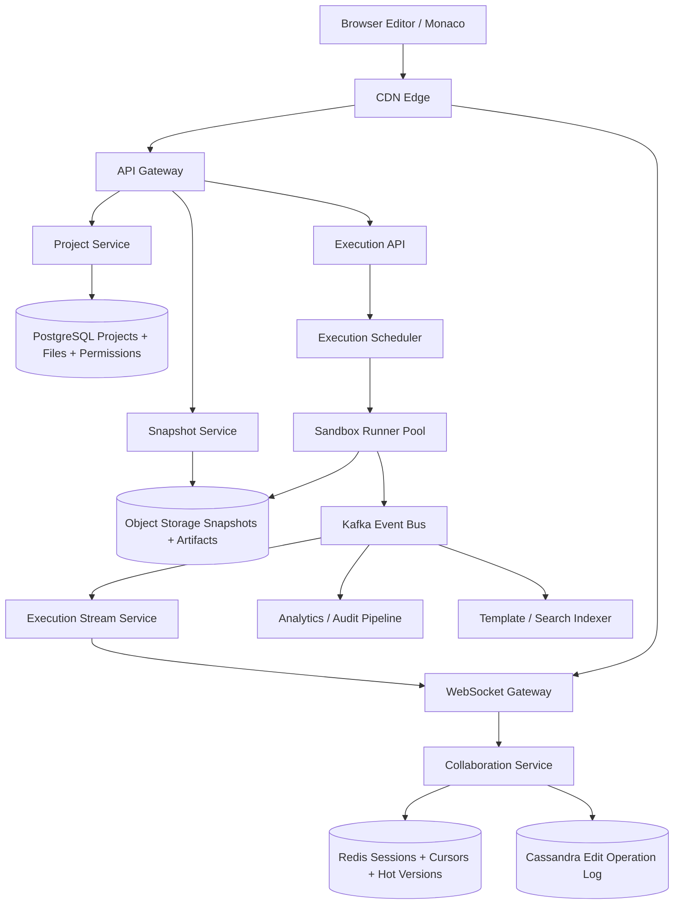
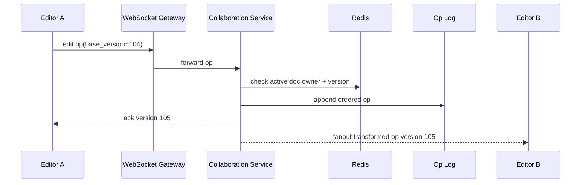
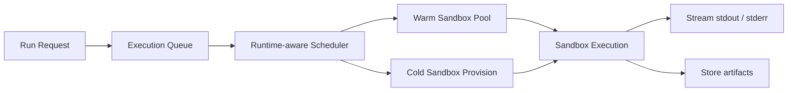
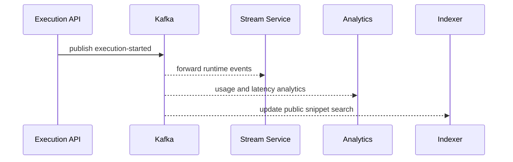
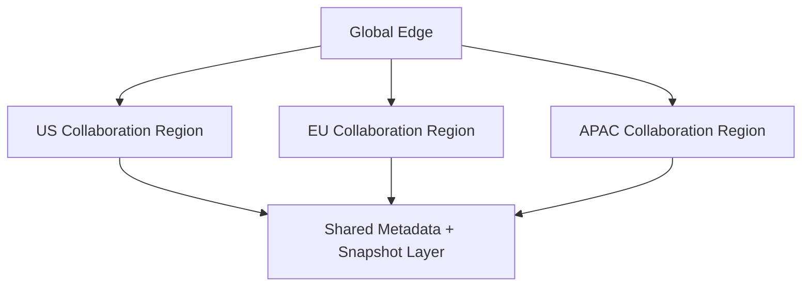

# Design Online Code Editor

Designing an online code editor is a common system design interview problem because it combines low-latency interactive editing with collaboration, autosave, code execution, and strict multi-tenant isolation. Users expect typing to feel local even though files are stored remotely, collaborators may be editing the same file at the same time, and execution requests must run untrusted code safely. The platform is part document editor, part realtime system, and part sandbox orchestration platform.

At a high level, the system has two very different workloads. The first is the **interactive editing path**, where users open projects, type code, see cursor movement, and expect changes to propagate to collaborators almost instantly. The second is the **execution path**, where the system packages the current revision, schedules it onto an isolated runtime, streams stdout and stderr back to the browser, and enforces strict CPU, memory, and network limits. A good design keeps the editing path hot, stateful, and latency-focused while making execution secure, queued, and resource-governed.

---

## Functional Requirements

**In Scope:**
- Users can create projects with one or more files and folders
- The editor supports opening, editing, renaming, and deleting files within a project
- Changes are autosaved and durable even if the browser disconnects unexpectedly
- Multiple users can collaborate on the same project and file in near real time
- Users can run code against selected language runtimes and see logs, exit codes, and execution status
- The system stores revision snapshots and lets users inspect or restore earlier saved states
- Users can share projects with collaborators using project-level permissions
- Operators can inspect active sessions, execution queue depth, hot runtimes, and sandbox failure rates

**Out of Scope:**
- Full source-control hosting comparable to GitHub or GitLab internals
- Advanced IDE intelligence such as large-scale AI code completion or semantic refactoring engines
- Long-running production hosting for deployed applications
- Arbitrary root shell access to infrastructure
- Enterprise billing, marketplace integrations, or classroom grading workflows in depth

---

## Non-Functional Requirements

| Property | Target | Reasoning |
|---|---|---|
| **Typing Latency** | local echo immediate; remote collaboration propagation p99 < 200ms | editing must feel interactive, not request-response bound |
| **Open Project Latency** | p99 < 500ms for metadata and initial file tree | project load is the first visible experience |
| **Execution Start Latency** | warm sandbox start p99 < 2s; cold start still bounded | users expect `Run` to feel responsive for small programs |
| **Autosave Durability** | edits durable within a few seconds even during disconnects | losing code changes destroys trust quickly |
| **Isolation** | untrusted execution cannot escape sandbox or affect neighbors | code execution is the main security boundary |
| **Availability** | 99.95% for editing and project access; 99.9% for execution | editing is the core workflow, execution is secondary but important |
| **Scalability** | hundreds of thousands of concurrent sockets and large runtime bursts | classrooms, contests, and tutorials create sharp spikes |
| **Fairness** | one noisy project, runtime, or user should not starve other tenants | multi-tenant execution and collaboration require isolation at several layers |

**Key tradeoff:** the platform prioritizes **low-latency collaborative editing and reliable autosave** while enforcing **strictly isolated, resource-limited code execution**. Editing wants warm state and fast fanout; execution wants queues, quotas, and sandbox boundaries.

---

## Capacity Estimation

**User and session assumptions:**
- Assume **3M daily coding sessions** across tutorials, interview practice, and collaborative workspaces
- Peak concurrency may reach **200K active editor sessions** during school hours, coding contests, or classroom events
- Each active session may hold one or more WebSocket channels for edits, presence, and execution output

**Edit traffic assumptions:**
- Suppose each session produces roughly **700 logical edit operations** on average after batching keystrokes into short frames
- That yields about **2.1B logical edit operations/day**
- Peak collaborative traffic can exceed **100K to 200K operations/sec** once multiple users edit hot shared projects simultaneously

**Execution assumptions:**
- Assume **10M run requests/day** across supported languages and templates
- Average execution rate is manageable, but bursts around contests or onboarding exercises can be **10x higher** on a small set of runtimes
- Runtime distribution is skewed: a few popular languages like JavaScript, Python, Java, and C++ dominate warm-pool usage

**Storage profile:**
- Projects are usually small, but revisions accumulate quickly due to autosave and snapshots
- Execution logs and artifacts are append-heavy and often short-lived, while project snapshots may need long retention
- Active state is much smaller than total durable history, so hot-path state and durable history should be stored separately

---

## Core Entities

| Entity | Purpose | Key Fields | Relationships |
|---|---|---|---|
| **User** | Authenticated editor user | `user_id`, `name`, `email`, `plan_tier` | owns or collaborates on many projects |
| **Project** | Top-level workspace container | `project_id`, `owner_id`, `name`, `visibility`, `default_runtime` | has many files, members, and executions |
| **ProjectMember** | Project-level access control | `project_id`, `user_id`, `role`, `invited_at` | connects users to projects |
| **FileMetadata** | File tree node metadata | `file_id`, `project_id`, `path`, `language`, `latest_snapshot_id` | belongs to one project |
| **EditOperation** | Single collaborative change unit | `op_id`, `file_id`, `session_id`, `base_version`, `payload` | applied to one file in sequence |
| **RevisionSnapshot** | Durable materialized state of a file or project | `snapshot_id`, `project_id`, `created_by`, `storage_key` | compresses a range of edit operations |
| **CollaborationSession** | Active websocket-backed editing presence | `session_id`, `project_id`, `user_id`, `connected_at`, `status` | tracks cursors and active documents |
| **ExecutionRequest** | Run request for selected runtime | `execution_id`, `project_id`, `runtime`, `entry_file`, `status` | produces logs and artifacts |
| **ExecutionLogChunk** | Streamed stdout/stderr fragment | `execution_id`, `offset`, `stream`, `data` | belongs to one execution |
| **ExecutionArtifact** | Resulting binary or generated output | `artifact_id`, `execution_id`, `storage_key`, `content_type` | attached to one execution |

**Critical modeling decisions:**
- `EditOperation` is separate from `RevisionSnapshot`. The system does not rewrite the whole file on every keystroke; it stores ordered operations and periodically checkpoints them.
- `CollaborationSession` is ephemeral and belongs in the hot path, while `RevisionSnapshot` and project metadata are durable.
- `ExecutionRequest` is immutable after submission except for status transitions. That makes retries, audit, and log streaming easier to reason about.

---

## Databases and Database Design

### Storage Tier Decisions

| Data | Access Pattern | Engine | Why |
|---|---|---|---|
| Users, projects, file metadata, permissions, execution metadata | transactional writes, exact reads, authorization checks | **PostgreSQL / MySQL** | project metadata and permissions need strong consistency |
| Active sessions, cursor state, hot document versions, rate limits | sub-millisecond reads/writes, TTLs, fast fanout lookups | **Redis** | ideal for ephemeral collaboration state and hot-path routing |
| Ordered edit-operation log and execution-log history | append-heavy writes, file-scoped or execution-scoped reads | **Cassandra / ScyllaDB** | good fit for high-volume time-ordered event storage |
| Project snapshots, uploaded assets, execution artifacts | large immutable blobs, cheap durable storage | **Object Storage + CDN** | snapshots and artifacts are much better as objects than rows |
| Execution events, snapshot events, analytics, notifications | durable append-only backbone | **Kafka** | decouples realtime editing and execution from downstream consumers |
| Public template or snippet search | keyword search and filtering | **OpenSearch** | useful if the product exposes searchable templates or snippets |

This is intentionally polyglot. An online code editor needs **transactional metadata**, **hot collaborative state**, **append-heavy revision history**, **sandbox artifacts**, and **durable asynchronous fanout**. A single database would either be too slow for the hot path or too expensive for history and blobs.

### Schema 1 - Projects and Files (SQL)

```sql
CREATE TABLE projects (
  project_id                UUID PRIMARY KEY DEFAULT gen_random_uuid(),
  owner_id                  UUID NOT NULL,
  name                      VARCHAR(255) NOT NULL,
  visibility                VARCHAR(16) NOT NULL,
  default_runtime           VARCHAR(64),
  created_at                TIMESTAMPTZ DEFAULT NOW(),
  updated_at                TIMESTAMPTZ DEFAULT NOW()
);

CREATE TABLE project_members (
  project_id                UUID NOT NULL REFERENCES projects(project_id),
  user_id                   UUID NOT NULL,
  role                      VARCHAR(16) NOT NULL,
  invited_at                TIMESTAMPTZ DEFAULT NOW(),
  PRIMARY KEY (project_id, user_id)
);

CREATE TABLE files (
  file_id                   UUID PRIMARY KEY DEFAULT gen_random_uuid(),
  project_id                UUID NOT NULL REFERENCES projects(project_id),
  path                      TEXT NOT NULL,
  language                  VARCHAR(32),
  latest_snapshot_id        UUID,
  created_at                TIMESTAMPTZ DEFAULT NOW(),
  updated_at                TIMESTAMPTZ DEFAULT NOW(),
  UNIQUE (project_id, path)
);
```

### Schema 2 - Execution Requests (SQL)

```sql
CREATE TABLE execution_requests (
  execution_id              UUID PRIMARY KEY DEFAULT gen_random_uuid(),
  project_id                UUID NOT NULL REFERENCES projects(project_id),
  requested_by              UUID NOT NULL,
  runtime                   VARCHAR(64) NOT NULL,
  entry_file                TEXT NOT NULL,
  status                    VARCHAR(24) NOT NULL,
  exit_code                 INT,
  artifact_storage_key      TEXT,
  created_at                TIMESTAMPTZ DEFAULT NOW(),
  updated_at                TIMESTAMPTZ DEFAULT NOW()
);
```

### Schema 3 - Edit Operations by File (Cassandra)

```sql
CREATE TABLE edit_operations_by_file (
  file_id                    UUID,
  bucket_day                 TEXT,
  applied_at                 TIMESTAMP,
  op_id                      UUID,
  session_id                 UUID,
  base_version               BIGINT,
  operation_json             TEXT,
  PRIMARY KEY ((file_id, bucket_day), applied_at, op_id)
) WITH CLUSTERING ORDER BY (applied_at ASC, op_id ASC);
```

Daily buckets keep very active collaborative files bounded while preserving replay order.

### Schema 4 - Execution Logs by Execution (Cassandra)

```sql
CREATE TABLE execution_logs_by_execution (
  execution_id               UUID,
  chunk_seq                  BIGINT,
  stream_name                TEXT,
  data_chunk                 TEXT,
  emitted_at                 TIMESTAMP,
  PRIMARY KEY ((execution_id), chunk_seq)
) WITH CLUSTERING ORDER BY (chunk_seq ASC);
```

### Schema 5 - Snapshot Manifest (Object Storage JSON)

```json
{
  "snapshot_id": "snap_123",
  "project_id": "proj_456",
  "created_at": "2026-06-03T10:00:00Z",
  "files": [
    {
      "path": "/src/main.py",
      "content_blob": "blobs/sha256/ab/cd/ef123"
    }
  ]
}
```

### Schema 6 - Active Session Record (Logical Redis Record)

```json
{
  "key": "session:project:proj_456:user_999",
  "value": {
    "session_id": "sess_111",
    "active_file_id": "file_222",
    "cursor": { "line": 18, "column": 7 },
    "expires_at": "2026-06-03T10:05:00Z"
  }
}
```

### Sharding and Replication Strategy

| Store | Shard Key | Strategy | Replication |
|---|---|---|---|
| SQL metadata core | `project_id` or `owner_id` | many logical shards as project count grows | primary + replicas, stronger consistency on metadata writes |
| Redis | `project_id`, `file_id`, `user_id` | Redis Cluster with hot-project isolation | 1 replica per master |
| Cassandra | `(file_id, bucket_day)` and `execution_id` | consistent hashing across nodes | RF=3, `LOCAL_QUORUM` |
| Kafka | `project_id`, `file_id`, or `execution_id` depending on topic | partitioned durable log | RF=3 |
| Object Storage | `project_id` namespace | regional buckets + lifecycle policies | multi-AZ durable storage |
| OpenSearch | template category or visibility routing | distributed search shards | replicated clusters |

**Consistency model:**
- Strong consistency for project metadata, permissions, snapshot publication metadata, and execution status transitions
- Ordered consistency for active file operations within the owning collaboration shard
- Eventual consistency for analytics, notifications, template indexing, and project search surfaces
- Best-effort low-latency consistency for cursor positions and presence state

**Read/write patterns:**
- **Editing path:** open latest snapshot -> replay recent operations -> attach to collaboration shard -> accept and fan out ordered edits
- **Autosave path:** accumulate operations -> checkpoint snapshot periodically -> update latest snapshot pointer -> trim old hot state
- **Execution path:** package chosen revision -> queue execution -> schedule isolated sandbox -> stream logs -> persist result and artifact metadata

---

## API Design

**Create a project:**
```http
POST /v1/projects
Authorization: Bearer <jwt>

{
  "name": "Interview Prep",
  "default_runtime": "python3.12",
  "visibility": "private"
}

201 Created
{
  "project_id": "proj_456",
  "name": "Interview Prep",
  "default_runtime": "python3.12",
  "visibility": "private"
}
```

**Fetch project metadata and file tree:**
```http
GET /v1/projects/proj_456
Authorization: Bearer <jwt>

200 OK
{
  "project_id": "proj_456",
  "name": "Interview Prep",
  "default_runtime": "python3.12",
  "files": [
    {
      "file_id": "file_222",
      "path": "/src/main.py",
      "language": "python"
    }
  ]
}
```

**Create an execution:**
```http
POST /v1/executions
Authorization: Bearer <jwt>
Idempotency-Key: exec-001

{
  "project_id": "proj_456",
  "entry_file": "/src/main.py",
  "runtime": "python3.12",
  "snapshot_id": "snap_123"
}

202 Accepted
{
  "execution_id": "exec_789",
  "status": "queued"
}
```

**Fetch execution status and logs (cursor-paginated):**
```http
GET /v1/executions/exec_789/logs?after=120&limit=100
Authorization: Bearer <jwt>

200 OK
{
  "execution_id": "exec_789",
  "status": "running",
  "chunks": [
    {
      "seq": 121,
      "stream": "stdout",
      "data": "Hello, world\n"
    }
  ],
  "next_cursor": 121,
  "has_more": true
}
```

> Cursor-based pagination on log sequence is preferred. Offset pagination (`?page=N`) becomes unstable and expensive once execution logs grow large or stream continuously.

**Create a snapshot:**
```http
POST /v1/projects/proj_456/snapshots
Authorization: Bearer <jwt>

{
  "label": "before-refactor"
}

201 Created
{
  "snapshot_id": "snap_124",
  "label": "before-refactor",
  "created_at": "2026-06-03T10:10:00Z"
}
```

**Share a project with a collaborator:**
```http
POST /v1/projects/proj_456/members
Authorization: Bearer <jwt>

{
  "user_id": "usr_222",
  "role": "editor"
}

201 Created
{
  "project_id": "proj_456",
  "user_id": "usr_222",
  "role": "editor"
}
```

**Real-time channel (WebSocket):**
```
WSS wss://editor.justdoit.dev/v1/connect
Authorization: Bearer <jwt>
```
Edits, cursor positions, collaborator presence, run-status changes, and execution log streaming can all flow over this single persistent connection. REST handles project loading, snapshot creation, and execution submission. The WebSocket is multiplexed so one connection can carry document events and runtime output together.

---

## High-Level Design



**Component responsibilities:**

| Component | Role |
|---|---|
| **API Gateway** | Authentication, authorization, rate limiting, and REST routing |
| **WebSocket Gateway** | Maintains persistent client connections and multiplexed realtime channels |
| **Project Service** | Owns project metadata, file tree operations, and access checks |
| **Collaboration Service** | Applies ordered edits, manages document sessions, and fans out cursor and edit events |
| **Snapshot Service** | Materializes project revisions into durable checkpoints |
| **Execution API** | Accepts run requests, validates quotas, and creates execution jobs |
| **Execution Scheduler** | Assigns jobs to runtime-specific warm pools and enforces fairness |
| **Sandbox Runner Pool** | Runs untrusted code inside isolated containers or microVMs with strict resource limits |
| **Redis** | Tracks active sessions, cursors, document hot state, and route-to-connection lookups |
| **Cassandra Edit Operation Log** | Stores append-only document operations and execution log history |
| **Object Storage** | Stores snapshots, compiled artifacts, and uploaded assets |
| **Kafka** | Durable fanout for execution events, analytics, audits, and indexing |

**Editing and execution flow:**
1. Client fetches project metadata over REST and connects to the realtime channel over WebSocket
2. Collaboration Service loads the latest snapshot and replays recent edit operations for the active file
3. User edits are sent as ordered operations, transformed or merged by the owning collaboration shard, then fanned out to other collaborators
4. Snapshot Service periodically checkpoints file or project state into Object Storage and updates metadata pointers
5. When the user clicks `Run`, Execution API packages the requested snapshot and Scheduler assigns the job to a language-specific warm sandbox
6. Sandbox output is streamed back over the realtime channel while Kafka carries execution events to analytics, audit, and secondary consumers

---

## Deep Dives

### 1. Real-Time Collaboration: Ordering and Convergence Are Central

The defining challenge in an online code editor is not just saving files remotely. It is letting multiple users edit the same file while every participant converges on the same final text. Code editors are sensitive to ordering, cursor positions, indentation, and fast repeated edits. If concurrent changes are applied inconsistently, files diverge quickly and trust collapses.



**Why the problem happens:** multiple humans type concurrently and expect shared state to remain consistent.

**Why it becomes difficult at scale:**
- keystrokes arrive as a high-rate stream rather than slow business transactions
- collaborators may edit the same region or move cursors simultaneously
- reconnects and packet reordering are normal on the open internet

**Production-grade solutions:**
- route each active file to a single collaboration shard that owns ordering for that document session
- represent edits as operations against a versioned document, not full-file rewrites
- use OT or CRDT-style merge logic so overlapping concurrent edits still converge
- periodically checkpoint snapshots so recovery does not require replaying an unbounded history

**Tradeoffs:** richer collaboration improves the product dramatically, but it adds stateful infrastructure and consistency logic that plain REST autosave cannot handle.

### 2. WebSockets: Required for the Core Product

Unlike many systems where WebSockets are optional, they are usually central here. Real-time edits, cursors, collaborator presence, run status, and streaming stdout all benefit from a single persistent low-latency channel. Polling can work for autosave or history views, but not for collaborative editing with acceptable latency.

**Why the problem happens:** editing is interactive and high frequency, and users expect immediate remote updates.

**Why it becomes difficult at scale:**
- the platform may need hundreds of thousands of concurrent connections
- reconnect storms after a deployment or regional blip can be severe
- hot projects with many collaborators create uneven fanout load

**Production-grade solutions:**
- terminate persistent connections in a dedicated WebSocket tier
- keep connection-to-session mappings in Redis so any node can route an event to the right server
- multiplex document events, presence, and run-output streams over one channel per client
- degrade gracefully to REST polling only for secondary surfaces, not core collaboration

**Tradeoffs:** persistent connections make the core experience possible, but they add operational complexity, reconnect handling, and stateful load management.

### 3. Execution Sandboxes: Security Boundary and Scheduling Problem

Running code is fundamentally different from editing it. The platform must execute untrusted user code, potentially in many languages, without allowing filesystem escape, noisy-neighbor abuse, or credential leakage. The execution system is both a scheduler and a security boundary.



**Why the problem happens:** the system executes arbitrary user programs rather than trusted business logic.

**Why it becomes difficult at scale:**
- runtimes have different startup costs, resource footprints, and security needs
- a few popular languages dominate demand and need warm capacity
- contest-style or classroom bursts create synchronized execution spikes

**Production-grade solutions:**
- isolate code execution with containers or microVMs such as Firecracker-style sandboxes
- enforce CPU, memory, filesystem, process count, and network egress quotas per job
- keep warm pools for popular runtimes to reduce cold-start latency
- separate control-plane metadata from execution-plane resource management so scheduler decisions stay fast

**Tradeoffs:** stronger isolation and fairness protect the platform, but they increase cold-start cost, scheduling complexity, and infrastructure expense.

### 4. Kafka: Useful, but Not for Every Keystroke

Kafka is valuable in an online code editor, but it should not sit on the synchronous keystroke path if that path already has a collaboration owner and durable op log. Putting every edit through a global Kafka round trip before acknowledgement can add unnecessary latency. Kafka is better for downstream consumers: audit, analytics, execution telemetry, snapshot notifications, and search indexing.



**Why the problem happens:** many secondary systems need to react to edits, snapshots, and executions without slowing the editor.

**Why it becomes difficult at scale:**
- execution logs and telemetry can be noisy and bursty
- audit and analytics need replay after bugs or schema changes
- different consumers care about different ordering guarantees

**Production-grade solutions:**
- acknowledge edits from the collaboration shard after local durable append, not after downstream fanout completes
- publish execution lifecycle events and snapshot events to Kafka after the source-of-truth write succeeds
- partition topics by `project_id`, `file_id`, or `execution_id` depending on ordering requirements
- keep audit and analytics consumers completely off the critical typing path

**Tradeoffs:** Kafka improves decoupling and replayability, but using it indiscriminately on the hottest path can hurt latency.

### 5. Redis: Presence, Routing, and Hot Document State

Redis fits naturally because collaborative editing needs tiny, fast-changing pieces of shared state: active sessions, cursor positions, connection mappings, current document versions, and short-lived execution output buffers. Those are exactly the kinds of values that should live outside the core metadata database.

| Redis Use | Example Key | Why Redis Fits |
|---|---|---|
| **Connection routing** | `conn:user:usr_123` | lets any service route an event to the right socket server quickly |
| **Presence** | `presence:project:proj_456:user_999` | collaborator state is ephemeral and TTL-based |
| **Hot document version** | `doc:file_222:version` | the collaboration shard needs fast access to current version metadata |
| **Execution stream buffer** | `exec:exec_789:tail` | recent log tail can be replayed after reconnect |

**Why the problem happens:** the editor repeatedly needs small hot state that changes too often for a traditional metadata store.

**Why it becomes difficult at scale:**
- hot classrooms or shared templates can create extreme fanout on a small number of keys
- leaked session keys or stale presence data mislead clients
- Redis can become an accidental source of truth if boundaries are not enforced clearly

**Production-grade solutions:**
- keep Redis strictly for ephemeral routing and hot session state
- attach TTLs to presence and session keys and refresh with heartbeats
- isolate hot projects or large classrooms across shards when needed
- always rebuild durable state from snapshots and op logs, not from Redis alone

**Tradeoffs:** Redis makes realtime coordination fast, but it introduces eviction, hot-key, and invalidation concerns if overused.

### 6. Storage Model: Operation Log Plus Periodic Snapshots

Saving the full file contents on every keystroke is too expensive. Saving only operations forever makes recovery slow. The practical design is a hybrid: append ordered edit operations for active work, then periodically checkpoint a full snapshot so the system can recover quickly.

**Why the problem happens:** collaborative edits are high frequency, while full file states are larger but less frequent.

**Why it becomes difficult at scale:**
- projects may contain many small files with independent edit patterns
- replay cost grows over time if snapshots are infrequent
- users expect edits to survive disconnects and restarts quickly

**Production-grade solutions:**
- store append-only operation history for active collaboration
- checkpoint snapshots by file or project after an operation threshold or time interval
- garbage-collect or compact old operation history after snapshots are safely published
- serve project open by loading the latest snapshot plus only the recent tail of operations

**Tradeoffs:** hybrid storage keeps the hot path cheap and recovery fast, but it adds background compaction and snapshot publication complexity.

### 7. Hot Classrooms, Contests, and Runtime Skew

Online code editors often experience highly synchronized load. A class may start 500 Python executions within seconds. A contest may cause thousands of users to open the same starter project and hammer the same runtime family. That traffic is much spikier than a typical CRUD application.

**Why the problem happens:** users are often coordinated by teachers, workshops, or contest clocks.

**Why it becomes difficult at scale:**
- a small number of runtimes and templates dominate the traffic suddenly
- shared starter projects create hot cache, collaboration, and artifact paths
- execution bursts can saturate sandbox pools while editing traffic remains healthy

**Production-grade solutions:**
- maintain per-runtime warm pools with independent autoscaling
- apply per-user, per-project, and per-org execution quotas
- clone starter projects cheaply from snapshots rather than copying full trees naively
- monitor queue depth, cold-start rate, and sandbox eviction rate by runtime as first-class SLOs

**Tradeoffs:** hotspot isolation and quota controls preserve overall system health, but they may occasionally delay noisy tenants during legitimate spikes.

### 8. Multi-Region Serving and Data Locality

Typing latency benefits from regional proximity, but active collaboration on one file still needs a single ordering authority at a given time. Execution also depends on regional compute capacity and policy. That means the platform usually supports regional read and connection edges, while pinning each active document session and execution to a chosen home region.



**Why the problem happens:** users want low latency globally, but active document ordering cannot be ambiguous.

**Why it becomes difficult at scale:**
- moving ownership of an active file between regions is stateful and error-prone
- execution capacity and legal data-locality rules may differ by region
- cross-region failures can trigger reconnect storms and rehydration load

**Production-grade solutions:**
- terminate client connections close to the user, but pin each active document to an owning collaboration shard in one region
- keep metadata and snapshots replicated, while document-session ownership stays singular
- route executions to policy-compliant regional sandbox pools
- design reconnect and failover workflows that can rehydrate from snapshots plus op-log tail safely

**Tradeoffs:** global edges improve user latency, but the active collaboration session still needs one clear owner to preserve ordering.

### 9. Architecture Evolution

| Stage | Design | Why It Breaks | Next Step |
|---|---|---|---|
| **1. MVP** | Single app server with REST autosave and one database | typing feels slow, collaboration is weak, and execution blocks the app tier | add WebSockets, snapshots, and a separate execution path |
| **2. Growth** | Separate collaboration service and execution workers | hot projects, reconnect storms, and runtime skew stress shared state | add Redis routing, op-log storage, and runtime-aware scheduling |
| **3. Scale** | Dedicated collaboration shards, snapshot service, sandbox pools, and Kafka fanout | hotspots and regional latency dominate operations | isolate hot tenants, regionalize sessions, and harden failover |
| **4. Mature Platform** | Global edge, regional collaboration ownership, strong sandbox control plane | complexity shifts to cost, fairness, security hardening, and auditability | keep hot editing simple and evolve secondary systems independently |

This is the interview pattern to emphasize: make editing fast and stateful, make collaboration converge predictably, checkpoint snapshots for recovery, keep execution isolated and quota-governed, and use Kafka, Redis, and durable history stores to scale the rest of the system around that core.
