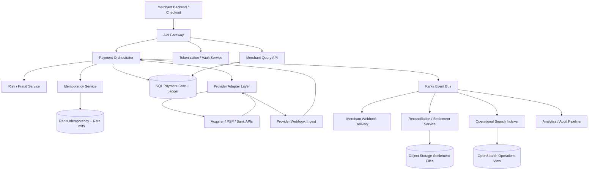
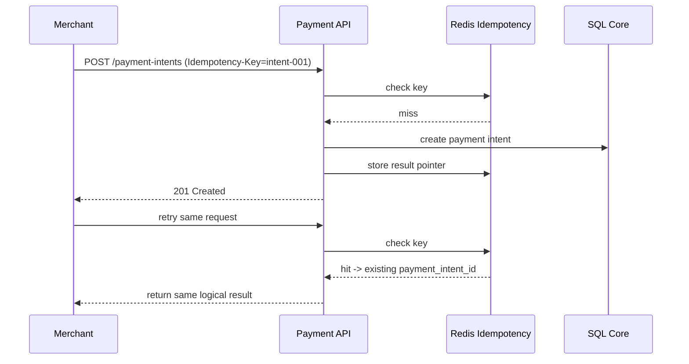
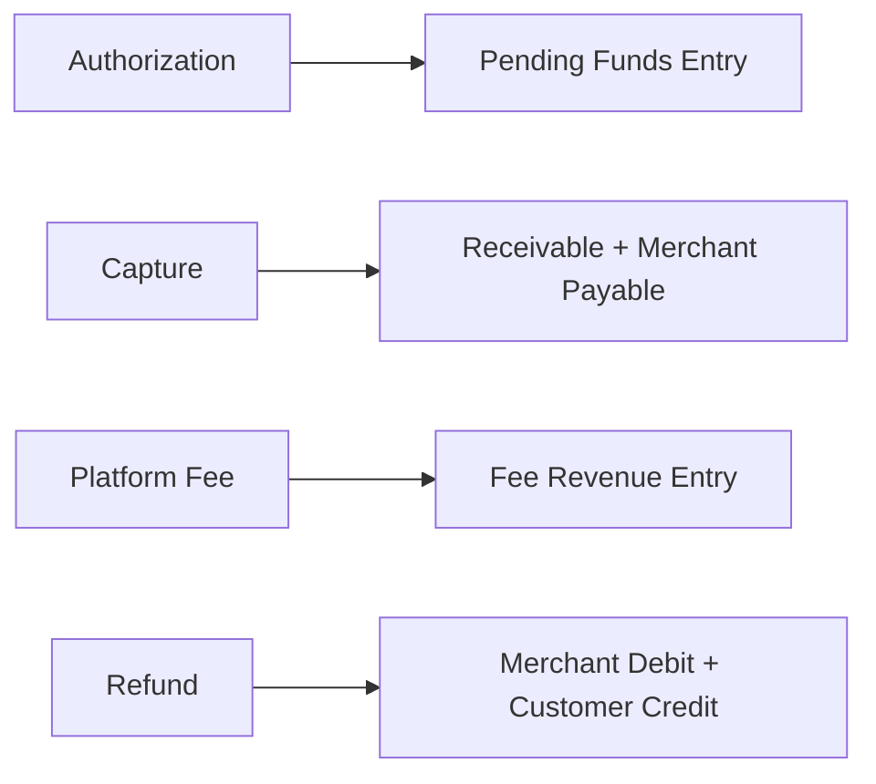
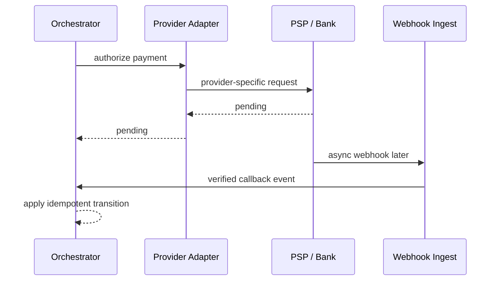
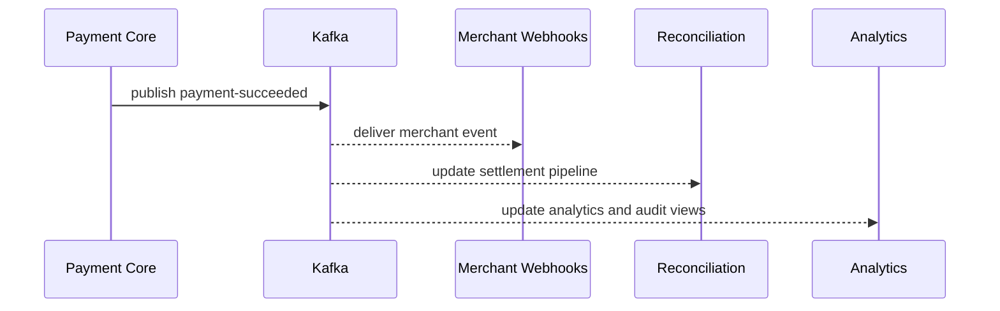
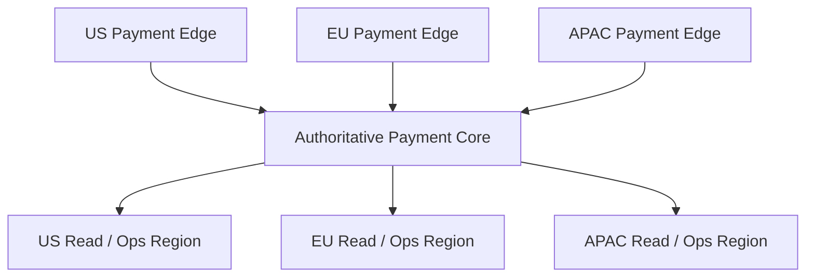

# Design Payment System

Designing a payment system is a classic system design interview problem because it combines correctness-critical money movement with low-latency APIs, external provider integrations, regulatory boundaries, fraud controls, and durable ledgers. Merchants want a simple API that can authorize, capture, refund, and reconcile payments reliably. Customers want checkout to feel instant and trustworthy. The difficult part is that the payment platform does not control the whole transaction. Banks, card networks, acquirers, wallets, fraud systems, and merchant callbacks all participate asynchronously.

At a high level, the system has three very different workloads. The first is the **payment acceptance path**, where merchants create payment intents, confirm payment methods, and receive an immediate success, failure, or pending state. The second is the **money-state path**, where authorizations, captures, refunds, disputes, and settlements update the internal source of truth and merchant balances. The third is the **asynchronous integration path**, where provider webhooks, risk signals, receipts, analytics, and reconciliation jobs arrive later and must not corrupt the core ledger. A good design keeps money-state transitions strongly consistent, makes every write idempotent, and pushes non-critical fanout off the synchronous checkout path.

---

## Functional Requirements

**In Scope:**
- Merchants can create payment intents for one-time purchases with amount, currency, and metadata
- The platform supports card payments and can be extended to wallets, bank transfers, and alternative payment methods
- Merchants can confirm payments, capture authorized funds, cancel authorizations, and issue refunds
- The system stores payment methods as tokens and never requires merchants to persist raw card details
- The platform exposes payment, refund, and payout status through APIs and merchant webhooks
- Operators can inspect failed payments, webhook lag, provider outages, settlement mismatches, and fraud spikes
- The system maintains an internal ledger for money movement and merchant balances
- The platform supports idempotent retries from merchants and payment providers

**Out of Scope:**
- Full core-banking internals for card networks or issuing banks
- Detailed PCI certification workflow documentation and legal audit processes
- Full dispute-management tooling beyond recording dispute events and status
- Consumer-facing wallet social features or peer-to-peer payment products in depth
- In-depth tax invoicing and accounting product workflows beyond essential settlement records

---

## Non-Functional Requirements

| Property | Target | Reasoning |
|---|---|---|
| **Checkout Latency** | p99 < 300ms before provider round-trips for intent creation and confirmation orchestration | merchants need payment APIs to feel responsive during checkout |
| **Correctness** | no double charge, double capture, or inconsistent ledger transitions under retries | money movement errors are expensive and trust-destroying |
| **Durability** | no loss of payment intents, ledger entries, provider callbacks, or refund state | payments must survive crashes and delayed asynchronous events |
| **Availability** | 99.99% for core payment APIs with graceful degradation during provider issues | merchants depend on the API for revenue generation |
| **Idempotency** | repeated client or provider retries must converge to the same logical result | retries are unavoidable on unreliable networks |
| **Auditability** | all money-state transitions must be traceable and replayable | finance and support teams need defensible histories |
| **Scalability** | millions of payment attempts/day with merchant skew and campaign spikes | a few large merchants can dominate platform traffic |
| **Isolation** | one noisy merchant or failing provider should not degrade the rest of the platform | payment platforms are inherently multi-tenant and integration-heavy |

**Key tradeoff:** the platform prioritizes **strongly consistent internal money state** and **idempotent API behavior** over aggressively optimistic low-latency shortcuts. Checkout must be fast, but ledger correctness and duplicate-prevention matter more than shaving a few milliseconds from an unsafe path.

---

## Capacity Estimation

**Merchant and payment assumptions:**
- Assume **100K active merchants** on the platform, with a small number of large merchants generating most traffic
- Assume **50M payment attempts/day** across cards, wallets, and bank methods
- That is about **580 payment attempts/sec average**, but major sales or regional traffic peaks can easily push **10x to 20x higher**

**Money-state assumptions:**
- Each payment can create multiple state transitions such as `intent_created`, `authorized`, `captured`, `failed`, `refunded`, or `chargeback_opened`
- Refunds, partial captures, retries, and late provider callbacks increase write amplification significantly beyond the number of original payment attempts
- The internal ledger may write several durable rows for each logical customer action because debit, credit, fee, and settlement entries are modeled separately

**Webhook and callback assumptions:**
- Provider webhooks and merchant webhooks are both asynchronous and retry-heavy
- A single payment may generate several provider callbacks over minutes or days depending on method and settlement flow
- Merchant webhook delivery load can rival core API load for large customers with detailed event subscriptions

**Operational profile:**
- Traffic is highly skewed by merchant size, geography, and campaign timing
- Provider outages or bank-side latency spikes can suddenly convert many synchronous payment flows into pending states and callback-heavy recovery workflows
- Reconciliation jobs and settlement file ingestion create batch workloads separate from live checkout traffic

---

## Core Entities

| Entity | Purpose | Key Fields | Relationships |
|---|---|---|---|
| **Merchant** | Payment platform tenant | `merchant_id`, `name`, `status`, `default_settlement_account` | owns payment intents, customers, balances, and webhooks |
| **Customer** | End-user payer known to merchant | `customer_id`, `merchant_id`, `email`, `default_payment_method` | linked to payments and tokenized methods |
| **PaymentMethodToken** | Tokenized payment credential | `token_id`, `merchant_id`, `provider_token_ref`, `type`, `last4`, `status` | used by payment intents without exposing raw PAN |
| **PaymentIntent** | Merchant-visible payment lifecycle object | `payment_intent_id`, `merchant_id`, `amount`, `currency`, `status`, `idempotency_key` | becomes authorization, capture, or failure events |
| **Charge / Authorization** | Provider-side attempt to reserve funds | `charge_id`, `payment_intent_id`, `provider`, `provider_ref`, `status`, `authorized_amount` | belongs to one payment intent |
| **Capture** | Funds capture against an authorization | `capture_id`, `charge_id`, `amount`, `status`, `captured_at` | may be partial or full |
| **Refund** | Reversal back to payer | `refund_id`, `payment_intent_id`, `amount`, `status`, `provider_ref` | tied to one captured payment |
| **LedgerEntry** | Internal money-state record | `entry_id`, `merchant_id`, `payment_intent_id`, `account_code`, `direction`, `amount` | multiple entries per business event |
| **SettlementBatch** | Provider or bank settlement record | `settlement_id`, `provider`, `window_start`, `window_end`, `status` | reconciles captures, fees, and merchant payouts |
| **WebhookDelivery** | Outbound merchant event attempt | `delivery_id`, `merchant_id`, `event_type`, `destination`, `status`, `next_retry_at` | tracks platform-to-merchant event delivery |

**Critical modeling decisions:**
- `PaymentIntent` is separate from provider-specific charge objects. This allows the platform to expose a stable merchant API even if the underlying provider or method changes.
- `LedgerEntry` is separate from payment status. Status is user-facing workflow state; the ledger is the accounting truth for balances and money movement.
- `WebhookDelivery` is modeled explicitly because callbacks are not best-effort notifications. They are operationally important and require retries, signatures, and observability.

---

## Databases and Database Design

### Storage Tier Decisions

| Data | Access Pattern | Engine | Why |
|---|---|---|---|
| Merchants, customers, payment intents, tokens, refunds, ledger metadata, webhooks | transactional writes, exact reads, strong consistency | **PostgreSQL / MySQL** | the payment control plane and money-state transitions need ACID semantics |
| Idempotency cache, short-lived locks, provider session state, rate limits | sub-millisecond reads/writes with TTLs | **Redis** | good fit for ephemeral duplicate suppression and hot-path coordination |
| Payment event bus, provider callbacks, merchant webhook fanout, analytics | durable append-only backbone | **Kafka** | decouples synchronous payment acceptance from many asynchronous consumers |
| Ledger exports, settlement files, reconciliation artifacts | immutable files and long-term retention | **Object Storage** | settlement and export artifacts are better as durable blobs than database rows |
| Time-ordered payment event history and audit timelines | append-heavy writes, payment-scoped reads | **Cassandra / ScyllaDB** | useful for large immutable histories and support timelines |
| Search over merchant payments and operations dashboards | filter-heavy operational queries | **OpenSearch** | helps support and operations without overloading the primary payment database |

This is intentionally polyglot. A payment platform needs **strongly consistent transactional state**, **ephemeral duplicate-control helpers**, **durable event fanout**, **audit-friendly histories**, and **blob storage for settlements and exports**. One database does not serve all of those patterns efficiently.

### Schema 1 - Merchants and Payment Intents (SQL)

```sql
CREATE TABLE merchants (
  merchant_id                UUID PRIMARY KEY DEFAULT gen_random_uuid(),
  name                       VARCHAR(255) NOT NULL,
  status                     VARCHAR(16) NOT NULL,
  default_currency           VARCHAR(8) NOT NULL,
  created_at                 TIMESTAMPTZ DEFAULT NOW()
);

CREATE TABLE payment_intents (
  payment_intent_id          UUID PRIMARY KEY DEFAULT gen_random_uuid(),
  merchant_id                UUID NOT NULL REFERENCES merchants(merchant_id),
  customer_id                UUID,
  amount_cents               BIGINT NOT NULL,
  currency                   VARCHAR(8) NOT NULL,
  status                     VARCHAR(24) NOT NULL,
  idempotency_key            TEXT NOT NULL,
  metadata_json              JSONB NOT NULL DEFAULT '{}'::jsonb,
  created_at                 TIMESTAMPTZ DEFAULT NOW(),
  UNIQUE (merchant_id, idempotency_key)
);
```

### Schema 2 - Charges, Captures, and Refunds (SQL)

```sql
CREATE TABLE charges (
  charge_id                  UUID PRIMARY KEY DEFAULT gen_random_uuid(),
  payment_intent_id          UUID NOT NULL REFERENCES payment_intents(payment_intent_id),
  provider                   VARCHAR(32) NOT NULL,
  provider_ref               TEXT,
  authorized_amount_cents    BIGINT NOT NULL,
  status                     VARCHAR(24) NOT NULL,
  created_at                 TIMESTAMPTZ DEFAULT NOW()
);

CREATE TABLE captures (
  capture_id                 UUID PRIMARY KEY DEFAULT gen_random_uuid(),
  charge_id                  UUID NOT NULL REFERENCES charges(charge_id),
  amount_cents               BIGINT NOT NULL,
  status                     VARCHAR(24) NOT NULL,
  captured_at                TIMESTAMPTZ
);

CREATE TABLE refunds (
  refund_id                  UUID PRIMARY KEY DEFAULT gen_random_uuid(),
  payment_intent_id          UUID NOT NULL REFERENCES payment_intents(payment_intent_id),
  amount_cents               BIGINT NOT NULL,
  status                     VARCHAR(24) NOT NULL,
  provider_ref               TEXT,
  created_at                 TIMESTAMPTZ DEFAULT NOW()
);
```

### Schema 3 - Ledger Entries (SQL)

```sql
CREATE TABLE ledger_entries (
  entry_id                   UUID PRIMARY KEY DEFAULT gen_random_uuid(),
  merchant_id                UUID NOT NULL REFERENCES merchants(merchant_id),
  payment_intent_id          UUID,
  account_code               VARCHAR(64) NOT NULL,
  direction                  VARCHAR(8) NOT NULL,
  amount_cents               BIGINT NOT NULL,
  currency                   VARCHAR(8) NOT NULL,
  reference_type             VARCHAR(32) NOT NULL,
  reference_id               UUID,
  created_at                 TIMESTAMPTZ DEFAULT NOW()
);
```

### Schema 4 - Payment Event Timeline (Cassandra)

```sql
CREATE TABLE payment_events_by_intent (
  payment_intent_id          UUID,
  bucket_day                 TEXT,
  created_at                 TIMESTAMP,
  event_id                   UUID,
  event_type                 TEXT,
  actor_type                 TEXT,
  payload_json               TEXT,
  PRIMARY KEY ((payment_intent_id, bucket_day), created_at, event_id)
) WITH CLUSTERING ORDER BY (created_at DESC, event_id DESC);
```

Daily buckets keep very active payment histories bounded and replay-friendly.

### Schema 5 - Settlement Manifest (Object Storage JSON)

```json
{
  "settlement_id": "set_123",
  "provider": "stripe",
  "window_start": "2026-06-03T00:00:00Z",
  "window_end": "2026-06-03T23:59:59Z",
  "files": [
    "s3://payments-settlements/stripe/2026-06-03/report-001.csv"
  ],
  "expected_gross_cents": 9204400,
  "expected_fee_cents": 142300
}
```

### Schema 6 - Idempotency Record (Logical Redis Record)

```json
{
  "key": "idem:merchant_123:create_payment:intent-001",
  "value": {
    "payment_intent_id": "pi_456",
    "status": "succeeded",
    "expires_at": "2026-06-04T10:00:00Z"
  }
}
```

### Sharding and Replication Strategy

| Store | Shard Key | Strategy | Replication |
|---|---|---|---|
| SQL payment core | `merchant_id` or merchant-region shard | logical merchant shards as volume grows | primary + replicas, tighter durability on write path |
| Redis | `merchant_id`, `idempotency_key`, `payment_intent_id` | Redis Cluster | 1 replica per master |
| Kafka | `merchant_id`, `payment_intent_id`, or provider-specific routing key | partitioned durable log | RF=3 |
| Cassandra | `(payment_intent_id, bucket_day)` | consistent hashing across nodes | RF=3, `LOCAL_QUORUM` |
| OpenSearch | merchant and date routing | replicated operational search cluster | multi-node replicas |
| Object Storage | provider/date or merchant/export namespace | immutable manifests and artifacts | multi-AZ durable storage |

**Consistency model:**
- Strong consistency for payment intent creation, authorization state transitions, captures, refunds, and ledger writes
- Durable ordered append for callbacks and downstream events once they enter Kafka
- Eventual consistency for merchant dashboards, search indexes, analytics, and webhook delivery status views
- Best-effort low-latency consistency for Redis-backed idempotency helpers and duplicate suppression caches

**Read/write patterns:**
- **Checkout path:** create or confirm payment intent -> validate merchant and idempotency -> call provider -> write authoritative state and ledger -> respond with current status
- **Callback path:** accept provider webhook -> verify signature -> apply idempotent state transition -> publish downstream events
- **Reconciliation path:** import settlement files -> compare provider totals with internal ledger and captures -> produce repair or investigation tasks

---

## API Design

**Create a payment intent:**
```http
POST /v1/payment-intents
Authorization: Bearer <merchant-secret>
Idempotency-Key: intent-001

{
  "amount_cents": 4999,
  "currency": "USD",
  "customer_id": "cus_123",
  "metadata": {
    "order_id": "ord_789"
  }
}

201 Created
{
  "payment_intent_id": "pi_456",
  "status": "requires_payment_method",
  "amount_cents": 4999,
  "currency": "USD"
}
```

**Confirm a payment intent:**
```http
POST /v1/payment-intents/pi_456/confirm
Authorization: Bearer <merchant-secret>
Idempotency-Key: confirm-001

{
  "payment_method_token": "pm_tok_123",
  "capture_method": "automatic"
}

200 OK
{
  "payment_intent_id": "pi_456",
  "status": "succeeded",
  "charge_id": "ch_999"
}
```

**Capture an authorization:**
```http
POST /v1/charges/ch_999/capture
Authorization: Bearer <merchant-secret>
Idempotency-Key: capture-001

{
  "amount_cents": 4999
}

200 OK
{
  "capture_id": "cap_333",
  "status": "captured"
}
```

**Create a refund:**
```http
POST /v1/refunds
Authorization: Bearer <merchant-secret>
Idempotency-Key: refund-001

{
  "payment_intent_id": "pi_456",
  "amount_cents": 2000,
  "reason": "requested_by_customer"
}

201 Created
{
  "refund_id": "rf_222",
  "status": "pending"
}
```

**Handle provider webhook:**
```http
POST /v1/providers/stripe/webhook
Stripe-Signature: t=1717400000,v1=abcdef123456

{
  "type": "payment_intent.succeeded",
  "data": {
    "object": {
      "id": "prov_pi_abc",
      "metadata": {
        "payment_intent_id": "pi_456"
      }
    }
  }
}

202 Accepted
```

**Fetch merchant payments (cursor-paginated):**
```http
GET /v1/payment-intents?created_before=2026-06-03T10:00:00Z&limit=50
Authorization: Bearer <merchant-secret>

200 OK
{
  "payment_intents": [
    {
      "payment_intent_id": "pi_456",
      "status": "succeeded",
      "amount_cents": 4999,
      "currency": "USD"
    }
  ],
  "next_cursor": "2026-06-03T09:55:00Z",
  "has_more": true
}
```

> Cursor-based pagination on creation time is preferred. Offset pagination (`?page=N`) becomes unstable and expensive for large merchant histories and continuously arriving payment events.

**Merchant event stream (optional SSE):**
```http
GET /v1/merchant-events/stream
Authorization: Bearer <merchant-secret>
Accept: text/event-stream
```
The core payment platform does not require WebSockets for standard merchant workflows. REST handles checkout, refunds, configuration, and history reads. Webhooks are the primary asynchronous integration mechanism, and SSE can be enough for lightweight live operational views.

---

## High-Level Design



**Component responsibilities:**

| Component | Role |
|---|---|
| **API Gateway** | Authentication, rate limiting, request validation, and merchant routing |
| **Payment Orchestrator** | Owns payment intent lifecycle, provider calls, and authoritative state transitions |
| **Tokenization / Vault Service** | Stores or references secure payment method tokens without exposing raw card data |
| **Risk / Fraud Service** | Scores transactions, applies rules, and can require additional verification or block attempts |
| **Idempotency Service** | Prevents duplicate creates, confirms, captures, and refunds under retries |
| **SQL Payment Core + Ledger** | Source of truth for payment status, charges, captures, refunds, and accounting entries |
| **Provider Adapter Layer** | Normalizes different PSP, acquirer, and bank APIs behind one internal interface |
| **Provider Webhook Ingest** | Verifies webhook signatures, records events, and routes callbacks into the core state machine |
| **Kafka** | Durable fanout for merchant webhooks, reconciliation, search, and analytics |
| **Merchant Webhook Delivery** | Sends signed event notifications to merchants with retries and observability |
| **Reconciliation / Settlement Service** | Compares provider settlement data with internal captures and ledger balances |
| **Redis** | Holds idempotency records, short-lived locks, and rate limits |

**Payment flow:**
1. Merchant creates or confirms a payment intent through the API Gateway
2. Payment Orchestrator validates merchant state, idempotency, risk rules, and the payment method token
3. The provider adapter calls the chosen PSP or acquirer and receives an authorization, success, failure, or pending response
4. The orchestrator writes the authoritative payment state and matching ledger entries transactionally in the SQL core
5. Kafka publishes downstream events for merchant webhooks, reconciliation, analytics, and operational search without blocking checkout
6. Later provider callbacks or settlement files update the payment lifecycle through the same idempotent state machine rather than bypassing it

---

## Deep Dives

### 1. Idempotency: Required for Safety, Not Just Convenience

The first hard problem in a payment system is duplicate handling. Merchants retry when a network call times out. Load balancers retry. Mobile clients retry. Providers retry callbacks. Without idempotency, one customer action can create multiple authorizations or refunds.



**Why the problem happens:** payment networks and clients are unreliable, so retries are normal rather than exceptional.

**Why it becomes difficult at scale:**
- retries can arrive from several layers at once
- provider callbacks may repeat or arrive out of order
- partial failures can leave uncertainty about whether the provider actually processed the request

**Production-grade solutions:**
- require merchant-provided idempotency keys on all unsafe payment mutations
- enforce uniqueness in the SQL core and use Redis as a fast helper rather than the only protection
- key provider callbacks by stable provider references and event ids
- return the previous logical result on duplicate requests instead of creating new side effects

**Tradeoffs:** idempotency adds storage and lookup overhead, but it is foundational for payment safety and merchant trust.

### 2. Ledger: Status Is Not the Same as Money Truth

A payment API can expose statuses like `processing`, `succeeded`, or `refunded`, but a payment platform cannot rely on those statuses alone for financial correctness. The internal ledger is the accounting truth that represents what the platform believes happened to money, fees, reserves, and merchant balances.



**Why the problem happens:** business workflow state and accounting state evolve together but are not identical.

**Why it becomes difficult at scale:**
- partial captures and partial refunds create non-trivial money movement paths
- provider-side finality can lag behind merchant-visible states
- reconciliation requires durable, immutable financial records, not mutable status fields only

**Production-grade solutions:**
- model ledger entries as append-only records with explicit account codes and directions
- write ledger transitions atomically with payment-state changes in the SQL core
- keep derived dashboards and payout views downstream of the ledger, not the other way around
- reconcile provider settlements against ledger aggregates and capture records regularly

**Tradeoffs:** a real ledger increases complexity, but without it refunds, settlements, and finance audits become fragile and hard to defend.

### 3. Provider Adapters and Webhooks: External Systems Are Slow and Messy

Payment platforms depend on external providers with different API semantics, latency profiles, and callback behaviors. Some methods are synchronous and complete within the checkout request. Others enter `pending` and complete minutes later. The platform must normalize those differences without leaking provider quirks into the merchant API.



**Why the problem happens:** the payment platform is orchestrating systems it does not control.

**Why it becomes difficult at scale:**
- callbacks arrive duplicated, delayed, or out of order
- different providers expose different identifiers and lifecycle states
- a provider outage can affect only one method or region but still create merchant-visible confusion

**Production-grade solutions:**
- hide PSP-specific APIs behind an internal provider adapter layer
- verify webhook signatures and persist webhook events before applying state changes
- map provider states into a stable internal payment state machine
- support provider failover or routing policies when multiple processors are available

**Tradeoffs:** normalization reduces merchant complexity, but the platform has to absorb a large amount of provider-specific edge-case logic.

### 4. Kafka: Valuable, but Keep It Off the Money Decision Path

Kafka is very useful in a payment system, but it should not decide whether a payment succeeded. The authoritative answer belongs in the transactional SQL core and ledger. Kafka becomes valuable immediately after commit for merchant webhooks, analytics, risk feedback loops, operational dashboards, and reconciliation workflows.



**Why the problem happens:** one payment transition creates many downstream side effects with different SLAs.

**Why it becomes difficult at scale:**
- merchant webhook endpoints may be slow or broken
- finance and reconciliation jobs are batchy and can lag safely
- analytics and risk models need replay and long-term history

**Production-grade solutions:**
- publish immutable domain events only after the SQL commit succeeds
- partition Kafka by `merchant_id` or `payment_intent_id` depending on ordering needs
- keep webhook delivery, analytics, and reconciliation fully off the synchronous checkout path
- support replay and dead-letter handling for downstream consumers

**Tradeoffs:** Kafka improves resilience and decoupling, but it must remain downstream of the source-of-truth money state.

### 5. Redis: Good for Duplicate Suppression, Bad for Financial Truth

Redis is helpful for idempotency lookups, short-lived workflow coordination, and rate limiting, but it should never be the only source of truth for whether money moved. Losing Redis should degrade performance, not destroy payment correctness.

| Redis Use | Example Key | Why Redis Fits |
|---|---|---|
| **Idempotency helper** | `idem:merchant_123:create_payment:intent-001` | fast duplicate lookup on hot retry paths |
| **Short-lived lock** | `lock:pi_456:confirm` | prevents concurrent conflicting actions briefly |
| **Rate limiting** | `rl:merchant:merchant_123:confirm` | protects hot endpoints from abuse or bugs |
| **Provider session state** | `provider_session:3ds:pi_456` | ephemeral multi-step authentication state with TTL |

**Why the problem happens:** the payment hot path needs fast checks around duplicate requests and ephemeral state.

**Why it becomes difficult at scale:**
- idempotency keys can become hot during merchant retry storms
- stale locks can block checkout if TTLs are not designed carefully
- teams may be tempted to treat Redis hits as definitive truth even when SQL disagrees

**Production-grade solutions:**
- keep SQL uniqueness and state-machine checks as the hard correctness barrier
- use Redis only as an accelerator and short-lived coordination layer
- ensure lock TTLs are short and combined with database verification
- design payment recovery to rebuild correctness from durable state rather than cache state

**Tradeoffs:** Redis reduces latency on the hot path, but relying on it too heavily creates subtle failure modes around money-state correctness.

### 6. Webhooks: Merchant Delivery Is a Product Surface, Not a Side Note

For many merchants, webhooks are how they learn that a payment succeeded, failed, or was refunded. That means webhook delivery is not a minor operational concern. It is part of the product contract. The platform must sign events, retry safely, preserve ordering where possible, and expose delivery history.

**Why the problem happens:** merchants often build their fulfillment systems around asynchronous payment events.

**Why it becomes difficult at scale:**
- merchant endpoints can be slow, misconfigured, or temporarily unavailable
- duplicate or reordered event delivery can break merchant-side workflows if not documented and tracked properly
- webhook fanout can spike during provider outages or large batch state changes

**Production-grade solutions:**
- persist outbound webhook events before delivery attempts
- sign events and let merchants verify authenticity
- retry with backoff and expose delivery history plus manual redrive controls
- encourage merchants to treat webhooks idempotently and fetch canonical payment state if needed

**Tradeoffs:** robust webhooks improve integration reliability, but they add delivery queues, observability, and product-surface complexity.

### 7. Settlement and Reconciliation: Money Finality Arrives Later

A merchant-visible `succeeded` payment does not necessarily mean the platform has already reconciled final money movement from the provider. Settlement batches, fees, chargebacks, and payout timing can all arrive later. Payment platforms must reconcile their internal view with provider reports continuously.

**Why the problem happens:** customer checkout is immediate, but banking and processor finality is delayed and batch-oriented.

**Why it becomes difficult at scale:**
- provider reports can be delayed, partial, or corrected later
- partial captures, fees, and refunds complicate matching logic
- missing settlement lines may indicate real money risk rather than just dashboard inconsistency

**Production-grade solutions:**
- ingest settlement files into durable storage and compare them with internal captures and ledger aggregates
- create explicit reconciliation jobs and exception queues for mismatches
- keep payout eligibility downstream of reconciled balances when the business requires it
- preserve immutable evidence for finance and support investigations

**Tradeoffs:** reconciliation adds batch complexity and operational overhead, but skipping it leaves the platform blind to real financial discrepancies.

### 8. WebSockets: Usually Optional for Core Payments

Most payment system workflows are request-response plus webhooks. Merchants create intents, confirm them, poll status if needed, and receive asynchronous callbacks. Some operator dashboards may benefit from live streams, but the core system does not need WebSockets.

**Why the problem happens:** payments feel real time to end users even though most integrations are not socket-driven.

**Why it becomes difficult at scale:**
- persistent sockets add statefulness without helping standard merchant flows much
- merchants usually already integrate through server-to-server callbacks and REST APIs
- payment events often arrive asynchronously from providers anyway

**Production-grade solutions:**
- keep the merchant contract centered on REST plus webhooks
- use SSE or internal live dashboards for operational views if needed
- reserve WebSockets for special realtime consoles rather than the default payment architecture
- design APIs so polling and callbacks are enough for the main lifecycle

**Tradeoffs:** avoiding WebSockets simplifies the platform and integration model, but some internal ops experiences may be slightly less immediate.

### 9. Multi-Region Serving and Write Authority

Payment APIs should be globally reachable and low latency, but money-state writes need a clear authority. Active-active writes without careful partitioning can create duplicate charges or inconsistent ledger transitions. Most practical designs use regional edges with a tighter authoritative write domain per merchant shard or region.



**Why the problem happens:** merchants want global low latency, but payment correctness requires tightly controlled writes.

**Why it becomes difficult at scale:**
- cross-region retries and failovers can duplicate unsafe operations if idempotency is weak
- providers often have region-specific behavior, latency, and compliance constraints
- ledger and settlement systems are much less forgiving of split-brain states than consumer social products

**Production-grade solutions:**
- terminate API traffic regionally close to merchants, but route unsafe writes to the authoritative shard for that merchant or region
- replicate read models and operational dashboards more broadly than money-state write ownership
- use strong idempotency keys and provider references across failovers
- keep compliance, residency, and provider connectivity policies explicit per region

**Tradeoffs:** global edges improve merchant latency, but the core money-write path still needs a single authoritative source to remain safe.

### 10. Architecture Evolution

| Stage | Design | Why It Breaks | Next Step |
|---|---|---|---|
| **1. MVP** | Single database, one provider integration, basic create-and-charge API | retries, refunds, and callbacks quickly create duplicate and accounting issues | add payment intents, idempotency, and a real ledger |
| **2. Growth** | Separate orchestrator, token service, webhooks, and Kafka fanout | provider differences, settlement mismatches, and merchant scale strain shared components | add reconciliation, better provider adapters, and tenant isolation |
| **3. Scale** | Multi-provider routing, ledger-backed balances, reconciliation pipeline, and ops search | hot merchants, regional complexity, and compliance dominate operations | regionalize edges, shard merchants, and harden failover and replay |
| **4. Mature Payment Platform** | Strong payment core, multiple providers, settlement controls, and extensive observability | the hard problems shift to cost, compliance, and product breadth | keep money-state logic small and evolve derived systems independently |

This is the interview pattern to emphasize: expose a stable payment-intent API, make every mutation idempotent, keep the ledger and payment core strongly consistent, hide provider-specific complexity behind adapters, and use Kafka, Redis, webhooks, and reconciliation pipelines to scale everything around that correctness-critical center.
