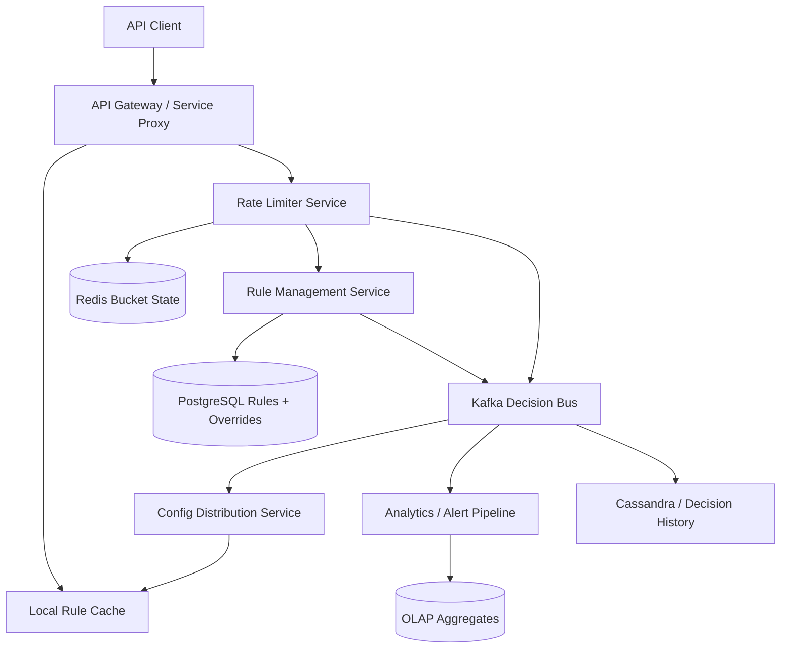
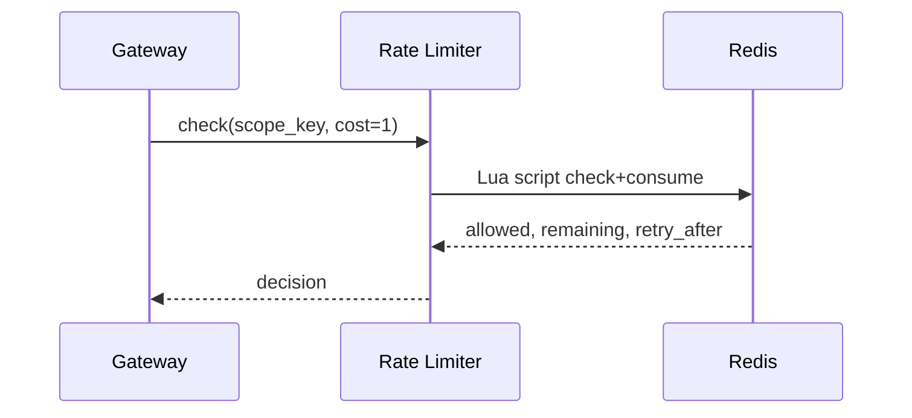
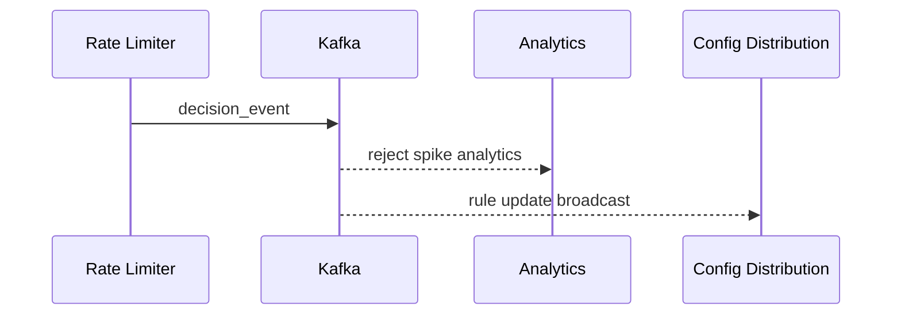
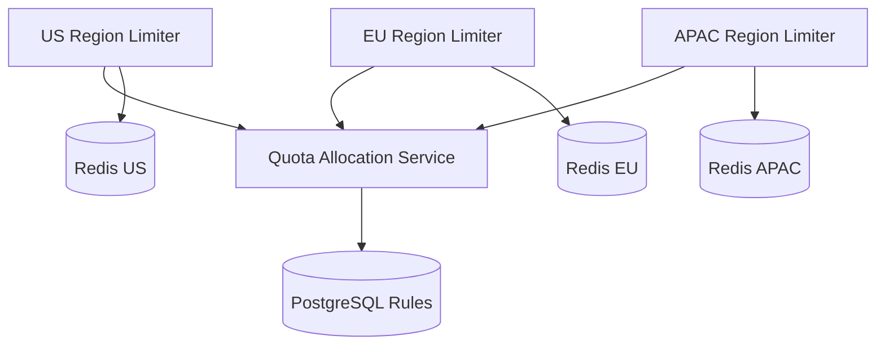

# Design Rate Limiter

Designing a rate limiter is a classic system design interview problem because it looks deceptively simple while sitting directly on the critical path of many large systems. API gateways, login endpoints, payment services, webhook receivers, and internal microservices all need protection against abuse, noisy neighbors, accidental traffic spikes, and cascading failures. A weak rate limiter either lets overload through or blocks legitimate traffic. A strong one has to be fast, distributed, configurable, and precise enough for the product’s needs.

At a high level, the system has two very different workloads. The first is the **enforcement path**, where every request must be evaluated quickly against one or more limits such as per-user, per-IP, per-API-key, or per-tenant quotas. The second is the **control and analytics path**, where operators define rules, inspect rejected traffic, tune policies, and analyze hot keys, abuse, or tenant fairness. A good design keeps enforcement extremely small and predictable, then moves reporting, dashboards, and rule-distribution side effects into asynchronous systems.

---

## Functional Requirements

**In Scope:**
- Clients can check whether a request is allowed under one or more configured limits
- The system supports limits scoped by IP, API key, user, tenant, route, or service
- The platform supports common algorithms such as token bucket, fixed window, and sliding window counters
- Burst handling is supported, not just flat requests-per-second limits
- The service returns metadata such as remaining quota and reset hints
- Rules can be created, updated, paused, or deleted without restarting the fleet
- Operators can inspect rate-limit decisions, hot keys, rejected requests, and rule effectiveness
- The system supports multi-region deployment and partial-failure behavior with explicit degradation modes

**Out of Scope:**
- Full WAF or bot-detection implementation
- Rich billing and monetization for quota-based product plans
- Identity verification, auth policy, or fraud-scoring internals
- Complex per-request authorization logic unrelated to throttling
- Full distributed traffic-shaping or network-level DDoS mitigation appliances

---

## Non-Functional Requirements

| Property | Target | Reasoning |
|---|---|---|
| **Decision Latency** | p99 < 5ms inside one region | the rate limiter sits directly on the request path of other services |
| **Availability** | 99.99% for read/check operations | if the limiter is down, many upstream systems either fail open or fail closed badly |
| **Consistency** | atomic enough per key to prevent meaningful quota bypass under concurrency | race conditions on hot keys undermine the whole purpose of the service |
| **Scalability** | millions of checks/sec across many distinct keys | gateways and edge services can generate enormous request volume |
| **Configurability** | rule updates visible within seconds | operators need to react quickly to abuse or incident response needs |
| **Durability** | no loss of rule definitions or audit-relevant decision logs | policies and audit trails matter for operations and customer support |
| **Isolation** | hot keys or abusive tenants must not degrade unrelated traffic | one attack or burst should not collapse the whole limiter |
| **Predictability** | deterministic behavior around retries, clocks, and burst windows | confusing limits are almost as harmful as broken ones |

**Key tradeoff:** the platform prioritizes **fast local decisions with bounded approximation** over perfectly synchronized global counters on every request. Exact global consistency across all regions is too expensive for the hot path, so most real systems combine atomic per-shard enforcement with periodic reconciliation or regional quotas.

---

## Capacity Estimation

**Traffic assumptions:**
- Assume the limiter protects a large API fleet receiving **10M requests/sec** at peak
- Not every request needs a unique counter, but every request typically needs at least one rate-limit decision
- A single external API call may require several limit checks such as per-IP, per-user, and per-route rules

**Key cardinality:**
- Daily active identities can easily reach **100M+** distinct rate-limit keys across users, tenants, IPs, or API keys
- The long tail is large, but hot keys dominate risk: one abusive key or one large tenant can generate extreme skew
- Key distribution is therefore highly uneven, and hotspot isolation matters more than average QPS math

**Write pattern:**
- Every allow or reject decision usually increments or updates some limiter state
- Even with aggregation or local caches, the backing system must sustain very high write volume for hot identities and routes
- TTL-backed state helps because many keys naturally expire after their enforcement window ends

**Storage volume:**
- Rule definitions are small, but counter state can be large because of key cardinality and time buckets
- Audit logs and analytics histories grow much faster than active rule metadata

**Operational profile:**
- Attack traffic, retries, and webhook storms create short-lived bursts that can dwarf steady-state averages
- Incident response often requires rapid rule rollout or emergency limit overrides within seconds

---

## Core Entities

| Entity | Purpose | Key Fields | Relationships |
|---|---|---|---|
| **RateLimitRule** | Declarative policy definition | `rule_id`, `scope_type`, `scope_selector`, `algorithm`, `capacity`, `window_ms`, `status` | applies to many runtime keys |
| **LimitScope** | Derived enforcement identity | `scope_type`, `scope_value`, `route_id`, `tenant_id` | generated from request attributes |
| **BucketState** | Runtime limiter state | `bucket_key`, `tokens_remaining`, `last_refill_at`, `expires_at`, `version` | belongs to one derived scope and one rule |
| **DecisionRecord** | One allow or reject outcome | `decision_id`, `rule_id`, `bucket_key`, `allowed`, `remaining`, `created_at` | emitted from enforcement path |
| **QuotaAllocation** | Regional or shard-local sub-quota | `allocation_id`, `rule_id`, `region`, `granted_capacity`, `expires_at` | reduces need for global synchronization |
| **OverridePolicy** | Temporary emergency exception | `override_id`, `target_scope`, `action`, `expires_at` | supersedes normal rule evaluation |
| **AdminChangeEvent** | Rule or override mutation | `event_id`, `entity_type`, `entity_id`, `change_type`, `created_at` | used for cache refresh and audit |
| **DecisionAggregate** | Time-bucketed analytics row | `bucket_start`, `rule_id`, `allowed_count`, `rejected_count`, `hot_scope_count` | derived from raw decisions |

**Critical modeling decisions:**
- `BucketState` is ephemeral runtime state, not permanent business data. It belongs in a fast TTL-friendly store.
- `QuotaAllocation` is distinct from raw bucket state because multi-region and multi-shard systems often need delegated quotas to avoid one globally serialized write on every request.
- `OverridePolicy` is first-class because operators often need emergency fail-open, fail-closed, or bypass rules during incidents.

---

## Databases and Database Design

### Storage Tier Decisions

| Data | Access Pattern | Engine | Why |
|---|---|---|---|
| Rule definitions, overrides, audit metadata | low-volume transactional writes, exact reads | **PostgreSQL** | configuration and admin workflows fit relational storage well |
| Hot bucket state, counters, token buckets, short-lived allocations | extremely high read/write volume, TTLs, atomic mutations | **Redis** | ideal for atomic scripts, counters, and expiring runtime state |
| Decision logs and analytics fanout | durable append-only stream | **Kafka** | decouples the hot path from analytics, alerts, and audit consumers |
| Long-lived decision history and aggregates | append-heavy writes, time-based reporting | **ClickHouse / OLAP store** | dashboards and hot-key reports are aggregation-heavy |
| Optional operational history by scope or rule | time-ordered reads, wide rows | **Cassandra / ScyllaDB** | useful for longer operational timelines at scale |

This is intentionally polyglot. A rate limiter needs **small exact config storage**, **extremely fast atomic counter state**, and **large asynchronous observability pipelines**. One database is not a practical fit for all of those patterns.

### Schema 1 - Rule Definitions (PostgreSQL)

```sql
CREATE TABLE rate_limit_rules (
	rule_id                  UUID PRIMARY KEY DEFAULT gen_random_uuid(),
	scope_type               VARCHAR(32) NOT NULL,
	scope_selector           JSONB NOT NULL,
	algorithm                VARCHAR(32) NOT NULL,
	capacity                 BIGINT NOT NULL,
	refill_rate_per_sec      BIGINT,
	window_ms                BIGINT,
	status                   VARCHAR(16) NOT NULL,
	created_at               TIMESTAMPTZ DEFAULT NOW(),
	updated_at               TIMESTAMPTZ DEFAULT NOW()
);

CREATE INDEX idx_rate_limit_rules_scope_status
	ON rate_limit_rules (scope_type, status);
```

### Schema 2 - Overrides and Emergency Policies (PostgreSQL)

```sql
CREATE TABLE override_policies (
	override_id              UUID PRIMARY KEY DEFAULT gen_random_uuid(),
	target_scope             JSONB NOT NULL,
	action                   VARCHAR(16) NOT NULL,
	reason                   TEXT,
	expires_at               TIMESTAMPTZ,
	created_at               TIMESTAMPTZ DEFAULT NOW()
);
```

### Schema 3 - Token Bucket State (Logical Redis Record)

```json
{
	"key": "rl:rule_123:user:usr_456:/v1/payments",
	"value": {
		"tokens_remaining": 12,
		"last_refill_at_ms": 1717408800000,
		"expires_at_ms": 1717409100000,
		"version": 42
	}
}
```

In production this state is usually updated atomically through a Lua script or Redis function so check-and-consume happens in one round trip.

### Schema 4 - Sliding Window Buckets (Logical Redis Record)

```json
{
	"key": "sw:rule_789:tenant:tenant_9:2026-06-03T10:00",
	"value": {
		"count": 847,
		"window_ms": 60000,
		"expires_in_sec": 120
	}
}
```

### Schema 5 - Decision Event (Logical Kafka Payload)

```json
{
	"decision_id": "dec_111",
	"rule_id": "rule_123",
	"bucket_key": "rl:rule_123:user:usr_456:/v1/payments",
	"allowed": true,
	"remaining": 12,
	"latency_us": 820,
	"created_at": "2026-06-03T10:00:00Z"
}
```

### Schema 6 - Operational Aggregate (ClickHouse)

```sql
CREATE TABLE rate_limit_decision_agg_minute (
	bucket_start             DateTime,
	rule_id                  String,
	route_id                 String,
	region                   String,
	allowed_count            UInt64,
	rejected_count           UInt64,
	p99_latency_us           UInt64,
	unique_scope_count       UInt64
) ENGINE = MergeTree
PARTITION BY toDate(bucket_start)
ORDER BY (rule_id, route_id, region, bucket_start);
```

### Sharding and Replication Strategy

| Store | Shard Key | Strategy | Replication |
|---|---|---|---|
| PostgreSQL config | `rule_id` or tenant partition | primary + replicas; shard by tenant or control-plane domain at scale | synchronous or semi-sync replicas |
| Redis bucket state | hash of `bucket_key` | Redis Cluster with script-based atomic updates | 1 replica per master |
| Kafka | `rule_id`, `region`, or `bucket_key` depending on topic | partitioned durable log | RF=3 |
| Cassandra / OLAP | time bucket + rule or scope dimensions | distributed partitions | RF=3 or replicated analytical shards |

**Consistency model:**
- Strong enough atomicity per bucket key to avoid race-condition bypasses under concurrency
- Eventual consistency for analytics, dashboards, alerts, and some rule cache propagation
- Region-local correctness with bounded approximation for globally shared quotas unless explicit global serialization is required

**Read/write patterns:**
- **Enforcement path:** request -> derive scope key -> fetch rule from local cache -> run atomic Redis script -> return allow/reject
- **Control path:** admin rule update -> PostgreSQL commit -> Kafka/config broadcast -> edge or gateway cache refresh
- **Analytics path:** decision event -> Kafka -> OLAP aggregates and hotspot reports

---

## API Design

**Create a rate-limit rule:**
```http
POST /v1/rules
Authorization: Bearer <jwt>

{
	"scope_type": "user_route",
	"scope_selector": {
		"route_id": "/v1/payments",
		"tenant_id": "tenant_9"
	},
	"algorithm": "token_bucket",
	"capacity": 100,
	"refill_rate_per_sec": 10,
	"status": "active"
}

201 Created
{
	"rule_id": "rule_123",
	"status": "active"
}
```

**Check and consume quota:**
```http
POST /v1/check
Authorization: Bearer <internal-service-token>
Idempotency-Key: req-abc-001

{
	"scope": {
		"scope_type": "user_route",
		"scope_value": "usr_456",
		"route_id": "/v1/payments",
		"tenant_id": "tenant_9"
	},
	"cost": 1
}

200 OK
{
	"allowed": true,
	"remaining": 12,
	"retry_after_ms": 0,
	"matched_rule_id": "rule_123"
}
```

**Preview a decision without consuming quota:**
```http
POST /v1/check:peek
Authorization: Bearer <internal-service-token>

{
	"scope": {
		"scope_type": "tenant_route",
		"scope_value": "tenant_9",
		"route_id": "/v1/payments"
	}
}

200 OK
{
	"allowed": false,
	"remaining": 0,
	"retry_after_ms": 4200,
	"matched_rule_id": "rule_789"
}
```

**Create an override policy:**
```http
POST /v1/overrides
Authorization: Bearer <jwt>

{
	"target_scope": {
		"scope_type": "tenant",
		"scope_value": "tenant_9"
	},
	"action": "bypass",
	"reason": "incident mitigation",
	"expires_at": "2026-06-03T12:00:00Z"
}

201 Created
{
	"override_id": "ovr_555",
	"status": "active"
}
```

**List hot rules or scopes:**
```http
GET /v1/analytics/hot-keys?from=2026-06-03T09:00:00Z&to=2026-06-03T10:00:00Z&limit=100
Authorization: Bearer <jwt>

200 OK
{
	"rows": [
		{
			"rule_id": "rule_123",
			"bucket_key": "rl:rule_123:user:usr_456:/v1/payments",
			"rejected_count": 9831
		}
	]
}
```

**Rule update stream (optional SSE):**
```http
GET /v1/rules/stream
Authorization: Bearer <jwt>
Accept: text/event-stream
```
The core rate-limiting path does not require WebSockets. Gateways and SDKs usually fetch cached rules and refresh them via polling, SSE, or internal config streams.

---

## High-Level Design



**Component responsibilities:**

| Component | Role |
|---|---|
| **API Gateway / Service Proxy** | Calls the limiter or embeds a local client before forwarding protected requests |
| **Local Rule Cache** | Holds recently fetched rules and overrides to avoid repeated control-plane lookups |
| **Rate Limiter Service** | Derives scope keys, applies rule logic, and executes atomic counter updates |
| **Redis Bucket State** | Stores token buckets, counters, sliding windows, and short-lived allocations |
| **Rule Management Service** | CRUD for rules, overrides, and policy metadata |
| **PostgreSQL Rules + Overrides** | Source of truth for the control plane |
| **Kafka** | Durable fanout for rule changes, decision events, alerts, and analytics |
| **Config Distribution Service** | Pushes or broadcasts rule updates to caches close to gateways |
| **Analytics / Alert Pipeline** | Detects hot keys, abuse patterns, reject spikes, and fleet regressions |
| **OLAP / Decision History** | Supports dashboards, investigations, and longer-term trend analysis |

**Enforcement flow:**
1. A protected request reaches the gateway or service proxy
2. The gateway derives one or more scope keys and reads matching rules from a local cache
3. The limiter evaluates overrides first, then runs the chosen algorithm using an atomic Redis script for each relevant bucket
4. The gateway receives `allowed`, `remaining`, and `retry_after` metadata and either forwards or rejects the request
5. Decision events and rule-change side effects flow asynchronously to Kafka for analytics, alerts, and cache refresh without slowing the hot path

---

## Deep Dives

### 1. Redis: Required and Central

Redis is central to most practical rate limiters because the hot path needs extremely fast atomic mutations on ephemeral state. Token buckets, fixed windows, sliding window counters, and short-lived overrides all fit Redis well. A relational database is too slow for the enforcement path, and a purely local in-memory limiter cannot enforce shared limits across a fleet.



**Why the problem happens:** every protected request needs a fast, shared, concurrency-safe decision.

**Why it becomes difficult at scale:**
- hot keys can see extreme contention during abuse or tenant spikes
- multiple app instances must share the same effective quota view
- TTL-heavy state creates large churn in short windows

**Production-grade solutions:**
- use Redis Cluster with atomic Lua scripts or server-side functions for check-and-consume logic
- keep key state compact and TTL-bound so expired windows disappear automatically
- colocate limiter services and Redis clusters by region to minimize latency
- isolate or shard hot keys and hot tenants to avoid noisy-neighbor collapse

**Tradeoffs:** Redis gives the latency and atomicity profile the hot path needs, but it introduces hot-key management, failover, and approximation tradeoffs for global quotas.

### 2. Algorithm Choice: Token Bucket Usually Wins, but Not Always

Interview discussions often stop at naming algorithms, but the real question is which algorithm best matches product behavior. Fixed windows are simple but bursty at boundaries. Sliding logs are precise but expensive. Sliding window counters are cheaper but approximate. Token bucket handles bursts elegantly and is usually the default for API protection.

| Algorithm | Strength | Weakness | Good Fit |
|---|---|---|---|
| **Fixed Window** | simplest implementation | boundary bursts can exceed intended smoothing | coarse admin endpoints |
| **Sliding Log** | highest precision | expensive memory and write cost | low-QPS, high-precision paths |
| **Sliding Window Counter** | good compromise | approximate at bucket boundaries | many general API limits |
| **Token Bucket** | supports bursts and smooth refill | slightly more complex math/state | most API and tenant throttling |

**Why the problem happens:** different endpoints and tenants want different notions of fairness and burst tolerance.

**Why it becomes difficult at scale:**
- the same platform may protect login, payments, webhooks, and public APIs with different traffic patterns
- precision costs memory and CPU
- product semantics like `remaining` and `retry_after` must stay understandable to clients

**Production-grade solutions:**
- default to token bucket for general-purpose API throttling
- use sliding window counters where fairness near boundaries matters more than burst support
- keep algorithm choice part of the rule definition rather than hard-coding one global strategy
- document semantics clearly so product teams know what behavior they are buying

**Tradeoffs:** more precise algorithms cost more. The right limiter is the one that matches the endpoint’s risk profile, not the one with the fanciest math.

### 3. Local Fast Path Versus Centralized Enforcement

A pure centralized limiter is simple but adds network hops to every request. A pure local in-process limiter is fast but cannot enforce shared quotas across many instances. Real systems often combine both: a local fast path for cached rules or coarse burst absorption, plus a centralized Redis-backed authoritative check for shared quotas.

**Why the problem happens:** the limiter must be both fast and distributed.

**Why it becomes difficult at scale:**
- extra latency on the hot path is expensive
- local-only counters drift across instances and can be trivially bypassed by load balancing
- centralized-only enforcement creates fan-in on shared infrastructure

**Production-grade solutions:**
- use local caches for rule metadata and sometimes small token pre-allocation
- keep central Redis-backed state authoritative for quotas shared across many instances
- prefetch or lease small token batches for ultra-hot but trusted internal flows when approximation is acceptable
- fail open or fail closed based on endpoint criticality when the central limiter is degraded

**Tradeoffs:** hybrid designs improve performance, but they add complexity around partial synchronization and token leakage.

### 4. Hot Keys, Tenant Fairness, and Noisy Neighbors

The average key is not the problem. The problem is the one abusive IP, the broken webhook sender, or the giant tenant doing a bulk import. Those hot keys can dominate Redis shards and distort decision latency for unrelated traffic.

**Why the problem happens:** throttling traffic is inherently about skewed and pathological usage.

**Why it becomes difficult at scale:**
- a single hot scope can saturate one Redis slot or limiter shard
- multi-tenant platforms need both fairness and profitability, not just blanket rejection
- one rule may fan in many clients onto the same shared bucket key

**Production-grade solutions:**
- separate per-tenant and per-user rules so one tenant cannot hide inside a broad shared pool
- use hierarchical limits, for example global tenant cap plus finer per-user or per-IP caps
- detect and isolate hot keys operationally, including moving very hot tenants or routes onto dedicated capacity
- aggregate decision telemetry so operators can see which rules create the most rejects or contention

**Tradeoffs:** stronger isolation improves platform stability, but it increases configuration complexity and can fragment capacity.

### 5. Kafka: Useful for Analytics and Rule Fanout, Not the Hot Path

Kafka is valuable in rate-limiter systems, but not for deciding individual requests. A request should not wait for Kafka to determine whether it is allowed. Kafka is excellent immediately after the decision for analytics, audits, hot-key detection, alerting, and rule distribution.



**Why the problem happens:** the control plane and observability systems need a durable stream, but the enforcement path needs microseconds and milliseconds.

**Why it becomes difficult at scale:**
- decision volume can be huge, creating a firehose of telemetry
- config updates should arrive quickly without polling every gateway constantly
- audit and analytics consumers have very different retention and latency needs

**Production-grade solutions:**
- publish decision summaries or sampled events to Kafka rather than blocking on downstream analytics
- use Kafka topics for rule-change propagation to gateway caches and region-local config services
- sample or aggregate high-volume allow events while keeping rejects or anomalies at higher fidelity
- never put Kafka in the check-and-consume critical path

**Tradeoffs:** Kafka gives strong replay and decoupling, but it must stay downstream of enforcement rather than inside it.

### 6. Multi-Region Limits and Global Quota Tradeoffs

A limiter deployed across regions has a hard problem: if every region enforces its own counters independently, a client can exceed the intended global quota by spreading traffic across regions. If every region synchronizes every request globally, latency and availability suffer. Real systems usually choose one of three patterns: regional independence, delegated global quotas, or strict global serialization for a small set of critical endpoints.



**Why the problem happens:** latency is local, but abuse and customer quotas are often global.

**Why it becomes difficult at scale:**
- synchronous cross-region coordination is too slow for the hot path
- independent regional counters can materially overshoot small quotas
- failover can move clients between regions abruptly and distort quota balance

**Production-grade solutions:**
- regionalize most limits and accept bounded global approximation where business risk is low
- use delegated sub-quotas per region for medium-precision global controls
- reserve strict global serialization for a few highly sensitive quotas only
- include explicit product semantics so teams know whether a limit is regional or global

**Tradeoffs:** exact global enforcement is expensive. Most platforms are better served by bounded approximation plus clear semantics.

### 7. WebSockets: Usually Optional, Not Central

The core rate-limiting problem does not require WebSockets. Request-response APIs and embedded gateway clients are the usual enforcement surface. Operators may want live dashboards, but that is a control-plane convenience, not a hot-path requirement.

**Why the problem happens:** some teams assume every realtime-looking control system needs sockets.

**Why it becomes difficult at scale:**
- the hot path already has enough complexity without persistent bidirectional connection management
- gateways and proxies often prefer pull-based config refresh or internal streaming protocols rather than browser-style WebSockets
- operator dashboards do not justify coupling socket infrastructure to enforcement correctness

**Production-grade solutions:**
- keep enforcement APIs synchronous and lightweight
- use SSE, polling, or internal config streams for admin dashboards and cache refresh where appropriate
- reserve WebSockets for specialized operator tooling only if truly needed
- do not make the rate-limiter decision depend on long-lived client connections

**Tradeoffs:** avoiding WebSockets keeps the system simpler and cheaper, while only slightly reducing control-plane immediacy.

### 8. Failure Modes: Fail Open or Fail Closed Depends on the Endpoint

One of the most important production decisions is what to do when the limiter or Redis is degraded. A login endpoint under attack may need fail-closed behavior. A billing webhook from a trusted provider may need fail-open behavior to avoid losing money. There is no single correct answer across the whole platform.

**Why the problem happens:** the limiter becomes a dependency of many very different endpoints.

**Why it becomes difficult at scale:**
- some endpoints value security and abuse prevention more than availability
- others value business continuity more than strict throttling
- one platform often serves both internal trusted traffic and hostile public traffic

**Production-grade solutions:**
- let rules or endpoint classes specify fail-open versus fail-closed behavior
- keep emergency override policies for incident response
- expose degraded-mode telemetry clearly to operators and upstream services
- design clients and gateways to distinguish `reject_by_policy` from `limiter_unavailable`

**Tradeoffs:** fail-open preserves availability but risks abuse; fail-closed preserves protection but can create outages. The correct choice is product-specific.

### 9. Architecture Evolution

| Stage | Design | Why It Breaks | Next Step |
|---|---|---|---|
| **1. MVP** | In-process fixed-window limiter per service instance | no shared quota view and easy bypass through horizontal scaling | move shared state to Redis and centralize rules |
| **2. Growth** | Redis-backed centralized limiter with basic token bucket | hot keys, analytics needs, and rule rollout complexity appear | add Kafka fanout, local caches, and better observability |
| **3. Scale** | Regional limiter clusters with config distribution and OLAP analytics | global quotas and tenant hotspots become painful | add delegated quotas, hierarchical limits, and hotspot isolation |
| **4. Mature Platform** | Multi-region hierarchical limiter with strong control plane and explicit degraded modes | complexity shifts to operations, policy governance, and quota products | keep the hot path minimal while evolving analytics and control independently |

This is the interview pattern to emphasize: keep enforcement tiny and Redis-backed, keep rule definitions in a durable control plane, push analytics and fanout onto Kafka, and be explicit about algorithm choice, hot-key behavior, and multi-region approximation.
