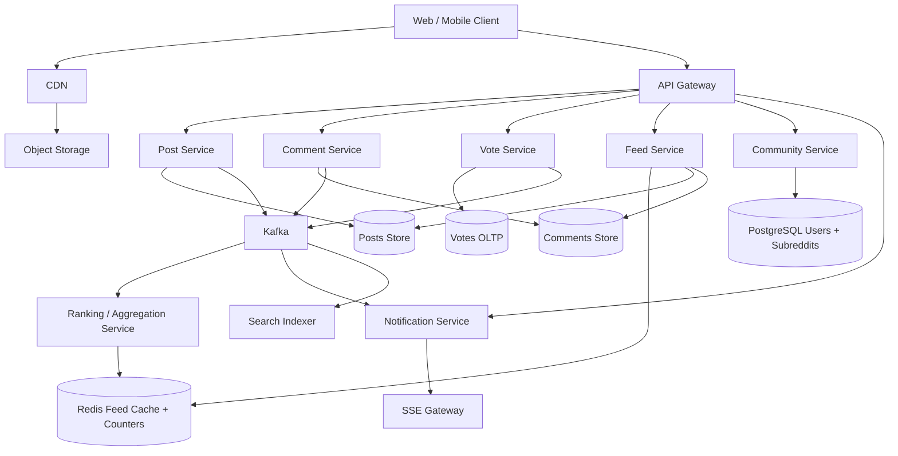
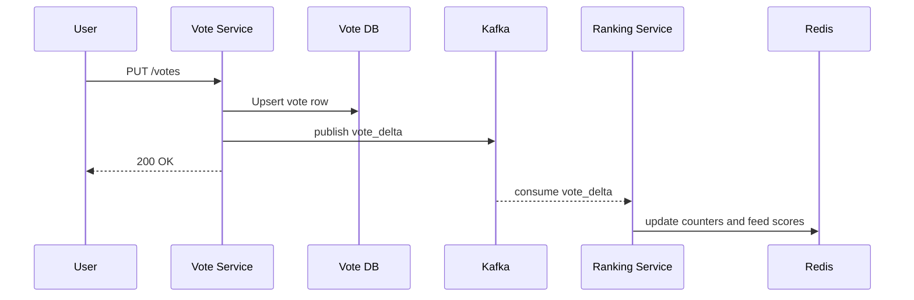
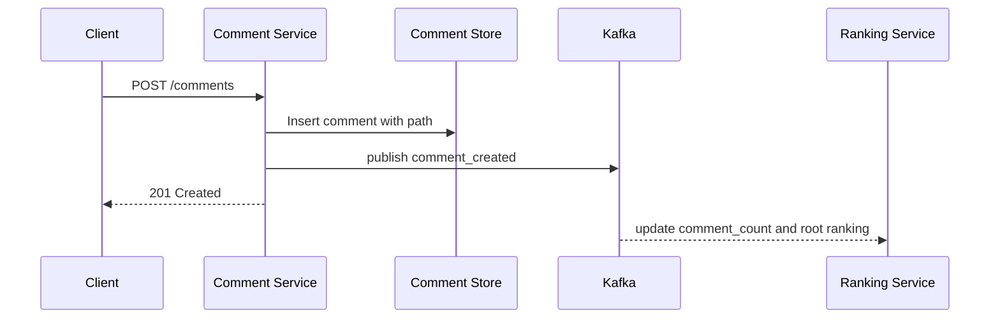
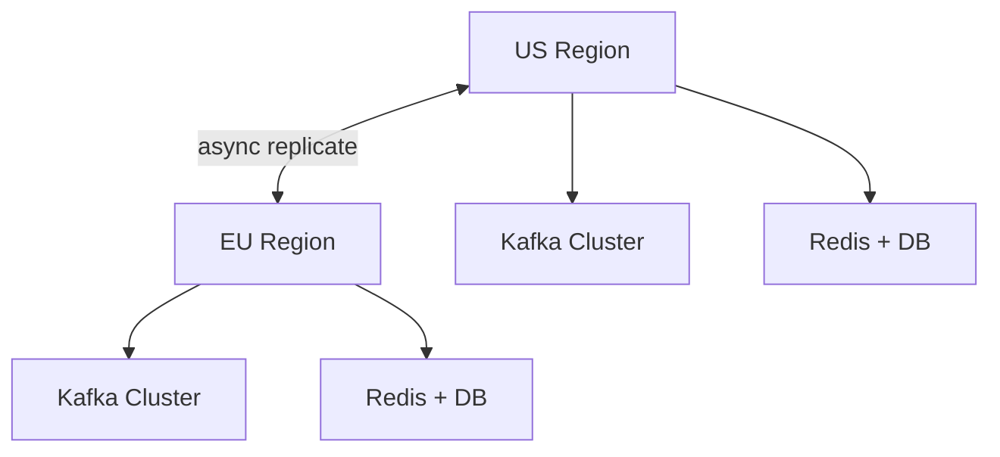

# Design Reddit

Reddit looks simple on the surface: users create posts, vote, comment, and browse communities. In an interview, the real problem is not CRUD. The hard part is serving large feed volume, surviving viral hotspots, ranking fast enough, and handling nested comments without creating hot partitions.

This is a strong design question because it mixes **ranking**, **fan-out**, **caching**, **event pipelines**, and **consistency tradeoffs**. The right answer is knowing where exactness matters and where eventual consistency is the better product decision.

---

## Functional Requirements

**In Scope:**
- Users can create text, link, image, and video posts inside subreddits
- Users can browse a home feed and subreddit feeds
- Users can upvote or downvote posts and comments
- Users can create comments and replies on a post
- Users can join or leave subreddits
- Users can sort content by `hot`, `new`, and `top`
- Users receive notifications for replies, mentions, and moderator actions
- Moderators can remove posts/comments and lock comment threads

**Out of Scope:**
- Reddit Ads auction and targeting
- Full-text search internals
- Chat and direct messaging
- ML abuse detection and content moderation pipelines
- Video live streaming
- Advanced recommendation model training

---

## Non-Functional Requirements

| Property | Target | Reasoning |
|---|---|---|
| **Feed Read Latency** | p99 < 200ms | Feed is the core product; slow reads kill engagement quickly |
| **Post Create ACK** | < 500ms | Users expect instant feedback after submit |
| **Vote Write Latency** | p99 < 100ms | Voting is a high-frequency action and must feel immediate |
| **Availability** | 99.95%+ | Read path must survive partial failures and cache misses |
| **Durability** | No loss of posts/comments/votes | User-generated content is durable even if ranking is delayed |
| **Consistency** | Strong for vote dedup and moderation actions; eventual for scores and feed ordering | Score drift is acceptable for seconds; duplicate votes are not |
| **Scalability** | Tens of millions of DAU; heavy skew toward read traffic | Reddit is read-heavy with bursty write hotspots |
| **Reliability** | Graceful degradation under viral spikes | A single trending post should not take down the platform |

**Key tradeoff:** Reddit prioritizes **fast reads and resilient ranking** over globally exact counters in real time. Users care that their vote is accepted immediately; they do not require every feed on Earth to reflect that vote in the next 20ms.

---

## Capacity Estimation

Assume a mature Reddit-like system at interview scale:

- 100M DAU
- 10 feed opens/user/day -> 1B feed requests/day -> ~11.6K/sec average, ~100K/sec peak
- 50M posts/day -> ~580/sec average, ~5K/sec peak
- 500M comments/day -> ~5.8K/sec average, ~50K/sec peak
- 5B vote events/day -> ~58K/sec average, ~500K/sec peak
- Average feed page = 25 posts, mostly cacheable metadata

Approximate storage:
- Post and comment metadata: ~2-3 TB/day including indexes and denormalized counts
- Vote events: ~500 GB/day raw if retained in hot OLTP; cheaper if compacted into aggregates plus audit log
- Media: object storage, tens of TB/day depending on video mix

**Interview takeaway:** reads dominate, but writes are still heavy enough to shape the architecture:
- cheap, low-latency reads for popular feeds
- burst absorption for votes and comments on hot posts

---

## Core Entities

| Entity | Purpose | Important Fields | Relationships |
|---|---|---|---|
| **User** | Account identity and reputation | `user_id`, `username`, `karma`, `created_at`, `status` | joins subreddits, authors posts/comments, casts votes |
| **Subreddit** | Community container | `subreddit_id`, `name`, `description`, `member_count`, `visibility` | owns many posts; has moderators |
| **SubredditMembership** | Tracks joined communities | `user_id`, `subreddit_id`, `role`, `joined_at` | many-to-many between users and subreddits |
| **Post** | Primary content object | `post_id`, `subreddit_id`, `author_id`, `type`, `title`, `body`, `media_id`, `created_at`, `state` | has many votes and comments |
| **Comment** | Nested discussion item | `comment_id`, `post_id`, `parent_comment_id`, `author_id`, `body`, `path`, `depth`, `created_at` | belongs to a post; may reply to another comment |
| **Vote** | User reaction on post/comment | `target_type`, `target_id`, `user_id`, `value`, `created_at` | unique per user per target |
| **FeedEntry** | Materialized ranking candidate | `feed_key`, `post_id`, `score`, `reason`, `generated_at` | cached representation for feed serving |
| **Notification** | Inbox event | `notification_id`, `recipient_id`, `actor_id`, `type`, `entity_id`, `created_at`, `read_at` | created by replies, mentions, moderation |
| **Media** | Blob metadata | `media_id`, `owner_id`, `storage_key`, `content_type`, `size_bytes` | attached to posts |

**Modeling decisions that matter:**
- Votes are stored as **one row per user per target** so duplicate votes are prevented with a unique key.
- Comments store a `path` or ancestor encoding so subtree reads do not become recursive query storms.
- Feed entries are **derived data**, not the source of truth.

---

## Databases and Database Design

### Storage Tier Decisions

| Data | Access Pattern | Engine | Why |
|---|---|---|---|
| Users, subreddits, memberships | relational, transactional, moderate write volume | **PostgreSQL** | strong consistency, rich indexes, simple admin workflows |
| Posts and comments | high write volume, time-range reads, per-subreddit/post partitioning | **Cassandra / DynamoDB-style wide-column store** | predictable writes and horizontal scale |
| Votes (dedup) | point upsert by `(target_id, user_id)` | **PostgreSQL or CockroachDB** | exact uniqueness and transactional vote state |
| Vote aggregates, ranking counters | high write/update throughput | **Redis + stream processor + OLAP sink** | fast counters on hot items; async reconciliation |
| Feed cache | sorted reads, top-N retrieval | **Redis Sorted Sets** | low-latency top results and easy trimming |
| Event bus | ordered, durable event streaming | **Kafka** | decouples write path from ranking, notifications, analytics |
| Media blobs | write-once, read-many | **S3/GCS + CDN** | cheapest way to scale images/video |
| Search / analytics | secondary indexing and offline ranking | **OpenSearch + columnar warehouse** | not on critical write path |

This is a deliberate polyglot design. A single database can work at small scale, but interviews reward knowing when to separate:
- **system of record** from **derived views**
- **exact OLTP state** from **approximate high-throughput counters**
- **hot cache** from **durable storage**

### Schema 1 - Users and Subreddits (PostgreSQL)

```sql
CREATE TABLE users (
	user_id       BIGSERIAL PRIMARY KEY,
	username      VARCHAR(32) UNIQUE NOT NULL,
	karma         BIGINT NOT NULL DEFAULT 0,
	status        VARCHAR(16) NOT NULL DEFAULT 'active',
	created_at    TIMESTAMPTZ NOT NULL DEFAULT NOW()
);

CREATE TABLE subreddits (
	subreddit_id  BIGSERIAL PRIMARY KEY,
	name          VARCHAR(64) UNIQUE NOT NULL,
	description   TEXT,
	visibility    VARCHAR(16) NOT NULL DEFAULT 'public',
	member_count  BIGINT NOT NULL DEFAULT 0,
	created_at    TIMESTAMPTZ NOT NULL DEFAULT NOW()
);
```

### Schema 2 - Memberships (PostgreSQL)

```sql
CREATE TABLE subreddit_memberships (
	user_id        BIGINT NOT NULL REFERENCES users(user_id),
	subreddit_id   BIGINT NOT NULL REFERENCES subreddits(subreddit_id),
	role           VARCHAR(16) NOT NULL DEFAULT 'member',
	joined_at      TIMESTAMPTZ NOT NULL DEFAULT NOW(),
	PRIMARY KEY (user_id, subreddit_id)
);

CREATE INDEX idx_memberships_subreddit
	ON subreddit_memberships (subreddit_id, joined_at DESC);
```

### Schema 3 - Posts (Wide-Column)

```sql
CREATE TABLE posts_by_subreddit (
	subreddit_id   BIGINT,
	bucket_day     DATE,
	created_at     TIMESTAMP,
	post_id        UUID,
	author_id      BIGINT,
	title          TEXT,
	body           TEXT,
	type           TEXT,
	media_id       UUID,
	state          TEXT,
	PRIMARY KEY ((subreddit_id, bucket_day), created_at, post_id)
) WITH CLUSTERING ORDER BY (created_at DESC, post_id DESC);
```

Why bucket by day? A huge subreddit can otherwise create a hot partition. Time bucketing spreads writes while keeping recent scans efficient.

### Schema 4 - Comments (Wide-Column)

```sql
CREATE TABLE comments_by_post (
	post_id            UUID,
	root_comment_id    UUID,
	path               TEXT,
	comment_id         UUID,
	parent_comment_id  UUID,
	author_id          BIGINT,
	body               TEXT,
	depth              INT,
	created_at         TIMESTAMP,
	state              TEXT,
	PRIMARY KEY ((post_id), root_comment_id, path, comment_id)
);
```

`path` can look like `0001.0007.0002` so lexical ordering preserves tree order. This avoids N recursive queries for nested threads.

### Schema 5 - Votes (Transactional Store)

```sql
CREATE TABLE votes (
	target_type    VARCHAR(16) NOT NULL,
	target_id      UUID NOT NULL,
	user_id        BIGINT NOT NULL,
	value          SMALLINT NOT NULL CHECK (value IN (-1, 1)),
	created_at     TIMESTAMPTZ NOT NULL DEFAULT NOW(),
	updated_at     TIMESTAMPTZ NOT NULL DEFAULT NOW(),
	PRIMARY KEY (target_type, target_id, user_id)
);

CREATE INDEX idx_votes_user_time
	ON votes (user_id, updated_at DESC);
```

This primary key makes vote writes idempotent. `INSERT ... ON CONFLICT DO UPDATE` handles vote changes cleanly.

### Schema 6 - Notifications (Wide-Column or DynamoDB)

```sql
CREATE TABLE notifications_by_user (
	recipient_id      BIGINT,
	created_at        TIMESTAMP,
	notification_id   UUID,
	actor_id          BIGINT,
	type              TEXT,
	entity_id         UUID,
	read              BOOLEAN,
	PRIMARY KEY ((recipient_id), created_at, notification_id)
) WITH CLUSTERING ORDER BY (created_at DESC, notification_id DESC);
```

### Partitioning, Indexing, Replication, Consistency

| Concern | Strategy | Why |
|---|---|---|
| **Posts sharding** | partition by `(subreddit_id, bucket_day)` | keeps subreddit reads local while reducing hot partitions |
| **Comments sharding** | partition by `post_id` | comment reads are almost always scoped to one post |
| **Votes dedup** | transactional primary key on `(target_type, target_id, user_id)` | exact once-per-user semantics |
| **Feed cache key** | `home:{user_id}:{sort}` or `subreddit:{subreddit_id}:{sort}` | simple cache invalidation and targeted warmup |
| **Replication** | 3-way replication in each region; async cross-region replication | high local availability without global write latency |
| **Consistency model** | strong for user actions that must be exact; eventual for aggregate score and ranking | prevents overpaying with global coordination |

### Read/Write Patterns

- **Write path:** API -> source store -> Kafka -> ranking, notifications, search, cache refresh
- **Read path:** Feed Service -> Redis cache first -> fallback recompute on miss
- **Object storage:** clients upload via pre-signed URL and read through CDN

---

## API Design

**Create a post:**
```http
POST /v1/posts
Authorization: Bearer <jwt>
Idempotency-Key: 6d7f-post-001

{
  "subreddit_id": 123,
  "type": "text",
  "title": "What is the cleanest way to shard comments?",
  "body": "Interview answers vary a lot here..."
}

201 Created
{
  "post_id": "0d4f8b3f-1b56-4c9a-8c6c-7dbf61752111",
  "state": "published",
  "created_at": "2026-06-03T10:00:00Z"
}
```

**Get subreddit feed (cursor-paginated):**
```http
GET /v1/subreddits/123/feed?sort=hot&cursor=eyJzY29yZSI6MTIzLCJ0cyI6IjIwMjYtMDYtMDMifQ==&limit=25

200 OK
{
  "items": [
    {
      "post_id": "0d4f...",
      "title": "What is the cleanest way to shard comments?",
      "score": 8412,
      "comment_count": 231,
      "author": { "user_id": 42, "username": "alice" },
      "created_at": "2026-06-03T10:00:00Z"
    }
  ],
  "next_cursor": "eyJzY29yZSI6MTE4LCJ0cyI6IjIwMjYtMDYtMDMifQ==",
  "has_more": true
}
```

> Cursor-based pagination on ranking cursors. Offset pagination (`?page=N`) becomes expensive and unstable when scores change continuously.

**Vote on a post or comment:**
```http
PUT /v1/votes
Authorization: Bearer <jwt>
Idempotency-Key: vote-abc-123

{
  "target_type": "post",
  "target_id": "0d4f8b3f-1b56-4c9a-8c6c-7dbf61752111",
  "value": 1
}

200 OK
{
  "target_id": "0d4f8b3f-1b56-4c9a-8c6c-7dbf61752111",
  "your_vote": 1,
  "score_visible": 8413,
  "score_finalized": false
}
```

**Add a comment:**
```http
POST /v1/posts/{post_id}/comments
Authorization: Bearer <jwt>

{
  "parent_comment_id": null,
  "body": "I would shard by post_id and store path for tree reads."
}

201 Created
{
  "comment_id": "74d0fce7-7ef0-4a8f-a2cb-b08f708d1677",
  "depth": 0,
  "created_at": "2026-06-03T10:01:00Z"
}
```

**Fetch comment tree:**
```http
GET /v1/posts/{post_id}/comments?sort=top&cursor=cm9vdD0wMDAx

200 OK
{
  "root_comments": [
    {
      "comment_id": "74d0...",
      "body": "I would shard by post_id and store path for tree reads.",
      "score": 120,
      "children_preview": 3
    }
  ],
  "next_cursor": "cm9vdD0wMDAy"
}
```

**Join a subreddit:**
```http
PUT /v1/subreddits/{subreddit_id}/membership
Authorization: Bearer <jwt>

{ "action": "join" }

204 No Content
```

**Real-time notifications (SSE):**
```http
GET /v1/notifications/stream
Authorization: Bearer <jwt>
Accept: text/event-stream
```

For Reddit, Server-Sent Events are often sufficient. Full WebSocket infrastructure is optional unless live comments or chat are core requirements.

---

## High-Level Design



**Component responsibilities:**

| Component | Role |
|---|---|
| **API Gateway** | auth, rate limiting, routing, idempotency enforcement |
| **Post Service** | validates post creation, persists source-of-truth post, emits events |
| **Comment Service** | writes comments, computes tree path, emits reply events |
| **Vote Service** | ensures one vote per user/target, emits vote delta events |
| **Feed Service** | serves home and subreddit feeds from cache, recomputes on miss |
| **Ranking Service** | consumes events, updates hot/top/new scores, refreshes feed candidates |
| **Notification Service** | builds user inbox and pushes SSE/mobile notifications |
| **Redis** | feed cache, hot counters, rate-limit buckets, short-lived locks |
| **Kafka** | durable event backbone for decoupled processing |

**Post creation flow:**

1. User submits a post.
2. Post Service writes durable metadata and returns success quickly.
3. A `post_created` event lands in Kafka.
4. Ranking Service updates `new` immediately and `hot` as votes/comments arrive.
5. Feed caches refresh asynchronously.
6. Feed Service serves from Redis and falls back to storage on miss.

---

## Deep Dives

### 1. Kafka: Why Reddit Needs an Event Backbone

The mistake in an interview is making the vote or post request synchronously update everything:
- database row
- subreddit feed
- home feeds for followers or joined users
- notification inbox
- analytics
- search index

That coupling makes the write path fragile. If one downstream system slows down, post creation or voting slows down for everyone.

Kafka solves this by turning writes into durable events.



**Why it becomes difficult at scale:**
- vote spikes are bursty and highly skewed toward a few trending posts
- multiple consumers need the same event with different SLAs
- reprocessing is necessary when ranking logic changes or counters drift

**Production-grade approach:**
- `post_events` topic partitioned by `subreddit_id` for community-level ordering
- `vote_events` topic partitioned by `target_id` so all vote deltas for a post hit the same partition and can be aggregated deterministically
- compacted topic for latest moderation state so consumers can rebuild views cheaply
- separate consumer groups for ranking, notifications, search, and analytics

**Tradeoff:** Kafka adds operational cost and some latency, but replay and decoupled scaling are worth it once one write fans out broadly.

### 2. Redis: Cache, Counter Store, and Rate-Limit Engine

Redis is not just a generic cache here. It is usually doing three distinct jobs:

| Redis Use | Example Key | Why Redis Fits |
|---|---|---|
| **Feed cache** | `subreddit:123:hot` | top-N ranked reads with low latency |
| **Hot counters** | `post:xyz:score`, `post:xyz:comment_count` | rapid atomic increments during spikes |
| **Rate limiting** | `rl:user:42:votes` | token bucket or sliding window checks |

For subreddit feeds, a Redis Sorted Set works well:

```text
ZADD subreddit:123:hot 8394 post_a 8121 post_b 8003 post_c
ZREVRANGE subreddit:123:hot 0 24
```

**Why it becomes difficult at scale:**
- one hot subreddit can receive millions of reads per minute
- vote churn changes scores constantly, which can thrash caches
- naive invalidation causes stampedes and cold misses on the primary store

**Production-grade solutions:**
- cache only top windows, not infinite feeds
- version keys by sort mode: `subreddit:{id}:hot:v42`
- use stale-while-revalidate so slightly stale feed pages are served while background refresh runs
- use per-key request coalescing to prevent thundering herds
- store exact vote rows in OLTP, but visible counters in Redis with periodic reconciliation

**Tradeoff:** Redis is fast but memory-expensive and not the source of truth.

### 3. Fan-out: Home Feed vs Subreddit Feed

Reddit is not a pure follower graph like Twitter. Most reads come from:
- direct subreddit browsing
- aggregated home feed from subscribed subreddits
- popular or all feeds

That changes the fan-out decision.

If a user joins 200 subreddits, their home feed is a merge of many ranked streams. Precomputing the full feed on every post is wasteful.

**Practical design:**
- **subreddit feed:** fan-out on write into subreddit-ranked caches because many users read the same community timeline
- **home feed:** hybrid model; materialize partial candidate sets for active users, but often merge top entries from subscribed subreddit caches on read


**Tradeoff:** fan-out on write makes reads fast but explodes write amplification; fan-out on read saves writes but makes cold reads heavier. Hybrid usually wins.

### 4. Hot Partitions and Viral Posts

A viral post is a partitioning test. If all comments, vote aggregates, and feed updates for a mega-thread hit one shard, that shard becomes the outage.

**Why it becomes difficult at scale:**
- comment storms create write hotspots on `post_id`
- a top subreddit can dominate traffic for minutes or hours
- re-ranking every vote synchronously is wasteful

**Production-grade mitigations:**
- bucket post writes by `(subreddit_id, day)` rather than only `subreddit_id`
- for extremely hot vote aggregation, use sharded Redis counters such as `post:{id}:score:{0..31}` and sum asynchronously
- batch vote deltas in the ranking consumer instead of re-sorting after every event
- use CDN and edge caching aggressively for read-mostly post pages
- promote viral-thread protection mode: temporarily slow expensive sort recalculations and serve slightly stale ranks

**Tradeoff:** you sacrifice perfectly fresh scores for system survival.

### 5. Comment Trees, Ordering, and Replication Lag

Comments are deceptively hard because users expect nested structure, good ranking, and fast expansion. The worst design is recursive SQL queries on every page render.

**Why the problem happens:**
- trees are unbounded and skewed
- top comments may change as votes arrive
- deleted comments must preserve thread structure

**Production-grade approach:**
- store tree path or materialized ancestry for efficient subtree scans
- separate **storage order** from **display order**: store comments by creation/path, rank roots separately for `top` sort
- soft-delete comments and leave tombstones so children remain reachable
- replicate comments asynchronously across regions but pin write traffic to a home region for the post



**Replication lag tradeoff:** a user in Europe may briefly see stale comment order for a post whose primary write region is in the US. That is acceptable if durability is protected.

### 6. Multi-Region Deployment, Queue Backpressure, and Rate Limiting

At large scale, Reddit should run active-active for reads and selective regional write ownership depending on the entity.



**What to keep local:**
- feed cache reads
- subreddit and post page rendering
- notification delivery

**What to avoid globally synchronizing on every request:**
- exact feed ordering
- exact visible vote counts
- comment rank recomputation

**Queue backpressure:** if ranking consumers fall behind, the platform should:
- preserve source-of-truth writes
- allow feed scores to become slightly stale
- shed low-priority consumers first, such as analytics or secondary ranking jobs

**Rate limiting:**
- per-user vote rate limit to stop abuse and bot floods
- per-IP/comment-create limits for spam defense
- moderator/admin bypasses where appropriate
- token bucket in Redis for low latency, backed by durable audit logs for enforcement decisions

**Tradeoff:** strict global consistency across regions is too expensive for this product.

---

## Architecture Evolution

| Stage | Design | Why It Breaks | Next Step |
|---|---|---|---|
| **1. MVP** | Single Postgres, single app tier, simple joins | feed reads and vote spikes overload primary | add Redis and background workers |
| **2. Growth** | Redis feed cache, async jobs, read replicas | replicas lag, background jobs become fragile | introduce Kafka and separate services |
| **3. Scale** | Kafka, Redis ranking caches, wide-column posts/comments | hot communities and viral posts cause skew | add partition bucketing, sharded counters, hybrid feed generation |
| **4. Global** | multi-region reads, async replication, regional caches | cross-region coordination is expensive | accept eventual ordering and localize writes where needed |

This evolution shows the interview pattern: start simple, then isolate the bottleneck that forces the next move.

---

## Final Interview Summary

- Use a **transactional store** for users, memberships, and exact vote dedup.
- Use a **wide-column store** for posts and comments because reads are scoped by subreddit or post and writes are high volume.
- Use **Kafka** to decouple writes from ranking, feed updates, notifications, and analytics.
- Use **Redis** for ranked feed caches, hot counters, and rate limiting.
- Use a **hybrid feed strategy**: materialize hot subreddit feeds, then build home feeds from subscribed communities with selective precomputation for active users.
- Accept **eventual consistency** for score visibility and feed ordering, but keep vote identity and moderation actions strongly consistent.
- Design explicitly for **hot partitions**, **viral spikes**, **queue lag**, and **multi-region staleness**.
