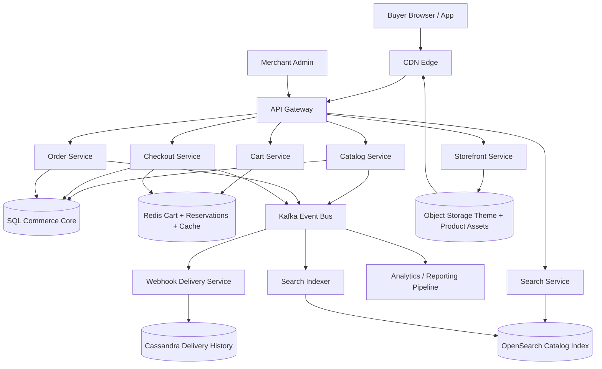
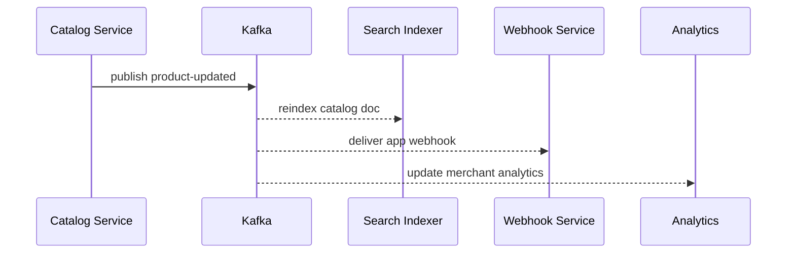
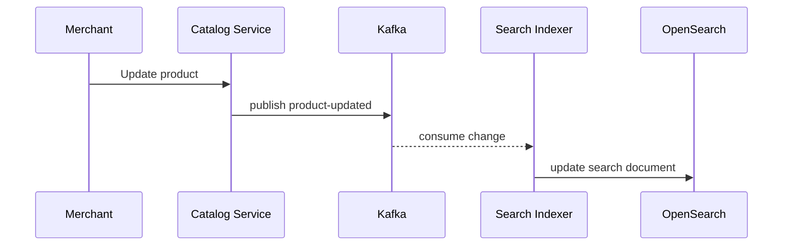
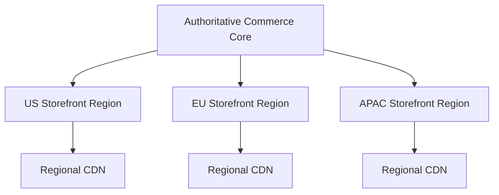

# Design Shopify

Shopify is a classic system design interview problem because it combines a multi-tenant SaaS control plane with a latency-sensitive commerce runtime. Merchants expect to create products, update inventory, run promotions, configure storefronts, and inspect orders from an admin dashboard. Buyers expect fast page loads, accurate inventory, reliable carts, smooth checkout, and immediate order confirmation even during flash sales. If the platform gets catalog or search wrong, discovery suffers. If it gets inventory or orders wrong, merchants oversell and lose trust.

At a high level, the system has two very different workloads. The first is the **storefront and checkout path**, where a buyer loads product pages, searches, adds items to the cart, and places an order with low latency. The second is the **merchant and operations path**, where catalog edits, inventory sync, webhooks, analytics, and app integrations create large asynchronous side effects. A good design keeps the shopper-facing path small and cache-heavy, then uses durable event pipelines to update search indexes, analytics, notifications, and downstream integrations.

---

## Functional Requirements

**In Scope:**
- Merchants can create stores, products, variants, collections, prices, and discounts
- Buyers can browse storefronts, search products, view product details, and add items to carts
- Buyers can create checkouts, provide shipping details, and place orders
- The platform tracks inventory per product variant and prevents obvious oversell
- Merchants can inspect orders, inventory, customers, and fulfillment state from an admin surface
- The system supports payment authorization callbacks and order-status updates
- App integrations can subscribe to webhooks for events such as order-created or inventory-updated
- Operators can inspect store health, checkout failures, webhook lag, and flash-sale hotspots

**Out of Scope:**
- Warehouse robotics and physical fulfillment routing details
- Full ERP, accounting, or tax-compliance internals for every country
- Fraud modeling details beyond basic payment callback handling
- Rich CMS page-builder internals
- Marketplace-style multi-seller settlement inside one shared cart

---

## Non-Functional Requirements

| Property | Target | Reasoning |
|---|---|---|
| **Storefront Read Latency** | p99 < 150ms for cached product and collection pages | buyer conversion is highly sensitive to perceived page speed |
| **Search Latency** | p99 < 200ms for product search and filtering | discovery is on the primary path to conversion |
| **Checkout API Latency** | p99 < 300ms before payment processor round-trips | checkout friction directly reduces revenue |
| **Availability** | 99.99% for storefront reads; 99.9% for admin mutations and webhooks | storefront downtime is revenue loss; admin lag is usually tolerable briefly |
| **Durability** | no loss of committed orders, inventory mutations, or merchant catalog edits | data loss is financially and operationally unacceptable |
| **Consistency** | strong enough for order creation and inventory reservation; eventual for search, analytics, and some merchant dashboards | not every derived view needs read-after-write guarantees |
| **Scalability** | millions of storefront requests/sec, large flash-sale spikes, and millions of active shops | tenant skew and campaign spikes dominate real traffic |
| **Multi-Tenant Isolation** | one hot shop should not degrade the whole platform | flash sales and celebrity drops create extreme tenant hotspots |

**Key tradeoff:** the platform prioritizes **fast storefront reads and resilient checkout** over globally synchronous updates to every derived system. Strong consistency is kept around order creation, inventory reservation, and core merchant data, while search indexes, analytics, webhooks, and app integrations are updated asynchronously.

---

## Capacity Estimation

**Merchant and shopper scale assumptions:**
- Assume **5M active merchants** globally, with **500K merchants** making admin changes on a busy day
- Assume **100M daily shoppers** and several million concurrent storefront visitors during seasonal peaks
- Traffic is highly skewed: a few large brands or flash-sale stores can generate more load than thousands of small merchants combined

**Storefront traffic:**
- Assume **2M storefront page or API requests/sec** at peak across product pages, collections, carts, and checkouts
- Read traffic dominates write traffic by a large margin, so aggressive caching and CDN usage are required
- Search and filtering requests are more expensive than straight product page reads because they touch faceting and relevance layers

**Checkout traffic:**
- Assume **100K checkout submissions/sec** at peak during global shopping events
- Inventory reservation and order creation must remain correct even when cache hit rates drop or payment processors add latency

**Catalog and inventory changes:**
- Large merchants may bulk update prices or inventory many times per minute through APIs or ERP integrations
- A single event such as a warehouse sync can fan out into search refreshes, cache invalidations, webhooks, and analytics updates

**Operational profile:**
- Black Friday, influencer launches, and limited drops create intense tenant-local hotspots
- The platform should expect large spikes in add-to-cart, checkout, and inventory contention for a small number of variants

---

## Core Entities

| Entity | Purpose | Key Fields | Relationships |
|---|---|---|---|
| **Shop** | Merchant tenancy boundary | `shop_id`, `owner_id`, `domain`, `plan`, `status` | owns products, orders, settings, and apps |
| **Product** | Merchant-visible sellable item | `product_id`, `shop_id`, `title`, `status`, `created_at` | has many variants and images |
| **ProductVariant** | Inventory and price unit | `variant_id`, `product_id`, `sku`, `price_cents`, `inventory_qty`, `status` | belongs to one product |
| **Collection** | Merchant grouping for discovery | `collection_id`, `shop_id`, `title`, `rules`, `status` | contains many products |
| **Cart** | Buyer's pre-checkout selection | `cart_id`, `shop_id`, `buyer_id`, `currency`, `expires_at` | has cart lines and discounts |
| **Checkout** | Confirmable purchase intent | `checkout_id`, `cart_id`, `shipping_address`, `subtotal_cents`, `status` | becomes an order after payment confirmation |
| **Order** | Durable record of a placed purchase | `order_id`, `shop_id`, `buyer_id`, `payment_status`, `fulfillment_status`, `created_at` | has order lines and payment records |
| **InventoryReservation** | Short-lived stock hold for checkout | `reservation_id`, `variant_id`, `quantity`, `checkout_id`, `expires_at` | bounds oversell during checkout races |
| **PaymentTransaction** | Payment processor interaction | `payment_id`, `order_id`, `provider`, `amount_cents`, `status`, `provider_ref` | linked to one order |
| **WebhookSubscription** | App integration sink | `subscription_id`, `shop_id`, `topic`, `target_url`, `status` | receives async event deliveries |

**Critical modeling decisions:**
- `ProductVariant` is the inventory and pricing unit, not `Product`. Oversell prevention and order lines should key off variants.
- `InventoryReservation` is separate from final inventory decrement. This lets the platform protect checkout correctness without permanently reducing stock until order confirmation succeeds.
- `WebhookSubscription` is first-class because integrations are a major product surface. Webhooks should not piggyback directly on synchronous mutations.

---

## Databases and Database Design

### Storage Tier Decisions

| Data | Access Pattern | Engine | Why |
|---|---|---|---|
| Shops, products, variants, carts, checkouts, orders | transactional writes, exact reads, foreign-key relationships | **MySQL / PostgreSQL** | commerce core data needs ACID semantics and relational modeling |
| Product search and filtering | full-text search, faceting, attribute filters | **OpenSearch** | catalog discovery needs fast inverted-index queries |
| Sessions, carts cache, inventory reservations, rate limits, storefront fragments | sub-millisecond reads/writes, TTLs, hot keys | **Redis** | ideal for ephemeral state and hot cache layers |
| Order timelines, webhook delivery history, some append-heavy events | large append-only histories, tenant-scoped reads | **Cassandra / ScyllaDB** | useful for wide, time-bucketed operational timelines |
| Webhooks, analytics, search refresh, email, app integrations | durable event backbone | **Kafka** | decouples core mutations from many downstream consumers |
| Product images and theme assets | large immutable objects | **Object Storage + CDN** | storefront bytes should bypass the application tier |

This is intentionally polyglot. Commerce platforms need **transactional core records**, **fast product search**, **ephemeral carts and reservations**, **durable asynchronous fanout**, and **cheap global asset delivery**. One engine does not serve those patterns efficiently.

### Schema 1 - Shops, Products, and Variants (SQL)

```sql
CREATE TABLE shops (
  shop_id                  UUID PRIMARY KEY DEFAULT gen_random_uuid(),
  owner_id                 UUID NOT NULL,
  domain                   TEXT NOT NULL UNIQUE,
  plan                     VARCHAR(32) NOT NULL,
  status                   VARCHAR(16) NOT NULL,
  created_at               TIMESTAMPTZ DEFAULT NOW()
);

CREATE TABLE products (
  product_id               UUID PRIMARY KEY DEFAULT gen_random_uuid(),
  shop_id                  UUID NOT NULL REFERENCES shops(shop_id),
  title                    TEXT NOT NULL,
  description_html         TEXT,
  status                   VARCHAR(16) NOT NULL,
  created_at               TIMESTAMPTZ DEFAULT NOW(),
  updated_at               TIMESTAMPTZ DEFAULT NOW()
);

CREATE TABLE product_variants (
  variant_id               UUID PRIMARY KEY DEFAULT gen_random_uuid(),
  product_id               UUID NOT NULL REFERENCES products(product_id),
  sku                      VARCHAR(64) NOT NULL,
  price_cents              BIGINT NOT NULL,
  currency                 VARCHAR(8) NOT NULL,
  inventory_qty            INT NOT NULL,
  status                   VARCHAR(16) NOT NULL,
  updated_at               TIMESTAMPTZ DEFAULT NOW(),
  UNIQUE (product_id, sku)
);

CREATE INDEX idx_products_shop_status
  ON products (shop_id, status, created_at DESC);
```

### Schema 2 - Carts and Checkouts (SQL)

```sql
CREATE TABLE carts (
  cart_id                  UUID PRIMARY KEY DEFAULT gen_random_uuid(),
  shop_id                  UUID NOT NULL REFERENCES shops(shop_id),
  buyer_id                 UUID,
  currency                 VARCHAR(8) NOT NULL,
  status                   VARCHAR(16) NOT NULL,
  expires_at               TIMESTAMPTZ,
  created_at               TIMESTAMPTZ DEFAULT NOW()
);

CREATE TABLE cart_lines (
  cart_id                  UUID NOT NULL REFERENCES carts(cart_id),
  variant_id               UUID NOT NULL REFERENCES product_variants(variant_id),
  quantity                 INT NOT NULL,
  unit_price_cents         BIGINT NOT NULL,
  PRIMARY KEY (cart_id, variant_id)
);

CREATE TABLE checkouts (
  checkout_id              UUID PRIMARY KEY DEFAULT gen_random_uuid(),
  cart_id                  UUID NOT NULL REFERENCES carts(cart_id),
  shipping_address_json    JSONB NOT NULL,
  subtotal_cents           BIGINT NOT NULL,
  total_cents              BIGINT NOT NULL,
  status                   VARCHAR(16) NOT NULL,
  created_at               TIMESTAMPTZ DEFAULT NOW()
);
```

### Schema 3 - Orders and Payments (SQL)

```sql
CREATE TABLE orders (
  order_id                 UUID PRIMARY KEY DEFAULT gen_random_uuid(),
  shop_id                  UUID NOT NULL REFERENCES shops(shop_id),
  buyer_id                 UUID,
  checkout_id              UUID NOT NULL REFERENCES checkouts(checkout_id),
  payment_status           VARCHAR(16) NOT NULL,
  fulfillment_status       VARCHAR(16) NOT NULL,
  total_cents              BIGINT NOT NULL,
  created_at               TIMESTAMPTZ DEFAULT NOW()
);

CREATE TABLE payment_transactions (
  payment_id               UUID PRIMARY KEY DEFAULT gen_random_uuid(),
  order_id                 UUID NOT NULL REFERENCES orders(order_id),
  provider                 VARCHAR(32) NOT NULL,
  amount_cents             BIGINT NOT NULL,
  status                   VARCHAR(16) NOT NULL,
  provider_ref             TEXT,
  created_at               TIMESTAMPTZ DEFAULT NOW()
);
```

### Schema 4 - Webhook Delivery History (Cassandra)

```sql
CREATE TABLE webhook_deliveries_by_shop (
  shop_id                  UUID,
  bucket_day               TEXT,
  created_at               TIMESTAMP,
  delivery_id              UUID,
  topic                    TEXT,
  status                   TEXT,
  target_url               TEXT,
  event_id                 UUID,
  PRIMARY KEY ((shop_id, bucket_day), created_at, delivery_id)
) WITH CLUSTERING ORDER BY (created_at DESC, delivery_id DESC);
```

### Schema 5 - Search Document (OpenSearch)

```json
{
  "shop_id": "shop_123",
  "product_id": "prod_456",
  "variant_ids": ["var_1", "var_2"],
  "title": "Minimalist leather backpack",
  "description": "Full-grain leather commuter backpack",
  "tags": ["bags", "travel"],
  "price_cents": 12900,
  "availability": true,
  "status": "active"
}
```

### Schema 6 - Inventory Reservation (Logical Redis Record)

```json
{
  "key": "reserve:variant:var_1:checkout:chk_888",
  "value": {
    "quantity": 2,
    "expires_at": "2026-06-03T10:05:00Z",
    "status": "reserved"
  }
}
```

Short-lived reservations protect against obvious checkout races while keeping the reservation path fast.

### Sharding and Replication Strategy

| Store | Shard Key | Strategy | Replication |
|---|---|---|---|
| SQL commerce core | `shop_id` | tenant-aware logical sharding across many database clusters | primary + replicas, some synchronous for critical paths |
| OpenSearch | `shop_id` or product document routing | distributed search shards with replicas | multi-node replicated clusters |
| Redis | `shop_id`, `cart_id`, `variant_id` | Redis Cluster | 1 replica per master |
| Cassandra | `(shop_id, bucket_day)` | consistent hashing across nodes | RF=3, `LOCAL_QUORUM` |
| Kafka | `shop_id` or `event_type` depending on topic | partitioned durable log | RF=3 |
| Object Storage | `shop_id/assets/...` namespace | regional bucket + CDN | multi-AZ durable storage |

**Consistency model:**
- Strong consistency for product mutations, checkout creation, order creation, and durable inventory commits
- Eventual consistency for search results, analytics, webhook fanout, and some merchant dashboard projections
- Best-effort low-latency consistency for cached storefront fragments and ephemeral cart state

**Read/write patterns:**
- **Storefront path:** cached product or collection reads -> optional search lookup -> product page render with CDN assets
- **Checkout path:** cart validation -> reserve inventory -> create checkout -> authorize payment -> create order -> publish downstream events
- **Merchant mutation path:** product or inventory update -> SQL commit -> Kafka event -> search reindex, cache invalidation, webhooks, analytics

---

## API Design

**Create a product:**
```http
POST /v1/shops/shop_123/products
Authorization: Bearer <jwt>

{
  "title": "Minimalist leather backpack",
  "description_html": "<p>Full-grain leather commuter backpack</p>",
  "variants": [
    {
      "sku": "BAG-BRN-01",
      "price_cents": 12900,
      "currency": "USD",
      "inventory_qty": 50
    }
  ]
}

201 Created
{
  "product_id": "prod_456",
  "status": "active"
}
```

**Search products on a storefront:**
```http
GET /v1/storefronts/shop_123/search?q=leather%20backpack&cursor=srch_100&limit=20

200 OK
{
  "products": [
    {
      "product_id": "prod_456",
      "title": "Minimalist leather backpack",
      "price_cents": 12900,
      "availability": true
    }
  ],
  "next_cursor": "srch_101",
  "has_more": true
}
```

> Cursor-based pagination is preferred for storefront search. Offset pagination (`?page=N`) becomes unstable and expensive on large search result sets and deep merchant catalogs.

**Add an item to cart:**
```http
POST /v1/carts
Authorization: Bearer <jwt>
Idempotency-Key: cart-add-001

{
  "shop_id": "shop_123",
  "variant_id": "var_1",
  "quantity": 2
}

201 Created
{
  "cart_id": "cart_777",
  "status": "active"
}
```

**Create a checkout:**
```http
POST /v1/checkouts
Authorization: Bearer <jwt>
Idempotency-Key: checkout-001

{
  "cart_id": "cart_777",
  "shipping_address": {
    "country": "US",
    "zip": "94107"
  }
}

201 Created
{
  "checkout_id": "chk_888",
  "status": "pending_payment",
  "total_cents": 25800
}
```

**Handle payment authorization callback:**
```http
POST /v1/payments/provider-callback
Content-Type: application/json

{
  "provider": "stripe",
  "provider_ref": "pi_123",
  "checkout_id": "chk_888",
  "status": "authorized"
}

202 Accepted
```

**List orders for a shop:**
```http
GET /v1/shops/shop_123/orders?before=2026-06-03T10:00:00Z&limit=50
Authorization: Bearer <jwt>

200 OK
{
  "orders": [
    {
      "order_id": "ord_999",
      "payment_status": "paid",
      "fulfillment_status": "unfulfilled",
      "total_cents": 25800
    }
  ],
  "next_cursor": "2026-06-03T09:55:00Z",
  "has_more": true
}
```

**Webhook event stream (optional SSE for merchant admin):**
```http
GET /v1/shops/shop_123/admin-events/stream
Authorization: Bearer <jwt>
Accept: text/event-stream
```
Storefront and checkout flows do not require WebSockets. SSE or polling is usually enough for merchant admin updates, while webhook delivery to apps remains asynchronous.

---

## High-Level Design



**Component responsibilities:**

| Component | Role |
|---|---|
| **API Gateway** | Authentication, routing, throttling, and multi-tenant request validation |
| **Storefront Service** | Serves product, collection, and shop pages using cache-friendly read models |
| **Catalog Service** | Manages products, variants, pricing, and inventory metadata |
| **Cart Service** | Owns cart lifecycle and low-latency cart mutations |
| **Checkout Service** | Validates cart state, reserves inventory, calculates totals, and orchestrates payment initiation |
| **Order Service** | Creates durable orders and manages order-state transitions |
| **Search Service** | Exposes product search and faceted filtering over a denormalized index |
| **Redis** | Cart cache, inventory reservations, rate limits, and storefront fragment cache |
| **SQL Commerce Core** | Source of truth for shops, products, variants, checkouts, payments, and orders |
| **Kafka** | Durable event backbone for webhooks, analytics, search refresh, and notifications |
| **Webhook Delivery Service** | Retries and tracks app callbacks for merchant integrations |
| **Object Storage + CDN** | Serves theme assets, images, and static storefront content globally |

**Checkout and order flow:**
1. Buyer loads cached storefront pages and product data through CDN and Storefront Service
2. Buyer adds items to a cart through Cart Service, which stores hot state in Redis and validates product availability
3. Buyer starts checkout; Checkout Service validates cart lines, creates short-lived inventory reservations, and calculates totals
4. Payment provider authorizes payment and calls back the platform
5. Order Service creates the durable order, converts reservations into committed inventory decrement, and publishes `order-created` events
6. Kafka fanout updates analytics, search freshness signals, merchant notifications, and app webhooks without slowing the shopper-facing path

---

## Deep Dives

### 1. Kafka: Required and Central

Kafka is central to a Shopify-like platform because one merchant mutation often has many downstream side effects. A product update may require cache invalidation, search reindexing, webhooks, analytics updates, and app notifications. An order creation may trigger confirmation emails, fraud checks, analytics, fulfillment workflows, and third-party integrations. These should not all happen inline in the request that the buyer or merchant is waiting on.



**Why the problem happens:** commerce core writes have many consumers with different SLAs and failure modes.

**Why it becomes difficult at scale:**
- app integrations can be slow or unavailable
- large merchants bulk update products and inventory continuously
- order spikes create bursts across many downstream systems at once

**Production-grade solutions:**
- publish immutable domain events after durable core commits
- partition Kafka by `shop_id` so per-shop ordering is preserved where useful
- keep search indexing, webhooks, analytics, and notifications off the synchronous request path
- support replay so derived systems can recover after incidents or schema changes

**Tradeoffs:** Kafka adds operational overhead, but without it the platform would tightly couple storefront correctness to slow or unreliable downstream consumers.

### 2. Redis: Carts, Reservations, and Hot Storefront State

Redis is especially useful in a commerce platform because carts and reservation records are hot, short-lived, and latency-sensitive. Storefront fragments, rate limits, and flash-sale protections also fit well in Redis. But Redis should not be the only durable source of truth for orders or catalog state.

| Redis Use | Example Key | Why Redis Fits |
|---|---|---|
| **Cart cache** | `cart:cart_777` | carts are read and written frequently during a short session |
| **Inventory reservation** | `reserve:variant:var_1:checkout:chk_888` | short TTL and fast mutation for checkout races |
| **Storefront fragment cache** | `storefront:shop_123:product:prod_456` | high-QPS read acceleration for public product pages |
| **Rate limiting** | `rl:shop:shop_123:checkout` | protects hot tenants and flash-sale abuse scenarios |

**Why the problem happens:** commerce traffic repeatedly touches a small set of hot state during active sessions.

**Why it becomes difficult at scale:**
- flash sales create hot variants and hot carts
- stale reservation or cache data can mislead buyers if not bounded carefully
- some shops generate traffic patterns very unlike the long tail of small merchants

**Production-grade solutions:**
- use Redis for ephemeral speed layers and TTL-backed reservations only
- keep durable catalog, checkout, and order truth in SQL systems
- aggressively expire reservations and rebuild caches from durable sources on misses
- shard or isolate hot shops and hot variants to avoid noisy-neighbor effects

**Tradeoffs:** Redis gives the storefront and checkout path the latency it needs, but it requires careful expiration, invalidation, and hotspot handling.

### 3. Search: OpenSearch Is Helpful, but It Must Stay Off the Write Path

Product search and filtering are core to storefront discovery. Merchants expect buyers to search by title, description, tag, price, availability, and collection rules. An inverted index such as OpenSearch is the right tool for this, but catalog writes should not wait for indexing to finish synchronously.



**Why the problem happens:** relational product records are not optimized for full-text search and faceting.

**Why it becomes difficult at scale:**
- large merchants may update thousands of products at once
- buyers expect low-latency faceted search with availability-aware results
- index lag can briefly expose stale prices or availability in search results

**Production-grade solutions:**
- treat the search index as a denormalized read model built asynchronously from catalog events
- include availability and price in documents so common filters do not require extra joins
- prioritize index freshness for active products and hot merchants during large bulk updates
- fall back to direct product URLs and cached product pages even if search is temporarily stale

**Tradeoffs:** asynchronous search indexing gives scalability and flexibility, but it accepts short windows where search and source-of-truth catalog state diverge.

### 4. Inventory Reservation and Checkout Correctness

The hardest correctness problem in a commerce platform is not rendering a product page. It is deciding whether a scarce variant is still available when many buyers try to purchase it at once. Pure eventual consistency here leads directly to oversell.


**Why the problem happens:** checkout races are common during flash sales and low-stock inventory events.

**Why it becomes difficult at scale:**
- multiple buyers may try to buy the last few units simultaneously
- payment provider latency creates uncertainty between intent and confirmation
- carts can sit around for a while and should not hold inventory forever

**Production-grade solutions:**
- validate stock before checkout and create short-lived reservations per variant
- expire reservations automatically if payment is not authorized in time
- convert reservations into durable inventory decrements only when order creation succeeds
- keep idempotent payment callback handling so retries do not double-create orders or double-decrement inventory

**Tradeoffs:** reservations reduce oversell risk, but they add complexity and can temporarily hide stock from other buyers even when checkout eventually fails.

### 5. Webhooks and App Integrations

An important part of Shopify-like platforms is the ecosystem around them. Apps want webhooks for orders, products, inventory, fulfillments, customers, and discounts. Those deliveries are business-critical, but app endpoints are outside the platform’s control and are often slow or flaky.

**Why the problem happens:** merchants depend on external systems such as ERPs, shipping providers, CRMs, and custom apps.

**Why it becomes difficult at scale:**
- webhook endpoints can be down, rate-limited, or slow for long periods
- retries must not lose events or overwhelm receivers
- merchants want observability into delivery failures without impacting storefront traffic

**Production-grade solutions:**
- emit webhook work from Kafka-backed durable events rather than inline on the mutation path
- sign deliveries and support exponential backoff with dead-letter handling
- store delivery history and response codes for merchant debugging
- allow apps to replay missed topics from a recent retention window when feasible

**Tradeoffs:** durable webhook infrastructure improves reliability and developer trust, but it requires a full retry, observability, and backpressure system of its own.

### 6. WebSockets: Usually Optional for Commerce Core

The core storefront and checkout loop does not need WebSockets. Buyers load pages, mutate carts, and place orders through standard HTTP APIs. Merchants may appreciate live admin updates for order dashboards, but those can often be served with polling or SSE without complicating the shopper-facing runtime.

**Why the problem happens:** many teams assume realtime equals better UX, even when request-response is sufficient.

**Why it becomes difficult at scale:**
- persistent sockets increase connection-state cost for limited product benefit on the shopper path
- many merchant admin views tolerate a few seconds of delay
- checkout and storefront correctness do not depend on bidirectional sessions

**Production-grade solutions:**
- keep storefront, cart, search, and checkout APIs stateless and cache-friendly
- use SSE or polling for merchant dashboards when near-real-time updates are useful
- keep app-to-platform integrations on webhooks rather than realtime sockets
- reserve WebSockets for specialized collaborative or support tooling, not the default commerce path

**Tradeoffs:** avoiding WebSockets simplifies scaling and caching, but some admin experiences may be slightly less immediate.

### 7. Hot Shops, Flash Sales, and Noisy-Neighbor Isolation

Average tenant traffic is misleading in a multi-tenant commerce platform. One celebrity drop or flash sale can create an enormous spike in storefront reads, cart mutations, inventory contention, and checkout traffic. If the platform is not careful, that single shop can degrade many others.

**Why the problem happens:** commerce traffic is bursty and tenant-local, not smoothly distributed.

**Why it becomes difficult at scale:**
- hot shops create read spikes and reservation hotspots around a few variants
- rate limiting that is too coarse can punish normal buyers and normal merchants
- shared caches and shared databases can turn one tenant spike into broader tail latency

**Production-grade solutions:**
- shard data and traffic by `shop_id` so hot tenants can be isolated operationally
- add per-shop rate limits, queue protections, and reservation throttles during extreme events
- pre-warm CDN and storefront caches for known large launches
- move the largest merchants onto dedicated capacity or special plans when necessary

**Tradeoffs:** stronger tenant isolation improves platform resilience, but it increases capacity fragmentation and operational complexity.

### 8. Multi-Region Serving and Durable Commerce Core

Storefront reads should be fast globally, but orders and inventory still need a clear source of truth. That usually means aggressively caching and replicating storefront read models across regions while keeping the commerce core in a more tightly controlled authoritative write plane.



**Why the problem happens:** buyers expect local performance, but order and inventory correctness require controlled writes.

**Why it becomes difficult at scale:**
- cross-region write coordination increases checkout latency
- stale replicated data can mislead storefront availability or price displays
- failover must not double-process payments or recreate orders

**Production-grade solutions:**
- serve storefront reads from regional caches and replicated search indexes close to buyers
- keep order creation and durable inventory commits in one authoritative write region or carefully partitioned write domains
- use idempotency keys and payment provider references to survive retries during failover
- prioritize fast propagation for price, publish status, and inventory changes that materially affect buyer decisions

**Tradeoffs:** strong global writes are expensive, so the platform usually accepts some read-side staleness while keeping the money and inventory path tighter.

### 9. Architecture Evolution

| Stage | Design | Why It Breaks | Next Step |
|---|---|---|---|
| **1. MVP** | Single relational app with product pages, cart, and checkout | storefront load, search, and integrations all pile onto one database | split storefront reads, add cache and async events |
| **2. Growth** | Separate catalog, cart, order, and webhook services with Kafka | search freshness, tenant hotspots, and reservation contention emerge | add OpenSearch, Redis reservations, and tenant-aware sharding |
| **3. Scale** | Multi-cluster commerce core, CDN storefronts, webhook and analytics pipelines | flash sales and large merchants stress shared infrastructure | isolate hot tenants, improve quotas, and regionalize reads |
| **4. Mature Platform** | Global read plane with strong core commerce writes and large app ecosystem | complexity shifts to operations, ecosystem reliability, and merchant customization | keep the checkout core small while evolving integrations and analytics independently |

This is the interview pattern to emphasize: keep storefront reads cache-heavy, keep checkout correctness focused on reservations and idempotent order creation, and use Kafka to push search, analytics, and app integrations off the critical buyer path.
