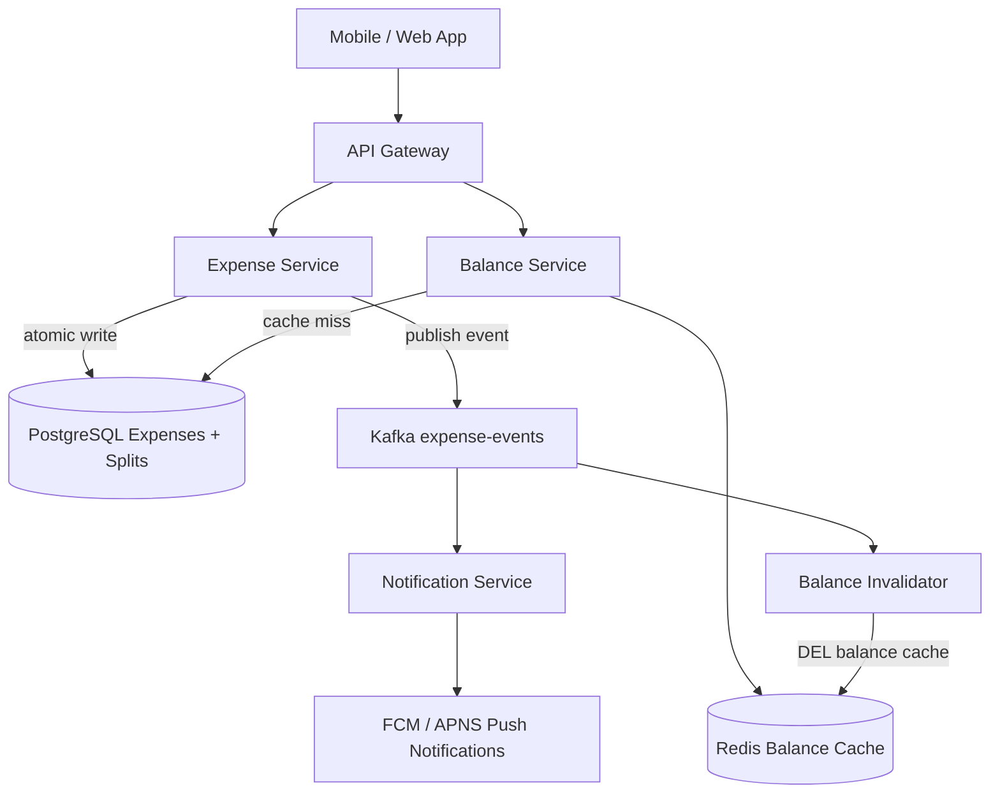
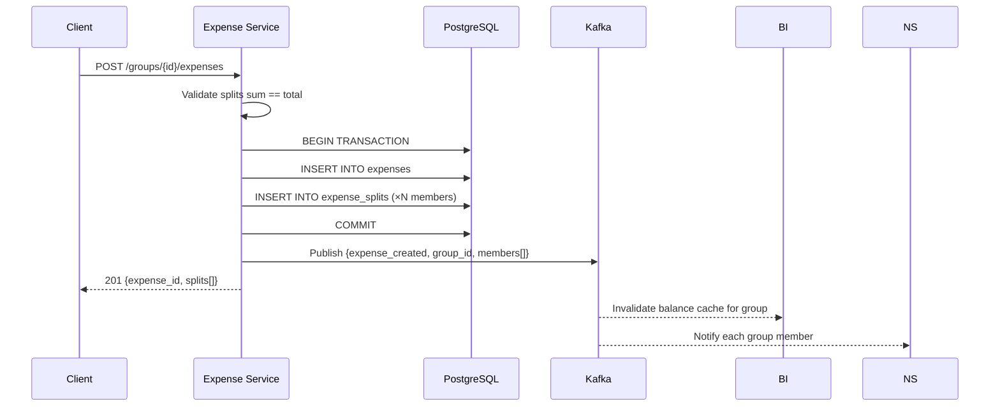
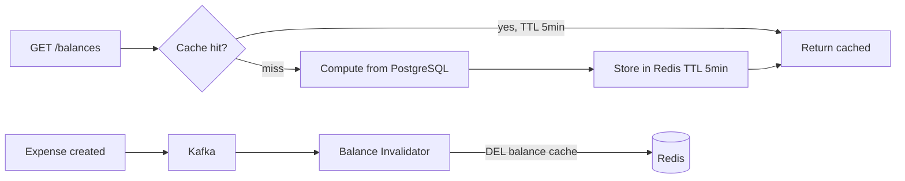
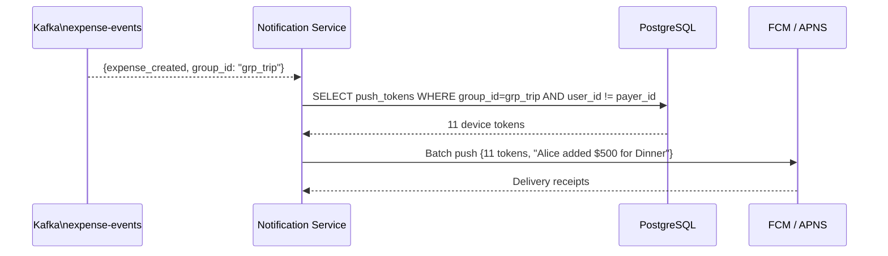

# Design Splitwise

Splitwise is an expense-splitting app that tracks shared expenses within groups — roommates, travel companions, couples — and tells each member who owes whom and how much. It feels simple on the surface, but it contains a genuinely interesting algorithmic problem (debt simplification), financial consistency requirements (expenses must never be partially written), and notification fanout challenges.

The question tests whether you can reason about financial data modeling, graph-based debt reduction algorithms, and cache invalidation for derived financial state — all of which matter at real scale.

---

## Functional Requirements

**In Scope:**
- Create and join groups (e.g., "NYC Apartment", "Europe Trip 2026")
- Add an expense: total amount, who paid, how to split (equal, exact amounts, percentages, shares)
- View group balances: simplified list of who owes whom and how much
- **Debt simplification:** reduce N pairwise debts to the minimum number of transactions needed to settle
- Record a settlement (mark a debt as paid outside the app)
- Activity feed: paginated list of recent expenses and settlements in a group
- Push notifications to group members when a new expense is added

**Out of Scope:**
- In-app payment processing (actual fund transfer via bank or card — Splitwise links to Venmo/PayPal but doesn't move money itself)
- Multi-currency expense splitting (mention architecture but don't deep-dive)
- Receipt scanning / OCR
- Recurring expenses (Splitwise Plus feature)
- External integrations (bank feed import)

---

## Non-Functional Requirements

| Property | Target | Reasoning |
|---|---|---|
| **Write Consistency** | Strong — expense creation must be atomic | A partial write (expense created, splits missing) corrupts every user's balance |
| **Read Latency** | p99 < 200ms for balances, < 100ms for activity feed | Users check balances regularly; perceived slowness erodes trust in financial data |
| **Availability** | 99.9% — best-effort degradation on group read failure | An unavailable balance view is bad UX; a missing expense write is worse |
| **Durability** | Zero expense data loss | Financial records are the product; losing them is unacceptable |
| **Scale** | 50M users, 5M active groups, 10M expense writes/day | Splitwise-class scale; not Twitter-scale, but requires thoughtful data modeling |
| **Notification Latency** | Push notifications delivered within 5 seconds of expense creation | Users expect to see the expense on their phone quickly |

**Key tradeoff:** Balances are **computed state** derived from expense splits and settlements — they're not stored as a single number. This means every balance query could trigger a join across many expense rows. The architectural question is: when and how aggressively do you cache derived balances?

---

## Capacity Estimation

**Writes:**
- 10M expenses/day → ~115 expenses/sec average; ~500/sec peak
- Average group size: 5 people → each expense creates 5 split rows
- 10M expenses × 5 splits = **50M split rows/day**

**Reads:**
- Balance checks: 50M users × 5 balance checks/day = 250M/day → **~2,900 reads/sec**
- Activity feed: similar volume to balance checks

**Storage:**
- Expense rows: 10M/day × 200 bytes = 2 GB/day → ~730 GB/year
- Split rows: 50M/day × 100 bytes = 5 GB/day → ~1.8 TB/year
- After 5 years: ~10 TB total — manageable in a sharded PostgreSQL cluster

**Groups:**
- 5M active groups × 50 KB average total expense data = **~250 GB** active working set
- Balance cache per group: 5M groups × 1 KB = **~5 GB** in Redis

---

## Core Entities

| Entity | Purpose | Key Fields |
|---|---|---|
| **User** | Registered account | `user_id`, `name`, `email`, `default_currency`, `push_token` |
| **Group** | A shared expense context | `group_id`, `name`, `created_by`, `created_at`, `currency` |
| **GroupMember** | Membership linking users to groups | `group_id`, `user_id`, `joined_at`, `left_at` |
| **Expense** | A single shared expense event | `expense_id`, `group_id`, `description`, `total_amount_cents`, `currency`, `paid_by`, `split_type`, `created_at`, `deleted_at` |
| **ExpenseSplit** | Each member's share of a specific expense | `split_id`, `expense_id`, `user_id`, `owed_amount_cents` |
| **Settlement** | A recorded repayment between two members | `settlement_id`, `group_id`, `payer_id`, `receiver_id`, `amount_cents`, `recorded_at` |

**Critical design notes:**
- **`Expense` and `ExpenseSplit` are always written together atomically.** An expense without splits is corrupt data.
- **Money is always stored as `BIGINT` in cents** (or the smallest currency unit) — never as `FLOAT` or `DECIMAL(10,2)`. Floating-point arithmetic on money causes penny discrepancies.
- `ExpenseSplit.owed_amount_cents` for the payer is their own share (what they consumed), not the full amount. The payer's *net benefit* is computed as `total_amount - their_split`, but this is a read-time derivation, not stored.

**Relationship:** `Balance` is not an entity — it's a **derived view** computed from `ExpenseSplit` and `Settlement`. This is the most important modeling decision in the entire design.

---

## Databases and Database Design

### Storage Tier Decisions

| Data | Access Pattern | Choice |
|---|---|---|
| Expenses, splits, settlements | Transactional writes, read-heavy queries | **PostgreSQL** |
| Computed group balances (cache) | Read-heavy, invalidated on every expense write | **Redis** |
| Activity feed (recent events) | Append-only, paginated reads | **PostgreSQL** (indexed) + Redis for hot groups |
| Push notification queue | Write-once, async consumer | **Kafka** |

### PostgreSQL — Core Schema

```sql
CREATE TABLE expenses (
  expense_id       UUID         PRIMARY KEY DEFAULT gen_random_uuid(),
  group_id         UUID         NOT NULL REFERENCES groups(group_id),
  description      TEXT         NOT NULL,
  total_amount_cents BIGINT     NOT NULL CHECK (total_amount_cents > 0),
  currency         TEXT         NOT NULL DEFAULT 'USD',
  paid_by          UUID         NOT NULL REFERENCES users(user_id),
  split_type       TEXT         NOT NULL,   -- 'equal' | 'exact' | 'percentage' | 'shares'
  created_by       UUID         REFERENCES users(user_id),
  created_at       TIMESTAMPTZ  DEFAULT NOW(),
  deleted_at       TIMESTAMPTZ              -- soft delete; never hard delete financial records
);

CREATE TABLE expense_splits (
  split_id          UUID    PRIMARY KEY DEFAULT gen_random_uuid(),
  expense_id        UUID    NOT NULL REFERENCES expenses(expense_id),
  user_id           UUID    NOT NULL REFERENCES users(user_id),
  owed_amount_cents BIGINT  NOT NULL CHECK (owed_amount_cents >= 0),
  UNIQUE (expense_id, user_id)
);

CREATE TABLE settlements (
  settlement_id  UUID         PRIMARY KEY DEFAULT gen_random_uuid(),
  group_id       UUID         NOT NULL REFERENCES groups(group_id),
  payer_id       UUID         NOT NULL REFERENCES users(user_id),
  receiver_id    UUID         NOT NULL REFERENCES users(user_id),
  amount_cents   BIGINT       NOT NULL CHECK (amount_cents > 0),
  currency       TEXT         NOT NULL DEFAULT 'USD',
  recorded_at    TIMESTAMPTZ  DEFAULT NOW()
);
```

**Invariant enforcement:** Validate at the application layer that `SUM(expense_splits.owed_amount_cents) == expenses.total_amount_cents` before committing. A single-cent rounding discrepancy compounds across millions of expenses. For equal splits: `floor(total / N)` for N-1 members; give the remainder to the last member (or the payer).

### Indexing Strategy

```sql
-- Fast lookup: all expenses in a group (activity feed, balance computation)
CREATE INDEX idx_expenses_group_created ON expenses (group_id, created_at DESC)
  WHERE deleted_at IS NULL;

-- Fast lookup: all splits for a given user in a group (balance computation)
CREATE INDEX idx_splits_user ON expense_splits (user_id);
CREATE INDEX idx_splits_expense ON expense_splits (expense_id);

-- Settlements between two users in a group
CREATE INDEX idx_settlements_group ON settlements (group_id, recorded_at DESC);
```

### Balance Computation Query

The net balance for user A within a group is derived entirely from expense splits and settlements:

```sql
-- Net balance for user A in group G
-- Positive = A is owed money; Negative = A owes money

SELECT
  COALESCE(SUM(CASE
    WHEN e.paid_by = :user_a    -- A paid, so split members owe A
      AND es.user_id != :user_a
      THEN es.owed_amount_cents
    WHEN e.paid_by != :user_a  -- Someone else paid, A owes them
      AND es.user_id = :user_a
      THEN -es.owed_amount_cents
    ELSE 0
  END), 0) AS net_balance_cents
FROM expense_splits es
JOIN expenses e ON es.expense_id = e.expense_id
WHERE e.group_id = :group_id
  AND e.deleted_at IS NULL
  AND (e.paid_by = :user_a OR es.user_id = :user_a);
```

**This query is O(expenses in group)** — expensive for large groups with years of history. This is why Redis caching is essential. The cache is keyed by `(group_id, user_id)` and invalidated on every new expense or settlement in that group.

### Replication and Consistency

- **Primary + 2 read replicas:** Expense creation goes to primary (strong consistency). Balance reads (after cache miss) go to primary or replicas — slight replication lag (< 100ms) is acceptable for balance reads.
- **Sharding:** Shard by `group_id` — all expenses and settlements for a group live on the same shard. Balance queries are always group-scoped, so no cross-shard joins.
- **At scale (10B+ expense rows):** Partition `expenses` and `expense_splits` by `created_at` month — old partitions become read-only, enabling archival and faster scans on recent data.

---

## API Design

**Add an expense to a group:**
```http
POST /v1/groups/{group_id}/expenses
Authorization: Bearer <token>
Idempotency-Key: client-uuid-xyz

{
  "description":   "Dinner at Nobu",
  "total_amount":  12500,           // in cents
  "currency":      "USD",
  "paid_by":       "user_alice_id",
  "split_type":    "equal",
  "participants":  ["user_alice_id", "user_bob_id", "user_charlie_id"]
}

201 Created
{
  "expense_id": "exp_abc123",
  "splits": [
    { "user_id": "user_alice_id",   "owed_amount": 4167 },
    { "user_id": "user_bob_id",     "owed_amount": 4167 },
    { "user_id": "user_charlie_id", "owed_amount": 4166 }
  ]
}
```

**Get simplified group balances:**
```http
GET /v1/groups/{group_id}/balances

200 OK
{
  "group_id": "grp_nyc_apt",
  "balances": [
    { "from": "user_bob_id",     "to": "user_alice_id", "amount_cents": 8334,  "currency": "USD" },
    { "from": "user_charlie_id", "to": "user_alice_id", "amount_cents": 12500, "currency": "USD" }
  ],
  "simplified": true,
  "computed_at": "2026-05-29T10:32:01Z"
}
```

**Record a settlement:**
```http
POST /v1/groups/{group_id}/settlements
{
  "payer_id":    "user_bob_id",
  "receiver_id": "user_alice_id",
  "amount_cents": 8334,
  "currency":    "USD"
}
// 201 Created — invalidates balance cache for this group
```

**Get activity feed (paginated):**
```http
GET /v1/groups/{group_id}/activity?limit=20&cursor=eyJ0...

200 OK
{
  "events": [
    { "type": "expense", "expense_id": "exp_abc", "description": "Dinner at Nobu", "amount": 12500, "paid_by": "Alice", "created_at": "..." },
    { "type": "settlement", "from": "Bob", "to": "Alice", "amount": 8334, "recorded_at": "..." }
  ],
  "next_cursor": "eyJ0c3..."
}
```

**Edit or delete an expense:**
```http
DELETE /v1/groups/{group_id}/expenses/{expense_id}
// Soft delete: sets deleted_at; does not physically remove rows (audit trail)
// Invalidates group balance cache
// 204 No Content
```

---

## High-Level Design



**Expense creation flow:**



**Component responsibilities:**
| Component | Role |
|---|---|
| **Expense Service** | Owns expense CRUD; validates split arithmetic; writes atomically; publishes Kafka events |
| **Balance Service** | Computes and serves group balances; manages Redis cache; runs debt simplification |
| **Balance Invalidator** | Kafka consumer; deletes cached balance on each new expense/settlement event |
| **Notification Service** | Kafka consumer; fans out push notifications to all group members per expense event |

---

## Deep Dives

### 1. Debt Simplification Algorithm

**The problem:** In a group of 5 people with a month of expenses, there may be 20 pairwise debt relationships. Settling each individually requires 20 Venmo transactions. Splitwise's "simplified debts" feature reduces this to the theoretical minimum.

**The algorithm — Net Balance + Greedy Matching:**

Step 1: Compute each person's **net balance** across all group expenses and settlements:
```
net[person] = (sum of all splits where others owe this person)
            - (sum of all splits where this person owes others)
            + (settlements received)
            - (settlements paid)

net > 0 → creditor (owed money)
net < 0 → debtor  (owes money)
net = 0 → settled
```

Step 2: Greedily match the largest debtor with the largest creditor:

```python
def simplify_debts(net_balances: dict) -> list:
    creditors = sorted([(bal, uid) for uid, bal in net_balances.items() if bal > 0], reverse=True)
    debtors   = sorted([(abs(bal), uid) for uid, bal in net_balances.items() if bal < 0], reverse=True)

    transactions = []
    i, j = 0, 0
    while i < len(creditors) and j < len(debtors):
        credit_amt, creditor = creditors[i]
        debt_amt,   debtor   = debtors[j]
        amount = min(credit_amt, debt_amt)
        transactions.append({"from": debtor, "to": creditor, "amount": amount})
        creditors[i] = (credit_amt - amount, creditor)
        debtors[j]   = (debt_amt   - amount, debtor)
        if creditors[i][0] == 0: i += 1
        if debtors[j][0]   == 0: j += 1
    return transactions  # minimum number of transactions to settle all debts
```

**Example — Group of 4:**

```
After a month of expenses, net balances:
Alice:   +$875 (creditor — owed the most)
Bob:     -$225 (debtor)
Charlie: -$325 (debtor)
Dave:    -$325 (debtor)

Simplified (3 transactions instead of 6 pairwise debts):
Charlie → Alice: $325
Dave    → Alice: $325
Bob     → Alice: $225
```

**Complexity:** O(N log N) for sorting + O(N) for greedy matching. For a group of 50 people, this is trivial. The algorithm is run at read time (on GET /balances) and the result cached.

**Tradeoff:** Debt simplification can route money through third parties — Bob might be asked to pay Charlie even though Bob and Charlie never shared an expense. Some users find this confusing. Splitwise offers it as an option, not a default.

---

### 2. Atomic Expense Creation and Split Arithmetic

**The problem:** An expense has N split rows. If the database write succeeds for the expense but fails partway through the splits, every user's balance is wrong. This is a classic partial-write problem.

**Solution:** Always write expense + all splits in a single PostgreSQL transaction. Either all rows commit or none do. There is no intermediate state visible to any reader.

```sql
BEGIN;
  INSERT INTO expenses (...) VALUES (...);
  INSERT INTO expense_splits VALUES (expense_id, user_alice,  4167);
  INSERT INTO expense_splits VALUES (expense_id, user_bob,    4167);
  INSERT INTO expense_splits VALUES (expense_id, user_charlie, 4166);  -- remainder goes here
COMMIT;
```

**Rounding rule:** For equal splits of $125.00 among 3 people:
- Naive: $41.67 each = $125.01 total (1 cent over)
- Correct: 2 people get $41.67; 1 person gets $41.66 (remainder goes to last or to payer)
- **Invariant:** `SUM(owed_amount_cents) == expense.total_amount_cents` — enforced via a DB constraint or pre-commit validation

**Idempotency:** The `POST /expenses` endpoint accepts an `Idempotency-Key` header. Before writing, check Redis for the key. If found, return the cached response without re-executing the write. This handles mobile clients retrying on network failure — a common source of duplicate expense creation.

---

### 3. Balance Cache: Invalidation on Every Write

**The problem:** Computing a group's balance from scratch requires scanning all `expense_splits` and `settlements` for that group — O(total expenses in group history). For a group 3 years old with thousands of expenses, this is expensive.

**Cache strategy:**



- Cache key: `group:{group_id}:balances`
- TTL: 5 minutes as a safety net (in case an invalidation event is missed)
- **Invalidation trigger:** Every `expense-created` and `settlement-created` Kafka event triggers an immediate cache delete for the affected group
- **Stampede protection:** When the cache is cold and multiple requests arrive simultaneously, use a Redis `SET NX` lock to allow only one request to recompute from DB; others wait 200ms and retry the cache

**Why not store running balances directly?**

Storing `balance(A, B) = X` as a mutable field requires updating it on every expense write. With concurrent writes from multiple users in the same group, this needs optimistic locking or serialized writes — a bottleneck. By computing from immutable append-only records (expenses, splits, settlements), writes are always non-conflicting inserts.

---

### 4. Kafka for Notifications: Required, Not Optional

**The problem:** When Alice adds a $500 group dinner expense to a 12-person travel group, 11 push notifications must be sent. If notification delivery is synchronous (blocking the API response), the expense creation API would take 500ms+ instead of 50ms.

**Why Kafka is the right choice here:**

- Expense creation is the critical path. Notification delivery is not — users tolerate a 2–5 second notification delay.
- Kafka decouples expense write speed from notification infrastructure reliability
- If the push notification provider (FCM/APNS) is slow or down, Kafka buffers the events; notifications catch up when the provider recovers
- The notification service is independently scalable: during a viral moment (New Year's Eve trip expense), notification throughput can spike without affecting expense write throughput

**Notification fanout pattern:**



- The notification service queries PostgreSQL for group members' push tokens once per expense event
- Uses FCM batch send (up to 500 tokens per request) — one HTTP call for all 11 recipients
- **Retry:** Kafka consumer offset is only committed after successful FCM delivery. On failure, the event is reprocessed. This gives at-least-once notification delivery — acceptable; duplicate notifications are better than missed ones.

---

### 5. Expense Deletion and Audit Trail

**The problem:** Users sometimes add incorrect expenses and want to delete them. But hard-deleting financial records is dangerous — you lose audit history, and other users may have already seen and acted on the expense.

**Soft delete pattern:**

```sql
-- "Deleting" an expense:
UPDATE expenses
SET deleted_at = NOW(), deleted_by = :user_id
WHERE expense_id = :expense_id AND group_id = :group_id;
-- The splits are NOT deleted — they remain as the record of what the expense contained

-- All balance queries filter: WHERE deleted_at IS NULL
-- Activity feed shows deleted expenses with a "removed" indicator
```

- `deleted_at IS NULL` filtered index ensures deleted expenses don't appear in reads
- The original expense + splits are permanently preserved for audit
- When an expense is deleted, its effect on all balances is neutralized — the cache is invalidated and the next balance computation ignores it
- **Editing an expense:** Implemented as a soft delete of the old version + insert of a new version (with a `parent_expense_id` link for the edit trail)

---

## Summary: Key Engineering Decisions

| Decision | Choice | Why |
|---|---|---|
| Balance storage | Derived (not stored) | Immutable append-only records avoid concurrent update races |
| Expense + splits write | Single PostgreSQL transaction | Partial writes corrupt every user's balance |
| Money representation | `BIGINT` in cents | Eliminates floating-point rounding errors across millions of expenses |
| Balance caching | Redis with event-driven invalidation | O(expenses) computation too expensive per request; Kafka invalidates on write |
| Debt simplification | Net balance + greedy matching | O(N log N); produces minimum transactions; computed at read time |
| Notification delivery | Kafka → Notification Service | Decouples critical write path from notification infrastructure reliability |
| Expense deletion | Soft delete (`deleted_at`) | Financial audit trail preserved; balance queries filter by `deleted_at IS NULL` |
| Sharding | By `group_id` | All queries are group-scoped; no cross-shard joins needed |

The most interview-distinguishing insight: **balance is derived state, not stored state**. Every design choice — the append-only expense writes, the Redis cache, the invalidation on Kafka events — flows from this single modeling decision. Get the data model right and the rest of the system follows naturally.
