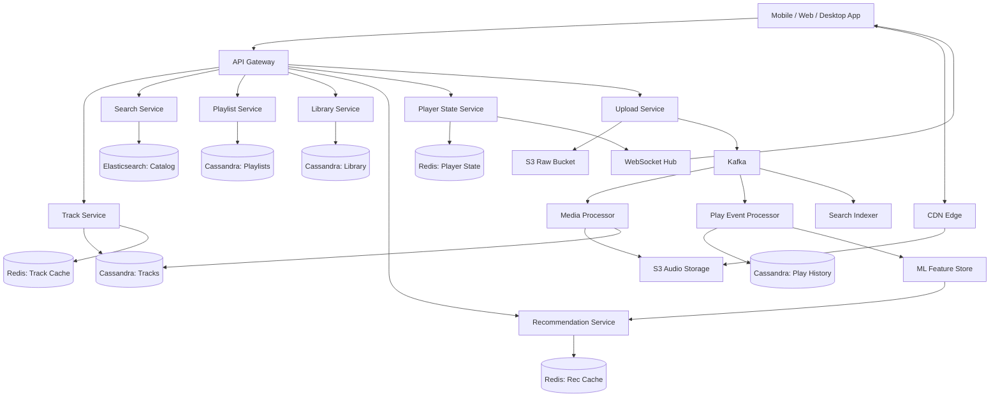
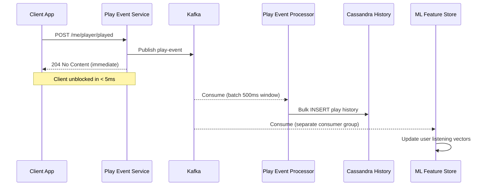
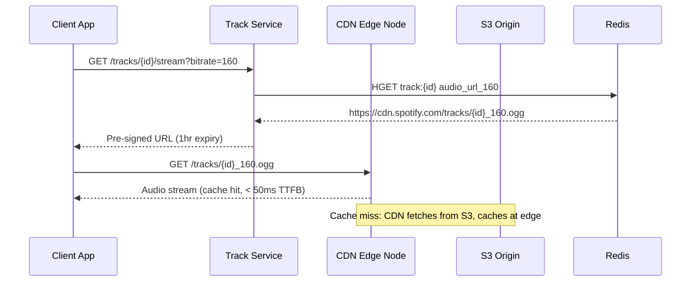
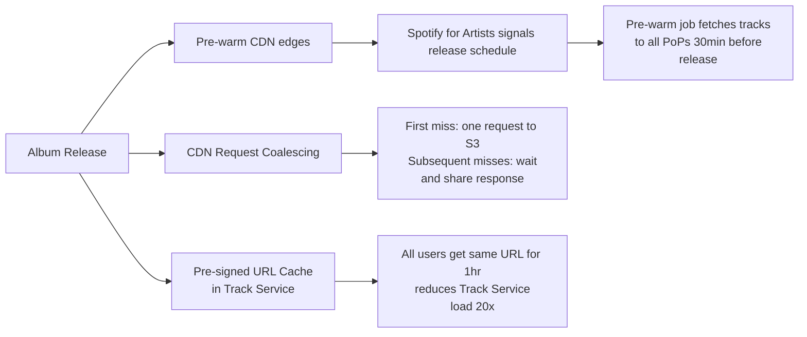
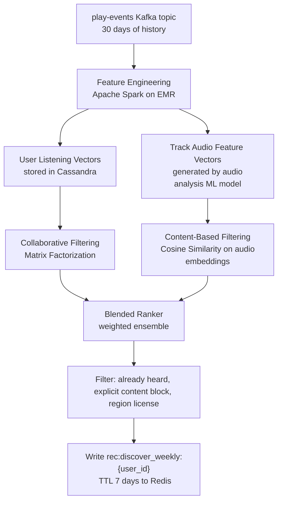
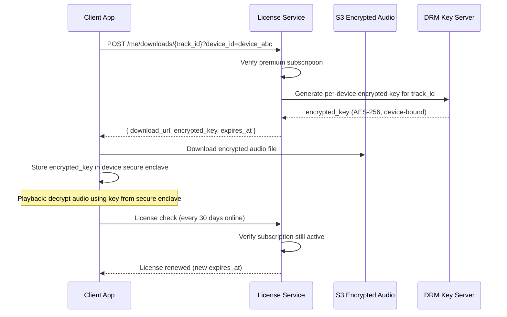
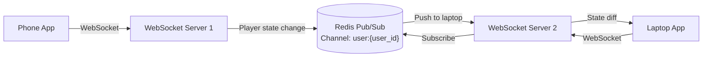

# Design Spotify

Spotify is the world's largest music streaming platform with **640 million users**, **252 million premium subscribers**, and a catalog of **100 million tracks** and **5 million podcast episodes**. Users stream audio on demand, download tracks for offline playback, and receive personalized recommendations like Discover Weekly.

The core engineering challenge is not just audio delivery — it is doing it at massive concurrency with sub-second playback start, perfect cross-device state sync, and a recommendation engine that feels personally tuned for each user.

This problem tests audio streaming pipelines, CDN edge architecture, event-driven recommendation systems, and the **thundering herd problem** — what happens when Taylor Swift drops a new album.

---

## Functional Requirements

**In Scope:**
- Stream audio tracks on demand (adaptive bitrate based on network conditions)
- Search tracks, albums, artists, podcasts, and playlists
- Create, edit, and share playlists
- Like/save tracks to personal library
- Download tracks for offline playback (premium only)
- Personalized recommendations: Discover Weekly, Daily Mixes, Radio
- Cross-device playback: pause on phone, resume on laptop
- Podcast streaming and episode management
- Artist and album browse pages

**Out of Scope:**
- Live audio / DJ sessions
- Video podcasts rendering pipeline
- Ad insertion engine (programmatic ad targeting)
- Royalty accounting and payout systems
- Social features (following artists not counting toward feed system)
- Lyrics display backend (licensed third-party provider)

---

## Non-Functional Requirements

| Property | Target | Reasoning |
|---|---|---|
| **Playback Start Latency** | < 200ms (cached), < 1s (cold) | Users abandon if audio doesn't start within 1 second |
| **Search Latency** | p99 < 150ms | Typeahead and instant results require near-real-time responses |
| **Availability** | 99.99% for streaming | Stream interruptions are user-visible failures — highly damaging |
| **Durability** | Zero audio file loss | Master audio tracks are irreplaceable; multi-region replication required |
| **Consistency** | Eventual for play counts/likes; strong for subscription state | Stale like counts are tolerable; wrong premium status causes revenue loss |
| **Offline Sync** | Downloads available within 30s of request | Offline is a core premium differentiator |
| **Concurrent Streams** | 15–20M simultaneous streams at peak | Architecture must handle pop-star release spikes without degradation |
| **Personalization Freshness** | Discover Weekly refreshed weekly; Radio updated near real-time | Batch ML jobs dominate; real-time signals tune Radio |

**The defining tradeoff:** Spotify's architecture splits neatly into two latency domains. **Hot path** (stream a track, search catalog, sync queue) requires sub-second p99 latency and is served entirely from caches and CDN. **Cold path** (generate Discover Weekly, update artist stats, process play events) is async and batch — driven by Kafka and offline ML pipelines. Keeping these paths isolated is the key architectural decision.

---

## Capacity Estimation

**Streaming:**
- 640M users; assume 400M MAU; 80M DAU
- Average 30 min of listening/day → 80M × 30 = 2.4B minutes/day → 40M minutes/hour
- Peak: 3× average = 120M minutes/hour → **~20M concurrent streams**
- Bitrates: 96 kbps (mobile low), 160 kbps (default), 320 kbps (premium)
- Weighted average bitrate: ~160 kbps → 1.2 MB/minute → **24 GB/sec egress at peak** (served almost entirely from CDN)

**Catalog Storage:**
- 100M tracks × average 3.5 minutes × 3 quality tiers
  - 96 kbps: 4 MB/track; 160 kbps: 6.7 MB; 320 kbps: 13.4 MB
  - Total per track across all tiers: ~24 MB
- 100M tracks × 24 MB = **~2.4 PB** of audio storage on S3
- ~60K new tracks uploaded/day → ~1.5 TB/day net new audio

**Play Events:**
- 80M DAU × 15 tracks/session = 1.2B play events/day → **~14,000 events/sec**
- Each event: ~200 bytes → ~2.8 MB/sec Kafka ingestion rate

**Search:**
- 80M DAU × 5 searches/day = 400M searches/day → **~4,600 searches/sec**

---

## Core Entities

| Entity | Purpose | Key Fields |
|---|---|---|
| **User** | Account, preferences, subscription status | `user_id`, `email`, `username`, `subscription_tier`, `country`, `created_at` |
| **Track** | A single audio recording | `track_id`, `title`, `artist_ids[]`, `album_id`, `duration_ms`, `audio_urls{}`, `explicit`, `release_date`, `play_count` |
| **Album** | Collection of tracks released together | `album_id`, `title`, `artist_id`, `release_date`, `cover_url`, `track_ids[]` |
| **Artist** | Musician or band profile | `artist_id`, `name`, `bio`, `profile_image_url`, `genres[]`, `monthly_listeners` |
| **Playlist** | User-curated or Spotify-curated track list | `playlist_id`, `owner_id`, `name`, `description`, `track_ids[]`, `is_public`, `collaborative` |
| **Library** | User's saved tracks, albums, podcasts | `user_id`, `entity_id`, `entity_type`, `saved_at` |
| **PlayEvent** | A record of a track being played | `event_id`, `user_id`, `track_id`, `played_at`, `duration_played_ms`, `source` (radio, playlist, search) |
| **DownloadedTrack** | Encrypted offline copy tied to device | `user_id`, `device_id`, `track_id`, `encrypted_key`, `downloaded_at`, `expires_at` |
| **PlayerState** | Cross-device sync of current playback | `user_id`, `active_device_id`, `current_track_id`, `position_ms`, `queue[]`, `updated_at` |
| **Podcast Episode** | Podcast content unit | `episode_id`, `show_id`, `title`, `audio_url`, `duration_ms`, `published_at` |

**Critical modeling decisions:**
- `audio_urls` on Track is a JSON map of `{ "96": "s3://...", "160": "s3://...", "320": "s3://..." }` — storing all quality tiers inline avoids a join on every stream request.
- `PlayEvent` is append-only and write-heavy — never updated, only inserted. This dictates the database choice.
- `PlayerState` is the hardest entity to keep consistent across devices. Last-write-wins with a `updated_at` timestamp is the production approach; the latest state always wins.

---

## Databases and Database Design

### Storage Tier Decisions

| Data | Access Pattern | Engine | Why |
|---|---|---|---|
| User profiles, subscriptions | Point reads, critical consistency for billing | **PostgreSQL** | ACID, relational integrity; subscription state must be exact |
| Track and album metadata | Read-heavy, catalog rarely changes | **Cassandra** | Wide-column; partition by `track_id` for O(1) lookups; scales reads horizontally |
| Artist profiles | Read-heavy, relatively small dataset | **PostgreSQL** | Simple; fits in memory; complex queries for artist dashboards |
| User library (saved tracks) | High write throughput, per-user scan | **Cassandra** | Partition by `user_id`; O(1) user library page loads |
| Playlist entries | Per-playlist ordered read, high write | **Cassandra** | Partition by `playlist_id`; clustering on `position` for ordering |
| Play history / events | Append-only, time-series, massive volume | **Cassandra** | Time-series partitioning by `(user_id, month)`; never updated |
| Player state (queue, device) | Sub-millisecond read/write, small payload | **Redis** | In-memory; HSET/HGET for instant cross-device sync |
| Catalog search | Full-text, faceted, typeahead | **Elasticsearch** | Inverted index for text search; aggregations for facets |
| Audio files (master + variants) | Write-once, read-many, PB scale | **S3 + CDN** | Object storage natively scales; CDN delivers at edge |
| Recommendation features | Batch reads for ML feature store | **Apache Cassandra + Parquet on S3** | Feature store reads; batch training from Parquet |
| Recently played, cache | Sub-ms read latency, short TTL | **Redis** | LRANGE on sorted list per user; TTL auto-evicts |

### Schema 1 — Track Metadata (Cassandra)

```sql
CREATE TABLE tracks (
  track_id    UUID,
  title       TEXT,
  artist_ids  LIST<UUID>,
  album_id    UUID,
  duration_ms INT,
  audio_urls  MAP<TEXT, TEXT>,   -- { '96': 's3://...', '160': 's3://...', '320': 's3://...' }
  explicit    BOOLEAN,
  genres      LIST<TEXT>,
  release_date DATE,
  play_count  COUNTER,
  PRIMARY KEY (track_id)
);
```

All track fetches are single-partition point reads by `track_id` — never a table scan. `play_count` uses a Cassandra COUNTER type for atomic increments without read-modify-write.

### Schema 2 — User Library (Cassandra)

```sql
CREATE TABLE user_library (
  user_id     UUID,
  saved_at    TIMESTAMP,
  entity_id   UUID,
  entity_type TEXT,   -- 'track' | 'album' | 'podcast' | 'playlist'
  PRIMARY KEY (user_id, saved_at)
) WITH CLUSTERING ORDER BY (saved_at DESC);
```

Partitioned by `user_id` — the entire library for a user lives on one partition and is paged with a cursor on `saved_at`. Reverse chronological order serves the "Your Library" view directly.

### Schema 3 — Play History (Cassandra)

```sql
CREATE TABLE play_history (
  user_id          UUID,
  year_month       TEXT,    -- '2026-05' for partition bucketing
  played_at        TIMESTAMP,
  track_id         UUID,
  duration_played  INT,
  source           TEXT,    -- 'playlist' | 'radio' | 'search' | 'album'
  PRIMARY KEY ((user_id, year_month), played_at)
) WITH CLUSTERING ORDER BY (played_at DESC);
```

**Why composite partition key:** Partitioning only by `user_id` creates unbounded partition growth (a user listening for 5 years has millions of events on one partition). Bucketing by `(user_id, year_month)` caps partition size and enables efficient monthly scan for the ML feature pipeline.

### Schema 4 — Playlists (Cassandra)

```sql
CREATE TABLE playlist_metadata (
  playlist_id  UUID PRIMARY KEY,
  owner_id     UUID,
  name         TEXT,
  description  TEXT,
  is_public    BOOLEAN,
  cover_url    TEXT,
  track_count  INT,
  created_at   TIMESTAMP,
  updated_at   TIMESTAMP
);

CREATE TABLE playlist_tracks (
  playlist_id UUID,
  position    INT,
  track_id    UUID,
  added_by    UUID,
  added_at    TIMESTAMP,
  PRIMARY KEY (playlist_id, position)
) WITH CLUSTERING ORDER BY (position ASC);
```

Reordering tracks in a playlist rewrites `position` values — for playlists over 10K tracks, this is done with sparse float positions (like Notion's fractional indexing) to avoid full rewrites.

### Schema 5 — Users (PostgreSQL)

```sql
CREATE TABLE users (
  user_id           UUID         PRIMARY KEY DEFAULT gen_random_uuid(),
  email             VARCHAR(255) UNIQUE NOT NULL,
  username          VARCHAR(50)  UNIQUE NOT NULL,
  subscription_tier VARCHAR(20)  NOT NULL DEFAULT 'free',  -- 'free' | 'premium' | 'family' | 'student'
  country_code      CHAR(2)      NOT NULL,
  date_of_birth     DATE,
  created_at        TIMESTAMPTZ  DEFAULT NOW(),
  last_login        TIMESTAMPTZ
);

CREATE UNIQUE INDEX idx_users_email    ON users (email);
CREATE UNIQUE INDEX idx_users_username ON users (username);
CREATE INDEX        idx_users_country  ON users (country_code);
```

PostgreSQL for users because subscription tier is billing-critical — eventual consistency here means users might access premium content they haven't paid for (revenue leak) or be denied content they have paid for (churn).

### Schema 6 — Player State (Redis)

```
HSET player_state:{user_id}
  active_device_id  "device_abc"
  current_track_id  "track_xyz"
  position_ms       "142000"
  is_playing        "true"
  shuffle           "false"
  repeat_mode       "off"
  updated_at        "1717000000000"

EXPIRE player_state:{user_id} 86400   -- 24h TTL; re-set on any update
```

The entire player state is a Redis Hash — a single `HGETALL` returns everything needed to resume playback on a new device. `updated_at` millisecond timestamp enables last-write-wins conflict resolution.

### Sharding, Partitioning, and Replication

| Store | Shard Key | Strategy | Replication |
|---|---|---|---|
| PostgreSQL (users) | `user_id` | Range sharding, 16 shards; PgBouncer connection pool | Primary + 2 read replicas per shard |
| Cassandra (tracks, library, history, playlists) | Partition key (per table, see above) | Consistent hashing (Murmur3); RF=3, LOCAL_QUORUM | 3 replicas per DC; 2 DCs |
| Elasticsearch (catalog) | `track_id` / `artist_id` | 5 primary shards per index; 1 replica | Active-active across 2 AZs |
| Redis (player state, cache) | `user_id` | Redis Cluster hash slots | 1 replica per primary shard |
| S3 (audio files) | Managed internally (AWS) | Object storage | S3 cross-region replication |

---

## API Design

**Stream a track (get streaming URL):**
```http
GET /v1/tracks/{track_id}/stream?bitrate=160&device_id=device_abc
Authorization: Bearer <token>

200 OK
{
  "track_id": "track_xyz",
  "stream_url": "https://cdn.spotify.com/tracks/track_xyz_160.ogg?X-Amz-Expires=3600&X-Amz-Signature=...",
  "duration_ms": 210000,
  "bitrate": 160,
  "expires_at": "2026-05-29T14:00:00Z"
}
```

The client streams directly from the CDN using a pre-signed URL — the Track Service never proxies audio bytes. URL is valid for 1 hour; client requests a new one transparently on expiry.

**Search catalog:**
```http
GET /v1/search?q=taylor+swift&types=track,artist,album,playlist&limit=10
Authorization: Bearer <token>

200 OK
{
  "tracks": {
    "items": [{ "track_id": "...", "title": "Anti-Hero", "artist": "Taylor Swift", "album": "Midnights", "duration_ms": 200693 }],
    "total": 42
  },
  "artists": { "items": [{ "artist_id": "...", "name": "Taylor Swift", "monthly_listeners": 82000000 }] },
  "albums": { "items": [...] }
}
```

**Save track to library (idempotent):**
```http
PUT /v1/me/tracks/{track_id}
Authorization: Bearer <token>

204 No Content
// INSERT IF NOT EXISTS in Cassandra — re-saving is a no-op
```

**Create playlist:**
```http
POST /v1/me/playlists
Authorization: Bearer <token>
Content-Type: application/json

{ "name": "Morning Run", "description": "High BPM only", "public": true }

201 Created
{ "playlist_id": "pl_abc", "name": "Morning Run", "owner": { "user_id": "..." }, "track_count": 0 }
```

**Add tracks to playlist:**
```http
POST /v1/playlists/{playlist_id}/tracks
Authorization: Bearer <token>

{ "track_ids": ["track_1", "track_2"], "position": 0 }

201 Created
{ "snapshot_id": "snap_xyz" }
// snapshot_id enables playlist versioning for collaborative edit conflict detection
```

**Record play event:**
```http
POST /v1/me/player/played
Authorization: Bearer <token>

{ "track_id": "track_xyz", "duration_played_ms": 198000, "source": "playlist", "playlist_id": "pl_abc" }

204 No Content
// Async: event written to Kafka, not directly to DB — no client-facing latency penalty
```

**Get personalized recommendations:**
```http
GET /v1/me/recommendations?seed_tracks=track_1,track_2&limit=20
Authorization: Bearer <token>

200 OK
{
  "tracks": [{ "track_id": "...", "title": "...", "artist": "...", "recommendation_reason": "Based on your listening" }],
  "generated_at": "2026-05-29T12:00:00Z"
}
```

**Update player state (cross-device sync):**
```http
PUT /v1/me/player
Authorization: Bearer <token>

{ "device_id": "device_laptop", "current_track_id": "track_xyz", "position_ms": 142000, "is_playing": true }

204 No Content
// HSET in Redis; all other active devices receive WebSocket push with new state
```

---

## High-Level Design



**Component responsibilities:**

| Component | Role |
|---|---|
| **API Gateway** | JWT validation, subscription tier enforcement, rate limiting, request routing |
| **Track Service** | Fetches track metadata, generates pre-signed CDN URLs for streaming |
| **Search Service** | Queries Elasticsearch for tracks, artists, albums, playlists; handles autocomplete |
| **Playlist Service** | CRUD for playlists; manages `playlist_tracks` ordering and collaborative edits |
| **Library Service** | Saves and reads user library; handles idempotent save operations |
| **Player State Service** | Reads/writes Redis player state; pushes state changes via WebSocket to other devices |
| **Upload Service** | Accepts audio uploads from Spotify for Artists; publishes to Kafka for async processing |
| **Media Processor** | Kafka consumer; transcodes raw audio into 3 bitrate variants; writes to S3; updates track metadata |
| **Play Event Processor** | Kafka consumer; persists play history to Cassandra; updates ML feature store |
| **Search Indexer** | Kafka consumer; indexes new/updated tracks in Elasticsearch |
| **Recommendation Service** | Serves cached recommendations; triggers ML pipeline refresh |
| **WebSocket Hub** | Maintains persistent connections per user; pushes player state changes across devices |

---

## Deep Dives

### 1. Kafka: The Spine of the Async Pipeline

Kafka is required and central. Every audio upload, every play event, and every search index update flows through Kafka — decoupling write-time producers from read-time consumers with different latency and reliability requirements.

**Topic design:**

| Topic | Partition Key | Consumers | Retention |
|---|---|---|---|
| `track-uploaded` | `track_id` | Media Processor, Search Indexer | 7 days |
| `track-processed` | `track_id` | Search Indexer, Notification (artist) | 7 days |
| `play-events` | `user_id` | Play Event Processor, ML Feature Pipeline, Analytics | 30 days |
| `player-state-changed` | `user_id` | WebSocket Hub (cross-device push) | 1 hour |

**Why Kafka for play events:**

14,000 play events/second hitting Cassandra directly would require heavy over-provisioning. Instead, the Play Event Processor batches events in micro-batches (500ms windows) and bulk-inserts into Cassandra. The ML pipeline reads from the `play-events` topic independently — no coupling.



**Play event as a platform primitive:** Every stream count, royalty calculation, recommendation signal, and chart ranking starts as a `play-event`. Kafka's 30-day retention means the analytics team can replay events for backfilling new metrics without touching the production DB.

**Backpressure:** When the ML feature store consumer falls behind (training run monopolizing resources), Kafka buffers the backlog. The consumer catches up after training finishes — no data loss, no impact on the streaming hot path.

---

### 2. Redis: Caching Strategies and Session Management

Redis serves three distinct roles at Spotify, each with a different pattern.

**a) Track Metadata Cache — Cache-Aside with Long TTL**

Track metadata rarely changes after release. Cache it aggressively:

```
HSET track:{track_id}  title "Anti-Hero"  duration_ms 200693  album_id "..."  audio_url_160 "https://cdn..."
EXPIRE track:{track_id} 86400    -- 24-hour TTL; re-set on any metadata update
```

Cache hit rate is ~99%+ for popular tracks. Cache miss triggers a Cassandra read and repopulates the cache. For catalog updates (new album release), the Track Service does an explicit `DEL track:{track_id}` followed by a cache repopulation — write-through on updates.

**b) Player State Cache — Last-Write-Wins Hash**

The player state is the most latency-sensitive Redis interaction in the system:

```
HSET player_state:{user_id}  active_device "laptop_1"  track_id "track_xyz"  
                              position_ms "142000"  is_playing "1"  updated_at "1717000000000"
EXPIRE player_state:{user_id} 86400
```

Cross-device sync flow:
- Phone pauses → `HSET player_state:{user_id} is_playing 0 updated_at {now}`
- Player State Service publishes to `player-state-changed` Kafka topic
- WebSocket Hub consumes event; pushes state diff to all active WebSocket connections for that user
- Laptop receives push; pauses local playback

**Why Redis over a database:** Player state is updated on every seek, skip, pause, and volume change. A power user might trigger 100+ state writes per hour. Cassandra or PostgreSQL would be overloaded; Redis handles millions of HSET/sec trivially.

**c) Recommendation Cache — User-Scoped TTL**

Discover Weekly and Daily Mix recommendations are precomputed by the ML pipeline weekly/daily:

```
SET rec:discover_weekly:{user_id}  {json_array_of_track_ids}  EX 604800   -- 7 days TTL
SET rec:daily_mix:{user_id}        {json_array_of_track_ids}  EX 86400    -- 24h TTL
```

When the Recommendation Service gets a cache miss (new user, or TTL expired early due to memory pressure), it falls back to a generic top-tracks-for-genre response based on the user's country and top genres. Sub-optimal but never an error.

**d) Rate Limiting — Token Bucket per User**

```
-- Check and decrement token bucket for API rate limiting
EVAL "
  local tokens = tonumber(redis.call('GET', KEYS[1]) or 100)
  if tokens > 0 then redis.call('DECR', KEYS[1]) redis.call('EXPIRE', KEYS[1], 60) return 1 end
  return 0
" 1 rate:{user_id}
```

Free-tier users are rate-limited on API calls to prevent scraping. Lua scripts ensure the check-and-decrement is atomic — no race condition between two concurrent requests both reading `tokens > 0`.

**Cache invalidation summary:**

| Cache | Strategy | Invalidation Trigger | TTL |
|---|---|---|---|
| Track metadata | Cache-aside + write-through on update | Explicit DEL on metadata update | 24 hours |
| Player state | Write-through (every state change) | EXPIRE reset on every write | 24 hours |
| Discover Weekly | Pre-populated by ML batch job | TTL expiry + explicit SET on regen | 7 days |
| Daily Mix | Pre-populated by ML batch job | TTL expiry + explicit SET on regen | 24 hours |
| Recently played | LPUSH + LTRIM (capped list) | Auto-evict oldest entry at 50 items | No TTL |
| Artist profile | Cache-aside | Explicit DEL on artist metadata update | 6 hours |

---

### 3. Audio Streaming: CDN, Adaptive Bitrate, and the Thundering Herd

**The happy path:**



The Track Service never proxies audio. It returns a pre-signed CDN URL — the client streams from the nearest CDN edge node. This is why Spotify starts playing within 200ms: the CDN edge is typically <20ms from the client.

**Adaptive Bitrate:**
- Client monitors available bandwidth every 10 seconds
- On degradation: switches from `_320.ogg` → `_160.ogg` → `_96.ogg` seamlessly mid-stream
- Transition is implemented by requesting the next CDN segment at the lower bitrate URL
- No server-side logic required — purely client-driven with server-provided URLs for all tiers

**The Thundering Herd — New Album Drop:**

Taylor Swift releases a new album at midnight. Within 60 seconds, 20M users request the same 12 tracks simultaneously. All CDN edges for those `track_id` entries are cold.

Without mitigation, 20M requests hit S3 origin simultaneously — causing S3 throttling and cascading failure.

**Solutions:**



1. **CDN pre-warming:** Spotify for Artists requires release dates in advance. 30 minutes before release, a pre-warm job fetches all tracks to CDN PoPs globally. By release time, CDN is already hot.

2. **Request coalescing at CDN:** CDN is configured so that multiple simultaneous cache-miss requests for the same object result in exactly **one** origin request. All waiting requests receive the response when the origin fetch completes. Reduces S3 load from 20M to 1 request per CDN edge node.

3. **Pre-signed URL deduplication:** For any given `track_id + bitrate`, the Track Service caches the same pre-signed URL in Redis for 50 minutes. All 20M requests get the same URL — the Track Service handles 20M → 1 URL generation, not 20M → 20M.

**Tradeoff:** Pre-signing a shared URL means all users get the same URL — no per-user access control on the CDN layer. Spotify mitigates this by not embedding the URL in any permanent resource; URLs expire in 1 hour and are never logged with PII.

---

### 4. Personalization: Discover Weekly and the ML Pipeline

Discover Weekly is generated weekly per user — a batch job, not a real-time system.



**Key insight:** Discover Weekly is not computed at query time. The Recommendation Service at request time does a single Redis GET — if hit, return; if miss, return generic fallback. The entire ML pipeline runs asynchronously offline.

**Scaling the batch job:**
- 640M users × weekly batch = ~91M users/day to regenerate
- Spark on EMR with auto-scaling; partitioned by `user_id` hash range
- Wall clock time: ~6 hours for full regen; rolling update, not all-at-once
- Users in timezone UTC+0 get their Monday update Monday morning; UTC+5:30 users get it slightly later — acceptable

**Real-time signals for Radio:** While Discover Weekly is weekly, Radio (continuous station) adapts in near-real-time. After each track completes, the client sends a play event. A lightweight online model (bandit algorithm) adjusts the next-track probability distribution based on the last 5 play/skip signals. This runs in <100ms using precomputed track similarity matrices cached in Redis.

---

### 5. Offline Downloads and DRM

Premium users can download up to 10,000 tracks across 5 devices.

**The challenge:** Downloaded files must be unplayable if:
- Subscription lapses
- User logs out the device
- File is copied to another device

**Implementation:**



- Audio files on S3 are stored encrypted at rest (AES-256). The Track Service CDN URL serves the encrypted file even to premium streamers — decryption happens client-side using a device-bound key.
- License check every 30 days requires an internet connection. If the check fails (subscription lapsed), the encrypted key is invalidated in the device secure enclave and downloads become unplayable.
- `expires_at` on `DownloadedTrack` is set 30 days from download. Client renews silently in background; if renewal fails 3 times, prompts user.

**Why not server-side decryption:** Decrypting on Spotify's servers and streaming plaintext would mean Spotify handles all DRM enforcement in real time — defeating the purpose of offline mode and multiplying server costs.

---

### 6. Cross-Device Sync and WebSocket Scaling

**The problem:** A user pausing on their phone should pause on their laptop instantly. This requires a persistent connection from every active device to a server — **WebSockets**.

**WebSocket scaling challenge:** WebSockets are long-lived, stateful connections. A naive approach with sticky routing to a single server means that server becomes a SPOF. At 20M concurrent streams × ~2 active devices = 40M WebSocket connections.

**Solution: Fan-out via Redis Pub/Sub**



- Each WebSocket server maintains an in-memory map of `user_id → [connection_1, connection_2, ...]`
- When phone sends a state update, its WebSocket server publishes to Redis channel `user:{user_id}`
- All WebSocket servers subscribed to that channel receive the message and push to their local connections for that user
- No cross-server RPC needed — Redis Pub/Sub handles fan-out

**Scaling numbers:**
- 40M WebSocket connections; each WebSocket server handles ~50K connections → **800 WebSocket server instances**
- Redis Pub/Sub throughput: ~1M messages/sec per Redis node; player state changes peak at ~1M/sec → 1–2 dedicated Redis nodes for Pub/Sub

**Connection recovery:** When a client reconnects (network switch, app resume), it sends its last known `updated_at`. The Player State Service compares with Redis and pushes a full state refresh if the client is stale. This makes the sync protocol **idempotent** — reconnects are indistinguishable from heartbeats.

---

### 7. Rate Limiting and Abuse Prevention

| Layer | Mechanism | Limit | Why |
|---|---|---|---|
| **API Gateway** | Token bucket per `user_id` in Redis | 300 req/min per user | Block scraping and credential stuffing |
| **Search Service** | Sliding window per IP | 60 searches/min per IP | Catalog scraping prevention |
| **Stream URL Service** | Per-track URL cache (shared pre-signed URL) | N/A | Limits Track Service load on popular tracks |
| **Download API** | Fixed limit in DB | 10,000 tracks / 5 devices per user | Business rule; enforced at application layer |
| **Play Event API** | Minimum 30s between same-track events | Server-side dedup by `(user_id, track_id, minute)` | Prevent artificial stream count inflation |

Play count fraud (replaying tracks to inflate royalty payouts) is a real attack vector. The dedup check — `(user_id, track_id, minute)` stored as a Redis SET with 5-minute TTL — catches simple replay attacks. Statistical anomaly detection in the ML pipeline catches sophisticated bot farms.

---

## Summary: Key Architectural Decisions

| Decision | Choice | Core Reason |
|---|---|---|
| Audio delivery | CDN pre-signed URLs, client-side streaming | Never proxy audio; CDN scales infinitely |
| Track metadata storage | Cassandra | Horizontal read scale; O(1) point reads; COUNTER type for play_count |
| Play event ingestion | Kafka → batch Cassandra insert | Absorbs 14K/sec; decouples DB write pressure |
| Player state storage | Redis Hash | Sub-ms reads; HSET for atomic partial updates |
| Recommendations | Offline Spark batch → Redis cache | ML accuracy at offline compute cost; zero query-time ML |
| Search | Elasticsearch | Full-text, faceted, autocomplete; Cassandra cannot do text search |
| DRM / Offline | Per-device AES key in secure enclave | Licenses enforceable without server; copy-proof |
| Cross-device sync | Redis Pub/Sub + WebSocket fan-out | Stateless WebSocket servers; horizontal scaling |
| Thundering herd | CDN pre-warm + request coalescing + URL dedup | Three complementary layers; no single point of failure |
