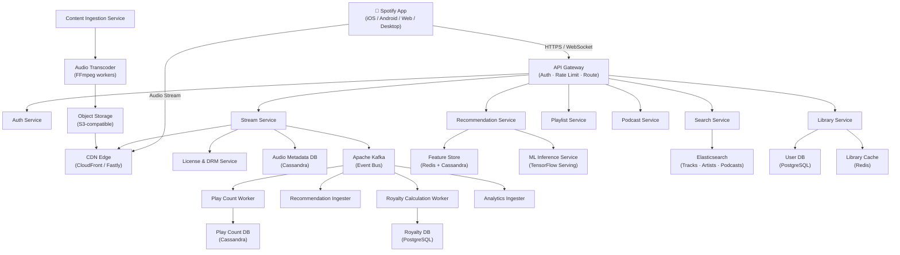
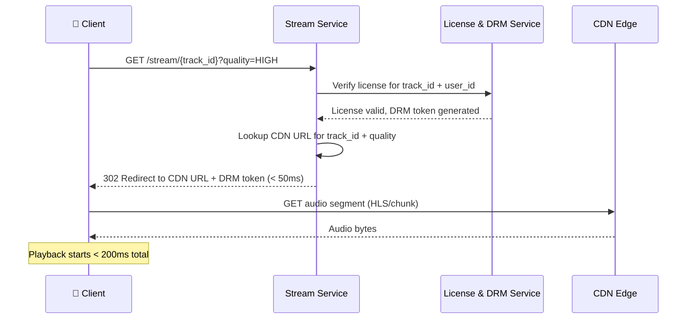
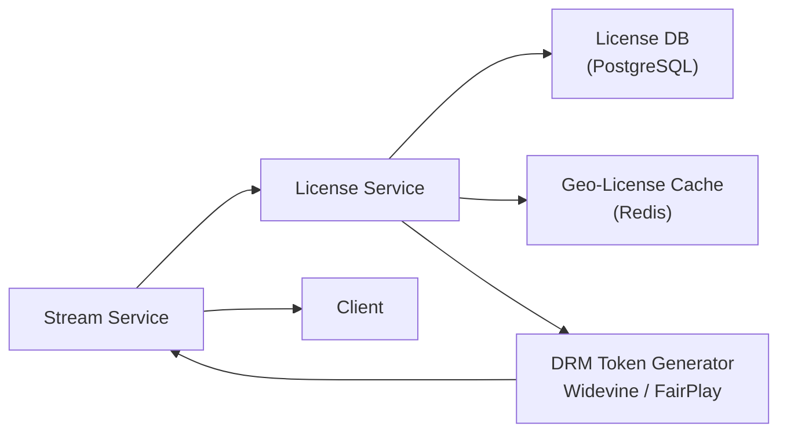
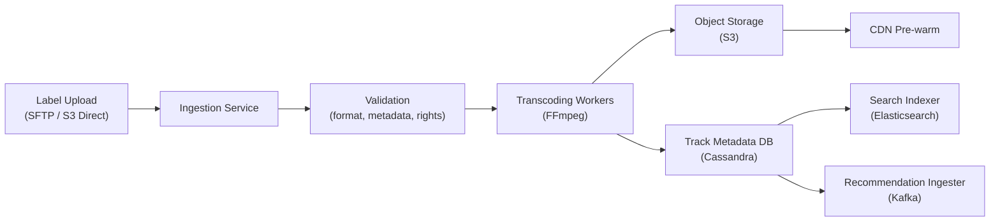
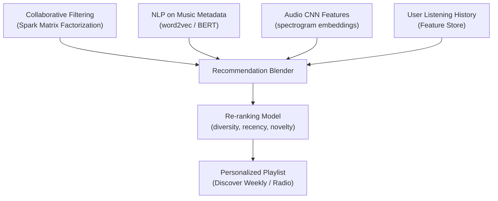
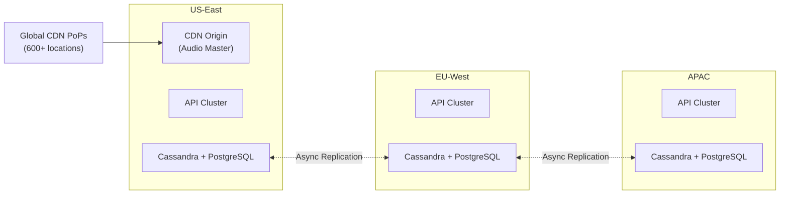
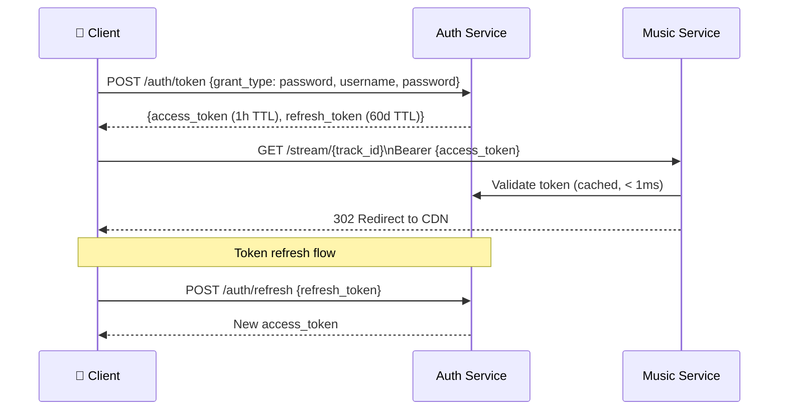
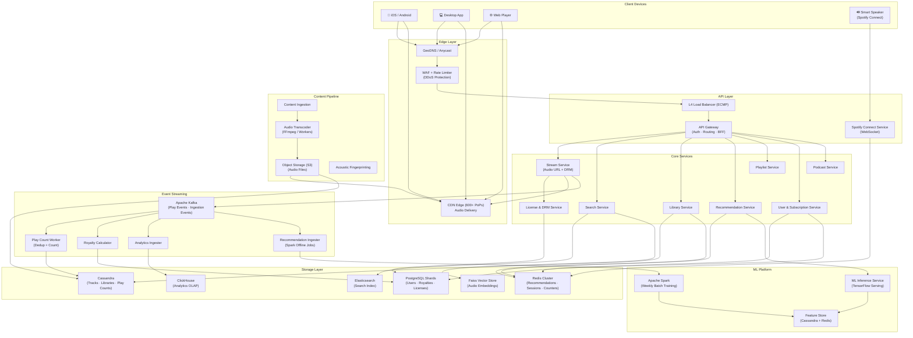

# Designing Spotify: A Production-Scale Music Streaming Platform

> **Difficulty:** Medium | **Category:** Media Streaming / Content Delivery | **Companies:** Apple Music, YouTube Music, Amazon Music, Tidal, SoundCloud

---

## Introduction

Spotify is the world's largest music streaming platform — **600 million+ monthly active users**, **100 million+ songs**, **5 million+ podcasts**, and **4 billion+ playlists**. Users stream on-demand music, discover new tracks through recommendations, and build personal libraries — all with sub-second audio start times even on mobile networks.

What makes Spotify an exceptional system design problem is the **unique intersection of challenges**:

1. **Low-latency media streaming** — audio must start within 200ms of pressing play, buffered smoothly across variable network conditions
2. **Massive personalization** — Discover Weekly, Wrapped, Daily Mix — hyper-personalized recommendations for 600M users
3. **Global content delivery** — serving lossless audio from servers to 180+ countries at petabyte scale
4. **Rights management** — every stream must be counted, verified against licensing agreements, and invoiced to rights holders
5. **Offline support** — downloaded tracks must remain playable when the license expires

Spotify's architecture is also a fascinating case study in **microservices at scale** — they were one of the early adopters of the microservices pattern (200+ services) and have publicly shared lessons from both its successes and its considerable operational pain.

---

## Requirements Clarification

### Functional Requirements

- **Stream audio** — play any of 100M+ tracks on demand, starting in < 200ms
- **Search** — find songs, albums, artists, podcasts, playlists
- **Browse & Discover** — algorithmic recommendations (Discover Weekly, Wrapped, Radio)
- **Library management** — like songs, save albums, follow artists, create playlists
- **Offline playback** — download tracks for offline use (Premium only)
- **Social features** — friend activity feed, collaborative playlists, share to social
- **Podcasts** — stream and download podcast episodes
- **Cross-device sync** — resume playback on another device (Spotify Connect)
- **Lyrics** — synchronized real-time lyrics display

### Non-Functional Requirements

- **Low latency** — audio playback starts < 200ms from play action
- **High availability** — 99.99% uptime; music must play even during partial outages
- **Scalability** — 600M MAU, peak load during global events (New Year, album drops)
- **Durability** — user libraries, playlists, listening history must never be lost
- **DRM compliance** — protect licensed content from unauthorized copying
- **Consistency** — play counts must be accurate for royalty payments (financial accuracy)
- **Global performance** — low-latency audio delivery in emerging markets (India, Brazil, Southeast Asia)

### Out of Scope

- Podcast creation / hosting tools
- Spotify for Artists dashboard
- Advertising platform (Spotify Ad Studio)
- Merchandise / Ticketmaster integration

---

## Capacity Estimation

### Users & Traffic

| Metric | Estimate |
|---|---|
| Monthly Active Users (MAU) | 600 million |
| Daily Active Users (DAU) | 250 million |
| Songs streamed per day | ~1.5 billion |
| Streams per second (avg) | ~17,000/sec |
| Streams per second (peak) | ~100,000/sec |
| Search queries per day | ~500 million |
| Playlist saves per day | ~50 million |
| New uploads per day | ~60,000 tracks |

### Storage Estimation

**Audio files:**
- 100M tracks × avg 4 minutes × 3 quality tiers (128 kbps, 256 kbps, 320 kbps)
- 128 kbps: 3.84 MB/track | 256 kbps: 7.68 MB/track | 320 kbps: 9.6 MB/track
- Total per track across tiers: ~21 MB
- 100M tracks × 21 MB = **~2.1 PB** for audio
- Podcasts (~5M shows × avg 50 episodes × 50 MB): **~12.5 PB**

**Metadata & user data:**
- Track metadata: ~2 KB/track × 100M = **200 GB**
- User libraries + playlists: ~10 KB/user × 600M = **6 TB**
- Listening history (for recommendations): ~1 KB/event × 1.5B/day × 365 = **~548 TB/year**

**Total estimated storage: ~15 PB** (audio + podcasts + user data)

### Bandwidth Estimation

- 17,000 concurrent streams × 256 kbps = **~545 Gbps** average egress
- Peak (100K streams): **~3.2 Tbps** — served almost entirely from CDN
- Upload (new tracks): 60K tracks/day × 5 MB avg = **~300 MB/day** inbound (trivial)

### CDN Considerations

- **Top 1% of tracks** (~1M songs) account for ~80% of all streams (power-law distribution)
- These 1M "hot" tracks are aggressively cached at CDN edge PoPs globally
- Long-tail tracks (~99M) served from origin object storage on cache miss
- CDN hit rate target: > 95%

---

## High-Level Architecture

Spotify's architecture has three major planes:

1. **Content plane** — audio ingestion, transcoding, storage, and CDN delivery
2. **User plane** — authentication, libraries, playlists, social
3. **Recommendation plane** — ML-driven personalization, discovery, radio



---

## Core Components Deep Dive

### 1. API Gateway

The API Gateway is the single inbound entry point for all non-media traffic:

- **Authentication validation** — every request carries a Bearer token (OAuth 2.0); gateway validates with Auth Service
- **Rate limiting** — free tier: 6 skips/hour enforced at gateway level; premium tier: liberal limits
- **Routing** — dispatches to 200+ microservices by URL path prefix
- **Protocol translation** — HTTP/REST externally, gRPC internally between services
- **Request logging** — all requests logged to Kafka for observability and abuse detection

Spotify uses **Envoy Proxy** as the internal service mesh sidecar and **Kong** or a custom Nginx-based gateway at the public edge.

### 2. Stream Service — The Critical Path

The Stream Service handles the most latency-sensitive operation: **starting audio playback**.



**Why a redirect instead of proxying audio through the server?**
- If audio bytes flowed through the Stream Service, it would need to handle 3.2 Tbps at peak — impossible
- A redirect to CDN offloads 100% of byte-serving to CDN edge nodes
- Stream Service only handles metadata lookups (sub-millisecond Redis reads) → stays lean

### 3. Audio Delivery: HLS + Adaptive Bitrate

Spotify doesn't use plain HTTP file downloads. Audio is chunked into small segments using **HTTP Live Streaming (HLS)**:

```
Playlist manifest (m3u8):
  #EXTM3U
  #EXT-X-STREAM-INF:BANDWIDTH=128000
  track_abc123_128k.m3u8
  #EXT-X-STREAM-INF:BANDWIDTH=256000
  track_abc123_256k.m3u8
  #EXT-X-STREAM-INF:BANDWIDTH=320000
  track_abc123_320k.m3u8
```

- Client starts with the lowest quality segment to minimize startup latency
- As buffer fills, client switches to higher quality (adaptive bitrate)
- Each segment is ~5-10 seconds of audio → granular quality switching
- On a 2G network, 128 kbps plays continuously; on WiFi, 320 kbps kicks in

This is why Spotify can start playback in < 200ms even on poor connections — you only need to buffer one 5-second segment before playback begins.

### 4. License & DRM Service

This service is the legal heartbeat of Spotify. Every stream must:

1. Verify the track is licensed in the user's country (geo-licensing)
2. Verify the user's subscription tier can access this content
3. Generate a **short-lived DRM token** used to decrypt the audio



**Why is licensing so complex?**
- A track may be licensed in the US but not in India
- A track may be available on Free tier globally but Explicit version only on Premium
- Licensing agreements change frequently — the License DB is updated daily by label partners
- Play counts from this service feed directly into royalty calculations → financial accuracy required

**Cache strategy:** Geo-license lookups are cached in Redis (TTL: 1 hour). Cache miss hits PostgreSQL, which is the authoritative source. Incorrect licensing (serving an unlicensed track) = contract violation → strong consistency required on writes.

### 5. Content Ingestion Pipeline

When a record label uploads new content:



**Transcoding details:**
- Source: FLAC or WAV (lossless master)
- Output: OGG Vorbis (Spotify's chosen codec — better quality/bitrate than MP3 at same bitrate)
- Formats: 24 kbps (low), 96 kbps (normal), 160 kbps (high), 320 kbps (very high)
- Lossless tier (Spotify HiFi): FLAC 1411 kbps
- Fingerprinting: acoustic fingerprint generated for duplicate detection and Content ID matching

### 6. Recommendation Engine — Spotify's Crown Jewel

Spotify's recommendation system (Discover Weekly, Radio, Daily Mix) is arguably the best in the music industry. It combines three approaches:

**a) Collaborative Filtering**
- "Users who liked X also liked Y"
- Matrix factorization on the user-track play matrix (600M users × 100M tracks)
- Computed offline with Apache Spark on 72-hour rolling windows

**b) Natural Language Processing (NLP)**
- Scrape every blog post, forum discussion, and playlist title on the internet
- Build a **word2vec-style model** on music-related text
- Tracks mentioned in similar contexts get similar embeddings
- "Artists mentioned alongside Radiohead" → infer similar artists

**c) Audio Analysis (CNN on audio features)**
- Feed audio spectrograms into a Convolutional Neural Network
- Extract features: BPM, key, mode, loudness, energy, danceability, valence
- Embed audio into a 128-dimensional feature vector
- New tracks with no listening history can still be recommended based on audio similarity to known tracks



Discover Weekly is generated **once per week for every active user** — 300M+ playlist generation jobs run every Sunday. This is a massive offline batch job distributed across thousands of Spark workers.

### 7. Search Service

Elasticsearch powers Spotify's search across:
- 100M tracks (artist, title, album, genre, year)
- 5M+ podcasts
- 4B+ playlists (public ones)
- Artist and user profiles

**Search ranking signals:**
- Text match score (TF-IDF / BM25)
- Global popularity score (play count in last 30 days)
- Personalization boost (tracks by followed artists ranked higher)
- Freshness (new releases boosted)

### 8. Play Count & Royalty Pipeline

Every stream generates a **play event** that feeds the royalty payment system. This is where Spotify's architecture has financial consequences:

```
Stream starts → Kafka event →
  Play Count Worker:
    - Deduplicate (same user + track within 30s = 1 play)
    - Buffer counts in Redis
    - Flush to Cassandra every 60s

  Royalty Worker:
    - Aggregate plays per track per month
    - Apply per-stream royalty rate (≈ $0.003-$0.005)
    - Write to Royalty DB (PostgreSQL)
    - Generate monthly statements for labels/artists
```

**Why Kafka here?** A single viral track (Taylor Swift dropping an album) can generate 50M plays in one hour. Kafka absorbs the burst; workers process at their own pace.

### 9. Spotify Connect — Cross-Device Playback

Spotify Connect lets you control playback on one device from another (e.g., play on your TV from your phone). This requires a **device coordination protocol**:

- Each active device registers with the **Connect Service** via WebSocket
- The app acts as a **controller**; speakers/TVs act as **players**
- Commands (play, pause, seek, volume) are relayed through the Connect Service
- State sync: current track, position, queue state kept consistent across devices via CRDTs (conflict-free replicated data types)

---

## Database Design

### Storage Tier Decisions

| Data | Store | Justification |
|---|---|---|
| Track metadata | Cassandra | Write-rarely, read-often, partitioned by track_id |
| User profiles + subscriptions | PostgreSQL | Strong consistency for billing, relational |
| User libraries (liked songs) | Cassandra | High read/write, partitioned by user_id |
| Play counts | Cassandra (counter columns) | High-frequency increments, append-friendly |
| Royalty records | PostgreSQL | Financial data, ACID transactions |
| License metadata | PostgreSQL + Redis cache | Consistency for legal compliance |
| Recommendations cache | Redis | Sub-ms reads for personalized feeds |
| Audio features / embeddings | Cassandra + Faiss | Feature store for ML models |
| Search index | Elasticsearch | Full-text, faceting, geo |
| Listening history (analytics) | ClickHouse | OLAP, columnar, aggregate queries |

### Track Metadata Schema (Cassandra)

```sql
CREATE TABLE tracks (
    track_id        UUID PRIMARY KEY,
    title           TEXT,
    artist_ids      LIST<UUID>,
    album_id        UUID,
    duration_ms     INT,
    explicit        BOOLEAN,
    language        TEXT,
    release_date    DATE,
    isrc            TEXT,           -- International Standard Recording Code
    audio_features  MAP<TEXT, FLOAT>, -- bpm, energy, danceability, valence...
    cdn_urls        MAP<TEXT, TEXT>, -- quality -> CDN URL
    -- e.g. {'low': 'https://cdn/track_abc_96k.ogg', 'high': '...'}
    fingerprint     TEXT,
    created_at      TIMESTAMP
);
```

### User Library Schema (Cassandra)

```sql
-- Liked songs: all likes for a user, ordered by time liked
CREATE TABLE user_liked_tracks (
    user_id         UUID,
    liked_at        TIMEUUID,
    track_id        UUID,
    PRIMARY KEY (user_id, liked_at)
) WITH CLUSTERING ORDER BY (liked_at DESC);

-- Reverse index: who liked a track (for analytics / social proof)
CREATE TABLE track_liked_by (
    track_id        UUID,
    liked_at        TIMEUUID,
    user_id         UUID,
    PRIMARY KEY (track_id, liked_at)
) WITH CLUSTERING ORDER BY (liked_at DESC)
  AND default_time_to_live = 7776000; -- 90 days (analytics window)
```

### Play Count Schema (Cassandra with Counter Columns)

```sql
CREATE TABLE play_counts (
    track_id        UUID,
    time_bucket     TEXT,   -- 'YYYY-MM' for monthly aggregation
    play_count      COUNTER,
    PRIMARY KEY (track_id, time_bucket)
);

-- Increment:
UPDATE play_counts SET play_count = play_count + 1
WHERE track_id = ? AND time_bucket = '2026-05';
```

### Sharding Strategy

- **Cassandra**: Virtual nodes (vnodes) with consistent hashing across the ring. Track data partitioned by `track_id`; user data partitioned by `user_id`.
- **PostgreSQL (users/royalties)**: Shard by `user_id` mod N for user tables; royalty tables sharded by `label_id` for label-specific queries.
- **Elasticsearch**: 5 primary shards per index, 1 replica; track index split by language for efficient filtered searches.

### Replication Strategy

- **Cassandra**: RF=3, `LOCAL_QUORUM` writes (2 of 3 nodes must acknowledge), `LOCAL_ONE` reads (fast, slightly stale)
- **PostgreSQL**: Synchronous replication to 1 standby (for billing/royalty); async to read replicas
- **Redis**: Master + replica per shard, Redis Sentinel for automatic failover; RDB snapshots every 15 minutes

---

## API Design

### Start Stream

```http
GET /v1/tracks/{track_id}/stream?quality=HIGH&device_id=abc123
Authorization: Bearer <jwt>

Response 302 Found:
Location: https://cdn.scdn.co/tracks/abc123_320k.ogg
  ?token=<drm_token>&expires=1748307600&sig=<hmac>

Headers:
  X-Spotify-Track-Id: track_abc123
  X-Spotify-Session-Id: stream_xyz789  (for play event tracking)
  Cache-Control: no-store
```

### Search

```http
GET /v1/search?q=blinding+lights&type=track,artist,album&limit=10&market=IN
Authorization: Bearer <jwt>

Response 200 OK:
{
  "tracks": {
    "items": [
      {
        "track_id": "track_abc123",
        "title": "Blinding Lights",
        "artists": [{ "artist_id": "art_xyz", "name": "The Weeknd" }],
        "album": { "album_id": "alb_def", "name": "After Hours", "cover_url": "..." },
        "duration_ms": 200040,
        "preview_url": "https://cdn.scdn.co/previews/track_abc123.mp3",
        "explicit": false,
        "popularity": 98
      }
    ],
    "total": 1,
    "next_cursor": null
  },
  "artists": { "items": [...] },
  "albums": { "items": [...] }
}
```

### Like a Track

```http
PUT /v1/me/tracks
Authorization: Bearer <jwt>
Content-Type: application/json

{ "ids": ["track_abc123", "track_def456"] }

Response 200 OK:
{
  "added": ["track_abc123", "track_def456"],
  "already_saved": []
}
```

### Create/Update Playlist

```http
POST /v1/playlists
Authorization: Bearer <jwt>
Content-Type: application/json

{
  "name": "Chill Vibes 🌊",
  "description": "For late night coding sessions",
  "public": true,
  "collaborative": false
}

Response 201 Created:
{
  "playlist_id": "playlist_abc123",
  "name": "Chill Vibes 🌊",
  "owner": { "user_id": "user_xyz", "display_name": "John" },
  "tracks_url": "/v1/playlists/playlist_abc123/tracks",
  "snapshot_id": "snap_001"  // version ID for conflict detection
}
```

### Play Event (Internal, Client → Analytics)

```http
POST /v1/events/playback
Authorization: Bearer <jwt>
Content-Type: application/json

{
  "event_type": "TRACK_PLAYED",
  "track_id": "track_abc123",
  "stream_session_id": "stream_xyz789",
  "ms_played": 210000,         // time played in this session
  "context_type": "playlist",  // album | artist | playlist | search | radio
  "context_id": "playlist_def456",
  "shuffle": false,
  "device_type": "mobile",
  "offline": false,
  "timestamp": "2026-05-26T10:00:00Z"
}

Response 204 No Content
```

The `ms_played` field is critical — Spotify only counts a stream as a royalty-eligible play if **> 30 seconds** are played. This event is what the Royalty Worker uses to decide.

---

## Scalability Challenges

### 1. The Album Drop Problem

When Taylor Swift or Drake drops an album, millions of fans hit play simultaneously. This is a **thundering herd problem**:

- All requesting the same 10-15 new tracks
- CDN cache is cold (tracks just uploaded, not yet cached at edge)
- Stream Service gets flooded with license lookups for the same tracks

**Solution:**
- **Pre-warm CDN** when a release is scheduled: push audio files to all CDN PoPs 30 minutes before release
- **Pre-populate license cache** in Redis for the upcoming release
- **Traffic shaping** at API Gateway: queue excess requests for popular tracks rather than dropping them
- **Staggered release**: major label releases have a "pre-ingestion" step 24h before public availability

### 2. Royalty Accuracy vs. Throughput

**Problem:** The royalty system needs to be both high-throughput (1.5B plays/day) and financially accurate. These are conflicting requirements.

**Solution:** Two-phase counting:

```
Phase 1 (high throughput, approximate):
  Redis INCR play_count:{track_id}:{date}
  → Fast, in-memory, handles burst

Phase 2 (durable, accurate, async):
  Kafka consumer deduplicates events (same user + track < 30s = 1 play)
  Writes de-duped counts to Cassandra
  End-of-month: Cassandra aggregates → PostgreSQL royalty table
```

Cassandra is the financial source of truth; Redis is the operational counter. Any Redis crash is recoverable from Kafka replay.

### 3. Recommendation Freshness vs. Cost

Generating Discover Weekly for 300M users weekly is enormously expensive:
- Each user's playlist requires a nearest-neighbor search in 100M-track embedding space
- Full recomputation: 300M × 100M matrix → infeasible even on large Spark clusters

**Solution: Incremental updates + candidate pre-selection**
- Pre-cluster tracks into ~50K clusters using K-Means (offline, weekly)
- User's interest profile → top 5 relevant clusters (fast lookup)
- ANN search only within those 5 clusters (100M → ~10K candidates)
- Reduces per-user computation by ~10,000×

### 4. Hot Tracks in Object Storage

The top 1% of tracks (1M songs) get 80% of streams. Without CDN, your S3-equivalent origin would be overwhelmed.

**Solution:**
- CDN with aggressive caching (`Cache-Control: max-age=31536000` — 1 year, since audio files are immutable)
- Content-addressed URLs: `track_{id}_{quality}_{fingerprint}.ogg` — URL changes only if content changes
- CDN hit rate target > 95% → origin sees < 5% of total stream requests

### 5. Offline Download Integrity

Premium users can download tracks for offline play. When their subscription lapses:
- The DRM token embedded in downloaded files expires
- Client cannot decrypt the audio → offline files become unplayable
- **Problem:** User was offline for 30 days → they never got the expiry signal

**Solution:**
- DRM tokens have a **maximum validity of 30 days**
- Client must "phone home" to refresh tokens at least every 30 days
- If no network contact in 30 days, offline content silently stops playing
- New network connection → client re-fetches valid tokens → content plays again

### 6. Search Index Staleness

New tracks uploaded → need to appear in search within minutes.

**Solution:**
- Kafka `track.created` event → Elasticsearch indexer consumer
- Target: new tracks searchable within **2 minutes** of ingestion
- Trade-off: Search is **not** a consistency-critical operation; 2-minute lag is acceptable
- Index replication: 1 replica per shard — search can handle replica failure gracefully

---

## Scaling Strategies

### Horizontal Scaling of Stateless Services

Stream Service, License Service, Search Service, and Library Service are all stateless — they read from databases and caches. Scale these via:
- Auto-scaling groups (CPU threshold: 60% → scale out)
- Blue/green deployments for zero-downtime updates
- Target: each service independently deployable and scalable (Spotify's microservices philosophy)

### Tiered Storage for Audio

```
Hot tier (CDN edge): Top 1M tracks — instant access
Warm tier (S3 Standard): All 100M tracks — <100ms access
Cold tier (S3 Glacier): Deleted / unavailable tracks — hours access (legal archival)
```

Audio files are **immutable** (content never changes, only licensing changes). Perfect fit for tiered object storage with long-lived CDN cache headers.

### Kafka Partitioning for Play Events

```
Topic: play_events
  Partition by: hash(user_id)
  → All events for a user land on the same partition
  → Deduplication (same user, same track, < 30s) is local to one consumer
  → No need for distributed coordination to deduplicate
```

This is a key insight: **partition by the deduplication key** to make deduplication stateless within a partition.

### Redis for Recommendation Serving

Pre-computed recommendations are stored in Redis sorted sets:

```
Key:    reco:{user_id}:discover_weekly
Type:   List (ordered by recommendation score)
TTL:    7 days (regenerated weekly)

Key:    reco:{user_id}:daily_mix:{mix_id}
Type:   List
TTL:    24 hours
```

Redis read latency: < 1ms. ML model only runs offline (weekly); serving is pure cache reads.

### Read Replicas for User Service

User subscription status is read on every stream request (to check premium/free tier). It's heavily read-biased:
- 1 PostgreSQL primary (writes)
- 5 read replicas (reads)
- Cache in Redis: `user_subscription:{user_id}` → TTL 5 minutes
- Cache hit rate > 99% → primary only handles cache misses and writes

---

## Reliability & Fault Tolerance

### Graceful Degradation

| Component Fails | Degraded Behavior |
|---|---|
| Recommendation Service | Return most popular tracks (global charts) |
| License Service | Serve tracks with cached license (1-hour stale) |
| Search Service | Search unavailable; feed and playback unaffected |
| Play Count Service | Buffer events locally; flush when service recovers |
| CDN PoP failure | Traffic rerouted to next nearest PoP (anycast routing) |

Playback **must always work** — this is the non-negotiable requirement. Everything else can degrade.

### Retry Logic & Idempotency

```
Audio stream redirect:
  - On CDN 5xx: retry with different CDN PoP URL
  - Max 3 retries with 100ms jitter

License service:
  - On timeout: serve from cache (stale license acceptable for < 1 hour)
  - Circuit breaker: OPEN after 5 consecutive failures

Play event ingestion:
  - Kafka producer: retries=5, acks=all (every in-sync replica must acknowledge)
  - idempotent producer: enable.idempotence=true (no duplicate events on retry)
```

### Multi-Region Deployment

Spotify operates across 3+ AWS regions. Audio storage lives in a single region per track (CDN distributes globally). User and library data is region-local with async replication:



### Disaster Recovery

- **RPO (Recovery Point Objective):** < 1 minute (Kafka replay)
- **RTO (Recovery Time Objective):** < 10 minutes (automated DNS failover)
- PostgreSQL continuous WAL archiving to S3 (point-in-time recovery)
- Cassandra snapshot to S3 every 4 hours
- Royalty DB: synchronous replication (no data loss acceptable for financial records)

---

## Security Considerations

### DRM (Digital Rights Management)

Audio files are encrypted at rest and in transit:

- **Widevine** (Android, Chrome, Smart TVs) + **FairPlay** (iOS, macOS, Safari) + **PlayReady** (Windows)
- Each audio segment encrypted with AES-128-CBC
- Decryption key delivered via DRM license token (short-lived, user+device specific)
- Even if CDN URL is leaked, the audio is unplayable without the DRM token

### Authentication Flow



### Authorization Rules

- **Free tier:** Can stream but with ads; limited skips (6/hour); no offline
- **Premium tier:** Ad-free, unlimited skips, offline download, higher quality
- **Family/Student tiers:** Custom entitlement checks per subscription type
- **Geo-restriction:** License Service enforces country-level access per track

All authorization decisions are made server-side and cached in Redis. Clients cannot override these decisions.

### Content Protection

- **Acoustic fingerprinting (AcoustID):** Detects re-uploaded copyrighted content
- **Signed CDN URLs:** Every CDN URL is HMAC-signed; unsigned requests return 403
- **No-cache headers on license responses:** License tokens are never cached by intermediaries
- **Certificate pinning:** Mobile apps reject TLS certificates not matching pinned Spotify CA

### Abuse Prevention

- Skip farming (automated plays for royalty manipulation): ML model detects bot-like skip patterns
- Account sharing detection: unusual concurrent stream locations trigger re-auth
- Fake stream fraud: play events from the same IP for the same track in a loop → flagged and excluded from royalty counts
- Rate limiting: API Gateway enforces per-user request budgets

---

## Tradeoffs & Alternatives

### OGG Vorbis vs. AAC vs. MP3

Spotify chose **OGG Vorbis** as their primary audio codec:

| Codec | Quality at 128 kbps | Licensing | Adoption |
|---|---|---|---|
| **OGG Vorbis** | Excellent | Open, royalty-free | Limited (Spotify proprietary) |
| **AAC** | Very good | Requires license fee | Apple, YouTube, Amazon |
| **MP3** | Good | Royalty-free since 2017 | Universal |
| **OPUS** | Best | Open, royalty-free | Growing (Discord, WebRTC) |

OGG Vorbis gives Spotify **better audio quality at the same bitrate** vs. MP3, and avoids codec licensing fees. The tradeoff: users can't play downloaded files outside of Spotify (further reinforcing lock-in, alongside DRM).

### Microservices vs. Monolith

Spotify is famously one of the earliest microservices adopters (2012). By 2020 they had 200+ services:

**Benefits they gained:**
- Independent deployment and scaling (audio transcoder scaled differently from search)
- Team autonomy (each squad owns their service end-to-end)
- Technology heterogeneity (Python, Java, Go — whatever fits)

**Costs they paid:**
- Distributed tracing complexity (Jaeger required)
- Network latency between services (mitigated with gRPC + service mesh)
- Operational overhead (200+ services to monitor, deploy, secure)
- Data consistency challenges (no ACID transactions across services)

**Verdict:** At Spotify's scale and team size (5000+ engineers), microservices are justified. For a startup, a well-structured monolith first.

### Centralized vs. Distributed Recommendation Computation

| | Centralized (Spark on HDFS) | Distributed (real-time streaming) |
|---|---|---|
| **Freshness** | Weekly batch | Real-time (minutes) |
| **Cost** | Lower (batch efficiency) | Higher (always-on infrastructure) |
| **Complexity** | Medium | High |
| **Quality** | High (global optimization) | Lower (local approximations) |

Spotify chose **batch for Discover Weekly** (freshness not critical — new every Monday) and **real-time for Radio** (needs to respond to current session listening behavior immediately).

---

## Real-World Engineering Insights

### Spotify's "Squad" Model & Backend-for-Frontend Pattern

Spotify pioneered the **Backend-for-Frontend (BFF)** pattern. Instead of one monolithic API, each client type (iOS, Android, Web, TV) has a dedicated lightweight API layer that aggregates calls to internal services and returns exactly what that UI needs.

This reduced over-fetching (mobile clients don't need the same data as web clients) and allowed frontend and backend teams to iterate independently.

### Netflix's Adaptive Bitrate — Applied to Audio

Netflix invented adaptive bitrate streaming for video (DASH). Spotify applies the same principle to audio — the client continuously measures available bandwidth and switches between bitrate tiers. On a congested subway, you get 96 kbps; back on WiFi, you get 320 kbps — seamlessly, mid-song.

### Apple Music's Lossless Bet

Apple Music launched **Lossless Audio (ALAC, 24-bit/192 kHz)** in 2021 for all subscribers at no extra cost. Spotify announced "Spotify HiFi" in 2021 but didn't ship it until 2024. The technical challenge: FLAC files are 10× larger than OGG Vorbis files. Apple could absorb the CDN cost due to their vertical integration. Spotify had to carefully plan CDN economics before launching.

### Google's Colossus for Media Storage

Google (YouTube, Google Play Music) uses **Colossus** — their second-generation distributed file system — for media storage. Key insight: Colossus was designed assuming disk failures are the norm, not the exception. It uses erasure coding (Reed-Solomon) instead of 3× replication, reducing storage overhead from 200% to ~33% while maintaining the same durability. Spotify likely uses similar erasure coding in their object storage layer for cold-tier audio files.

### Uber's Cadence for Workflow Orchestration

Spotify's content ingestion pipeline (upload → validate → transcode → index → CDN) is a long-running workflow. Uber's **Cadence** (now Temporal) framework models such workflows as durable, retryable state machines. If transcoding fails halfway through, the workflow resumes from where it left off — not from the beginning. Spotify uses a similar workflow orchestration approach to make ingestion pipelines fault-tolerant.

---

## Final Architecture Diagram



---

## Key Takeaways

1. **The stream redirect pattern is critical.** Never proxy audio bytes through your application servers. Validate licensing, generate a signed CDN URL, and redirect. This is the difference between needing 100 servers and 10,000.

2. **HLS + adaptive bitrate is the right audio delivery model.** It solves variable network conditions, enables < 200ms playback start, and makes CDN caching trivially efficient (immutable segment files).

3. **DRM is not optional for licensed content.** Audio files must be encrypted at rest; decryption keys delivered via short-lived, per-user DRM tokens. Without this, every CDN URL is a free music download link.

4. **Recommendations require three signals: collaborative filtering, NLP, and audio analysis.** Any single approach fails — collaborative filtering can't handle new tracks; NLP can't handle obscure artists; audio analysis can't capture social trends.

5. **Partition Kafka play events by user_id.** This makes deduplication (30-second rule for royalty counting) a local operation within each partition — no distributed coordination needed.

6. **Tiered storage is a financial necessity at PB scale.** Hot tracks on CDN edge, warm tracks on standard object storage, cold tracks on Glacier. The cost difference is 10-100×.

7. **Royalty accuracy is a product and legal requirement, not just an engineering nice-to-have.** Under-counting plays → underpaying artists → contract violations. Design the counting pipeline with financial-grade durability.

8. **Offline sync via DRM token refresh is elegant.** Offline content is usable only if the user has been online in the last 30 days. No complex sync protocol needed — just let the DRM token expire.

9. **Microservices work at scale, but have real costs.** Independent scalability and deployment autonomy are worth it at Spotify's scale. At startup scale, start with a monolith.

10. **Recommendation serving is pure cache reads.** The expensive ML computation happens offline in batch. Serving is just Redis lookups. Separate the compute layer (weekly Spark jobs) from the serving layer (Redis).

---

## Interview Tips

### Common Follow-Up Questions

> **"How would you implement Discover Weekly?"**
- Weekly offline Spark job: collaborative filtering on the user-track play matrix
- Blend with NLP embeddings (artist context from web text) and audio CNN features
- ANN search within user's top-5 interest clusters → 1000 candidates
- Re-ranking by novelty (exclude already-heard tracks) and diversity
- Store final 30-track playlist in Redis: `reco:{user_id}:discover_weekly`

> **"How does Spotify count streams for royalties without double-counting retries?"**
- Kafka idempotent producer (`enable.idempotence=true`) — retries don't duplicate events
- Play event includes `stream_session_id` (unique per play action)
- Deduplication consumer: if same `(user_id, track_id, stream_session_id)` seen twice → discard second
- 30-second threshold enforced by checking `ms_played > 30000`

> **"What happens when a user downloads a playlist offline and then goes Premium → Free?"**
- Free tier cannot use offline mode
- Client checks subscription on startup (or every 24h)
- On downgrade detected: client invalidates DRM tokens for downloaded content
- Audio files remain on device (wasted storage) but are unplayable without valid tokens
- User can delete them via "Manage Downloads"

> **"How would you design the audio waveform visualization?"**
- During transcoding: extract amplitude envelope (1 sample per 100ms) → ~2400 values for a 4-min track
- Store as `audio_waveform` field in track metadata (Cassandra)
- Client fetches waveform data when the player opens (separate API call, < 10 KB)
- Render as SVG/Canvas using the amplitude array

> **"How would you handle a music label revoking a track mid-stream?"**
- License Service polls for license updates every hour
- On revocation: set `license_revoked = true` in PostgreSQL, expire Redis cache immediately
- Active streams are not interrupted (mid-stream revocation is contractually unusual)
- New stream requests for revoked track: 403 Forbidden
- Track removed from search index via Kafka `track.revoked` event → Elasticsearch delete

### What Interviewers Expect

- ✅ Immediately discuss the stream redirect pattern (not proxying audio)
- ✅ Mention CDN as the primary audio delivery mechanism
- ✅ Explain DRM requirements before they ask
- ✅ Discuss royalty counting as a special, accuracy-critical pipeline
- ✅ Propose the 3-signal recommendation approach
- ✅ Reason about storage tiers and cost implications at PB scale
- ✅ Acknowledge the difference between batch (Discover Weekly) and real-time (Radio) recommendations

### Mistakes Candidates Make

- ❌ Routing audio bytes through application servers
- ❌ Storing audio files in a database
- ❌ Using a simple `play_count + 1` SQL update (doesn't scale to 1.5B plays/day)
- ❌ Forgetting geo-licensing (not every track is available in every country)
- ❌ Treating recommendations as a simple "trending tracks" list
- ❌ Not designing for offline mode (a Spotify-defining feature)
- ❌ Ignoring DRM entirely — interviewers from media companies will always ask about it
- ❌ Designing a single monolithic database for both user data and play count data
- ❌ Not separating royalty counting from general analytics (different consistency requirements)

---

*This design is informed by Spotify Engineering Blog posts, Spotify's public talks at QCon and Strange Loop, and distributed systems literature including the DDIA book. Real production implementations involve significant additional complexity and proprietary optimizations.*
