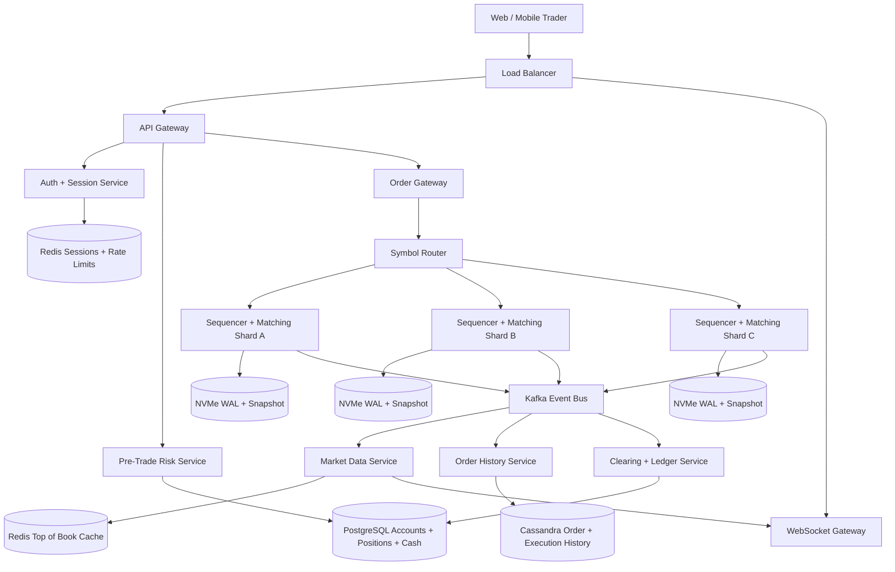
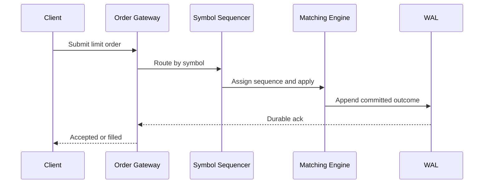
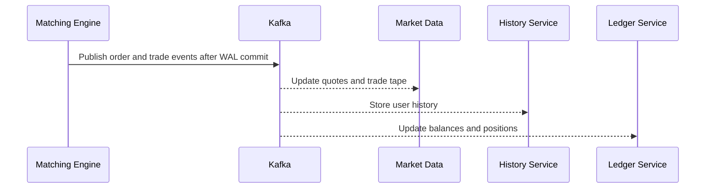
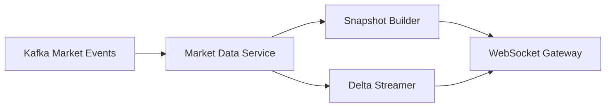
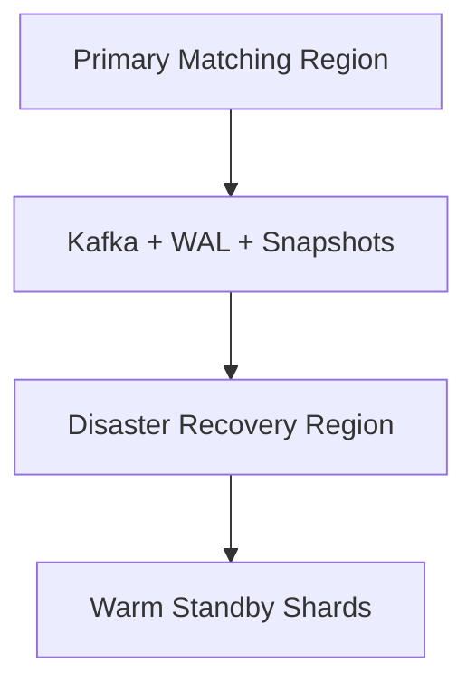

# Design Stock Exchange / Trading Platform

Designing a stock exchange or trading platform is a classic system design interview problem because it combines a hard real-time control plane with strict correctness guarantees. Traders expect low-latency order submission, instant market data, accurate fills, deterministic price-time priority, and zero ambiguity about whether an order was accepted, matched, canceled, or rejected. If the platform gets ordering or balances wrong, the consequences are not just bad UX but financial loss and regulatory exposure.

At a high level, the system has two very different workloads. The first is the **matching path**, where incoming orders must be sequenced deterministically and applied to the order book with strong consistency. The second is the **distribution path**, where market data, fills, portfolio updates, analytics, and audit pipelines fan out to many downstream consumers. A good design keeps the first path extremely small and predictable, then lets the second path scale independently.

---

## Functional Requirements

**In Scope:**
- Users can place buy and sell orders for listed symbols
- The platform supports market, limit, and cancel requests
- Orders are matched using price-time priority within each symbol book
- Users can view live order status, fills, and current positions
- Clients can fetch order book snapshots and real-time market data streams
- The system performs pre-trade risk checks such as buying power, position limits, and rate limits
- The platform stores immutable order and execution history for audit and user reporting
- Operators can inspect symbol health, matching lag, and rejected orders

**Out of Scope:**
- Full derivatives pricing and options Greeks infrastructure
- Settlement with external clearing houses in regulatory detail
- News feeds, social investing, or retail education features
- Complex dark-pool routing logic across many venues
- Corporate actions processing beyond basic symbol metadata refresh

---

## Non-Functional Requirements

| Property | Target | Reasoning |
|---|---|---|
| **Order Submit Latency** | p99 < 20ms in-region before matching | traders expect immediate acknowledgement that the order entered the venue |
| **Match Decision Latency** | p99 < 10ms once on the symbol shard | sequencing and matching are the most latency-sensitive path |
| **Market Data Fanout Latency** | p99 < 100ms for top-of-book updates | stale quotes hurt trader confidence and execution quality |
| **Availability** | 99.99% for reads and streaming; writes available while the active shard quorum is healthy | the venue is a shared dependency during trading hours |
| **Consistency** | strict ordering and linearizable admission per symbol shard | two different orderings for the same book are unacceptable |
| **Durability** | no loss of accepted orders, executions, or audit events | financial systems require replayable immutable history |
| **Fairness** | deterministic price-time priority per symbol | matching must be predictable and defensible |
| **Scalability** | hundreds of thousands of order events/sec and millions of market-data subscribers | open and close can create sharp bursts |

**Key tradeoff:** the platform prioritizes **deterministic sequencing and correctness over maximizing parallelism inside one symbol book**. That means a symbol is usually handled by one active matching shard at a time, while scale comes from partitioning across many symbols and moving fanout out of the hot path.

---

## Capacity Estimation

**User activity assumptions:**
- Assume **5M registered users** with **500K concurrent sessions** during market open or major news events
- Only a fraction submit orders at any given moment, but almost all active sessions consume quotes, order updates, or portfolio changes

**Order traffic:**
- Assume **250K order events/sec** at peak across the venue, counting new orders, cancels, and modifies
- Cancels often exceed fresh orders in volatile markets, so the matching path must optimize for both
- The top 100 symbols can drive the majority of peak traffic, so average QPS per symbol is misleading

**Market data traffic:**
- If **500K clients** each watch several symbols, market-data fanout can be far larger than raw order rate
- Even a modest **20 updates/sec** on a hot symbol creates a very large downstream stream, so clients should receive aggregated snapshots plus deltas rather than every internal book mutation

**Storage volume:**
- Live order-book state is small and memory-resident compared with long-term audit history
- Immutable order and execution history grows quickly and must be retained for audit, analytics, and user statements
- Snapshots plus a deterministic write-ahead log make replay and disaster recovery feasible without retaining every intermediate in RAM forever

**Operational profile:**
- The open and close are burst-heavy and should be treated as separate scaling events
- Market halts, symbol suspensions, and news-driven volatility create symbol-specific hot spots rather than uniform load across the venue

---

## Core Entities

| Entity | Purpose | Key Fields | Relationships |
|---|---|---|---|
| **TradingAccount** | User's funded trading identity | `account_id`, `user_id`, `status`, `base_currency`, `created_at` | owns cash, positions, and orders |
| **Instrument** | Tradable symbol definition | `symbol`, `exchange`, `tick_size`, `lot_size`, `status` | referenced by orders, books, and trades |
| **Order** | User instruction to buy or sell | `order_id`, `client_order_id`, `account_id`, `symbol`, `side`, `type`, `quantity`, `limit_price`, `status` | may generate one or more executions |
| **Execution** | Matched trade result | `execution_id`, `buy_order_id`, `sell_order_id`, `symbol`, `price`, `quantity`, `sequence_no` | belongs to matched orders |
| **OrderBookLevel** | Aggregated price level in a book | `symbol`, `side`, `price`, `resting_quantity`, `updated_at` | derived from accepted resting orders |
| **Position** | Net holdings per account and symbol | `account_id`, `symbol`, `quantity`, `avg_cost`, `updated_at` | updated from executions |
| **CashLedgerEntry** | Money movement or reservation | `entry_id`, `account_id`, `amount`, `currency`, `reason`, `created_at` | linked to risk and trade settlement |
| **MarketDataEvent** | Downstream quote or trade update | `event_id`, `symbol`, `event_type`, `sequence_no`, `created_at` | derived from matching outcomes |
| **TradingSession** | Connected client session | `session_id`, `account_id`, `channel`, `last_heartbeat_at` | receives order and market-data events |
| **RiskLimit** | Risk envelope for an account or tenant | `account_id`, `max_notional`, `max_order_rate`, `max_position`, `updated_at` | checked before order admission |

**Critical modeling decisions:**
- `Order` is immutable in intent. Cancel and replace should be modeled as explicit new events rather than in-place silent mutation.
- `Execution.sequence_no` is symbol-local and ordered by the matching engine. This makes replay and market-data reconciliation deterministic.
- `CashLedgerEntry` and `Position` are downstream derived transactional records, but admission should reserve buying power or inventory before the order reaches the book.

---

## Databases and Database Design

### Storage Tier Decisions

| Data | Access Pattern | Engine | Why |
|---|---|---|---|
| Order books, accepted order sequence, matching state | ultra-low-latency writes, deterministic ordering, symbol-local strong consistency | **In-memory matching engine + append-only WAL on NVMe** | the hot path needs one active sequencer per symbol shard and replayable durability |
| Accounts, cash balances, reservations, positions, limits | transactional updates, exact reads, strong consistency | **PostgreSQL / NewSQL** | balances and risk reservations require ACID semantics |
| Order history and execution history | append-heavy writes, account and symbol scoped reads | **Cassandra / ScyllaDB** | scales well for large immutable timelines |
| Session registry, rate limits, top-of-book cache | hot reads, TTLs, fanout helpers | **Redis** | suitable for ephemeral and cache-heavy data |
| Market-data fanout, audit pipelines, analytics, compliance exports | durable ordered event stream | **Kafka** | decouples matching from downstream consumers |
| Snapshots and cold recovery images | immutable blobs and checkpoint files | **Object Storage** | cheap and durable for point-in-time recovery |

This is intentionally polyglot. The trading venue has one tiny correctness-critical core and several large downstream systems. The core wants **memory-resident deterministic state with durable replay**, while balances want **transactions**, history wants **append-friendly scale**, and market-data distribution wants **durable asynchronous fanout**.

### Schema 1 - Durable Order Journal (Logical View)

```sql
CREATE TABLE order_journal (
  order_id               UUID PRIMARY KEY,
  client_order_id        VARCHAR(64) NOT NULL,
  account_id             UUID NOT NULL,
  symbol                 VARCHAR(16) NOT NULL,
  side                   VARCHAR(8) NOT NULL,
  order_type             VARCHAR(16) NOT NULL,
  quantity               BIGINT NOT NULL,
  limit_price            NUMERIC(18,6),
  time_in_force          VARCHAR(16) NOT NULL,
  status                 VARCHAR(16) NOT NULL,
  sequence_no            BIGINT,
  created_at             TIMESTAMPTZ DEFAULT NOW(),
  updated_at             TIMESTAMPTZ DEFAULT NOW(),
  UNIQUE (account_id, client_order_id)
);

CREATE INDEX idx_order_journal_symbol_created
  ON order_journal (symbol, created_at DESC);
```

In production, the live matching path typically persists to a symbol-local write-ahead log, then projects into this history table asynchronously. The table is a durable read model, not the thing that decides the match.

### Schema 2 - Executions (Immutable Fills)

```sql
CREATE TABLE executions (
  execution_id           UUID PRIMARY KEY,
  symbol                 VARCHAR(16) NOT NULL,
  buy_order_id           UUID NOT NULL,
  sell_order_id          UUID NOT NULL,
  price                  NUMERIC(18,6) NOT NULL,
  quantity               BIGINT NOT NULL,
  sequence_no            BIGINT NOT NULL,
  executed_at            TIMESTAMPTZ DEFAULT NOW()
);

CREATE INDEX idx_executions_symbol_sequence
  ON executions (symbol, sequence_no DESC);
```

### Schema 3 - Positions and Cash Reservations

```sql
CREATE TABLE positions (
  account_id             UUID NOT NULL,
  symbol                 VARCHAR(16) NOT NULL,
  quantity               BIGINT NOT NULL,
  avg_cost               NUMERIC(18,6) NOT NULL,
  updated_at             TIMESTAMPTZ DEFAULT NOW(),
  PRIMARY KEY (account_id, symbol)
);

CREATE TABLE cash_reservations (
  reservation_id         UUID PRIMARY KEY,
  account_id             UUID NOT NULL,
  order_id               UUID NOT NULL,
  reserved_amount        NUMERIC(18,6) NOT NULL,
  currency               VARCHAR(8) NOT NULL,
  status                 VARCHAR(16) NOT NULL,
  created_at             TIMESTAMPTZ DEFAULT NOW()
);
```

### Schema 4 - Order and Execution History by Account (Cassandra)

```sql
CREATE TABLE order_events_by_account (
  account_id             UUID,
  bucket_day             TEXT,
  sequence_no            BIGINT,
  event_id               UUID,
  symbol                 TEXT,
  event_type             TEXT,
  order_id               UUID,
  execution_id           UUID,
  created_at             TIMESTAMP,
  PRIMARY KEY ((account_id, bucket_day), sequence_no, event_id)
) WITH CLUSTERING ORDER BY (sequence_no DESC, event_id DESC);
```

This supports fast user timelines and statement generation without forcing the matching engine to answer historical queries.

### Schema 5 - Market Data Event (Logical Kafka Payload)

```json
{
  "event_type": "top_of_book",
  "symbol": "AAPL",
  "sequence_no": 981274112,
  "best_bid": 192.11,
  "best_bid_qty": 500,
  "best_ask": 192.12,
  "best_ask_qty": 300,
  "created_at": "2026-06-03T09:30:00Z"
}
```

Sequence numbers are critical. They let streaming clients detect gaps, request a fresh snapshot, and avoid silently drifting from the authoritative book.

### Sharding and Replication Strategy

| Store | Shard Key | Strategy | Replication |
|---|---|---|---|
| Matching engine + WAL | `symbol` | assign symbols to many matching shards; one active sequencer per symbol | active + hot standby, replicated WAL |
| Accounts / positions | `account_id` | relational partitioning or NewSQL hash sharding | primary + synchronous replicas |
| History tables | `(account_id, bucket_day)` or `(symbol, bucket_day)` | consistent hashing across Cassandra nodes | RF=3, `LOCAL_QUORUM` |
| Redis | `symbol`, `session_id`, `account_id` | Redis Cluster | 1 replica per master |
| Kafka | `symbol` for market data, `account_id` for account updates | partitioned durable log | RF=3 |

**Consistency model:**
- Strong consistency and deterministic ordering inside each symbol shard for admission, cancel, and matching
- Strong transactional consistency for cash reservations and position updates where money or inventory correctness is involved
- Eventual consistency for dashboards, analytics, statements, and some user history projections

**Read/write patterns:**
- **Order path:** client submits order -> risk checks reserve funds or shares -> symbol sequencer assigns sequence -> matching engine updates book -> commit to WAL -> publish downstream events
- **Market data path:** committed sequence events -> Kafka -> market-data service -> WebSocket gateways and cache refresh
- **Portfolio path:** executions -> clearing and ledger services -> positions and balances update -> user notification and reporting projections

---

## API Design

**Submit an order:**
```http
POST /v1/orders
Authorization: Bearer <jwt>
Idempotency-Key: client-ord-7bca-001

{
  "account_id": "acc_123",
  "symbol": "AAPL",
  "side": "buy",
  "order_type": "limit",
  "quantity": 100,
  "limit_price": 192.10,
  "time_in_force": "day",
  "client_order_id": "cli_9001"
}

201 Created
{
  "order_id": "ord_456",
  "status": "accepted",
  "symbol": "AAPL",
  "sequence_no": 981274110,
  "accepted_at": "2026-06-03T09:30:00Z"
}
```

**Cancel an order:**
```http
POST /v1/orders/ord_456/cancel
Authorization: Bearer <jwt>
Idempotency-Key: cancel-ord-456-1

202 Accepted
{
  "order_id": "ord_456",
  "status": "cancel_pending"
}
```

The cancel must still flow through the same symbol sequencer. Otherwise the system can race between a fill and a cancel and create conflicting truths.

**Get order status:**
```http
GET /v1/orders/ord_456
Authorization: Bearer <jwt>

200 OK
{
  "order_id": "ord_456",
  "symbol": "AAPL",
  "status": "partially_filled",
  "filled_quantity": 40,
  "remaining_quantity": 60,
  "last_sequence_no": 981274120
}
```

**Get order book snapshot:**
```http
GET /v1/markets/AAPL/book?depth=20

200 OK
{
  "symbol": "AAPL",
  "sequence_no": 981274125,
  "bids": [[192.11, 500], [192.10, 800]],
  "asks": [[192.12, 300], [192.13, 450]]
}
```

**List executions for an account:**
```http
GET /v1/accounts/acc_123/executions?before_sequence=981274200&limit=100
Authorization: Bearer <jwt>

200 OK
{
  "executions": [
    {
      "execution_id": "exe_789",
      "symbol": "AAPL",
      "price": 192.12,
      "quantity": 40,
      "sequence_no": 981274120
    }
  ],
  "next_before_sequence": 981274119,
  "has_more": true
}
```

> Cursor-based pagination on monotonic sequence or timestamp. Offset pagination (`?page=N`) becomes unstable and expensive for growing event history.

**Real-time channel (WebSocket):**
```
WSS wss://trade.example.com/v1/stream
Authorization: Bearer <jwt>
```
The same persistent channel carries order acks, fills, top-of-book updates, and optional trade tape subscriptions. REST is used for snapshots and account queries; WebSocket is used for low-latency streaming.

---

## High-Level Design



**Component responsibilities:**

| Component | Role |
|---|---|
| **API Gateway** | Authentication, request validation, throttling, and API routing |
| **Auth + Session Service** | Maintains session identity and enforces account-level access |
| **Pre-Trade Risk Service** | Checks buying power, share availability, order limits, and compliance gates before admission |
| **Order Gateway** | Normalizes order requests and routes them to the correct symbol shard |
| **Symbol Router** | Maps each symbol to its active sequencer and matching shard |
| **Sequencer + Matching Shard** | Assigns sequence numbers, applies price-time priority, updates the order book, and produces executions |
| **NVMe WAL + Snapshot** | Durable replay log and periodic checkpoint for fast recovery |
| **Kafka** | Durable downstream stream for market data, history projection, ledger updates, and analytics |
| **Market Data Service** | Builds snapshots and deltas for client streaming and quote APIs |
| **Order History Service** | Projects immutable order and fill timelines into query stores |
| **Clearing + Ledger Service** | Applies fills to balances, positions, reservations, and downstream settlement workflows |
| **Redis** | Holds sessions, rate limits, and top-of-book cache for fast reads |

**Order submission and match flow:**
1. Client -> `POST /v1/orders` -> API Gateway -> Pre-Trade Risk Service
2. Risk validates account status, buying power, and rate limits; it reserves funds or inventory if the order is admissible
3. Order Gateway routes the request by symbol to the active matching shard
4. The symbol sequencer assigns the next sequence number and the matching engine applies the order with price-time priority
5. The result is durably appended to the write-ahead log, then an acknowledgement is returned to the client
6. Kafka receives downstream events for market data, fills, order history, and clearing without slowing the hot matching path
7. WebSocket gateways stream order updates and quotes to subscribed clients using snapshots plus deltas

---

## Deep Dives

### 1. Sequencer and Matching Engine: Required and Central

The hardest part of a stock exchange is not storing orders; it is defining the one correct order in which they entered the book and then applying price-time priority consistently. For a given symbol, the system should behave as if there is one authoritative sequencer feeding one deterministic matching engine.

That does not mean the whole venue is single-threaded. Scale comes from partitioning by symbol across many shards. But within one symbol, the platform should avoid ambiguous multi-writer concurrency.



**Why the problem happens:** matching requires one defensible ordering of new orders, cancels, and executions.

**Why it becomes difficult at scale:**
- hot symbols can receive extreme bursts during open, close, or major news
- cancels and replaces race with fills on the same resting orders
- deterministic replay is required after failover or incident analysis

**Production-grade solutions:**
- use one active sequencer per symbol shard with an in-memory book and durable WAL
- partition the venue across many symbol shards instead of parallelizing one symbol book incorrectly
- model cancels as ordered events through the same sequencer rather than as side-channel deletions
- snapshot periodically so recovery can replay from the latest checkpoint rather than from day zero

**Tradeoffs:** a single active writer per symbol limits vertical parallelism within that symbol, but it gives deterministic matching and operational clarity.

### 2. Kafka: Valuable, but Intentionally Off the Matching Hot Path

Kafka is very useful in a trading platform, but not to decide matches. The moment an order is accepted or a fill occurs, the matching engine has already produced the authoritative result. Kafka then distributes that committed outcome to market-data services, history projections, ledgers, compliance systems, and analytics.



**Why the problem happens:** one match affects many downstream systems with different SLAs.

**Why it becomes difficult at scale:**
- market data, risk, audit, and analytics all want the same events
- downstream consumers can fail or lag independently
- compliance and replay requirements make durable event retention important

**Production-grade solutions:**
- publish events only after the matching outcome is durably committed
- partition Kafka by symbol for quote streams and by account for account-level projections where appropriate
- let consumers scale and recover independently from the matching core
- never block the matching engine on slow downstream consumers

**Tradeoffs:** Kafka adds excellent decoupling and replay, but it must remain a downstream distribution mechanism rather than the decision-maker for matching.

### 3. Redis: Good for Sessions and Quote Caches, Not the Source of Truth

Redis has a real role here, but it is not where order truth lives. The platform can use Redis for session routing, rate limits, best bid/offer caches, subscription registries, and ephemeral hot-symbol metadata. It should not use Redis as the authoritative order book for financial correctness.

| Redis Use | Example Key | Why Redis Fits |
|---|---|---|
| **Session registry** | `session:sess_123` | fast lookup for pushing order updates to the correct gateway |
| **Rate limiting** | `rl:account:acc_123:orders` | cheap protection against abusive submit loops |
| **Top-of-book cache** | `tob:AAPL` | low-latency snapshot reads for quote APIs |
| **Subscription registry** | `sub:symbol:AAPL` | helps fanout services find interested clients quickly |

**Why the problem happens:** the system has lots of hot ephemeral state around the matching core.

**Why it becomes difficult at scale:**
- quote reads can outnumber order writes by a large margin
- session churn and reconnect storms happen around volatility spikes
- stale cache data must never leak into matching decisions

**Production-grade solutions:**
- keep the authoritative order book inside the matching engine and WAL only
- use Redis as a cache and routing helper for read-heavy or transient data
- expire ephemeral keys aggressively with TTLs
- rebuild caches from snapshots or Kafka streams whenever Redis is empty or stale

**Tradeoffs:** Redis improves latency and fanout efficiency, but correctness still belongs to the deterministic matching core.

### 4. Order Lifecycle, Idempotency, and Exactly-Once Semantics

Trading clients retry frequently because networks fail and traders cannot tolerate uncertainty. If the platform cannot distinguish a genuine new order from a retry, it may double-submit. If it treats cancel as an out-of-band action, it may create impossible states where the same order is both filled and canceled without a clear sequence.

**Why the problem happens:** request retries, mobile disconnects, and duplicate submissions are normal.

**Why it becomes difficult at scale:**
- clients send repeated submit and cancel attempts under latency pressure
- multiple services project order state independently from the same event stream
- users need a single authoritative answer for whether a request succeeded

**Production-grade solutions:**
- require `client_order_id` or idempotency keys scoped to the account
- treat submit, cancel, and replace as explicit sequenced events with durable identifiers
- return the authoritative `order_id` and latest sequence number on retries instead of creating a new order
- keep history immutable and model state transitions as an append-only timeline

**Tradeoffs:** idempotency adds some storage and API complexity, but it is mandatory for trustable order handling.

### 5. WebSockets and Market Data Fanout

Unlike some business systems where polling is acceptable, a trading platform benefits heavily from real-time push. Users expect fast quote updates, immediate order-status changes, and near-live fill notifications. WebSocket is the normal choice for this streaming layer, while REST remains useful for snapshots and slower account queries.



**Why the problem happens:** market data is high fanout and highly perishable.

**Why it becomes difficult at scale:**
- one hot symbol can have huge subscriber counts
- clients disconnect and reconnect during market turbulence
- sending every internal mutation to every client is wasteful and can overwhelm browsers or mobile apps

**Production-grade solutions:**
- send periodic snapshots plus incremental deltas keyed by symbol sequence numbers
- let clients detect gaps and resync when they miss a sequence
- separate account-private order streams from public quote streams
- apply backpressure, throttling, and tiered market-data products for very large subscriber bases

**Tradeoffs:** WebSockets are effectively required for competitive UX, but the design must prioritize resumability and gap detection over perfect uninterrupted delivery.

### 6. Hot Symbols, Opening Auctions, and Shard Pressure

The average symbol is not the problem. The problem is the handful of names that absorb the majority of traffic during market-moving events. Those symbols can stress the matching shard, the quote stream, and every downstream consumer simultaneously.

**Why the problem happens:** traffic distribution is highly skewed and spikes during open, close, or breaking news.

**Why it becomes difficult at scale:**
- a single hot symbol can saturate one shard while others are mostly idle
- opening and closing events create bursty synchronized traffic rather than smooth load
- naive client retry behavior amplifies pressure when latency rises

**Production-grade solutions:**
- partition symbols across many shards and isolate consistently hot names onto dedicated hardware when needed
- treat market open and close as planned scale events with extra capacity and rate controls
- aggregate public quote fanout so clients consume top-of-book or limited depth rather than full internal churn
- use admission control and account-level throttles to protect the venue during stress

**Tradeoffs:** dedicated hot-symbol isolation improves stability, but it complicates rebalancing and capacity planning.

### 7. Pre-Trade Risk, Reservations, and Post-Trade Ledger Updates

Matching alone is not enough. Before an order reaches the book, the system must know whether the account is allowed to place it and whether cash or inventory should be reserved. After a fill, those reservations must be transformed into durable ledger and position changes.

**Why the problem happens:** financial correctness depends on more than book correctness.

**Why it becomes difficult at scale:**
- risk checks sit on the hot path and cannot be slow
- users may have many open orders affecting buying power simultaneously
- fills must update positions and balances exactly once even if downstream consumers restart

**Production-grade solutions:**
- perform pre-trade risk checks synchronously before symbol admission
- reserve funds or shares for accepted orders so two simultaneous orders cannot overspend the same balance
- update positions and cash through idempotent ledger consumers keyed by execution identifiers
- separate user-facing available balance from settled balance where the business model requires it

**Tradeoffs:** stronger financial controls add latency, but skipping them moves correctness bugs from technology problems into money problems.

### 8. Multi-Region Deployment and Disaster Recovery

Global users may connect from many regions, but a symbol book still wants one active authority at a time. Active-active matching for the same symbol across regions is extremely hard because it creates ordering ambiguity and failover complexity.



**Why the problem happens:** exchanges want resilience, but matching correctness requires a single authoritative sequence per symbol.

**Why it becomes difficult at scale:**
- cross-region RTT hurts latency-sensitive order paths
- failover must preserve monotonic sequence numbers and prevent stale leaders from reappearing
- history, quotes, and ledgers may lag during regional disruption

**Production-grade solutions:**
- keep one active region per symbol shard and replicate WAL or snapshots to a warm standby region
- require explicit failover procedures that fence the old leader and resume from the latest durable checkpoint
- keep read-only market data and account dashboards globally distributed even if order entry remains region-bound
- minimize cross-region synchronous coordination on the hot matching path

**Tradeoffs:** single-region active matching keeps latency low and ordering clean, but it requires disciplined disaster recovery design and clear operational runbooks.

### 9. Architecture Evolution

| Stage | Design | Why It Breaks | Next Step |
|---|---|---|---|
| **1. MVP** | Single matching node and relational database | no deterministic replay, limited throughput, no fault tolerance | add WAL, symbol partitioning, and hot standby |
| **2. Growth** | A few matching shards, synchronous history writes, basic WebSocket quotes | downstream consumers start slowing the core | add Kafka, read models, and dedicated quote services |
| **3. Scale** | Many symbol shards, separate risk, history, and market-data services | hot symbols and reconnect storms pressure individual components | isolate hot names, add better caches, rate limits, and snapshot recovery |
| **4. Mature Venue** | Deterministic matching core with robust DR, audit, and compliance pipelines | global growth and regulatory demands increase complexity | keep the core small and stable while evolving peripheral systems independently |

This is the interview pattern to emphasize: keep the matching engine and sequence of truth extremely small, deterministic, and replayable, then let Kafka, Redis, history stores, and streaming services handle the surrounding scale.
