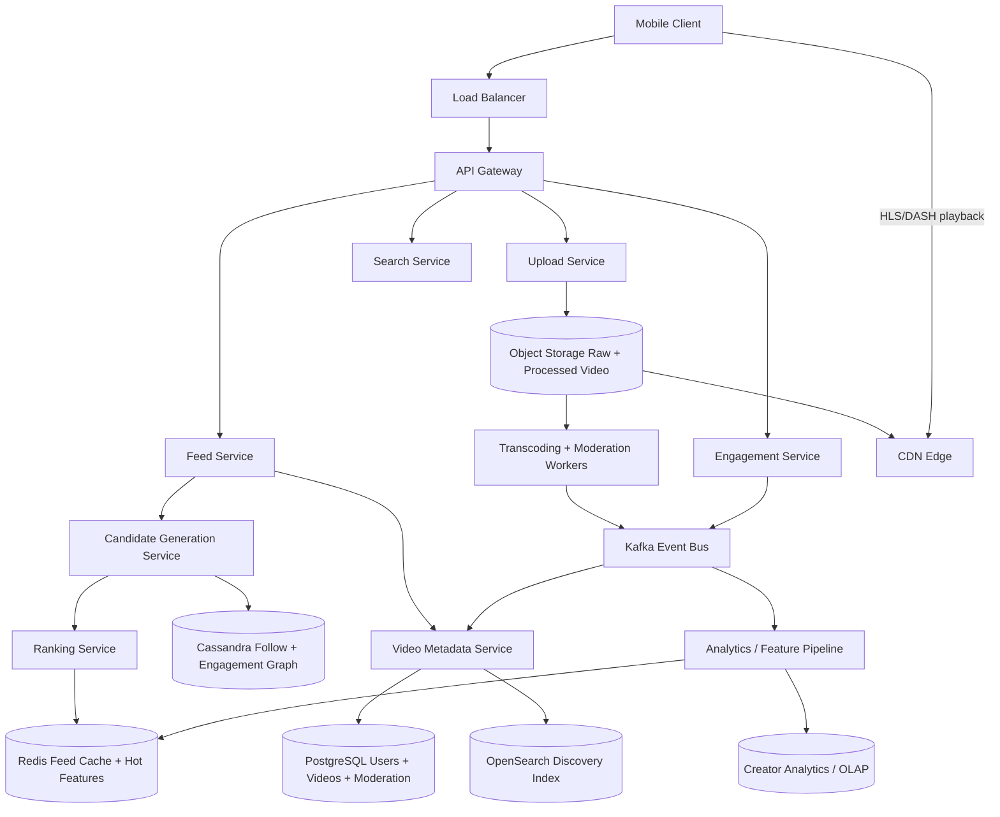
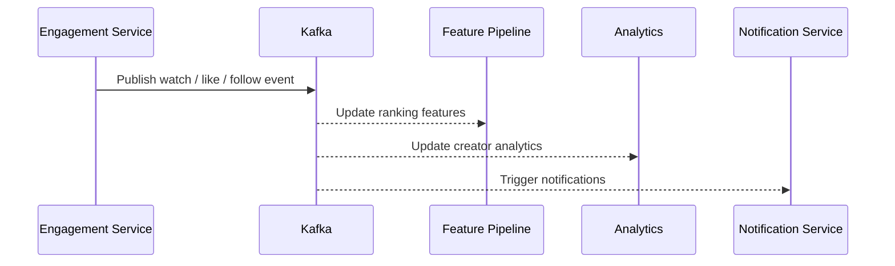
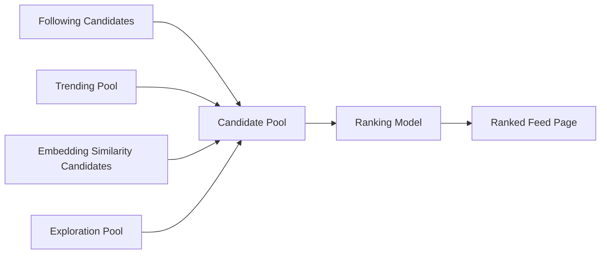
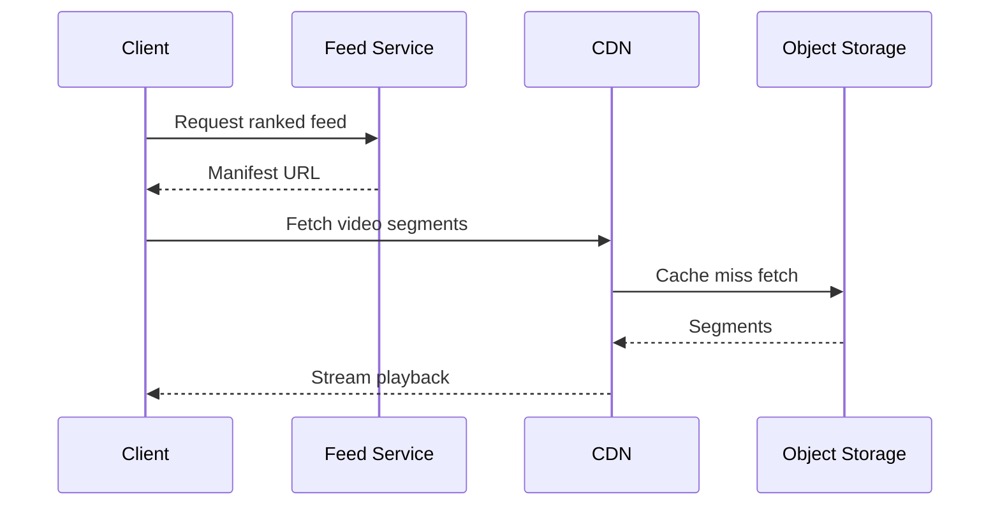
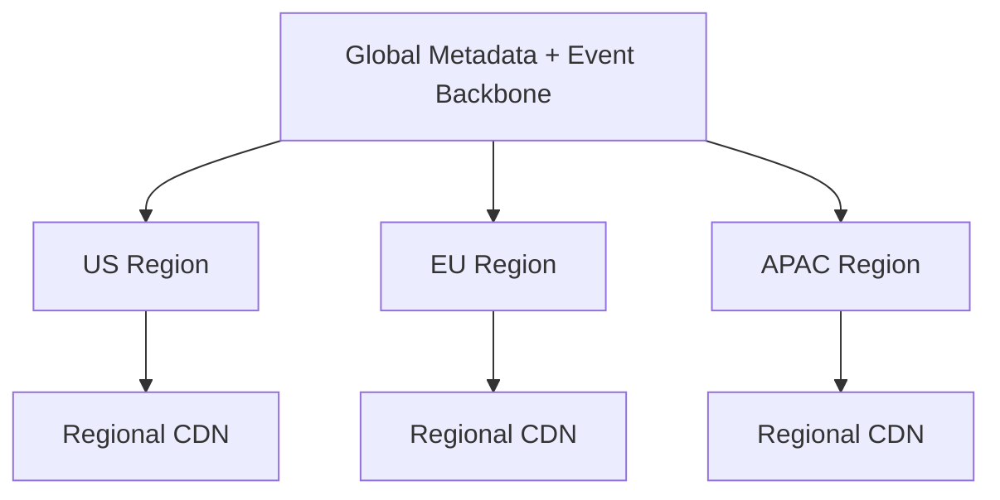

# Design TikTok

TikTok is a classic system design interview problem because it combines three hard systems into one product: a global short-video media platform, a personalized recommendation engine, and a massive engagement event pipeline. Users expect uploads to finish quickly, videos to start instantly, the For You feed to feel highly personalized, and likes, comments, follows, and shares to appear almost immediately. If the system gets media delivery wrong, playback stalls. If it gets ranking wrong, retention drops. If it gets event processing wrong, recommendations, creator analytics, and notifications all drift.

At a high level, the platform has two very different workloads. The first is the **media and feed serving path**, where the app requests the next batch of videos and expects low-latency ranking plus fast CDN playback. The second is the **event and optimization path**, where the platform ingests views, watch time, likes, comments, follows, and shares at huge scale, then uses those signals for reporting, ranking features, moderation, and recommendations. A good design keeps the serving path small and fast, then lets the asynchronous event pipeline scale independently.

---

## Functional Requirements

**In Scope:**
- Users can upload short videos with captions, hashtags, sounds, and thumbnails
- The platform transcodes uploaded videos into multiple bitrate and device-friendly variants
- Clients can fetch a personalized For You feed and a Following feed
- Users can like, comment, share, save, and follow creators
- The platform tracks view start, watch time, completion, like, comment, follow, and share events
- Users can search for creators, hashtags, sounds, and videos
- Creators can view near-real-time engagement and basic performance analytics
- Operators can inspect transcoding failures, moderation state, feed errors, and event-pipeline lag

**Out of Scope:**
- Full livestreaming infrastructure
- Rich in-app video editing implementation details
- Detailed ad auctioning and monetization systems
- Music licensing and rights management specifics
- Full direct-message or group chat features

---

## Non-Functional Requirements

| Property | Target | Reasoning |
|---|---|---|
| **Feed API Latency** | p99 < 150ms in-region for ranked feed response | endless-scroll UX depends on low-latency next-page fetches |
| **Playback Startup** | p99 < 300ms after CDN edge hit | users abandon quickly when short videos take too long to start |
| **Upload Acknowledgement** | upload URL in < 100ms; publish processing begins immediately | creators expect publishing flow to feel instant even though transcoding continues asynchronously |
| **Availability** | 99.99% for feed and playback control plane | feed and media delivery are the core product surface |
| **Durability** | no loss of uploaded raw media, committed metadata, or accepted engagement events | lost content or missing events damages trust and ranking quality |
| **Freshness** | engagement signals and follows reflected in feed features within seconds to minutes | recommendations degrade if features are too stale |
| **Scalability** | millions of feed requests/sec, millions of uploads/day, tens of millions of events/sec | views and watch events dominate throughput |
| **Cost Efficiency** | media bytes should bypass the control plane via object storage and CDN | video delivery is primarily a bandwidth problem, not an API problem |

**Key tradeoff:** the platform prioritizes **fast feed assembly and playback** over globally synchronized feature updates on every interaction. The serving path uses cached features and asynchronous pipelines, while durability and exact ordering are preserved where they matter most: uploads, media processing, metadata changes, and immutable engagement events.

---

## Capacity Estimation

**Audience scale assumptions:**
- Assume **250M DAU** with strong burstiness around evenings, weekends, and trending events
- If an active user watches **200 videos/day**, that is **50B video plays/day**
- Even if the average watch session is short, control-plane requests plus media delivery are enormous at this scale

**Feed request volume:**
- If clients fetch the next batch every 10-20 videos, the system may see **2B-5B feed page requests/day**
- That is roughly **25K-60K feed requests/sec average**, with peak traffic easily **10x higher**
- Personalized ranking usually dominates CPU cost more than simple metadata fetches do

**Media volume:**
- Assume **20M uploads/day** with average raw upload size around **40 MB**, which is about **800 TB/day raw ingest**
- Transcoding into several bitrate ladders expands storage usage significantly, but most egress goes through CDN rather than the app servers
- Playback egress is measured in many **petabytes/day**, so object storage plus CDN is non-negotiable

**Engagement event volume:**
- Every view, watch milestone, like, comment, follow, and share becomes an event
- A platform of this shape can easily generate **20M-50M events/sec** during peak periods if granular watch-time tracking is included
- Event ingestion and downstream aggregation therefore need durable buffering and independently scalable consumers

**Hot-spot behavior:**
- A few viral videos or creators can dominate traffic briefly
- Hot objects stress CDN, hot creators stress notification and comment systems, and trending topics stress search and recommendation features

---

## Core Entities

| Entity | Purpose | Key Fields | Relationships |
|---|---|---|---|
| **User** | Viewer or creator account | `user_id`, `handle`, `profile_state`, `created_at` | owns videos, follows others, produces engagement |
| **Video** | Core uploaded post metadata | `video_id`, `creator_id`, `caption`, `sound_id`, `visibility`, `status`, `created_at` | has media variants, engagement, comments, hashtags |
| **MediaVariant** | Transcoded video rendition | `variant_id`, `video_id`, `codec`, `resolution`, `bitrate`, `manifest_uri` | belongs to one video |
| **FollowEdge** | Social-graph relationship | `follower_id`, `followed_id`, `created_at` | shapes Following feed and ranking features |
| **EngagementEvent** | Immutable user action or watch signal | `event_id`, `user_id`, `video_id`, `event_type`, `watch_ms`, `created_at` | powers ranking, analytics, and notifications |
| **Comment** | Comment on a video | `comment_id`, `video_id`, `user_id`, `body`, `status`, `created_at` | attached to one video |
| **FeedCandidate** | Candidate video considered for ranking | `candidate_id`, `video_id`, `source`, `feature_vector`, `score_hint` | becomes a ranked feed item |
| **RankedFeedItem** | Result returned to the client | `request_id`, `video_id`, `rank_score`, `cursor_token` | tied to one feed request |
| **ModerationDecision** | Safety and policy state for content | `object_id`, `object_type`, `policy_state`, `review_reason`, `updated_at` | can hide or demote videos/comments |
| **SearchDocument** | Searchable denormalized record | `doc_id`, `video_id`, `caption_terms`, `hashtags`, `sound_terms`, `status` | used by search and discovery surfaces |

**Critical modeling decisions:**
- `Video` metadata is separate from the actual media bytes. This keeps the control plane small while large objects live in object storage.
- `EngagementEvent` is append-only. Ranking, analytics, and creator dashboards should derive from events rather than mutate counters directly as the only source of truth.
- `RankedFeedItem` is a request-scoped serving artifact, not the durable canonical feed. The platform can cache feed pages briefly, but recommendation state continues to evolve.

---

## Databases and Database Design

### Storage Tier Decisions

| Data | Access Pattern | Engine | Why |
|---|---|---|---|
| User accounts, video metadata, creator settings, moderation source of truth | transactional writes, exact reads, admin tools | **PostgreSQL** | structured metadata and state transitions fit relational storage well |
| Follow graph, comments, engagement timelines | very high write volume, user or video scoped timeline reads | **Cassandra / ScyllaDB** | wide-row, append-heavy workloads scale well here |
| Feed cache, hot counters, session state, ranking feature hints | sub-millisecond reads/writes, TTLs, hot keys | **Redis** | ideal for ephemeral feed and counter state |
| Search and discovery index | full-text and structured search by caption, hashtag, sound, creator | **OpenSearch** | built for search-heavy discovery workloads |
| Raw and transcoded media | large immutable blobs, cheap durable reads | **Object Storage** | separates media bytes from the application tier |
| Global video delivery | very high bandwidth playback | **CDN** | edge delivery is mandatory for startup latency and cost control |
| Engagement stream, transcoding events, recommendation signals | durable append-only event backbone | **Kafka** | decouples ingestion from many downstream consumers |
| Analytics and creator reporting | rollups, hourly aggregates, experimentation metrics | **ClickHouse / OLAP store** | optimized for large-scale aggregation queries |

This is intentionally polyglot. A short-video platform needs **transactional metadata**, **append-heavy social data**, **hot ephemeral serving state**, **full-text search**, **large object storage**, and a **durable event stream**. One database is not a practical fit for all of those access patterns.

### Schema 1 - Users and Videos (PostgreSQL)

```sql
CREATE TABLE users (
  user_id                 UUID PRIMARY KEY DEFAULT gen_random_uuid(),
  handle                  VARCHAR(64) NOT NULL UNIQUE,
  display_name            TEXT NOT NULL,
  profile_state           VARCHAR(16) NOT NULL,
  created_at              TIMESTAMPTZ DEFAULT NOW()
);

CREATE TABLE videos (
  video_id                UUID PRIMARY KEY DEFAULT gen_random_uuid(),
  creator_id              UUID NOT NULL REFERENCES users(user_id),
  caption                 TEXT,
  sound_id                UUID,
  thumbnail_uri           TEXT,
  visibility              VARCHAR(16) NOT NULL,
  status                  VARCHAR(16) NOT NULL,
  created_at              TIMESTAMPTZ DEFAULT NOW(),
  updated_at              TIMESTAMPTZ DEFAULT NOW()
);

CREATE INDEX idx_videos_creator_created
  ON videos (creator_id, created_at DESC);
```

### Schema 2 - Media Variants (PostgreSQL)

```sql
CREATE TABLE media_variants (
  variant_id              UUID PRIMARY KEY DEFAULT gen_random_uuid(),
  video_id                UUID NOT NULL REFERENCES videos(video_id),
  codec                   VARCHAR(16) NOT NULL,
  resolution              VARCHAR(16) NOT NULL,
  bitrate_kbps            INT NOT NULL,
  manifest_uri            TEXT NOT NULL,
  status                  VARCHAR(16) NOT NULL,
  created_at              TIMESTAMPTZ DEFAULT NOW()
);

CREATE INDEX idx_media_variants_video
  ON media_variants (video_id, status);
```

### Schema 3 - Follow Graph (Cassandra)

```sql
CREATE TABLE follows_by_user (
  follower_id             UUID,
  followed_id             UUID,
  created_at              TIMESTAMP,
  PRIMARY KEY (follower_id, followed_id)
);

CREATE TABLE followers_by_user (
  followed_id             UUID,
  follower_id             UUID,
  created_at              TIMESTAMP,
  PRIMARY KEY (followed_id, follower_id)
);
```

### Schema 4 - Engagement Events by Video (Cassandra)

```sql
CREATE TABLE engagement_events_by_video (
  video_id                UUID,
  bucket_hour             TEXT,
  created_at              TIMESTAMP,
  event_id                UUID,
  user_id                 UUID,
  event_type              TEXT,
  watch_ms                INT,
  PRIMARY KEY ((video_id, bucket_hour), created_at, event_id)
) WITH CLUSTERING ORDER BY (created_at DESC, event_id DESC);
```

Hourly buckets prevent hot viral videos from creating unbounded partitions.

### Schema 5 - Search Document (OpenSearch)

```json
{
  "video_id": "vid_123",
  "creator_id": "usr_456",
  "caption": "Weekend street food tour in Seoul",
  "hashtags": ["food", "travel", "seoul"],
  "sound_title": "summer beat mix",
  "visibility": "public",
  "status": "active"
}
```

### Schema 6 - Feed Cache Entry (Logical Redis Record)

```json
{
  "key": "feed:foryou:user_42:cursor_900",
  "value": {
    "video_ids": ["vid_1", "vid_2", "vid_3"],
    "expires_in_sec": 30,
    "feature_snapshot_version": 1821
  }
}
```

Brief feed-page caching reduces repeated ranking work during fast scrolling, but the TTL stays short so recommendations do not go stale for long.

### Sharding and Replication Strategy

| Store | Shard Key | Strategy | Replication |
|---|---|---|---|
| PostgreSQL | `user_id` or logical tenant partition at scale | primary plus replicas; shard once metadata outgrows a single cluster | synchronous or semi-sync replicas |
| Cassandra / ScyllaDB | `user_id`, `video_id`, or time buckets | consistent hashing across nodes | RF=3, `LOCAL_QUORUM` |
| Redis | `user_id`, `video_id`, `creator_id` | Redis Cluster | 1 replica per master |
| OpenSearch | document routing by `video_id` or discovery surface | many shards with replicated segments | multi-node replicated clusters |
| Kafka | `video_id`, `creator_id`, or `user_id` depending on topic | partitioned durable log | RF=3 |
| Object Storage | namespace by `creator_id/video_id/variant` | regional buckets with lifecycle policies | multi-AZ durable storage |

**Consistency model:**
- Strong consistency for metadata creation, video publish state, moderation state, and user account changes
- Eventual consistency for search indexing, feed features, creator analytics, and recommendation rollups
- Best-effort low-latency consistency for counters and feed caches, rebuilt from the event stream when needed

**Read/write patterns:**
- **Upload path:** create upload session -> direct object upload -> emit processing event -> transcode/moderate -> publish metadata -> index for feed and search
- **Feed path:** fetch candidate set -> apply ranking features and policy filters -> return ranked IDs plus playback metadata
- **Event path:** watch and engagement events -> Kafka -> feature updates, notifications, analytics, and creator dashboards

---

## API Design

**Request a video upload URL:**
```http
POST /v1/videos/upload-url
Authorization: Bearer <jwt>

{
  "content_type": "video/mp4",
  "size_bytes": 41873421
}

200 OK
{
  "upload_url": "https://storage.example.com/...",
  "upload_id": "upl_123",
  "expires_in": 300
}
```

**Publish a video after upload:**
```http
POST /v1/videos
Authorization: Bearer <jwt>
Idempotency-Key: video-publish-001

{
  "upload_id": "upl_123",
  "caption": "Weekend street food tour in Seoul",
  "hashtags": ["food", "travel", "seoul"],
  "sound_id": "snd_456",
  "visibility": "public"
}

201 Created
{
  "video_id": "vid_123",
  "status": "processing"
}
```

**Get the For You feed:**
```http
GET /v1/feed/for-you?cursor=cur_900&limit=20
Authorization: Bearer <jwt>

200 OK
{
  "items": [
    {
      "video_id": "vid_123",
      "creator_id": "usr_456",
      "caption": "Weekend street food tour in Seoul",
      "playback_manifest": "https://cdn.example.com/vid_123/master.m3u8"
    }
  ],
  "next_cursor": "cur_901",
  "has_more": true
}
```

> Cursor-based pagination is required. Offset pagination (`?page=N`) is unstable for personalized feeds because ranking changes continuously and duplicates or skips become common.

**Like a video:**
```http
POST /v1/videos/vid_123/likes
Authorization: Bearer <jwt>
Idempotency-Key: like-vid-123-user-42

204 No Content
```

**Create a comment:**
```http
POST /v1/videos/vid_123/comments
Authorization: Bearer <jwt>

{
  "body": "The food at 0:14 looks incredible"
}

201 Created
{
  "comment_id": "cmt_999",
  "status": "active"
}
```

**Follow a creator:**
```http
POST /v1/users/usr_456/follow
Authorization: Bearer <jwt>

204 No Content
```

**Search videos or hashtags:**
```http
GET /v1/search?q=street%20food&type=videos&cursor=srch_200
Authorization: Bearer <jwt>

200 OK
{
  "results": [
    {
      "video_id": "vid_123",
      "caption": "Weekend street food tour in Seoul"
    }
  ],
  "next_cursor": "srch_201",
  "has_more": true
}
```

**Notification stream (optional SSE):**
```http
GET /v1/notifications/stream
Authorization: Bearer <jwt>
Accept: text/event-stream
```
Short-video feeds do not require WebSockets for core playback or recommendation. SSE or periodic polling is usually enough for creator notifications and lightweight realtime updates.

---

## High-Level Design



**Component responsibilities:**

| Component | Role |
|---|---|
| **API Gateway** | Authentication, throttling, routing, and request validation |
| **Upload Service** | Issues upload URLs and creates initial video records |
| **Transcoding + Moderation Workers** | Generate bitrate variants, thumbnails, safety signals, and publish-ready status |
| **Video Metadata Service** | Stores video metadata, publish state, and playback manifests |
| **Feed Service** | Serves For You and Following feed pages with cursor semantics |
| **Candidate Generation Service** | Retrieves candidate videos from follow graph, trending pools, and discovery sources |
| **Ranking Service** | Computes personalized ranking scores using hot features and policy filters |
| **Engagement Service** | Accepts likes, comments, follows, watch-time, and share events |
| **Kafka** | Durable event bus for uploads, engagement, analytics, indexing, and notifications |
| **Redis** | Feed-page cache, hot counters, feature hints, and low-latency serving state |
| **Cassandra / Graph Store** | Stores follows, comment timelines, and engagement histories |
| **OpenSearch** | Powers text and discovery search |
| **Object Storage + CDN** | Stores and serves raw and processed video bytes globally |
| **Analytics / Feature Pipeline** | Builds creator reports, ranking features, and aggregated counters |

**Feed request and playback flow:**
1. Client -> `GET /v1/feed/for-you` -> API Gateway -> Feed Service
2. Feed Service checks short-lived Redis feed cache; on miss it requests candidates from candidate generation sources
3. Ranking Service scores candidates using recent engagement, follow signals, watch-time features, and policy filters
4. Feed Service returns ranked video metadata and playback manifests to the client
5. The client fetches video bytes directly from CDN using adaptive streaming manifests
6. View and watch events flow asynchronously into Kafka, where analytics and feature pipelines update recommendation inputs for later requests

---

## Deep Dives

### 1. Kafka: Required and Central

Kafka is central in a TikTok-like platform because the product generates huge amounts of asynchronous events: uploads, transcoding completions, view starts, watch milestones, likes, comments, follows, shares, notifications, and analytics updates. The feed path cannot synchronously wait for all of those consumers. It needs a durable event backbone that lets each downstream system scale independently.



**Why the problem happens:** every user action matters to many downstream systems, but not all of them belong on the hot serving path.

**Why it becomes difficult at scale:**
- watch and playback signals can outnumber social actions by orders of magnitude
- different consumers have very different latency requirements
- replay matters after bugs, model changes, or backfills for analytics and features

**Production-grade solutions:**
- publish immutable engagement and media-processing events to Kafka immediately after durable acceptance
- partition topics by `video_id`, `creator_id`, or `user_id` depending on downstream ordering needs
- keep raw events long enough to replay feature pipelines and reporting after incidents
- never let analytics or notification lag block feed serving or upload acknowledgement

**Tradeoffs:** Kafka adds operational complexity, but without it the system would tightly couple feed serving, notifications, analytics, and recommendation updates in unsafe ways.

### 2. Recommendation: Candidate Generation and Ranking Are the Product Core

The For You feed is not a simple timeline. The platform must generate a candidate pool from multiple sources, then rank it per user using recent behavior, embeddings, creator freshness, content safety, and exploration logic. That split is essential. Candidate generation narrows the search space; ranking decides what the user actually sees.



**Why the problem happens:** the best next video can come from social graph, trend surfaces, or content the user has never seen before.

**Why it becomes difficult at scale:**
- each user request needs personalization under tight latency budgets
- feature freshness matters because watch-time signals change rapidly
- exploration versus exploitation must be balanced or the feed becomes repetitive

**Production-grade solutions:**
- split the system into candidate generation and ranking rather than one giant query
- precompute or cache hot user features and trending pools in low-latency stores
- use bounded candidate counts so expensive ranking features apply only to shortlisted items
- include policy and diversity constraints alongside raw engagement prediction

**Tradeoffs:** better ranking quality usually increases CPU cost and operational complexity. The system must keep that complexity out of the client-visible latency path as much as possible.

### 3. Object Storage and CDN: The Byte Path Must Bypass the App Tier

Video platforms are bandwidth-heavy. If application servers tried to proxy video bytes, cost and latency would explode. The control plane should decide *what* to play; object storage plus CDN should deliver *the bytes*.



**Why the problem happens:** short-video products serve enormous media egress compared with metadata traffic.

**Why it becomes difficult at scale:**
- viral videos create extreme read amplification
- playback startup latency is unforgiving on mobile networks
- multiple bitrate and codec variants are needed for device and network diversity

**Production-grade solutions:**
- store raw and transcoded media in object storage
- serve manifests and segments through a global CDN with aggressive caching
- precompute multiple bitrate ladders and thumbnails during asynchronous transcoding
- keep manifests stable and edge-cacheable while allowing metadata to evolve independently

**Tradeoffs:** CDN and object storage add pipeline complexity, but they are the only practical way to deliver video globally at acceptable cost and latency.

### 4. Upload, Transcoding, and Moderation Pipeline

Creators expect the app to feel fast when publishing, but the platform still needs to transcode video, extract thumbnails, scan for policy violations, and publish searchable metadata. Those tasks belong in an asynchronous processing pipeline, not directly inside the upload API response.

**Why the problem happens:** video ingest is expensive and involves CPU-heavy, potentially slow workflows.

**Why it becomes difficult at scale:**
- uploads vary widely in size, codec, and quality
- transcoding is computationally expensive and bursty
- moderation and copyright checks can be slower than simple media ingestion

**Production-grade solutions:**
- issue pre-signed upload URLs so clients upload directly to object storage
- create the video metadata row immediately with `processing` status
- trigger transcoding, thumbnail generation, moderation, and search indexing through Kafka-backed workers
- publish the video to feed/search only after required processing and safety checks succeed

**Tradeoffs:** asynchronous publish introduces eventual consistency between upload completion and public visibility, but it keeps the creator flow responsive and the media pipeline scalable.

### 5. Redis: Great for Hot Features and Feed Cache, Not the Source of Truth

Redis is valuable in this system because ranking relies on hot, fast-changing state such as short-lived feed pages, trending counters, recent watch features, and notification hints. But Redis should not be the only source of truth for content metadata or engagement history.

| Redis Use | Example Key | Why Redis Fits |
|---|---|---|
| **Feed cache** | `feed:foryou:user_42:cursor_900` | reduces repeated ranking work during fast scrolling |
| **Hot creator counter** | `trend:creator:usr_456:5m` | supports near-real-time trend detection |
| **Feature hint** | `feat:user:42:recent_topics` | low-latency ranking inputs |
| **Notification hint** | `notif:user:42` | short-lived fanout state |

**Why the problem happens:** the product needs sub-millisecond access to some state that is too volatile or too expensive to recompute on every request.

**Why it becomes difficult at scale:**
- trending videos and hot creators produce concentrated key hotspots
- stale cache state can degrade personalization quality quickly
- per-user feature state can explode in cardinality

**Production-grade solutions:**
- keep Redis limited to derived or ephemeral state that can be rebuilt from durable stores or Kafka
- shard hot keys and bucket counters by time window to avoid single-key hotspots
- use short TTLs for feed pages and volatile feature hints
- refresh critical ranking features incrementally from the event stream rather than full recomputation every request

**Tradeoffs:** Redis gives the feed path the latency profile it needs, but it adds cache invalidation and hot-key management complexity.

### 6. Engagement Events, Idempotency, and Counter Correctness

Likes, comments, follows, and watch events look simple, but mobile clients retry, network conditions are unstable, and the same user action may arrive more than once. If the system increments counters naively, creator analytics and ranking features drift.

**Why the problem happens:** clients are unreliable and user actions are often retried or replayed.

**Why it becomes difficult at scale:**
- watch events can be emitted many times during one playback session
- likes and follows need idempotent semantics per user-content pair
- counters shown in UI, analytics, and ranking may update on different timelines

**Production-grade solutions:**
- give user actions stable IDs or natural idempotency keys where possible
- model canonical engagement as immutable events, then build counters and aggregates asynchronously
- deduplicate downstream on event ID or user-object-event combinations for actions like likes and follows
- accept that public counters may be slightly behind raw events while ensuring durable event history remains correct

**Tradeoffs:** exact real-time counters everywhere are expensive, so the platform usually prefers exact event logs plus near-real-time derived counters.

### 7. WebSockets: Useful for Notifications, Not Required for Core Feed Serving

The core TikTok experience does not require a persistent bidirectional connection. Feed fetches are request-response, and playback is CDN-based. Realtime delivery is useful for creator notifications, live counters, or future live features, but the core short-video loop can work well without WebSockets.

**Why the problem happens:** many high-engagement consumer apps look realtime even when their primary interactions are not connection-oriented.

**Why it becomes difficult at scale:**
- persistent sockets create connection-state cost and reconnect storms
- mobile networks are unstable, especially during app backgrounding
- most feed interactions do not actually require bidirectional low-latency stateful transport

**Production-grade solutions:**
- keep feed APIs stateless and cursor-based over HTTP
- use SSE or lightweight push channels for notifications where needed
- add WebSockets only for features that truly need them, such as live interactions or richer creator consoles
- avoid coupling recommendation freshness to persistent socket delivery

**Tradeoffs:** avoiding WebSockets simplifies scaling and mobile reliability, but some notification surfaces may be slightly less immediate.

### 8. Viral Content, Hot Creators, and Multi-Region Distribution

Traffic on a short-video platform is extremely skewed. A single viral clip can generate sudden global read spikes, while a large creator can trigger comment storms and follow spikes. The platform has to absorb that skew without degrading the rest of the system.



**Why the problem happens:** audience attention is bursty and globally correlated around trends.

**Why it becomes difficult at scale:**
- hot media objects create large read amplification at once
- hot comments, notifications, and creator analytics spike simultaneously
- recommendation freshness and config propagation must stay reasonably fast across regions

**Production-grade solutions:**
- rely on CDN edge caching for media and regional caches for hot metadata
- replicate metadata and event processing regionally while keeping durable backbones globally reliable
- isolate hot comment threads and creator analytics workloads from core feed serving
- use versioned metadata and feature snapshots so regions can detect staleness explicitly

**Tradeoffs:** global low-latency delivery requires region-aware caches and replication, but strict global synchronization on every feature update would be too slow and expensive.

### 9. Architecture Evolution

| Stage | Design | Why It Breaks | Next Step |
|---|---|---|---|
| **1. MVP** | Simple upload API, relational metadata, basic chronological feed | personalization is weak and video delivery cost is too high | add object storage, CDN, and asynchronous processing |
| **2. Growth** | Separate feed, engagement, and transcoding services with Kafka | ranking and feature freshness become the main bottleneck | add candidate generation, ranking caches, and analytics pipelines |
| **3. Scale** | Global CDN, many feed workers, graph store, search index, OLAP reports | viral spikes and hot-key behavior pressure caches and consumers | add hot-creator isolation, better bucketing, and stronger cache strategies |
| **4. Mature Platform** | Highly personalized feed with rich feature pipelines and robust moderation | complexity grows around operations, experimentation, and trust systems | keep the serving loop small while evolving models and offline systems independently |

This is the interview pattern to emphasize: keep the feed and playback path small and fast, treat engagement as an immutable event stream, push video bytes through object storage plus CDN, and let recommendation, analytics, and search evolve around that durable core.
