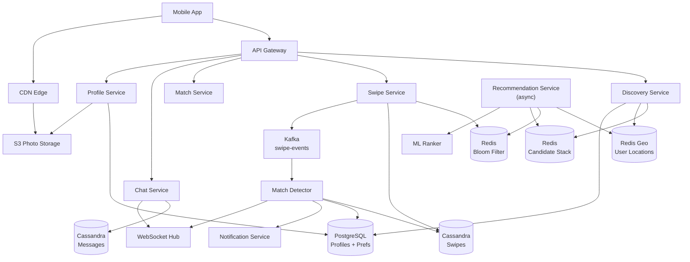
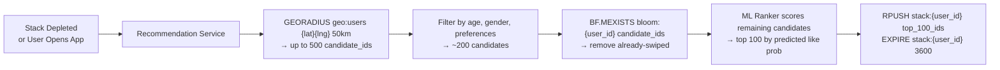
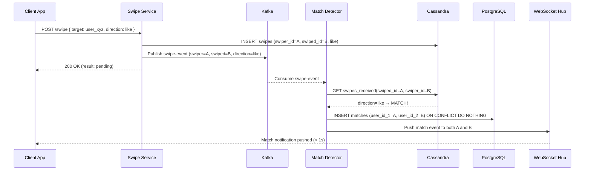
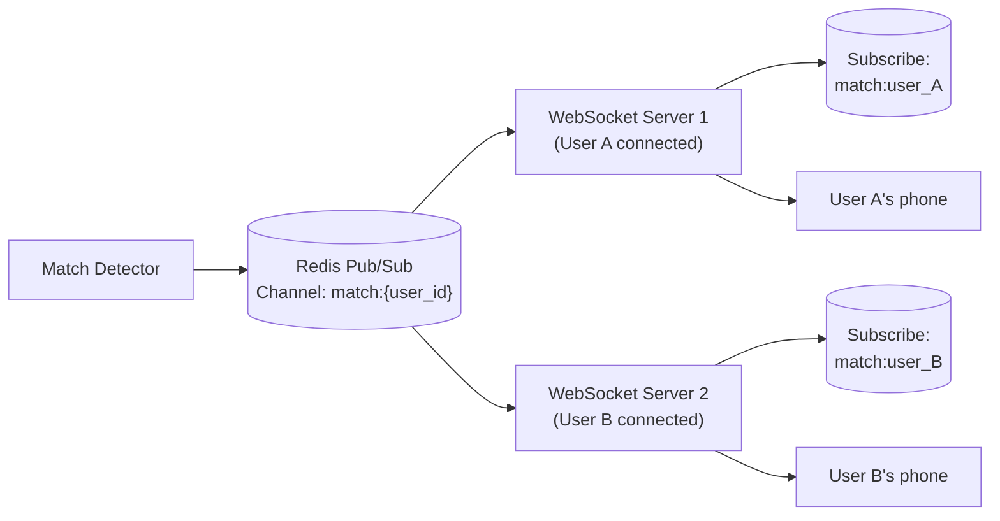

# Design Tinder

Tinder is a location-based dating app with **75 million monthly active users** and **1.6 billion swipes per day**. Users see a stack of nearby profiles, swipe right (like) or left (pass), and if two users both swipe right — a **match** — they can message each other.

The engineering challenge is deceptively simple on the surface: show me people nearby who haven't been swiped yet. In reality, it is one of the hardest feed problems in the industry. It combines **geospatial indexing**, **personalized ML ranking**, a **swipe history filter** with billions of entries, and a **real-time match notification** system — all while maintaining sub-200ms card load times for a UX that lives or dies on feel.

---

## Functional Requirements

**In Scope:**
- View a stack of nearby user profiles (photos, bio, age, distance)
- Swipe right (like) or left (pass) on a profile
- Detect a **match** when two users have mutually liked each other
- **Match notification**: both users are notified immediately on match
- **Messaging**: 1:1 chat between matched users only
- Profile creation and management (photos, bio, preferences)
- **Discovery settings**: age range, gender, max distance radius
- Super Like (premium): signal stronger interest
- Undo last swipe (premium)

**Out of Scope:**
- Video chat / Spotify integration
- Boost (paid profile promotion) — advertising infrastructure
- Safety features (background checks, ID verification)
- ML recommendation algorithm design (deep ranking model)
- Payment and subscription billing
- Reporting and content moderation pipeline

---

## Non-Functional Requirements

| Property | Target | Reasoning |
|---|---|---|
| **Card Load Latency** | p99 < 200ms | Users swipe fast; a stale or slow stack kills engagement |
| **Swipe Throughput** | ~18,500 swipes/sec (1.6B/day) | Core write workload; must never block the read path |
| **Match Notification** | < 2s after mutual swipe | Delayed match notification breaks the dopamine loop |
| **Availability** | 99.99% for swipe + match | Downtime during peak hours (evenings) causes mass churn |
| **Consistency** | Eventual for swipe counts; strong for match detection | Stale swipe count is fine; a missed match is a product failure |
| **Durability** | Zero swipe/match loss | Losing a match is a trust-destroying product bug |
| **Geo Precision** | ± 1 mile accuracy | Exact GPS not needed; city-block precision is sufficient |
| **Discovery Filter** | 100% correct preference enforcement | Showing wrong-age or wrong-gender profiles is a serious UX failure |

**The defining tradeoff:** The candidate stack (the profiles shown to a user) is the hardest problem. Computing it on demand means joining geospatial index + swipe history filter + preference filter + ML ranking on every card load — expensive and slow. Precomputing it (fan-out on write) makes card loads O(1) but requires maintaining a freshness window on potentially stale data. Tinder uses a **hybrid: precompute a 100-card buffer per user, refresh asynchronously**.

---

## Capacity Estimation

**Swipes:**
- 1.6B swipes/day → **~18,500/sec** average; ~55,000/sec peak (evenings, 3× average)
- Like ratio: ~30% right swipes → 5,550 likes/sec; 12,950 passes/sec
- Each swipe record: ~100 bytes → 1.6B × 100B = **160 GB/day** in swipe log

**Matches:**
- Both users must swipe right; at 30% like rate: match rate ≈ 0.09 per swipe pair
- ~1,665 matches/sec at peak

**Profiles:**
- 75M MAU; average 4 photos at 1MB processed → 75M × 4MB = **~300 TB** photo storage
- Profile metadata: 75M × 2KB = **~150 GB** (trivially fits in relational DB with indexes)

**Candidate stack precomputation:**
- 75M DAU × 100 precomputed profiles × 8 bytes (user_id) = **~60 GB RAM** for all stacks across a Redis cluster — feasible

**Swipe history bloom filter:**
- 75M users × 3,000 historical swipes/user × bloom filter: ~8 bits/entry → **~225 GB** — fits in Redis cluster

---

## Core Entities

| Entity | Purpose | Key Fields |
|---|---|---|
| **User** | Account and profile | `user_id`, `name`, `dob`, `gender`, `bio`, `photos[]`, `location` (lat/lng), `last_active`, `subscription_tier` |
| **DiscoveryPreference** | Filters applied to candidate stack | `user_id`, `min_age`, `max_age`, `gender_filter[]`, `max_distance_km`, `show_me` |
| **Swipe** | A like or pass on another user | `swiper_id`, `swiped_id`, `direction` (like/pass/super_like), `swiped_at` |
| **Match** | Mutual like between two users | `match_id`, `user_id_1`, `user_id_2`, `matched_at`, `conversation_id` |
| **Message** | Chat message between matched users | `message_id`, `conversation_id`, `sender_id`, `text`, `sent_at`, `read_at` |
| **CandidateStack** | Precomputed profile queue per user | `user_id`, `candidate_ids[]` (ordered), `generated_at`, `cursor` |
| **Location** | Current geolocation of a user | `user_id`, `lat`, `lng`, `geohash`, `updated_at` |

**Critical modeling decisions:**
- `Swipe` is an **append-only log** — never updated. Pass can't be undone on free tier; like/pass history is queried as a filter to prevent re-showing swiped profiles.
- `Match` is derived from two `Swipe` records but stored explicitly for fast lookup. The Match record is created atomically when the second like is detected — this is the critical section.
- `CandidateStack` is not a database table — it is a Redis List per user, materialized by the Recommendation Service. Ephemeral; rebuilt on expiry or depletion.
- `Location` is updated every 5 minutes while the app is open. Exact real-time GPS is not needed; city-block precision is sufficient and reduces update frequency.

---

## Databases and Database Design

### Storage Tier Decisions

| Data | Access Pattern | Engine | Why |
|---|---|---|---|
| User profiles and preferences | Point reads by `user_id`; preference filter on candidate generation | **PostgreSQL** | ACID for profile updates; complex filter queries; < 150GB fits with indexes |
| Swipe history | Append-only writes; per-user bloom filter check | **Cassandra** | 160 GB/day write volume; partition by `swiper_id`; never updated |
| Matches | Point reads by `(user_id_1, user_id_2)`; per-user match list | **PostgreSQL** | Low volume (1,665/sec); strong consistency for match creation; ACID for atomic insert |
| Messages | High write throughput; per-conversation ordered read | **Cassandra** | Partition by `conversation_id`; clustering on `sent_at`; append-only |
| Geolocation index | Radius search by (lat, lng, distance) | **Redis + PostGIS** | Redis Geo for fast sub-50ms radius queries; PostGIS for precise polygon filters |
| Candidate stacks | O(1) pop per swipe; fast rebuild | **Redis List** | LPOP per swipe; RPUSH on rebuild; 60GB total fits in cluster |
| Swipe filter (seen profiles) | Probabilistic membership check: "have I swiped X?" | **Redis Bloom Filter** | Sub-ms check; 0.1% false positive rate; 225 GB across cluster |
| Photos | Write-once, read-many; global delivery | **S3 + CDN** | Object storage; CDN delivers thumbnails and full images at edge |

### Schema 1 — Users (PostgreSQL)

```sql
CREATE TABLE users (
  user_id         UUID         PRIMARY KEY DEFAULT gen_random_uuid(),
  name            VARCHAR(50)  NOT NULL,
  dob             DATE         NOT NULL,
  gender          VARCHAR(20)  NOT NULL,
  bio             TEXT,
  subscription    VARCHAR(20)  DEFAULT 'free',
  last_active     TIMESTAMPTZ,
  created_at      TIMESTAMPTZ  DEFAULT NOW()
);

CREATE TABLE discovery_preferences (
  user_id          UUID    PRIMARY KEY REFERENCES users(user_id),
  min_age          INT     NOT NULL DEFAULT 18,
  max_age          INT     NOT NULL DEFAULT 35,
  gender_filter    TEXT[]  NOT NULL,
  max_distance_km  INT     NOT NULL DEFAULT 50,
  show_me          BOOLEAN NOT NULL DEFAULT TRUE
);
```

### Schema 2 — User Locations (Redis Geo + PostgreSQL)

```sql
-- PostgreSQL: durable location with geohash for bounding box queries
CREATE TABLE user_locations (
  user_id    UUID        PRIMARY KEY,
  lat        DOUBLE PRECISION NOT NULL,
  lng        DOUBLE PRECISION NOT NULL,
  geohash    VARCHAR(12) NOT NULL,
  updated_at TIMESTAMPTZ DEFAULT NOW()
);
CREATE INDEX idx_geohash ON user_locations (geohash);
```

```
-- Redis: hot geospatial index for real-time radius queries
GEOADD geo:users  {lng} {lat}  {user_id}
GEODIST geo:users  user_A user_B  km
GEORADIUS geo:users  {lng} {lat}  50 km  ASC  COUNT 500
```

Two-tier: Redis `GEORADIUS` returns the initial candidate set in < 10ms. PostgreSQL geohash index is the fallback and the source of truth on Redis cache miss. Location writes update both tiers synchronously — Redis first (read path), PostgreSQL second (durable).

### Schema 3 — Swipes (Cassandra)

```sql
CREATE TABLE swipes (
  swiper_id   UUID,
  swiped_id   UUID,
  direction   TEXT,     -- 'like' | 'pass' | 'super_like'
  swiped_at   TIMESTAMP,
  PRIMARY KEY (swiper_id, swiped_id)
);

-- Reverse lookup: did user B like user A? (for match detection)
CREATE TABLE swipes_received (
  swiped_id   UUID,
  swiper_id   UUID,
  direction   TEXT,
  swiped_at   TIMESTAMP,
  PRIMARY KEY (swiped_id, swiper_id)
);
```

Two tables — one per direction of the swipe graph, same pattern as Instagram's follow graph. `swipes_received` is the hot read path for match detection: when A likes B, check if `swipes_received(swiped_id=A, swiper_id=B, direction=like)` exists.

### Schema 4 — Matches (PostgreSQL)

```sql
CREATE TABLE matches (
  match_id       UUID         PRIMARY KEY DEFAULT gen_random_uuid(),
  user_id_1      UUID         NOT NULL,
  user_id_2      UUID         NOT NULL,
  matched_at     TIMESTAMPTZ  DEFAULT NOW(),
  conversation_id UUID        NOT NULL,
  UNIQUE (user_id_1, user_id_2),
  CHECK (user_id_1 < user_id_2)   -- canonical ordering prevents duplicate rows
);

CREATE INDEX idx_matches_user1 ON matches (user_id_1, matched_at DESC);
CREATE INDEX idx_matches_user2 ON matches (user_id_2, matched_at DESC);
```

`CHECK (user_id_1 < user_id_2)` enforces canonical ordering — the pair (A,B) and (B,A) cannot both exist. The `UNIQUE` constraint makes match creation idempotent. Match volume is ~144M/day ≈ 1,665/sec — PostgreSQL handles this comfortably.

### Schema 5 — Messages (Cassandra)

```sql
CREATE TABLE messages (
  conversation_id UUID,
  sent_at         TIMESTAMP,
  message_id      UUID,
  sender_id       UUID,
  text            TEXT,
  read_at         TIMESTAMP,
  PRIMARY KEY (conversation_id, sent_at)
) WITH CLUSTERING ORDER BY (sent_at DESC)
  AND default_time_to_live = 31536000;  -- 1-year TTL
```

### Sharding and Replication

| Store | Shard Key | Replication |
|---|---|---|
| PostgreSQL (users, matches) | `user_id` range sharding at > 100M users; single primary sufficient initially | Primary + 2 read replicas; synchronous replication for matches |
| Cassandra (swipes, messages) | `swiper_id` / `conversation_id` partition key; Murmur3 | RF=3; LOCAL_QUORUM; 2 DCs |
| Redis (geo, stacks, bloom) | Redis Cluster; hash slots by key prefix | 1 replica per shard; Sentinel for failover |
| S3 (photos) | Managed (AWS object storage partitioning) | S3 cross-region replication |

---

## API Design

**Swipe on a profile:**
```http
POST /v1/swipe
Authorization: Bearer <token>

{ "target_user_id": "user_xyz", "direction": "like" }

200 OK
{
  "result": "match",           -- or "no_match"
  "match": {
    "match_id": "match_abc",
    "conversation_id": "conv_abc",
    "matched_user": { "user_id": "user_xyz", "name": "Alex", "photo_url": "..." }
  }
}
```

**Get candidate stack (card deck):**
```http
GET /v1/discovery/stack?limit=10
Authorization: Bearer <token>

200 OK
{
  "profiles": [
    {
      "user_id": "user_xyz",
      "name": "Alex",
      "age": 27,
      "distance_km": 3.2,
      "bio": "Coffee and hiking",
      "photos": ["https://cdn.tinder.com/photos/xyz_1.jpg", "..."],
      "common_interests": ["hiking", "coffee"]
    }
  ],
  "stack_cursor": "eyJ0..."   -- opaque cursor for next batch
}
```

**Get match list (cursor-paginated):**
```http
GET /v1/matches?limit=20&cursor=eyJ0...
Authorization: Bearer <token>

200 OK
{
  "matches": [
    {
      "match_id": "match_abc",
      "user": { "user_id": "user_xyz", "name": "Alex", "photo_url": "..." },
      "last_message": { "text": "Hey!", "sent_at": "2026-05-29T10:00:00Z" },
      "unread_count": 2,
      "matched_at": "2026-05-29T09:55:00Z"
    }
  ],
  "next_cursor": "eyJ..."
}
```

**Send a message:**
```http
POST /v1/conversations/{conversation_id}/messages
Authorization: Bearer <token>

{ "text": "Hey, love your hiking photos!", "idempotency_key": "client_msg_001" }

201 Created
{
  "message_id": "msg_abc",
  "sent_at": "2026-05-29T10:00:00Z",
  "status": "delivered"
}
```

**Update profile and preferences:**
```http
PATCH /v1/me
Authorization: Bearer <token>

{
  "bio": "Coffee, hiking, and bad puns",
  "discovery_preferences": {
    "min_age": 24, "max_age": 32, "max_distance_km": 25
  }
}

200 OK
{ "user_id": "user_abc", "updated_at": "2026-05-29T10:00:00Z" }
// Triggers async candidate stack rebuild for this user
```

---

## High-Level Design



**Component responsibilities:**

| Component | Role |
|---|---|
| **Discovery Service** | Pops profiles from Redis candidate stack; falls back to sync generation on depletion; enforces preference filters |
| **Swipe Service** | Records swipe to Cassandra; checks Redis Bloom Filter for duplicate swipes; publishes to Kafka |
| **Match Detector** | Kafka consumer; checks `swipes_received` for mutual like; creates match record in PostgreSQL; triggers notification |
| **Recommendation Service** | Async; rebuilds candidate stacks via geo query + bloom filter + ML ranking; runs on a background job schedule |
| **Chat Service** | Stores messages in Cassandra; pushes real-time via WebSocket; validates sender is matched with recipient |
| **Notification Service** | Pushes match and message notifications via FCM/APNS |
| **WebSocket Hub** | Persistent connection per user; receives match events and incoming messages in real-time |

---

## Deep Dives

### 1. The Candidate Stack: Geo + Bloom + ML

Serving a profile card requires three filters applied in order:

1. **Geo filter:** Users within `max_distance_km`
2. **Preference filter:** Age, gender, discovery preferences match both ways
3. **Swipe history filter:** User has not already swiped this profile
4. **ML ranking:** Order remaining candidates by predicted like probability

Doing this on every card swipe in real time is O(nearby_users × filters × ranking) — at 75M DAU, "nearby users within 50km in New York" can return 100K+ users. Running the full pipeline at 18,500 swipes/sec is infeasible in real time.

**The precomputed stack model:**



The Discovery Service pops from this prebuilt list:
```
LPOP stack:{user_id}  → next profile_id to show
LLEN stack:{user_id}  → if < 10, trigger async stack rebuild
```

**Stack staleness:** A precomputed stack may include users who have since changed their preferences, deleted their account, or moved out of range. The Discovery Service does a lightweight **real-time validity check** on each popped profile (is the user still active and in range?) before serving it — a fast Redis lookup, not a full DB query. Invalid profiles are silently skipped.

**Tradeoff:** Precomputation means the stack is up to 1 hour stale. A user who just moved into range won't appear until stack rebuild. For a dating app this is acceptable — users don't expect instantaneous geographic awareness. Rebuild on user location update > 5km ensures major moves trigger a stack refresh.

---

### 2. Kafka: Match Detection at 18,500 Swipes/Sec

Kafka is required for the swipe pipeline. Here is why.

**The naive alternative:** Swipe Service directly queries `swipes_received` in Cassandra on every right-swipe to check for a mutual like. At 5,550 likes/sec, this is 5,550 Cassandra point reads/sec on the hot path — feasible, but synchronous. A Cassandra slowdown stalls the swipe response.

**The Kafka approach:**



**Topic design:** `swipe-events` partitioned by `swiper_id`. All swipes from the same user are processed in order by the same Match Detector instance — enabling per-user rate limiting and deduplication without cross-instance coordination.

**Match detection idempotency:** `INSERT INTO matches ... ON CONFLICT DO NOTHING` handles the race condition where two users swipe right on each other simultaneously, both generating match events within milliseconds. The second insert is a no-op. Only one match record exists.

**Backpressure:** During peak evening usage, Kafka buffers the swipe storm. Match Detector consumers scale horizontally — add more consumer instances up to the partition count. Consumer group lag is the autoscaling signal; target < 5 seconds of lag for the 2-second match notification SLA.

---

### 3. Redis: Bloom Filter, Geo Index, and Stack Cache

Redis is doing heavy lifting across three completely different access patterns.

**a) Bloom Filter — "Have I Already Swiped This Person?"**

The candidate stack generator must exclude all profiles the user has already swiped. With 3,000 historical swipes per user, checking Cassandra for every candidate in a 500-profile geo result set means 500 × 75M = 37.5B potential Cassandra lookups during stack generation — catastrophic.

**Solution: Redis Bloom Filter per user**

```
BF.ADD bloom:{user_id}  {swiped_user_id}       -- on every swipe
BF.MEXISTS bloom:{user_id}  id1 id2 ... id500  -- during stack gen; O(1) per check
```

At 0.1% false positive rate, 1 in 1,000 already-swiped profiles is re-shown. Acceptable — the duplicate swipe is silently recorded as a duplicate in Cassandra (idempotent) and the user barely notices.

**Memory math:** 3,000 historical swipes × 8 bits/entry at 0.1% false positive rate = 24,000 bits = 3 KB per user. 75M users × 3 KB = **~225 GB** across the Redis cluster — distributed across 10+ shards.

**Bloom filter on swipe:** Every right or left swipe calls `BF.ADD bloom:{user_id} {target_id}` synchronously before the Cassandra write. The bloom filter is the performance-critical path; Cassandra is the durable record.

**Cache invalidation:** Bloom filters are **not invalidatable** — you cannot remove an element. For the "Undo" swipe (premium feature), the Cassandra record is deleted and the candidate stack is rebuilt (bloom filter is rebuilt from Cassandra history on stack generation). The bloom filter is regenerated from scratch on stack rebuild — not updated incrementally.

**b) Geo Index — Real-Time Radius Query**

```
GEOADD geo:active_users  {lng} {lat}  {user_id}    -- on location update or app open
GEORADIUS geo:active_users  {lng} {lat}  50  km  ASC  COUNT 500  -- candidate geo query
GEODIST geo:active_users  user_A  user_B  km         -- precise per-pair distance
EXPIRE geo:active_users:{user_id}  1800              -- user removed after 30min inactivity
```

`GEORADIUS` returns up to 500 nearby users in < 10ms. The `COUNT 500` cap prevents the query from returning 100K users in dense cities. In practice, after preference and bloom filtering, 500 candidates yields ~100 final candidates for ML ranking.

**Geo index staleness:** Location is updated every 5 minutes while the app is active. The 30-minute TTL on geo entries means inactive users naturally fall off the geo index — they stop appearing in candidate stacks without any explicit cleanup job.

**c) Candidate Stack Cache**

```
RPUSH stack:{user_id}  id1 id2 id3 ... id100   -- precomputed 100 profiles
EXPIRE stack:{user_id}  3600                    -- 1-hour TTL
LPOP stack:{user_id}                            -- pop next profile to show
LLEN stack:{user_id}                            -- monitor depletion
```

**Cache invalidation:** Explicit `DEL stack:{user_id}` + async rebuild triggered when:
- User updates discovery preferences
- User location moves > 5km
- Stack is depleted (LLEN = 0)
- TTL expires (1 hour — stale profile data)

---

### 4. WebSocket Scaling: Real-Time Match Delivery

A match notification must reach both users' apps within 2 seconds. At 1,665 matches/sec and 75M concurrent mobile clients, this requires a scalable real-time push channel.

**Why not just push notifications:** APNs/FCM push has p99 latency of 5–15 seconds. For match notifications (the core dopamine moment of the product), this is unacceptable. WebSocket delivers in < 100ms.

**WebSocket scaling challenge:** Each WebSocket server maintains persistent connections. User A's connection is on Server 1; User B's connection is on Server 2. The Match Detector needs to push to both — but it doesn't know which server each user is on.



**Implementation:**
- Each WebSocket server subscribes to Redis Pub/Sub channels for every user it has connected
- Match Detector publishes to `match:{user_A}` and `match:{user_B}`
- The server holding each user's connection receives the message and pushes it over the WebSocket

**Scaling numbers:** 75M concurrent connections (evening peak, assume 10% online) = 7.5M connections. At 50K connections per WebSocket server → **150 WebSocket server instances**. Redis Pub/Sub can handle 1M+ messages/sec per node — not a bottleneck.

**Fallback:** If user is offline (no WebSocket connection), fall back to FCM/APNS push notification. The WebSocket Hub marks users as offline if no heartbeat for > 30 seconds; Match Detector checks this flag and routes accordingly.

---

### 5. Mutual Like Race Condition: The Double-Match Problem

Two users swipe right on each other within milliseconds. Two separate Kafka consumers both read their respective swipe events and both run match detection concurrently.

**Timeline:**
- T=0ms: User A swipes right on B → Consumer 1 reads event
- T=5ms: User B swipes right on A → Consumer 2 reads event
- T=10ms: Consumer 1 checks `swipes_received(B→A)` → not yet written
- T=12ms: Consumer 2 checks `swipes_received(A→B)` → exists → creates match
- T=15ms: Consumer 1 re-checks (after Cassandra read) → exists → also tries to create match

**Solution:** The PostgreSQL `INSERT INTO matches ... ON CONFLICT DO NOTHING` with `UNIQUE(user_id_1, user_id_2)` and `CHECK(user_id_1 < user_id_2)` is the final guard. No matter how many concurrent match creation attempts occur, only one match record is created. The second insert returns 0 rows affected — no error, no notification sent twice.

**Notification deduplication:** The Match Detector only pushes match notifications if the insert succeeds (1 row affected). A no-op insert produces no notification.

---

### 6. Hot Spots: Dense City Geo Partitions

In Manhattan, a `GEORADIUS 50km` query can return 500K+ users — all of whom are in the same Redis geo key `geo:active_users`. At 18,500 swipes/sec in New York alone, this single Redis key becomes a hot spot.

**Solutions:**

1. **Geo sharding by city/region:** Instead of one global `geo:active_users` key, shard by geohash prefix:
   ```
   GEOADD geo:users:{geohash_prefix}  {lng} {lat}  {user_id}
   ```
   A user at geohash `dr5r` writes to `geo:users:dr5`. Queries check the user's shard and adjacent shards (to handle users near shard boundaries). This distributes geo writes across N Redis keys → N Redis slots.

2. **Count cap at geo query:** `GEORADIUS ... COUNT 500` caps the result set regardless of density. In dense cities, the 500 nearest users are returned; in sparse rural areas, all 50 might be returned. The cap is applied at the Redis layer — no downstream processing explosion.

3. **Location update throttling:** App sends location update at most once per 5 minutes, and only if location changed by > 500m. A user walking in a city triggers ~1 location update per block — manageable. A user sitting still triggers zero updates.

---

## Summary: Key Architectural Decisions

| Decision | Choice | Core Reason |
|---|---|---|
| Candidate stack | Precomputed Redis List (100 profiles, 1hr TTL) | Geo+filter+rank pipeline too expensive at 18,500 swipes/sec in real time |
| Swipe history filter | Redis Bloom Filter per user | 500 Cassandra lookups per stack gen × 75M users = infeasible; bloom is sub-ms |
| Geo index | Redis GEORADIUS | Sub-10ms radius query; 30-min inactivity TTL auto-evicts offline users |
| Match detection | Kafka consumer + Cassandra mutual-like check | Decoupled from swipe hot path; at-least-once with PostgreSQL idempotent insert |
| Double-match prevention | PostgreSQL `INSERT ... ON CONFLICT DO NOTHING` + canonical ordering | Atomic dedup without distributed locking |
| Real-time match notification | Redis Pub/Sub + WebSocket | < 100ms delivery vs 5–15s for APNs/FCM |
| Swipe storage | Cassandra (two tables per direction) | 160GB/day write volume; append-only; no joins needed |
| Message storage | Cassandra partitioned by `conversation_id` | Chat-at-scale standard pattern; TTL handles retention |
| Photo storage | S3 + CDN | Write-once, read-many; global edge delivery for photos is table stakes |
