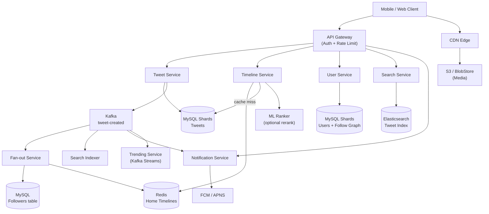
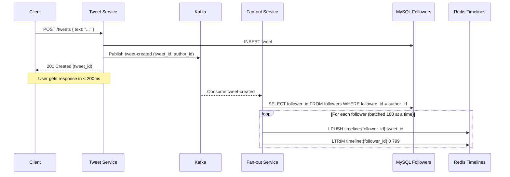
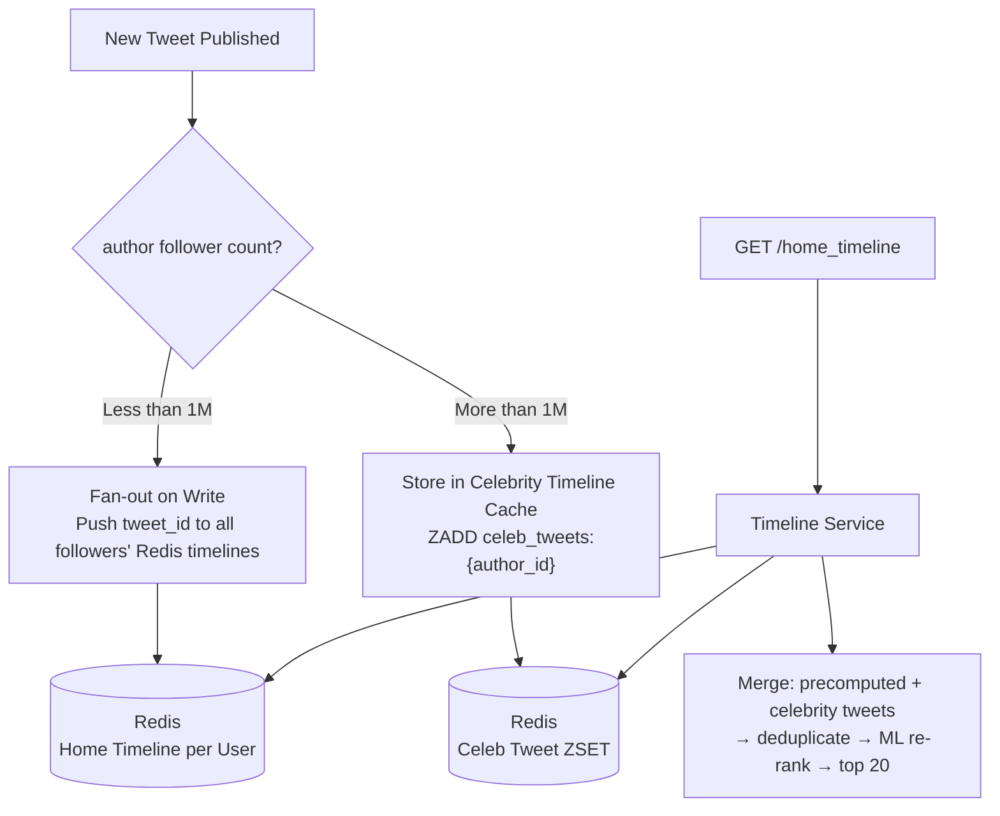
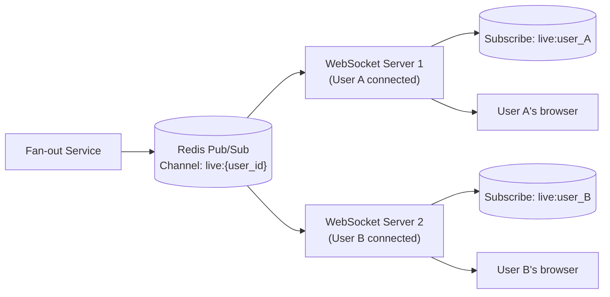
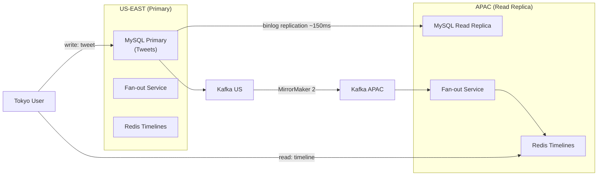

# Design Twitter

Twitter (now X) is a real-time public microblogging platform with **350 million monthly active users**, **200 million daily active users**, and roughly **500 million tweets per day**. Users post short text updates, follow others, and consume a personalized timeline of tweets from accounts they follow.

Architecturally, Twitter is the canonical example of the **fan-out problem**: when Elon Musk tweets to 180 million followers, how do you push that tweet into 180 million timelines in seconds without melting your infrastructure? Twitter's Home Timeline is one of the most studied and written-about system design challenges in the industry — and for good reason. It sits at the intersection of social graph scale, write amplification, cache architecture, and real-time delivery.

---

## Functional Requirements

**In Scope:**
- Post a tweet (text, up to 280 characters; optional image/video/link)
- Follow / unfollow a user (asymmetric — not mutual friendship)
- Home Timeline: personalized, ranked feed of tweets from followed accounts
- User Timeline: all tweets by a specific user (public profile page)
- Like a tweet
- Retweet (share another user's tweet)
- Reply to a tweet (threaded conversations)
- Search tweets and users
- Notifications: new follower, like, retweet, reply, mention
- Trending topics: globally or locally ranked hashtags

**Out of Scope:**
- Twitter Spaces (live audio)
- Twitter Blue / premium feature billing
- Ad serving and targeting
- Direct Messages (separate messaging system)
- Content moderation pipeline
- ML ranking model design (black box for this problem)

---

## Non-Functional Requirements

| Property | Target | Reasoning |
|---|---|---|
| **Timeline Latency** | p99 < 200ms | Core UX metric; Twitter is a real-time product |
| **Tweet Publish Latency** | < 500ms acknowledgment; async fan-out | Users need immediate confirmation; fan-out happens asynchronously |
| **Availability** | 99.99% for timeline reads and tweet creation | Twitter downtime is a global news event |
| **Consistency** | Eventual for timeline, like counts, follower counts | Stale counts acceptable; missing tweets in timeline acceptable for seconds |
| **Durability** | Zero tweet loss | Tweets are the product — losing them is catastrophic |
| **Fan-out SLA** | Tweet visible to all followers within 5 seconds | "Real-time" is the core product promise |
| **Scale** | 200M DAU; 6,000 tweets/sec average; 18,000/sec peak | Every architecture decision derives from these numbers |
| **Search Latency** | p99 < 300ms for full-text tweet search | Near-real-time search is a key differentiator |

**The defining tradeoff:** Twitter's home timeline is the textbook fan-out problem. **Fan-out on write** (precompute timelines by pushing to each follower's cache on every tweet) gives O(1) timeline reads but O(followers) writes — catastrophic for accounts with 180M followers. **Fan-out on read** (compute timeline at read time by scanning followed accounts) gives O(1) writes but O(followed_accounts) reads per request — too slow at scale. The production answer is a **hybrid**: fan-out on write for regular users, fan-out on read for high-follower celebrities, merged at read time.

---

## Capacity Estimation

**Tweets:**
- 500M tweets/day → ~6,000/sec average; ~18,000/sec peak (3× for live events)
- Tweet size: ~300 bytes (text + metadata)
- 500M × 300 bytes = **~150 GB/day** new tweet data

**Timeline reads:**
- 200M DAU × 10 timeline opens/day = 2B reads/day → **~23,000 reads/sec**
- Each timeline fetch returns 20 tweets → 460M tweet-level lookups/sec
- Cache hit rate must be > 99% to survive this

**Fan-out write amplification:**
- Average Twitter user has ~200 followers
- 6,000 tweets/sec × 200 followers = **1.2M fan-out writes/sec** (average)
- Celebrity with 50M followers: one tweet = 50M cache writes — handled separately

**Media:**
- ~30% of tweets include media; 200 bytes thumbnail + 2MB full image/video
- 500M × 0.3 × 2MB = **~300 TB/day** media — served entirely from CDN

**Like / retweet volume:**
- ~10B likes/day → ~115,000/sec
- ~1B retweets/day → ~11,600/sec

**Cache sizing:**
- 200M users × 800 tweet IDs in home timeline × 8 bytes = **~1.3 TB RAM** across a Redis cluster — feasible

---

## Core Entities

| Entity | Purpose | Key Fields |
|---|---|---|
| **User** | Account and public profile | `user_id`, `username`, `display_name`, `bio`, `profile_pic_url`, `follower_count`, `following_count`, `verified`, `created_at` |
| **Tweet** | A single public post | `tweet_id` (Snowflake ID), `author_id`, `text`, `media_ids[]`, `reply_to_tweet_id`, `retweet_of_tweet_id`, `like_count`, `retweet_count`, `reply_count`, `created_at` |
| **Follow** | Directed social edge (asymmetric) | `follower_id`, `followee_id`, `created_at` — stored as two tables per direction |
| **Like** | User reaction to a tweet | `tweet_id`, `user_id`, `created_at` |
| **HomeTimeline** | Precomputed tweet ID cache per user | `user_id`, `tweet_ids[]` (sorted by recency/rank) — Redis structure, not a DB table |
| **Notification** | Social signal event | `notif_id`, `recipient_id`, `actor_id`, `type` (like/retweet/follow/mention), `entity_id`, `created_at`, `read` |
| **TrendingTopic** | Globally or locally ranked hashtag | `hashtag`, `region`, `tweet_count`, `velocity`, `window_start`, `window_end` |

**Critical modeling decisions:**
- `tweet_id` uses **Twitter's Snowflake ID** — a 64-bit timestamp-based ID that is sortable by creation time and globally unique without coordination. This means "get latest tweets" is a range scan by ID — no `ORDER BY created_at` needed.
- `Follow` is stored as **two directed tables**: `following(follower_id, followee_id)` and `followers(followee_id, follower_id)`. Fan-out reads `followers` to get who to push to; profile reads `following` to get who a user follows.
- `HomeTimeline` is **not a database table** — it is a Redis List or Sorted Set materialized by the Fan-out Service. Ephemeral; rebuilt on cache miss.
- `like_count`, `retweet_count`, `reply_count` on Tweet are **denormalized counters** updated asynchronously — never computed by `COUNT(*)` at read time.

---

## Databases and Database Design

### Storage Tier Decisions

| Data | Access Pattern | Engine | Why |
|---|---|---|---|
| User profiles | Point reads by `user_id` or `username`; occasional writes | **MySQL (sharded)** | ACID; relational integrity for auth; fits sharded at 350M users |
| Tweets | High write throughput; point reads by `tweet_id`; user timeline scan | **MySQL (sharded by `author_id`)** | Twitter historically used MySQL; Snowflake IDs avoid hot partitions |
| Follow graph | Adjacency list scan per user; high write on follow/unfollow | **MySQL + FlockDB (Twitter's graph store)** | Partition by `follower_id` and `followee_id` separately |
| Likes | High write volume, eventual consistency | **Cassandra** | Write-heavy; partition by `tweet_id`; idempotent INSERT IF NOT EXISTS |
| Home Timelines | Low-latency sorted reads; fan-out writes | **Redis List / Sorted Set** | O(1) LRANGE; TTL evicts inactive user timelines |
| Trending Topics | Real-time aggregation, sliding window count | **Redis + Kafka Streams** | In-memory sorted set for rankings; Kafka Streams for windowed aggregation |
| Media blobs | Write-once, read-many; global delivery | **S3 + CDN (BlobStore)** | Object storage scales natively; CDN at edge |
| Search index | Full-text tweet search, near-real-time indexing | **Elasticsearch** | Inverted index for text; real-time indexing from Kafka |
| Tweet metadata cache | Sub-ms point reads for individual tweets | **Redis Hash per tweet** | Cache-aside; TTL 1 hour for popular tweets |

### Schema 1 — Tweets (MySQL, sharded by `author_id`)

```sql
CREATE TABLE tweets (
  tweet_id          BIGINT UNSIGNED  NOT NULL,   -- Snowflake ID; sortable by time
  author_id         BIGINT UNSIGNED  NOT NULL,
  text              VARCHAR(280)     NOT NULL,
  reply_to_tweet_id BIGINT UNSIGNED,             -- NULL for top-level tweets
  retweet_of_id     BIGINT UNSIGNED,             -- NULL for original tweets
  like_count        INT UNSIGNED     DEFAULT 0,
  retweet_count     INT UNSIGNED     DEFAULT 0,
  reply_count       INT UNSIGNED     DEFAULT 0,
  deleted_at        DATETIME(3),
  created_at        DATETIME(3)      NOT NULL,
  PRIMARY KEY (tweet_id),
  KEY idx_author_time (author_id, tweet_id DESC)  -- user timeline scan
) ENGINE=InnoDB;
```

Sharded by `author_id`. All tweets from the same user are co-located — user timeline (`GET /users/:id/tweets`) is a single shard scan. `tweet_id` is a Snowflake — sorting by `tweet_id DESC` is equivalent to sorting by recency.

### Schema 2 — Follow Graph (MySQL, two tables)

```sql
-- Who does user X follow? Used when reading a user's following list
CREATE TABLE following (
  follower_id  BIGINT UNSIGNED  NOT NULL,
  followee_id  BIGINT UNSIGNED  NOT NULL,
  created_at   DATETIME(3)      NOT NULL,
  PRIMARY KEY (follower_id, followee_id),
  KEY idx_followee (followee_id, follower_id)
) ENGINE=InnoDB;

-- Who follows user X? Used by Fan-out Service on every tweet
CREATE TABLE followers (
  followee_id  BIGINT UNSIGNED  NOT NULL,
  follower_id  BIGINT UNSIGNED  NOT NULL,
  created_at   DATETIME(3)      NOT NULL,
  PRIMARY KEY (followee_id, follower_id)
) ENGINE=InnoDB;
```

Two tables — one per direction. `followers` is the **hot read path**: Fan-out Service scans all `follower_id`s for the tweet author to know which timelines to push to. Sharded by `followee_id` in `followers` — all followers of a given user are on one shard.

### Schema 3 — Likes (Cassandra)

```sql
CREATE TABLE likes_by_tweet (
  tweet_id   BIGINT,
  user_id    BIGINT,
  created_at TIMESTAMP,
  PRIMARY KEY (tweet_id, user_id)
);

-- Reverse: all tweets liked by a user (for "Likes" profile tab)
CREATE TABLE likes_by_user (
  user_id    BIGINT,
  tweet_id   BIGINT,
  created_at TIMESTAMP,
  PRIMARY KEY (user_id, tweet_id)
) WITH CLUSTERING ORDER BY (tweet_id DESC);
```

`INSERT IF NOT EXISTS` on `likes_by_tweet` makes liking idempotent. Like count on the `tweets` table is updated asynchronously via a Kafka consumer — not in the like transaction.

### Schema 4 — Home Timeline (Redis)

```
-- Redis List approach (simple, O(1) LRANGE, capped at 800 tweets)
LPUSH timeline:{user_id}  {tweet_id}
LTRIM timeline:{user_id}  0  799           -- keep last 800 tweet IDs only
LRANGE timeline:{user_id}  0  19           -- fetch first 20 for display
EXPIRE timeline:{user_id}  604800          -- 7-day TTL; inactive users evicted

-- Alternative: Redis Sorted Set (supports ML ranking scores)
ZADD timeline:{user_id}  {rank_score}  {tweet_id}
ZREVRANGE timeline:{user_id}  0  19        -- top 20 by rank score
ZREMRANGEBYRANK timeline:{user_id}  0  -801  -- trim to 800 entries
```

Twitter historically used a Redis **List** per user for simplicity. To support ML-ranked timelines (non-chronological), a **Sorted Set** with the ML relevance score as the sort key is required — at the cost of more complex fan-out writes.

### Schema 5 — Users (MySQL)

```sql
CREATE TABLE users (
  user_id         BIGINT UNSIGNED  NOT NULL,   -- Snowflake ID
  username        VARCHAR(50)      UNIQUE NOT NULL,
  display_name    VARCHAR(50)      NOT NULL,
  bio             VARCHAR(160),
  profile_pic_url TEXT,
  follower_count  INT UNSIGNED     DEFAULT 0,
  following_count INT UNSIGNED     DEFAULT 0,
  verified        BOOLEAN          DEFAULT FALSE,
  created_at      DATETIME(3)      NOT NULL,
  PRIMARY KEY (user_id),
  UNIQUE KEY idx_username (username)
) ENGINE=InnoDB;
```

### Sharding and Replication

| Store | Shard Key | Strategy | Replication |
|---|---|---|---|
| MySQL (tweets) | `author_id` | Consistent hashing; 1024 shards | Primary + 2 read replicas; semi-sync |
| MySQL (users) | `user_id` | Consistent hashing | Primary + 2 read replicas |
| MySQL (followers/following) | `followee_id` / `follower_id` | Consistent hashing | Primary + 2 replicas |
| Cassandra (likes) | `tweet_id` (likes_by_tweet); `user_id` (likes_by_user) | Murmur3; RF=3; LOCAL_QUORUM | 3 replicas per DC; 2 DCs |
| Redis (timelines, tweet cache) | `user_id` / `tweet_id` | Redis Cluster hash slots | 1 replica per primary shard |
| Elasticsearch (search) | `tweet_id` | 10 primary shards; 1 replica each | Active-active across 2 AZs |

---

## API Design

**Post a tweet:**
```http
POST /v1/tweets
Authorization: Bearer <token>
Idempotency-Key: client-uuid-001

{
  "text": "Just shipped the redesign. Ships to prod tonight 🚀",
  "media_ids": ["media_abc"],
  "reply_to_tweet_id": null
}

201 Created
{
  "tweet_id": "1796000000000000001",
  "author_id": "user_abc",
  "text": "Just shipped the redesign...",
  "created_at": "2026-05-29T10:00:00Z",
  "like_count": 0,
  "retweet_count": 0
}
```

**Get home timeline (cursor-paginated):**
```http
GET /v1/home_timeline?count=20&cursor=eyJ0...
Authorization: Bearer <token>

200 OK
{
  "tweets": [
    {
      "tweet_id": "1796000000000000001",
      "author": { "user_id": "user_abc", "username": "alice", "verified": true },
      "text": "Just shipped the redesign...",
      "like_count": 142,
      "retweet_count": 38,
      "media": [{ "url": "https://cdn.twitter.com/media_abc.jpg", "type": "photo" }],
      "created_at": "2026-05-29T10:00:00Z"
    }
  ],
  "next_cursor": "eyJ0c3..."
}
```

**Get user timeline:**
```http
GET /v1/users/{username}/tweets?count=20&cursor=...

200 OK
{
  "tweets": [ ... ],    -- same tweet format
  "next_cursor": "..."
}
// Served from MySQL user timeline shard — no Redis needed; user's own tweets are always a DB scan
```

**Like a tweet (idempotent):**
```http
POST /v1/tweets/{tweet_id}/likes
Authorization: Bearer <token>

204 No Content
// INSERT IF NOT EXISTS in Cassandra; re-liking is a no-op; count updated async via Kafka
```

**Follow a user:**
```http
POST /v1/users/{user_id}/follow
Authorization: Bearer <token>

204 No Content
// Inserts rows in both following and followers tables (two MySQL shards)
// Async: Fan-out Service backfills followee's recent tweets into follower's home timeline
```

**Search tweets:**
```http
GET /v1/search?q=distributed+systems&result_type=recent&count=20

200 OK
{
  "tweets": [ ... ],
  "total_count": 14200,
  "next_cursor": "..."
}
// Hits Elasticsearch; near-real-time (new tweets indexed within 30s)
```

---

## High-Level Design



**Component responsibilities:**

| Component | Role |
|---|---|
| **Tweet Service** | Validates and persists tweet to MySQL; uploads media to BlobStore; publishes `tweet-created` to Kafka; returns 201 immediately |
| **Timeline Service** | Reads home timeline from Redis; falls back to on-demand fan-in on cache miss; optionally calls ML Ranker for re-ranking |
| **Fan-out Service** | Kafka consumer; reads poster's follower list from MySQL; pushes `tweet_id` into each follower's Redis timeline |
| **User Service** | Manages profiles, follow/unfollow; updates denormalized `follower_count` and `following_count` counters |
| **Search Service** | Queries Elasticsearch; returns tweet results ranked by recency or relevance |
| **Trending Service** | Kafka Streams job; counts hashtag occurrences in a 24-hour sliding window; publishes top trends to Redis |
| **Notification Service** | Kafka consumer; aggregates events and delivers push via FCM/APNS |
| **Search Indexer** | Kafka consumer; indexes new tweets into Elasticsearch within 30 seconds |

---

## Deep Dives

### 1. Kafka: The Nervous System of the Write Path

Every tweet creation triggers four independent downstream reactions:

| Consumer | What It Does | SLA |
|---|---|---|
| **Fan-out Service** | Pushes tweet_id to all follower timelines | < 5s for regular users |
| **Notification Service** | Sends push notifications for mentions, replies | < 5s |
| **Search Indexer** | Indexes tweet into Elasticsearch | < 30s |
| **Trending Service** | Counts hashtags in sliding window | Near-real-time (seconds) |

Without Kafka, Tweet Service would synchronously call all four — a Elasticsearch indexing slowdown would stall every tweet creation. Kafka makes the write path **O(1) from the user's perspective**: Tweet Service writes to MySQL, publishes to Kafka, and returns 201. Everything downstream is async.



**Topic partitioning:** `tweet-created` is partitioned by `author_id`. All tweets from the same user go to the same partition — processed in order by the same Fan-out worker. This matters for retweet ordering and avoids race conditions in follower timeline updates.

**Backpressure:** During a live event (World Cup final, election night), tweet volume spikes to 18,000/sec. Fan-out falls behind — consumer group lag grows. Kafka buffers without loss. Fan-out workers auto-scale (Kubernetes HPA on consumer lag metric). Alert at 10 seconds of lag; the 5-second fan-out SLA is breachable but recoverable once workers scale.

**Kafka retention:** 7 days on `tweet-created`. This enables the search indexer to replay events if Elasticsearch falls behind, and allows the trending pipeline to reprocess for metric corrections — without touching MySQL.

---

### 2. The Celebrity Problem: Hybrid Fan-out

**Why pure fan-out on write fails for celebrities:**

Elon Musk tweets. Fan-out Service reads 180M follower IDs from MySQL — that alone takes minutes. Then it does 180M Redis LPUSH operations. At 100K Redis writes/sec across the cluster, that is **30 minutes** to fan-out one tweet. The tweet must appear in timelines within 5 seconds.

**The hybrid model:**



**How the merge works at read time:**
1. Fetch precomputed timeline from `timeline:{user_id}` — top 100 tweet IDs
2. For each followed celebrity (typically 5–20 per user), fetch their last 10 tweets from `celeb_tweets:{celebrity_id}`
3. Merge and deduplicate both lists
4. Pass through ML Ranker to score and re-rank
5. Return top 20

**Celebrity threshold:** Twitter uses ~1M followers as the threshold. Users above this never get pushed to follower timelines — they are always fan-out-on-read. This affects ~0.01% of accounts but represents a disproportionate share of content.

**The tradeoff:** Fan-out on read for celebrities adds ~5–20ms of extra Redis reads at timeline load time (one `ZREVRANGE` per followed celebrity). With the ML Ranker already adding latency, this is within budget. For users who follow 50 celebrities, the merge adds 50 × 1ms = 50ms — still under the 200ms p99 budget.

---

### 3. Redis: Timeline Cache, Tweet Metadata, and Trending

Redis runs three distinct access patterns at Twitter.

**a) Home Timeline — Redis List (Write-Through, Read-Through)**

```
LPUSH  timeline:{user_id}   {tweet_id}     -- fan-out write: prepend newest tweet
LTRIM  timeline:{user_id}   0  799         -- cap at 800 entries
LRANGE timeline:{user_id}   0  19          -- serve first 20 for display
EXPIRE timeline:{user_id}   604800         -- 7-day TTL; inactive users evicted
```

**Cold start on cache miss:** A user opens Twitter after 10 days (timeline expired). Timeline Service falls back to **fan-in**: fetches the user's following list from MySQL, queries each followee's recent tweets from MySQL (capped at last 20 per followee), merges chronologically, populates Redis. Takes ~300ms for a user following 200 accounts — visibly slower but happens < 1% of the time for active users.

**Cache invalidation:** No explicit invalidation for tweet deletes — Twitter uses soft-delete (`deleted_at` set on tweet). Timeline Service filters deleted tweets at render time using a lightweight `tweet:{tweet_id}:deleted` Redis key check. Deleted tweets expire from timelines naturally via the 800-tweet cap rolling forward.

**b) Tweet Metadata Cache — Redis Hash**

```
HSET tweet:{tweet_id}   text "..."  like_count 142  retweet_count 38  author_id "..."
EXPIRE tweet:{tweet_id}  3600          -- 1-hour TTL for popular tweets

HINCRBY tweet:{tweet_id}  like_count  1   -- atomic increment on like; no RMW race
HINCRBY tweet:{tweet_id}  retweet_count  1
```

Timeline Service fetches 20 tweet IDs from the timeline list, then does a **batch HGETALL** for all 20 tweet hashes in a single Redis pipeline call — effectively O(1) for the entire page fetch. Cache miss triggers a MySQL read and repopulates the hash.

**c) Trending Topics — Redis Sorted Set + Kafka Streams**

```
ZADD trending:global    {tweet_count}   "#distributedSystems"
ZADD trending:US        {tweet_count}   "#SuperBowl"
ZREVRANGE trending:global  0  9          -- top 10 global trends
```

Kafka Streams runs a **24-hour sliding window** count of hashtag occurrences on the `tweet-created` topic. Every 30 seconds, Trending Service updates the Redis sorted set with fresh counts. Trend score = `raw_count × velocity_multiplier` (where velocity = rate of increase in the last hour — prevents stale trends from staying at the top).

**Cache invalidation for trends:** Trends are entirely managed by Kafka Streams. Redis is an output — no explicit invalidation. Stale entries decay naturally as newer hashtags accumulate higher counts. The Trending Service prunes hashtags not seen in the last 24 hours on each update cycle.

---

### 4. WebSocket Scaling: Real-Time Tweet Delivery

Twitter's "new tweets available — click to refresh" feature and live count updates require a persistent connection from client to server.

**The problem at scale:** 200M daily active users; during a live event (Super Bowl, election), 50M concurrent connections. At 50K connections per WebSocket server → **1,000 WebSocket server instances**.

**Architecture:**



- Fan-out Service pushes a lightweight `{tweet_id, author_id}` signal to `live:{user_id}` via Redis Pub/Sub — not the full tweet payload
- The client receives the signal and displays "3 new tweets — click to see" — it fetches the actual tweets on click via the normal REST API
- This separates the **signaling path** (WebSocket, lightweight) from the **data fetch path** (REST, full payload)

**Connection drain:** WebSocket servers are stateless relative to tweet data — they hold only socket connections. Rolling deploys drain connections gracefully (send `GOAWAY` frame, clients reconnect to new server within 5 seconds). No sticky session concerns for tweet delivery.

**Mobile fallback:** Mobile clients use APNs/FCM for push when the app is backgrounded. The Notification Service publishes push tokens to the push provider. Online detection: WebSocket heartbeat every 30 seconds; if no heartbeat, client is considered offline and falls back to push.

---

### 5. Hot Partitions: Viral Tweets and the Write Spike

**The problem:** A tweet goes viral. Every user on Twitter reacts — 100,000 likes per minute flow into `likes_by_tweet` Cassandra with the same `tweet_id`. This creates a **hot partition**: a single Cassandra node handles all writes for that `tweet_id`.

**Why it happens:** Cassandra partitions by `tweet_id`. A viral tweet concentrates all like writes on one partition → one node → CPU saturation → write timeouts → cascading failures.

**Solutions:**

1. **Write buffering in Redis:** Instead of writing every like directly to Cassandra:
   ```
   INCR like_buffer:{tweet_id}    -- atomic counter; all writes go to Redis
   ```
   A background job periodically flushes the buffer into Cassandra in bulk. Like counts are served from Redis (sub-ms); Cassandra gets batched writes (100K likes → 1 write per flush interval). Tradeoff: likes are durable only after flush — 30-second window of potential loss. Acceptable for a social signal.

2. **Write sharding with synthetic partition keys:**
   ```sql
   -- Instead of PRIMARY KEY (tweet_id, user_id)
   -- Use a bucketed partition key
   PRIMARY KEY ((tweet_id, bucket), user_id)
   -- where bucket = random int 0-9
   ```
   Writes distribute across 10 Cassandra partitions. Reads must query all 10 partitions and merge — a scatter-gather. For like existence checks ("did I like this tweet?"), query the specific bucket using `hash(user_id) % 10`.

3. **Hot tweet detection:** Monitor `INCR` rate per `tweet_id` in Redis. At > 10,000 likes/min, promote the tweet to "hot" status — route all reads to an in-memory hot-tweet cache (`HOT:tweet:{tweet_id}`) with millisecond TTL refresh instead of hitting Cassandra.

**Tradeoff table:**

| Solution | Consistency | Throughput | Complexity |
|---|---|---|---|
| Direct Cassandra | Strong | Low (hot partition) | Low |
| Redis buffer + flush | Eventual (30s lag) | Very high | Medium |
| Write sharding | Strong | High | High (scatter-gather) |
| Hot tweet in-memory | Eventual | Extreme | High |

Production answer: Redis buffering + hot tweet detection. The 30-second eventual consistency for like counts is invisible to users.

---

### 6. Multi-Region Deployment

Twitter has users globally. A user in Tokyo reading a timeline of accounts based in San Francisco experiences **cross-region read latency** if their requests route to US data centers.

**Architecture — Read-Local, Write-Global:**



- **Writes** always go to the primary US data center (or nearest primary region) — ensures strong consistency for tweet creation
- **Reads** are served from the local region's Redis timeline cache — p99 < 50ms for Tokyo users reading from APAC Redis
- **Replication lag** (~150ms cross-Pacific): a tweet posted by a Tokyo user may not appear in Tokyo-based followers' timelines for 1–3 seconds due to MySQL replication + Kafka MirrorMaker lag. Acceptable — Twitter's "eventual" fan-out SLA is 5 seconds.

**Write routing:** Twitter uses **GeoDNS** to route API write requests to the nearest primary region. Users in Europe write to EU-WEST primary; users in APAC write to APAC primary. All primaries replicate to each other asynchronously.

---

### 7. Snowflake ID: Distributed ID Generation

Twitter's Snowflake IDs are a foundational architecture decision that eliminates the need for a centralized auto-increment counter:

```
| 41 bits timestamp (ms since epoch) | 10 bits machine ID | 12 bits sequence |
```

- **41 bits timestamp:** ~69 years of IDs before overflow
- **10 bits machine ID:** 1,024 unique generators
- **12 bits sequence:** 4,096 IDs per millisecond per machine → **4M IDs/sec per machine**

**Why this matters for the system design:**
- Globally unique without coordination — no single point of failure
- Naturally time-sortable — `ORDER BY tweet_id DESC` is equivalent to `ORDER BY created_at DESC`, making timeline queries B-tree-efficient
- Embeds creation time — no separate `created_at` column needed for range queries
- Enables efficient cursor-based pagination: `WHERE tweet_id < {cursor_tweet_id} LIMIT 20`

---

## Summary: Key Architectural Decisions

| Decision | Choice | Core Reason |
|---|---|---|
| Tweet ID | Snowflake (timestamp + machine + sequence) | Globally unique, time-sortable, no coordination needed |
| Home Timeline | Redis List (800 tweets, 7-day TTL, fan-out on write) | O(1) reads; cache miss < 1% for active users |
| Fan-out model | Hybrid: write for < 1M followers; read-merge for celebrities | Pure write fan-out collapses for 180M-follower accounts |
| Kafka | Required for all tweet-creation downstream work | Decouples 4 consumers from Tweet Service; absorbs viral traffic bursts |
| Follow graph | Two MySQL tables (following + followers) | Per-direction partition key; fan-out reads `followers` table in O(1) per shard |
| Hot partition | Redis buffer + hot-tweet detection | Viral tweets create Cassandra hot partitions; Redis absorbs the spike |
| Trending topics | Kafka Streams sliding window → Redis Sorted Set | Real-time hashtag counting without custom distributed aggregation |
| Multi-region | Read-local Redis; write-global MySQL primary | < 50ms read latency globally; eventual consistency on cross-region fan-out |
| Like counting | Redis HINCRBY (atomic) + async Cassandra flush | No read-modify-write race; Cassandra protected from hot partition writes |
