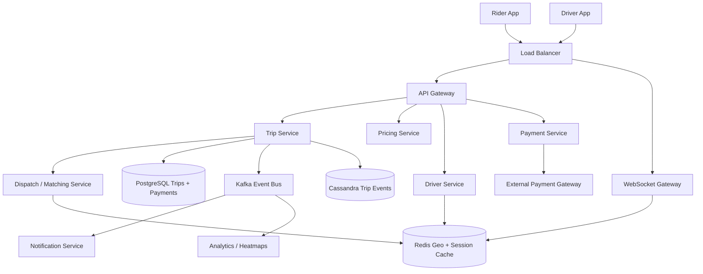
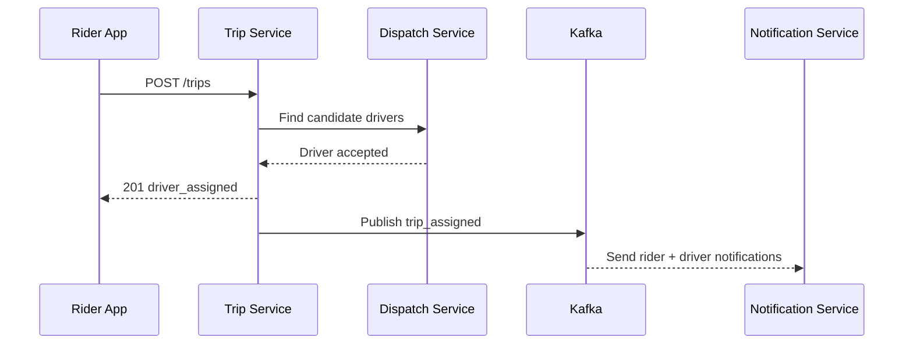
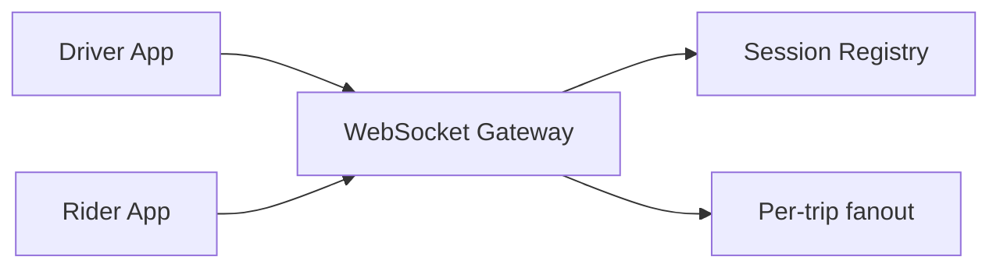
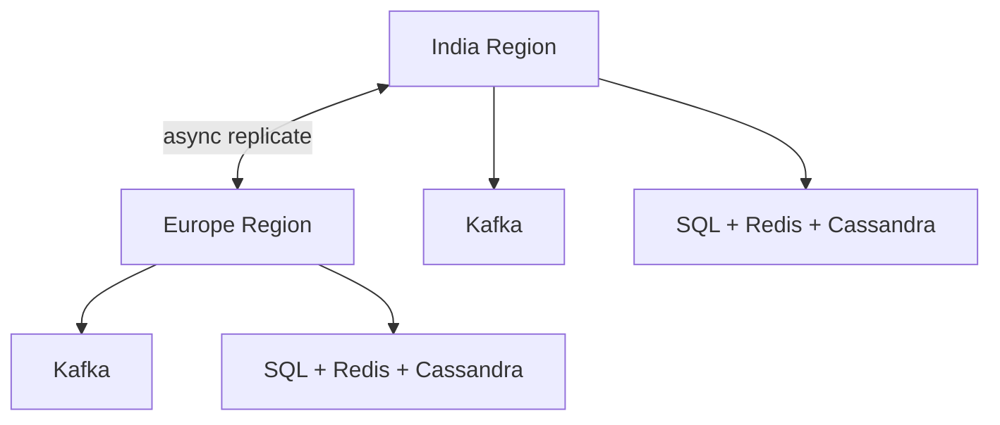

# Design Uber

Uber is a strong system design interview problem because it combines a massive **read-and-write geospatial system** with a correctness-sensitive **trip lifecycle and payment pipeline**. The user experience looks simple: open the app, request a ride, watch the driver approach, reach the destination. Underneath, the system has to handle real-time location streams, matching, ETA estimation, surge pricing, trip state machines, and payment orchestration across many cities simultaneously.

The surface looks simple: request a car, get matched, complete a trip. The depth lies in high-frequency location updates, city-level hotspots, dispatch races, WebSocket scaling, trip-event ordering, offline fallback, and keeping the matching path fast even while downstream systems like payments, notifications, and analytics run asynchronously.

---

## Functional Requirements

**In Scope:**
- Riders can request a trip with pickup and destination
- Drivers can go online/offline and continuously update their location
- The system matches riders to nearby available drivers
- Riders and drivers can see real-time trip state and live location updates
- The system computes fare estimates and applies surge pricing when needed
- Payments are captured after trip completion and receipts are generated
- Riders can cancel trips and drivers can accept or reject requests
- Users can view trip history and trip status

**Out of Scope:**
- Food delivery and courier workflows
- Driver incentives and payout settlement internals
- Fraud-model internals and identity verification workflows
- Multi-stop pooling and route-optimization internals for Uber Pool
- Autonomous vehicle dispatch

---

## Non-Functional Requirements

| Property | Target | Reasoning |
|---|---|---|
| **Match Latency** | p99 < 3s | Riders expect a near-instant assignment after requesting a trip |
| **Location Freshness** | < 1-2s end-to-end for active trips | Live tracking feels broken if driver location is stale |
| **Availability** | 99.99% for trip request and trip tracking | Core ride flows must survive regional failures and bursts |
| **Durability** | No loss of trips, payments, or trip state transitions | Ride history and payments are business-critical records |
| **Consistency** | Strong for driver assignment, trip ownership, and payment state; eventual for ETAs, surge multipliers, and heatmaps | Approximate ETAs are fine; duplicate trip assignment is not |
| **Scale** | Tens of millions of riders, millions of drivers, millions of location updates/sec | Every design choice is shaped by geospatial write volume |
| **Reliability** | Graceful degradation during concerts, airports, and rain spikes | Localized demand spikes should not take down the platform |

**Key tradeoff:** Uber optimizes for **fast, correct trip assignment over perfectly fresh secondary views**. Heatmaps, ETA forecasts, and surge dashboards can lag slightly. Driver assignment, trip state, and payment capture cannot drift casually because they directly affect customer trust and money movement.

---

## Capacity Estimation

**Trips:**
- Assume **40M trips/day** globally
- ~460 trip requests/sec average, **4-5K/sec peak** during commute and event spikes

**Drivers and location updates:**
- Assume **5M drivers online at peak**
- One location update every 3 seconds per active driver -> **~1.7M location updates/sec** peak
- Riders on active trips also send app heartbeats, but driver updates dominate the real-time path

**Trip state events:**
- Trip requested, offered, accepted, arrived, started, completed, cancelled, payment authorized
- These state changes plus tracking events generate **hundreds of thousands of events/sec** at scale

**Storage:**
- Trip metadata, payments, and user records fit in tens of TB hot storage
- Trip events, route traces, and location history quickly grow to PB-scale if retained long-term

---

## Core Entities

| Entity | Purpose | Key Fields | Relationships |
|---|---|---|---|
| **User** | Shared identity for rider or driver account | `user_id`, `name`, `phone`, `rating`, `status`, `created_at` | owns rider or driver profile |
| **Driver** | Driver-specific operational state | `driver_id`, `user_id`, `vehicle_id`, `service_level`, `online_status`, `current_city_id` | receives dispatch offers and trips |
| **Vehicle** | Car metadata used for matching and pricing | `vehicle_id`, `driver_id`, `type`, `plate_number`, `capacity`, `status` | linked to one driver |
| **Trip** | Durable ride record | `trip_id`, `rider_id`, `driver_id`, `status`, `pickup_point`, `dropoff_point`, `quoted_fare`, `created_at` | has many trip events and one payment |
| **TripEvent** | Ordered lifecycle or telemetry event | `trip_id`, `seq_no`, `event_type`, `payload`, `created_at` | belongs to one trip |
| **DriverLocation** | Latest mutable location for a driver | `driver_id`, `lat`, `lng`, `heading`, `updated_at`, `availability` | used by matching and rider tracking |
| **PaymentAttempt** | Payment orchestration state | `payment_id`, `trip_id`, `provider`, `status`, `amount_cents`, `updated_at` | belongs to one trip |
| **DispatchOffer** | Temporary assignment offer sent to a driver | `offer_id`, `trip_id`, `driver_id`, `expires_at`, `state` | coordinates acceptance race and retries |

**Critical modeling decisions:**
- `Trip` is a durable transactional record; `TripEvent` is the append-only lifecycle history used for audits, replay, and secondary views.
- `DriverLocation` is mutable hot state and should not live only in the primary trip database.
- `DispatchOffer` is separate from `Trip` because assignment is a race-prone temporary workflow with TTL, retries, and expiry.

---

## Databases and Database Design

### Storage Tier Decisions

| Data | Access Pattern | Engine | Why |
|---|---|---|---|
| Users, drivers, vehicles, trips, payments | transactional writes, exact reads, state transitions | **PostgreSQL / MySQL** | assignment and payment correctness need ACID semantics |
| Live driver locations and availability | ultra-high write throughput, geospatial lookups, TTL-like hot state | **Redis Geo + in-memory geocell maps** | sub-millisecond nearby-driver lookup and fast mutation |
| Trip events and historical telemetry | append-only, time-series reads per trip or driver | **Cassandra** | predictable writes and cheap large-scale event retention |
| Dispatch, notifications, trip side effects | durable event streaming with many consumers | **Kafka** | decouples trip creation from downstream consumers |
| Heatmaps, search indices, and secondary analytics | aggregated read models | **Elasticsearch/OpenSearch + OLAP** | suited for geospatial analytics and operational dashboards |
| Receipts, driver documents, route snapshots | immutable blobs | **Object Storage** | cheap durable storage for artifacts and exports |

This is intentionally polyglot. Ride-hailing has to separate **transactional trip state**, **live geospatial state**, **append-only event history**, and **derived operational views** because they have fundamentally different latency and consistency needs.

### Schema 1 - Users, Drivers, and Vehicles (PostgreSQL)

```sql
CREATE TABLE users (
  user_id            UUID PRIMARY KEY DEFAULT gen_random_uuid(),
  name               VARCHAR(120) NOT NULL,
  phone              VARCHAR(20) UNIQUE NOT NULL,
  rating             DECIMAL(3,2),
  status             VARCHAR(16) NOT NULL DEFAULT 'active',
  created_at         TIMESTAMPTZ DEFAULT NOW()
);

CREATE TABLE drivers (
  driver_id          UUID PRIMARY KEY DEFAULT gen_random_uuid(),
  user_id            UUID NOT NULL REFERENCES users(user_id),
  service_level      VARCHAR(32) NOT NULL,
  online_status      VARCHAR(16) NOT NULL DEFAULT 'offline',
  current_city_id    BIGINT NOT NULL,
  updated_at         TIMESTAMPTZ DEFAULT NOW()
);

CREATE TABLE vehicles (
  vehicle_id         UUID PRIMARY KEY DEFAULT gen_random_uuid(),
  driver_id          UUID NOT NULL REFERENCES drivers(driver_id),
  type               VARCHAR(32) NOT NULL,
  plate_number       VARCHAR(32) UNIQUE NOT NULL,
  capacity           INT NOT NULL,
  status             VARCHAR(16) NOT NULL DEFAULT 'active'
);
```

### Schema 2 - Trips (PostgreSQL)

```sql
CREATE TABLE trips (
  trip_id              UUID PRIMARY KEY DEFAULT gen_random_uuid(),
  rider_id             UUID NOT NULL REFERENCES users(user_id),
  driver_id            UUID REFERENCES drivers(driver_id),
  status               VARCHAR(20) NOT NULL,
  pickup_lat           DOUBLE PRECISION NOT NULL,
  pickup_lng           DOUBLE PRECISION NOT NULL,
  dropoff_lat          DOUBLE PRECISION,
  dropoff_lng          DOUBLE PRECISION,
  quoted_fare_cents    BIGINT,
  final_fare_cents     BIGINT,
  idempotency_key      VARCHAR(128) UNIQUE NOT NULL,
  created_at           TIMESTAMPTZ DEFAULT NOW()
);

CREATE INDEX idx_trips_rider_created ON trips (rider_id, created_at DESC);
CREATE INDEX idx_trips_driver_created ON trips (driver_id, created_at DESC);
```

The `idempotency_key` prevents duplicate trip creation when the rider app retries after a timeout.

### Schema 3 - Dispatch Offers (PostgreSQL)

```sql
CREATE TABLE dispatch_offers (
  offer_id             UUID PRIMARY KEY DEFAULT gen_random_uuid(),
  trip_id              UUID NOT NULL REFERENCES trips(trip_id),
  driver_id            UUID NOT NULL REFERENCES drivers(driver_id),
  state                VARCHAR(16) NOT NULL,
  expires_at           TIMESTAMPTZ NOT NULL,
  created_at           TIMESTAMPTZ DEFAULT NOW(),
  UNIQUE (trip_id, driver_id)
);
```

This makes driver-offer races explicit and auditable. It is better than implicitly inferring offer state only from Kafka logs.

### Schema 4 - Payment Attempts (PostgreSQL)

```sql
CREATE TABLE payment_attempts (
  payment_id           UUID PRIMARY KEY DEFAULT gen_random_uuid(),
  trip_id              UUID NOT NULL REFERENCES trips(trip_id),
  provider             VARCHAR(32) NOT NULL,
  status               VARCHAR(20) NOT NULL,
  amount_cents         BIGINT NOT NULL,
  provider_ref         VARCHAR(128),
  idempotency_key      VARCHAR(128) UNIQUE NOT NULL,
  updated_at           TIMESTAMPTZ DEFAULT NOW()
);
```

### Schema 5 - Trip Events (Cassandra)

```sql
CREATE TABLE trip_events (
  trip_id              UUID,
  seq_no               BIGINT,
  event_type           TEXT,
  actor_id             UUID,
  payload_json         TEXT,
  created_at           TIMESTAMP,
  PRIMARY KEY (trip_id, seq_no)
) WITH CLUSTERING ORDER BY (seq_no ASC);
```

Partitioning by `trip_id` preserves per-trip ordering and makes replay straightforward.

### Schema 6 - Driver Location Cache (Logical Redis Schema)

```text
GEOADD drivers:city:{city_id}:cell:{h3_cell} {lng} {lat} {driver_id}
HSET driver:{driver_id} lat {lat} lng {lng} heading {heading} availability {availability} updated_at {ts}
EXPIRE driver:{driver_id} 30
```

The geospatial index and latest mutable driver state belong in Redis because the access pattern is hot, ephemeral, and latency-sensitive.

### Sharding and Replication Strategy

| Store | Shard Key | Strategy | Replication |
|---|---|---|---|
| Trips / Payments / Dispatch | `trip_id` or city shard | logical hash sharding with city affinity | primary + read replicas |
| Driver Location | `city_id + h3_cell` | geocell partitioning in Redis Cluster | 1 replica per master |
| Trip Events | `trip_id` | consistent hashing in Cassandra | RF=3, `LOCAL_QUORUM` writes |
| OpenSearch | city / time / event type | sharded operational index | 1 primary + 1 replica |
| Kafka | `trip_id` or `driver_id` | partitioned durable log | RF=3 |

**Consistency model:**
- Strong consistency for trip creation, driver assignment, payment state, and cancellation state transitions
- Eventual consistency for ETAs, surge heatmaps, trip dashboards, and secondary analytics

**Read/write patterns:**
- **Request path:** rider quote/request -> trip row -> dispatch offers -> driver accept -> trip event stream
- **Tracking path:** driver location updates -> Redis hot state -> WebSocket/SSE fanout -> periodic durable event writes
- **Post-trip path:** trip completion -> payment capture -> Kafka fanout to receipts, notifications, and analytics

---

## API Design

**Request fare estimate:**
```http
POST /v1/quotes
Authorization: Bearer <jwt>

{
  "pickup": { "lat": 12.9716, "lng": 77.5946 },
  "dropoff": { "lat": 12.9352, "lng": 77.6245 },
  "service_level": "uber_go"
}

200 OK
{
  "quote_id": "qt_123",
  "estimated_fare_cents": 24500,
  "surge_multiplier": 1.4,
  "eta_seconds": 240
}
```

**Request a trip:**
```http
POST /v1/trips
Authorization: Bearer <jwt>
Idempotency-Key: trip-6d7f-001

{
  "quote_id": "qt_123",
  "pickup": { "lat": 12.9716, "lng": 77.5946 },
  "dropoff": { "lat": 12.9352, "lng": 77.6245 },
  "service_level": "uber_go"
}

201 Created
{
  "trip_id": "trip_789",
  "status": "searching_driver",
  "quoted_fare_cents": 24500
}
```

**Driver location update:**
```http
PATCH /v1/drivers/{driver_id}/location
Authorization: Bearer <jwt>

{
  "lat": 12.9709,
  "lng": 77.5932,
  "heading": 180,
  "availability": "available"
}

204 No Content
```

**Driver accepts trip:**
```http
POST /v1/driver/trips/{trip_id}/accept
Authorization: Bearer <jwt>
Idempotency-Key: accept-9c1a-001

{
  "offer_id": "offer_456"
}

200 OK
{
  "trip_id": "trip_789",
  "status": "driver_assigned",
  "driver_id": "drv_222"
}
```

**Get trip status:**
```http
GET /v1/trips/{trip_id}
Authorization: Bearer <jwt>

200 OK
{
  "trip_id": "trip_789",
  "status": "driver_arriving",
  "driver": {
    "driver_id": "drv_222",
    "name": "Amit",
    "vehicle": "WagonR"
  },
  "driver_location": { "lat": 12.9698, "lng": 77.5921 },
  "eta_seconds": 90
}
```

**Cancel trip:**
```http
POST /v1/trips/{trip_id}/cancel
Authorization: Bearer <jwt>

{
  "reason": "rider_changed_mind"
}

200 OK
{
  "trip_id": "trip_789",
  "status": "cancelled"
}
```

**Real-time trip channel (WebSocket):**
```text
WSS wss://realtime.uber.example/v1/trips/{trip_id}
Authorization: Bearer <jwt>
```
Real-time events such as driver location, arrival state, and trip completion flow over a dedicated real-time channel. REST handles trip creation and fallback reads.

---

## High-Level Design



**Component responsibilities:**

| Component | Role |
|---|---|
| **API Gateway** | Auth, rate limiting, routing, city/region steering |
| **Trip Service** | Creates trips, enforces state machine transitions, owns trip lifecycle |
| **Dispatch / Matching Service** | Finds nearby drivers, creates offers, resolves acceptance races |
| **Driver Service** | Maintains driver availability, profile, and live location ingestion |
| **Pricing Service** | Computes fare estimates, surge multipliers, and ETA signals |
| **Payment Service** | Creates payment attempts, captures payment, handles provider callbacks |
| **WebSocket Gateway** | Maintains rider/driver real-time channels and pushes trip updates |
| **Redis** | Live geospatial index, session registry, hot driver state, rate limits |
| **Kafka** | Durable event backbone for trip updates, notifications, and analytics |
| **Cassandra** | Append-only trip event history and replayable audit log |

**Ride request flow:**
1. Rider → `POST /v1/trips` → Trip Service creates a `searching_driver` trip row with an idempotency key
2. Dispatch Service queries Redis for nearby available drivers in the rider's geocell and adjacent cells
3. Dispatch creates short-lived offers and sends them to candidate drivers over WebSocket or push fallback
4. The first valid driver acceptance wins via transactional trip/offer state update
5. Rider and driver receive live updates over the real-time channel while trip events stream to Kafka and Cassandra asynchronously

---

## Deep Dives

### 1. Kafka: Required for Trip Lifecycle Side Effects

Kafka is required for Uber, but not because the synchronous matching decision itself should wait on a queue. The critical matching path must remain fast and transactional. Kafka is required because one trip creates many downstream side effects: notifications, driver earnings updates, receipts, analytics, fraud signals, and customer support views.

If Trip Service synchronously called every downstream dependency on each trip transition, the rider would feel the latency and the dispatch path would become fragile.



**Why the problem happens:** each trip state transition has many consumers with different SLAs.

**Why it becomes difficult at scale:**
- city spikes create bursty trip traffic and event fanout
- external systems like notifications and analytics are slower than dispatch
- retries and duplicate events happen during network failures and deploys

**Production-grade solutions:**
- keep trip creation and assignment transactional in SQL, then publish via outbox to Kafka
- separate topics such as `trip.created`, `trip.assigned`, `trip.completed`, `payment.captured`
- use idempotent consumers keyed by `trip_id`
- prioritize trip-state and payment topics over low-priority analytics when lag grows

**Tradeoffs:** Kafka adds eventual consistency for secondary views, but it protects the hot dispatch path and enables replay.

### 2. Redis: Geospatial Matching, Hot State, and Cache Discipline

Redis is required because live driver state and nearby-driver lookup are both hot and latency-sensitive.

| Redis Use | Example Key | Why Redis Fits |
|---|---|---|
| **Geospatial index** | `drivers:city:{city_id}:cell:{h3_cell}` | nearby-driver lookup must be extremely fast |
| **Driver hot state** | `driver:{driver_id}` | latest mutable state changes constantly |
| **Session registry** | `trip:{trip_id}:connections` | real-time fanout needs fast connection lookup |
| **Rate limiting** | `rl:user:{user_id}:trip_request` | token buckets are cheap and simple |

**Why the problem happens:** trip matching and live tracking need fresh mutable state at high write rates.

**Why it becomes difficult at scale:**
- millions of location updates per second create write pressure
- airport or event hotspots can hammer a small set of geocells
- stale cache invalidation can show drivers who are already assigned or offline

**Production-grade solutions:**
- index drivers by geocell and expand search ring-by-ring instead of scanning a city
- keep only the latest location in Redis and write periodic snapshots/events durably elsewhere
- use short TTLs on driver presence keys so dead sessions disappear automatically
- separate hot geospatial keys from less critical caches like rider recommendations or past trips

**Tradeoffs:** Redis gives the latency needed for matching, but it is not the source of truth for long-lived trip history.

### 3. WebSocket Scaling, Fanout, and Offline Delivery

Uber genuinely needs real-time delivery. Riders need driver position updates, drivers need trip offers instantly, and both sides need trip-state transitions like `arrived`, `started`, and `completed` with low latency.

This is not optional polish. It is part of the core product experience.



**Why the problem happens:** trip participants need low-latency bidirectional updates for a moving physical workflow.

**Why it becomes difficult at scale:**
- millions of concurrent sockets create connection-management pressure
- reconnect storms happen during network changes, app backgrounding, or regional incidents
- one trip can have multiple listeners: rider app, driver app, support tools, and internal dashboards

**Production-grade solutions:**
- keep dedicated WebSocket gateways separate from trip/business logic services
- store connection-to-user/trip mapping in Redis for fast routing
- use per-trip or per-user fanout channels rather than broadcasting raw city streams
- fall back to push notifications or SMS for offline drivers/riders when real-time sockets are unavailable

**Tradeoffs:** WebSockets add operational complexity, but they are justified here because the core product is inherently real-time.

### 4. Hot Partitions, Geospatial Skew, and Surge Pricing

Ride demand is not uniform. Airports, stadiums, concerts, and rainstorms can create explosive local hotspots. A naive partitioning strategy that assumes even geographic distribution will fail quickly.

**Why the problem happens:** supply and demand are concentrated by place and time.

**Why it becomes difficult at scale:**
- one geocell can suddenly dominate dispatch traffic
- surge pricing changes frequently and can churn caches
- nearby-driver search radius grows when supply is low, increasing load non-linearly

**Production-grade solutions:**
- partition live state by city and geocell rather than one global space
- dynamically split or over-replicate very hot cells such as airports
- compute surge from aggregated demand/supply windows, not per-request full scans
- keep dispatch search bounded and expand cell rings progressively

**Tradeoffs:** hyper-accurate surge in every second is expensive. Aggregated windows and slightly stale surge multipliers are usually good enough if trip assignment remains correct.

### 5. Ordering, Acceptance Races, and Replication Lag

Trip systems have many race conditions: two drivers can try to accept the same offer, a rider can cancel while a driver accepts, a late location update can arrive after a newer one, and payment capture can race with cancellation/refund logic.

**Why the problem happens:** mobile clients retry aggressively, networks reorder messages, and external gateways are asynchronous.

**Why it becomes difficult at scale:**
- acceptance races happen frequently during busy periods
- out-of-order location events can move the driver backward on the map
- cross-region replicas can show stale trip or driver state during failover

**Production-grade solutions:**
- model trip and offer state as explicit state machines with legal transitions only
- use optimistic concurrency or row-level compare-and-swap for offer acceptance
- attach monotonic `seq_no` values to trip events and location updates
- keep write ownership localized by city/region and accept short-lived replica lag for read-only views

**Tradeoffs:** exact global ordering across all systems is too expensive. Per-trip ordering plus localized ownership is the practical answer.

### 6. Multi-Region Deployment, Queue Backpressure, and Rate Limiting

Uber should be deployed regionally with city affinity. A trip in Bangalore should not depend on a cross-continent round trip for dispatch decisions. Cities or metro regions are the natural unit for ownership, caching, and isolation.



**Why the problem happens:** riders and drivers are physically local, but the platform is global.

**Why it becomes difficult at scale:**
- cross-region round trips are too slow for matching and live tracking
- queue lag can grow during city-scale incidents or payment-provider outages
- quote, trip-request, and location-update endpoints are high-volume abuse targets

**Production-grade solutions:**
- keep trip ownership pinned to a home city/region for the trip lifetime
- serve matching, real-time updates, and primary trip writes from that local region
- when queues lag, prioritize trip state and payment events over dashboards and analytics
- use Redis-backed token buckets for trip requests, location updates, and driver offer polling fallbacks

**Tradeoffs:** global exactness is too expensive for ride-hailing. Regional autonomy plus eventual convergence for secondary views is the right tradeoff.

### 7. Architecture Evolution

| Stage | Design | Why It Breaks | Next Step |
|---|---|---|---|
| **1. MVP** | Single SQL database, polling for trip status, simple location table | polling and geospatial scans collapse under scale | add Redis geospatial cache and WebSocket gateway |
| **2. Growth** | Dedicated dispatch service, Redis hot state, basic Kafka events | hot cities and trip side effects overload synchronous services | formalize Kafka topics and regional ownership |
| **3. Scale** | City-partitioned dispatch, Cassandra trip events, separate payment/notification flows | hotspots, failover, and analytics lag create regional pressure | add geocell splitting, hedged reads, and queue prioritization |
| **4. Global** | Multi-region control planes with city affinity | exact cross-region consistency becomes too expensive | keep strict local ownership and eventual global convergence |

This is the interview pattern to emphasize: start simple, identify the bottleneck, and evolve only the part of the architecture that is actually failing.
