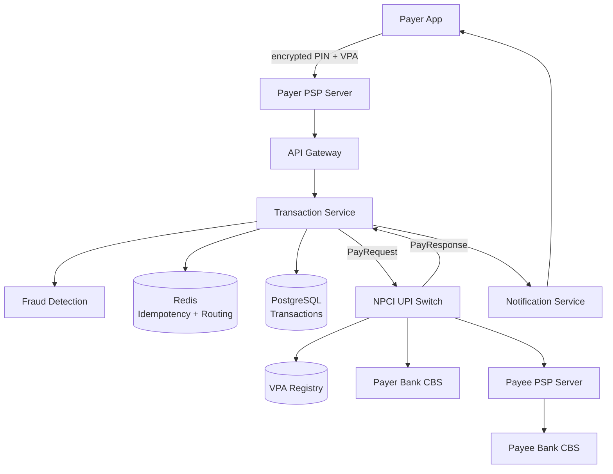
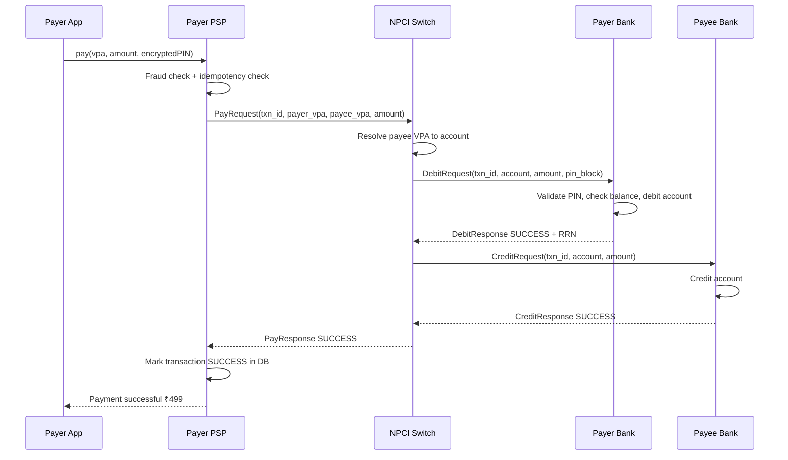
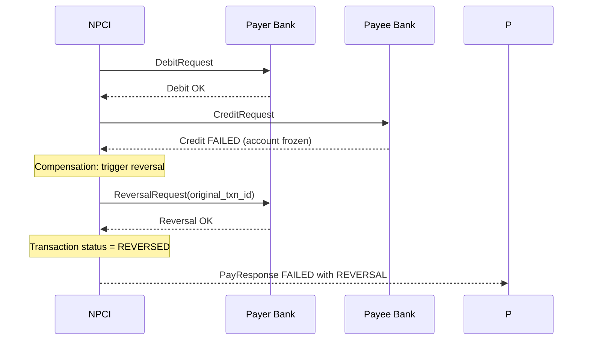
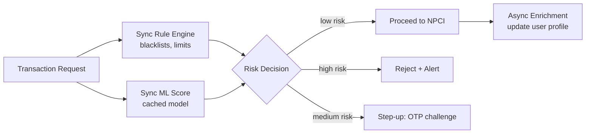
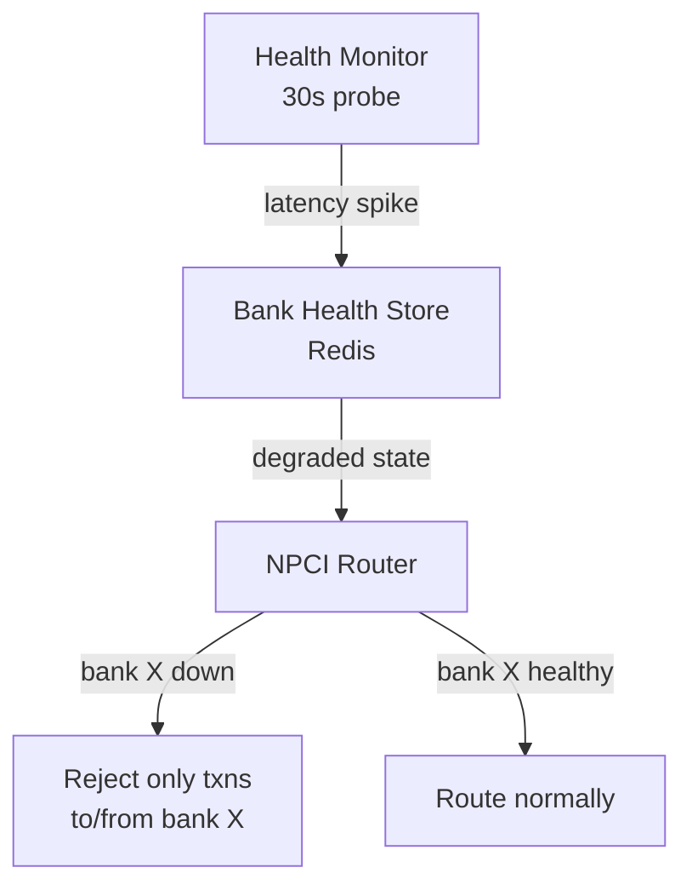

# Design UPI (Unified Payments Interface)

UPI is India's real-time interbank payment system operated by NPCI (National Payments Corporation of India). It processes over 500 million transactions per day through a network of 300+ banks and dozens of PSPs (Payment Service Providers) like PhonePe, Google Pay, and Paytm — all interoperating through a single central switch.

What makes UPI a compelling system design problem: it's a **distributed financial transaction** involving up to five independent systems (two PSP servers, NPCI, and two banks), all of which must agree atomically on a transfer of money. Money cannot be created or destroyed. Every failure mode has real financial consequence.

The hard parts aren't the happy path — they're atomicity across multiple participants, real-time fraud detection, idempotent retries, and zero-downtime operation for a system where downtime means people can't pay for groceries.

---

## Functional Requirements

**In Scope:**
- **Pay**: Send money to a VPA (Virtual Payment Address like `user@okhdfc`) with UPI PIN authentication
- **Collect**: Request money from another VPA (pull payment); payee approves and enters PIN
- **Link bank account**: Bind a bank account to a VPA using debit card + OTP verification
- **Check transaction status**: Query real-time or historical status of a payment
- **Transaction history**: Paginated list of sent/received payments
- **UPI QR Code payment**: Scan a merchant QR code to auto-fill payee VPA and amount
- **UPI AutoPay (Mandates)**: Set up recurring debit mandates (subscriptions, EMIs)

**Out of Scope:**
- NPCI's internal settlement and net-position calculation (interbank clearing — a separate system)
- International remittances and forex conversion
- Merchant POS terminal integration details
- Core banking system (CBS) design at individual banks
- KYC and onboarding compliance flows

---

## Non-Functional Requirements

| Property | Target | Reasoning |
|---|---|---|
| **Transaction Latency** | p99 < 5 seconds end-to-end | UPI SLA is 30s; production PSPs target 3–5s; users abandon after 10s |
| **Availability** | 99.99% at PSP layer; graceful degradation when individual banks are down | Bank downtime cannot block the entire PSP |
| **Financial Consistency** | Exactly-once money movement — no double debits, no lost credits | Money is fungible; incorrect state has irreversible financial consequences |
| **Durability** | Every transaction state change persisted synchronously before response | A crash after debit must not lose the transaction record |
| **Idempotency** | Duplicate API calls must not cause duplicate payments | Network retries are guaranteed under mobile conditions |
| **Fraud Detection** | Real-time scoring adding < 200ms to transaction latency | Post-payment fraud detection is too late; the money is gone |
| **Throughput** | Sustain 500M transactions/day; peak 2M TPS during flash events | Festivals, year-end sales, IPO subscriptions drive extreme spikes |

**Key tradeoff:** Financial systems must prioritize **consistency over availability** (CP in CAP theorem). A payment that fails cleanly is recoverable. A payment where debit and credit disagree — money taken but not delivered — is a regulatory and support nightmare that erodes user trust permanently.

---

## Capacity Estimation

**Transactions:**
- 500M transactions/day → ~5,800 TPS average; **~15,000 TPS sustained peak; ~2M TPS flash peak** (Jio IPO subscription window)
- Each transaction touches 5 systems: Payer PSP → NPCI → Payee PSP → Payer Bank → Payee Bank

**Storage (PSP layer):**
- Transaction record: ~500 bytes per transaction
- 500M/day × 500 bytes = **~250 GB/day** → ~90 TB/year raw transaction logs
- With 5-year retention: ~450 TB — manageable with tiered storage (hot: NVMe, warm: SSD, cold: object storage)

**Deduplication window:**
- Idempotency key retention: 24 hours
- 500M unique txn IDs/day × 32 bytes/ID = **~16 GB in Redis** — fits in a single cluster

**VPA Registry at NPCI:**
- ~500M registered VPAs
- 500 bytes/VPA = **250 GB** — fits in a sharded PostgreSQL cluster

---

## Core Entities

| Entity | Purpose | Key Fields |
|---|---|---|
| **User** | PSP-registered user; owns VPAs and linked bank accounts | `user_id`, `mobile_hash`, `device_id`, `kyc_status`, `created_at` |
| **VPA** | Virtual Payment Address — human-readable alias for a bank account | `vpa` (PK), `user_id`, `bank_account_id`, `psp_handle`, `is_primary`, `created_at` |
| **BankAccount** | A linked bank account verified via debit card + OTP | `account_id`, `user_id`, `ifsc`, `account_number_hash`, `bank_id`, `is_verified` |
| **Transaction** | Core payment record; finite state machine | `txn_id` (UPI ref), `payer_vpa`, `payee_vpa`, `amount`, `status`, `type`, `created_at`, `updated_at` |
| **TransactionEvent** | Immutable audit log — every state change in a transaction | `event_id`, `txn_id`, `from_state`, `to_state`, `timestamp`, `actor`, `metadata` |
| **Mandate** | Recurring debit authorization (AutoPay) | `mandate_id`, `payer_vpa`, `payee_vpa`, `amount`, `frequency`, `start_date`, `end_date`, `status` |

**Transaction state machine:**
```
INITIATED → PIN_VERIFIED → DEBIT_PENDING → DEBITED → CREDIT_PENDING → SUCCESS
                                         ↘ DEBIT_FAILED → FAILED
                                                                ↓
                                          DEBITED → CREDIT_FAILED → REVERSAL_PENDING → REVERSED
```

**Key design:** `TransactionEvent` is append-only and immutable. The current `Transaction.status` is derived from the latest event. This gives a full audit trail for every state transition — mandatory for financial regulators (RBI, NPCI audits).

---

## Databases and Database Design

### Storage Tier Decisions

| Data | Access Pattern | Choice |
|---|---|---|
| Transactions (PSP) | Write-heavy during payment, read-heavy for history | **PostgreSQL** (strong consistency, ACID) |
| Transaction events (audit log) | Append-only, never updated | **PostgreSQL** (same DB, separate table) |
| VPA registry (NPCI) | High read throughput, consistent writes | **PostgreSQL** + read replicas |
| Idempotency / dedup keys | Ephemeral, TTL-based, ultra-low latency | **Redis** (NX SET with TTL) |
| Transaction routing state (NPCI) | Active transactions in-flight, sub-ms lookup | **Redis** |
| Fraud signals / user behavior | Time-series, analytical | **Kafka → ClickHouse** |
| Mandate schedules | Low-volume, time-based trigger | **PostgreSQL** |

### PostgreSQL — Transaction Store (PSP)

```sql
CREATE TABLE transactions (
  txn_id          TEXT         PRIMARY KEY,   -- UPI reference number (from NPCI)
  client_ref_id   TEXT         UNIQUE,        -- PSP-generated idempotency key
  payer_vpa       TEXT         NOT NULL,
  payee_vpa       TEXT         NOT NULL,
  amount_paise    BIGINT       NOT NULL,       -- amounts in smallest unit; never floats
  status          TEXT         NOT NULL,       -- INITIATED | DEBITED | SUCCESS | FAILED | REVERSED
  type            TEXT         NOT NULL,       -- PAY | COLLECT | MANDATE
  created_at      TIMESTAMPTZ  DEFAULT NOW(),
  updated_at      TIMESTAMPTZ  DEFAULT NOW()
);

CREATE INDEX idx_txn_payer   ON transactions (payer_vpa, created_at DESC);
CREATE INDEX idx_txn_payee   ON transactions (payee_vpa, created_at DESC);
CREATE INDEX idx_txn_client  ON transactions (client_ref_id);  -- idempotency lookups
```

**Critical rules:**
- **Never store money as `FLOAT` or `DECIMAL`** — use `BIGINT` in paise (₹1 = 100 paise) to avoid floating-point rounding errors. `₹999.99` is stored as `99999`
- `updated_at` is always set in the same transaction as the status change — never asynchronously
- All status transitions go through a **single `UPDATE ... WHERE status = 'expected_current_status'` CAS (compare-and-swap)** to prevent race conditions

**Partitioning:** Range-partition `transactions` by `created_at` — monthly partitions. Active lookups (status checks) stay in the current month's partition; history queries range across archived partitions.

**Replication:** Primary (synchronous replication, `synchronous_commit = on`) + 1 synchronous standby + 1 async read replica. Financial writes must be acknowledged by the standby before returning success to the caller — no durability loss on primary failure.

### Redis — Idempotency and In-Flight Routing

```
// Idempotency key: SET NX with 24h TTL
// Key:   idempotency:{client_ref_id}
// Value: {txn_id, status}
// SET idempotency:psp-ref-abc123 '{"txn_id":"UPI2026xyz","status":"SUCCESS"}' NX EX 86400

// In-flight transaction routing (NPCI layer):
// Key:   txn:{txn_id}
// Value: {payer_bank, payee_bank, debit_rrn, current_step}
// TTL:   120s (transaction must complete within 2 minutes)
```

The idempotency check happens before any DB write: if the key exists, return the cached result immediately without re-executing the transaction. This is the **first line of defense against duplicate payments on network retry**.

### Consistency Model

| Operation | Consistency Level | Reasoning |
|---|---|---|
| Initiate payment | Serializable + idempotency check | Prevent concurrent duplicate initiations |
| Balance debit (at bank) | Serializable isolation | Prevent overdraft from concurrent debits |
| Transaction status update | Read-your-writes | The client must see its own completed transaction immediately |
| Transaction history | Eventual (read replica) | Millisecond-old history is fine; reduces primary load |
| Fraud score | Eventual | The scoring model uses recent-but-not-real-time signals |

---

## API Design

**Initiate a UPI Pay transaction:**
```http
POST /v1/payments
Idempotency-Key: psp-client-ref-abc123
Authorization: Bearer <session_token>
{
  "payer_vpa":    "alice@okhdfc",
  "payee_vpa":    "merchant@okaxis",
  "amount_paise": 49900,
  "remarks":      "Coffee",
  "encrypted_pin": "<device-encrypted-upi-pin>"
}

202 Accepted
{
  "txn_id":    "UPI2026052900123456",
  "status":    "INITIATED",
  "poll_url":  "/v1/payments/UPI2026052900123456"
}
```

**Poll transaction status (client polls until terminal state):**
```http
GET /v1/payments/{txn_id}

200 OK
{
  "txn_id":       "UPI2026052900123456",
  "status":       "SUCCESS",
  "amount_paise": 49900,
  "payer_vpa":    "alice@okhdfc",
  "payee_vpa":    "merchant@okaxis",
  "completed_at": "2026-05-29T10:32:04Z",
  "rrn":          "614532987401"    // bank retrieval reference number
}
```

**Initiate a Collect request (pull payment):**
```http
POST /v1/collect-requests
{
  "requestor_vpa": "merchant@okaxis",
  "payer_vpa":     "alice@okhdfc",
  "amount_paise":  150000,
  "expiry_minutes": 10,
  "remarks":       "Invoice #4521"
}
// 202 Accepted — notification sent to payer; payer must approve within 10 minutes
```

**Get transaction history (paginated):**
```http
GET /v1/payments?vpa=alice@okhdfc&limit=20&cursor=eyJ0c3...

200 OK
{
  "transactions": [ ... ],
  "next_cursor": "eyJ0c3...",
  "has_more": true
}
```

**Link a bank account to VPA:**
```http
POST /v1/accounts/link
{
  "vpa":          "alice@okhdfc",
  "ifsc":         "HDFC0001234",
  "card_last6":   "789012",
  "card_expiry":  "12/28"
}
// Triggers OTP verification via bank; sets new UPI PIN
```

---

## High-Level Design

UPI's architecture has **five participants** in every transaction. The PSP layer is what you design; NPCI and bank CBS are external systems you interface with.



**Full happy-path flow:**



**Component responsibilities:**
| Component | Role |
|---|---|
| **Transaction Service** | Orchestrates payment state machine; owns idempotency; interfaces with NPCI |
| **Fraud Detection Service** | Real-time ML scoring on device, VPA, amount, velocity patterns |
| **NPCI Switch** | Routes between PSPs; resolves VPAs; coordinates debit/credit with banks |
| **Notification Service** | Pushes success/failure to payer and payee apps via FCM/APNS |
| **Redis** | Idempotency key store; in-flight transaction state for the NPCI routing layer |

---

## Deep Dives

### 1. Atomicity Across Five Systems: The Saga Pattern

**The problem:** A UPI payment involves a debit at one bank and a credit at another, orchestrated by NPCI. These are separate systems with no shared transaction coordinator. Traditional 2PC (Two-Phase Commit) across multiple banks and PSPs is impractical — it would require every participant to hold locks across a multi-second network round trip, creating massive contention.

**What happens if debit succeeds but credit fails?** Money has been taken from the payer but not delivered to the payee. This is a real partial failure that must be handled deterministically.

**Solution — Saga with compensating transactions:**



- NPCI acts as the **Saga orchestrator**: it executes the debit, then the credit; if credit fails, it initiates a reversal of the debit
- The reversal is also a Saga step — if the reversal fails (bank is down), NPCI retries with exponential backoff until the bank responds
- Every step has a unique `txn_id` + step identifier for idempotent retries: re-sending `DebitRequest(txn_id=X)` to a bank that already debited for `X` must return success, not double-debit
- **Maximum retry window:** 24 hours; after that, NPCI initiates a manual settlement process

**Why not 2PC:** 2PC requires all participants to be available simultaneously to commit. Under mobile network conditions, any bank may be unreachable for seconds. A 2PC holding locks across this would cause cascading timeouts across the entire payment network.

---

### 2. Idempotency: Preventing Duplicate Payments on Retry

**The problem:** Mobile networks are unreliable. A payment request that succeeds at the backend may return a network error to the client app. The client retries — and without idempotency, sends the money twice.

**Why it's hard at scale:** Under peak load, retry storms amplify traffic. A 500ms timeout triggers retries, which add more load, causing more timeouts — a feedback loop. The idempotency layer must handle this without becoming a bottleneck itself.

**Three-layer idempotency:**

```
Layer 1 — Client: PSP app generates a UUID client_ref_id per payment intent
          Retries always use the same client_ref_id

Layer 2 — PSP server: Redis SET NX with 24h TTL
          Before writing to DB, check Redis for client_ref_id
          If found: return cached result (no DB write, no NPCI call)
          If not found: SET NX, proceed with payment

Layer 3 — Bank CBS: NPCI sends txn_id on every request
          Banks maintain a deduplication table: seen txn_ids for 24 hours
          A second DebitRequest(txn_id=X) returns the original debit result
```

```
// Redis idempotency check (PSP layer):
IF SET idempotency:{client_ref_id} {txn_id} NX EX 86400
    THEN proceed with new transaction
    ELSE GET idempotency:{client_ref_id} → return existing result
```

**Tradeoff:** The 24-hour dedup window means the Redis set grows to ~500M keys × 64 bytes = ~32 GB/day. With proper TTL-based expiry, the working set stabilizes at ~32 GB — still fits in Redis, but requires capacity planning.

---

### 3. Real-Time Fraud Detection Without Adding Latency

**The problem:** UPI fraud (account takeovers, social engineering, spoofed QR codes) costs billions annually. Post-payment fraud scoring is too late — the money is gone and chargebacks are hard in real-time systems. But ML inference on the critical payment path must not add more than 200ms.

**Architecture: Pre-auth scoring with async enrichment:**



**Sync path (< 100ms):**
- **Rule engine:** Device binding check (is this request from a registered device?), velocity check (has this VPA sent > 10 payments in the last 60s?), blacklisted VPA/account check — all backed by Redis for O(1) lookup
- **Cached ML model:** Lightweight gradient boosting model (XGBoost) loaded in-process; features: amount percentile for this user, time of day, new payee VPA (first payment ever?), device change recency. Returns a score 0–100 in < 50ms

**Async path (post-transaction):**
- Full deep-learning model runs on the completed transaction
- Updates user risk profile in ClickHouse
- If score crosses threshold: flag for manual review; trigger OTP re-verification on next payment

**Key tradeoff:** The sync model uses simplified features (no real-time graph traversal) to stay fast. The async model gets full context. False negatives in the sync model are caught by the async model — but the money may already be gone. For high-value transactions (> ₹50,000), the sync model uses stricter thresholds, accepting higher false positive rate.

---

### 4. Bank Downtime: Graceful Degradation

**The problem:** Banks perform maintenance windows (typically 2–4 AM), have CBS (Core Banking System) outages, and sometimes throttle NPCI requests during peak load. UPI cannot refuse all payments when a bank is down — it can only refuse payments *to or from that bank*.

**NPCI-level bank health tracking:**



- NPCI probes each bank CBS every 30 seconds with a synthetic transaction
- If a bank's error rate exceeds 30% or p99 > 10s, it's marked `DEGRADED`
- PSPs receive a `BANK_DEGRADED` signal and surface a user-visible message: *"HDFC Bank is temporarily unavailable. Try again in a few minutes."*
- Transactions to other banks continue unaffected — isolation is at the bank level, not the PSP level

**Circuit breaker at PSP layer:**
- The Transaction Service wraps every NPCI call in a circuit breaker (Hystrix / Resilience4j)
- On 5 consecutive NPCI timeouts: open the circuit, return `SERVICE_UNAVAILABLE` immediately
- Every 30 seconds: probe with one request; if successful, half-open → closed

---

### 5. NPCI Scale: The Central Switch Bottleneck

**The problem:** NPCI is the single central router for all UPI transactions in India — 500M/day flowing through one system. At peak (2M TPS during large IPO subscriptions), this is one of the highest-throughput financial systems in the world.

**How NPCI handles this:**
- **Horizontal partitioning by bank pair:** Transactions between HDFC and ICICI flow through dedicated routing workers; transactions between SBI and Axis flow through different workers. Intra-partition parallelism with no cross-partition locking.
- **In-memory transaction state:** Active transaction routing state lives in Redis (not a relational DB); each in-flight transaction has a 120-second TTL — expired transactions are automatically timed out
- **VPA resolution caching:** VPA → bank account mappings are cached at NPCI; a VPA resolve that hits the database would bottleneck at 2M TPS. Cache is invalidated on VPA update (rare event)
- **Async acknowledgment for non-critical paths:** The credit confirmation (bank-to-NPCI after crediting) is asynchronous — NPCI sends a provisional success to the PSP after the debit clears and credit is *initiated*, then reconciles credit confirmations in a batch window

---

### 6. Reconciliation: Ensuring End-of-Day Consistency

**The problem:** Across 500M daily transactions involving 300+ banks, network failures guarantee some transactions will be in an ambiguous terminal state — did that last credit actually land?

**End-of-day reconciliation pipeline:**
- Every bank sends NPCI a **settlement file** (SFTP/API) listing all debits and credits processed that day
- NPCI's reconciliation service cross-matches every credit with its corresponding debit
- Mismatches fall into three categories:
  1. **Debit without credit:** Money taken but not delivered → force credit or reversal
  2. **Credit without debit:** Money delivered but bank missed the debit → force debit (rare edge case)
  3. **Amount mismatch:** System bug or fraud → freeze both accounts, escalate to manual review
- Net positions between banks are settled via RBI's RTGS system; NPCI only handles the netting, not the actual fund movement between banks

---

## Summary: Key Engineering Decisions

| Decision | Choice | Why |
|---|---|---|
| Transaction consistency | PostgreSQL + synchronous replication | Financial data cannot tolerate durability loss or phantom reads |
| Atomicity model | Saga with compensating transactions | 2PC is impractical across multiple independent banks |
| Idempotency | Three-layer (client UUID + Redis NX + bank dedup table) | Network retries are guaranteed; all three layers needed for full protection |
| Money representation | `BIGINT` in paise | Float rounding errors are not acceptable in financial systems |
| Fraud detection | Sync lightweight model + async deep model | < 100ms sync scoring; full precision in async path |
| Bank failure handling | Per-bank circuit breaker + health-aware routing | One bank's outage must not degrade other banks' payments |
| Audit trail | Append-only `TransactionEvent` log | Regulatory requirement; enables full state reconstruction |

UPI's core insight as a system design: **the central switch (NPCI) must be a thin, stateless router — not a coordinator that owns state**. State ownership at NPCI creates a scaling bottleneck for the entire financial system. By pushing state to the banks (they own the money) and to PSPs (they own the user relationship), NPCI can scale horizontally by routing workload partitions. The Saga pattern exists precisely because NPCI refuses to hold distributed locks across independent bank systems.
