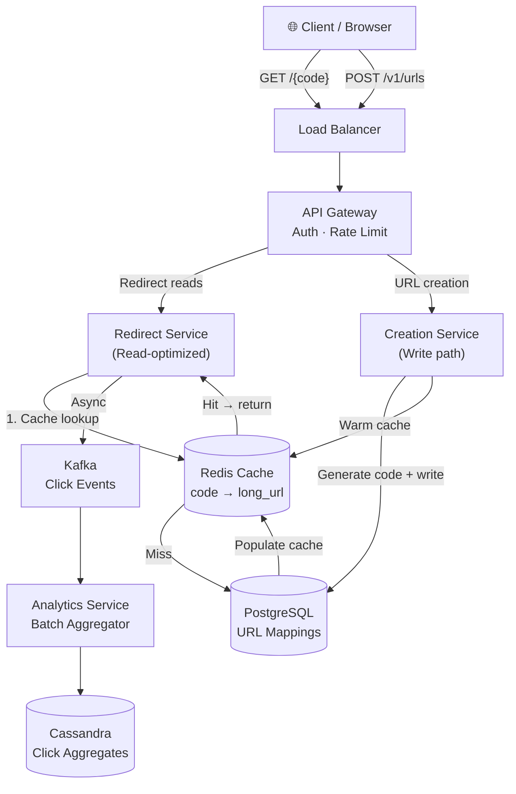
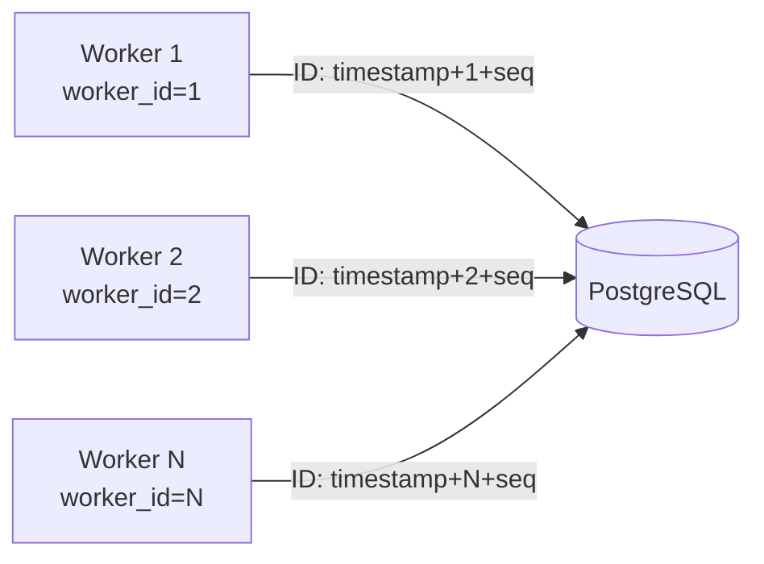
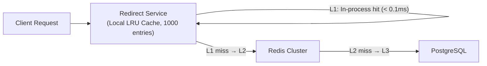
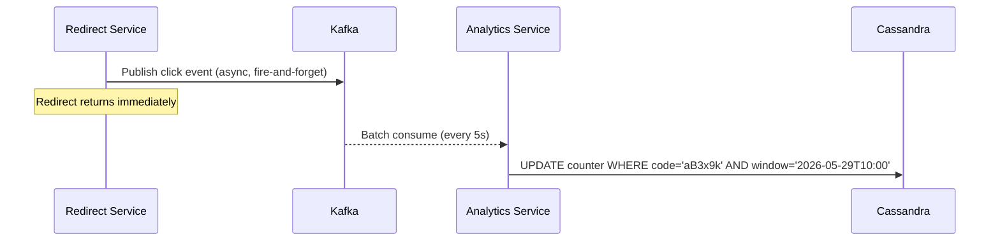

# Design URL Shortener (TinyURL)

A URL shortener converts a long URL like `https://www.example.com/very/long/path?with=query&params=many` into a short alias like `https://tny.io/aB3x9k`. When someone visits the short URL, they are redirected to the original. TinyURL, Bitly, and t.co process billions of redirects per day.

This is a classic interview problem — the core is simple, but the depth lies in ID generation, cache design, and scaling redirects to millions of reads/sec.

---

## Functional Requirements

**In Scope:**
- Create a short URL from a long URL
- Redirect a short URL to the original long URL
- Custom aliases (user-defined short codes)
- Link expiration (TTL-based)
- Analytics: click count per short URL

**Out of Scope:**
- User authentication and link management dashboards (implied but not core)
- QR code generation
- Link-in-bio pages or landing pages
- Geographic or device-based redirect routing

---

## Non-Functional Requirements

| Property | Target | Reasoning |
|---|---|---|
| **Read Latency** | p99 < 10ms for redirect | Users are actively waiting for the page to load |
| **Write Latency** | p99 < 100ms for URL creation | Acceptable; creation is rare vs. reads |
| **Availability** | 99.99% | A dead short URL breaks campaigns, QR codes, printed materials |
| **Read/Write Ratio** | ~1000:1 | Redirects vastly outnumber creations |
| **Scale** | 1B redirects/day, 10M new URLs/day | Bitly-scale baseline |
| **Durability** | Zero URL loss; mappings are permanent | A deleted mapping is permanently broken |
| **Consistency** | Strong for writes (no duplicate aliases); eventual for analytics | Redirect must always work; click counts can lag |

**Key tradeoff:** The redirect path is the **critical hot path** — it must be as fast as possible. URL creation is infrequent and can absorb more latency. All architecture decisions are optimized for the read path.

---

## Capacity Estimation

**Writes:**
- 10M new URLs/day → ~115 writes/sec average; ~500/sec peak

**Reads:**
- 1B redirects/day → ~11,600 reads/sec average; ~50,000/sec peak

**Storage:**
- Each URL mapping: ~500 bytes (short code + long URL + metadata)
- 10M/day × 365 days × 500 bytes = **~1.8 TB/year**
- After 5 years: ~9 TB — easily fits in a single PostgreSQL cluster with proper indexing

**Short code namespace:**
- Using Base62 (a–z, A–Z, 0–9) with 7 characters: 62⁷ = **~3.5 trillion unique codes**
- At 10M/day, this namespace lasts **~960 years** — no shortage

**Cache:**
- 80% of redirects target 20% of URLs (power-law distribution)
- Cache the hot 20%: 10M active URLs × 20% × 500 bytes = **~1 GB** — fits in a single Redis node

---

## Core Entities

| Entity | Purpose | Key Fields |
|---|---|---|
| **ShortURL** | Core mapping between short code and long URL | `code` (PK), `long_url`, `owner_id`, `created_at`, `expires_at`, `is_active` |
| **User** | Account that creates and owns short URLs | `user_id`, `email`, `tier` (free/pro), `created_at` |
| **ClickEvent** | Individual redirect event for analytics | `event_id`, `code`, `timestamp`, `ip_hash`, `user_agent`, `country` |
| **ClickAggregate** | Pre-aggregated click counts per URL | `code`, `window` (hourly/daily), `click_count`, `updated_at` |

**Relationships:**
- `ShortURL` belongs to a `User` (nullable for anonymous creation)
- `ClickEvent` is append-only; too granular for real-time queries → aggregated into `ClickAggregate`
- `ClickAggregate` is what analytics APIs read; `ClickEvent` is the raw audit log

---

## Databases and Database Design

### Storage Tier Decisions

| Data | Access Pattern | Choice |
|---|---|---|
| URL mappings | High-read, low-write, point lookups by `code` | **PostgreSQL** + **Redis cache** |
| Click events (raw) | Write-heavy, append-only, batch analytics | **Kafka → Cassandra / S3** |
| Click aggregates | Read-heavy aggregation by code + time window | **Cassandra** |
| Session/rate limits | Ephemeral, TTL-based | **Redis** |

### URL Mapping Store — PostgreSQL

```sql
CREATE TABLE short_urls (
  code        VARCHAR(10)  PRIMARY KEY,   -- e.g., "aB3x9k"
  long_url    TEXT         NOT NULL,
  owner_id    UUID,
  created_at  TIMESTAMPTZ  DEFAULT NOW(),
  expires_at  TIMESTAMPTZ,                -- NULL = never expires
  is_active   BOOLEAN      DEFAULT TRUE,
  click_count BIGINT       DEFAULT 0      -- approximate; accurate count in Cassandra
);

CREATE UNIQUE INDEX idx_long_url ON short_urls (long_url)
  WHERE owner_id IS NULL;                 -- dedup anonymous creations of same long URL
```

**Why PostgreSQL:** URL mappings are relational (user ownership, expiry), low in total volume (~9 TB after 5 years), and require strong consistency for uniqueness. PostgreSQL handles this comfortably.

**Partition strategy:** At 500M rows (5 years × 100M), consider range partitioning by `created_at` — allows dropping expired partitions without scanning the full table. Active lookups only touch recent partitions.

**Indexing:**
- `code` is the primary key — all redirect reads are O(1) by this column
- Partial unique index on `long_url` for anonymous users — prevents creating 10 short codes for the same URL from the same anonymous session
- Index on `(owner_id, created_at DESC)` for user dashboard queries ("show my recent links")

**Replication:** Primary + 2 read replicas. Redirect reads go to read replicas (eventual consistency fine — code mappings rarely change). Writes (creation, deactivation) go to primary.

### Click Events — Kafka → Cassandra

Raw click events are write-heavy and analytics-oriented. They don't belong in PostgreSQL.

```sql
-- Cassandra schema for aggregated analytics
CREATE TABLE click_aggregates (
  code         TEXT,
  window_start TIMESTAMP,
  granularity  TEXT,      -- 'hour' | 'day'
  click_count  COUNTER,
  PRIMARY KEY ((code, granularity), window_start)
) WITH CLUSTERING ORDER BY (window_start DESC);
```

- **Partition key:** `(code, granularity)` — all hourly counts for a URL on one partition
- **Cassandra COUNTER type** — atomic increments without read-modify-write; exactly what click counting needs
- **Raw events** land in Kafka, consumed by an analytics service that batches increments to Cassandra

### Consistency Model

- **URL creation:** Strong consistency via PostgreSQL primary — no two codes can collide
- **Redirect lookup:** Eventual consistency acceptable — Redis cache may be 5s stale (edge case: URL just deactivated, user gets one stale redirect)
- **Click counts:** Eventually consistent — counters lag by seconds; acceptable for analytics

---

## API Design

**Create a short URL:**
```http
POST /v1/urls
Authorization: Bearer <token>

{
  "long_url": "https://www.example.com/very/long/path",
  "custom_code": "mylink",          // optional
  "expires_in_days": 30,            // optional, null = permanent
  "idempotency_key": "client-uuid"  // optional, for safe retries
}
```
```json
{
  "code": "mylink",
  "short_url": "https://tny.io/mylink",
  "long_url": "https://www.example.com/very/long/path",
  "expires_at": "2026-06-28T10:00:00Z",
  "created_at": "2026-05-29T10:00:00Z"
}
```

**Redirect (the hot path — no auth needed):**
```http
GET /aB3x9k
→ 301 Moved Permanently
   Location: https://www.example.com/very/long/path
```
> Use **302 (temporary)** if analytics matter — browsers cache 301s and bypass your server, losing click data. Use **301** only if you want browsers to skip your servers for performance.

**Get URL details:**
```http
GET /v1/urls/{code}
Authorization: Bearer <token>
→ { "code": "aB3x9k", "long_url": "...", "click_count": 4821, "created_at": "...", "expires_at": null }
```

**Deactivate a URL:**
```http
DELETE /v1/urls/{code}
Authorization: Bearer <token>
→ 204 No Content
```

**Get analytics for a URL:**
```http
GET /v1/urls/{code}/analytics?granularity=day&from=2026-05-01&to=2026-05-29
→ {
    "code": "aB3x9k",
    "total_clicks": 12450,
    "series": [
      { "date": "2026-05-29", "clicks": 834 },
      { "date": "2026-05-28", "clicks": 1102 }
    ]
  }
```

---

## High-Level Design



### Component Responsibilities

| Component | Role |
|---|---|
| **Redirect Service** | Looks up `code` in Redis → DB; returns `Location` header; fires async click event |
| **Creation Service** | Generates unique short code; validates custom aliases; writes to PostgreSQL |
| **Redis Cache** | Stores `code → long_url` mappings; absorbs 95%+ of redirect reads |
| **Kafka** | Buffers click events; decouples redirect latency from analytics writes |
| **Analytics Service** | Consumes Kafka; increments Cassandra COUNTER columns in batches |

**Critical design:** The Redirect Service is **completely decoupled from analytics writes**. Click events are fire-and-forget into Kafka — a redirect never waits for an analytics write. This keeps redirect latency at ~5ms even under heavy analytics load.

---

## Deep Dives

### 1. Short Code Generation: Avoiding Collisions at Scale

The most interview-critical part. Four approaches, each with real tradeoffs.

**Option A: Random Base62 (naive)**
Generate 7 random Base62 characters. Check DB if exists; regenerate on collision. At 500M existing URLs, collision probability per generation ≈ 500M / 3.5T ≈ **0.014%**. Requires a DB read on every creation — slow, and collisions grow over time.

**Option B: MD5/SHA256 hash of long URL**
Hash the long URL, take first 7 chars of Base62-encoded hash. Deterministic — same long URL always gets the same code. But hash collisions for different URLs (though rare) create a hard bug to debug.

**Option C: Centralized counter (auto-increment → Base62)**
A single counter (PostgreSQL `SERIAL` or Redis `INCR`) produces monotonically increasing IDs, converted to Base62:

```python
def encode_base62(num: int) -> str:
    chars = "0123456789abcdefghijklmnopqrstuvwxyzABCDEFGHIJKLMNOPQRSTUVWXYZ"
    result = []
    while num:
        result.append(chars[num % 62])
        num //= 62
    return ''.join(reversed(result)).zfill(7)

# encode_base62(1000000) → "4c92"
```

**Tradeoff:** Sequential codes are **predictable** — someone can enumerate `aaaaaa1`, `aaaaaa2`, and discover all URLs. Fixable with a shuffling/obfuscation step. The deeper problem: a single counter is a **write bottleneck** at scale.

**Option D: Snowflake-style distributed ID (production answer)**

```
[41-bit timestamp | 10-bit worker ID | 12-bit sequence]
```

Each Creation Service node generates IDs independently with no coordination. IDs are monotonically increasing, unique, and encode time for free. Convert the 63-bit integer to Base62 → 7-character code. No DB read needed to check uniqueness.



**Why this wins:** No coordination, no collision check, no single point of failure. IDs are guaranteed unique by worker ID isolation. This is how Twitter Snowflake and Sonyflake work.

---

### 2. The Redirect Cache: Design for 95%+ Hit Rate

The redirect path latency target is < 10ms p99. A PostgreSQL read takes 5–20ms under load. Without caching, we can't hit the target.

**Cache design:**
```
Redis key:   url:{code}
Redis value: {long_url, expires_at, is_active}
TTL:         24 hours (refresh on access)
```

**Cache population strategies:**

| Strategy | When | Behavior |
|---|---|---|
| **Write-through** | On URL creation | Immediately warm the cache |
| **Read-through** | On cache miss | Redirect Service fetches from DB, stores in Redis |
| **TTL refresh** | On every cache hit | Reset TTL to 24h (LRU-like behavior) |

**Handling deactivation (cache invalidation):**
When a URL is deactivated via `DELETE /v1/urls/{code}`, the Creation Service immediately:
1. Updates `is_active = false` in PostgreSQL
2. Issues `DEL url:{code}` to Redis

**Tradeoff:** There is a small window (~milliseconds) between the DB update and the Redis delete where a redirect could still succeed. This is acceptable — the alternative (synchronous two-phase update) adds latency to every deletion. For high-value takedowns, add a secondary check in the Redirect Service for `is_active` on cache misses.

**Cache eviction:** Use `allkeys-lru` policy — Redis automatically evicts least-recently-used codes. Power-law URL access patterns mean the hot 1% of codes stay in cache permanently while cold codes cycle out.

---

### 3. Scaling Redirects: 50,000 Reads/Sec

At peak 50K redirects/sec, even a Redis cluster can become a bottleneck for truly viral URLs (a single short code shared by 10M people in an hour).

**Problem:** One Redis key for a viral URL gets 50K reads/sec to a single Redis node — this is a hot key.

**Solution: Local in-process cache on Redirect Service nodes**



Each Redirect Service node maintains a local LRU cache of the 1,000 most-accessed codes. Memory cost: 1,000 × 500 bytes = 500 KB — trivial. Refresh TTL: 10 seconds (slightly stale, but viral URLs don't change).

For a viral URL hitting 50K rps across 50 Redirect Service nodes → each node sees 1,000 rps → local cache hit rate approaches 100% after warmup → **Redis sees near-zero traffic for that key**.

**Tradeoff:** 10-second local cache TTL means deactivated URLs may still redirect for up to 10 seconds. Acceptable for most use cases; violently active takedowns can force a push-invalidation signal via pub/sub.

---

### 4. Analytics: High-Write Click Counting Without Killing the DB

**The naive approach:** `UPDATE short_urls SET click_count = click_count + 1 WHERE code = ?` on every redirect.

At 50K redirects/sec, this is 50K write transactions/sec on the same rows for popular URLs — guaranteed deadlocks and write contention.

**Production approach: Kafka buffering + batch aggregation**



- **Redirect Service** publishes to Kafka asynchronously — adds < 1ms to redirect path
- **Analytics Service** consumes in 5-second micro-batches, aggregates counts in memory, writes once per window to Cassandra
- **Write amplification reduction:** 50,000 events/sec → batched to 1 Cassandra write per code per 5-second window

**Cassandra COUNTER type** is atomic and lock-free for increments — ideal for this pattern. No read-modify-write needed.

**Tradeoff:** Click counts lag by 5–30 seconds. A user checking their dashboard immediately after a viral share sees slightly stale counts. This is universally acceptable in analytics systems.

---

### 5. Custom Aliases and Reservation Race Conditions

Custom aliases ("mylink", "promo2026") are user-defined. Two users may request the same alias simultaneously.

**Race condition:**
```
User A: CHECK "promo2026" → not taken
User B: CHECK "promo2026" → not taken
User A: INSERT "promo2026" → success
User B: INSERT "promo2026" → DUPLICATE KEY ERROR
```

**Solution: PostgreSQL unique constraint + optimistic insert**

```sql
INSERT INTO short_urls (code, long_url, owner_id)
VALUES ('promo2026', 'https://...', 'user-a-uuid')
ON CONFLICT (code) DO NOTHING
RETURNING code;
```

If `RETURNING` returns no rows, the alias was taken — return `409 Conflict` to the client immediately. No pre-check needed; the DB constraint is the single source of truth. This eliminates the check-then-act race condition entirely.

**Tradeoff:** The client gets a `409` and must choose a different alias. This is correct behavior — fighting over the same alias is an application-level conflict, not a system error.

---

## Summary: Key Architectural Decisions

| Decision | Choice | Why |
|---|---|---|
| Short code generation | Snowflake-style distributed ID → Base62 | No coordination, no collision, no DB read required |
| URL store | PostgreSQL | Relational ownership, strong uniqueness, manageable volume |
| Redirect cache | Redis (L2) + in-process LRU (L1) | Sub-millisecond redirects; handles viral URL hotspots |
| Analytics writes | Async Kafka → batched Cassandra COUNTER | Never blocks redirect path; solves write contention |
| Redirect response | HTTP 302 (temporary redirect) | Preserves click tracking; browser won't cache and bypass server |
| Custom alias conflicts | PostgreSQL unique constraint + optimistic insert | Eliminates check-then-act race condition |
| Cache invalidation | `DEL` on deactivation + TTL expiry | Simple; small stale window acceptable |

URL shorteners teach a core distributed systems lesson: **separate your read path from your write path, and never let analytics writes touch the critical redirect path.** Every optimization in this design flows from that single principle.
