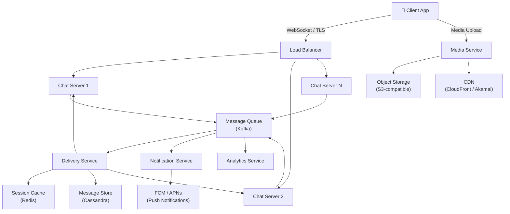
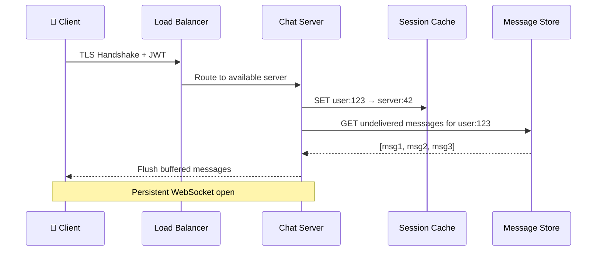
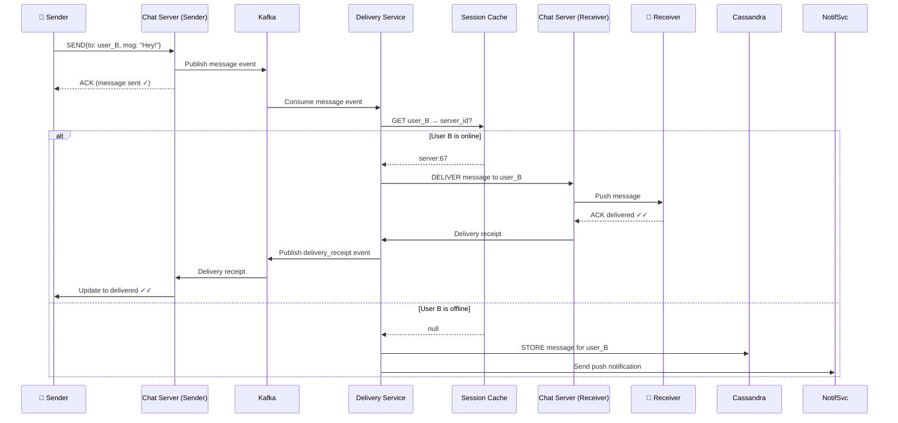
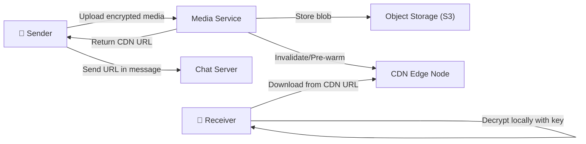
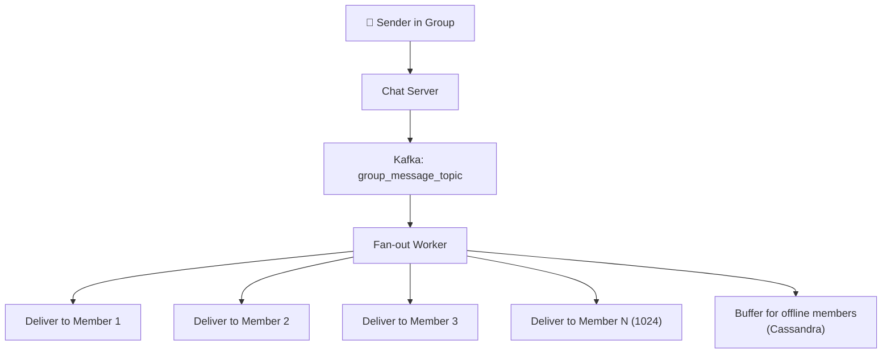
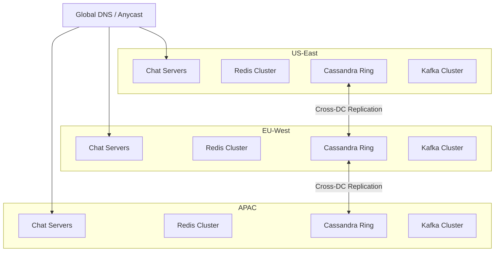
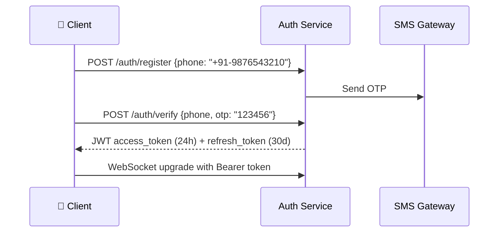
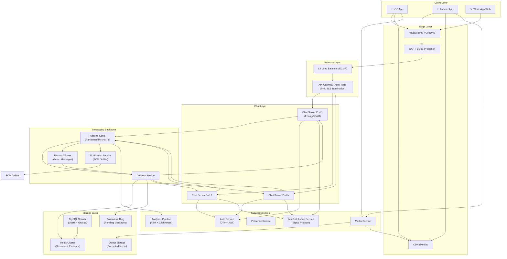

# Designing WhatsApp: A Production-Scale Messaging System

## Introduction

WhatsApp is the world's most widely used instant messaging platform — **2 billion+ active users**, **100 billion messages per day**, and availability in **180+ countries**. It handles text messages, images, videos, voice notes, group chats, end-to-end encryption, and real-time delivery receipts — all at planetary scale.

What makes designing WhatsApp genuinely interesting isn't just the scale — it's the **combination of hard problems**:

- Real-time bi-directional communication with strict latency requirements
- Reliable message delivery with offline buffering
- End-to-end encryption at scale
- Presence/online status for billions of users
- Group messaging with fan-out to thousands of members
- Media delivery (images, video) without killing your storage budget

If you can design WhatsApp well, you understand the core pillars of distributed systems: **consistency, availability, partition tolerance, latency, durability, and security**.

---

## Requirements Clarification

### Functional Requirements

- **1:1 messaging** — send and receive text messages in real-time
- **Group messaging** — up to 1024 members per group
- **Message delivery receipts** — sent ✓, delivered ✓✓, read ✓✓ (blue)
- **Online/last seen presence** — show if user is online or when they were last active
- **Media sharing** — images, videos, audio, documents
- **Push notifications** — notify offline users of new messages
- **End-to-end encryption** — messages readable only by sender and receiver
- **Message history sync** — across devices (WhatsApp Web, mobile)

### Non-Functional Requirements

- **Low latency** — message delivery < 100ms for online users
- **High availability** — 99.99% uptime (< 53 minutes downtime/year)
- **Durability** — messages must not be lost in transit
- **Eventual consistency** — delivery receipts may lag slightly; message order must be preserved
- **Scalability** — support 2B+ users, 100B+ messages/day
- **Security** — E2E encryption, no message storage on servers post-delivery
- **Offline support** — buffer messages for users who are temporarily offline

### Out of Scope

- Payments (WhatsApp Pay)
- Business API
- Status/Stories (separate subsystem)

---

## Capacity Estimation

### Users & Traffic

| Metric | Estimate |
|---|---|
| Monthly Active Users (MAU) | 2 billion |
| Daily Active Users (DAU) | 1.5 billion |
| Messages per day | 100 billion |
| Messages per second (avg) | ~1.16 million/s |
| Messages per second (peak) | ~5 million/s |
| Active connections (peak) | ~500 million concurrent |

### Storage Estimation

**Text messages:**
- Average message size: ~100 bytes
- 100B messages/day × 100 bytes = **10 TB/day** (text only)
- WhatsApp deletes messages post-delivery; server-side retention minimal

**Media messages:**
- ~30% of messages contain media
- Average media size: 500 KB (compressed)
- 30B × 500 KB = **15 PB/day** of media (stored in object storage)
- CDN caching aggressively reduces origin load

**Message metadata** (delivery status, timestamps):
- ~200 bytes per message
- 100B × 200 bytes = **20 TB/day**

### Bandwidth Estimation

- Inbound: 5M messages/sec × 100 bytes = **500 MB/s**
- Media upload: 30% × 500 KB × ~350K media/sec = **~175 GB/s** peak
- CDN offloads ~80% of media reads

### Connection Infrastructure

- 500M persistent WebSocket connections
- Distributed across thousands of chat servers
- Each chat server handles ~50K-100K connections

---

## High-Level Architecture

WhatsApp's architecture is built around a **persistent connection model** — every client maintains a long-lived WebSocket (or custom XMPP) connection to a **chat server**. This is fundamentally different from a request-response HTTP model.



### Major Components

| Component | Role |
|---|---|
| **Chat Server** | Maintains persistent WebSocket connections, routes messages |
| **Message Queue (Kafka)** | Decouples ingestion from delivery, provides durability |
| **Delivery Service** | Looks up recipient's connection, delivers or buffers |
| **Session Cache (Redis)** | Maps user_id → chat_server for routing |
| **Message Store (Cassandra)** | Stores undelivered messages for offline users |
| **Media Service** | Handles upload/download of images, video, audio |
| **Notification Service** | Pushes FCM/APNs for offline users |
| **Presence Service** | Tracks online/offline/last-seen status |

---

## Core Components Deep Dive

### 1. Chat Server & Connection Management

The Chat Server is the heart of WhatsApp. Each server maintains **persistent TCP/WebSocket connections** using an event-driven, non-blocking I/O model (like Erlang's actor model — WhatsApp's original stack was literally **Erlang/BEAM**).

**Why persistent connections?**
- HTTP polling is too slow (100ms+ per poll cycle)
- WebSocket allows server-to-client push with microsecond latency
- A single Erlang process per connection scales to millions of connections per machine

When a client connects:
1. Client authenticates via JWT token
2. Chat server registers `user_id → server_id` in the Session Cache (Redis)
3. Chat server checks for any buffered offline messages in Cassandra and flushes them



### 2. Message Send Flow



**Key design decision:** The sender gets an ACK as soon as the message hits Kafka. This is an **at-least-once** delivery guarantee. The actual delivery to the recipient is async, which keeps the sender's perceived latency low.

### 3. Session Cache (Redis)

Redis stores the mapping of which chat server each online user is connected to:

```
Key:   session:{user_id}
Value: {server_id, connected_at, last_heartbeat}
TTL:   30 seconds (refreshed by heartbeats)
```

This is the **routing table** for the entire system. It must be:
- **Fast** (sub-millisecond reads) — Redis delivers ~1M ops/sec
- **Consistent** — stale entries cause missed deliveries
- **Fault-tolerant** — Redis Cluster with replication

When a user disconnects or a chat server crashes, the TTL naturally expires the session, and the user is treated as offline.

### 4. Message Store (Cassandra)

WhatsApp does **not** permanently store your messages on their servers (by design, due to E2E encryption). However, it **temporarily buffers** messages for offline users until delivery is confirmed.

**Why Cassandra?**
- Write-heavy workload — 1M+ messages/sec
- Wide column model maps perfectly to `(user_id, timestamp)` access patterns
- Linear horizontal scalability
- High write availability (tunable consistency)
- Multi-datacenter replication built-in

**Schema:**

```sql
CREATE TABLE pending_messages (
    recipient_id    UUID,
    message_id      TIMEUUID,       -- time-based UUID for ordering
    sender_id       UUID,
    chat_id         UUID,
    ciphertext      BLOB,           -- E2E encrypted payload
    media_url       TEXT,
    message_type    TEXT,           -- text | image | video | audio
    sent_at         TIMESTAMP,
    expires_at      TIMESTAMP,      -- TTL: 30 days
    PRIMARY KEY (recipient_id, message_id)
) WITH CLUSTERING ORDER BY (message_id ASC)
  AND default_time_to_live = 2592000;  -- 30 days TTL
```

Partitioned by `recipient_id` — all messages for a user are co-located on the same node for efficient range scans on reconnect.

### 5. Media Service & CDN

Media is **never** sent inline through the chat server. The flow:

1. Client uploads media to **Media Service** via HTTPS (multipart upload)
2. Media Service stores encrypted blob in **Object Storage** (S3-compatible)
3. Media Service returns a **CDN URL** + decryption key (separately encrypted)
4. Sender sends the CDN URL (not the media itself) via chat
5. Recipient downloads from CDN, decrypts locally



**CDN strategy:**
- Popular media (viral content in groups) served from edge PoPs
- Media TTL: 30 days (matches message retention)
- Geo-routing to nearest edge server

### 6. Presence Service

Knowing who's online is surprisingly expensive at WhatsApp's scale.

**Challenge:** 500M online users. If each user subscribes to 200 contacts, that's **100 billion presence subscriptions** to maintain.

**WhatsApp's approach:**
- Presence is **pull-based by default** — clients poll when opening a chat
- For active conversations, server pushes presence updates
- Use a **fan-in fan-out** model with Redis Pub/Sub for active contacts
- Presence data TTL: 5 minutes (stale but acceptable)

```
Key:   presence:{user_id}
Value: {status: "online"|"offline", last_seen: timestamp}
TTL:   5 minutes
```

### 7. Group Messaging & Fan-out

Group messaging with 1024 members is a **fan-out problem**.

**Naive approach:** Deliver to all 1024 members sequentially → too slow

**WhatsApp's approach:**
- Use **async fan-out via Kafka**
- One message published → Delivery Service fans out to all group members
- For large groups, use **batch delivery** (group members sharing the same chat server batched together)
- Media is stored once, URL shared to all — no N copies of the same file



---

## Database Design

### Storage Layer Decisions

| Data Type | Store | Why |
|---|---|---|
| Pending messages | Cassandra | High write throughput, TTL support, partition by user |
| User profiles | MySQL / PostgreSQL | Strong consistency, relational joins |
| Session/presence | Redis | Sub-ms latency, TTL, pub/sub |
| Group metadata | MySQL + Redis cache | Consistency for membership, cache for reads |
| Media blobs | S3-compatible Object Store | Cost-efficient, unlimited scale |
| Message search | Elasticsearch (optional) | Full-text search on message history |

### User Profile Schema (MySQL)

```sql
CREATE TABLE users (
    user_id         CHAR(36) PRIMARY KEY,
    phone_number    VARCHAR(15) UNIQUE NOT NULL,
    display_name    VARCHAR(100),
    profile_pic_url TEXT,
    about           VARCHAR(139),
    created_at      DATETIME DEFAULT CURRENT_TIMESTAMP,
    last_seen       DATETIME,
    is_active       BOOLEAN DEFAULT TRUE,
    INDEX idx_phone (phone_number)
);
```

### Group Schema (MySQL)

```sql
CREATE TABLE groups (
    group_id        CHAR(36) PRIMARY KEY,
    name            VARCHAR(100) NOT NULL,
    description     TEXT,
    icon_url        TEXT,
    created_by      CHAR(36),
    created_at      DATETIME DEFAULT CURRENT_TIMESTAMP,
    max_members     INT DEFAULT 1024
);

CREATE TABLE group_members (
    group_id        CHAR(36),
    user_id         CHAR(36),
    role            ENUM('admin', 'member') DEFAULT 'member',
    joined_at       DATETIME DEFAULT CURRENT_TIMESTAMP,
    PRIMARY KEY (group_id, user_id),
    INDEX idx_user_groups (user_id)
);
```

### Sharding Strategy

- **User data:** Shard by `user_id` (consistent hashing, 256 virtual nodes per shard)
- **Messages:** Shard by `recipient_id` in Cassandra (natural partition key)
- **Groups:** Shard by `group_id`, replicate membership list to Redis for fan-out

### Replication

- Cassandra: Replication factor 3, across 3 availability zones, `LOCAL_QUORUM` writes
- MySQL: Primary + 2 read replicas per shard; async replication for reads
- Redis: Redis Cluster with 3 master + 3 replica nodes

---

## API Design

### Send Message

```
POST /v1/messages
Authorization: Bearer <jwt>
Content-Type: application/json

{
  "chat_id": "chat_abc123",
  "recipient_id": "user_xyz789",   // null for group chats
  "message_type": "text",
  "ciphertext": "<E2E encrypted payload>",
  "client_message_id": "msg_local_001",  // idempotency key
  "media_url": null,
  "reply_to_message_id": null
}

Response 202 Accepted:
{
  "server_message_id": "msg_srv_abc456",
  "status": "sent",
  "timestamp": "2026-05-26T11:30:00Z"
}
```

### Upload Media

```
POST /v1/media/upload
Authorization: Bearer <jwt>
Content-Type: multipart/form-data

Fields:
  - file: <encrypted binary>
  - mime_type: "image/jpeg"
  - file_size: 204800
  - checksum: "sha256:<hash>"

Response 200 OK:
{
  "media_id": "media_def789",
  "cdn_url": "https://cdn.whatsapp.net/media/def789",
  "expires_at": "2026-06-25T11:30:00Z"
}
```

### Get Message History (for offline sync)

```
GET /v1/chats/{chat_id}/messages?since=<timestamp>&limit=50
Authorization: Bearer <jwt>

Response 200 OK:
{
  "messages": [
    {
      "message_id": "msg_srv_abc456",
      "sender_id": "user_abc123",
      "ciphertext": "<E2E encrypted>",
      "message_type": "text",
      "sent_at": "2026-05-26T10:00:00Z",
      "delivery_status": "delivered"
    }
  ],
  "next_cursor": "<opaque pagination token>"
}
```

### WebSocket Message Format

```json
// Incoming message event (server → client)
{
  "type": "message",
  "payload": {
    "message_id": "msg_srv_abc456",
    "chat_id": "chat_abc123",
    "sender_id": "user_abc123",
    "ciphertext": "<E2E encrypted>",
    "timestamp": "2026-05-26T11:30:00Z"
  }
}

// Delivery receipt event (server → sender)
{
  "type": "receipt",
  "payload": {
    "message_id": "msg_srv_abc456",
    "status": "delivered",  // sent | delivered | read
    "timestamp": "2026-05-26T11:30:01Z"
  }
}
```

---

## Scalability Challenges

### 1. Hot Partitions in Cassandra

A celebrity or viral group can create a **hot partition** — all reads/writes funneling to one Cassandra node.

**Solution:**
- Add a **bucket suffix** to partition keys: `recipient_id + bucket(0-9)`
- Spread writes across 10 partitions; scatter-gather on reads
- Monitor partition sizes with Cassandra's `nodetool tablestats`

### 2. Fan-out Problem in Group Messaging

Sending a message in a 1024-member group triggers 1024 individual deliveries. At 1M group messages/sec, that's **1 billion fan-out operations/sec**.

**Solutions:**
- **Write fan-out at read time** for very large groups: store message once, fan out lazily when members come online
- **Batch deliveries** per chat server — instead of 1024 individual events, aggregate per destination server
- **Tiered fan-out:** Small groups (< 100): eager fan-out. Large groups: lazy fan-out

### 3. Presence System at Scale

Naively broadcasting presence to all contacts doesn't scale for 2B users.

**Solutions:**
- Use **interest-based subscription** — only push updates when a chat is open
- Cluster presence servers by geographic region
- Use **Bloom filters** to quickly check if a user has any online contacts
- Publish to Kafka's presence topic; consumers filter by relevant subscriptions

### 4. Message Ordering

In distributed systems, maintaining strict message order across shards is hard.

**WhatsApp's approach:**
- Use **TIMEUUID** (Cassandra's time-based UUID) as message IDs — naturally sortable
- Client-side sequencing: each client maintains a local sequence counter
- Server-side ordering within a chat: enforced by Kafka partition (all messages in a chat go to the same Kafka partition)

### 5. Cache Invalidation for Sessions

When a chat server crashes, its users' sessions in Redis become stale.

**Solution:**
- Chat servers send **heartbeats** every 10 seconds to Redis
- Session TTL is 30 seconds — missed heartbeats auto-expire sessions
- Upon session expiry, users are treated as offline; messages buffered in Cassandra

### 6. E2E Encryption Key Distribution

The Signal Protocol (used by WhatsApp) requires key exchange before the first message.

**Challenge:** Bootstrapping keys at scale (2B users, each with multiple devices)

**Solution:**
- Each client pre-generates and uploads **one-time pre-keys** (OTPKs) to the key server
- Key server stores public keys only — never sees private keys
- If OTPKs run out, fall back to the signed pre-key (slight security reduction)

---

## Scaling Strategies

### Horizontal Scaling of Chat Servers

Chat servers are **stateful** (they hold WebSocket connections) but **functionally stateless** — routing information lives in Redis. This means:
- New chat servers can join the cluster at any time
- Redis session cache is the single source of routing truth
- Client reconnects are transparent via load balancer health checks

### Kafka Partitioning

```
Topic: messages
  Partition 0: chats A-F (by chat_id hash)
  Partition 1: chats G-M
  ...
  Partition N: chats X-Z
```

- Messages in the same chat always go to the same partition → guaranteed ordering within a chat
- Scale throughput by adding partitions (and consumer instances)

### Read Replicas for User Profiles

User profile lookups (display name, avatar) are read-heavy. Use:
- MySQL read replicas with async replication
- Redis cache layer (TTL: 1 hour for profile data)
- CDN for profile images

### Async Processing via Kafka

All non-critical paths are async:
- Delivery receipts
- Read receipts
- Presence updates
- Analytics events
- Notification sends

This keeps the critical path (message delivery) lean and fast.

### Multi-Region Deployment



- Users connect to nearest region via Anycast DNS
- Cassandra cross-DC replication ensures global durability
- Message delivery within same region: ~5ms. Cross-region: ~80-150ms

---

## Reliability & Fault Tolerance

### Retry Logic

```
Message publish to Kafka:
  - Retry with exponential backoff: 100ms, 200ms, 400ms...
  - Max retries: 5
  - Dead Letter Queue (DLQ) for failed messages after exhaustion
  
Delivery to client:
  - Retry 3 times if WebSocket ACK not received
  - After 3 failures, treat as offline, store in Cassandra
```

### Circuit Breaker

Wrap all inter-service calls with a circuit breaker (Hystrix / Resilience4j):

```
States: CLOSED → OPEN → HALF_OPEN → CLOSED

CLOSED: Normal operation
OPEN: Failure threshold exceeded (50% error rate in 10s) → fast-fail
HALF_OPEN: Allow 1 test request; if success → CLOSED, else → OPEN
```

This prevents **cascade failures** when, e.g., Cassandra is slow under load.

### Redundancy

| Component | Redundancy Strategy |
|---|---|
| Chat Servers | N+2 instances behind load balancer |
| Redis | Master + 2 replicas per shard (Redis Sentinel for failover) |
| Cassandra | RF=3, minimum 2 AZs |
| Kafka | 3 broker replicas, `min.insync.replicas=2` |
| Object Storage | 11 nines durability (S3 standard) |
| Load Balancers | Active-Active pair with health checks |

### Disaster Recovery

- **RPO (Recovery Point Objective):** < 1 minute (Kafka log replay)
- **RTO (Recovery Time Objective):** < 5 minutes (automated failover)
- Daily snapshots of Cassandra to S3 (incremental)
- Cross-region Cassandra replication as active standby

### Idempotent Message Delivery

Clients include a `client_message_id` (UUID generated locally). Server uses this as an idempotency key:

```
On receive:
  IF EXISTS message with client_message_id → return existing server_message_id
  ELSE → process and store
```

This handles network retries without creating duplicate messages.

---

## Security Considerations

### End-to-End Encryption (Signal Protocol)

WhatsApp uses the **Signal Protocol** — arguably the gold standard for E2E encryption:

- **Double Ratchet Algorithm** — forward secrecy + break-in recovery
- **X3DH (Extended Triple Diffie-Hellman)** — key agreement
- **AES-256-CBC** for symmetric message encryption
- **HMAC-SHA256** for message authentication

**What WhatsApp servers see:**
- ✅ Metadata (who messaged whom, when, how often)
- ❌ Message content (fully encrypted)
- ❌ Media content (encrypted before upload)

### Authentication Flow



### Authorization

- **JWT tokens** with short expiry (24 hours) + refresh tokens
- Tokens signed with RS256 (asymmetric) — public keys published for verification
- Rate limiting on auth endpoints: 5 OTP requests/hour per phone number

### Transport Security

- All connections over **TLS 1.3**
- Certificate pinning in the mobile app (prevents MITM even with compromised CAs)
- Perfect Forward Secrecy (PFS) via ECDHE key exchange

### Abuse Prevention

- **Rate limiting** at API Gateway: 100 messages/minute per user for broadcast
- **Spam detection** via ML model on metadata (frequency, recipient patterns) — never on content
- **Phone number verification** prevents anonymous abuse
- Group invitation links have revocable tokens

### DDoS Protection

- Anycast routing absorbs volumetric attacks at network edge
- CDN layer absorbs application-level floods
- Connection rate limiting per IP at load balancer: 10 new connections/sec
- Automatic IP blocking via WAF rules

---

## Tradeoffs & Alternatives

### Why WebSockets over HTTP/2 Server-Sent Events?

| | WebSocket | HTTP/2 SSE | Long Polling |
|---|---|---|---|
| **Bidirectional** | ✅ | ❌ (server → client only) | ✅ (2 connections) |
| **Latency** | ~1ms | ~5ms | ~100ms+ |
| **Connection overhead** | Low | Medium | High |
| **Proxy support** | Some issues | Good | Good |
| **Complexity** | Medium | Low | Low |

**Verdict:** WebSocket wins for real-time bidirectional messaging.

### Why Cassandra over MongoDB for Message Storage?

| | Cassandra | MongoDB |
|---|---|---|
| **Write throughput** | Extremely high (LSM-tree) | High (WiredTiger) |
| **Horizontal scale** | Linear, peer-to-peer | Shard-based, complex |
| **TTL support** | Native, per-row | TTL index (collection-level) |
| **Query flexibility** | Limited (by design) | Rich queries |
| **Consistency** | Tunable | Tunable |

WhatsApp's access pattern is simple: `READ WHERE recipient_id = X AND timestamp > Y`. Cassandra's wide-column model is perfectly suited. No need for MongoDB's query flexibility.

### Why Kafka over RabbitMQ?

| | Kafka | RabbitMQ |
|---|---|---|
| **Throughput** | Millions/sec | ~50K/sec |
| **Retention** | Days/weeks (log-based) | Until consumed |
| **Replay** | ✅ (consumer offsets) | ❌ |
| **Ordering** | Per partition | Per queue |
| **Use case** | Event streaming | Task queues |

At 1M+ messages/sec, Kafka is the only sensible choice.

### Why Not Store Messages Permanently?

WhatsApp deliberately chose **not** to store messages server-side:
- **Privacy:** Can't be subpoenaed for content you don't have
- **Cost:** 100B messages/day × 100 bytes = 10 TB/day. 30-day retention = 300 TB. 1-year = 3.6 PB. At $23/TB/month (S3), that's ~$83M/year just for text.
- **Competitive differentiator** — users trust WhatsApp more because of this

---

## Real-World Engineering Insights

### Meta's Infrastructure for WhatsApp

After the 2014 acquisition, Meta integrated WhatsApp into their infrastructure while keeping the Erlang core:

- **Erlang/BEAM VM** — still powers the chat server layer. Erlang's actor model gives them millions of lightweight processes, each handling one connection. This is why 50 engineers ran WhatsApp at 1B users.
- **Scribe (Meta's log aggregation)** — replaces standalone Kafka for internal Meta deployments
- **TAO (Meta's distributed cache)** — used for social graph lookups (contact lists)

### Signal Protocol at Scale

WhatsApp implemented the Signal Protocol — originally designed for individual messaging apps — at 2B user scale. The key innovation: **pre-key bundles** stored centrally allow asynchronous key agreement, so Alice can send Bob an encrypted message even if Bob is offline at the time of first contact.

### Telegram's Different Bet

Telegram made the opposite choice from WhatsApp:
- Stores messages on their servers (not E2E encrypted by default)
- "Secret Chats" are E2E, "Cloud Chats" are not
- This allows cross-device sync with no client-side key management
- Tradeoff: lower security guarantees in exchange for convenience

This illustrates that **architecture is about tradeoffs**, not absolute right answers.

### iMessage's Lessons on Presence

Apple's iMessage presence system is notoriously battery-draining because it subscribes to too many contacts. WhatsApp learned from this and uses **pull-based presence** as the default, only pushing to active conversations. A small change with massive impact on battery life for 2B devices.

---

## Final Architecture Diagram



---

## Key Takeaways

1. **Persistent connections are non-negotiable** for real-time messaging. WebSocket + event-driven servers (Erlang, Netty, Node.js) are the right tools.

2. **Decouple ingestion from delivery with Kafka.** The sender's ACK should be immediate; actual delivery is async. This improves perceived latency and system resilience.

3. **Redis as a routing table** is the elegant solution to the multi-server connection problem. The Session Cache pattern (`user_id → server_id`) is reusable across many real-time systems.

4. **Cassandra's data model is a perfect fit** for inbox-style workloads. Model your partition key around your primary access pattern.

5. **Fan-out is the core scaling challenge** in group messaging. Write fan-out (eager) is simple but expensive at scale. Read fan-out (lazy) is complex but efficient.

6. **E2E encryption is a UX and security feature.** The Signal Protocol proves that strong encryption can be practical at scale.

7. **Presence is expensive and eventually consistent by design.** Don't fight the CAP theorem — embrace eventual consistency for non-critical features.

8. **Circuit breakers and retry logic** are the difference between a 5-minute outage and a 5-hour cascade failure.

9. **Media is a separate concern** from messaging. Separate the media service, use CDN aggressively, and never send media inline through your chat pipeline.

10. **Multi-region is not optional** for a global messaging platform. Design for cross-DC replication from day one.

---

## Interview Tips

### Common Follow-Up Questions

> **"How would you handle message ordering in a distributed system?"**
- Use TIMEUUID as message IDs (naturally sortable)
- Route all messages for a given chat to the same Kafka partition
- Client-side sequence numbers for optimistic ordering

> **"What happens when a chat server crashes mid-delivery?"**
- Session TTL expires in Redis (30s)
- Delivery Service detects offline state, buffers in Cassandra
- Client reconnects to a different server, flushes buffered messages

> **"How do you scale to 1 billion group messages per day?"**
- Async fan-out via Kafka
- Batch deliveries per destination server
- Tiered strategy: eager for small groups, lazy for large groups

> **"How do you prevent duplicate messages?"**
- Client-generated idempotency key (`client_message_id`)
- Server checks for existing record before processing
- Kafka consumer groups with `enable.auto.commit=false` + manual ACK

> **"How would you design read receipts?"**
- Client sends `READ` event over WebSocket when message is visible on screen
- Server publishes to Kafka receipt topic
- Asynchronously delivered back to original sender

> **"How do you implement message search?"**
- On-device search (WhatsApp's actual approach — no server-side content search due to E2E encryption)
- Optionally: Elasticsearch index for metadata (sender, timestamp, group) — never for content

### What Interviewers Expect

- ✅ Start with requirements clarification — don't jump to design
- ✅ Drive capacity estimation before architecture
- ✅ Explain WHY you chose each technology
- ✅ Acknowledge tradeoffs explicitly
- ✅ Discuss failure scenarios proactively
- ✅ Mention E2E encryption as a first-class concern, not an afterthought

### Mistakes Candidates Make

- ❌ Using a single database for everything
- ❌ Polling instead of persistent connections
- ❌ Forgetting offline message buffering
- ❌ Ignoring the fan-out problem in groups
- ❌ Not discussing the CAP theorem implications
- ❌ Treating presence as a simple read/write problem
- ❌ Skipping idempotency (duplicate message handling)
- ❌ Designing for 1M users when the question asks for 2 billion

---

*This design is inspired by publicly available engineering blogs from Meta, WhatsApp Engineering, the Signal Protocol specification, and distributed systems literature. Real implementations involve additional complexity and proprietary optimizations.*
