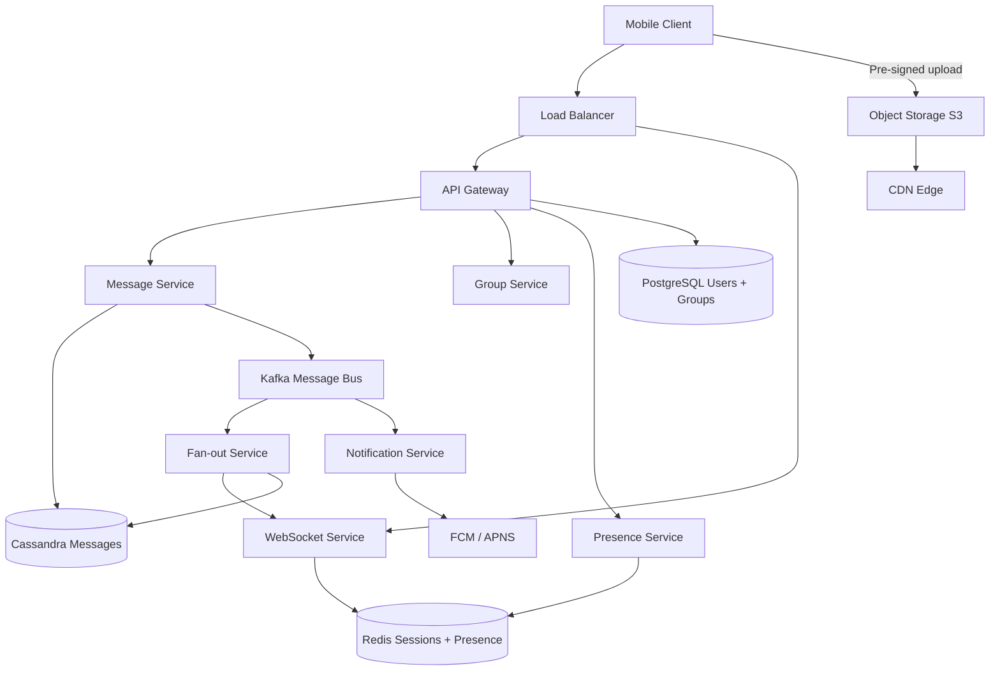
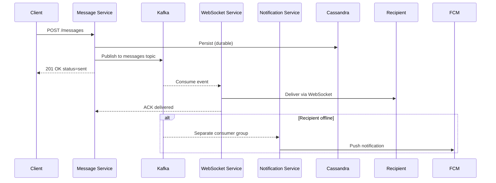
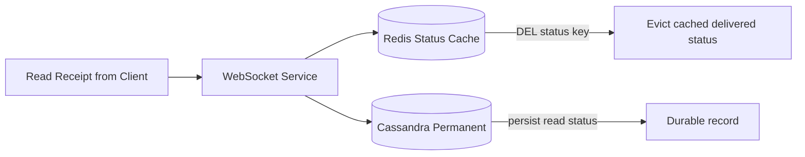
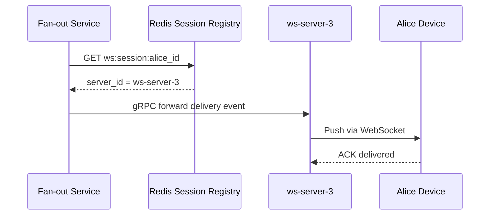
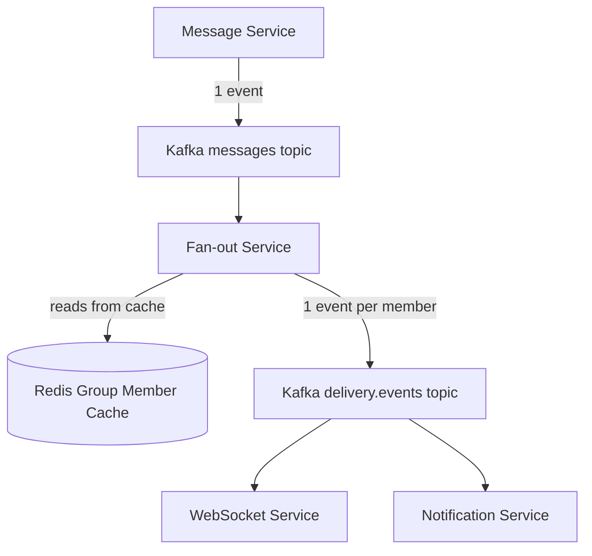
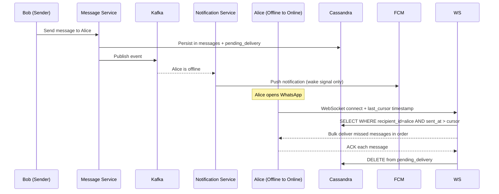
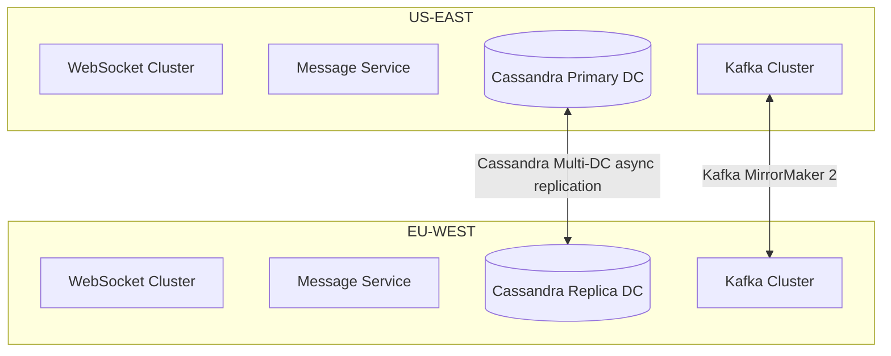

# Design WhatsApp

WhatsApp serves **2 billion+ users** exchanging **100 billion messages per day**. It is one of the most studied system design problems because it combines real-time messaging, guaranteed delivery, group fan-out, and offline handling — all under strict latency and reliability constraints.

The surface looks simple: send a message, receive a message. The depth lies in how you deliver 100 billion messages reliably per day, route them to the right WebSocket connection across thousands of servers, and guarantee nothing is lost when a user's phone is offline for a week.

---

## Functional Requirements

**In Scope:**
- Send and receive 1-on-1 text messages in real time
- Group messaging (up to 1,024 members)
- Message delivery receipts: sent ✓, delivered ✓✓, read ✓✓ (blue ticks)
- Media sharing: images, video, audio, documents
- Online presence and last-seen indicators
- Push notifications for offline users

**Out of Scope:**
- End-to-end encryption key exchange internals (Signal Protocol)
- Voice / video calling infrastructure
- WhatsApp Web multi-device sync
- Payments, Status (Stories), Channels, Business API

---

## Non-Functional Requirements

| Property | Target | Reasoning |
|---|---|---|
| **Message Latency** | p99 < 100ms for online users | Real-time feel; anything beyond 200ms is perceptibly laggy |
| **Availability** | 99.99% (< 53 min downtime/year) | Messaging is mission-critical; outages break trust immediately |
| **Durability** | Zero message loss; media persisted indefinitely | Users expect nothing dropped — ever |
| **Ordering** | Strict per-conversation ordering | Out-of-order messages break conversation coherence |
| **Scale** | 2B users, 100B messages/day, 500M DAU | Every architecture decision flows from this scale |
| **Notification Latency** | < 5s push for offline users | Balance between battery (fewer pushes) and UX (fast wake-up) |

**Key tradeoff:** WhatsApp prioritizes **delivery guarantees over strict real-time throughput**. A message delayed 50ms is acceptable; a dropped message is not. This single principle drives the choice of Kafka as a durable buffer between ingestion and delivery.

---

## Capacity Estimation

**Messages:**
- 100B messages/day → ~1.15M/sec average; ~4–5M/sec peak (holidays, major events)
- Average message: 1 KB text; media attachments ~500 KB average

**Storage:**
- Text: 1.15M/sec × 1 KB = ~100 GB/day
- Media: 20% messages carry media → 230K media/sec × 500 KB ≈ ~1–2 PB/day (after dedup + compression)
- Message metadata + receipts: ~50 GB/day
- **Total: ~2–3 PB/day** — requires tiered object storage with automatic cold archival

**Connections:**
- 500M DAU with persistent WebSocket connections
- 100K connections/server → **5,000 WebSocket servers** at peak
- Redis stores 500M session entries × ~100 bytes = **~50 GB** for session registry

**Bandwidth:**
- Inbound: ~1.15 GB/sec (text only)
- Group message amplification (avg 50 members): ~5–10× → **10–15 GB/sec** outbound

---

## Core Entities

| Entity | Purpose | Key Fields |
|---|---|---|
| **User** | Account identity and profile | `user_id`, `phone_number`, `display_name`, `profile_photo_url`, `last_seen`, `privacy_settings` |
| **Message** | A single atomic message unit | `message_id`, `sender_id`, `chat_id`, `type`, `content`, `media_url`, `client_message_id`, `sent_at` |
| **Chat** | 1-on-1 conversation context | `chat_id`, `participant_ids[2]`, `created_at` |
| **Group** | Multi-user conversation | `group_id`, `name`, `admin_ids[]`, `description`, `member_count`, `created_at` |
| **GroupMember** | Membership and role tracking | `group_id`, `user_id`, `role` (admin/member), `joined_at`, `left_at` |
| **MessageStatus** | Per-recipient delivery state | `message_id`, `recipient_id`, `status` (sent/delivered/read), `updated_at` |
| **Media** | Binary attachment metadata | `media_id`, `uploader_id`, `cdn_url`, `type`, `size_bytes`, `sha256_hash`, `created_at` |

**Delivery Status Lifecycle:**

| Status | Meaning | Set By | Storage |
|---|---|---|---|
| `sent` | Server persisted the message | Message Service on Cassandra write | Cassandra (permanent) |
| `delivered` | Recipient device received it | WebSocket Service on push | Redis TTL 7 days |
| `read` | Recipient opened the conversation | Client sends receipt event | Cassandra (permanent) |
| `failed` | Undeliverable after retry window | Notification Service on TTL expiry | Cassandra (permanent) |

**Critical modeling decisions:**
- `client_message_id` is generated by the client before sending — the server deduplicates on this key, preventing duplicate messages on network retry. This is idempotency at the application layer.
- `MessageStatus` has one row **per recipient** — a 1,024-member group creates 1,023 status rows. This is exactly why receipt fan-out is a dedicated deep-dive problem.
- `Media.sha256_hash` enables server-side deduplication — if two users send the same photo, only one S3 object is stored.

---

## Databases and Database Design

### Storage Tier Decisions

| Data | Access Pattern | Engine | Why |
|---|---|---|---|
| Messages | Append-only, time-range reads per chat | **Cassandra** | LSM-tree optimized for sequential writes; time-series clustering key |
| Users, Groups, Membership | Relational, strong consistency, low write volume | **PostgreSQL** | ACID for group membership changes; foreign key integrity |
| Sessions, Presence, Delivery Status cache | Ephemeral, sub-millisecond reads, TTL-driven | **Redis** | O(1) key-value; TTL lifecycle; Cluster for scale |
| Media binaries | Write-once, read-many, petabyte scale | **S3 + CDN** | Object storage for PB scale; CDN for edge delivery |
| Message status (permanent) | High write fan-out, eventual reads | **Cassandra** | High write throughput; per-recipient rows distribute naturally |

### Schema 1 — Messages (Cassandra)

```sql
CREATE TABLE messages (
  chat_id      UUID,
  sent_at      TIMESTAMP,
  message_seq  BIGINT,       -- server-assigned monotonic sequence (Redis INCR)
  message_id   UUID,
  sender_id    UUID,
  type         TEXT,         -- 'text' | 'image' | 'video' | 'audio' | 'document'
  content      TEXT,
  media_url    TEXT,
  PRIMARY KEY (chat_id, sent_at, message_seq)
) WITH CLUSTERING ORDER BY (sent_at DESC, message_seq DESC)
  AND compaction = {
    'class': 'TimeWindowCompactionStrategy',
    'compaction_window_unit': 'DAYS',
    'compaction_window_size': 1
  };
```

- Partition key `chat_id` co-locates all messages for a conversation on the same Cassandra node — no scatter-gather for history fetches.
- TWCS compaction: daily windows are compacted independently, keeping read amplification low for recent data.

### Schema 2 — Pending Delivery Inbox (Cassandra)

```sql
CREATE TABLE pending_delivery (
  recipient_id UUID,
  sent_at      TIMESTAMP,
  message_id   UUID,
  chat_id      UUID,
  sender_id    UUID,
  content      TEXT,
  type         TEXT,
  PRIMARY KEY (recipient_id, sent_at, message_id)
) WITH CLUSTERING ORDER BY (sent_at ASC);
```

This is the offline inbox. On reconnect, the client sends its last-seen cursor; the server scans `WHERE recipient_id = ? AND sent_at > cursor` — a single-partition scan.

### Schema 3 — Users (PostgreSQL)

```sql
CREATE TABLE users (
  user_id      UUID         PRIMARY KEY DEFAULT gen_random_uuid(),
  phone_number VARCHAR(20)  UNIQUE NOT NULL,
  display_name VARCHAR(100),
  last_seen    TIMESTAMPTZ,
  created_at   TIMESTAMPTZ  DEFAULT NOW()
);

CREATE UNIQUE INDEX idx_users_phone ON users (phone_number);
```

### Schema 4 — Groups and Membership (PostgreSQL)

```sql
CREATE TABLE groups (
  group_id    UUID         PRIMARY KEY DEFAULT gen_random_uuid(),
  name        VARCHAR(100) NOT NULL,
  description TEXT,
  created_by  UUID         REFERENCES users(user_id),
  created_at  TIMESTAMPTZ  DEFAULT NOW()
);

CREATE TABLE group_members (
  group_id  UUID         REFERENCES groups(group_id),
  user_id   UUID         REFERENCES users(user_id),
  role      VARCHAR(10)  DEFAULT 'member',
  joined_at TIMESTAMPTZ  DEFAULT NOW(),
  left_at   TIMESTAMPTZ,
  PRIMARY KEY (group_id, user_id)
);

CREATE INDEX idx_group_members_user ON group_members (user_id) WHERE left_at IS NULL;
```

The partial index (`WHERE left_at IS NULL`) is critical — listing all active groups for a user only scans current memberships.

### Schema 5 — Media Metadata (PostgreSQL)

```sql
CREATE TABLE media (
  media_id     UUID         PRIMARY KEY DEFAULT gen_random_uuid(),
  uploader_id  UUID         REFERENCES users(user_id),
  cdn_url      TEXT         NOT NULL,
  type         TEXT         NOT NULL,
  size_bytes   BIGINT       NOT NULL,
  sha256_hash  CHAR(64)     UNIQUE,    -- deduplication key
  created_at   TIMESTAMPTZ  DEFAULT NOW()
);

CREATE UNIQUE INDEX idx_media_hash ON media (sha256_hash);
```

### Sharding and Replication Strategy

| Store | Shard Key | Strategy | Replication |
|---|---|---|---|
| Messages (Cassandra) | `chat_id` | Consistent hashing (Murmur3) | RF=3, `LOCAL_QUORUM` writes |
| Pending Delivery (Cassandra) | `recipient_id` | Consistent hashing | RF=3, `LOCAL_ONE` reads |
| Message Status (Cassandra) | `message_id` | Consistent hashing | RF=3 |
| Users (PostgreSQL) | Single primary | Vertical + read replicas | Primary + 2 read replicas |
| Redis (sessions, presence) | `user_id` hash slot | Redis Cluster (16,384 hash slots) | 1 replica per master |

---

## API Design

**Send a message:**
```http
POST /v1/messages
Authorization: Bearer <jwt>
Idempotency-Key: client-uuid-abc123

{
  "chat_id":           "f47ac10b-58cc-4372-a567-0e02b2c3d479",
  "type":              "text",
  "content":           "Hey, are you free tonight?",
  "client_message_id": "client-uuid-abc123"
}

201 Created
{
  "message_id": "server-uuid-xyz",
  "status":     "sent",
  "sent_at":    "2026-05-29T10:00:00Z"
}
```

**Fetch message history (cursor-paginated):**
```http
GET /v1/chats/{chat_id}/messages?before=2026-05-29T10:00:00Z&limit=30

200 OK
{
  "messages": [
    { "message_id": "uuid", "sender_id": "uuid", "content": "Hey!",
      "type": "text", "sent_at": "2026-05-29T09:58:00Z", "status": "read" }
  ],
  "next_cursor": "2026-05-29T09:58:00Z",
  "has_more": true
}
```

> Cursor-based pagination on `sent_at`. Offset pagination (`?page=N`) is O(n) on Cassandra — never use it.

**Request media upload URL:**
```http
POST /v1/media/upload-url
{ "content_type": "image/jpeg", "size_bytes": 204800 }

200 OK
{
  "upload_url": "https://s3.amazonaws.com/...?X-Amz-Signature=...",
  "media_id":   "media-uuid",
  "expires_in": 300
}
```

**Update delivery receipt:**
```http
PATCH /v1/messages/{message_id}/status
{ "status": "read", "recipient_id": "user-uuid" }

204 No Content
```

**Get user presence:**
```http
GET /v1/presence/{user_id}

200 OK
{ "user_id": "uuid", "online": true, "last_seen": "2026-05-29T09:55:00Z" }
```

**Create or update a group:**
```http
POST /v1/groups
{
  "name":       "Europe Trip 2026",
  "member_ids": ["uid1", "uid2", "uid3"]
}

201 Created
{ "group_id": "grp-uuid", "name": "Europe Trip 2026", "member_count": 3 }
```

**Real-time channel (WebSocket):**
```
WSS wss://msg.whatsapp.net/v1/connect
Authorization: Bearer <jwt>
```
All real-time events — message delivery, receipts, presence changes — flow over this single persistent connection. REST handles history loading and configuration. The WebSocket is multiplexed: one connection carries all chat traffic for the client.

---

## High-Level Design



**Component responsibilities:**

| Component | Role |
|---|---|
| **API Gateway** | JWT validation, rate limiting, TLS termination, routing |
| **Message Service** | Persists message to Cassandra; publishes `message-created` to Kafka; returns 201 immediately |
| **WebSocket Service** | Holds persistent client connections; routes and delivers in-flight messages |
| **Fan-out Service** | Kafka consumer; expands group messages into per-member delivery events |
| **Presence Service** | Tracks online/offline via Redis TTL heartbeats |
| **Notification Service** | Kafka consumer; triggers FCM/APNS for offline recipients |
| **Kafka** | Durable ordered event log; decouples ingestion from all downstream consumers |
| **Redis** | WebSocket session registry, delivery status cache, presence data, group membership cache |

**Message send flow:**
1. Client → `POST /v1/messages` → API Gateway → Message Service
2. Message Service writes to Cassandra (durable), publishes to Kafka → returns `201 sent` immediately
3. Kafka → Fan-out Service (if group) → per-member delivery events onto `delivery.events` topic
4. WebSocket Service looks up recipient session in Redis → routes delivery to correct server → pushes to recipient
5. Recipient ACKs → `message_status` updated → sender notified via WebSocket

---

## Deep Dives

### 1. Kafka: Required and Central

At 1.15M messages/sec average, synchronous delivery inside the Message Service would:
- **Couple write latency to delivery latency** — if recipient's WebSocket is slow, the sender's `POST /messages` blocks
- **Lose in-flight messages on crash** — no durable buffer between write and delivery
- **Prevent independent scaling** — delivery throughput caps at message ingestion throughput

Kafka solves all three. Message Service writes to Kafka and returns immediately. Each downstream consumer scales independently.



**Kafka Topic Design:**

| Topic | Partition Key | Consumers | Retention |
|---|---|---|---|
| `messages` | `chat_id` | Fan-out Service | 7 days |
| `delivery.events` | `recipient_user_id` | WebSocket Service, Notification Service | 3 days |
| `receipts` | `chat_id` | Message Service | 3 days |
| `presence.events` | `user_id` | Presence Service | 1 day |

Partitioning `messages` by `chat_id` guarantees in-order delivery within each conversation — no distributed locking needed for ordering. Partitioning `delivery.events` by `recipient_user_id` ensures one consumer handles all deliveries for a given user.

**Backpressure:** If the WebSocket Service lags (server restart, deploy), Kafka buffers the lag. Consumers catch up without data loss. Alert if consumer group lag exceeds 10 seconds — that means recipients see delayed messages.

**Tradeoff:** Kafka adds 5–20ms of latency. At < 100ms total delivery SLA, this is ~20% of budget — acceptable. For sub-10ms gaming or trading systems, Kafka would be too slow.

---

### 2. Redis: Caching, Strategies, and Invalidation

Redis underpins four critical subsystems. Each has a different caching strategy:

**a) WebSocket Session Registry**

Every WebSocket server registers active connections:
```
SET ws:session:{user_id}  {server_id}  EX 90
```
The Fan-out Service looks up this key to route delivery to the correct server. On connect, the key is set. Every 30s heartbeat refreshes the TTL. On ungraceful disconnect, TTL expiry auto-removes it.

**Invalidation:** TTL-based — no explicit invalidation needed. If a user reconnects to a different server, the `SET` overwrites the previous entry (last-write-wins).

**b) Presence System**

```
SET presence:{user_id}  online  EX 60
```
On graceful disconnect, `DEL presence:{user_id}` + async update to `users.last_seen` in PostgreSQL. 500M keys × 100 bytes = ~50 GB across a Redis Cluster.

**Invalidation:** TTL-based. A 60-second TTL means a user who loses connectivity appears online for up to 60s — the "stale online" window. Reducing to 30s halves the window but doubles heartbeat write volume (16.7M writes/sec at 500M users).

**c) Group Membership Cache**

Fan-out reads group members on every group message send. Querying PostgreSQL for every fan-out is a read bottleneck.

```
SET grp:members:{group_id}  [uid1, uid2, ... uid1024]  EX 300
```

**Cache invalidation:** When a member joins or leaves, the Group Service:
1. Updates PostgreSQL (source of truth)
2. Issues `DEL grp:members:{group_id}` — explicit delete, not update

The next fan-out will miss the cache and re-populate from PostgreSQL with fresh data. This is the **cache-aside (lazy loading)** pattern with invalidation on write.

**d) Delivery Status Cache**

`delivered` status is written to Redis with TTL=7 days for fast reads. On status upgrade to `read`, write to Cassandra and `DEL` the Redis key:



**Cache invalidation summary:**

| Cache | Strategy | Invalidation Trigger | Pattern |
|---|---|---|---|
| Session registry | TTL 90s + heartbeat refresh | On reconnect (overwrite) | TTL + lazy overwrite |
| Presence | TTL 60s + heartbeat refresh | On graceful disconnect (DEL) | TTL + explicit delete |
| Group membership | TTL 300s | On member join/leave (DEL) | Cache-aside + write-through delete |
| Delivery status | TTL 7 days | On status upgrade to `read` (DEL) | Explicit delete on state transition |

**Stampede protection:** When a hot group's cache expires (group with 1,024 members, active conversation), multiple concurrent messages can simultaneously miss and each trigger a PostgreSQL read. Solution: Redis `SET lock:grp:{group_id} 1 NX EX 2` — the first miss holds the lock, others wait 50ms and retry the cache.

---

### 3. WebSocket Routing at Scale

WebSocket connections are stateful — each client holds a persistent TCP connection to a **specific server instance**. When Kafka delivers a message for Alice, it must know which of 5,000 WebSocket servers she is connected to.

**Solution: Redis session registry lookup**



**Scaling:** WebSocket servers are stateless in business logic — they hold raw TCP connections but carry no application state. Adding new servers requires zero migration. The Redis Cluster handles 10M+ session lookups/sec comfortably.

**Tradeoff:** One extra Redis roundtrip (~1ms) per message delivery. At 1.15M msg/sec, this is 1.15M Redis reads/sec — within cluster capacity but uses ~12% of latency budget.

---

### 4. Group Message Fan-out

A 1,024-member group message must deliver to 1,023 recipients. The write amplification is:
- 100B messages/day; 30% are group messages to average 50-member groups
- 30B × 50 = **1.5 trillion delivery operations/day**

Writing 1,023 rows synchronously in the Message Service is catastrophically slow. A dedicated fan-out pipeline solves this:



The Fan-out Service is horizontally scalable — add more consumers to increase throughput. For max-size groups (1,024 members), last-member delivery may lag 200–500ms behind first — WhatsApp explicitly accepts this. The alternative (synchronous fan-out in the write path) would stall the sender's `201 OK` for seconds.

---

### 5. Message Ordering: Solving Clock Skew

Cassandra clusters messages by `(sent_at, message_seq)`. Device clocks drift — two messages sent 1ms apart on different phones may arrive with identical or inverted `sent_at` values. Without a server-side tiebreaker, conversations render out of order.

**Solution: Server-assigned monotonic sequence per chat**

```
message_seq = INCR msg:seq:{chat_id}   ← Redis atomic increment
```

Every message write includes one Redis `INCR` — adds ~1ms to the write path but guarantees total ordering even under concurrent sends.

**Hot key concern:** `msg:seq:{chat_id}` is hit on every message write to that chat. A 1,024-member group with 100 messages/sec creates a hot Redis key. Redis single-threaded per slot handles ~100K INCR/sec per slot — sufficient for any realistic chat workload.

---

### 6. Offline Delivery and Inbox Cursor

When a user is offline, messages accumulate in the `pending_delivery` Cassandra table. On reconnect, the client sends its last cursor:



**Push is a wake signal, not a payload carrier.** The push notification contains only a session token and badge count — not message content. The client fetches actual messages via inbox cursor on reconnect. This avoids:
- Double delivery bugs (push + WebSocket both deliver the same message)
- Push payload size limits (FCM max 4 KB per notification)
- Decryption on the notification layer (messages are E2E encrypted; decryption must happen on-device)

---

### 7. Rate Limiting

| Tier | Limit | Mechanism | Scope |
|---|---|---|---|
| Per user (text) | 60 messages/min | Token bucket in Redis | Prevents spam accounts |
| Per user (media) | 15 media/min | Token bucket in Redis | Limits storage abuse |
| Per group sender | 30 messages/min | Token bucket keyed by `(group_id, sender_id)` | Controls group flooding |
| Per IP (unauthenticated) | 200 requests/min | Sliding window in Redis | Blocks credential stuffing |

Rate limiting is enforced at the API Gateway before requests reach any service — rate-limited requests never touch Cassandra or Kafka.

---

### 8. Multi-Region Deployment

Single-region deployment creates unacceptable latency for geographically distant users and fails GDPR data residency requirements.



**Strategy:**
- Users are **homed** to a region at registration based on phone number country code
- All writes for a user route to their home region's Cassandra primary (RF=3 per DC, `LOCAL_QUORUM`)
- Cross-region messages write to sender's home region; Multi-DC replication propagates asynchronously
- Kafka MirrorMaker 2 replicates topics for DR and cross-region notification routing

**GDPR compliance:** EU user messages are written exclusively to EU-based Cassandra nodes, configured with `NetworkTopologyStrategy` and EU-only RF. They never leave the region as primaries.

---

## Summary: Key Engineering Decisions

| Decision | Choice | Why |
|---|---|---|
| Real-time transport | WebSocket | Bidirectional, persistent, low per-message overhead vs HTTP polling |
| Message store | Cassandra (TWCS, partitioned by `chat_id`) | Append-only time-series; no cross-node joins for history |
| Message bus | Kafka (partitioned by `chat_id`) | Decouples ingestion from delivery; preserves per-chat ordering |
| Session routing | Redis session registry | O(1) lookup; TTL lifecycle; survives server restarts |
| Group membership | Redis cache-aside (TTL 5min, DEL on change) | Avoids PostgreSQL scan on every fan-out; consistent after invalidation |
| Media storage | S3 + CDN with pre-signed URLs | Binary off app servers; SHA256 dedup; edge delivery |
| Fan-out strategy | Two-stage via dedicated Fan-out Service | Avoids write amplification at ingestion; independently scalable |
| Message ordering | Redis INCR sequence per chat | Total order tiebreaker; solves device clock skew |
| Offline delivery | `pending_delivery` table + cursor-based sync | Zero message loss; push is wake signal only |
| Multi-region | Cassandra Multi-DC + Kafka MirrorMaker 2 | Latency, GDPR data residency, disaster recovery |

The core principle: **separate concerns so each subsystem scales independently.** Message ingestion, delivery, fan-out, presence, and notifications are all decoupled — connected only through Kafka events and Redis state. This is the architecture that turns a simple chat app into a system that delivers 100 billion messages a day without dropping one.
