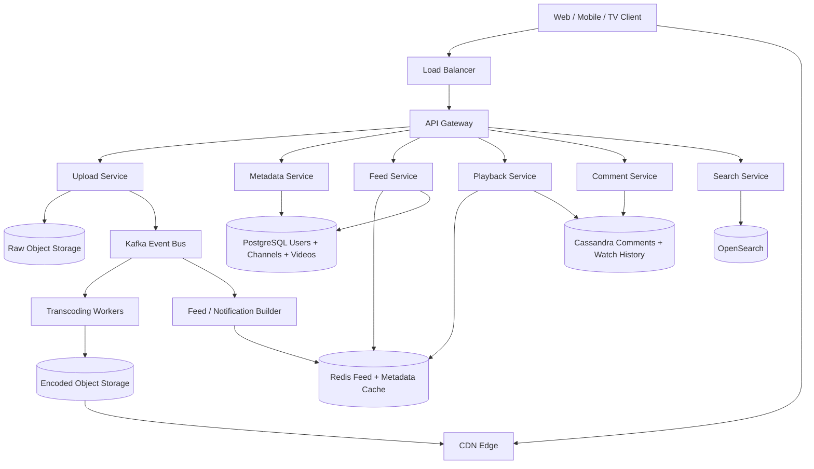
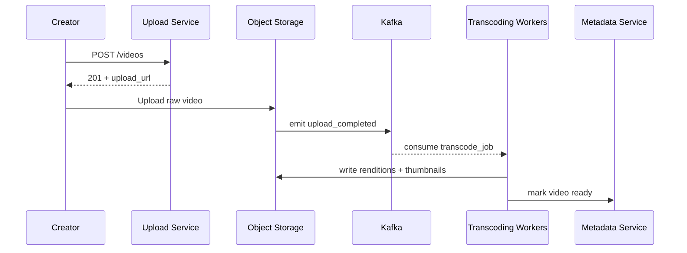
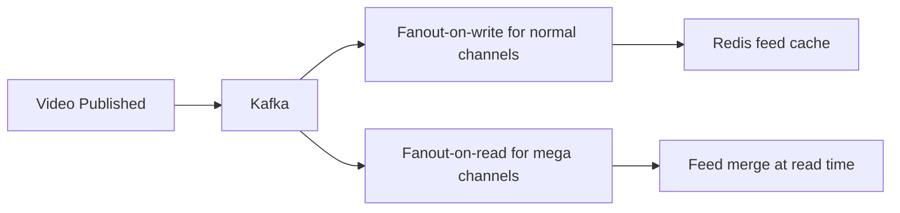
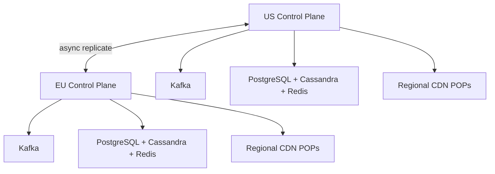

# Design YouTube

YouTube serves **billions of monthly users**, ingests **hundreds of hours of video per minute**, and delivers video through one of the largest content distribution systems on the internet. It is a strong interview problem because it combines a write-heavy **ingestion and transcoding pipeline** with a read-dominated **global playback and discovery platform**.

The surface looks simple: upload, search, click play. The depth lies in pre-signed uploads, asynchronous transcoding, recommendation fanout, hot-video caching, comments at scale, and keeping the application tier off the video-byte path.

---

## Functional Requirements

**In Scope:**
- Upload a video with metadata such as title, description, tags, and thumbnail
- Transcode uploaded video into multiple resolutions and bitrates
- Watch videos with adaptive bitrate streaming on web, mobile, and TV
- Browse a personalized home feed and a subscriptions feed
- Search for videos and open video detail pages
- Like videos, post comments, and subscribe to channels
- Save watch progress and watch history across devices
- Support offline downloads for eligible users and regions

**Out of Scope:**
- Live streaming and live chat infrastructure
- Ad serving and auction systems
- Recommendation model training internals
- Copyright enforcement workflows and Content ID internals
- Studio-grade editing tools

---

## Non-Functional Requirements

| Property | Target | Reasoning |
|---|---|---|
| **Playback Startup Latency** | p99 < 2s | Users abandon slow-starting videos quickly |
| **Upload ACK Latency** | < 1s to create upload session | Upload setup should be instant even if processing takes minutes |
| **Availability** | 99.99% for playback control plane; graceful CDN failover | Video playback must survive POP and regional failures |
| **Durability** | No loss of uploaded source video, metadata, or watch history | Creator content and user history are durable assets |
| **Consistency** | Strong for upload ownership, publish state, and subscription writes; eventual for feeds, counters, and recommendations | One stale view count is acceptable; losing ownership is not |
| **Scale** | Billions of users, 50M+ concurrent plays, hundreds of hours uploaded per minute | Both the ingestion path and read path must scale independently |
| **Reliability** | Graceful degradation during viral traffic spikes | A hot video cannot take down metadata, comments, or playback APIs |

**Key tradeoff:** YouTube optimizes for **cheap, resilient video delivery and asynchronous processing** over immediately consistent metadata everywhere. A view count that lags by a few seconds is fine. Rebuffering, failed uploads, or broken playback are not.

---

## Capacity Estimation

**Uploads:**
- ~500 hours of video uploaded per minute
- If the average uploaded video is ~8 minutes, that is ~3,700 uploads/minute or **~60 uploads/sec average**

**Playback:**
- Assume **1B watch sessions/day**
- Assume **50M peak concurrent viewers** globally
- Weighted average delivered bitrate around **3 Mbps** -> **~150 Tbps** peak CDN egress

**Storage:**
- Raw uploads can already reach **PB-scale per day**
- Multiple renditions, subtitles, thumbnails, and preview assets multiply storage substantially
- The origin stores the full library; CDN edges cache only the hot working set

**Events:**
- Playback heartbeats, likes, comments, and publish events create **millions of events/sec** during peak traffic

---

## Core Entities

| Entity | Purpose | Key Fields | Relationships |
|---|---|---|---|
| **User** | Account identity | `user_id`, `email`, `status`, `home_region`, `created_at` | owns channels, devices, watch history |
| **Channel** | Creator-owned publishing identity | `channel_id`, `owner_user_id`, `name`, `handle`, `subscriber_count`, `created_at` | owns many videos and subscribers |
| **Video** | Logical video object | `video_id`, `channel_id`, `title`, `description`, `visibility`, `processing_state`, `published_at` | has many renditions, comments, likes |
| **VideoAsset** | Encoded output or subtitle track | `asset_id`, `video_id`, `kind`, `codec`, `resolution`, `bitrate_kbps`, `object_key` | many per video |
| **Subscription** | Viewer-channel relationship | `subscriber_user_id`, `channel_id`, `created_at` | many-to-many between users and channels |
| **Comment** | User-generated discussion entry | `comment_id`, `video_id`, `author_user_id`, `parent_comment_id`, `body`, `created_at` | belongs to a video or parent comment |
| **WatchHistory** | Per-user viewing record | `user_id`, `video_id`, `last_position_ms`, `watch_state`, `updated_at` | shown in history and continue watching |
| **PlaybackSession** | Active viewing session | `session_id`, `user_id`, `video_id`, `device_id`, `seq_no`, `state`, `started_at` | emits ordered playback events |

**Critical modeling decisions:**
- `Video` is separate from `VideoAsset` because one upload becomes many renditions, captions, thumbnails, and previews.
- `PlaybackSession` is ephemeral session state; `WatchHistory` is the durable user-facing view derived from events.
- Subscription feeds and recommendation rows are **derived views**. They can be rebuilt from durable metadata and event streams.

---

## Databases and Database Design

### Storage Tier Decisions

| Data | Access Pattern | Engine | Why |
|---|---|---|---|
| Users, channels, video metadata | transactional writes, rich indexing, moderate write volume | **PostgreSQL** | ownership, publish state, and channel updates need strong consistency |
| Subscriptions | many-to-many graph edges, transactional writes, user/channel lookups | **PostgreSQL** | exact subscribe/unsubscribe semantics matter |
| Comments and watch history | high write volume, user- or video-scoped reads | **Cassandra** | predictable writes and horizontal scale for large fan-in/fan-out patterns |
| Feed cache, hot metadata cache, counters | low-latency reads, TTLs, hot keys | **Redis** | ideal for hot rows, rate limits, and sharded counters |
| Search index | text search, autocomplete, ranking filters | **OpenSearch** | inverted index is a better fit than relational scans |
| Upload, playback, and publish events | append-only durable event streams | **Kafka** | decouples APIs from transcoding, feed building, notifications, and analytics |
| Raw uploads and transcoded assets | immutable large objects | **Object Storage + CDN** | durable origin plus global low-latency edge delivery |

This is a deliberately polyglot design. The system has to separate **transactional metadata**, **derived feed views**, and **video byte delivery**.

### Schema 1 - Users and Channels (PostgreSQL)

```sql
CREATE TABLE users (
  user_id        UUID PRIMARY KEY DEFAULT gen_random_uuid(),
  email          VARCHAR(255) UNIQUE NOT NULL,
  status         VARCHAR(16)  NOT NULL DEFAULT 'active',
  home_region    CHAR(2)      NOT NULL,
  created_at     TIMESTAMPTZ  DEFAULT NOW()
);

CREATE TABLE channels (
  channel_id         UUID PRIMARY KEY DEFAULT gen_random_uuid(),
  owner_user_id      UUID         NOT NULL REFERENCES users(user_id),
  name               VARCHAR(120) NOT NULL,
  handle             VARCHAR(64)  UNIQUE NOT NULL,
  subscriber_count   BIGINT       NOT NULL DEFAULT 0,
  created_at         TIMESTAMPTZ  DEFAULT NOW()
);

CREATE INDEX idx_channels_owner ON channels (owner_user_id);
```

### Schema 2 - Video Metadata (PostgreSQL)

```sql
CREATE TABLE videos (
  video_id            UUID PRIMARY KEY DEFAULT gen_random_uuid(),
  channel_id          UUID         NOT NULL REFERENCES channels(channel_id),
  title               TEXT         NOT NULL,
  description         TEXT,
  visibility          VARCHAR(16)  NOT NULL DEFAULT 'private',
  processing_state    VARCHAR(20)  NOT NULL DEFAULT 'uploading',
  duration_sec        INT,
  published_at        TIMESTAMPTZ,
  created_at          TIMESTAMPTZ  DEFAULT NOW()
);

CREATE INDEX idx_videos_channel_published
  ON videos (channel_id, published_at DESC);
```

### Schema 3 - Video Assets (PostgreSQL)

```sql
CREATE TABLE video_assets (
  asset_id            UUID PRIMARY KEY DEFAULT gen_random_uuid(),
  video_id            UUID         NOT NULL REFERENCES videos(video_id),
  kind                VARCHAR(16)  NOT NULL,   -- video | audio | subtitle | thumbnail
  codec               VARCHAR(32),
  resolution          VARCHAR(16),
  bitrate_kbps        INT,
  language_code       VARCHAR(10),
  object_key          TEXT         NOT NULL,
  checksum            CHAR(64)     NOT NULL,
  created_at          TIMESTAMPTZ  DEFAULT NOW()
);

CREATE INDEX idx_video_assets_lookup
  ON video_assets (video_id, kind, language_code, bitrate_kbps);
```

### Schema 4 - Subscriptions (PostgreSQL)

```sql
CREATE TABLE subscriptions (
  subscriber_user_id  UUID        NOT NULL REFERENCES users(user_id),
  channel_id          UUID        NOT NULL REFERENCES channels(channel_id),
  created_at          TIMESTAMPTZ DEFAULT NOW(),
  PRIMARY KEY (subscriber_user_id, channel_id)
);

CREATE INDEX idx_subscriptions_channel
  ON subscriptions (channel_id, created_at DESC);
```

### Schema 5 - Comments (Cassandra)

```sql
CREATE TABLE comments_by_video (
  video_id            UUID,
  comment_shard       SMALLINT,
  created_at          TIMESTAMP,
  comment_id          UUID,
  author_user_id      UUID,
  parent_comment_id   UUID,
  body                TEXT,
  like_count          BIGINT,
  PRIMARY KEY ((video_id, comment_shard), created_at, comment_id)
) WITH CLUSTERING ORDER BY (created_at DESC, comment_id DESC);
```

`comment_shard` spreads writes for hot videos. The read path merges a small number of shards for the first page instead of hot-spotting one partition.

### Schema 6 - Watch History (Cassandra)

```sql
CREATE TABLE watch_history_by_user (
  user_id             UUID,
  updated_at          TIMESTAMP,
  video_id            UUID,
  session_id          UUID,
  last_position_ms    BIGINT,
  watch_state         TEXT,
  PRIMARY KEY (user_id, updated_at, video_id)
) WITH CLUSTERING ORDER BY (updated_at DESC, video_id ASC);
```

### Sharding and Replication Strategy

| Store | Shard Key | Strategy | Replication |
|---|---|---|---|
| Users / Channels / Videos (PostgreSQL) | `channel_id` or `user_id` | logical hash sharding after single-cluster growth | primary + 2 read replicas; async cross-region replication |
| Subscriptions (PostgreSQL) | `subscriber_user_id` | hash sharding | primary + read replicas |
| Comments (Cassandra) | `(video_id, comment_shard)` | consistent hashing | RF=3, `LOCAL_QUORUM` writes |
| Watch History (Cassandra) | `user_id` | consistent hashing | RF=3, `LOCAL_ONE` reads |
| Redis | `user_id` hash slot | Redis Cluster | 1 replica per master |
| Search Index | `video_id` | sharded inverted index | 1 primary + 1 replica |

**Consistency model:**
- Strong consistency for upload ownership, video publish state, subscription writes, and offline download rights
- Eventual consistency for view counts, like counts, recommendations, subscriptions feed materialization, and search freshness

**Read/write patterns:**
- **Upload path:** creator creates metadata -> uploads bytes to object storage -> Kafka triggers transcoding and publish-side effects
- **Read path:** client fetches home or search results from cached/derived views, then gets metadata and playback manifest from the control plane
- **Byte path:** manifests, thumbnails, and segments are served by CDN; origins are only hit on miss or prewarm

---

## API Design

**Create video upload session:**
```http
POST /v1/videos
Authorization: Bearer <jwt>
Idempotency-Key: upload-6d7f-001

{
  "channel_id": "5f47ac10-b111-4372-a567-0e02b2c3d479",
  "title": "System Design Basics",
  "description": "A short primer on load balancers.",
  "visibility": "private"
}

201 Created
{
  "video_id": "0d4f8b3f-1b56-4c9a-8c6c-7dbf61752111",
  "upload_url": "https://storage.youtube.example/upload/0d4f...?sig=...",
  "state": "uploading"
}
```

**Publish uploaded video:**
```http
POST /v1/videos/{video_id}/publish
Authorization: Bearer <jwt>

{
  "thumbnail_asset_id": "thumb_abc123",
  "visibility": "public"
}

202 Accepted
{
  "video_id": "0d4f8b3f-1b56-4c9a-8c6c-7dbf61752111",
  "processing_state": "queued_for_transcoding"
}
```

**Get home feed (cursor-paginated):**
```http
GET /v1/home?user_id=9182&cursor=eyJyb3dfc2NvcmUiOjEyMzR9&limit=20
Authorization: Bearer <jwt>

200 OK
{
  "items": [
    {
      "video_id": "vid_101",
      "title": "How CDNs Work",
      "channel": { "channel_id": "chn_1", "name": "Infra Lab" },
      "view_count": 124000,
      "published_at": "2026-06-03T10:00:00Z"
    }
  ],
  "next_cursor": "eyJyb3dfc2NvcmUiOjExNDB9",
  "has_more": true
}
```

> Cursor-based pagination on feed ranking cursor. Offset pagination (`?page=N`) becomes unstable once recommendations and counters are changing continuously.

**Search videos:**
```http
GET /v1/search?q=system+design&cursor=eyJmcm9tIjoyMH0=&limit=20

200 OK
{
  "results": [
    {
      "video_id": "vid_101",
      "title": "How CDNs Work",
      "channel_name": "Infra Lab",
      "duration_sec": 780
    }
  ],
  "next_cursor": "eyJmcm9tIjo0MH0=",
  "has_more": true
}
```

**Get playback manifest:**
```http
GET /v1/videos/{video_id}/playback?user_id=9182&device_id=dev_22
Authorization: Bearer <jwt>

200 OK
{
  "playback_session_id": "sess_789",
  "manifest_url": "https://cdn.youtube.example/manifests/vid_101/master.mpd?sig=...",
  "heartbeat_interval_sec": 15,
  "available_audio": ["en", "es"],
  "available_subtitles": ["en", "fr", "de"]
}
```

**Post a comment:**
```http
POST /v1/videos/{video_id}/comments
Authorization: Bearer <jwt>

{
  "parent_comment_id": null,
  "body": "Great explanation of cache invalidation."
}

201 Created
{
  "comment_id": "cmt_456",
  "created_at": "2026-06-03T10:01:00Z"
}
```

**Subscribe to a channel:**
```http
PUT /v1/channels/{channel_id}/subscription
Authorization: Bearer <jwt>

{ "action": "subscribe" }

204 No Content
```

**Real-time creator processing status (SSE):**
```http
GET /v1/videos/{video_id}/processing/stream
Authorization: Bearer <jwt>
Accept: text/event-stream
```
Core VOD playback stays HTTP pull-based for CDN efficiency. Real-time push is more useful for creator dashboards and optional live features.

---

## High-Level Design



**Component responsibilities:**

| Component | Role |
|---|---|
| **API Gateway** | Auth, rate limiting, routing, regional steering |
| **Upload Service** | Creates upload sessions, validates creator ownership, returns pre-signed upload URLs |
| **Metadata Service** | Manages video metadata, publish state, channel pages, and ownership |
| **Playback Service** | Authorizes playback, returns manifests, emits watch events, manages progress |
| **Feed Service** | Serves home feed and subscriptions feed from cached and materialized views |
| **Comment Service** | Writes and reads comments, replies, and comment counters |
| **Search Service** | Full-text search and autocomplete over indexed metadata |
| **Kafka** | Durable event backbone for uploads, publishing, watch events, and fanout |
| **Redis** | Feed cache, hot metadata cache, session cache, counters, and rate-limit buckets |
| **CDN** | Serves thumbnails, manifests, and video segments from edge POPs |

**Video upload flow:**
1. Creator → `POST /v1/videos` → Upload Service creates metadata row and returns a pre-signed upload URL
2. Client uploads the raw video directly to object storage; app servers stay off the heavy byte path
3. Object storage completion event lands on Kafka
4. Transcoding workers consume the event, generate renditions, thumbnails, and subtitle tracks, and store outputs in encoded object storage
5. Metadata Service marks the video `ready`, updates search and feed builders, and the CDN starts serving manifests and segments

---

## Deep Dives

### 1. Kafka: Required for Upload and Playback Side Effects

For YouTube, Kafka is required. One upload fans out into transcoding, thumbnails, moderation hooks, search indexing, notifications, and analytics. Playback also emits a continuous stream of watch events. If Upload Service or Playback Service tried to synchronously call every downstream dependency, user-facing APIs would become fragile immediately.



**Why the problem happens:** upload and playback create many downstream side effects that do not share the same SLA.

**Why it becomes difficult at scale:**
- uploads are long-running jobs with retries and large payload references
- playback events arrive at millions/sec and cannot block the watch path
- one viral publish can spike feed, search, comments, and notifications at once

**Production-grade solutions:**
- separate topics such as `upload.completed`, `transcode.jobs`, `video.published`, and `playback.events`
- partition playback events by `session_id` to preserve per-session ordering
- keep messages small: send object keys and metadata, never video bytes through Kafka
- use idempotent consumers and dead-letter queues for failed transcode or index jobs

**Tradeoffs:** Kafka adds operational complexity, but it gives replay, backpressure absorption, and clear separation between user-facing APIs and slow asynchronous work.

### 2. Redis: Hot Metadata, Feed Cache, and Counter Control

Redis is required because YouTube has many tiny, repetitive reads on top of a much larger video system.

| Redis Use | Example Key | Why Redis Fits |
|---|---|---|
| **Feed cache** | `home:{user_id}:v42` | personalized home rows are read far more often than they are rebuilt |
| **Metadata cache** | `video:{video_id}` | hot video cards and title pages need sub-millisecond lookups |
| **Counter shard** | `video:{video_id}:views:{0..31}` | sharded counters absorb bursty increments safely |
| **Rate limit** | `rl:user:{user_id}:comment` | token buckets and short TTLs are simple and fast |

**Why the problem happens:** home feeds, video cards, and view counters are requested repeatedly and burst on popular content.

**Why it becomes difficult at scale:**
- hot videos create concentrated read traffic on the same metadata and counter keys
- personalized feeds make cache cardinality large
- naive invalidation causes cache stampedes against PostgreSQL or OpenSearch

**Production-grade solutions:**
- use short TTLs plus versioned feed keys such as `home:{user_id}:v42`
- apply stale-while-revalidate for feeds and recommendation rows
- use sharded counters for views and likes, then reconcile to durable stores asynchronously
- coalesce cache misses so one hot key does not trigger a thundering herd

**Tradeoffs:** Redis is fast but memory-expensive. It should accelerate hot paths, not become the source of truth for publish state or durable counts.

### 3. Fanout: Subscriptions Feed and Notifications

YouTube has a classic fanout problem: when a channel publishes a new video, who should see it and when?

If a small channel with 2,000 subscribers uploads a video, precomputing subscription feed entries is cheap. If a mega-channel with 50M subscribers uploads, fanout-on-write becomes explosive.



**Why the problem happens:** one publish can logically affect millions of feeds and notification inboxes.

**Why it becomes difficult at scale:**
- celebrity channels create extreme write amplification
- not every subscriber opens the app soon after publish, so eagerly writing all feeds wastes work
- notifications and feeds have different freshness and ranking requirements

**Production-grade solutions:**
- use **hybrid fanout**: fanout-on-write for normal channels, fanout-on-read for huge channels
- materialize only active-user feed caches aggressively
- rank the home feed separately from the pure subscriptions feed
- batch notification fanout and deduplicate by user preferences and device state

**Tradeoffs:** hybrid fanout makes the system more complex, but it avoids paying the celebrity-channel write amplification tax on every publish.

### 4. WebSockets: Optional for VOD, Useful for Live Side Features

Core YouTube VOD playback does not require WebSockets. Video delivery is pull-based over HTTP using manifests and segments, which works far better with CDNs, proxies, and adaptive bitrate clients.

WebSockets or SSE can still be useful for adjacent surfaces:
- creator upload/transcoding status
- live chat or live analytics dashboards
- moderation consoles and operational tools

**Why the problem happens:** teams often over-apply real-time infrastructure even when the product does not need server push.

**Why it becomes difficult at scale:**
- persistent connections consume memory and connection management capacity
- reconnect storms happen during regional failures or deploys
- real-time push pipelines need separate backpressure handling

**Production-grade solutions:**
- keep VOD playback on CDN-friendly HTTP
- use SSE or WebSockets only where product requirements clearly justify them
- if live features are added, terminate connections on a dedicated real-time tier backed by Redis or Kafka, not the playback tier

**Tradeoffs:** not every interactive surface needs WebSockets. Overusing them makes the system harder without improving video delivery.

### 5. Hot Partitions: Viral Videos, Counters, and Comments

A viral video turns every naive partitioning strategy into a bottleneck test. View counts, likes, comments, and metadata reads suddenly concentrate on one object.

**Why the problem happens:** popularity is not evenly distributed. A tiny fraction of videos drives a huge fraction of traffic.

**Why it becomes difficult at scale:**
- one `video_id` can dominate reads and writes across multiple stores
- comment threads can create write hotspots and expensive sort operations
- exact global counters are costly when increments arrive from many regions at once

**Production-grade solutions:**
- shard view and like counters per video and aggregate asynchronously
- shard comment writes using `comment_shard` so hot videos do not pin one partition
- cache hot metadata and manifests aggressively at edge and application cache layers
- treat public counters as eventually consistent display values, not transactional truths

**Tradeoffs:** users may briefly see approximate counters, but the system stays healthy under viral traffic.

### 6. Ordering, Replication Lag, and Offline Delivery

Watch history and resume state create an ordering problem that is easy to underestimate. Users can pause on one device, seek on another, go offline, reconnect, and send delayed playback events out of order. If older events overwrite newer ones, the watch history becomes wrong and resume points jump backward.

**Why the problem happens:** playback events are retried, delayed, and sometimes duplicated across unstable networks.

**Why it becomes difficult at scale:**
- per-user watch state updates arrive from many device types and regions
- cross-region replication introduces lag for history and counters
- offline downloads must honor licensing and expiry even when devices disconnect

**Production-grade solutions:**
- attach monotonic `seq_no` values to playback heartbeats and reject stale updates
- partition durable watch history by `user_id`, not `video_id`, because the read path is user-scoped
- replicate watch history asynchronously across regions and accept short-lived staleness
- issue time-bound offline licenses and signed manifests for downloads, then refresh them when the device reconnects

**Tradeoffs:** exact global resume state at every millisecond is too expensive. Short-lived staleness is acceptable; broken resume or invalid offline access is not.

### 7. Multi-Region Deployment, Queue Backpressure, and Rate Limiting

YouTube must run globally, but not every part of the system needs the same multi-region behavior. Playback should be served from the nearest healthy edge. Metadata and feeds should be served from the nearest healthy control-plane region. Writes such as uploads and subscriptions should prefer a home region, then replicate asynchronously.



**Why the problem happens:** global traffic is bursty, user devices are distributed everywhere, and background pipelines can lag under load.

**Why it becomes difficult at scale:**
- cross-region round trips are too expensive for the hot playback and upload-control paths
- queue lag can grow during big uploads, major publishes, or consumer failures
- comment, search, and upload APIs attract spam, abuse, and bot traffic

**Production-grade solutions:**
- route reads to the nearest healthy region and keep the CDN data path local
- prioritize publish state, upload completion, and playback session events over low-priority analytics when consumer lag grows
- use Redis-backed token buckets for upload, comment, subscribe, and search rate limits
- apply regional failover with eventual convergence for feeds, counters, and history

**Tradeoffs:** perfect global consistency is too expensive. Regional autonomy plus eventual convergence is the right answer for most of YouTube's non-critical state.

