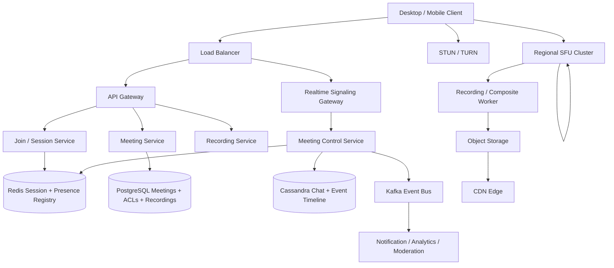
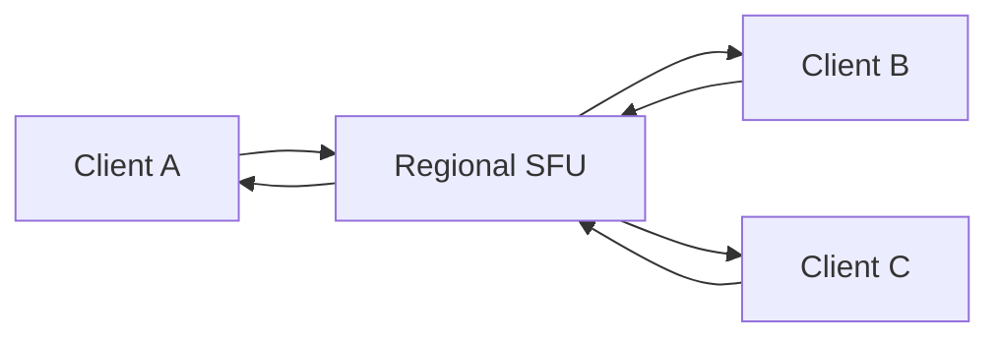
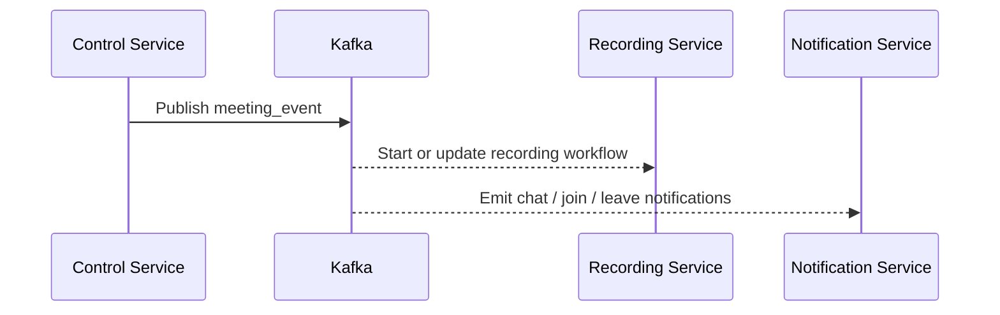
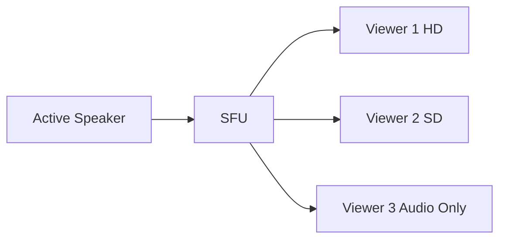
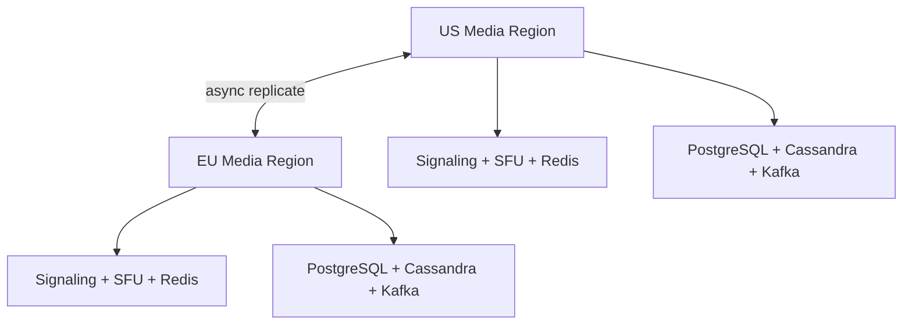

# Design Zoom

Zoom is a classic system design interview problem because it combines a huge read-heavy meeting platform with a latency-critical **real-time media distribution system**. Users expect joining a meeting to feel instant, audio to remain stable, video to adapt to poor networks, chat and hand-raise events to show up quickly, and recordings to be available later without affecting the live meeting.

The surface looks simple: start a meeting, share a link, and talk. The depth lies in signaling, NAT traversal, media transport, SFU-based fanout, adaptive bitrate, participant presence, recording, live chat, and keeping one 1,000-person webinar from overwhelming the rest of the platform.

---

## Functional Requirements

**In Scope:**
- Users can create, schedule, and join meetings
- Meetings support audio, video, screen sharing, and in-meeting chat
- Hosts can mute participants, remove users, and control who can share screen
- Clients can see participant presence, active speaker state, and hand raises
- The system supports cloud recording and playback after the meeting
- Users can reconnect and rejoin an active meeting after transient network failures
- The platform supports webinars or large meetings with asymmetric speaking behavior

**Out of Scope:**
- End-to-end encryption protocol internals
- PSTN dial-in gateway internals
- Enterprise calendar sync and admin policy engines
- AI meeting summaries, translation, and advanced transcription internals
- Whiteboard and collaborative document editing features

---

## Non-Functional Requirements

| Property | Target | Reasoning |
|---|---|---|
| **Audio Latency** | End-to-end p99 < 200ms in-region | Audio quality breaks down quickly once latency becomes conversationally noticeable |
| **Join Latency** | p99 < 2s to enter an active meeting | Joining must feel immediate for scheduled meetings |
| **Signaling Latency** | p99 < 100ms for mute/raise-hand/chat events in-region | Control-plane lag degrades meeting coordination |
| **Availability** | 99.99% for meeting join and media sessions | A meeting product fails visibly and expensively during outages |
| **Durability** | No loss of acknowledged meeting metadata, chat, or finalized recordings | Users expect recordings and meeting state to persist after completion |
| **Consistency** | Strong for meeting ACLs, host actions, and participant membership; eventual for analytics, recording readiness, and search | A slightly delayed recording index is acceptable; split-brain host controls are not |
| **Scale** | Millions of concurrent participants, millions of meetings/day, webinars with 10K+ viewers | The architecture must handle both broad concurrency and hot-meeting skew |

**Key tradeoff:** Zoom prioritizes **low-latency interactive media over perfectly centralized processing of every event**. A participant video thumbnail updating a moment later is acceptable. Audio breakup, duplicate host actions, or failed meeting joins are not.

---

## Capacity Estimation

**Meeting traffic:**
- Assume **50M meetings/day** across work, education, and events
- Peak concurrency may reach **10M active participants** globally across all meetings
- A typical meeting is small, but the system must also handle large town halls and webinars with thousands of viewers

**Media bandwidth:**
- Audio streams are relatively small, often tens of Kbps after compression
- Video streams vary widely; even with aggressive compression and adaptation, one HD stream can be hundreds of Kbps to multiple Mbps
- Media fanout dominates infrastructure cost far more than the control plane

**Signaling traffic:**
- Join, leave, mute, chat, presence, active-speaker, and hand-raise events are frequent but tiny
- Even large meetings usually produce manageable control-plane QPS compared with media forwarding load

**Recordings and artifacts:**
- Cloud recordings, shared-screen composites, and chat exports push long-term storage into PB scale over time
- The platform must keep live media forwarding separate from recording and artifact generation to avoid coupling the two workloads

---

## Core Entities

| Entity | Purpose | Key Fields | Relationships |
|---|---|---|---|
| **User** | Account identity and profile | `user_id`, `email`, `display_name`, `account_tier`, `created_at` | owns meetings and joins participant sessions |
| **Meeting** | Canonical meeting metadata | `meeting_id`, `host_user_id`, `title`, `scheduled_at`, `settings_json`, `status` | has participants, chat, recordings, and ACLs |
| **MeetingParticipant** | Membership and role inside a meeting | `meeting_id`, `user_id`, `role`, `joined_at`, `left_at`, `state` | links a user to one meeting |
| **DeviceSession** | One client device connected to the meeting | `session_id`, `meeting_id`, `user_id`, `device_type`, `network_class`, `last_heartbeat_at` | belongs to one participant or guest identity |
| **MediaTrack** | Logical audio/video/share stream | `track_id`, `session_id`, `track_type`, `codec`, `bitrate_profile`, `created_at` | belongs to one device session |
| **ChatMessage** | In-meeting chat event | `message_id`, `meeting_id`, `sender_session_id`, `scope`, `body`, `created_at` | belongs to one meeting |
| **RecordingJob** | Cloud recording lifecycle | `recording_id`, `meeting_id`, `state`, `object_key`, `created_at` | derived from live media and chat streams |
| **MeetingEvent** | Append-only control-plane event | `event_id`, `meeting_id`, `event_type`, `payload`, `created_at` | used for replay, analytics, and audit |

**Critical modeling decisions:**
- `DeviceSession` is separate from `MeetingParticipant` because one user can join from multiple devices and each device has different network and media behavior.
- `MediaTrack` is logical metadata, not a stored media blob. Live RTP packets stay on specialized media infrastructure, not in a relational database.
- `MeetingEvent` is derived from authoritative control-plane actions and is useful for replay and analytics, but it is not the only source of truth for host permissions or meeting ACLs.

---

## Databases and Database Design

### Storage Tier Decisions

| Data | Access Pattern | Engine | Why |
|---|---|---|---|
| Users, meetings, host settings, participant roles | transactional writes, exact lookups, strong consistency | **PostgreSQL** | meeting ACLs, host controls, and scheduling need ACID guarantees |
| Meeting chat and event timeline | append-heavy writes, meeting-scoped reads | **Cassandra / ScyllaDB** | efficient for high-volume meeting events and chat timelines |
| Active meeting membership, session registry, media routing hints | sub-millisecond reads/writes, TTLs, hot keys | **Redis** | ideal for presence, session mapping, and short-lived room state |
| Recordings, chat exports, thumbnails | immutable blobs, write-once/read-many | **Object Storage + CDN** | scalable and cost-effective for post-meeting artifacts |
| Join, chat, recording, analytics, moderation side effects | durable append-only stream | **Kafka** | decouples control-plane writes from background consumers |

This is intentionally polyglot. Zoom has very different workloads: **transactionally correct meeting metadata**, **high-churn ephemeral session state**, **append-only event history**, and **very large media or recording artifacts**.

### Schema 1 - Meetings (PostgreSQL)

```sql
CREATE TABLE meetings (
  meeting_id           UUID PRIMARY KEY DEFAULT gen_random_uuid(),
  host_user_id         UUID NOT NULL,
  title                TEXT NOT NULL,
  scheduled_at         TIMESTAMPTZ,
  status               VARCHAR(16) NOT NULL DEFAULT 'scheduled',
  settings_json        JSONB NOT NULL DEFAULT '{}'::jsonb,
  created_at           TIMESTAMPTZ DEFAULT NOW()
);

CREATE INDEX idx_meetings_host_scheduled
  ON meetings (host_user_id, scheduled_at DESC);
```

### Schema 2 - Meeting Participants (PostgreSQL)

```sql
CREATE TABLE meeting_participants (
  meeting_id           UUID NOT NULL REFERENCES meetings(meeting_id),
  user_id              UUID NOT NULL,
  role                 VARCHAR(16) NOT NULL,
  state                VARCHAR(16) NOT NULL DEFAULT 'invited',
  joined_at            TIMESTAMPTZ,
  left_at              TIMESTAMPTZ,
  PRIMARY KEY (meeting_id, user_id)
);
```

### Schema 3 - Meeting Chat Timeline (Cassandra)

```sql
CREATE TABLE meeting_chat (
  meeting_id           UUID,
  bucket_hour          TEXT,
  created_at           TIMESTAMP,
  message_id           UUID,
  sender_session_id    UUID,
  scope                TEXT,
  body                 TEXT,
  PRIMARY KEY ((meeting_id, bucket_hour), created_at, message_id)
) WITH CLUSTERING ORDER BY (created_at ASC, message_id ASC);
```

Hourly buckets prevent one long-running or very large meeting from building an unbounded partition.

### Schema 4 - Meeting Event Timeline (Cassandra)

```sql
CREATE TABLE meeting_events (
  meeting_id           UUID,
  bucket_hour          TEXT,
  created_at           TIMESTAMP,
  event_id             UUID,
  event_type           TEXT,
  payload_json         TEXT,
  PRIMARY KEY ((meeting_id, bucket_hour), created_at, event_id)
) WITH CLUSTERING ORDER BY (created_at ASC, event_id ASC);
```

### Schema 5 - Recording Jobs (PostgreSQL)

```sql
CREATE TABLE recording_jobs (
  recording_id         UUID PRIMARY KEY DEFAULT gen_random_uuid(),
  meeting_id           UUID NOT NULL REFERENCES meetings(meeting_id),
  state                VARCHAR(24) NOT NULL,
  object_key           TEXT,
  created_at           TIMESTAMPTZ DEFAULT NOW(),
  updated_at           TIMESTAMPTZ DEFAULT NOW()
);

CREATE INDEX idx_recording_jobs_meeting
  ON recording_jobs (meeting_id, created_at DESC);
```

### Schema 6 - Active Session State (Logical / Redis)

```json
{
  "key": "meeting:session:sess_123",
  "meeting_id": "meet_456",
  "user_id": "user_789",
  "media_node_id": "sfu_22",
  "last_heartbeat_at": "2026-06-03T10:00:00Z",
  "expires_in": 30
}
```

This state changes constantly and expires naturally, which makes it a poor fit for the primary relational store.

### Sharding and Replication Strategy

| Store | Shard Key | Strategy | Replication |
|---|---|---|---|
| Meetings / Participants / Recording Jobs | `meeting_id` | logical hash sharding after single-cluster growth | primary + read replicas |
| Meeting Chat / Events | `(meeting_id, bucket_hour)` | consistent hashing across Cassandra nodes | RF=3, `LOCAL_QUORUM` writes |
| Redis | `meeting_id` or `session_id` | Redis Cluster | 1 replica per master |
| Kafka | `meeting_id` | partitioned durable log preserving per-meeting order | RF=3 |
| Recordings | `meeting_id/recording_id` | object-store namespace | multi-AZ replicated |

**Consistency model:**
- Strong consistency for meeting creation, host permissions, participant roles, and accepted control-plane actions
- Eventual consistency for analytics, recording availability, search indexing, and post-meeting summaries

**Read/write patterns:**
- **Join path:** client joins meeting -> signaling service validates ACLs -> Redis session registry + media node selection -> join acknowledged
- **Media path:** client publishes audio/video/share tracks to the assigned SFU -> subscribers receive selected layers directly from media servers
- **Control path:** mute/chat/hand-raise actions -> durable control-plane write -> Kafka side effects -> realtime fanout

---

## API Design

**Create a meeting:**
```http
POST /v1/meetings
Authorization: Bearer <jwt>

{
  "title": "Weekly Staff Sync",
  "scheduled_at": "2026-06-10T15:00:00Z",
  "waiting_room": true,
  "recording_enabled": true
}

201 Created
{
  "meeting_id": "meet_456",
  "join_url": "https://zoom.example/j/meet_456",
  "status": "scheduled"
}
```

**Join a meeting:**
```http
POST /v1/meetings/meet_456/join
Authorization: Bearer <jwt>

{
  "device_type": "desktop",
  "network_class": "wifi"
}

200 OK
{
  "session_id": "sess_123",
  "signaling_url": "wss://signal.zoom.example/connect",
  "ice_servers": [
    { "urls": ["stun:stun1.zoom.example:3478"] },
    { "urls": ["turn:turn1.zoom.example:3478"], "username": "u", "credential": "p" }
  ],
  "media_region": "us-west-1"
}
```

**Send in-meeting chat message:**
```http
POST /v1/meetings/meet_456/chat
Authorization: Bearer <jwt>
Idempotency-Key: chat-6d7f-001

{
  "scope": "everyone",
  "body": "Please drop questions in chat."
}

201 Created
{
  "message_id": "msg_101",
  "created_at": "2026-06-03T10:01:00Z"
}
```

**Host mutes a participant:**
```http
PATCH /v1/meetings/meet_456/participants/user_789
Authorization: Bearer <jwt>

{
  "audio_muted": true
}

200 OK
{
  "meeting_id": "meet_456",
  "user_id": "user_789",
  "audio_muted": true
}
```

**Start cloud recording:**
```http
POST /v1/meetings/meet_456/recordings
Authorization: Bearer <jwt>

{
  "layout": "active_speaker"
}

202 Accepted
{
  "recording_id": "rec_202",
  "state": "starting"
}
```

**Realtime signaling channel (WebSocket):**
```text
WSS wss://signal.zoom.example/v1/connect?meeting_id=meet_456&session_id=sess_123
Authorization: Bearer <jwt>

Client -> {"type":"join","session_id":"sess_123"}
Client -> {"type":"raise_hand"}
Server -> {"type":"participant_joined","user_id":"user_789"}
Server -> {"type":"mute_applied","user_id":"user_789"}
```
Signaling, chat fanout, and host-control events belong on a persistent realtime channel. Media itself should use WebRTC/RTP to the selected media servers rather than flow through ordinary REST APIs.

---

## High-Level Design



**Component responsibilities:**

| Component | Role |
|---|---|
| **API Gateway** | Auth, routing, rate limiting, and request termination |
| **Meeting Service** | Meeting creation, scheduling, ACL validation, and host settings |
| **Join / Session Service** | Session creation, region selection, SFU assignment, and reconnect handling |
| **Realtime Signaling Gateway** | Holds persistent signaling connections and routes control-plane events |
| **Meeting Control Service** | Applies host actions, chat, presence updates, and participant state changes |
| **Regional SFU Cluster** | Receives media tracks and selectively forwards them to subscribers |
| **STUN / TURN** | NAT traversal and relay fallback for clients with restrictive networks |
| **Recording / Composite Worker** | Subscribes to live media, builds recording layout, and writes artifacts |
| **Redis** | Session registry, meeting membership, presence, speaker hints, and hot control-plane state |
| **Kafka** | Durable side-effect stream for notifications, recording, analytics, and moderation |

**Meeting join and media flow:**
1. Client -> `POST /v1/meetings/{id}/join` -> Join Service validates access and assigns the best media region and SFU
2. Client opens the signaling WebSocket and negotiates ICE/STUN/TURN plus media publishing state
3. Client publishes audio, video, and screen-share tracks to the assigned SFU using WebRTC
4. The SFU forwards selected layers to subscribers based on bandwidth, speaking activity, and layout needs
5. Recording workers and background consumers subscribe asynchronously without blocking the live meeting path

---

## Deep Dives

### 1. WebRTC and SFU: Required and Central

Zoom absolutely needs specialized realtime media infrastructure. Sending every participant's media through ordinary application servers or REST endpoints would fail immediately on latency and bandwidth. The standard production choice is an **SFU (Selective Forwarding Unit)** rather than a pure peer-to-peer mesh or a full MCU in the default path.

In a mesh meeting, each participant would upload one stream to every other participant, which explodes quadratically. In an MCU, the server mixes everything centrally, which simplifies clients but is expensive and adds latency. An SFU forwards selected streams and layers without fully decoding and remixing every video frame in the hot path.



**Why the problem happens:** meetings require many-to-many low-latency media exchange.

**Why it becomes difficult at scale:**
- bandwidth and CPU cost grow quickly with participant count
- heterogeneous networks require adaptive bitrate and layer selection
- restrictive enterprise NATs force TURN relay fallback, increasing infrastructure load

**Production-grade solutions:**
- use WebRTC over UDP when possible with TURN fallback for hard NAT cases
- deploy regional SFU clusters close to users to keep RTT low
- use simulcast or scalable video coding so subscribers can receive the right quality tier
- keep audio prioritized above video because users tolerate blurry video more than broken audio

**Tradeoffs:** SFUs keep latency and cost manageable, but they require sophisticated track selection, congestion control, and regional capacity planning.

### 2. Kafka: Useful, but Not on the Hot Media Path

Kafka is useful in Zoom-like systems, but not for transporting RTP media packets. The live media path must stay as short as possible between clients and SFUs. Kafka is useful for chat persistence, meeting events, recording triggers, moderation workflows, analytics, and post-meeting notifications.



**Why the problem happens:** many control-plane actions have downstream consumers that should not block host or participant actions.

**Why it becomes difficult at scale:**
- large meetings produce a burst of join, leave, chat, and moderation events
- recording, analytics, and notifications have different SLAs
- replay matters for audit and recovery after consumer failures

**Production-grade solutions:**
- keep Kafka on the durable control-plane side, not the RTP forwarding path
- use topics such as `meeting.event`, `meeting.chat`, and `recording.requested`
- publish compact events keyed by `meeting_id` to preserve per-meeting ordering where needed
- prioritize recording and moderation consumers over low-priority analytics when lag grows

**Tradeoffs:** Kafka improves decoupling and recovery for background consumers, but it should never sit between a live speaker and a listener.

### 3. Redis: Session Registry, Presence, and Fast Control-Plane Reads

Redis is required because meeting presence and session routing are ephemeral, high-churn, and latency-sensitive.

| Redis Use | Example Key | Why Redis Fits |
|---|---|---|
| **Session registry** | `session:sess_123` | maps a client session to its current SFU and signaling node |
| **Meeting membership** | `meeting:meet_456:members` | fast lookup for current participants and fanout targets |
| **Presence heartbeat** | `presence:meet_456:user_789` | TTL-driven active-state tracking |
| **Speaker / layout hints** | `meeting:meet_456:active_speaker` | rapidly changing UI signals need low latency |

**Why the problem happens:** meeting state changes constantly while a live call is active.

**Why it becomes difficult at scale:**
- heartbeats and presence writes can outnumber durable control events
- hot meetings create heavily contested room keys
- stale session state must disappear quickly when a client crashes or disconnects

**Production-grade solutions:**
- keep session and presence state in Redis with short TTLs and heartbeat refresh
- separate hot room membership keys from longer-lived meeting metadata
- cache the assigned SFU and signaling node so reconnects are fast
- use sharded room state or replicated fanout helpers for very large meetings

**Tradeoffs:** Redis gives excellent latency for ephemeral state, but it must not become the only source of truth for host permissions or chat durability.

### 4. Fanout, Simulcast, and Large-Meeting Scaling

The media path is fundamentally a fanout problem. One speaker's stream may need to reach dozens or thousands of viewers. But every viewer does not need the same quality or even the same layout at the same time.



**Why the problem happens:** participant bandwidth, device power, and viewport layout all vary widely across a meeting.

**Why it becomes difficult at scale:**
- forwarding every stream at full quality wastes bandwidth and CPU
- webinars and large meetings create asymmetric fanout where few people publish and many only subscribe
- one unstable network participant should not degrade the whole room

**Production-grade solutions:**
- use simulcast or layered codecs so SFUs can forward the right quality tier per subscriber
- forward only visible or active-speaker streams at high quality to each participant
- treat webinars differently from small meetings by restricting who can publish or appear at full resolution
- protect audio first and degrade video aggressively under congestion

**Tradeoffs:** smarter fanout improves quality and cost efficiency, but it adds complexity in layout coordination and subscription management.

### 5. Recording and Cloud Artifacts

Recording looks like a simple toggle in the product, but it is a separate pipeline. The system must subscribe to media, assemble the desired layout, capture chat or captions if needed, encode artifacts, and store them durably for later playback.

**Why the problem happens:** users want post-meeting playback without compromising the live meeting experience.

**Why it becomes difficult at scale:**
- recording composite layouts are CPU-intensive compared with simple media forwarding
- long meetings create huge artifacts and many segment files
- recording readiness can lag behind meeting end because transcoding and packaging continue asynchronously

**Production-grade solutions:**
- keep recording workers off the live SFU forwarding path where possible
- record per-track or per-layout feeds asynchronously and finalize in background jobs
- store recording state in durable job records and emit readiness events when finished
- serve completed artifacts from object storage and CDN rather than the meeting application stack

**Tradeoffs:** asynchronous recording pipelines preserve live-meeting quality, but they introduce delayed availability and more background infrastructure.

### 6. Ordering, Host Controls, and Split-Brain Prevention

Meeting control actions create an ordering problem. The host may mute someone just as that participant unmutes locally. A participant may reconnect while host privileges change. A stale signaling node must not reapply older state after a newer host action has already committed.

**Why the problem happens:** multiple clients and control nodes act on the same meeting state concurrently.

**Why it becomes difficult at scale:**
- control events can race with reconnects and client retries
- very large meetings have multiple signaling or media nodes coordinating the same room
- transient network partitions can leave clients with stale local assumptions about mute or share state

**Production-grade solutions:**
- model host actions and participant state transitions explicitly with monotonic meeting or participant versions
- require authoritative control-plane services to accept or reject state transitions, not individual clients
- fence stale signaling nodes or session leases so older state cannot overwrite newer decisions
- make client retries idempotent for actions like raise-hand or join acknowledgements

**Tradeoffs:** stricter control-plane ordering adds coordination cost, but it avoids the most visible and confusing meeting-state bugs.

### 7. Hot Meetings, Regional Load, and TURN Fallback

Zoom traffic is not uniform. A few giant webinars, company all-hands meetings, classrooms, or public events can dominate load. Enterprise networks also create hotspots by forcing many participants through TURN relay rather than direct UDP paths.

**Why the problem happens:** human collaboration is bursty and often synchronized by calendar or event schedule.

**Why it becomes difficult at scale:**
- giant meetings create concentrated fanout and signaling pressure on one room
- TURN relay traffic is much more expensive than direct peer-to-SFU media flow
- join storms happen minutes before the scheduled start of popular meetings

**Production-grade solutions:**
- shard large meetings across multiple coordinated SFUs and signaling helpers
- pre-warm regional capacity for scheduled high-attendance events
- isolate TURN infrastructure and monitor it independently because its cost and bandwidth profile are different from normal media traffic
- stage participant admission through waiting rooms or webinars where only a few publish actively

**Tradeoffs:** handling hot meetings well requires dedicated large-room logic. Treating them like ordinary small meetings performs badly and wastes resources.

### 8. Multi-Region Deployment and Failover

Zoom is globally distributed, but live media is still regional and latency-sensitive. Participants should join the nearest healthy media region when possible, while meeting metadata and background consumers replicate across regions for resilience.



**Why the problem happens:** interactive audio and video are highly sensitive to RTT, but meetings often span continents.

**Why it becomes difficult at scale:**
- cross-region latency hurts conversational quality quickly
- failover during a live meeting is harder than failover for ordinary stateless web requests
- metadata, session state, and background consumers all replicate at different speeds

**Production-grade solutions:**
- keep participants anchored to the nearest viable media region, with optional cascaded SFUs for multi-region meetings
- replicate control-plane data asynchronously across regions and use explicit fencing during failover
- degrade video quality before sacrificing audio continuity during regional stress
- preserve reconnect tokens and room metadata so clients can rejoin quickly after node or region failures

**Tradeoffs:** global low-latency media requires regional specialization. Fully synchronized active-active media control would be too expensive and too risky for the hot path.

### 9. Architecture Evolution

| Stage | Design | Why It Breaks | Next Step |
|---|---|---|---|
| **1. MVP** | Single-region signaling and simple peer-assisted meetings | participant count and NAT issues break direct connectivity | add STUN/TURN and centralized SFU forwarding |
| **2. Growth** | Regional SFUs plus relational meeting metadata | chat, presence, and recording side effects couple too tightly to core meeting flow | add Redis ephemeral state and Kafka background pipelines |
| **3. Scale** | Separate meeting, signaling, media, recording, and analytics systems | large meetings and TURN-heavy enterprise traffic create hotspots | add large-room sharding, simulcast, and pre-warmed regional capacity |
| **4. Global** | Multi-region media and metadata replicas with async failover | exact global synchronization is too expensive for live media | keep strong consistency only for control-plane decisions and regionalize media aggressively |

This is the interview pattern to emphasize: keep the live media path short, keep control-plane ordering explicit, and move recording, analytics, and other side effects off the hot path.
