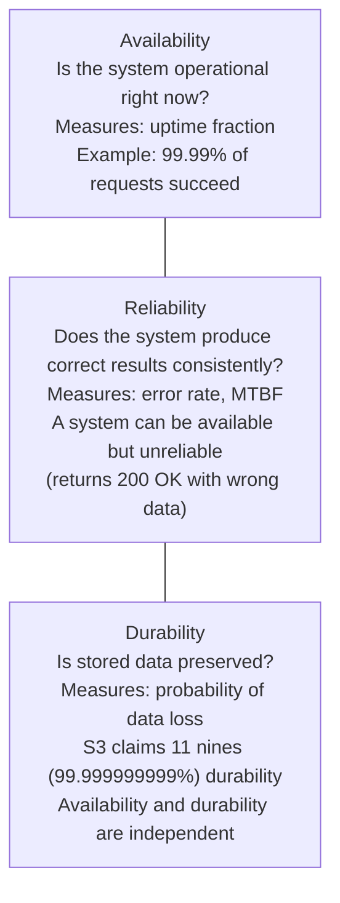
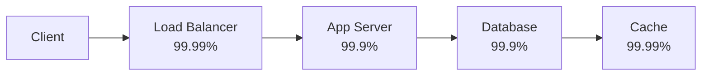
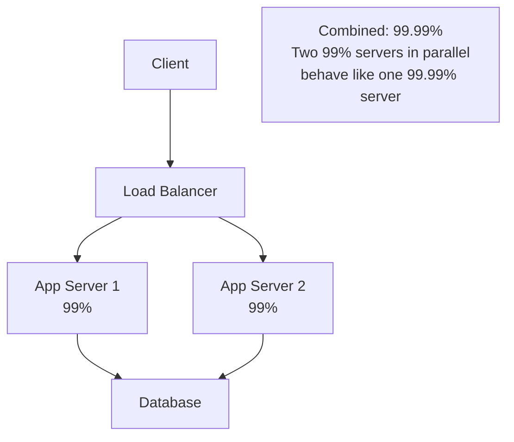
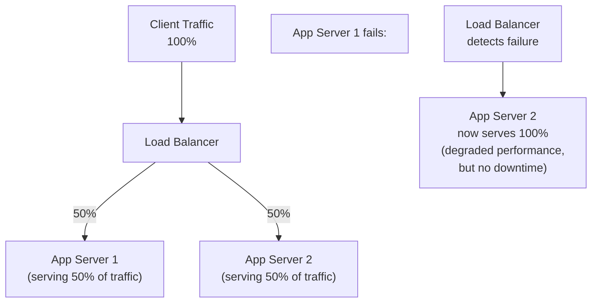
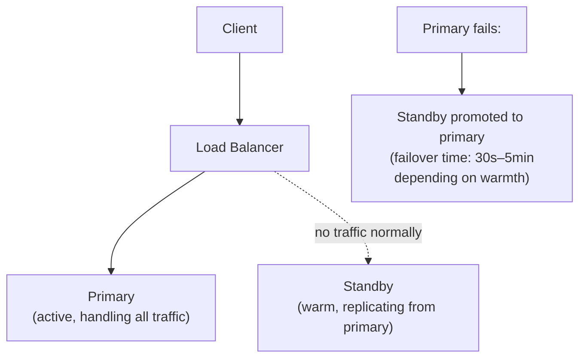
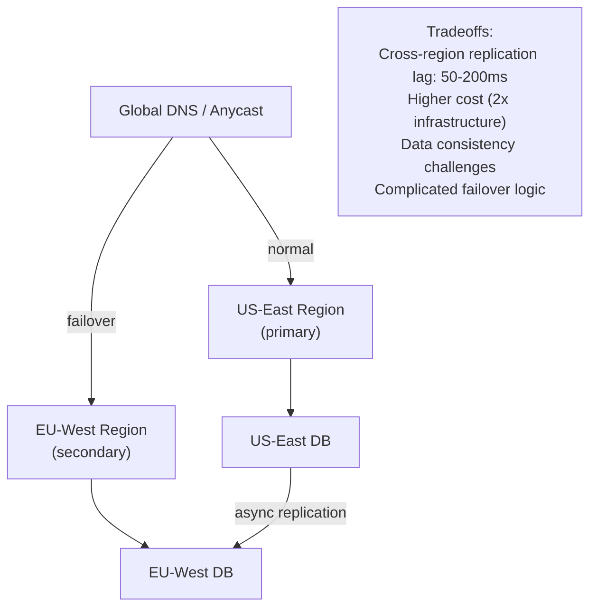
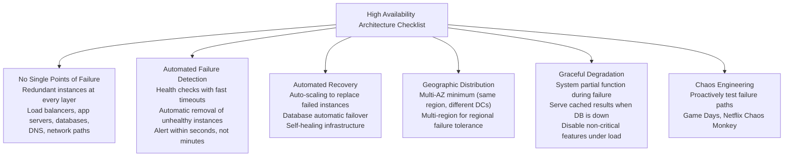

# Availability

Availability is the fraction of time a system is operational and serving requests correctly. It's the most fundamental reliability metric — the number you put in your SLA, the number your customers hold you to, and the number that drives almost every architectural decision in distributed systems. At scale, even a 99% available system fails for 87 hours a year — enough to seriously harm a business.

> **Why this matters in interviews:** "Design a system with high availability" is in nearly every system design problem. You're expected to know what the nines mean, how to calculate composite availability, and what architectural patterns achieve each tier. Interviewers want to hear you reason about availability mathematically, not just say "add redundancy."

---

## The Nines of Availability

Availability is expressed as a percentage, and each additional "nine" represents an order-of-magnitude improvement in reliability:

| Availability | Downtime per Year | Downtime per Month | Downtime per Day | Classification |
|---|---|---|---|---|
| 90% (one nine) | 36.5 days | 73 hours | 2.4 hours | Unacceptable for production |
| 99% (two nines) | 3.65 days | 7.3 hours | 14.4 minutes | Basic production |
| 99.9% (three nines) | 8.76 hours | 43.8 minutes | 1.44 minutes | Standard commercial |
| 99.95% | 4.38 hours | 21.9 minutes | 43.2 seconds | Premium commercial |
| 99.99% (four nines) | 52.6 minutes | 4.38 minutes | 8.64 seconds | High availability |
| 99.999% (five nines) | 5.26 minutes | 26.3 seconds | 864 milliseconds | Carrier-grade / critical |
| 99.9999% (six nines) | 31.5 seconds | 2.63 seconds | 86 milliseconds | Near-perfect |

**Real-world targets:**
- **AWS S3:** 99.99% availability SLA (four nines)
- **AWS EC2:** 99.99% per region
- **Google Cloud Storage:** 99.9% to 99.99% depending on tier
- **Stripe payment API:** 99.99%+ (payment systems are critical-path)
- **Most consumer web services:** 99.9% to 99.95%

**The hard truth about five nines:** 5.26 minutes of downtime per year means your deployment pipeline, database failover, and load balancer cutover must all complete in minutes. Achieving five nines requires extensive automation, redundancy at every layer, and significant operational investment. Most applications don't need it and shouldn't pay for it.

---

## Availability vs. Reliability vs. Durability

These three terms are frequently confused:

**The critical distinction:** 
- A system that returns stale or incorrect data is **available but not reliable**
- A database that's up but lost your last 5 minutes of writes is **available but not durable**
- A system down for maintenance is **unavailable but fully durable**

---

## How to Calculate Composite Availability

When a request passes through multiple components in sequence, availability multiplies:

### Sequential (Series) Components

If **all** components must work for the request to succeed:

$$\text{Availability}_{total} = \prod_{i=1}^{n} \text{Availability}_i$$

$$\text{Availability}_{total} = 0.9999 \times 0.999 \times 0.999 \times 0.9999 \approx 0.9978 = 99.78\%$$

**Key insight:** Each component in the critical path reduces overall availability. A chain of ten 99.9% components gives ~99.0% overall. This is why you can't achieve four nines with many sequential single-instance components.

### Parallel (Redundant) Components

If the request succeeds if **any** replica works:

$$\text{Availability}_{parallel} = 1 - \prod_{i=1}^{n}(1 - \text{Availability}_i)$$

Two 99% available instances in parallel:

$$\text{Availability}_{parallel} = 1 - (1 - 0.99)^2 = 1 - 0.0001 = 99.99\%$$

**This is the core mathematical argument for redundancy:** Adding a parallel replica squares the downtime probability.

---

## Availability Patterns

### Active-Active

All instances handle traffic simultaneously. Failure of one reduces capacity but doesn't cause downtime.

**Best for:** Stateless services, read-heavy systems, APIs. Most web applications run active-active.

**Tradeoff:** Requires session affinity or stateless design; harder to manage stateful systems.

### Active-Passive

One primary instance handles all traffic. A standby takes over on failure.

**Best for:** Stateful systems (databases, message brokers), where maintaining consistency between two active nodes is complex.

**Tradeoff:** Wasted capacity on standby; failover introduces brief downtime.

### Multi-Region

Replicate across geographic regions to survive a complete region failure:

---

## Measuring Availability

### MTTR and MTBF

$$\text{Availability} = \frac{MTBF}{MTBF + MTTR}$$

Where:
- **MTBF** = Mean Time Between Failures (how often things break)
- **MTTR** = Mean Time To Recovery (how fast you fix them)

**Two paths to high availability:**
1. **Increase MTBF** — make individual components more reliable (hardware, better code)
2. **Decrease MTTR** — detect and recover faster (monitoring, automation, runbooks)

MTTR is often the more actionable lever. Going from a 2-hour manual recovery to a 5-minute automated failover increases availability by the same amount as making the system 20x more reliable.

### Error Budget

From the SLO/SLA framework:

$$\text{Error Budget} = 1 - \text{SLO target}$$

If SLO is 99.9%: Error budget = 0.1% = **43.8 minutes/month**

This budget is "spent" by:
- Planned maintenance (deployments, upgrades)
- Unplanned outages (bugs, hardware failures)
- Degraded states (slow responses that miss latency SLOs)

When the error budget is exhausted, freeze feature deployments and focus on reliability work.

---

## Designing for High Availability: The Checklist

---

## Availability Pitfalls

**The correlated failure problem:** Two instances of the same application in the same data center fail together if the data center loses power. Availability calculations assume independent failures. In practice, shared infrastructure creates correlation.

**The dependency trap:** A service with 99.99% availability that depends on a 99.9% external service has at best 99.9% end-to-end availability. Your SLA cannot exceed the weakest dependency's SLA.

**The "always-on" deployment trap:** Deployments cause downtime if they involve restarting all instances simultaneously. Rolling deployments, blue-green, and canary deployments maintain availability during releases.

---

## Interview Talking Points

**1. What does "three nines" availability mean and how would you achieve it?**
> "99.9% availability means 8.76 hours of allowed downtime per year — about 43 minutes per month. To achieve it, I'd ensure no single point of failure in the critical path: multiple application server instances behind a load balancer, database high availability (primary + replica with automatic failover), multi-AZ deployment so a single data center failure doesn't take down the service. Health checks with timeouts under 30 seconds ensure rapid detection and automatic instance replacement. Three nines is achievable with standard redundancy patterns. Four nines (52 minutes/year) requires more aggressive automation: automated failover completing in seconds, circuit breakers to prevent cascading failures, and chaos engineering to validate recovery paths."

**2. How does composite availability work when components are in series vs. parallel?**
> "In series, availability multiplies — a request through five components each at 99.9% gives 0.999^5 = 99.5% overall. Each hop in the call chain erodes availability. This is why microservice architectures have to be very careful about adding new synchronous dependencies. In parallel, the math flips — the probability of all replicas being down simultaneously is the product of individual failure probabilities. Two 99% available servers in parallel give 1 - (0.01)^2 = 99.99%. This is the mathematical justification for redundancy: adding a second replica squares your downtime probability. For critical services, multi-region active-active gives 1 - (0.001)^2 = 99.9999% — six nines — from two three-nines regions."

**3. What's the difference between availability and reliability?**
> "Availability measures whether the system is up and responding, regardless of whether responses are correct. Reliability measures whether the system produces correct results consistently. A service that returns HTTP 200 with stale data is available but unreliable. A database that accepts writes but silently discards them is available but not durable. In system design, I track both: availability via uptime/error-rate SLOs, and reliability via correctness checks and data consistency validation. Most availability literature focuses on uptime, but for many systems — financial, medical, e-commerce — incorrect-but-available responses are worse than unavailable responses."

**4. What is an error budget and how does it inform engineering decisions?**
> "An error budget is the allowed failure margin derived from an SLO. For a 99.9% SLO, the error budget is 0.1% of time — about 43 minutes per month. It's shared between planned downtime (deployments, maintenance) and unplanned outages. The error budget creates a data-driven conversation between product and engineering: if you've used 80% of your budget, you should freeze risky feature deployments and focus on reliability improvements. If you've used almost none, you can take more risk with new features. Google's SRE book introduced this concept to prevent both over-engineering (spending enormous effort chasing six nines when the SLO is three nines) and under-engineering (deploying recklessly until you hit your SLA penalties)."

---

## Key Takeaways

- **99.9% (three nines)** = 8.76 hours downtime/year; **99.99% (four nines)** = 52.6 minutes — each nine requires an order-of-magnitude reliability improvement
- **Series availability multiplies** (each component degrades the chain); **parallel availability improves** (redundancy squares the downtime probability)
- **MTTR is often more actionable** than MTBF — automated failover in seconds beats hoping hardware doesn't fail
- **Availability ≠ Reliability ≠ Durability** — a system can be up (available) while returning wrong data (unreliable) or losing writes (not durable)
- **Error budgets** make reliability a product decision: balance feature velocity with the allowed failure margin
- **Correlated failures** break the independence assumption — two instances in the same rack fail together; distribute across AZs and regions
- The architecture question: **no SLO can exceed the weakest dependency's availability**
