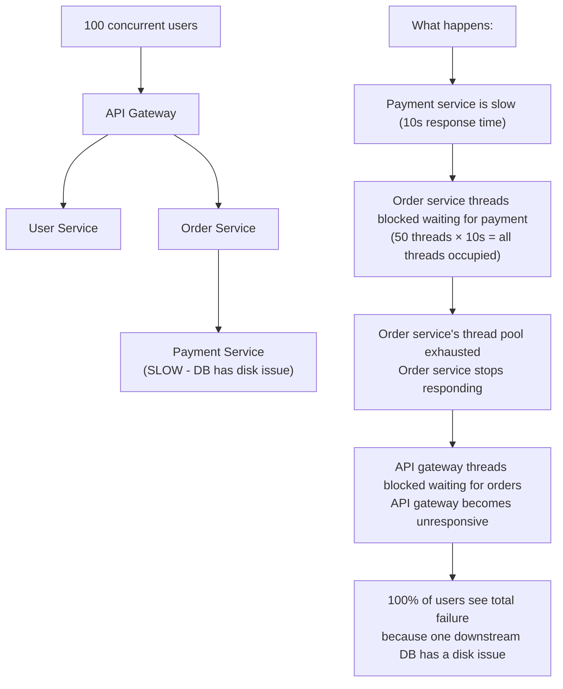
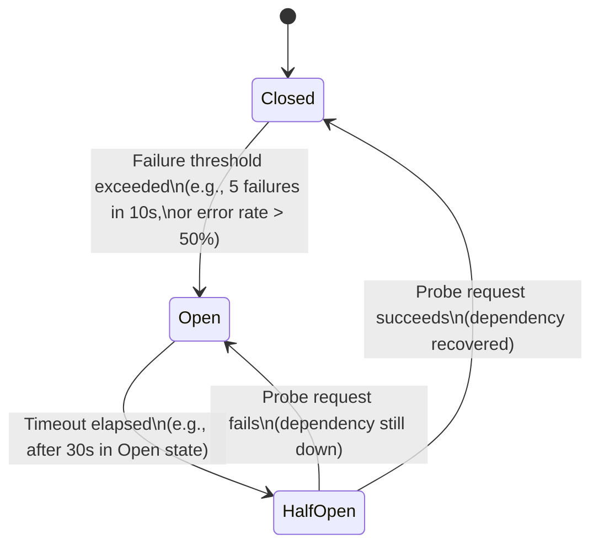
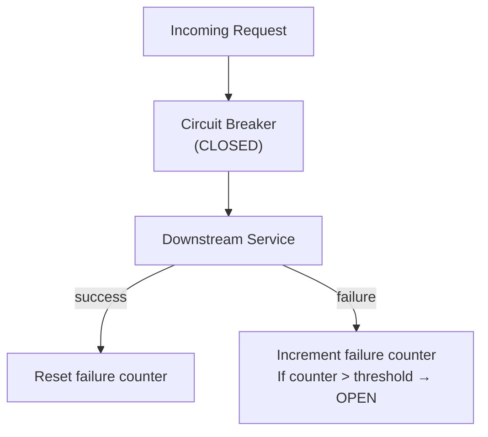
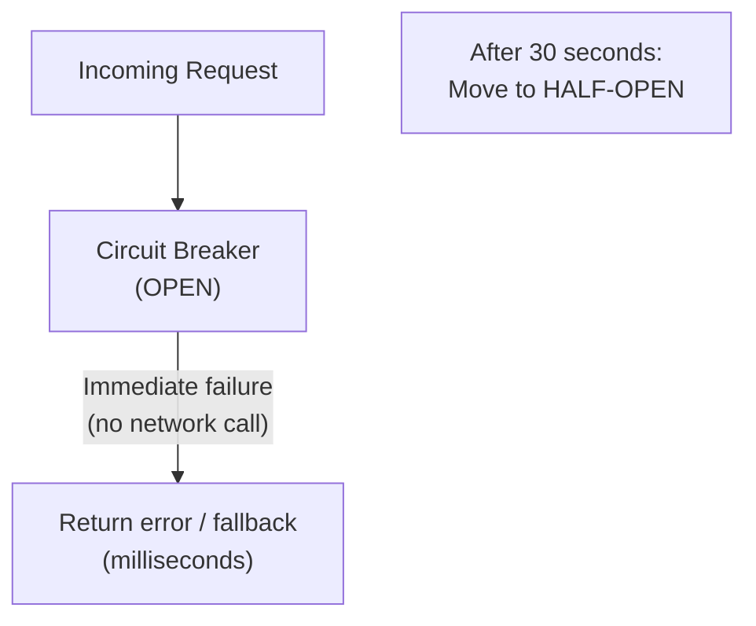
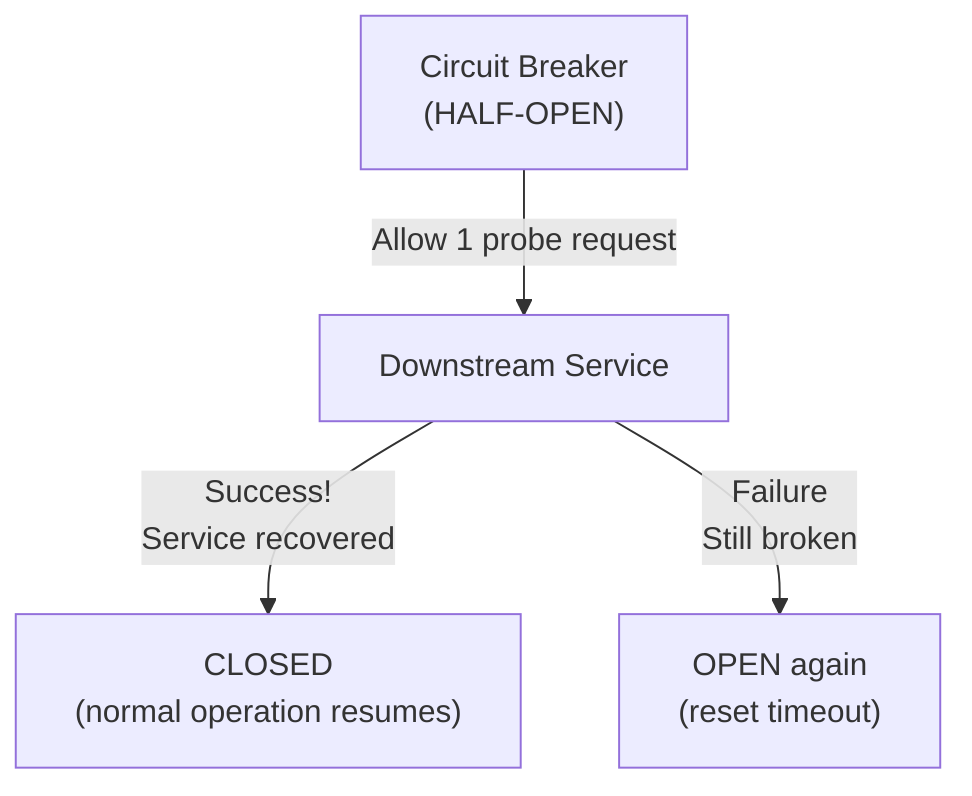
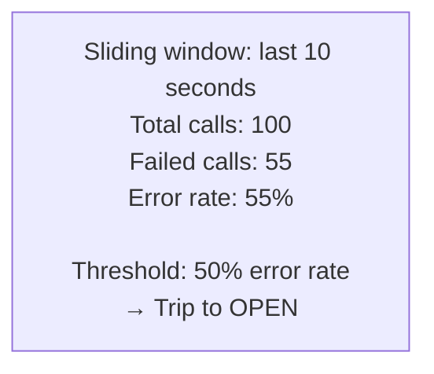
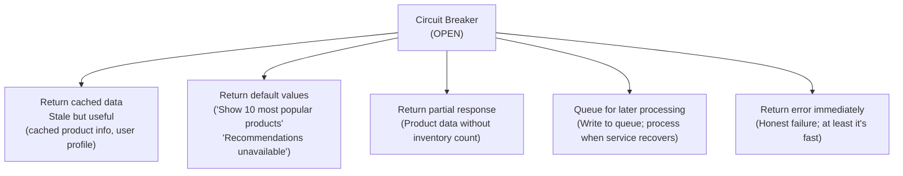
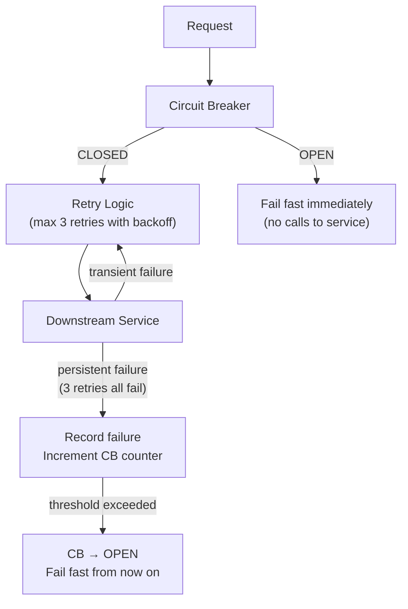
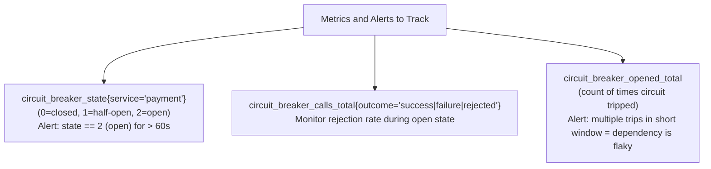

# Circuit Breaker

The circuit breaker pattern stops a service from repeatedly calling a downstream dependency that is failing, giving it time to recover while preventing the caller from being overwhelmed by timeouts. Named after the electrical circuit breaker that trips when current overloads a circuit, the software pattern similarly "trips" when a failure threshold is exceeded — automatically preventing further calls until the dependency shows signs of recovery.

> **Why this matters in interviews:** Circuit breakers are the primary mechanism for preventing **cascading failures** in distributed systems — where one service going down brings down everything that depends on it. Every microservice design question benefits from mentioning circuit breakers. Interviewers want to hear you describe the three states, the failure threshold, and the half-open probe mechanism.

---

## The Cascading Failure Problem

Without circuit breakers, a single downstream failure can propagate through the entire system:



**The circuit breaker solution:** Instead of letting threads pile up waiting for the failing service, the circuit breaker trips and immediately returns an error (or cached fallback) — in milliseconds, not seconds. The thread pool doesn't exhaust; other services continue functioning.

---

## The Three States



### Closed State (Normal Operation)

Requests pass through normally. The circuit breaker counts failures.



### Open State (Failing Fast)

All requests are immediately rejected without calling the dependency. The breaker waits for a timeout before testing recovery.



**Why "failing fast" is good:** In OPEN state, threads are freed immediately instead of blocking for N-second timeouts. The system is protected even while the dependency is broken.

### Half-Open State (Testing Recovery)

Allow a limited number of probe requests through. If they succeed, close the circuit. If they fail, re-open.



---

## Failure Detection: Count-Based vs. Rate-Based

### Count-Based (Simple)
Trip after N consecutive failures:

```python
# Trip open after 5 consecutive failures
if consecutive_failures >= 5:
    state = "OPEN"
```

**Problem:** A single slow second (5 timeouts in a burst) trips the breaker even if overall error rate is low.

### Rate-Based (Sliding Window)



Trip when error rate exceeds a threshold over a time window:

```python
# Trip if error rate > 50% in the last 10 seconds,
# with a minimum request volume of 10 (avoid tripping on 1/2 failures)
if total_requests >= 10 and (failed / total_requests) > 0.5:
    state = "OPEN"
```

Rate-based is more sophisticated and preferred in production. Netflix Hystrix uses this approach.

---

## Fallback Strategies

When the circuit is open, what do you return? The best circuit breakers return useful fallbacks:



**Graceful degradation via circuit breaker:** The circuit breaker is the mechanical component; the fallback is the product decision of what degraded experience to provide. Together, they implement graceful degradation automatically.

---

## Implementation

### Resilience4j (Java / Spring Boot)

The modern replacement for Netflix Hystrix:

```java
CircuitBreakerConfig config = CircuitBreakerConfig.custom()
    .failureRateThreshold(50)           // Trip if >50% of calls fail
    .waitDurationInOpenState(Duration.ofSeconds(30)) // Stay open 30s
    .slidingWindowSize(10)              // Count over last 10 calls
    .minimumNumberOfCalls(5)            // Need at least 5 calls to compute rate
    .permittedNumberOfCallsInHalfOpenState(2) // Allow 2 probes in half-open
    .build();

CircuitBreaker circuitBreaker = CircuitBreaker.of("paymentService", config);

// Wrap calls with circuit breaker
Supplier<PaymentResult> decorated = CircuitBreaker
    .decorateSupplier(circuitBreaker, () -> paymentService.charge(amount));

// Try with fallback
Try<PaymentResult> result = Try.ofSupplier(decorated)
    .recover(CallNotPermittedException.class, ex -> 
        PaymentResult.queued("Payment queued for retry"));  // Fallback
```

### Python (with pybreaker)

```python
import pybreaker

# Configure: open after 5 failures, reset after 60s
payment_breaker = pybreaker.CircuitBreaker(fail_max=5, reset_timeout=60)

@payment_breaker
def charge_payment(amount: float, card_token: str) -> dict:
    return payment_gateway.charge(amount, card_token)

def process_order(order):
    try:
        return charge_payment(order.amount, order.card_token)
    except pybreaker.CircuitBreakerError:
        # Circuit is open — return fallback immediately
        queue_for_retry(order)
        return {"status": "queued", "message": "Payment will be processed shortly"}
```

### Redis-Backed Distributed Circuit Breaker

In a multi-instance deployment, each instance tracks failures independently — which means the circuit never trips on any single instance even if the aggregate failure rate is high. Use Redis for shared state:

```python
import redis
import time

r = redis.Redis()

def is_open(service_name: str, threshold: int = 5, window: int = 60) -> bool:
    key = f"cb:failures:{service_name}"
    failures = int(r.get(key) or 0)
    return failures >= threshold

def record_failure(service_name: str, window: int = 60):
    key = f"cb:failures:{service_name}"
    pipe = r.pipeline()
    pipe.incr(key)
    pipe.expire(key, window)
    pipe.execute()

def record_success(service_name: str):
    r.delete(f"cb:failures:{service_name}")

def call_with_circuit_breaker(service_name: str, fn):
    if is_open(service_name):
        raise CircuitOpenError(f"{service_name} circuit is open")
    try:
        result = fn()
        record_success(service_name)
        return result
    except Exception as e:
        record_failure(service_name)
        raise
```

---

## Circuit Breaker vs. Retry

These two patterns are complementary and often confused:

| Aspect | Circuit Breaker | Retry |
|---|---|---|
| **Purpose** | Prevent calls to a failing service | Recover from transient failures |
| **When to use** | Service is consistently failing | Failures are occasional / transient |
| **Effect** | Stops all calls (fast fail) | Repeats the call (more load on service) |
| **Risk** | May stop calls when service is recovering | Can amplify load on an already-struggling service |

**Together:** Wrap retries inside a circuit breaker. Retries handle transient blips (1–2 failures). Circuit breaker handles persistent failures (many retries all failing → trip the breaker).



---

## Monitoring Circuit Breaker State

Circuit breaker state changes are important operational signals:



When a circuit breaker trips in production: it's a signal that a downstream service is unhealthy. The circuit breaker buys time; your monitoring should alert you to fix the root cause.

---

## Interview Talking Points

**1. What is a circuit breaker and what problem does it solve?**
> "A circuit breaker is a reliability pattern that stops a service from continuously calling a failing downstream dependency, preventing cascading failures. Without it, if payment service is slow (10s timeout per call), my order service threads pile up waiting for payment responses, exhaust the thread pool, and crash — a single slow downstream causes total failure. With a circuit breaker: after 5 payment failures, the breaker trips to OPEN state. All subsequent payment calls return immediately with an error or fallback, in milliseconds. My thread pool never exhausts. Other functionality (user lookup, inventory check) continues working. After 30 seconds, the breaker moves to HALF-OPEN and sends a probe request. If payment recovers, it closes; if still failing, re-opens."

**2. Describe the three states of a circuit breaker.**
> "CLOSED is normal operation — requests pass through, the breaker counts failures silently. Once failures exceed a threshold (e.g., 5 consecutive or 50% error rate over 10 seconds), it transitions to OPEN. In OPEN state, all requests fail immediately without reaching the downstream service — fail fast, no timeouts, threads are free. After a configured wait (e.g., 30 seconds), the breaker moves to HALF-OPEN and allows one probe request through. If the probe succeeds, the service has recovered — close the circuit and resume normal operations. If the probe fails, the service is still down — re-open and wait another 30 seconds. This probe cycle continues until recovery is confirmed."

**3. What should you return when the circuit breaker is open?**
> "It depends on the feature's criticality. For user-facing features with optional dependencies: return cached data (a recommendation engine returning the last cached recommendations is better than an error page). For non-critical features: return a safe default (show 'Check store availability' instead of real inventory, or 'Recommendations unavailable'). For write operations: queue the request for later processing and return '202 Accepted' to the client. For critical path operations (like authentication): return an honest error immediately — it's worse to let users into the system with unverified identity than to show a login error. The fallback is a product decision, not a technical one; circuit breakers make that decision explicit and automated."

**4. What is the difference between a circuit breaker and a retry?**
> "Retries handle transient failures — brief network glitches, momentary overloads. They make sense when the probability of success on the next attempt is high. Circuit breakers handle persistent failures — when a service is consistently down. Retries on a consistently-failing service make things worse: more calls to an overloaded service, more timeouts, more threads blocked waiting. The right pattern is to nest retries inside a circuit breaker: retries handle the occasional transient failure, and the circuit breaker tracks cumulative failures across retries. If the retry count triggers circuit breaker failures multiple times quickly, the breaker trips open and stops all calls — protecting both the caller and the struggling downstream service from a retry storm."

---

## Key Takeaways

- **Cascading failures** happen when one slow service exhausts the thread pool of its caller, propagating failure upward — circuit breakers stop this
- **Three states:** CLOSED (normal), OPEN (fail fast), HALF-OPEN (probe recovery)
- **In OPEN state**, the circuit breaker returns immediately (milliseconds) instead of waiting for timeouts — threads are freed, other functionality continues
- **Rate-based failure detection** (error rate over sliding window) is more robust than count-based (N consecutive failures)
- **Fallbacks** are the product decision: cached data, defaults, queued writes, or honest errors — circuit breakers make fallbacks automatic
- **Use Resilience4j** (Java), pybreaker (Python), or service mesh (Envoy, Istio) for production implementations
- **Combine with retries:** retries handle transient failures; circuit breakers handle persistent failures
- **Monitor state transitions:** a circuit tripping is a production signal — alert on it, investigate the root cause
