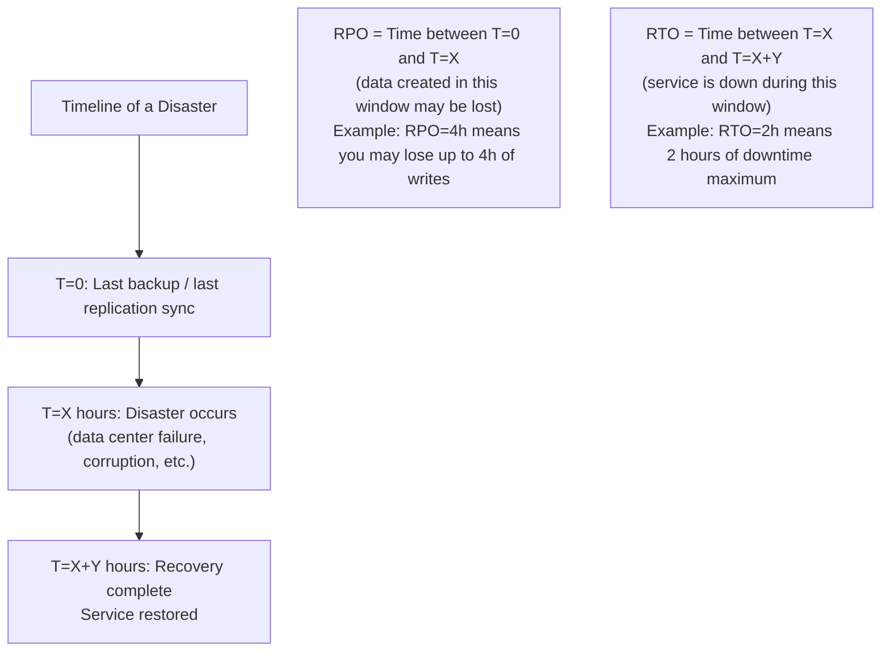
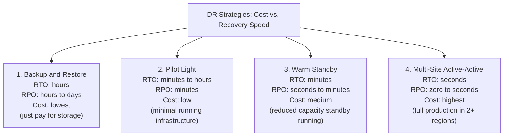
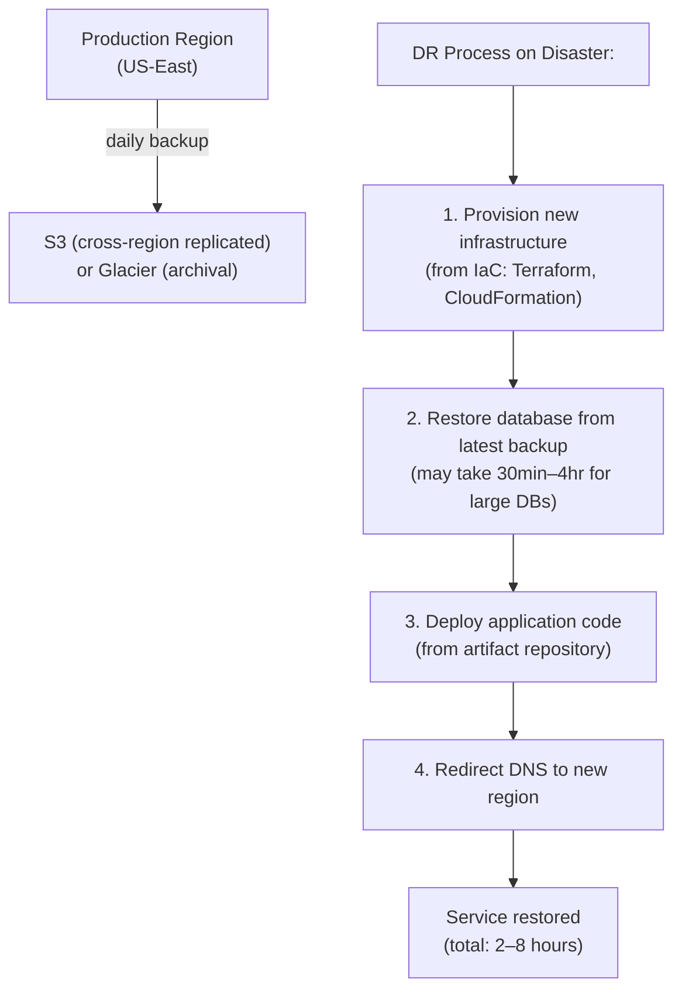
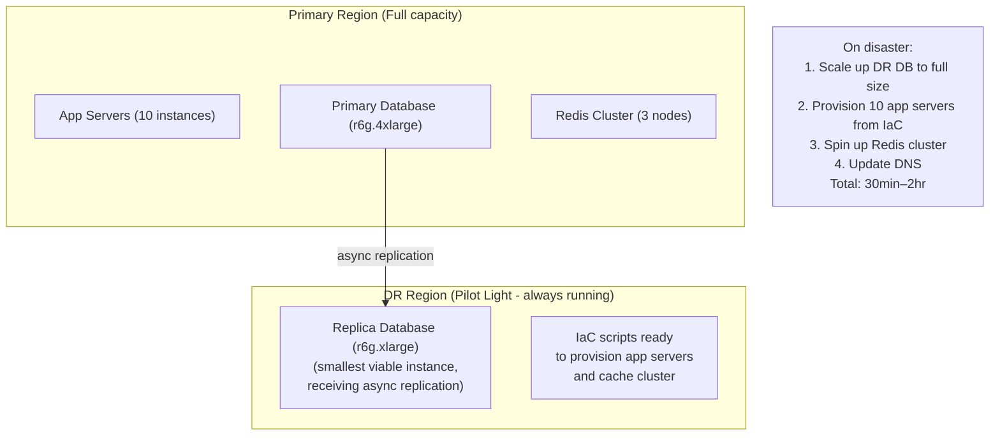
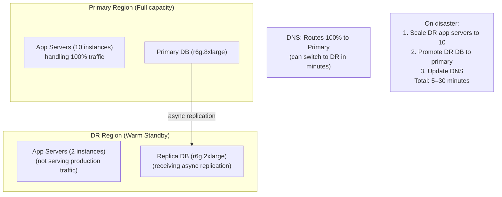
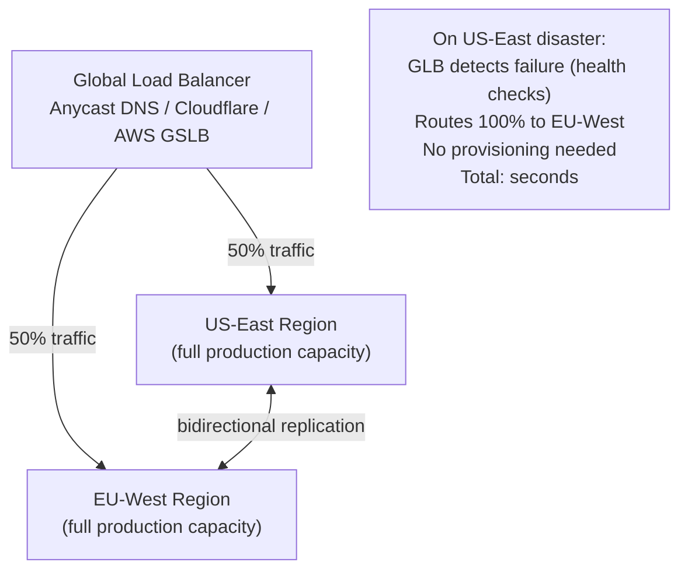
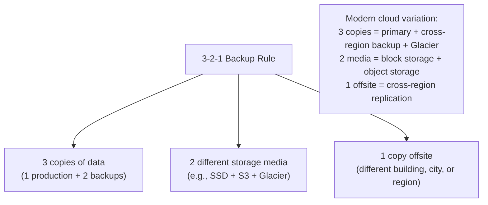
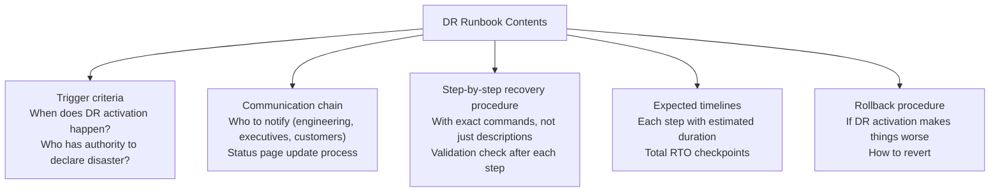

# Disaster Recovery

Disaster Recovery (DR) is the set of policies, tools, and procedures that enable a system to recover from a catastrophic event — not just a single node failure, but a complete data center loss, a widespread data corruption event, or a major cloud provider outage. While high availability handles routine failures (a server crashing), disaster recovery handles scenarios that take down everything in a region or destroy data entirely. The difference: HA keeps you running through everyday failures; DR is what you do when your primary region is on fire.

> **Why this matters in interviews:** "What happens if the entire data center goes down?" or "What's your recovery strategy for data corruption?" tests DR knowledge. Interviewers want to hear two specific metrics — RTO and RPO — and a concrete strategy that achieves them. Every serious system design needs a DR answer.

---

## The Two Core DR Metrics

### RTO: Recovery Time Objective

**How long can you be down?** The maximum acceptable time between a disaster and full restoration of service.

### RPO: Recovery Point Objective

**How much data loss can you accept?** The maximum acceptable time between the last good data backup and the disaster event.

**Real-world RTO/RPO targets:**

| Application Type | Typical RTO | Typical RPO |
|---|---|---|
| E-commerce checkout | < 15 minutes | < 1 minute |
| Financial trading | < 5 seconds | Zero (synchronous) |
| Internal CRM | < 4 hours | < 1 hour |
| Email / ticketing | < 8 hours | < 4 hours |
| Archival / compliance | < 24 hours | < 24 hours |
| Dev/test environments | Best effort | Best effort |

**The cost-recovery tradeoff:** Lower RTO and RPO require more infrastructure (hot standbys, sync replication, multi-region) and more cost. The right targets depend on the cost of downtime to the business.

---

## DR Strategies: The Spectrum

AWS (and other cloud providers) describe four DR strategies on a spectrum from cheapest/slowest to most expensive/fastest:

### Strategy 1: Backup and Restore

**The simplest and cheapest DR strategy.** Back up data regularly; on disaster, provision new infrastructure, restore from backup.

**Best for:** Non-critical applications, development environments, archival data, any workload where hours of downtime are acceptable.

**Key practices:**
- Store backups in a separate region (cross-region S3 replication, or manual copy)
- Test restores regularly — a backup you've never tested is a backup you don't trust
- Use Infrastructure as Code (Terraform, CDK) to provision replacement infrastructure quickly
- Automate the restore process with a tested runbook

### Strategy 2: Pilot Light

A minimal "skeleton" of the critical infrastructure is always running in the DR region. On disaster, scale it up to full capacity.

**Best for:** Workloads with RTO of 30 minutes to 2 hours. Significantly cheaper than warm standby because you're not running compute — just the replicated data layer.

### Strategy 3: Warm Standby

A scaled-down but fully functional version of the production system runs continuously in the DR region. On disaster, scale up to handle production traffic.

**Best for:** Workloads with RTO of 5–30 minutes. Higher cost than pilot light (you're paying for some running compute 24/7) but dramatically faster recovery.

### Strategy 4: Multi-Site Active-Active

Both regions serve production traffic simultaneously. Disaster recovery is just traffic rerouting — no provisioning or restoration needed.

**Best for:** Critical workloads where RTO must be seconds and RPO near zero. Global services. Financial systems.

**Challenges:** Data consistency across regions (replication lag means reads may be stale), conflict resolution for concurrent writes, data residency requirements (EU data may not be allowed to go to US), significantly higher cost and operational complexity.

---

## Recovery Point Options: Backup Types

How frequently you back up determines your RPO:

| Backup Type | Typical Frequency | RPO | Implementation |
|---|---|---|---|
| **Full backup** | Daily or weekly | 1 day to 1 week | `pg_dump`, `mysqldump`, snapshot |
| **Incremental backup** | Hourly | 1 hour | WAL archiving (PostgreSQL), binlog (MySQL) |
| **Continuous replication** | Real-time (sub-second lag) | Seconds | Streaming replication, CDC |
| **Synchronous replication** | Every write | Zero | Sync standby, distributed consensus |

**Point-in-Time Recovery (PITR):** Archive WAL (Write-Ahead Log) segments continuously. Can restore to any point in time, not just backup timestamps. Used by: PostgreSQL WAL archiving, AWS RDS automated backups.

---

## The 3-2-1 Backup Rule

A classic best practice for data durability:

---

## DR Runbooks and Testing

**A DR plan that isn't tested is a disaster waiting to happen.** The most common DR failure is discovering during a real disaster that the runbook is wrong, the restore takes 3x longer than expected, or the backup is corrupted.

### DR Runbook Elements

### Testing Frequency

| Test Type | Frequency | What It Tests |
|---|---|---|
| **Backup restore test** | Monthly | Can we restore from backup? How long does it take? |
| **Failover drill** | Quarterly | Full activation of DR procedures; measure actual RTO |
| **Chaos / Game Day** | Monthly | Inject failures; validate auto-recovery |
| **Tabletop exercise** | Semi-annually | Discuss scenarios; validate runbook completeness |

**The only way to know your RTO is to measure it.** Run DR drills under realistic conditions. Time each step. Identify gaps between planned and actual recovery time.

---

## Real-World DR Examples

**AWS Outage (us-east-1, December 2021):** Multiple major services failed. Companies with multi-region active-active (Netflix, Cloudflare) continued operating. Companies with warm standby recovered in minutes to hours. Companies with backup-and-restore were down for hours.

**GitLab Database Incident (January 2017):** A database admin accidentally deleted the production database (`rm -rf` on the wrong host). Backups existed but: (1) last working backup was 18 hours old, (2) restore procedure was untested and took 18 hours to complete, (3) data loss of ~6 hours of database activity. Lesson: test restores, automate restore procedures, use WAL archiving for point-in-time recovery.

**GitHub Incident (October 2018):** A network equipment replacement caused a 43-second network partition. MySQL primary failed over before the partition healed. When the partition ended, two primaries had accepted writes. Data in the diverged writes had to be manually reconciled. 24-hour degraded service. Lesson: test failover under network partition conditions, not just clean failures.

---

## Interview Talking Points

**1. What is RTO and RPO and how do they drive DR design?**
> "RTO (Recovery Time Objective) is the maximum acceptable time from disaster to service restoration — how long can you be down? RPO (Recovery Point Objective) is the maximum acceptable data loss measured in time — how much data created after the last safe point can you afford to lose? They drive design in opposite directions from cost: zero RPO requires synchronous replication (expensive, adds write latency); zero RTO requires active-active multi-region (very expensive, complex). The practical design process: start with business requirements — what's the revenue impact of 1 hour down? 4 hours? What data, if lost, causes regulatory or financial problems? Then pick the DR strategy whose RTO/RPO meets those requirements at the lowest cost."

**2. Walk me through the four DR strategies.**
> "The four strategies on a cost-recovery spectrum: Backup and Restore — cheapest, slowest; just back up data and restore on disaster (RTO: hours). Pilot Light — the data layer (database replica) runs continuously in the DR region; compute is provisioned from IaC on activation (RTO: 30min–2hr). Warm Standby — a reduced-capacity but fully functional version runs in DR region; scale up on activation (RTO: 5–30min). Multi-Site Active-Active — both regions serve production traffic; disaster is just traffic rerouting with no provisioning (RTO: seconds). Moving up the spectrum roughly doubles cost at each step. Most businesses land at Pilot Light or Warm Standby — Active-Active is reserved for the most critical services where seconds of downtime is unacceptable."

**3. What does a DR drill look like and how often should you run one?**
> "A DR drill is a scheduled exercise where you actually execute your DR procedures to validate they work and measure how long they take. For a warm standby DR: disable traffic to the primary region, activate DR procedures (scale up DR capacity, promote replica to primary, update DNS), measure time to service restoration, validate data integrity, then revert (or leave in DR if convenient). Drills should be quarterly at minimum — monthly is better for critical services. Each drill should produce a report: actual RTO vs. target, steps that failed or took longer than expected, runbook updates needed. The GitLab and GitHub incidents both involved untested recovery procedures that failed or took much longer than expected. If you don't regularly drill, your runbook is fiction."

**4. How does replication lag affect RPO?**
> "With asynchronous replication, the replica is always some amount of time behind the primary — this is replication lag. If the primary fails, any writes that reached the primary but hadn't yet replicated are lost. That lag duration is your effective RPO. Under normal conditions, async replication lag in the same region is typically milliseconds. Under heavy write load or cross-region replication, lag can grow to seconds or minutes. To minimize RPO: (1) Monitor replication lag continuously and alert if it exceeds threshold. (2) Use semi-synchronous replication — primary waits for at least one replica to confirm before acknowledging write. (3) For zero RPO, use synchronous replication — primary only acks after all designated replicas confirm. But synchronous adds write latency equal to the round-trip to the replica, so it's expensive for cross-region."

---

## Key Takeaways

- **RTO** = max acceptable downtime; **RPO** = max acceptable data loss — both measured in time, both drive architecture
- **Four DR strategies** from cheap/slow to expensive/fast: Backup+Restore → Pilot Light → Warm Standby → Active-Active
- **Backup+Restore** (hours RTO) is sufficient for non-critical workloads; **Active-Active** (seconds RTO) is for critical services
- **3-2-1 rule:** 3 copies, 2 media types, 1 offsite — the baseline for data durability
- **Test your DR:** An untested runbook is fiction — run quarterly drills, measure actual RTO, update procedures
- **Replication lag determines RPO** for async replication — monitor lag continuously, alert on thresholds
- **Infrastructure as Code** (Terraform, CDK) dramatically reduces provisioning time for Pilot Light and Warm Standby strategies
- The GitLab incident: always test restores; always have PITR (point-in-time recovery) beyond just full backups
