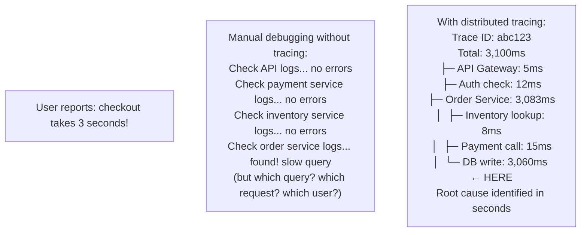
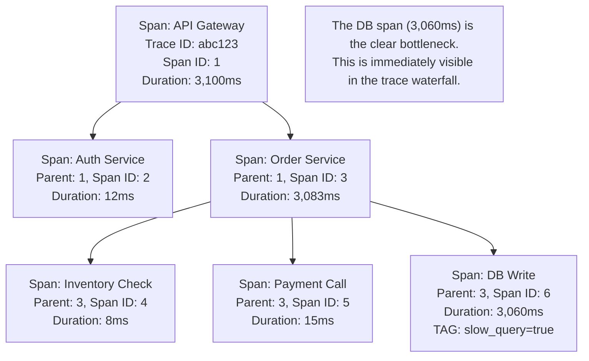
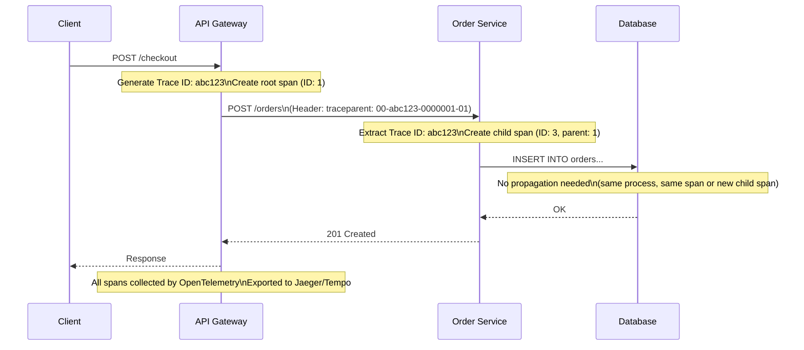
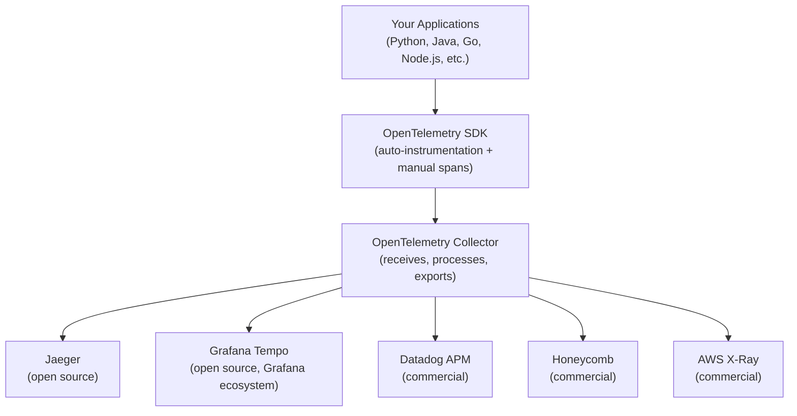
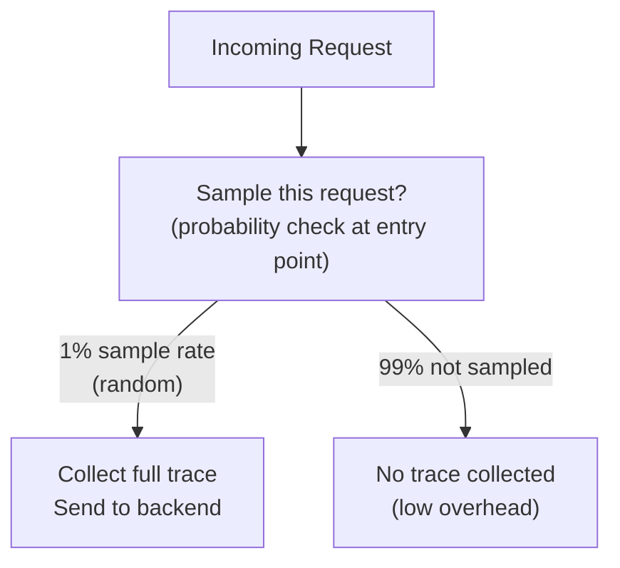
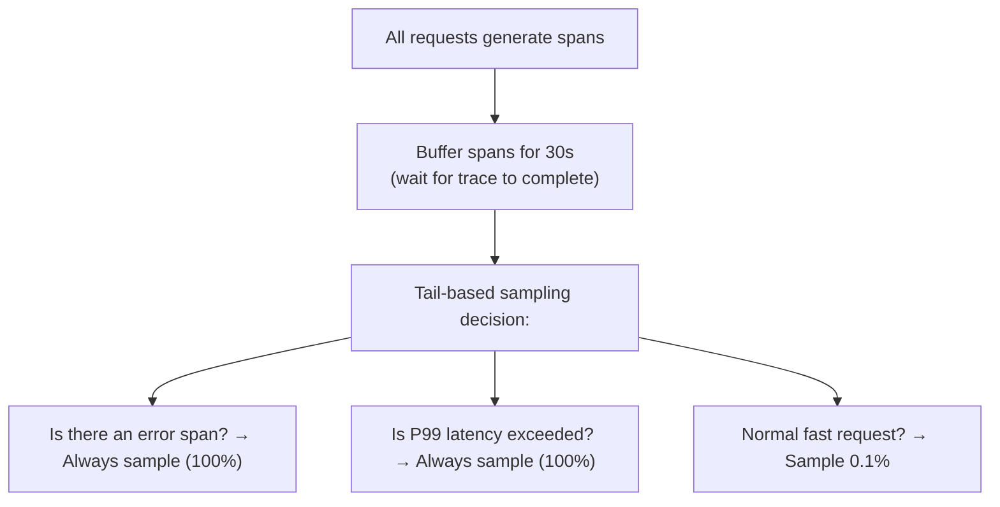

# Distributed Tracing

Distributed tracing is the technique of tracking a single request as it flows through multiple services in a distributed system — capturing the timeline, latency, and relationships of every operation from the initial HTTP request to the final response. In a monolith, you can follow a request with a debugger or stack traces. In a microservice architecture with dozens of services, a single user request might touch 10+ services; distributed tracing is the only way to see the end-to-end journey and diagnose where latency or failures are occurring.

> **Why this matters in interviews:** Tracing is the third pillar of observability after metrics and logs. When you design a microservice system and the interviewer asks "how would you debug a slow request?", distributed tracing is the answer. It shows you which service is the bottleneck, what it was doing, and how services call each other. Senior engineers are expected to have hands-on familiarity with tracing concepts.

---

## Why Distributed Tracing Exists

Without tracing, debugging in microservices looks like this:



---

## Core Concepts

### Trace

A **trace** represents the full journey of a single request through the system. It has a unique **Trace ID** that is propagated across all services.

### Span

A **span** represents a single unit of work within a trace — one function call, one database query, one HTTP request to a downstream service. Spans have:
- A unique Span ID
- A parent Span ID (showing who called them)
- Start time and duration
- Tags/attributes (key-value metadata)
- Events/logs (timestamped events within the span)
- Status (OK, ERROR)

### Trace Structure



The tree of spans is visualized as a **waterfall diagram** (like a browser DevTools Network tab, but for microservice calls).

---

## Context Propagation

For a trace to span multiple services, the **Trace ID and Span ID must be passed with every request** — this is called context propagation.



### W3C TraceContext Standard

The standardized HTTP header format for trace propagation:

```
traceparent: 00-4bf92f3577b34da6a3ce929d0e0e4736-00f067aa0ba902b7-01
             ^^ ^^^^^^^^^^^^^^^^^^^^^^^^^^^^^^^^ ^^^^^^^^^^^^^^^^ ^^
             |  trace-id (128-bit hex)           parent-span-id   flags
             version                             (64-bit hex)     (sampled=01)
```

All major tracing tools (Jaeger, Zipkin, Datadog, Honeycomb, AWS X-Ray) support W3C TraceContext. Before this standard, Jaeger used the `uber-trace-id` header; Zipkin used `X-B3-TraceId` — interoperability was painful.

---

## OpenTelemetry: The Standard Instrumentation Layer

OpenTelemetry (OTel) is an open-source observability framework that provides vendor-neutral APIs and SDKs for generating traces (and metrics and logs):



**Auto-instrumentation:** OTel can automatically instrument common libraries without code changes:
- Incoming HTTP requests → automatically creates root spans
- Outgoing HTTP calls → automatically creates child spans with trace headers
- Database queries (SQLAlchemy, JDBC, psycopg2) → child spans with query text
- Redis calls → child spans

**Manual instrumentation (adding custom spans):**

```python
from opentelemetry import trace

tracer = trace.get_tracer("order-service")

def process_order(order_id: str) -> dict:
    with tracer.start_as_current_span("process_order") as span:
        span.set_attribute("order_id", order_id)
        span.set_attribute("user_id", order.user_id)
        
        try:
            inventory = check_inventory(order)
            payment = charge_payment(order)
            
            span.set_attribute("payment_amount", order.total)
            span.set_attribute("payment_id", payment.id)
            
            return save_order(order, payment)
        except Exception as e:
            span.record_exception(e)
            span.set_status(trace.StatusCode.ERROR, str(e))
            raise
```

---

## Sampling Strategies

Every request generating a trace is expensive — high-throughput services might handle 100,000 requests/second. Storing a trace for every request is impractical.

### Head-Based Sampling (Most Common)

The sampling decision is made at the start of a request, before any processing:



**Types of head-based sampling:**
- **Probabilistic:** Sample N% of all requests randomly (e.g., 1%)
- **Rate-limiting:** Sample at most N traces per second (e.g., 10 traces/second)
- **Consistent:** The same Trace ID always samples/not-samples — for distributed systems where the sampling decision must be consistent across services

### Tail-Based Sampling (Advanced)

Make the sampling decision *after* a trace completes, based on its outcome:



**Why tail-based is better for debugging:** It guarantees you capture 100% of errors and slow requests — the ones you actually need to debug. With head-based sampling at 1%, you'd miss 99% of errors statistically.

**Implementation:** Requires a collector that buffers all spans and makes the sampling decision after the trace completes. The OpenTelemetry Collector supports tail-based sampling with configurable policies.

---

## Reading a Trace: Waterfall View

Tracing UIs (Jaeger, Tempo, Zipkin) display traces as a waterfall:

```
Trace: abc123 | Total: 3,100ms

|  api-gateway     [▓▓▓▓▓▓▓▓▓▓▓▓▓▓▓▓▓▓▓▓▓▓▓▓▓▓▓▓▓▓▓▓▓▓▓▓] 3100ms
|    auth-service  [▓] 12ms
|    order-service         [▓▓▓▓▓▓▓▓▓▓▓▓▓▓▓▓▓▓▓▓▓▓▓▓▓▓▓▓▓] 3083ms
|      inventory           [▓] 8ms
|      payment             [▓▓] 15ms
|      db-write                 [▓▓▓▓▓▓▓▓▓▓▓▓▓▓▓▓▓▓▓▓▓▓▓▓] 3060ms
```

**Reading the waterfall:**
- Width = duration
- Horizontal position = when it started (relative to trace start)
- Nesting = parent-child relationship (caller/callee)
- The widest bar at the deepest level = the bottleneck

In this trace, `db-write` at 3,060ms is obviously the issue — it's 98.7% of the total request time.

---

## Trace Correlation with Logs and Metrics

The power multiplier: include the Trace ID in your logs so you can jump from metrics to traces to logs in one click:

```python
import structlog
from opentelemetry import trace

def process_order(order_id: str):
    current_span = trace.get_current_span()
    ctx = current_span.get_span_context()
    
    log = structlog.get_logger().bind(
        trace_id=format(ctx.trace_id, '032x'),
        span_id=format(ctx.span_id, '016x'),
        order_id=order_id
    )
    
    log.info("order_processing_started")
    # ... process ...
    log.info("order_processing_completed", duration_ms=elapsed)
```

**Log output:**
```json
{"event": "order_processing_started", "trace_id": "4bf92f35...", "span_id": "00f067aa...", "order_id": "ORD-123"}
```

In Grafana, clicking on a trace can jump directly to the logs for that trace_id — seamless context switching between observability pillars.

---

## Tracing Anti-Patterns

**Over-instrumentation:** Adding a span for every function call produces traces so detailed they're unusable and too expensive to store. Add spans at meaningful boundaries: HTTP calls, database queries, cache operations, async jobs.

**Not propagating context:** If one service doesn't forward the `traceparent` header, the trace breaks at that service boundary. All inter-service calls must propagate context.

**Sampling only in production:** Sample in all environments. Otherwise you can't trace staging issues.

**Ignoring span attributes:** Spans without meaningful tags (`user_id`, `order_id`, `payment_method`) are hard to query. Add business-context attributes to make traces searchable.

---

## Real-World Tools Compared

| Tool | Type | Strengths | Weaknesses |
|---|---|---|---|
| **Jaeger** | Open-source | Battle-tested, good UI, native OTLP | Requires storage backend management |
| **Zipkin** | Open-source | Simple, Sleuth integration for Spring | Older UI, less active development |
| **Grafana Tempo** | Open-source | Cost-effective (object storage), Grafana-native | UI less rich than Jaeger |
| **Datadog APM** | Commercial | Excellent UI, integrated with metrics/logs | Expensive at scale |
| **Honeycomb** | Commercial | Best query language (BubbleUp), analytics | Expensive |
| **AWS X-Ray** | Commercial | Native AWS integration | AWS lock-in, limited beyond AWS |

---

## Interview Talking Points

**1. What is distributed tracing and why is it necessary in microservices?**
> "Distributed tracing tracks a single request as it flows through multiple services, capturing the timeline and causal relationships of every operation. In a monolith, you can correlate log lines by process ID or timestamp. In microservices with 20+ services, a single user request might touch 10 of them — traditional logs give you fragments from each service with no way to correlate them. Distributed tracing solves this by assigning a Trace ID to the root request and propagating it through every service call via HTTP headers. Every operation generates a span that references the Trace ID and parent span ID. The result is a tree of spans that shows exactly where time was spent. When users report slow checkouts, a trace immediately shows which of the 10 services caused the 3-second delay — no cross-referencing log files required."

**2. What is a span and what information should it contain?**
> "A span represents a single unit of work — one HTTP call, one database query, one function boundary. It contains: a Trace ID (the request's unique identifier, shared across all services), a Span ID (unique to this specific operation), a parent Span ID (the caller's span, establishing the parent-child relationship), start time and duration, and attributes/tags (key-value metadata like user_id, order_id, db.query). Well-attributed spans are the difference between a trace that tells you 'DB was slow' and one that tells you 'this specific query with these parameters on this table was slow, for this user, on this order.' I add business-context attributes — user_id, order_id, payment_method — to every request-handling span, so I can search traces by business entity."

**3. What is the difference between head-based and tail-based sampling?**
> "Head-based sampling makes the sampling decision at the start of a request — before processing begins. A percentage of requests (say 1%) are randomly selected to be traced. It's simple and low-overhead but has a fatal flaw: with 1% sampling, you statistically miss 99% of errors and slow requests — exactly the traces you need most. Tail-based sampling makes the sampling decision after a trace completes, based on its outcome. You buffer all spans for 30 seconds, then apply policies: always keep traces with errors (100% error sampling), always keep traces that exceed P99 latency, and randomly sample 0.1% of healthy fast requests. The result: you capture every error, every anomaly, and a representative sample of normal behavior. The cost is a buffering layer (the OTel Collector or a tail-sampling proxy) — more infrastructure, but much better debugging capability."

**4. What is OpenTelemetry and why has it become the standard?**
> "OpenTelemetry is a vendor-neutral, open-source framework for generating observability data — traces, metrics, and logs — from applications. Before OTel, each tracing vendor had its own SDK (Datadog, Jaeger, Zipkin all had different instrumentation APIs). If you changed vendors, you had to re-instrument your entire codebase. OTel provides a stable, vendor-neutral API — you instrument once using the OTel SDK, and then configure the exporter to send data to any backend (Jaeger, Tempo, Datadog, Honeycomb). It also provides auto-instrumentation for popular frameworks: Spring Boot, Express, FastAPI, SQLAlchemy — you get spans for all incoming/outgoing HTTP calls and database queries automatically, without writing instrumentation code. The CNCF (Cloud Native Computing Foundation) graduated it in 2023. It's now the de facto standard — all major cloud providers and observability vendors support it."

---

## Key Takeaways

- **Distributed tracing** tracks a single request across all services via a shared Trace ID propagated in HTTP headers
- **Spans** are units of work — each has a Trace ID, parent Span ID, duration, and attributes; together they form a tree
- **W3C TraceContext** (`traceparent` header) is the standard for trace context propagation — use it for interoperability
- **OpenTelemetry** is the vendor-neutral standard — instrument once, export to any backend
- **Head-based sampling** is simple (sample N%) but misses most errors; **tail-based sampling** always captures errors and slow requests
- **The waterfall view** immediately reveals the bottleneck span — width = duration, nesting = call hierarchy
- **Correlate trace_id in logs** — enables jumping from metrics to traces to logs in one click
- **Jaeger and Grafana Tempo** are the leading open-source options; Datadog APM and Honeycomb for managed/commercial
