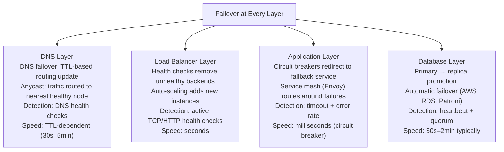
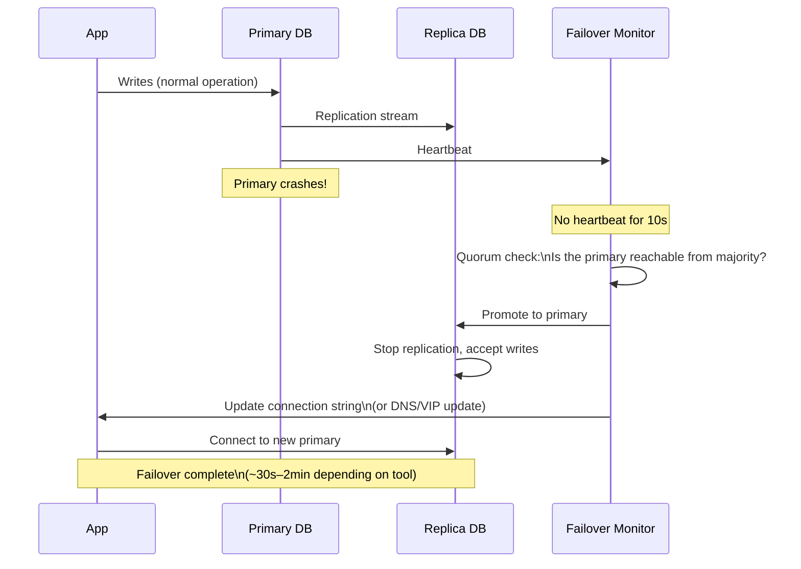
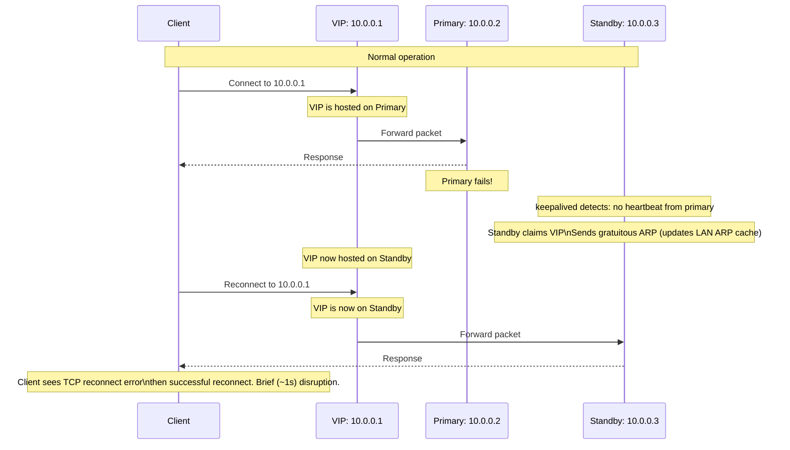
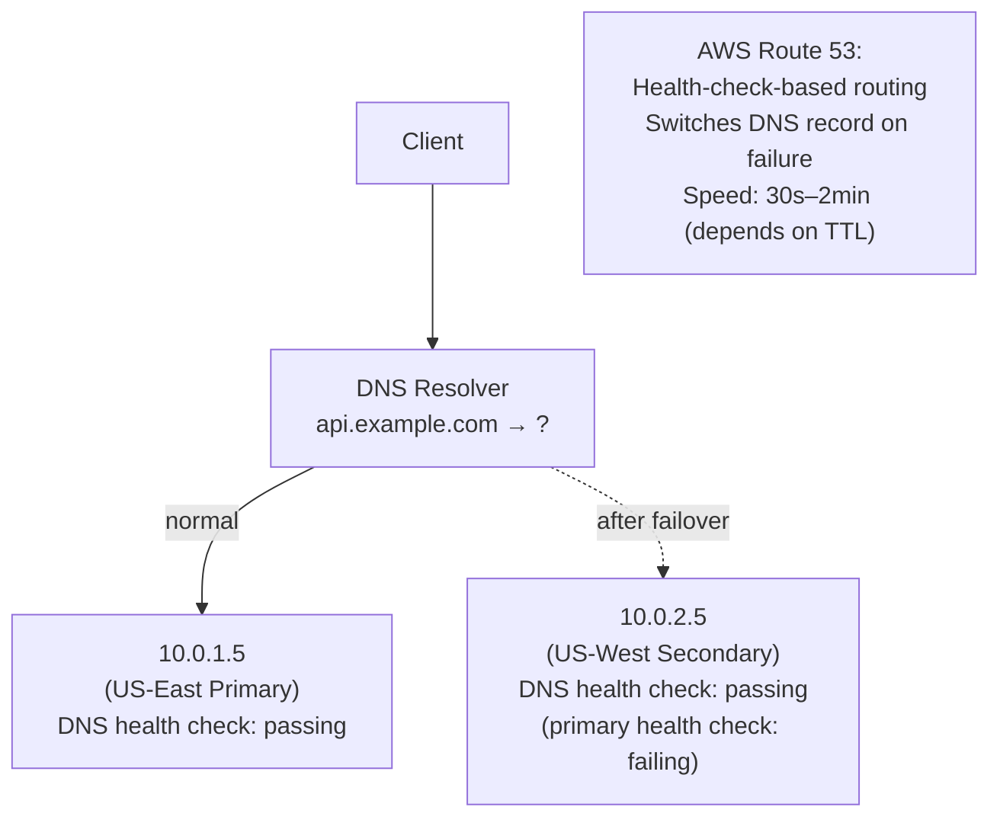
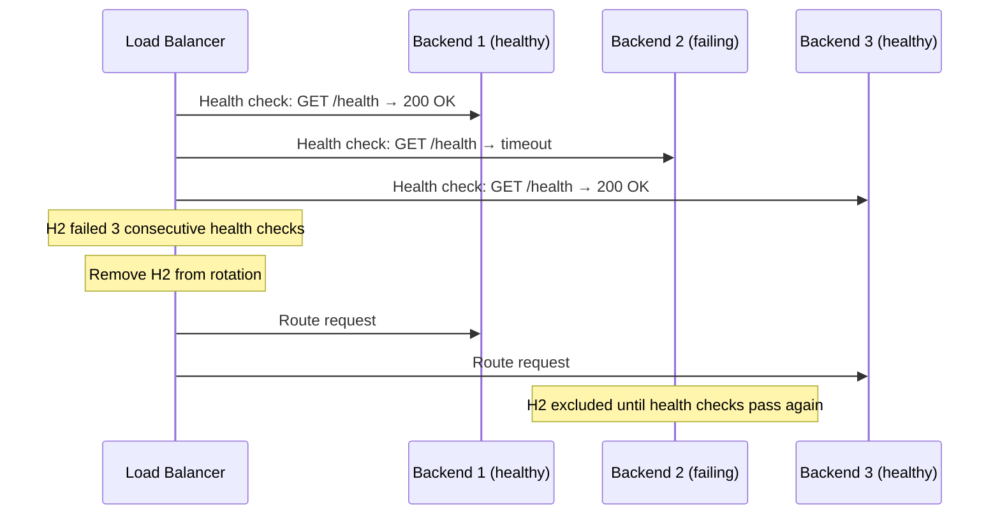
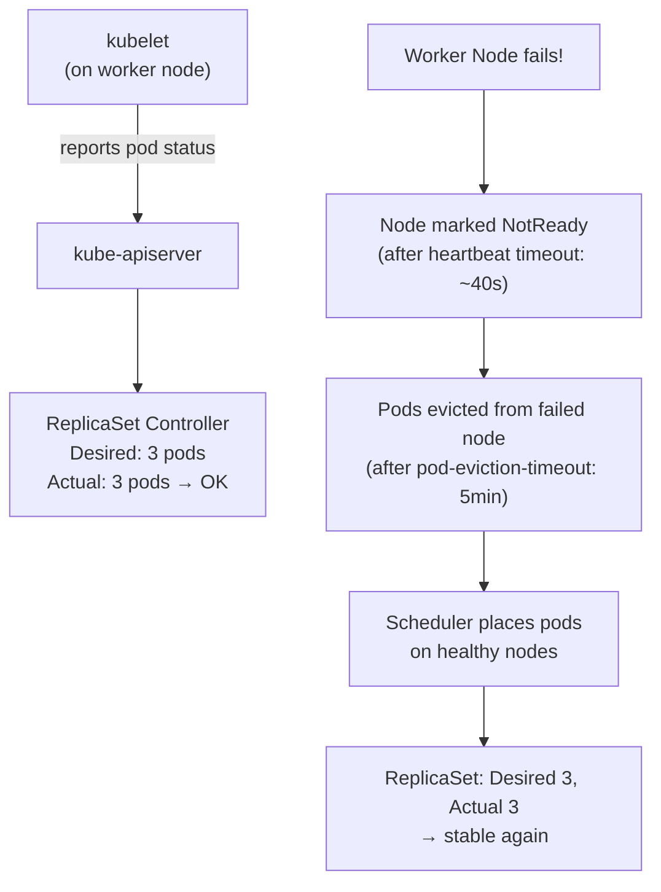
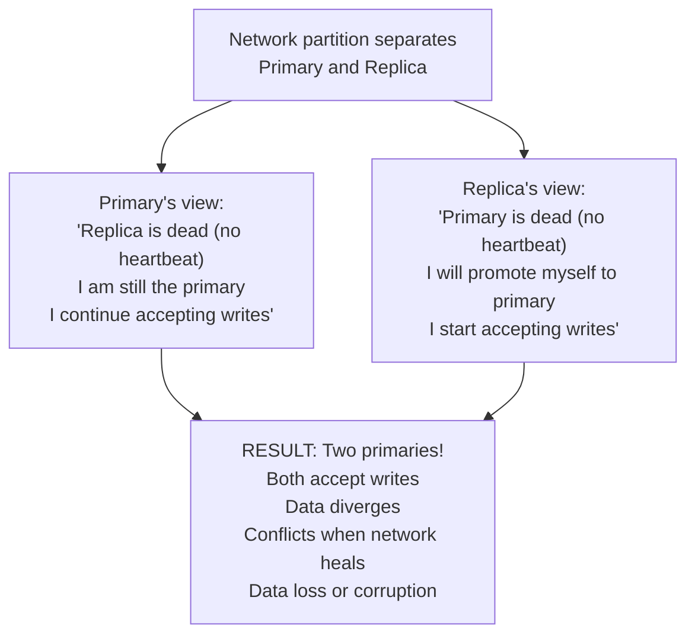
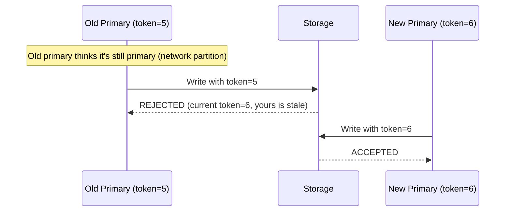
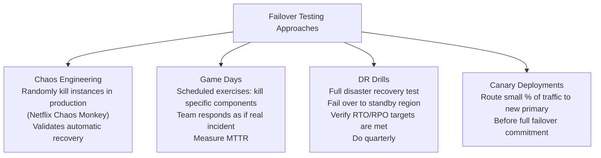

# Failover Mechanisms

Failover is the process by which a system automatically switches from a failed component to a redundant standby, with minimal disruption to users. Having redundant components isn't enough — the mechanism that detects failure and switches traffic must also be reliable, fast, and correct. A poorly designed failover can itself cause an outage: too-aggressive detection causes spurious failovers; slow detection leaves users experiencing failures for minutes; incorrect failover leaves both nodes as primary simultaneously (split-brain).

> **Why this matters in interviews:** "What happens when the database goes down?" or "How do you handle the primary failing?" tests your failover knowledge directly. Interviewers want to hear about detection speed, the failover process, and how you prevent split-brain. Every high-availability design needs a concrete failover story.

---

## Failover at Different Layers

Failover is not a single mechanism — it operates independently at each layer of the stack:



---

## Automatic vs. Manual Failover

| Type | Detection | Action | Speed | Risk |
|---|---|---|---|---|
| **Automatic** | Monitoring detects failure, triggers script | No human involvement | Seconds to minutes | Split-brain if detection is wrong |
| **Semi-automatic** | Monitoring pages on-call; human confirms | Human-in-the-loop | Minutes | False positive risk eliminated |
| **Manual** | On-call detects failure themselves | Human does everything | Many minutes to hours | Very safe; very slow |

**When to use automatic failover:** When MTTR matters more than MTTF (fast recovery over perfect safety). Ideal for: load balancer backend health (remove + replace instances), cloud-managed database failover (AWS RDS Multi-AZ), Kubernetes pod rescheduling.

**When to use manual/semi-automatic:** When the blast radius of a wrong failover is worse than the downtime. Ideal for: primary databases in complex topologies, data migrations, cases where split-brain data corruption is unacceptable.

---

## Database Failover (Primary → Replica Promotion)

The most critical and complex failover in most systems:



### Tools That Automate Database Failover

**AWS RDS Multi-AZ:**
- Synchronous replication to standby in another AZ
- Automatic failover in ~1–2 minutes
- DNS endpoint switches to standby automatically
- No data loss (synchronous)

**Patroni (PostgreSQL):**
- Open-source PostgreSQL HA manager
- Uses etcd/ZooKeeper/Consul as distributed lock for leader election
- Automatic failover with configurable timeout
- REST API for manual control

**MHA (MySQL):**
- MySQL Master High Availability Manager
- Identifies the most up-to-date replica, promotes it
- Reconfigures other replicas to follow new primary
- Minimizes data loss (applies relay logs from old primary)

**ProxySQL / MaxScale:**
- Database proxy that understands MySQL/PostgreSQL protocol
- Automatically routes writes to primary, reads to replicas
- On failover: transparently reconnects to new primary
- Application sees no connection string change

---

## Virtual IP (VIP) Failover

A Virtual IP (VIP) is an IP address that floats between servers, allowing transparent failover without changing DNS:



**keepalived** (Linux): Most common VIP management tool. Uses VRRP (Virtual Router Redundancy Protocol) to elect which host owns the VIP. Used for load balancers, HAProxy instances, database primaries.

**VIP failover speed:** Seconds. The gratuitous ARP update propagates to all hosts in the same subnet immediately. No DNS TTL to wait for.

**Limitation:** VIP works within a single network subnet (same AZ). Cross-AZ failover requires DNS or cloud load balancer mechanisms.

---

## DNS-Based Failover

Update DNS to point to the healthy endpoint. Works across AZs and regions:



**TTL is the key parameter:** A DNS record's Time-To-Live (TTL) determines how long clients cache the record. For failover:
- **High TTL (3600s):** Clients don't see the update for up to 1 hour
- **Low TTL (30–60s):** Fast failover; higher DNS server load; not all clients honor low TTLs

**Best practice:** Set TTL to 60–300s for production failover scenarios. Pre-warm low TTLs before expecting to need failover (change TTL days before, not at the moment of crisis).

---

## Load Balancer Failover

Load balancers remove unhealthy backends from their pool based on health checks:



**AWS ALB health check parameters:**
- `HealthCheckIntervalSeconds` (default: 30s): How often to check
- `HealthyThresholdCount` (default: 2): Consecutive successes to mark healthy
- `UnhealthyThresholdCount` (default: 2): Consecutive failures to mark unhealthy

Time to mark unhealthy: `interval × unhealthyThreshold` = 30s × 2 = 60s (with defaults).

For faster failover, use: `interval=5s, unhealthyThreshold=2` → 10 second failure detection.

---

## Kubernetes Pod Failover

Kubernetes automatically reschedules failed pods:



**Kubernetes failover timeline:**
- Node heartbeat timeout: ~40 seconds
- Pod eviction timeout: ~5 minutes (configurable)
- Pod scheduling on new node: ~30 seconds
- **Total: ~6 minutes** for full pod failover on node failure

For faster failover: tune `--node-monitor-grace-period` and `--pod-eviction-timeout`, or use `pod.spec.tolerations` to control eviction timing.

---

## Split-Brain Prevention

The most dangerous failover failure: both nodes believe they're primary.



**Prevention strategies:**

### 1. Quorum / Consensus
Only a majority can elect a leader. With 3 nodes, a quorum requires 2. Neither side of a partition with <50% can elect a primary:

```
3 nodes, network partition: 1 vs 2
- Group of 1: Cannot form quorum → does NOT promote
- Group of 2: Can form quorum → promotes one to primary
- Only one primary ever exists
```

Used by: etcd (Raft), ZooKeeper (ZAB), CockroachDB, Patroni.

### 2. Fencing Tokens
New primary receives a monotonically increasing token. Old primary's writes are rejected if they carry an outdated token:



### 3. STONITH (Shoot The Other Node In The Head)
Before promoting, the new primary physically powers off the old primary (via IPMI, AWS API, etc.) to ensure it can't continue accepting writes. Used in enterprise HA setups.

---

## Failover Testing

Untested failover is unreliable failover. Regular drills are essential:



---

## Interview Talking Points

**1. Walk me through what happens when the primary database fails.**
> "It depends on the setup. With AWS RDS Multi-AZ, the sequence is: heartbeat monitoring detects the primary is unreachable (typically within 30–60 seconds), performs a quorum check to confirm it's not a false positive, then promotes the standby replica in another AZ to primary. RDS updates the DNS endpoint to point to the new primary — this takes about 1–2 minutes total. Applications using the RDS endpoint experience connection drops, reconnect after the DNS update propagates, and continue writing. With Patroni for PostgreSQL, it uses etcd as a distributed lock — only the process that acquires the 'leader' key in etcd can act as primary. When the primary crashes, the etcd key expires (TTL), a replica acquires it, promotes itself, and updates its connection information in etcd. Other components discover the new primary via etcd watch."

**2. What is split-brain and how do you prevent it?**
> "Split-brain is when a network partition causes both sides to independently elect a primary, resulting in two nodes simultaneously accepting writes. When the partition heals, you have conflicting writes and potentially lost or corrupted data. The primary prevention mechanism is quorum consensus: a primary can only be elected with votes from a majority (>N/2) of nodes. In a 3-node cluster partitioned 1 vs. 2, the group of 1 can never reach quorum and won't promote. Only the group of 2 can form a majority. Fencing tokens are a complementary defense: the new primary gets an incrementing token, and storage layers reject writes from nodes presenting stale tokens — so even if an old primary somehow survives, its writes are rejected."

**3. What is VIP failover and when would you use it?**
> "A Virtual IP (VIP) is an IP address that's not tied to a specific physical interface — it can 'move' between hosts. Keepalived uses VRRP to elect which host owns the VIP. When the primary fails, the standby detects the absence of VRRP packets, claims the VIP, and sends a gratuitous ARP to update the network's ARP cache — this takes about 1 second. Clients connecting to the VIP see a brief TCP connection drop, reconnect, and transparently hit the new primary. Use VIP when you need sub-second transparent failover within a single subnet — load balancers, HAProxy pairs, database primaries where DNS-based failover is too slow. The limitation is that VIP requires hosts in the same network segment, so it doesn't work cross-AZ without additional routing configuration."

**4. How do you design failover to minimize data loss?**
> "Data loss during failover is determined by replication lag at the moment of failure. With synchronous replication, the primary only acknowledges a write after the replica confirms it — zero data loss on failover, but higher write latency (you're waiting for the replica's confirmation). With asynchronous replication, the primary acknowledges immediately; any writes that replicated before the crash are safe, but anything in-flight is lost. For zero data loss, use synchronous replication (PostgreSQL synchronous_standby_names, MySQL semi-sync). For low-latency writes where some data loss is acceptable, use async. Tools like MHA (MySQL) minimize loss by collecting relay logs from the crashed primary and applying them to the new primary before completing the failover."

---

## Key Takeaways

- **Failover operates at every layer** — DNS, load balancer, application, and database each have independent failover mechanisms
- **Automatic failover** is fast but risks split-brain; **manual** is safe but slow — match to your risk tolerance
- **Database failover** (primary → replica promotion) is the most complex: detection takes 10–60s, promotion takes seconds, DNS propagation takes 30s–2min
- **VIP failover** uses gratuitous ARP for sub-second transparent switchover within a subnet — no DNS TTL to wait for
- **DNS failover** works across AZs/regions but is constrained by TTL — pre-set low TTLs before you need them
- **Quorum consensus** prevents split-brain — a majority is required to elect a primary; a minority partition can never promote
- **Fencing tokens** prevent a confused old primary from writing after losing its leadership role
- **Test your failover** — untested failover is unreliable failover; run game days and DR drills quarterly
