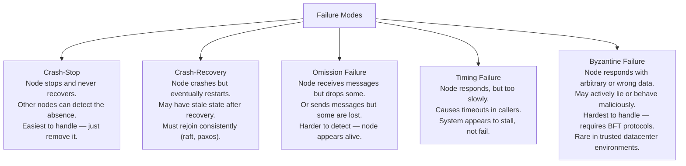
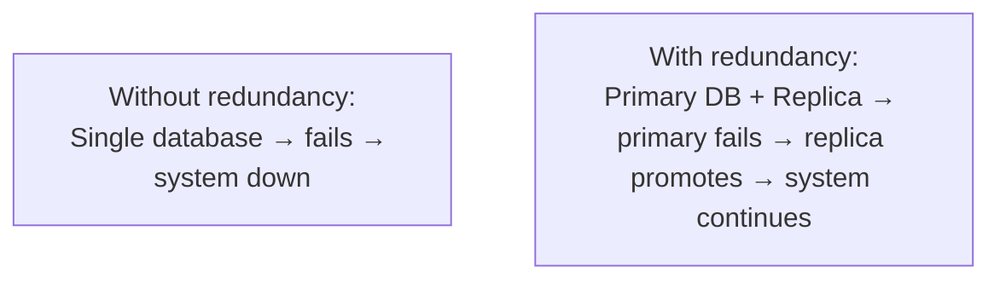
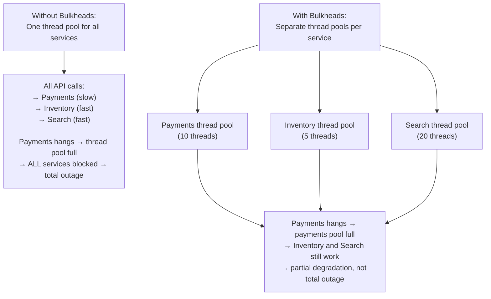
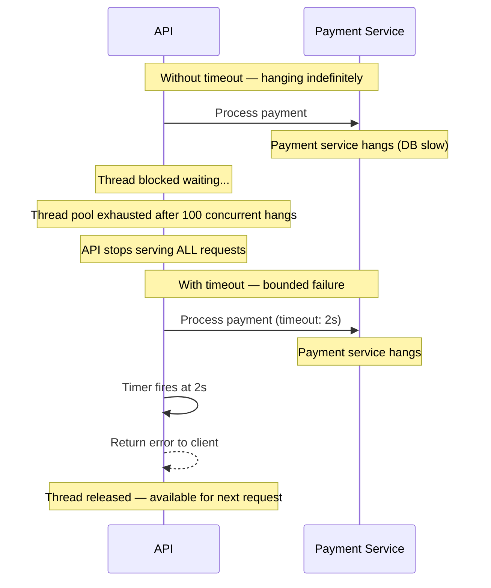
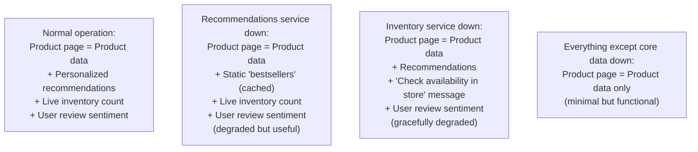
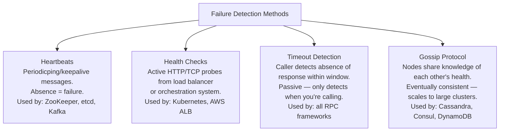
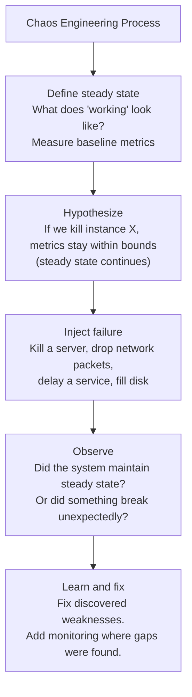

# Fault Tolerance

Fault tolerance is the ability of a system to continue operating correctly — or degrade gracefully — in the presence of component failures. Where availability asks "is the system up?", fault tolerance asks "what happens when things break?". Every distributed system will experience failures: hardware dies, networks partition, software bugs surface under load. Fault-tolerant systems are designed with this certainty as an axiom, not as an edge case.

> **Why this matters in interviews:** Fault tolerance is the design philosophy underlying every reliability pattern — circuit breakers, retries, redundancy, bulkheads. When an interviewer asks "how do you handle the case where the payment service is down?", they're testing your fault tolerance instincts. The expected answer isn't "it won't go down" — it's a systematic approach to detecting, containing, and recovering from failures.

---

## Failure Modes in Distributed Systems

Understanding failure modes is prerequisite to designing tolerance for them:



**In practice:** Most distributed system failures in a datacenter are crash-stop (hardware failures) or timing failures (network congestion, slow queries). Byzantine failures are addressed in blockchain/consensus protocols but rarely in standard web services.

---

## Fault Tolerance vs. High Availability vs. Disaster Recovery

| Property | Question | Scope | Example |
|---|---|---|---|
| **Fault Tolerance** | Can the system survive component failures? | Component/service level | Payment service retries after cart service timeout |
| **High Availability** | Is the system accessible most of the time? | System level | 99.99% uptime via redundant instances |
| **Disaster Recovery** | Can the system recover from catastrophic failure? | Region/data center level | Recover from full data center outage in <4 hours |

---

## Core Fault Tolerance Mechanisms

### 1. Redundancy

The most fundamental mechanism: run multiple copies so the failure of one doesn't stop the system.



Redundancy applies at every layer: multiple application servers, multiple database replicas, multiple load balancers, multiple network paths, multiple power supplies, multiple data centers.

### 2. Isolation (Bulkhead Pattern)

Named after the bulkheads in ship hulls that limit flooding to one compartment, the bulkhead pattern partitions resources so a failure in one area doesn't cascade to others.



**Bulkhead implementations:**
- **Thread pool isolation:** Separate thread pools per downstream service (Netflix Hystrix)
- **Connection pool isolation:** Separate DB connection pools for critical vs. non-critical queries
- **Process isolation:** Run different services in separate processes/containers
- **Node isolation:** Allocate dedicated servers to critical services

### 3. Timeouts

Without timeouts, a slow or unresponsive dependency holds resources forever. Timeouts bound the blast radius of a slow service:



**Timeout budgets:** In a system where the total request budget is 500ms, set cascading timeouts:
- Client → API: 500ms
- API → Service A: 200ms  
- API → Service B: 150ms
- Service A → Database: 100ms

Each downstream timeout must be shorter than the upstream timeout that wraps it.

### 4. Circuit Breaker

Stops calling a failing dependency until it recovers, preventing the caller from being overwhelmed by timeouts. (Covered in depth in the Circuit Breaker article.)

### 5. Graceful Degradation

When a component fails, serve a reduced but still useful response rather than failing completely:



**Real example:** Netflix degrades gracefully when recommendation service fails — it shows static trending content rather than personalized recommendations. The user can still watch; they just get less personalized results.

### 6. Idempotency

Operations that can be safely retried without side effects. Critical for fault tolerance because failures often require retrying operations:

```python
# NOT idempotent — retrying charges customer twice:
def process_payment(amount):
    charge_card(amount)
    return "charged"

# Idempotent — retrying is safe:
def process_payment(idempotency_key: str, amount: float):
    if payment_already_processed(idempotency_key):
        return get_payment_result(idempotency_key)  # Return cached result
    result = charge_card(amount)
    store_payment_result(idempotency_key, result)
    return result
```

Stripe, Braintree, and all major payment APIs require idempotency keys for this reason.

---

## Failure Detection

Fast failure detection minimizes the time between failure and recovery action:



**Phi Accrual Failure Detector** (used by Cassandra, Akka): Instead of a binary alive/dead judgment, outputs a continuous suspicion level φ that increases as heartbeats are delayed. Systems can choose their own threshold for when to declare a node dead, trading off false positives for faster detection.

---

## Chaos Engineering

**"Hope is not a strategy."** Chaos engineering deliberately introduces failures in production (or staging) to validate that fault tolerance mechanisms actually work:



**Netflix Chaos Monkey:** Randomly terminates EC2 instances in production. Forces engineering teams to build systems that tolerate instance loss. Extended to **Simian Army**: Chaos Gorilla (kills entire AZ), Chaos Kong (kills entire region).

**The discipline:** Chaos engineering is not random destruction. It's a scientific process with hypotheses, controlled experiments, and learning. Run experiments in staging first, then production during business hours when your team can respond.

---

## Fault Tolerance Patterns Summary

| Pattern | What It Does | When to Use |
|---|---|---|
| **Redundancy** | Multiple replicas so one can fail | Every production system |
| **Timeout** | Bound how long you wait for dependencies | Every network call |
| **Circuit Breaker** | Stop calling a failing service | Cascading failure prevention |
| **Retry with backoff** | Retry transient failures | Network calls, idempotent operations |
| **Bulkhead** | Isolate resource pools | When one downstream can't starve others |
| **Graceful degradation** | Serve reduced response vs. total failure | User-facing features with optional dependencies |
| **Idempotency** | Make operations safe to retry | Payment, write operations |
| **Health checks** | Detect and route around failed instances | All services behind a load balancer |

---

## Interview Talking Points

**1. How would you make a payment processing service fault tolerant?**
> "I'd apply multiple layers. First, idempotency keys on every charge attempt — retrying a failed request returns the cached result rather than double-charging. Second, timeouts on all downstream calls (payment gateway, fraud detection, DB) with a total budget shorter than the client's timeout. Third, a circuit breaker around the payment gateway — if error rate exceeds 50% in a 30-second window, stop sending requests and return a graceful error to users rather than hanging. Fourth, async confirmation: accept the payment request, publish to a queue, and process it reliably — even if processing fails, the request isn't lost. Fifth, dead-letter queues for messages that fail processing after N retries, with monitoring and manual resolution workflow."

**2. What is the bulkhead pattern and why is it important?**
> "The bulkhead pattern isolates resource pools (thread pools, connection pools, semaphores) for different downstream dependencies so a failure in one doesn't exhaust resources needed by others. Without it, if the payment service becomes slow and I have one shared thread pool with 50 threads, 50 users can have their requests stuck waiting on payment — blocking inventory, search, and user profile requests from all 50 threads. With bulkheads: the payment pool has 10 threads, inventory has 5, search has 20. A slow payment service blocks only those 10 threads. Inventory and search continue serving. The failure is contained. Netflix Hystrix made this mainstream — every service call wrapped in a separate thread pool with independent timeouts and circuit breakers."

**3. What is graceful degradation and how do you design for it?**
> "Graceful degradation means the system continues to function in a useful — if reduced — way when non-critical components fail, rather than failing entirely. The key design technique is feature flagging and fallback data. For every non-critical feature, ask: what's the fallback if this service is unavailable? Recommendations fail → show 'bestsellers' from cache. Personalization service down → show default content. Real-time inventory unavailable → show 'check availability' message. The critical path (core functionality) must be preserved even when non-critical services fail. Map your features into tiers: tier 1 (must work, no graceful degradation — block the request if unavailable), tier 2 (degraded experience acceptable), tier 3 (feature disappears silently). Each tier gets different handling."

**4. What is chaos engineering and why do production companies use it?**
> "Chaos engineering is the practice of deliberately introducing failures into a system to validate that fault tolerance mechanisms work as designed. The premise is that distributed systems are too complex to reason about purely theoretically — failures happen in unexpected combinations that only show up under real conditions. Netflix's Chaos Monkey randomly terminates EC2 instances in production, forcing engineers to build systems that handle instance loss. The process is scientific: define steady state (what metrics confirm the system is healthy), hypothesize (if we kill this instance, steady state is maintained), inject the failure, observe what happens. If the system doesn't maintain steady state, you've discovered a real weakness before a customer did. Run experiments in staging first, then during low-traffic production windows with the team on-call."

---

## Key Takeaways

- **Failures in distributed systems are certain** — design assuming components will fail, not hoping they won't
- **Failure modes** differ: crash-stop (detectable), timing (slowness), omission (silent drops), Byzantine (wrong data) — each requires different handling
- **Timeouts** are the most fundamental fault tolerance mechanism — without them, a slow service exhausts all resources
- **Bulkheads** contain failures to one pool — prevent one slow dependency from starving all others
- **Graceful degradation** preserves core functionality when optional features fail — map features to tiers
- **Idempotency** makes retry-based fault tolerance safe — operations must be safe to repeat
- **Chaos engineering** validates that theoretical fault tolerance works in practice — hope is not a strategy
- The goal is **partial availability** over **total failure** — a degraded response is almost always better than no response
