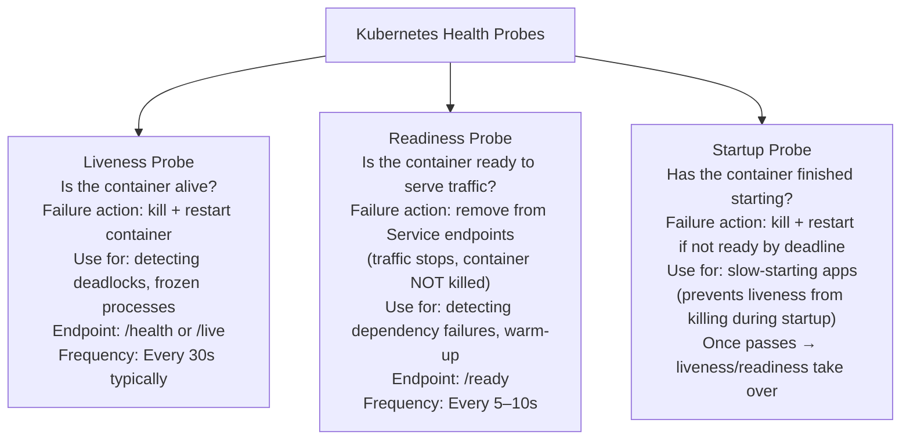
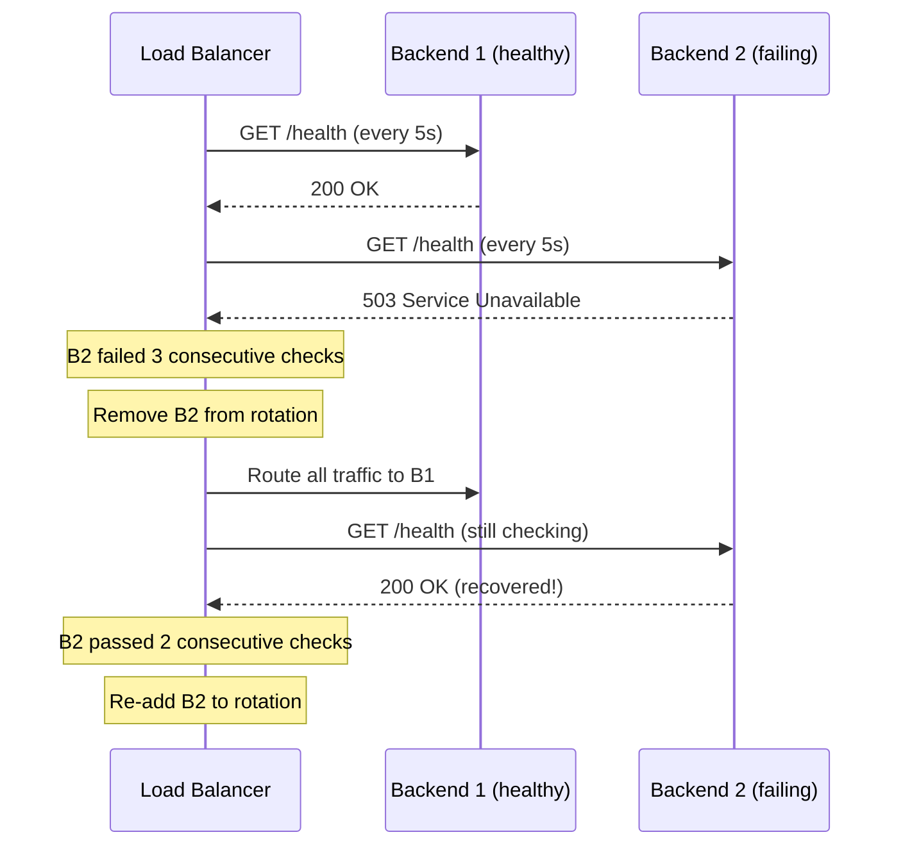
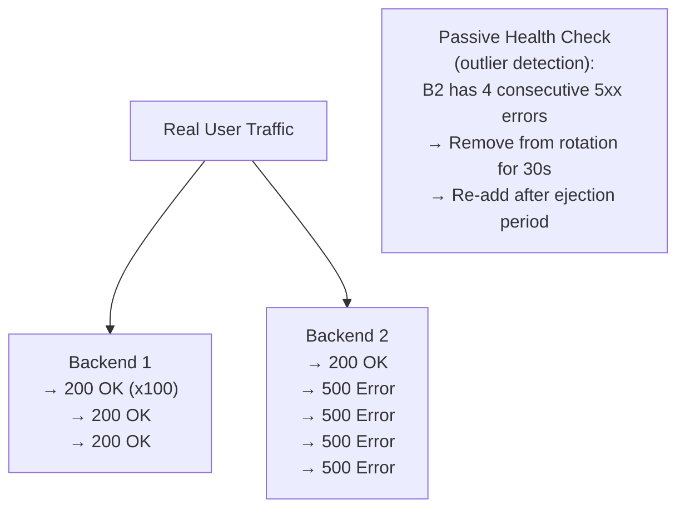
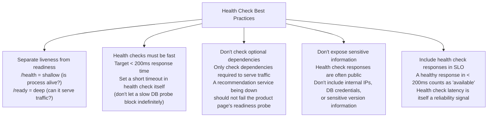

# Health Checks

A health check is a standardized mechanism for a system to declare its own operational state — and for infrastructure (load balancers, orchestrators, monitoring systems) to verify that a service is ready to handle traffic. Without health checks, load balancers don't know which backends are broken, Kubernetes doesn't know which pods to replace, and monitoring systems can't distinguish "service is starting up" from "service has crashed." Health checks are the observability contract between a service and the infrastructure that runs it.

> **Why this matters in interviews:** Health checks are part of the operational design of every production service. Interviewers expect you to know the difference between liveness, readiness, and startup probes (Kubernetes); shallow vs. deep checks; and how health checks integrate with load balancers and auto-scaling. This is a signal that you think about production operations, not just code correctness.

---

## The Two Dimensions: Shallow vs. Deep

### Shallow Health Check

Confirms the process is alive and the HTTP server can respond. Does not check dependencies:

```python
from flask import Flask, jsonify
app = Flask(__name__)

@app.route('/health')
def health():
    return jsonify({"status": "ok"}), 200
```

**What it detects:**
- Process crashed
- HTTP server frozen
- Port not listening

**What it misses:**
- Database connection lost (process is up but can't serve requests)
- Dependent service unavailable
- Cache unreachable
- Disk full

**When to use:** As a liveness probe — just confirms the process is running and should not be killed. Fast, lightweight, high-frequency.

### Deep Health Check

Verifies the service can actually serve requests by checking its critical dependencies:

```python
import redis
import psycopg2
from flask import Flask, jsonify

app = Flask(__name__)

@app.route('/ready')
def readiness():
    checks = {}
    overall_ok = True
    
    # Check database connectivity
    try:
        conn = psycopg2.connect(DATABASE_URL)
        conn.cursor().execute("SELECT 1")
        conn.close()
        checks["database"] = "ok"
    except Exception as e:
        checks["database"] = f"error: {str(e)}"
        overall_ok = False
    
    # Check Redis connectivity
    try:
        r = redis.from_url(REDIS_URL)
        r.ping()
        checks["cache"] = "ok"
    except Exception as e:
        checks["cache"] = f"error: {str(e)}"
        overall_ok = False
    
    status_code = 200 if overall_ok else 503
    return jsonify({"status": "ok" if overall_ok else "degraded", "checks": checks}), status_code
```

**Example response (healthy):**
```json
{
  "status": "ok",
  "checks": {
    "database": "ok",
    "cache": "ok"
  }
}
```

**Example response (degraded):**
```json
{
  "status": "degraded",
  "checks": {
    "database": "ok",
    "cache": "error: Connection refused to redis:6379"
  }
}
```

**When to use:** As a readiness probe — determines if the instance should receive traffic. Returns 503 if any critical dependency is unavailable. Load balancer removes instance from rotation on 503.

---

## Kubernetes Probes: Liveness, Readiness, Startup

Kubernetes has three distinct probe types with different purposes:



**The critical distinction — liveness vs. readiness:**

| Probe | Failure Effect | Use Case |
|---|---|---|
| **Liveness** | Container restarted | Deadlock, zombie process, hung thread |
| **Readiness** | Traffic stopped (no restart) | DB connection lost, cache unavailable, warming up |
| **Startup** | Container restarted if not started by deadline | JVM startup, model loading, DB migration on start |

**Why this distinction matters:** If a service loses its database connection temporarily, you want to stop sending it traffic (readiness fails) but NOT kill and restart it (that won't help — the database is still unavailable). Liveness probe on `/health` (shallow) + readiness probe on `/ready` (deep) gives you this behavior.

**Kubernetes probe configuration:**

```yaml
apiVersion: apps/v1
kind: Deployment
spec:
  template:
    spec:
      containers:
      - name: api
        livenessProbe:
          httpGet:
            path: /health    # Shallow: just checks process is alive
            port: 8080
          initialDelaySeconds: 10
          periodSeconds: 30
          failureThreshold: 3     # Kill after 3 consecutive failures
        
        readinessProbe:
          httpGet:
            path: /ready     # Deep: checks DB, cache, etc.
            port: 8080
          initialDelaySeconds: 5
          periodSeconds: 10
          failureThreshold: 2     # Stop traffic after 2 consecutive failures
          successThreshold: 1     # Resume traffic after 1 success
        
        startupProbe:
          httpGet:
            path: /health
            port: 8080
          failureThreshold: 30    # Allow up to 300s for startup (30 × 10s)
          periodSeconds: 10
```

---

## Load Balancer Health Checks

Load balancers perform active health checks on backends and route traffic only to healthy instances:



**AWS ALB health check parameters:**

| Parameter | Default | Recommendation |
|---|---|---|
| `HealthCheckPath` | `/` | Set to `/health` or `/ready` |
| `HealthCheckIntervalSeconds` | 30 | 5–10s for fast detection |
| `HealthyThresholdCount` | 2 | 2 consecutive successes to add |
| `UnhealthyThresholdCount` | 2 | 2 consecutive failures to remove |
| `HealthCheckTimeoutSeconds` | 5 | Keep shorter than interval |

With these defaults: unhealthy detection takes 30s × 2 = **60 seconds**. For faster detection: set `HealthCheckIntervalSeconds=5` and `UnhealthyThresholdCount=2` → 10-second detection.

---

## Passive Health Checks

Instead of (or in addition to) active probing, observe real traffic outcomes:



**Envoy outlier detection** (passive health check in service mesh):
- Ejects backends that have consecutive 5xx errors from the load balancing pool
- Configurable: `consecutive_5xx`, `consecutive_gateway_failure`, `success_rate_minimum_hosts`
- Ejection is temporary — backends are re-admitted after `base_ejection_time`

**Advantage over active probing:** Responds to actual service degradation, not just the health endpoint. A service can have a healthy `/health` endpoint but return 500s for actual business logic errors.

**Used by:** Istio, Envoy, HAProxy (with `observe` layer7 checks)

---

## Health Check Aggregation

For systems with many dependencies, a structured health check response helps monitoring:

```json
{
  "status": "degraded",
  "version": "1.4.2",
  "uptime_seconds": 86400,
  "checks": {
    "database_primary": {
      "status": "ok",
      "response_time_ms": 3,
      "message": "Connected (pool: 18/20 connections)"
    },
    "database_replica": {
      "status": "ok",
      "response_time_ms": 5,
      "message": "Connected (replication lag: 12ms)"
    },
    "redis_cache": {
      "status": "error",
      "response_time_ms": 5002,
      "message": "Timeout after 5000ms"
    },
    "payment_gateway": {
      "status": "ok",
      "response_time_ms": 187,
      "message": "Reachable"
    }
  }
}
```

**Standard health check API formats:**
- **RFC Health Check Response Format for HTTP APIs** (draft-inadarei-api-health-check): Standardized JSON format
- **Spring Boot Actuator** (`/actuator/health`): Built-in with customizable indicators
- **ASP.NET Core Health Checks Middleware**: Same concept for .NET

---

## Health Check Best Practices



**The optional vs. required dependency rule:** Separate your dependencies into two tiers:
1. **Required:** Service cannot function without it (database, primary cache) → include in readiness check
2. **Optional:** Service functions in degraded mode without it (recommendations, analytics, secondary enrichment) → do NOT include in readiness check

Including optional dependencies in readiness checks causes the service to be unnecessarily removed from the load balancer rotation when non-critical components have issues.

---

## Interview Talking Points

**1. What is the difference between a liveness probe and a readiness probe?**
> "A liveness probe asks: is this container alive and not in a broken state? If it fails, Kubernetes kills and restarts the container — the assumption is that restarting will fix the problem (a deadlock, a frozen thread, a zombie process). A readiness probe asks: is this container ready to serve traffic right now? If it fails, Kubernetes removes the pod from the Service's endpoint list — traffic stops, but the container is NOT killed. The key distinction: if the database goes down temporarily, I want traffic to stop going to my API pods (readiness fails → removed from LB), but I do not want to kill and restart them (liveness should pass — the process is fine). Killing the pods doesn't help when the database is unavailable. Liveness uses a shallow check; readiness uses a deep check of critical dependencies."

**2. What should a production health check endpoint return?**
> "Two separate endpoints: /health returns a minimal 200 OK as long as the process is running — just proves liveness. /ready returns 200 if all critical dependencies are reachable and 503 if any aren't. The /ready response body should be a structured JSON with the status of each dependency (database: ok, cache: error, latency numbers). This gives you both: load balancer and Kubernetes use the HTTP status code to make routing decisions (200 = include, 503 = exclude), and your monitoring team uses the response body to diagnose which specific dependency caused the degradation. Keep health check response times under 200ms — add a short timeout to each dependency check (e.g., 100ms for DB ping) so a slow database doesn't cause the health check itself to hang."

**3. What is passive health checking and when is it better than active probing?**
> "Active health checking sends explicit probe requests (GET /health every 10 seconds) to determine if a backend is healthy. Passive health checking observes real traffic outcomes — Envoy's outlier detection, for example, watches 5xx response rates and latency from actual requests and ejects backends that exceed thresholds. Passive is better when: (1) You want to detect degradation that the health endpoint doesn't expose — a service might return 200 on /health but 500 for actual API calls due to a bug in one specific code path. (2) Health check round-trip adds overhead you want to avoid. The tradeoff: passive detection only works if there's traffic flowing; with low traffic, you might not detect failures as quickly. Best practice is to use both: active probing for clear up/down status, passive outlier detection for catching degraded-but-not-dead backends."

**4. What are the risks of a too-aggressive health check configuration?**
> "Setting too-short failure thresholds causes healthy instances to be prematurely removed during brief network blips or moments of high load where health check responses are slow. With interval=5s and threshold=2, two 5-second health check timeouts (10 seconds of normal load spike) can remove a perfectly healthy backend — causing a thundering herd as remaining backends absorb its traffic. This can cascade: the remaining backends are now more loaded, their health checks also time out, and you lose the entire fleet. Setting too-short success thresholds (adding backends back too quickly) can add a backend before it's fully warmed up. Recommended: unhealthy threshold of 2–3, healthy threshold of 2, interval of 5–10s for most web services. For services with startup time, use a startup probe with a longer window before liveness and readiness probes take effect."

---

## Key Takeaways

- **Shallow health checks** (just "is the process alive?") are fast and reliable — use for liveness probes
- **Deep health checks** (check DB, cache, critical dependencies) determine traffic eligibility — use for readiness probes
- **Liveness failure → restart the container;** **Readiness failure → stop traffic, don't restart** — the distinction is critical
- **Startup probes** give slow-starting containers time to initialize before liveness/readiness probes take effect
- **Load balancer health checks:** set `interval=5–10s`, `unhealthyThreshold=2` for ~10-second failure detection
- **Only include required dependencies** in readiness checks — optional dependencies failing shouldn't remove you from rotation
- **Passive health checking** (Envoy outlier detection) detects real degradation that active probing misses
- Health check responses should be fast (< 200ms), informative (JSON with per-dependency status), and not expose sensitive information
