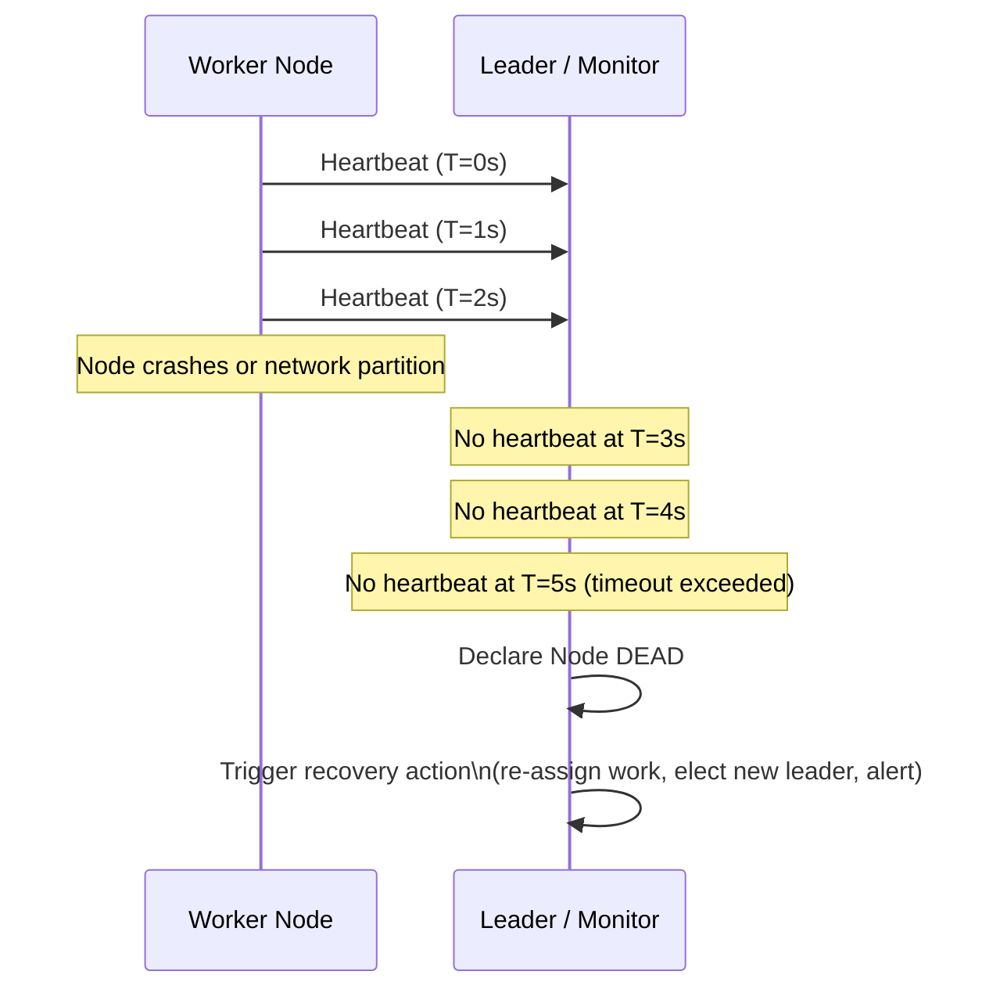
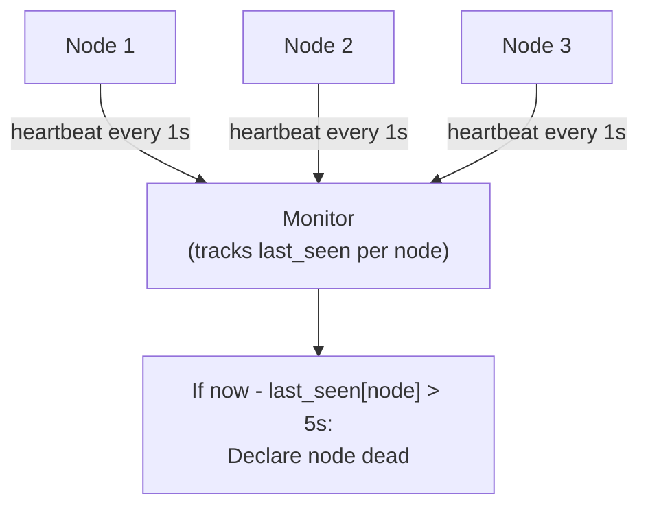
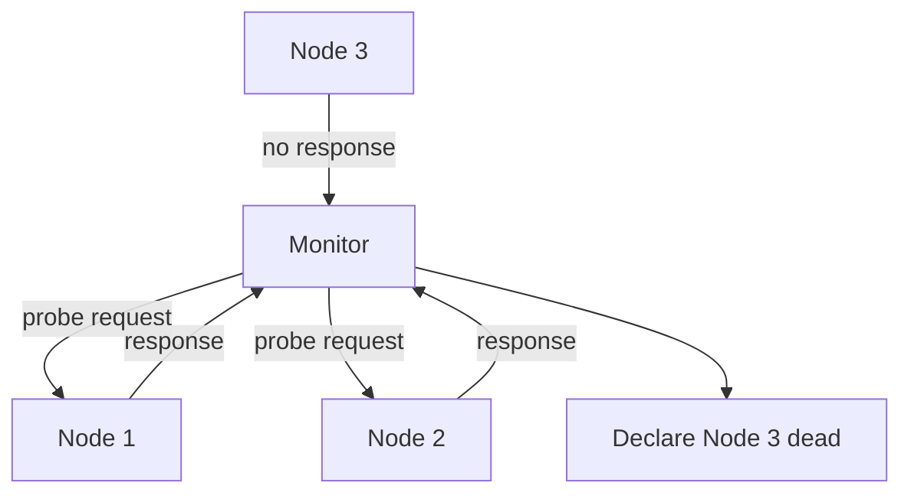
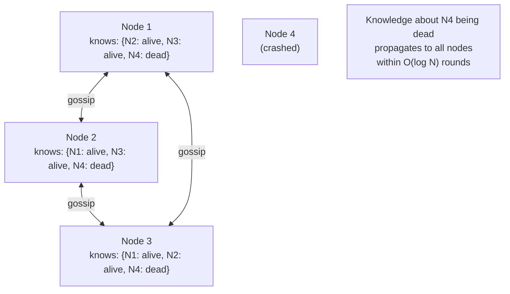
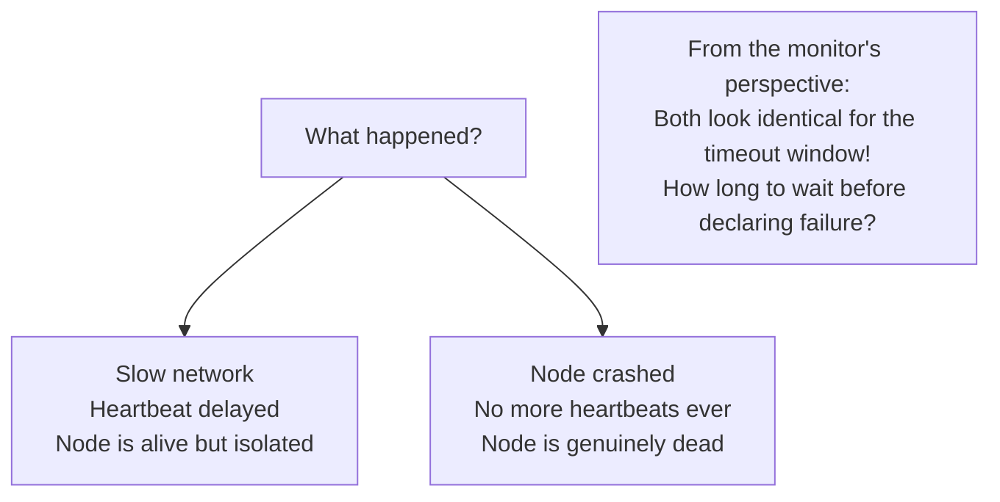
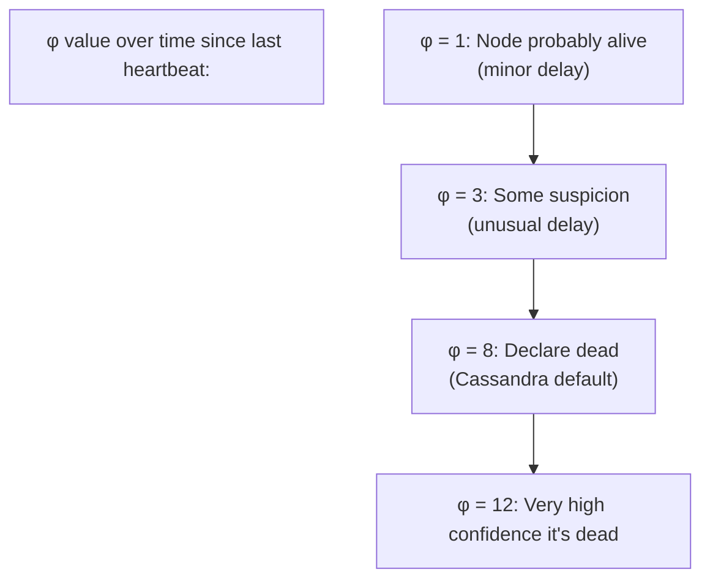
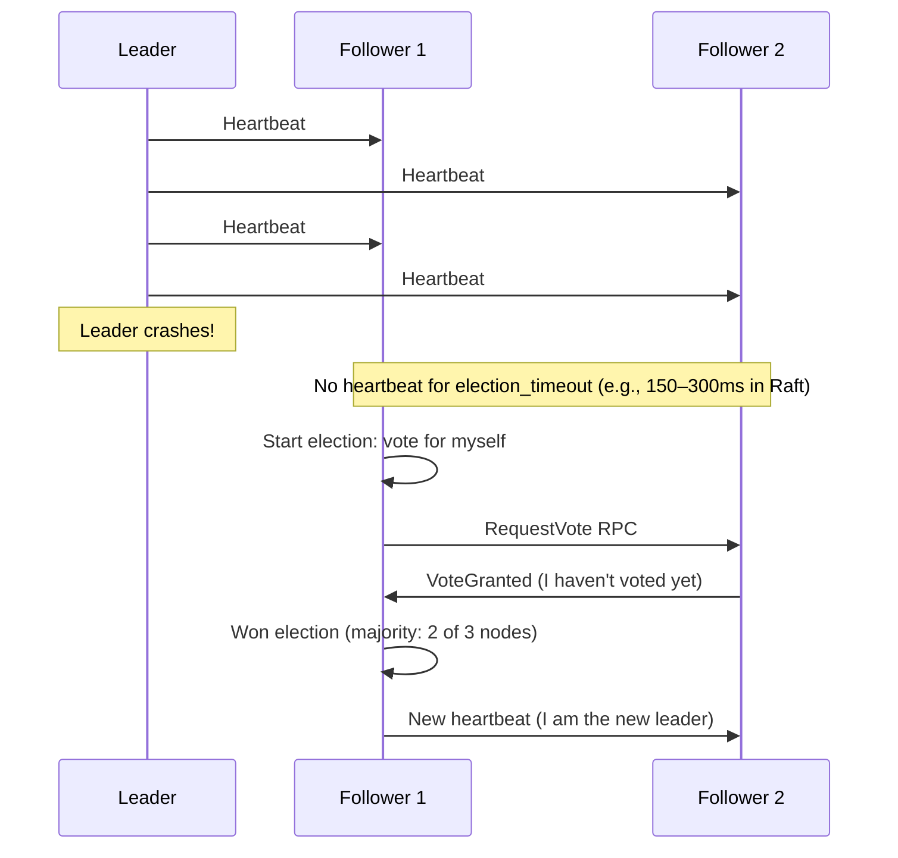
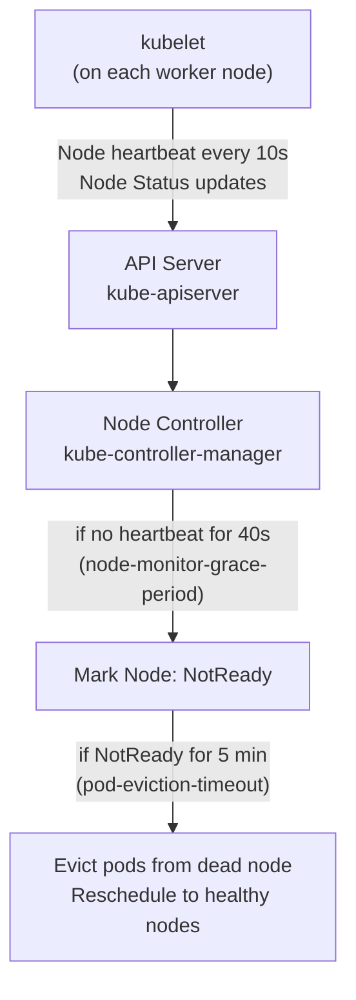
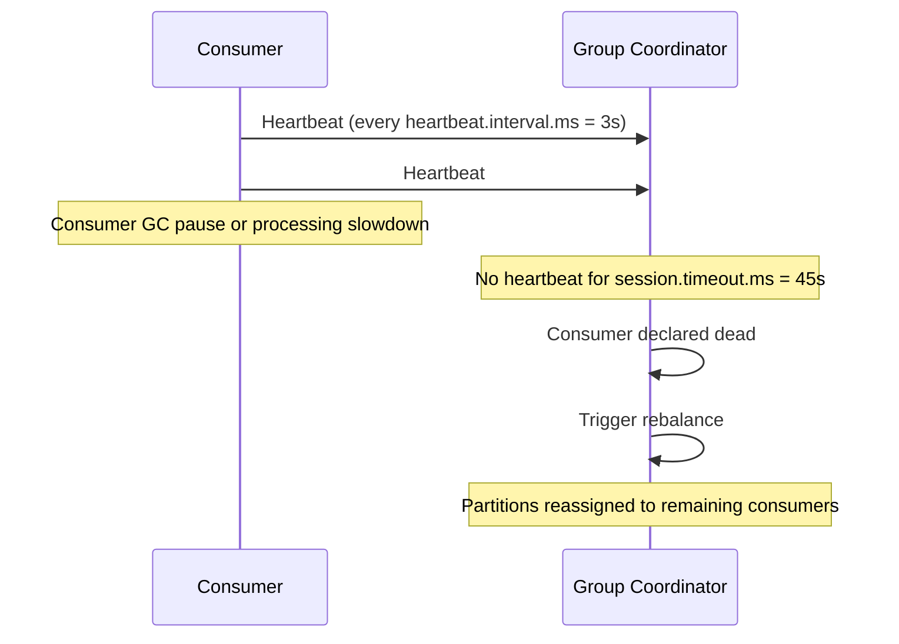

# Heartbeats

A heartbeat is a periodic signal sent by one component to indicate it is alive and functioning. In distributed systems where nodes can't directly observe each other's internal state, heartbeats are the fundamental mechanism for failure detection: if the heartbeat stops, the node is presumed dead. Used across every distributed system from ZooKeeper to Kubernetes to Cassandra, heartbeats are the pulse that keeps a cluster aware of its own health.

> **Why this matters in interviews:** Whenever you design a system with leader election, cluster membership, or automated failover, heartbeats are the underlying mechanism. Interviewers ask about heartbeat design when discussing high availability, distributed consensus, and health monitoring. The key questions: what's the right heartbeat interval? What's the right timeout? How do you handle false positives?

---

## How Heartbeats Work

**The heartbeat protocol in three steps:**
1. Sender emits periodic "I'm alive" messages at interval `T`
2. Receiver tracks the last received heartbeat timestamp
3. If `now - last_heartbeat > timeout`, the sender is declared failed

**Typical parameters:**
- **Interval:** 1–5 seconds for fast detection; 30 seconds for lightweight monitoring
- **Timeout:** 3–5 × interval (allows for network jitter without false positives)
- **Missed beats before failure:** Often 3 missed consecutive heartbeats

---

## Heartbeat Styles

### Push (Sender-Initiated)

Nodes send heartbeats to the monitor on a schedule. The monitor tracks "last seen" per node.

**Used by:** Kubernetes (kubelet → API server), Kafka (broker → ZooKeeper), Hadoop (DataNode → NameNode)

**Advantage:** Monitor is passive; scales well to large clusters.
**Risk:** If the monitor itself fails, all heartbeat tracking is lost.

### Pull (Monitor-Initiated)

The monitor actively probes nodes by sending a request. If the node responds, it's alive.

**Used by:** Load balancers (AWS ALB health checks), Nagios, Prometheus blackbox exporter

**Advantage:** Simple to implement; monitor controls timing.
**Risk:** Monitor becomes a bottleneck and SPOF for large clusters.

### Gossip Protocol

Nodes share their knowledge of each other's health through a peer-to-peer network. No central monitor.

**Used by:** Cassandra, DynamoDB, Consul, Serf

**Advantage:** Decentralized — no SPOF; scales to thousands of nodes; resilient to network partitions.
**Disadvantage:** Eventual consistency — knowledge of failure propagates gradually, not instantly.

---

## The Failure Detection Problem

The core challenge: **distinguishing a failed node from a slow network**.

**The tradeoff:**

| Timeout Setting | False Positives | Detection Speed |
|---|---|---|
| Very short (1–2s) | High (jitter triggers false alarms) | Very fast |
| Short (5–10s) | Medium | Fast |
| Medium (30s) | Low | Moderate |
| Long (60s+) | Very low | Slow (system degraded for 60s+) |

**False positive problem:** Declaring a live node dead is expensive:
- Triggers unnecessary failover (leader re-election)
- Can cause split-brain if both nodes think they're primary
- Causes unnecessary data rebalancing (Cassandra re-distributes tokens)

---

## Phi Accrual Failure Detector

Used by Cassandra, Akka, and Heartbeat (the library). Instead of binary alive/dead, outputs a continuous suspicion level **φ** (phi):

$$\varphi(t) = -\log_{10}(P_{later}(t - t_{last}))$$

Where $P_{later}$ is the probability that the next heartbeat hasn't arrived yet given observed inter-arrival times.

**Intuition:**
- When heartbeats arrive normally: φ is low (< 1)
- As time since last heartbeat grows: φ increases
- Applications choose their own threshold: φ > 8 means "dead" for most systems

**Why this is better than a fixed timeout:** It adapts to observed network conditions. In a network where heartbeats normally arrive in 500ms, a 2-second delay is suspicious (φ is high). In a network with high jitter where 2-second delays are normal, φ remains low at 2 seconds.

---

## Heartbeats in Leader Election

In systems with a leader (Kafka controller, Elasticsearch master, ZooKeeper leader), heartbeats from the leader prove it's alive. Loss of heartbeat triggers re-election:

**Raft election timeout:** Randomized between 150ms and 300ms to prevent all followers from starting elections simultaneously. The first follower to time out wins the election in most cases.

---

## Heartbeats in Kubernetes

Kubernetes has a sophisticated multi-level heartbeat system:

**Two types of node heartbeats in Kubernetes:**
1. **NodeStatus updates:** Full status object sent every 10s; expensive but detailed
2. **Lease objects:** Lightweight heartbeat via a Lease object in the `kube-node-lease` namespace, updated every 10s — much cheaper to process

---

## Heartbeats in Apache Kafka

Kafka consumers send heartbeats to the Group Coordinator (a broker) to prove they're alive:

**Key Kafka heartbeat parameters:**
- `heartbeat.interval.ms` (default: 3000ms) — how often consumer sends heartbeat
- `session.timeout.ms` (default: 45000ms) — how long coordinator waits before declaring dead
- `max.poll.interval.ms` (default: 300000ms) — max time between `poll()` calls; not sending heartbeats for this long triggers rebalance

---

## Designing a Heartbeat System

Key decisions when designing heartbeat-based failure detection:

| Decision | Options | Recommendation |
|---|---|---|
| **Who initiates?** | Push (node → monitor) or Pull (monitor → node) | Push for large clusters; Pull for small/simple |
| **Interval** | 1s–60s | 1–5s for fast failover; 30s for lightweight |
| **Timeout multiplier** | 2× to 10× interval | 3–5× to tolerate jitter without slow detection |
| **Failure threshold** | 1 missed vs. 3 missed | 3 consecutive missed beats reduces false positives |
| **Decentralized?** | Central monitor vs. gossip | Gossip for large, distributed clusters |
| **Response to failure** | Alert only vs. auto-failover | Auto-failover for HA; alert for manual systems |

---

## Interview Talking Points

**1. What is a heartbeat and how is it used for failure detection?**
> "A heartbeat is a periodic signal — typically a lightweight ping or keep-alive message — sent by a node to indicate it's alive. In distributed systems where nodes can't observe each other's internal state directly, the presence or absence of heartbeats is how the cluster tracks member health. A monitor or peer tracks the last received heartbeat timestamp. If `now - last_heartbeat > timeout`, the node is declared failed and recovery actions trigger: leader re-election, partition reassignment, traffic rerouting. The key design parameters are the heartbeat interval (how often you send it) and the timeout (how long to wait before declaring failure) — both involve a tradeoff between fast detection and false positives."

**2. What is the Phi Accrual Failure Detector and why is it better than a fixed timeout?**
> "Phi Accrual outputs a continuous suspicion level φ rather than a binary alive/dead judgment. It tracks the historical distribution of inter-heartbeat arrival times and computes the probability that the next heartbeat is 'overdue' given that distribution. In a stable network, a 2-second delay might be very suspicious (high φ). In a network with high jitter, the same 2-second delay is normal (low φ). Applications choose their own φ threshold for declaring failure. Cassandra uses φ = 8. The benefit over fixed timeouts is adaptability — the detector tunes itself to observed network conditions, reducing false positives in jittery networks and maintaining fast detection in stable ones."

**3. How does the gossip protocol differ from centralized heartbeats?**
> "In centralized heartbeats, all nodes report to a single monitor that tracks cluster health — it's simple but the monitor is a SPOF and bottleneck. In gossip, each node periodically exchanges its knowledge of cluster health with a random peer. Information about a failure propagates through the cluster in O(log N) rounds — similar to how rumors spread in a social network. Gossip scales to thousands of nodes without a central coordinator, and it's resilient to network partitions (nodes in each partition continue tracking each other). The tradeoff is eventual consistency — unlike a centralized system that knows immediately, gossip-based clusters converge on a consistent view of membership over a few seconds. Cassandra, DynamoDB, and Consul use gossip."

**4. What is a split-brain scenario in the context of heartbeats?**
> "Split-brain occurs when a network partition causes two groups of nodes to each lose heartbeats from the other, so both groups independently elect a leader and start accepting writes. With two active leaders, you get conflicting writes and data divergence. For example, if a cluster of 5 nodes has a partition creating groups of 2 and 3: if the group of 2 declares the group of 3 dead (no heartbeats) and elects its own leader, you have two leaders. Prevention strategies: (1) Quorum requirement — a leader can only be elected with votes from a strict majority (>N/2); a group of 2 out of 5 can never reach quorum. (2) Fencing tokens — the new leader gets a monotonically increasing token; old leader's writes are rejected by storage when it attempts to write with an outdated token."

---

## Key Takeaways

- **Heartbeats are the fundamental failure detection mechanism** in distributed systems — absence of heartbeat = presumed failure
- **Push heartbeats** (node → monitor) scale better for large clusters; **pull** (monitor → node) is simpler for small systems
- **Gossip protocol** distributes failure detection with no SPOF — O(log N) propagation; used by Cassandra, Consul
- **The core tradeoff:** Short timeout = fast detection but more false positives; long timeout = fewer false positives but slow detection
- **Phi Accrual Failure Detector** outputs a continuous suspicion level instead of binary alive/dead — adapts to observed network jitter
- **Split-brain** is the catastrophic false-positive: both sides of a partition think the other is dead — prevent with quorum requirements
- Kubernetes uses both full **NodeStatus updates** and lightweight **Lease objects** for node heartbeats
- Kafka uses heartbeats to track consumer group membership — missed heartbeat triggers partition rebalance
