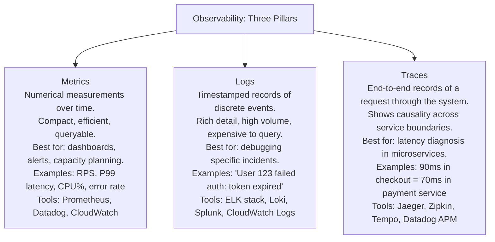
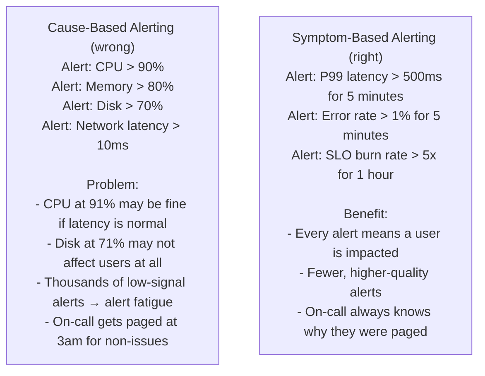
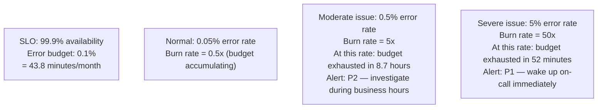
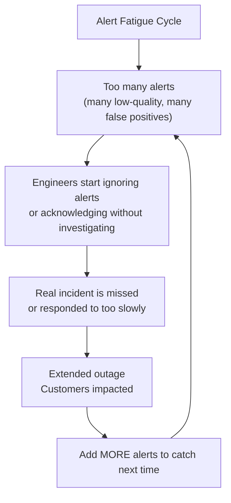
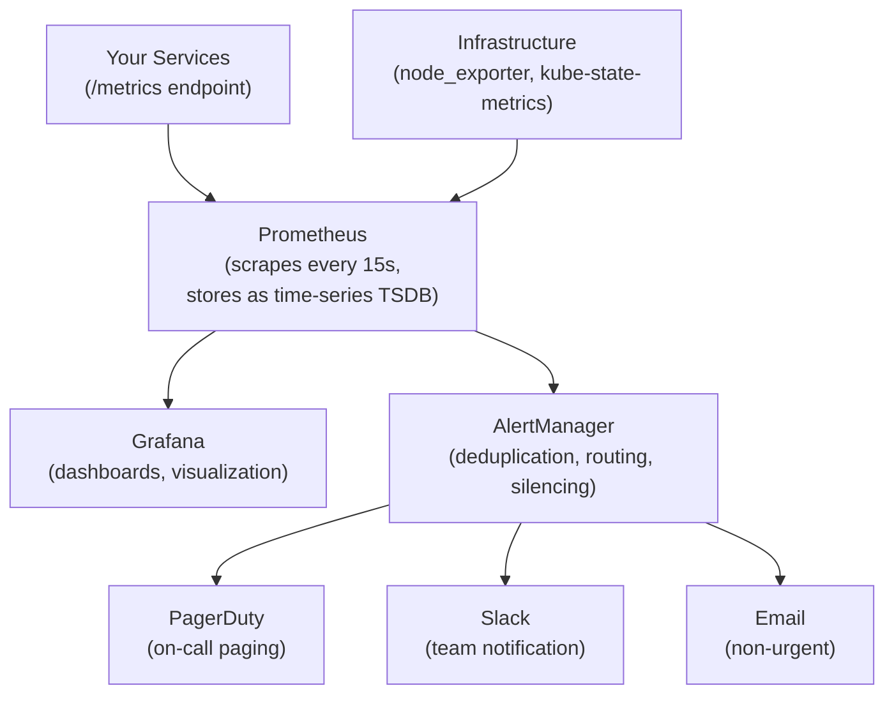
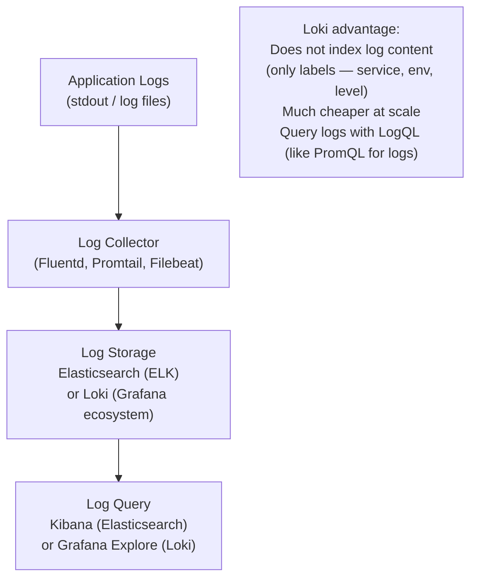
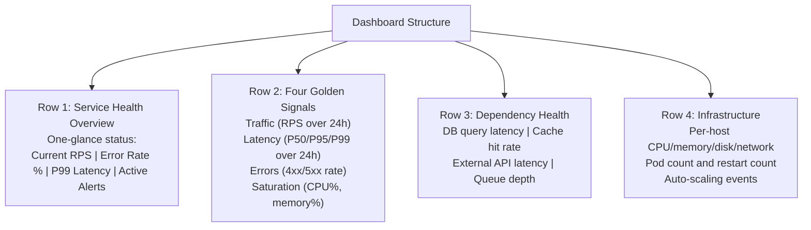
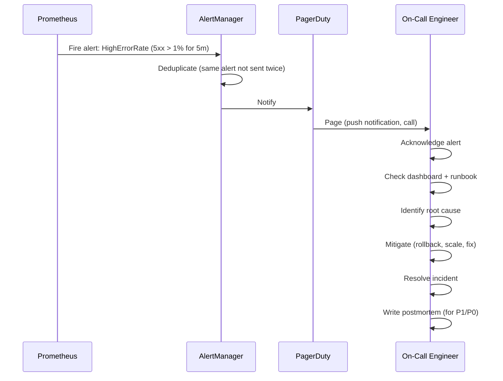

# Monitoring & Alerting

Monitoring is the practice of continuously collecting data about a system's behavior so that you can understand its state, detect anomalies, and debug problems. Alerting is the practice of automatically notifying humans when something requires attention. Together, they form the operational nervous system of a production system — you cannot run a reliable service without them. A system you cannot observe is a system you cannot reason about, and a system you cannot reason about is a system you cannot improve.

> **Why this matters in interviews:** Monitoring and alerting signal operational maturity. When you mention metrics, SLO-based alerting, and alert fatigue in a system design, you demonstrate that you're thinking beyond deployment to production operation. Interviewers at senior levels often explicitly ask "how would you know if this system is healthy?" — a question that tests your observability instincts.

---

## The Three Pillars of Observability

Modern observability frameworks describe three complementary data types that together give a complete view of system behavior:



**Why you need all three:**
- **Metrics** tell you *that* something is wrong (error rate is 5%)
- **Logs** tell you *what* happened (which requests failed, with what error)
- **Traces** tell you *where* in the request path the latency/failure occurred

---

## Alerting Philosophy: Symptoms, Not Causes

**The most important alerting principle: alert on symptoms (what users experience), not causes (what went wrong internally).**



**The Google SRE principle:** Alert when a user is having a bad experience. If the system is degraded but no user is impacted, let your monitoring dashboard show it — but don't wake anyone up.

---

## SLO-Based Alerting (Burn Rate)

The most sophisticated alerting framework: alert when you're consuming your error budget too fast.

**Concept: Burn Rate**

$$\text{burn rate} = \frac{\text{actual error rate}}{\text{error budget rate}}$$

If your SLO is 99.9% (error budget = 0.1%), a 1% error rate burns your budget 10x faster than the allowed rate — burn rate = 10.



**Multi-window burn rate alerts** (Google's recommended model):

| Burn Rate | Error Rate | Budget Exhausted In | Window | Severity |
|---|---|---|---|---|
| 14.4x | 1.44% | 1 hour | 1h fast + 5m slow | P0 — page immediately |
| 6x | 0.6% | 2.4 hours | 6h fast + 30m slow | P1 — page on-call |
| 3x | 0.3% | 5 days | 24h fast + 2h slow | P2 — alert next business day |
| 1x | 0.1% | 30 days | Ticket — not an alert |

**Multi-window approach prevents false alarms:** A short spike might trigger the fast window but not the slow window. Only when both windows show elevated burn rate does an alert fire.

---

## Alert Fatigue and Its Consequences

Alert fatigue is when on-call engineers receive so many low-quality alerts that they start ignoring them — including the real ones.



**Signs of alert fatigue:**
- On-call engineers acknowledge alerts without reading them
- > 10 alerts per shift that require no action
- Multiple consecutive no-action alert pages per week
- Engineers "turning off" or "muting" alerts indefinitely

**Solutions:**
- **Reduce alert count:** Merge related alerts, remove low-signal alerts
- **Raise thresholds:** If an alert fires 5 days/week without action, it's not alerting at the right threshold
- **Add context:** Include runbook links, dashboard links, and clear description in every alert
- **Use SLO-based alerting:** Fewer, higher-quality alerts that always mean user impact

---

## The Monitoring Stack

### Metrics: Prometheus + Grafana



**Prometheus alert rules (YAML):**

```yaml
groups:
  - name: api.rules
    rules:
    # Alert: P99 latency SLO violation
    - alert: HighLatency
      expr: |
        histogram_quantile(0.99, 
          rate(http_request_duration_seconds_bucket[5m])
        ) > 0.2
      for: 5m
      labels:
        severity: warning
      annotations:
        summary: "P99 latency above 200ms SLO"
        description: "P99 is {{ $value | humanizeDuration }} (SLO: 200ms)"
        runbook_url: "https://wiki.internal/runbooks/high-latency"
    
    # Alert: High error rate
    - alert: HighErrorRate
      expr: |
        rate(http_requests_total{status=~"5.."}[5m]) /
        rate(http_requests_total[5m]) > 0.01
      for: 5m
      labels:
        severity: critical
      annotations:
        summary: "Error rate above 1%"
        description: "Current rate: {{ $value | humanizePercentage }}"
```

### Logs: The ELK Stack / Loki



**Structured logging** (critical for searchability):

```python
import structlog

log = structlog.get_logger()

# Instead of: logger.info(f"User {user_id} checked out order {order_id}")
# Use structured logging:
log.info("checkout_completed",
    user_id=user_id,
    order_id=order_id,
    amount=order.total,
    payment_method="credit_card",
    duration_ms=elapsed_ms,
    environment="production"
)
```

**Output:**
```json
{"event": "checkout_completed", "user_id": 12345, "order_id": "ORD-789", "amount": 99.99, "duration_ms": 247, "timestamp": "2026-05-27T14:23:01Z"}
```

Structured logs are parseable, filterable, and aggregatable. Free-text logs are nearly impossible to query at scale.

### Dashboards: What to Show

A well-designed monitoring dashboard has layers:



---

## Incident Management Workflow



**Incident severity levels:**

| Level | User Impact | Response Time | Examples |
|---|---|---|---|
| **P0 / SEV1** | Complete outage or data loss | Immediate (< 5 min) | Full service down, data corruption |
| **P1 / SEV2** | Severe degradation, many users affected | < 15 minutes | Major feature broken, 50% error rate |
| **P2 / SEV3** | Partial impact, workaround available | < 1 hour (during business hours) | Minor feature broken, elevated latency |
| **P3 / SEV4** | Minimal impact | Next business day | Cosmetic issue, minor performance regression |

---

## On-Call Best Practices

**Runbooks:** Every alert must link to a runbook — a step-by-step document for how to respond:

```markdown
# Runbook: HighErrorRate Alert

## What it means
The HTTP 5xx error rate has exceeded 1% for 5+ minutes.

## Immediate steps
1. Check the error rate dashboard: [link]
2. Identify which endpoints are failing: `rate(http_requests_total{status=~"5.."}[5m]) by (path)`
3. Check recent deployments: [link to deployment history]
4. Check downstream service health: [link to dependency dashboard]

## Common causes and fixes
- Recent deployment: Roll back with `kubectl rollout undo deployment/api`
- Database issues: Check DB metrics [link], consider read replica failover
- Memory pressure: Check if OOMKilled: `kubectl describe pod <pod-name>`

## Escalation
If not resolved in 30 minutes: escalate to [senior engineer on-call]
```

**On-call rotation best practices:**
- Maximum: 1 alert per night that requires action
- Follow-the-sun: rotate on-call responsibility across time zones
- Post-mortems for every P0/P1 incident (blameless; focus on system improvements)
- Track MTTA (Mean Time to Acknowledge) and MTTR (Mean Time to Resolve) per quarter

---

## Interview Talking Points

**1. What is the difference between metrics, logs, and traces?**
> "The three pillars of observability serve different purposes. Metrics are numerical aggregates over time — RPS, P99 latency, error rate, CPU% — compact and efficient, ideal for dashboards and alerts. They tell you that something is wrong. Logs are timestamped records of discrete events — 'user 123 checkout failed: DB timeout at 14:23:01' — rich in detail, expensive at scale, best for debugging specific incidents. They tell you what happened. Traces are end-to-end records of a single request through multiple services — a waterfall showing that checkout took 250ms, of which 200ms was in the payment service, which spent 180ms waiting for the DB. They tell you where in the request path the problem is. In a microservice architecture, you need all three: metrics for alerting, logs for context, traces for root cause analysis."

**2. Why should you alert on symptoms instead of causes?**
> "Symptom-based alerts fire when a user is experiencing a bad experience (high latency, errors). Cause-based alerts fire when internal metrics exceed thresholds (CPU > 90%, disk > 70%). The problem with cause-based alerting: CPU at 91% might not be causing any user-visible impact — the service is handling load fine. Disk at 71% might not reach 100% for weeks. These alerts create noise without value. Every time an on-call engineer gets paged for something that required no action, they become slightly more likely to ignore the next page. Alert fatigue kills incident response. With symptom-based alerting — 'error rate > 1%' or 'P99 > 500ms' — every alert means a user is suffering right now. Fewer alerts, higher quality, faster response, better on-call experience."

**3. What is a burn rate alert and how does it work?**
> "A burn rate alert is an SLO-based alerting approach that measures how fast you're consuming your error budget. If your SLO is 99.9%, your monthly error budget is 0.1% of time — about 43 minutes. A burn rate of 1 means you're consuming the budget at exactly the rate that would exhaust it in 30 days. A burn rate of 14.4 means you're consuming it 14.4x faster than allowed — your budget would be gone in 50 hours. Burn rate alerts use multi-window detection: a fast window (1 hour) catches the current rate; a slow window (5 minutes) confirms it's sustained. Only when both windows show elevated burn rate does the alert fire, preventing false alarms from short spikes. This produces very high-quality, low-volume alerts — you only get paged when you're genuinely at risk of exhausting your SLO."

**4. What should every on-call alert include?**
> "Every alert needs five things: (1) What fired — the alert name and metric in plain English ('P99 latency exceeds 200ms SLO'). (2) Severity — is this wake-up-now or investigate-tomorrow? (3) Current value vs. threshold — 'Current P99: 850ms, SLO: 200ms'. (4) Link to the relevant dashboard — on-call shouldn't have to search for context. (5) Link to the runbook — a step-by-step document for how to diagnose and resolve this specific alert. Without these, the on-call engineer starts every incident response blind, wasting critical time during an outage. AlertManager in Prometheus supports annotations for all of this. PagerDuty and OpsGenie can embed this context in the notification itself."

---

## Key Takeaways

- **Three pillars of observability:** Metrics (aggregates), Logs (events), Traces (request paths) — you need all three
- **Alert on symptoms** (user impact: latency, errors) not causes (CPU%, disk%) — causes produce noise; symptoms produce action
- **Burn rate alerting** measures SLO consumption rate — alerts only when you're genuinely at risk of exhausting your error budget
- **Alert fatigue** kills incident response — more than 1 actionable alert per on-call shift signals a misconfigured alerting system
- **Prometheus + Grafana** is the industry standard for metrics — AlertManager handles deduplication and routing
- **Structured logging** (JSON with consistent fields) is essential — free-text logs cannot be queried at scale
- **Every alert must link to a runbook** — on-call needs a step-by-step guide, not just a metric name
- **Post-mortems** (blameless, system-focused) for every P0/P1 incident turn failures into reliability improvements
