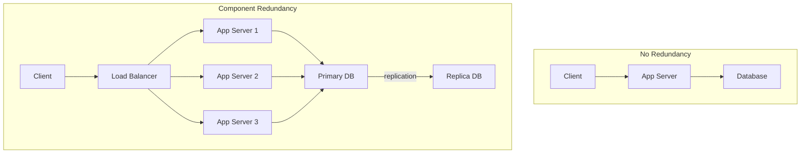
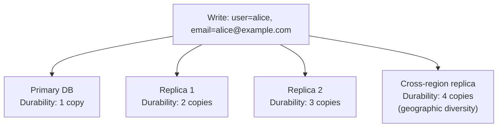
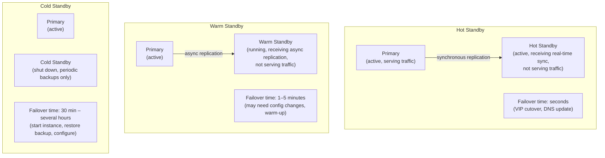
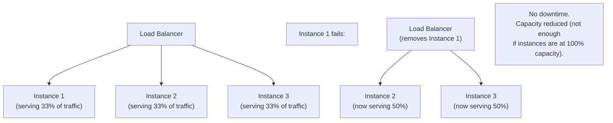
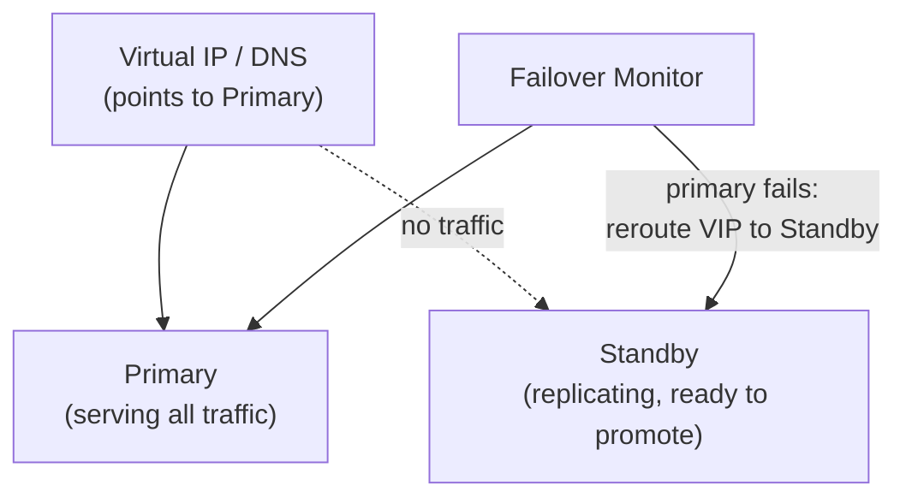
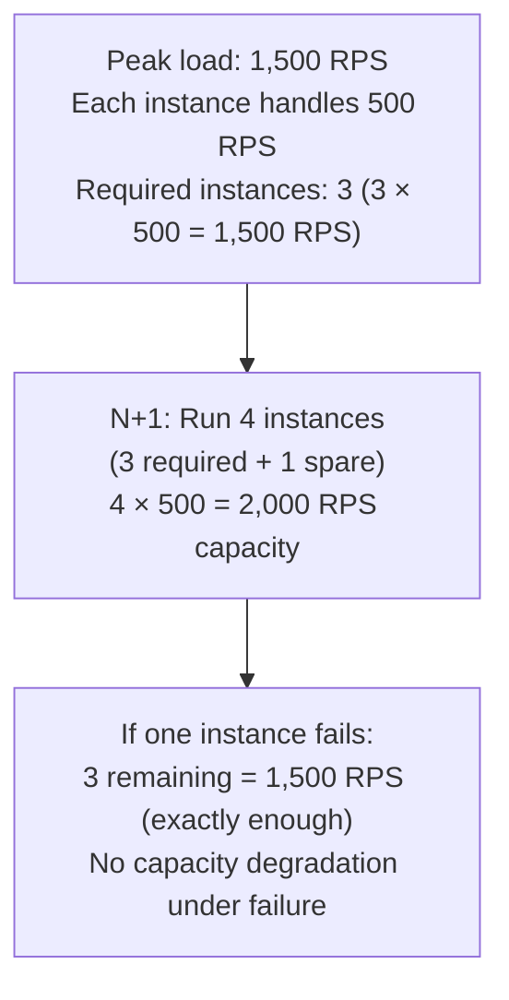
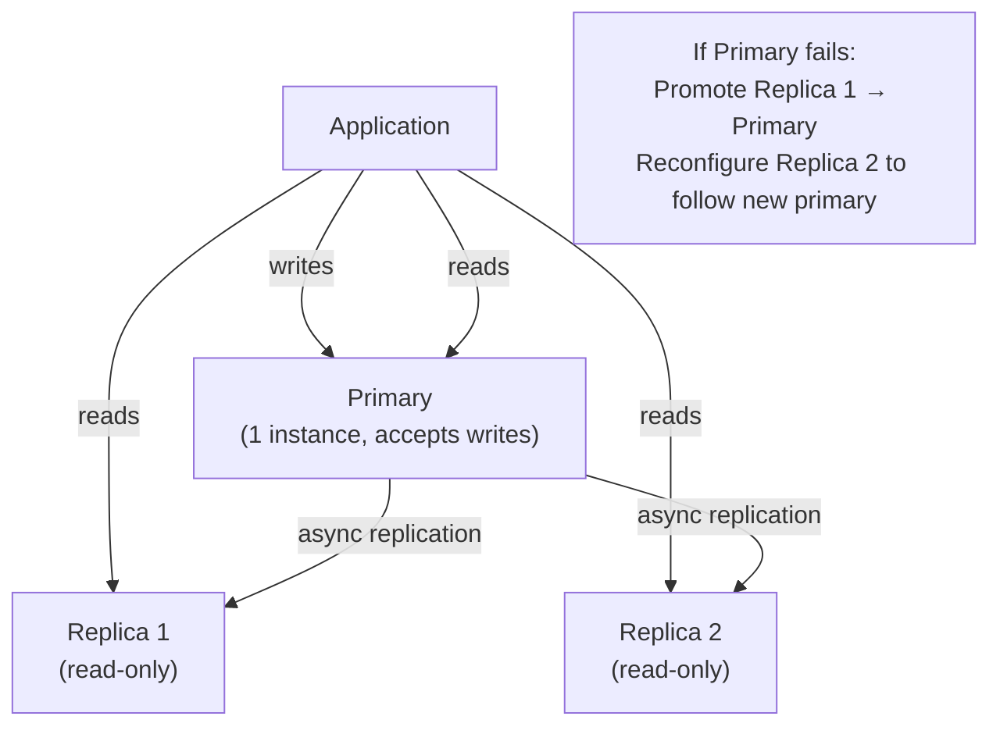
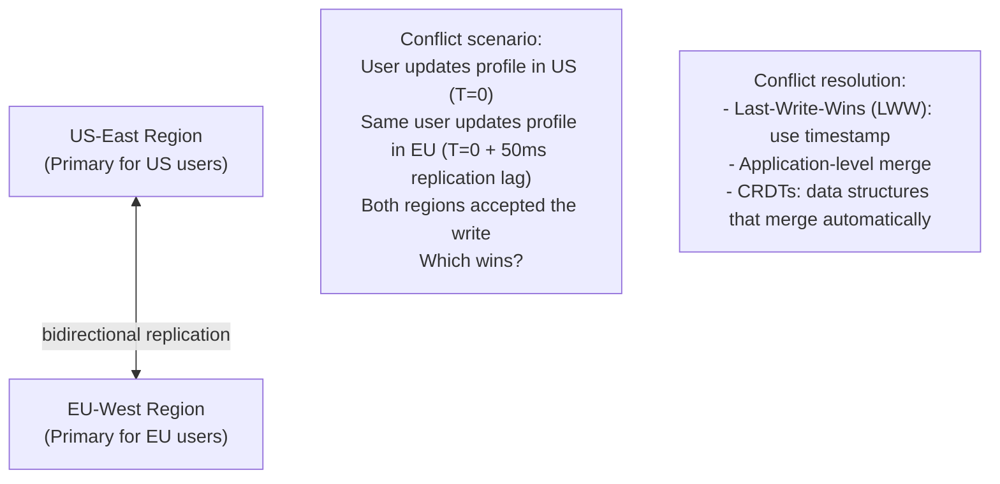
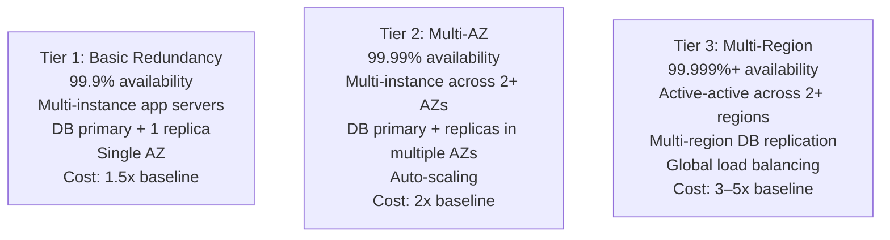

# Redundancy

Redundancy is the practice of having more than one copy of a critical system component, so that the failure of any single copy doesn't cause system failure. It is the most fundamental technique for building reliable distributed systems. Every high-availability architecture is, at its core, a collection of thoughtful redundancy decisions: which components need it, how many copies, and how quickly failures are detected and routed around.

> **Why this matters in interviews:** Redundancy questions appear in almost every system design problem. Understanding the spectrum — from simple N+1 app servers to multi-region active-active with global load balancing — lets you propose architectures that match the required availability tier without over-engineering. Interviewers also probe the costs and tradeoffs, not just the benefits.

---

## Types of Redundancy

### Component Redundancy

Multiple instances of the same component handle the same function:

### Data Redundancy

Multiple copies of the same data in different locations:

**Replication factor:** The number of copies of each data item. Cassandra and Kafka call this RF; HDFS calls it a replication factor. RF=3 means 3 copies, tolerating the loss of any 1 (with quorum reads/writes) or even 2 (with RF=3 and weaker consistency).

### Geographic Redundancy

Data and compute distributed across physically separate locations:

| Level | Protects Against | Latency Impact | Cost |
|---|---|---|---|
| **Multi-rack** | Rack power/switch failure | Negligible | Low |
| **Multi-AZ** | Data center failure | 1–5ms | 1.5–2x |
| **Multi-region** | Regional failure, natural disaster | 40–200ms | 3–5x |
| **Multi-cloud** | Cloud provider failure | Variable | Very high |

---

## Standby Modes: Hot, Warm, Cold

Redundant components differ in how quickly they can take over:

| Standby Type | Cost | Recovery Time | Data Loss Risk |
|---|---|---|---|
| **Hot** | Highest (full duplicate running) | Seconds | Near-zero (sync replication) |
| **Warm** | Medium (running but not serving) | Minutes | Minutes (replication lag) |
| **Cold** | Lowest (not running) | Hours | Hours (time since last backup) |

**Choosing a standby type:** Match to your RTO (Recovery Time Objective) and RPO (Recovery Point Objective). A payment system might require hot standby with synchronous replication. An internal reporting system might accept cold standby with daily backups.

---

## Active-Active vs. Active-Passive

### Active-Active

All redundant instances handle traffic simultaneously. Highest resource utilization; immediate failover.

**Best for:** Stateless services — web/API servers, microservices without session state. Nearly all production web services use active-active for their application tier.

**Challenge:** Stateful systems (databases) in active-active require conflict resolution when two primaries accept conflicting writes. Solutions: multi-primary with last-write-wins, CRDT, operational transformation. All are complex.

### Active-Passive

One primary handles all traffic; a standby takes over only on failure.

**Best for:** Stateful systems where consistency is critical — primary databases, coordination services (etcd, ZooKeeper). Avoids the conflict resolution complexity of active-active.

**Tradeoff:** Standby capacity is "wasted" during normal operation. Failover causes a brief interruption (seconds with VIP, longer with DNS).

---

## N+1 Redundancy

Run N instances to handle load, plus 1 extra as a buffer. The most practical redundancy model for capacity planning:

**N+2 redundancy:** Two failures simultaneously. Used for truly critical systems where maintenance + failure overlap is a real risk (one instance down for maintenance when another fails unexpectedly).

---

## Database Redundancy Patterns

### Primary-Replica (Master-Slave)

**Tradeoff:** Async replication means replicas may lag by milliseconds to seconds. Reads from replicas may return stale data. Acceptable for most use cases; not acceptable for read-after-write consistency requirements.

### Synchronous vs. Asynchronous Replication

| Type | Durability | Performance | Use Case |
|---|---|---|---|
| **Synchronous** | All replicas confirm before ack | Higher write latency | Financial data, critical state |
| **Semi-sync** | At least one replica confirms | Moderate write latency | MySQL semi-sync, PostgreSQL sync_standby |
| **Asynchronous** | Write acked after primary only | Lowest latency | Analytics, logs, most web apps |

### Multi-Primary (Multi-Master)

Multiple nodes accept writes simultaneously. Enables geographic active-active:

---

## Storage Redundancy: RAID

For on-premises or block storage, RAID provides disk-level redundancy:

| RAID Level | Redundancy | Performance | Space Efficiency | Use Case |
|---|---|---|---|---|
| **RAID 0** | None (striping only) | Best read/write | 100% | Pure performance, no fault tolerance |
| **RAID 1** | Mirrors every disk | Good reads | 50% | Simple redundancy, 2 disks |
| **RAID 5** | Parity (1 disk failure) | Good reads | (N-1)/N | Balanced; most common for NAS |
| **RAID 6** | Parity (2 disk failures) | Moderate | (N-2)/N | High durability; large arrays |
| **RAID 10** | Mirror + stripe | Excellent | 50% | High performance + redundancy |

In cloud environments, managed storage (EBS, S3, GCS) handles redundancy internally — you don't manage RAID. S3 stores each object across multiple AZs achieving 11 nines durability.

---

## Cost vs. Availability Analysis

Higher redundancy costs more. The engineering decision is matching redundancy to actual requirements:

**Questions to ask before choosing a tier:**
- What is the SLA commitment to customers?
- What is the cost of downtime (revenue/hour, SLA penalties)?
- Does the data have geographic requirements (GDPR, data residency)?
- Does the team have the operational expertise to manage multi-region complexity?

---

## Interview Talking Points

**1. What is the difference between active-active and active-passive redundancy?**
> "In active-active, all redundant instances handle traffic simultaneously — a three-instance setup serves one-third of traffic each. If one fails, the remaining two each serve half. There's no failover delay; capacity decreases but service continues. It's the best choice for stateless services where any instance can handle any request. In active-passive, one instance is primary and handles all traffic; the standby is synchronized but idle. On failure, the standby promotes to primary — this takes seconds to minutes depending on automation. Active-passive is preferred for stateful systems like databases where having two primaries simultaneously accepting writes causes consistency problems. The tradeoff is that standby capacity is 'wasted' during normal operation."

**2. What is synchronous vs. asynchronous replication and when do you use each?**
> "In synchronous replication, the write is only acknowledged to the client after at least one replica has confirmed it wrote the data. This guarantees zero data loss on primary failure — the replica has everything. The cost is higher write latency, because you're waiting for a round trip to the replica. Semi-synchronous (used by MySQL) ensures at least one replica confirms before ack. In asynchronous replication, the primary acknowledges the write immediately after writing locally; replication happens in the background. Writes are faster but the replica may lag by milliseconds to seconds — if the primary crashes before replication, those writes are lost. Use synchronous for financial data, user auth state, anything where data loss is unacceptable. Use async for analytics, logs, caches, and workloads where milliseconds of data loss are acceptable."

**3. How do you choose how much redundancy a system needs?**
> "I match redundancy to the SLA and business impact of downtime. I start by asking: what availability tier do we need — 99.9%, 99.99%, 99.999%? Then I work backwards through the architecture. For 99.9%, N+1 app servers in a single AZ with primary+replica database is sufficient. For 99.99%, I need multi-AZ deployment with automated failover completing in seconds. For 99.999%, I need multi-region active-active. The cost jump at each tier is significant: multi-AZ roughly doubles infrastructure cost; multi-region can 3–5x it with substantial operational complexity. I also consider: what is the cost of 1 hour of downtime to the business? If it's $100K, a 99.99% architecture costing $50K/month more is obviously worth it. If it's $100, maybe not."

**4. What is N+1 redundancy and how do you size it?**
> "N+1 means running one more instance than strictly required for current load. If peak load requires 3 servers at 80% CPU, N+1 means running 4 servers at 60% CPU. If one fails, the remaining 3 handle the load at 80% — still within safe operating margins. Sizing: measure peak throughput per instance, divide total required throughput to get N, add 1. For databases, N+1 means primary + at least one replica ready to promote. The '+ 1' provides two things: failure tolerance (any single instance can fail without service impact) and maintenance tolerance (you can take one instance down for patching while remaining N continue serving). N+2 provides protection against two simultaneous failures — warranted for critical systems where planned maintenance might overlap with unplanned failure."

---

## Key Takeaways

- **Redundancy = multiple copies** — of components, data, and geographic locations — so any single failure doesn't stop the system
- **Hot standby:** Seconds to failover, highest cost; **warm:** minutes, medium cost; **cold:** hours, lowest cost — match to RTO
- **Active-active** maximizes resource utilization and enables instant failover — best for stateless services
- **Active-passive** simplifies consistency for stateful systems — one primary, one ready standby
- **N+1 redundancy** is the baseline: N for load, +1 for failure tolerance (or maintenance headroom)
- **Async replication** is fast but risks data loss; **sync replication** prevents loss but adds write latency
- **Multi-AZ** costs ~2x but eliminates data center failure risk; **multi-region** costs 3–5x and eliminates regional failure
- Match redundancy to actual SLA requirements — over-engineering is a real cost, not a virtue
