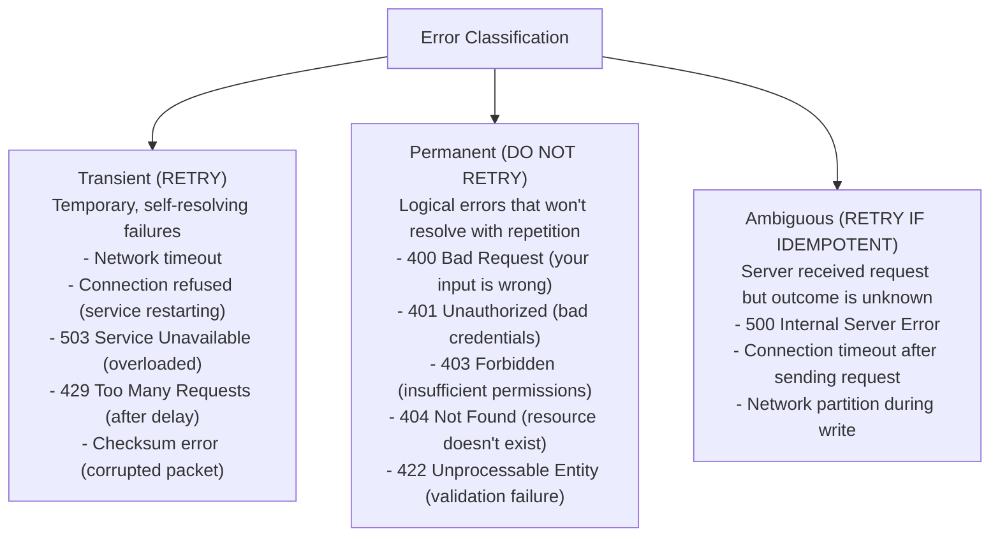
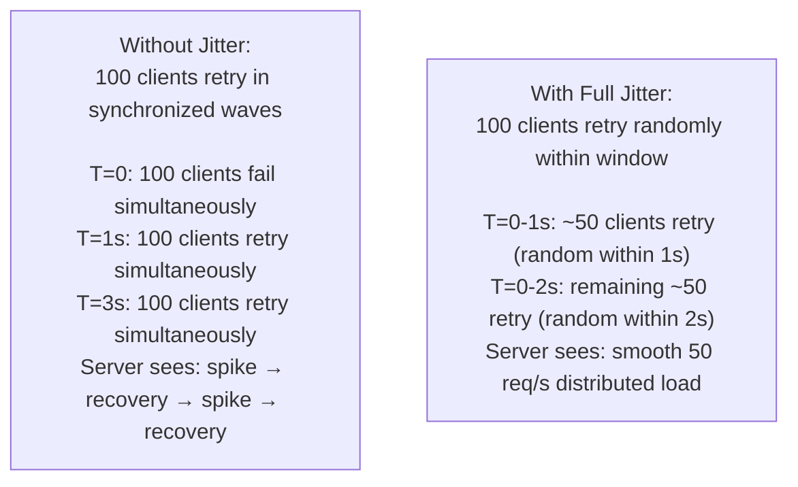
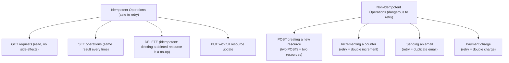
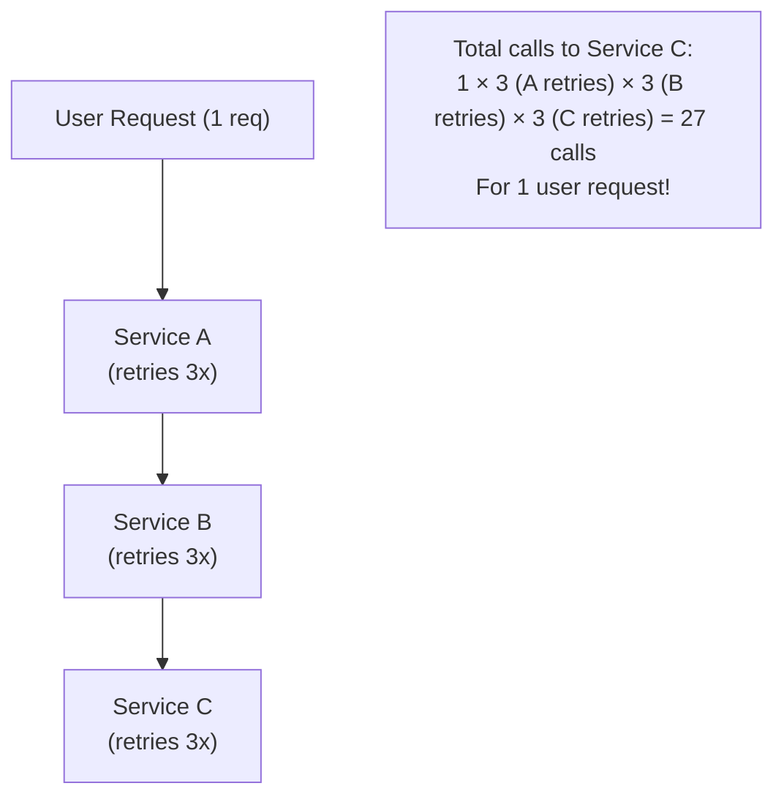
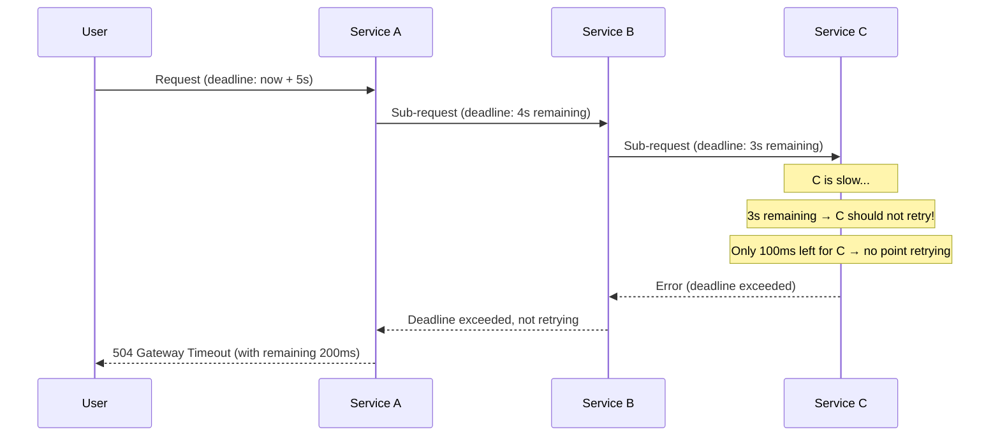

# Retry & Backoff

Retrying failed requests is one of the simplest reliability improvements you can add to a distributed system — and one of the easiest to get wrong. Retrying at the right time, with the right algorithm, on the right type of failure, makes your system resilient to transient errors. Retrying at the wrong time, too aggressively, or on the wrong errors turns a small incident into a catastrophic retry storm that brings down the very service you're trying to reach.

> **Why this matters in interviews:** Every system that makes network calls needs a retry strategy. Interviewers expect you to know which errors are retryable, what exponential backoff is, why jitter is essential, and what makes an operation safe to retry (idempotency). The retry storm anti-pattern is a common interview trap.

---

## What to Retry: Error Classification

Not all errors are retryable. Retrying on the wrong errors causes data duplication, wasted resources, or amplified outages:



**The idempotency requirement for ambiguous errors:** If you retry a request and the server already processed the first attempt, you may end up with duplicate operations (double-charge, duplicate email). Only retry writes if they're idempotent (safe to execute twice with the same result).

---

## Retry Algorithms

### 1. Simple Fixed Retry

```python
import time

def call_with_retry(fn, max_retries=3, delay_seconds=1):
    for attempt in range(max_retries + 1):
        try:
            return fn()
        except TransientError:
            if attempt == max_retries:
                raise
            time.sleep(delay_seconds)
```

**Problem:** If 100 clients all fail at the same time and retry after exactly 1 second, all 100 retry simultaneously — still overwhelming the server. This is a **synchronized retry storm**.

### 2. Exponential Backoff

Wait time doubles with each retry attempt:

$$\text{wait}_n = \text{base} \times 2^{n}$$

```
Attempt 0: Immediate
Attempt 1: Wait 1s
Attempt 2: Wait 2s
Attempt 3: Wait 4s
Attempt 4: Wait 8s
Cap at: 32s (or other max)
```

```python
import time

def call_with_exponential_backoff(fn, max_retries=5, base_delay=1, max_delay=32):
    for attempt in range(max_retries + 1):
        try:
            return fn()
        except TransientError:
            if attempt == max_retries:
                raise
            delay = min(base_delay * (2 ** attempt), max_delay)
            time.sleep(delay)
```

**Better:** Retries spread out over time, reducing load on the recovering service. But synchronized clients still retry at the same intervals.

### 3. Exponential Backoff with Full Jitter

Add randomness to break synchronization among clients:

$$\text{wait}_n = \text{random}(0, \text{base} \times 2^{n})$$

```python
import random, time

def call_with_jitter(fn, max_retries=5, base_delay=1, max_delay=32):
    for attempt in range(max_retries + 1):
        try:
            return fn()
        except TransientError:
            if attempt == max_retries:
                raise
            cap = min(base_delay * (2 ** attempt), max_delay)
            delay = random.uniform(0, cap)  # Full jitter: random in [0, cap]
            time.sleep(delay)
```

**Why jitter works:** Without jitter, 100 clients that all fail at T=0 all retry at T=1s, T=3s, T=7s, T=15s — in synchronized waves. With jitter, retries spread across the entire window: some retry at T=0.1s, others at T=0.7s, others at T=0.95s. The server sees a smooth stream instead of a coordinated spike.



### 4. Decorrelated Jitter (AWS Recommended)

Produces more spread-out retries than full jitter:

$$\text{wait}_n = \text{random}(\text{base}, \text{wait}_{n-1} \times 3)$$

```python
import random, time

def call_with_decorrelated_jitter(fn, max_retries=5, base=0.1, max_delay=32):
    sleep_time = base
    for attempt in range(max_retries + 1):
        try:
            return fn()
        except TransientError:
            if attempt == max_retries:
                raise
            sleep_time = min(random.uniform(base, sleep_time * 3), max_delay)
            time.sleep(sleep_time)
```

**AWS SDK uses decorrelated jitter** for all its retry logic. It produces better spread than full jitter while avoiding very long waits.

---

## Jitter Algorithms Compared

| Algorithm | Description | Avg Wait | Spread | Best For |
|---|---|---|---|---|
| **No jitter** | Fixed exponential | Medium | None | Testing only |
| **Full jitter** | `random(0, cap)` | Low | Excellent | High-concurrency client bursts |
| **Equal jitter** | `cap/2 + random(0, cap/2)` | Medium | Good | Balanced |
| **Decorrelated** | `random(base, prev×3)` | Medium | Excellent | General purpose (AWS default) |

---

## Idempotency: The Safety Requirement for Retries

A retry is only safe if the operation is **idempotent** — executing it multiple times produces the same result as executing it once.



**Making writes idempotent with idempotency keys:**

```python
# Client generates a unique key per operation attempt
def submit_payment(amount: float, card_token: str) -> dict:
    idempotency_key = str(uuid.uuid4())  # Generated once per user action
    
    for attempt in range(3):
        try:
            # If server already processed this key, return cached result
            # Key is attached as a header: Idempotency-Key: <uuid>
            response = payment_api.charge(
                amount=amount,
                card_token=card_token,
                idempotency_key=idempotency_key  # Same key on retry!
            )
            return response
        except NetworkError:
            time.sleep(exponential_backoff(attempt))
```

**Server implementation:** Store `idempotency_key → result` in a cache/DB (with TTL). On receipt:
1. Check if key exists → return cached result (no re-processing)
2. Key doesn't exist → process, store result with key, return result

**Stripe, Braintree, and all major payment APIs** require idempotency keys for this reason.

---

## Retry Budgets

In a microservice chain, a retry at the leaf can cause an exponential explosion of calls:



**Retry budget solution:** Instead of per-request retries, maintain a service-level budget:

```
Total budget: 10% of requests can be retries.
If retries > 10%, stop retrying and fail fast.
```

Google uses retry budgets in their internal RPC framework Stubby. When the budget is exhausted, the service stops retrying entirely rather than amplifying the problem.

---

## Deadline Propagation

Instead of independent timeouts at each hop, propagate a single deadline from the originating request:



**Without deadline propagation:** Service C might retry 3x with backoff even though the user's request deadline has already passed. Those retries are wasted work — the result will never reach the user. The retries add load to C and delay recovery for other requests.

**gRPC, Google's internal RPC, and many service meshes** support deadline propagation natively.

---

## Max Retries and the Retry Storm

**Setting max retries too high is dangerous.** If a service is down for 10 minutes and you retry 20 times with 30s max delay, clients are continuously retrying for 10 minutes, generating 20x the normal load — exactly when the service is trying to recover.

**Anti-patterns:**
- Infinite retries (while True: try; except: retry)
- Retrying immediately without backoff
- Not checking if the retry budget is exhausted
- Retrying non-idempotent operations without idempotency keys

**Production retry configuration (Stripe SDK default):**

```python
# Stripe SDK retries:
# - 2 retries maximum
# - Retries: 500, 503, and network timeouts only
# - No retry on 4xx (client errors)
# - No retry on 429 unless Retry-After header present
# - Exponential backoff with jitter
# - Idempotency keys on all POST requests
```

---

## Real-World Examples

**AWS SDK:** Uses decorrelated jitter exponential backoff with default 3 retries. `max_attempts=4` (1 original + 3 retries). Retries on 5xx, throttling, and network errors. Not on 4xx.

**gRPC:** Status codes `UNAVAILABLE`, `RESOURCE_EXHAUSTED`, and `DEADLINE_EXCEEDED` are retried by default. The client library supports configurable retry policies per RPC method. Supports deadline propagation via `grpc.Deadline`.

**Kafka producer:** `retries` config (default: `Integer.MAX_VALUE` with `delivery.timeout.ms=120s`). Retries on transient broker errors. `max.in.flight.requests.per.connection=1` ensures order preservation during retries.

**Kubernetes pod restarts:** `restartPolicy: Always` + `backoff exponential up to 5 minutes` (CrashLoopBackOff). The cluster retries failed pods with exponential backoff, capped at 5 minutes between retries.

---

## Interview Talking Points

**1. What is exponential backoff with jitter and why is jitter necessary?**
> "Exponential backoff increases the wait time between retries exponentially — 1s, 2s, 4s, 8s — so retries spread out over time and the recovering service isn't immediately overwhelmed. Jitter adds randomness to the wait time. Without jitter, if 100 clients all fail at the same time (a common scenario during a brief outage), they all retry at exactly T=1s, then all again at T=3s, then at T=7s — synchronized waves that hit the service just as it's recovering. With full jitter, each client picks a random wait time in the range [0, cap], so their retries are spread across the entire window. The server sees a smooth stream of 10 retries/second instead of a wave of 100 all at once. AWS recommends decorrelated jitter for the widest spread."

**2. What makes an operation safe to retry?**
> "An operation is safe to retry if it's idempotent — executing it multiple times produces the same result as executing it once. GET requests are naturally idempotent. Writes are not idempotent by default. To make writes retryable, use idempotency keys: the client generates a unique identifier for the operation (UUID), sends it with the request, and includes the same key on retries. The server checks if it already processed that key; if so, it returns the cached result without re-executing the operation. Stripe and Braintree require idempotency keys on all POST requests for this reason. Without idempotency keys, retrying a payment charge risks double-charging the customer. Even if the first attempt timed out (connection reset), the server may have already processed the charge."

**3. What is a retry storm and how do you prevent it?**
> "A retry storm is when a large number of clients simultaneously retry a failing service, amplifying the load at exactly the wrong time — when the service is already struggling to recover. It happens with synchronized retries (no jitter) or too many retries at high concurrency. Prevention: (1) Exponential backoff with jitter to desynchronize clients. (2) Retry budgets: if retries exceed 10% of total requests, stop retrying and return errors — this protects the downstream service from being overwhelmed. (3) Circuit breakers: after N failures, stop all calls to the service, preventing retries at scale. (4) Deadline propagation: don't retry if the user's request deadline has already passed — those retries produce results no one can use. (5) Cap max retries at 3–5; infinite retry is an anti-pattern."

**4. How does deadline propagation improve reliability in microservice chains?**
> "In a microservice chain A → B → C, each service might have its own independent timeout (A: 5s, B: 3s, C: 2s). Without propagation, if the user's 5-second deadline passes, A times out and returns an error — but B and C might still be processing the request, doing wasted work that consumes resources. With deadline propagation, the original deadline (say, T+5s) is passed through every hop. Each service knows how much time remains. If C receives the request with 300ms remaining, it knows not to retry — even a fast success won't reach the user in time. Services can skip expensive operations when the deadline is nearly exhausted. gRPC has first-class deadline support built into its protocol. It reduces wasted work, improves tail latency, and prevents retry amplification when deadlines are already exceeded."

---

## Key Takeaways

- **Only retry transient errors** — never retry 4xx client errors; they won't resolve with repetition
- **Exponential backoff** spreads retries over time — wait grows 1s, 2s, 4s, 8s, 16s
- **Jitter is mandatory** at scale — without it, synchronized clients create retry storms that hit the recovering service in waves
- **Full jitter:** `random(0, cap)` — the simplest effective approach; **decorrelated jitter** is the AWS-recommended default
- **Idempotency keys** make non-idempotent writes safe to retry — always use them for payment, email, write operations
- **Retry budgets** cap the total retry fraction at the service level — prevents retry storms across a fleet of clients
- **Deadline propagation** prevents wasted retries when the user's request has already timed out
- **Max retries should be 3–5** in most cases — more creates amplification risk; combine with circuit breakers for protection
