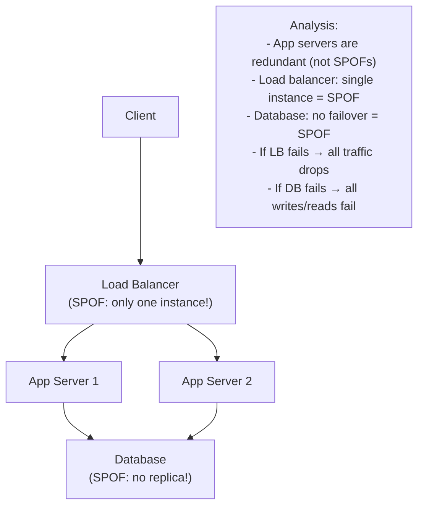
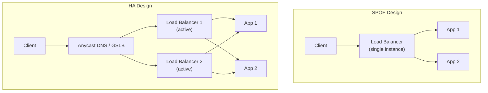
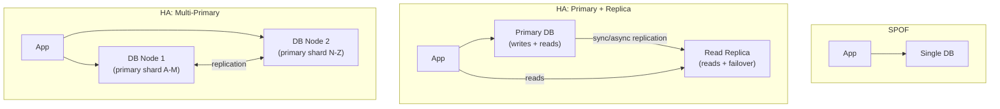
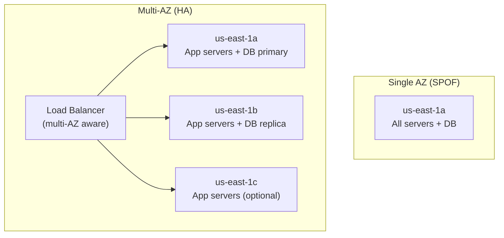
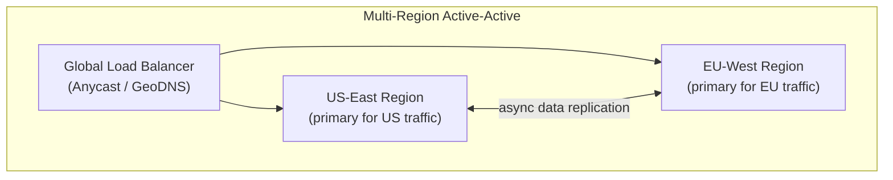
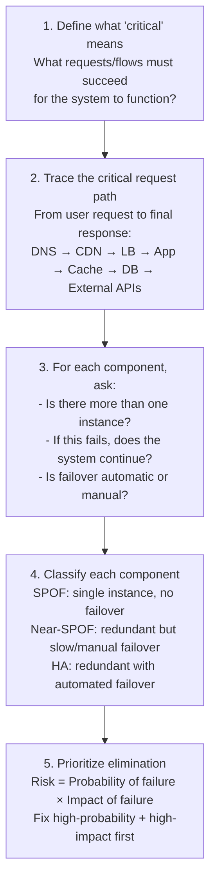
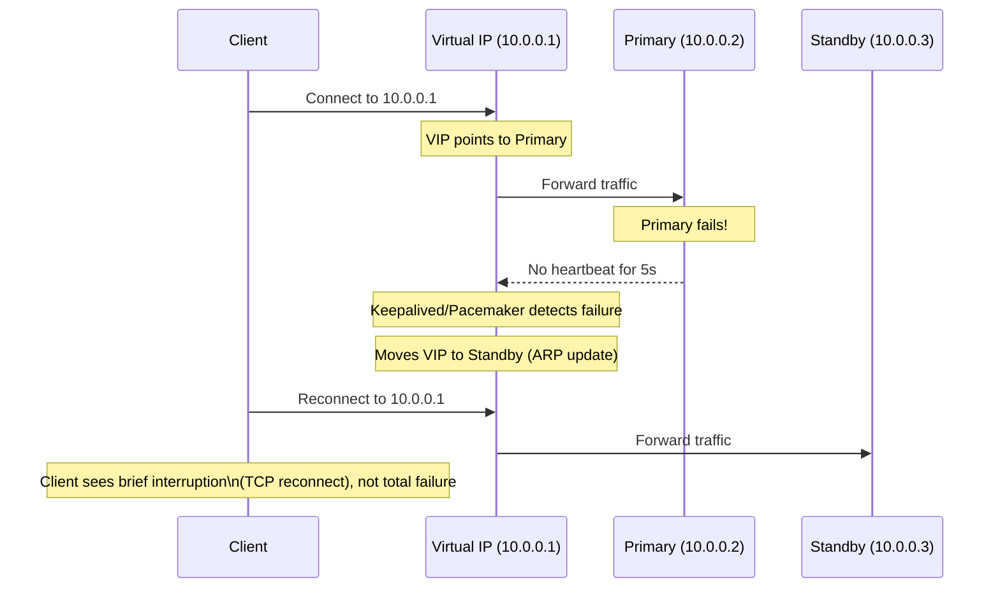

# SPOF (Single Point of Failure)

A Single Point of Failure (SPOF) is any component in a system whose failure causes the entire system — or a critical portion of it — to stop functioning. SPOFs are the reliability enemy in system design: no amount of redundancy elsewhere protects against a SPOF in the critical path. Identifying and eliminating SPOFs is one of the core activities of high-availability architecture.

> **Why this matters in interviews:** "Where are the SPOFs in this design?" is a question senior interviewers explicitly ask. They want to see you systematically trace every request through the architecture and identify components that have no fallback. Every solid system design response includes a section addressing how SPOFs are eliminated.

---

## What Makes Something a SPOF?

A component is a SPOF if:
1. It sits in the critical path of a request (the system can't function without it)
2. There is no redundant instance or fallback
3. Its failure causes system-wide — not just partial — unavailability



---

## Common SPOFs in System Architectures

### 1. Single Load Balancer

A single load balancer in front of redundant app servers defeats the purpose of redundancy:



**Solutions:** VRRP (Virtual Router Redundancy Protocol) with a floating virtual IP that moves to the standby LB on failure. Cloud providers abstract this — AWS ALB, GCP Cloud Load Balancing, Cloudflare are internally redundant.

### 2. Single Database (No Replica)

The most common SPOF in early-stage systems:



### 3. Single DNS Server

If your authoritative DNS server fails, no one can resolve your domain:

**Solutions:** Always configure multiple authoritative nameservers across different providers. Major providers (Route 53, Cloudflare) replicate across their global Anycast network — effectively no DNS SPOF when using them.

### 4. Single Availability Zone

All infrastructure in one AZ fails if the AZ loses power, cooling, or network:



AWS, GCP, and Azure all encourage multi-AZ deployments as the minimum for production workloads.

### 5. Single Message Broker

A Kafka cluster with 3 brokers but replication factor = 1 means any broker failure loses that partition:

```
# SPOF: replication factor 1
kafka-topics.sh --create --topic orders --replication-factor 1 --partitions 3

# HA: replication factor 3 (any 1 broker can fail)
kafka-topics.sh --create --topic orders --replication-factor 3 --partitions 3
```

### 6. Single Cache Instance

A single Redis instance losing its data causes a **cache stampede** — all traffic hits the database simultaneously, potentially overwhelming it:

**Solution:** Redis Sentinel (HA for a single shard) or Redis Cluster (sharded + replicated). Alternatively, design your database to handle the full load when the cache is cold.

### 7. Single Region

Natural disasters, major cloud provider outages, or large-scale power failures can take out an entire region:



Multi-region is expensive and operationally complex. Reserve it for services with genuine global SLA requirements.

---

## SPOF Analysis Methodology

To systematically find SPOFs in any architecture, trace the critical path:



**SPOF audit worksheet:**

| Component | Instances | Failover Type | SPOF? | Mitigation |
|---|---|---|---|---|
| DNS | Anycast (multiple) | Automatic | No | — |
| Load Balancer | 2 (VRRP) | Automatic (VIP) | No | — |
| App Servers | 3 (auto-scaling) | Automatic | No | — |
| Database | 1 (no replica) | Manual | **YES** | Add replica + auto-failover |
| Cache | 1 Redis | Manual | **YES** | Redis Sentinel or Cluster |
| Message Queue | 1 broker | N/A | **YES** | Kafka cluster, min 3 brokers |
| External Payment API | 1 provider | Manual (change code) | **YES** | Add secondary provider |

---

## Eliminating SPOFs: Patterns

### Pattern 1: N+1 Redundancy

Run N instances needed for load, plus 1 extra that activates on failure:
- 3 app servers handle peak load; a 4th starts automatically when one fails
- 2 database replicas; primary has 1 failover target always ready

### Pattern 2: Geographic Redundancy

Spread across AZs (same region) and optionally regions:
- **Multi-AZ:** Protects against data center failure (power, cooling, network); ~99.99% regional availability
- **Multi-Region:** Protects against regional failure; adds latency and consistency complexity

### Pattern 3: Dependency Alternatives

For external dependencies (payment providers, SMS gateways), maintain a secondary provider:

```python
def send_sms(phone: str, message: str) -> bool:
    try:
        return twilio_send(phone, message)
    except TwilioError:
        # Fallback to secondary provider
        return aws_sns_send(phone, message)
```

### Pattern 4: Stateless Design

Stateless services have no SPOF problem — any instance can handle any request. SPOFs almost always involve stateful components. Push state to dedicated, replicated storage rather than keeping it in application memory.

### Pattern 5: Virtual IP (VIP) Failover

For non-cloud environments, use a floating virtual IP address (VIP) that migrates between hosts:



---

## Tradeoffs: Eliminating SPOFs Has Costs

| SPOF Elimination | Cost | Complexity Added |
|---|---|---|
| Add DB replica | 2x DB cost | Replication lag, consistency decisions |
| Multi-AZ deployment | ~1.5–2x infrastructure | Data sovereignty, latency between AZs |
| Multi-region active-active | ~3–5x infrastructure | Global consistency, data residency, operational complexity |
| Secondary payment provider | Dev cost + ongoing maintenance | Routing logic, vendor management |
| Redis Sentinel/Cluster | More Redis nodes | Configuration, failover behavior |

**The practical principle:** Not every SPOF needs to be eliminated with the same urgency. Prioritize by:
1. **Impact:** Would this failure cause complete system outage or partial?
2. **Probability:** How likely is this component to fail?
3. **Detection + Recovery speed:** Even if it fails, how fast can you recover manually?

A low-traffic internal tool with a single database is an acceptable SPOF if manual recovery takes 30 minutes and the business impact is minimal. A payment processing database SPOF is never acceptable.

---

## Interview Talking Points

**1. How do you identify SPOFs in a system design?**
> "I trace the critical request path from user to response — DNS resolution, CDN, load balancer, application server, cache, database, any external APIs. For each component, I ask: how many instances exist? If this fails, does the system continue? Is failover automatic or requires manual intervention? Any component with a single instance and no automatic failover is a SPOF. I also check for correlated failures — two instances in the same AZ or rack can fail together, which is effectively a SPOF. Once identified, I prioritize by multiplying probability of failure by business impact, and eliminate the highest-risk SPOFs first."

**2. What are the most common SPOFs you see in system designs?**
> "The most common are: a single database with no replica (the first thing to fix in almost any growing system); a single load balancer instance (though cloud providers abstract this); all infrastructure in one availability zone (solved by multi-AZ deployment); a single cache instance (cache stampede risk if it fails); and reliance on a single external provider (payment gateway, SMS provider) with no fallback. In microservices, a synchronous dependency that must succeed for every request to complete is a logical SPOF even if the service itself is redundant — if it's in the critical path and it's fully degraded, you have a SPOF."

**3. How is a SPOF different from a bottleneck?**
> "A SPOF is about failure — the component failing causes the system to stop working. A bottleneck is about capacity — the component limits the system's maximum throughput but doesn't cause failure by itself. A slow database is a bottleneck; a database with no replica that crashes is a SPOF. However, a bottleneck can become a SPOF under load if the component becomes so overwhelmed it starts rejecting or failing requests — at that point, overload becomes equivalent to failure. When analyzing systems, I look for both: SPOFs for reliability risk and bottlenecks for scalability limits."

**4. Is a dependency on an external API a SPOF?**
> "It can be, depending on how the system handles its unavailability. If the external API call is synchronous and mandatory (e.g., every checkout requires a real-time fraud check from an external provider), then that provider is effectively a SPOF — its outage is your outage. Mitigations: (1) Fallback provider — route to a secondary provider if the primary times out. (2) Async processing — accept the request, queue it, and process it when the provider recovers. (3) Cached results — use the last known fraud score for returning customers when the service is down. (4) Fail-open — if fraud check is unavailable, approve the transaction but flag for manual review. The right approach depends on the risk profile: fraud prevention may prefer fail-closed (block), while recommendations prefer fail-open (show defaults)."

---

## Key Takeaways

- A **SPOF is any component** whose failure causes the system — or a critical flow — to stop working entirely
- **Trace the critical path:** DNS → LB → App → Cache → DB → External APIs — check every hop for single instances
- **Most common SPOFs:** Single database (no replica), single AZ deployment, single external provider dependency, single cache instance
- **Eliminating SPOFs has costs:** Multi-AZ adds 1.5–2x infrastructure cost; multi-region adds 3–5x with significant operational complexity
- **Prioritize by risk:** Impact × Probability — not all SPOFs warrant the same urgency
- **Stateless design** is the best SPOF prevention for application servers — any instance handles any request
- **Cloud load balancers** (ALB, CLB) are internally redundant — not a SPOF when using managed services
- **Automated failover** matters as much as redundancy — manual failover that takes 30 minutes is much worse than automatic failover in 30 seconds
