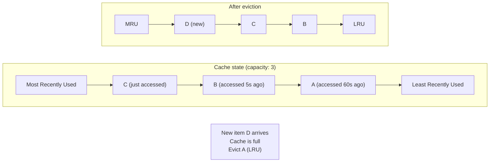
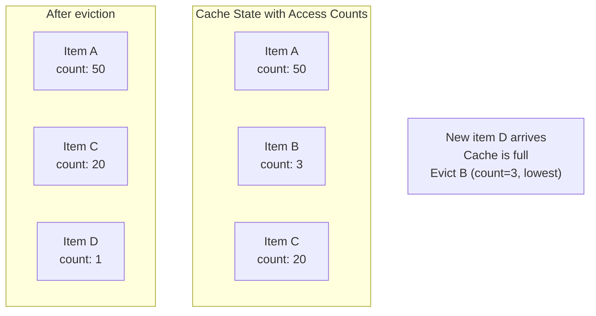
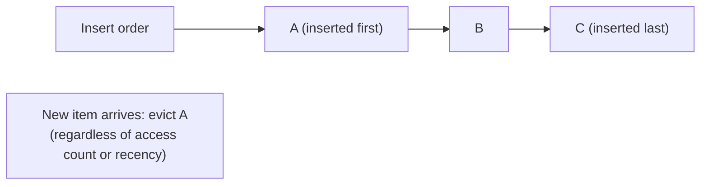
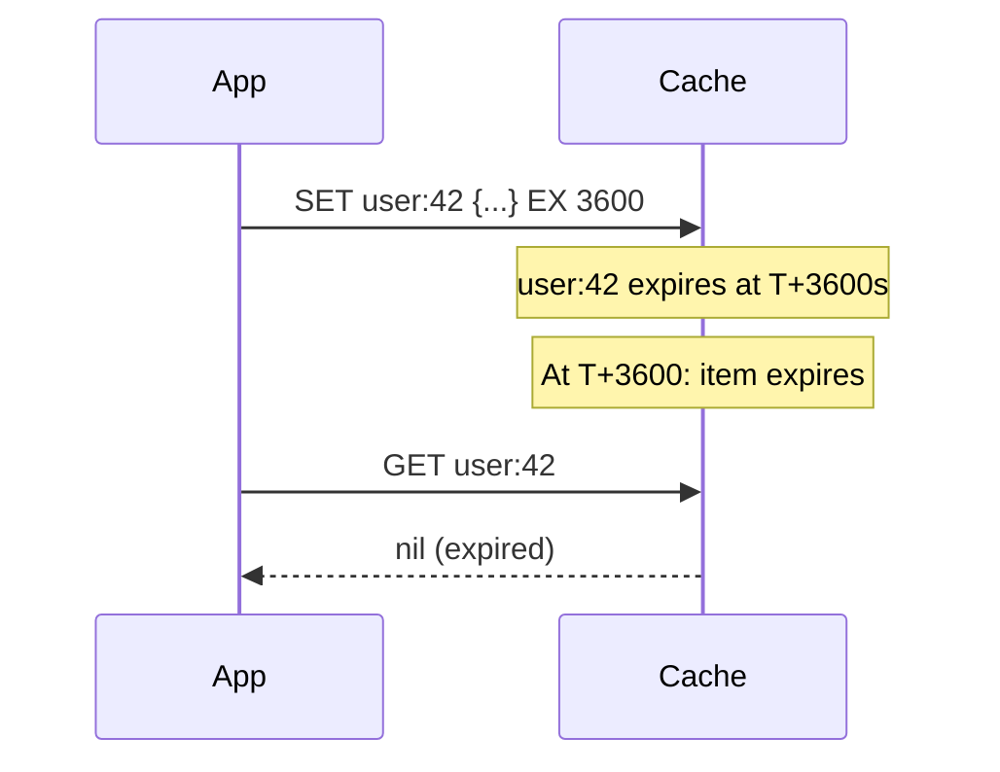
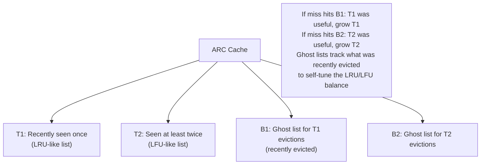
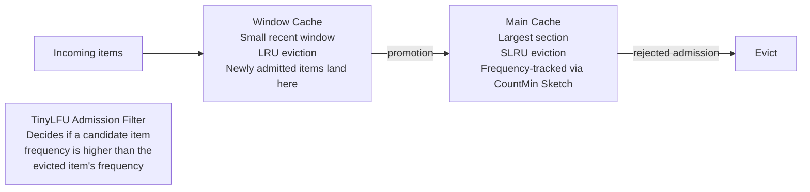
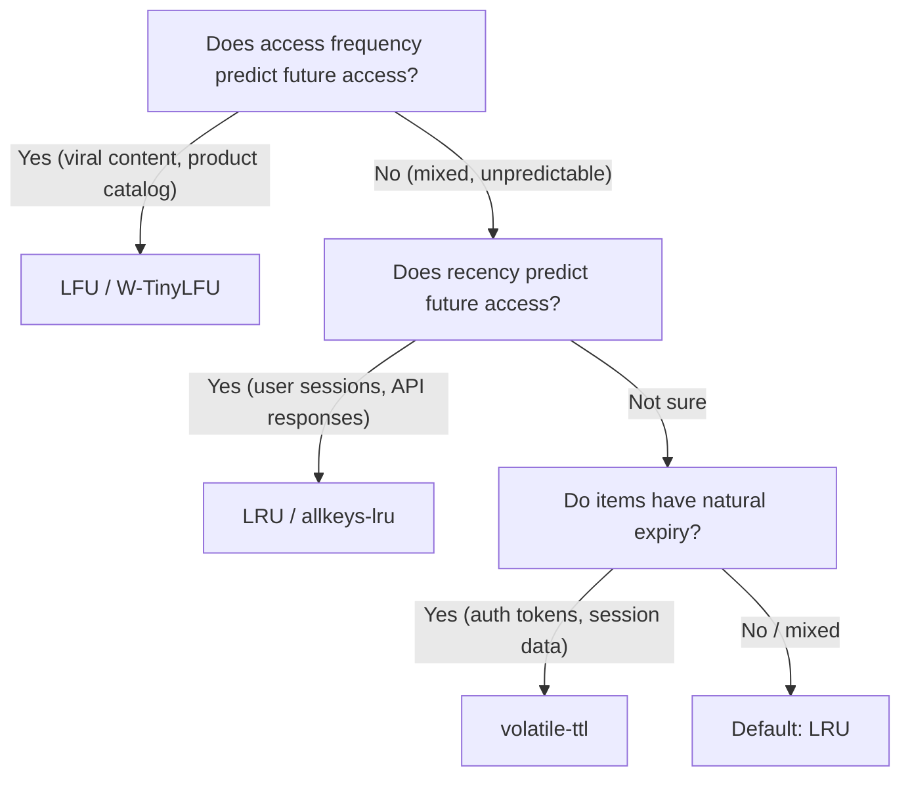

# Cache Eviction Policies

A cache has finite memory. When it's full and a new item needs to be stored, something must be removed. The **eviction policy** determines which item gets removed — and choosing the right policy is the difference between a cache that consistently hits on your hot data and one that constantly evicts items that are about to be requested.

> **Why this matters in interviews:** "Which eviction policy would you use for this cache?" is a targeted interview question that tests whether you've thought about access patterns. LRU is the correct answer for most cases, but knowing _why_, and knowing when LFU, TTL-based, or random eviction is better, demonstrates production cache design experience.

---

## Why Eviction Policy Matters

Consider a cache that holds 3 items. Your access pattern is:

```
A, B, C, D, A, B, C, D, ... (cycling through 4 items repeatedly)
Cache size: 3
```

With **LRU eviction**, when D is accessed and the cache is full [A, B, C], A (least recently used) is evicted. Next cycle: access A → miss (A was evicted)! With 4 items cycling through a size-3 cache, LRU produces 0% hit rate. With a size-4 cache, 100% hit rate.

This "Bélády's anomaly" scenario shows that no single eviction policy is universally optimal — the right policy depends on the access pattern.

---

## Policy 1: LRU — Least Recently Used

**Evict the item that was accessed least recently.** LRU assumes temporal locality: if you haven't used something recently, you're less likely to need it soon.



**Implementation:** Doubly-linked list + hash map. The list maintains insertion/access order; the hash map provides O(1) lookup. On access, move the item to the head. On eviction, remove from the tail.

```python
from collections import OrderedDict

class LRUCache:
    def __init__(self, capacity: int):
        self.capacity = capacity
        self.cache = OrderedDict()

    def get(self, key: str):
        if key not in self.cache:
            return None
        self.cache.move_to_end(key)  # Mark as recently used
        return self.cache[key]

    def put(self, key: str, value):
        if key in self.cache:
            self.cache.move_to_end(key)
        self.cache[key] = value
        if len(self.cache) > self.capacity:
            self.cache.popitem(last=False)  # Remove LRU (head)
```

**Redis implementation:** Redis uses an approximated LRU — it samples N random keys (default: 5) and evicts the one with the oldest access time. Saves memory vs. a true LRU doubly-linked list.

**Best for:** General-purpose caching, session stores, API response caches. Works well when access patterns follow temporal locality (recently used = likely to be used again).

**Weakness:** Poor for scan access patterns where data is read sequentially once and never again — the scan evicts hot data from the cache.

---

## Policy 2: LFU — Least Frequently Used

**Evict the item that has been accessed the fewest total times.** LFU assumes frequency-based locality: popular data stays, rarely accessed data gets evicted.



**Best for:** Data with stable popularity (viral content, popular products, top articles). Item access frequency is a good predictor of future access.

**Weakness:**

- **Cache pollution from historical popularity:** An item accessed 1000 times in the past but never needed now will never be evicted — it clings on via accumulated count. LFU can't adapt to changing access patterns.
- **New item disadvantage:** A newly added item starts with count=1 and may be immediately evicted even if it's very popular going forward.
- **Higher implementation complexity and memory overhead** (must track counts).

**Improvement — LFU with aging:** Decay counts over time (halve counts every hour) so old popularity doesn't dominate forever. Implemented in the **ARC** policy.

---

## Policy 3: FIFO — First In, First Out

**Evict the item that was inserted first.** The oldest entry in the cache, by insertion time, gets removed.



**Weakness:** Ignores both recency and frequency. An item inserted first but frequently used gets evicted before a recently-inserted item that will never be used again. Generally outperformed by LRU.

**When it's acceptable:** When all cached items have equal lifetime and uniform access probability. Rarely the right choice for application caches; more common in network packet buffers.

---

## Policy 4: TTL — Time To Live

**Every item has an expiration timestamp. Items expire and are evicted after their TTL.** This isn't a replacement for LRU/LFU — TTL is combined with another policy (in Redis, you set TTL per key AND choose an eviction policy for when capacity is exceeded).



**Redis TTL policies for memory pressure:**

- `volatile-lru`: Evict the least recently used item **among items with TTL set**
- `volatile-lfu`: Evict least frequently used among TTL items
- `volatile-ttl`: Evict item with the **shortest remaining TTL** (nearest expiry)
- `allkeys-lru`: Evict least recently used across ALL keys
- `allkeys-lfu`: Evict least frequently used across ALL keys
- `noeviction`: Return error when full (for databases using Redis as primary store)

---

## Policy 5: Random Replacement

**Evict a randomly chosen item** when the cache is full.

**When it's surprisingly effective:** In many real-world workloads with a highly skewed access distribution (the Zipf distribution — a small number of items get the vast majority of accesses), random eviction keeps most of the popular items because the popular items are numerous enough to survive random selection. Studies have shown random eviction achieves 80–90% of LRU's hit rate with much simpler implementation.

**Used in:** CPU hardware caches (for speed), some web proxy caches, simple embedded systems.

---

## ARC — Adaptive Replacement Cache

ARC adapts between LRU and LFU behavior based on the workload, self-tuning the balance:



ARC consistently outperforms both pure LRU and pure LFU across diverse workloads because it adapts to the actual access pattern rather than assuming one model. **Used in: ZFS, many enterprise storage systems.**

---

## W-TinyLFU: The Modern Champion

Caffeine (Java) and many modern in-process caches use **Window TinyLFU**, which achieves near-optimal hit rates:



W-TinyLFU uses a compact **CountMin Sketch** (a probabilistic data structure) to estimate access frequency with very low memory overhead. New items go into a small recency window (handling the "new item disadvantage" of LFU), and only graduate to the main cache if they're accessed frequently.

**Performance:** Achieves 95%+ of optimal hit rate (Bélády's optimal offline algorithm) across trace-driven benchmarks.

---

## Redis Eviction Policies Summary

Redis supports 8 eviction policies (set with `maxmemory-policy`):

| Policy            | Description                  | Best For                                |
| ----------------- | ---------------------------- | --------------------------------------- |
| `noeviction`      | Return error when full       | Redis as primary DB                     |
| `allkeys-lru`     | Evict LRU from all keys      | General caching                         |
| `allkeys-lfu`     | Evict LFU from all keys      | Stable popularity patterns              |
| `allkeys-random`  | Random from all keys         | Uniform access probability              |
| `volatile-lru`    | Evict LRU from keys with TTL | Mixed use (some with TTL, some without) |
| `volatile-lfu`    | Evict LFU from keys with TTL | Mixed use, frequency-based              |
| `volatile-ttl`    | Evict soonest-to-expire      | When TTL is a proxy for importance      |
| `volatile-random` | Random from keys with TTL    | Simple mixed use                        |

**Production recommendation for caches:** `allkeys-lru` or `allkeys-lfu`.
**For session stores:** `volatile-ttl` — the session closest to expiry is least valuable.

---

## Choosing the Right Policy



---

## Interview Talking Points

**1. What is the LRU eviction policy and how is it implemented efficiently?**

> "LRU (Least Recently Used) evicts the item that was accessed least recently, assuming that recently accessed items are more likely to be needed again. The classic O(1) implementation uses a doubly-linked list for ordering (most recent at head, least recent at tail) plus a hash map for O(1) key lookup. On access, the item moves to the head. On eviction, the tail item is removed. Redis uses an approximation: it samples a random subset of keys and evicts the one with the oldest access time, which avoids the memory overhead of a true doubly-linked list across millions of keys."

**2. When would you choose LFU over LRU?**

> "LFU (Least Frequently Used) evicts the item accessed the fewest times total. Choose LFU when access frequency is a stable predictor of future access — for example, content libraries where popular items stay popular (YouTube videos, product catalog hits). LFU outperforms LRU for these stable workloads. But LFU has two weaknesses: cache pollution (historically popular items that are no longer needed accumulate high counts and never get evicted), and new item disadvantage (new items start at count=1 and may get immediately evicted). W-TinyLFU addresses both by combining a recency window with frequency tracking using a CountMin Sketch."

**3. What is a TTL and how does it interact with an eviction policy?**

> "TTL (Time To Live) is a per-item expiration time. When the TTL expires, the item is no longer valid and is removed from the cache on the next access or by a background sweep. TTL is a consistency mechanism — it bounds how stale cached data can be. Eviction policies handle capacity — when the cache is full and a new item must be inserted. They're orthogonal: you can have LRU eviction with TTLs on every item. In Redis, `volatile-lru` evicts the least recently used item that has a TTL set, leaving items without TTL (permanent data) alone. `allkeys-lru` evicts any item regardless of TTL."

**4. What is the difference between cache eviction and cache invalidation?**

> "Eviction is capacity-driven: when the cache is full, the eviction policy selects a victim to remove to make room for a new item. Invalidation is correctness-driven: when underlying data changes (a database write), the cached copy must be marked invalid or deleted so the next read gets fresh data. Eviction happens automatically by the cache layer based on the configured policy. Invalidation must be implemented by the application — either actively deleting the cache key on write (cache-aside + delete), or passively via TTL expiry (data is stale for at most TTL seconds). If you fail to invalidate, users see stale data. If you fail to evict properly, the cache fills with cold data and hot data gets pushed out."

---

## Key Takeaways

- Cache eviction determines **which item is removed when the cache is full** — it directly impacts hit rate
- **LRU** (Least Recently Used) is the correct default — evicts the oldest-accessed item. O(1) with a doubly-linked list + hash map.
- **LFU** (Least Frequently Used) outperforms LRU for stable popularity patterns but struggles with new items and changing access patterns
- **TTL-based eviction** (`volatile-ttl`) is appropriate when TTL correlates with item value (sessions near expiry are least valuable)
- **W-TinyLFU** (used in Caffeine / Guava) is the modern state-of-the-art — near-optimal across diverse workloads
- **Redis production recommendation:** `allkeys-lru` for caches; `noeviction` for primary data stores
- Eviction (capacity) and invalidation (correctness) are **separate concerns** — both must be handled
- The "right" policy depends on the **access pattern** — temporal locality (LRU), frequency-based (LFU), or natural expiry (TTL)
