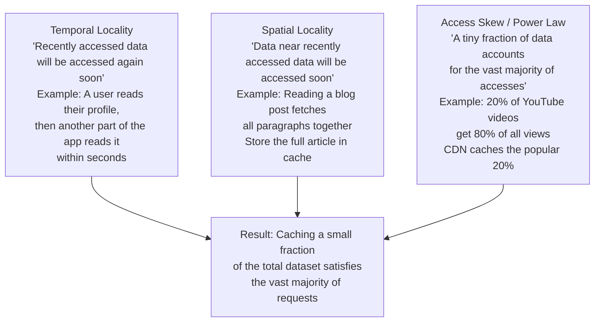
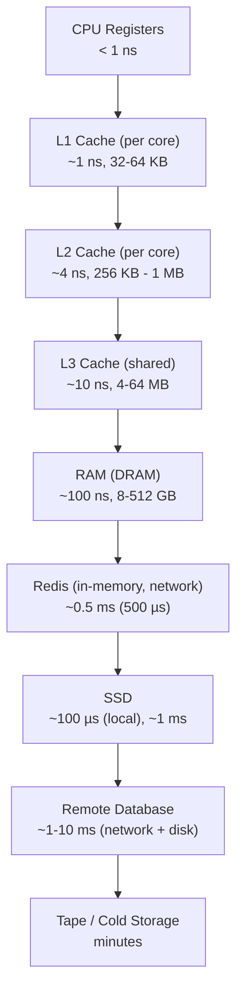
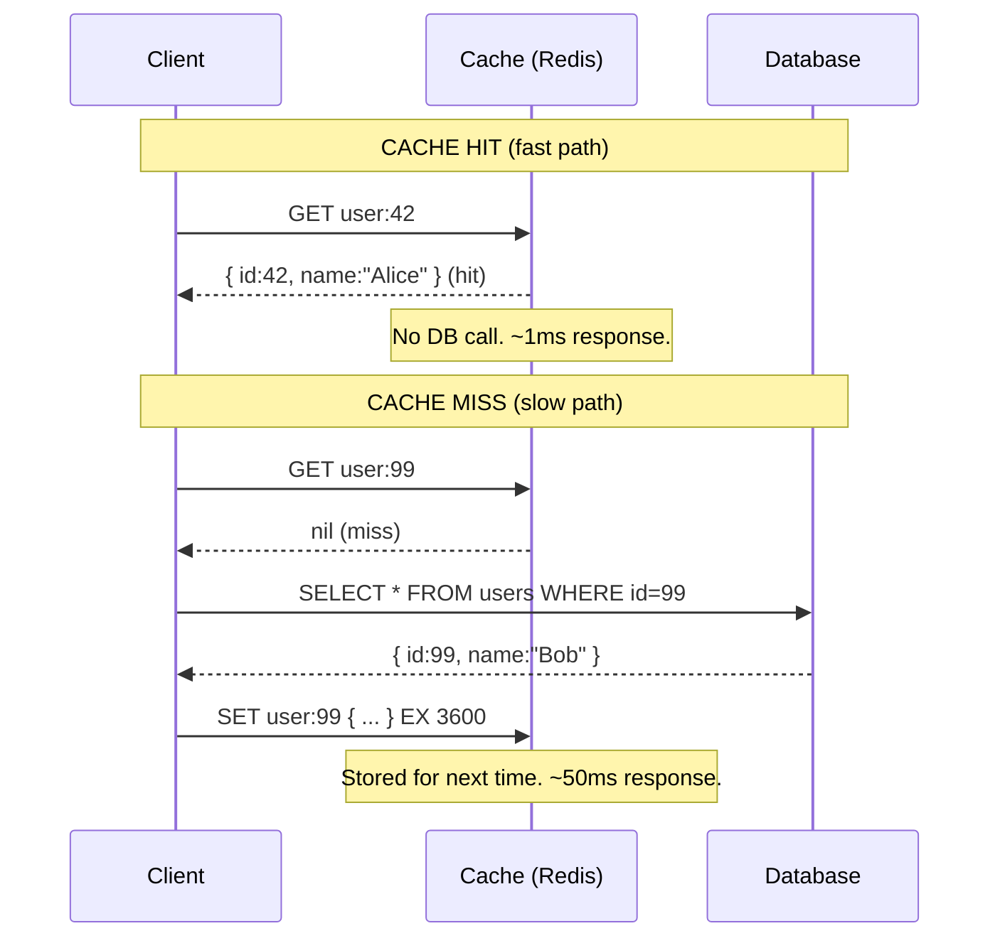
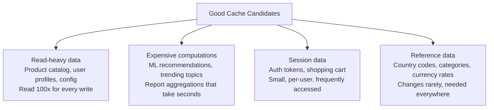
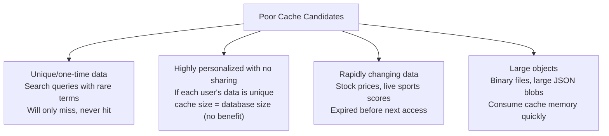
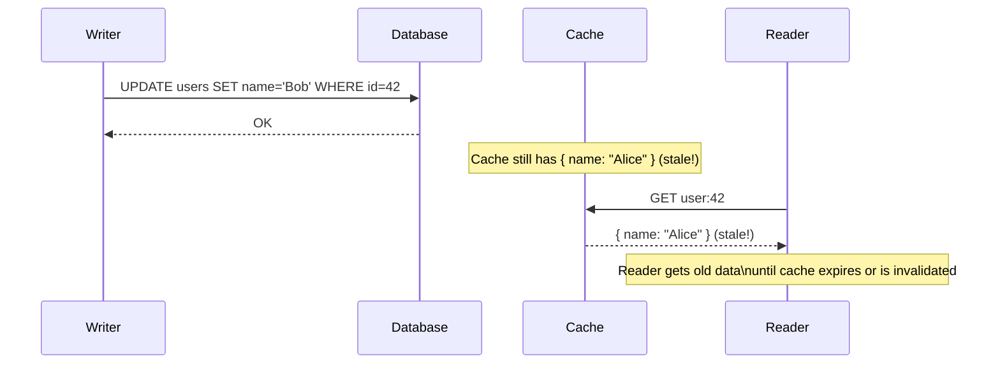
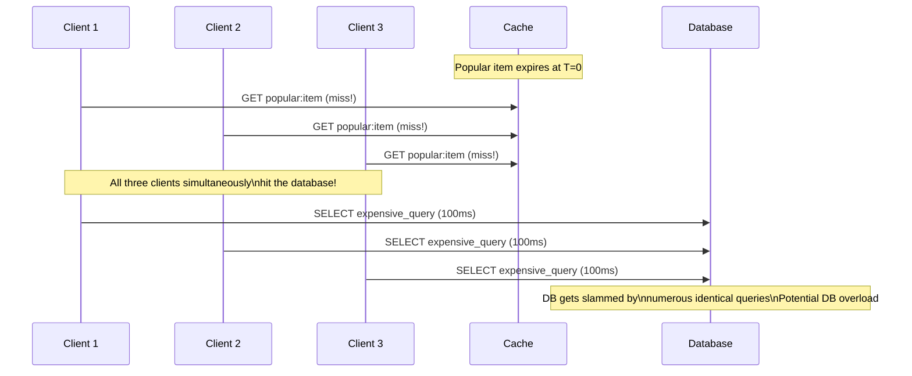
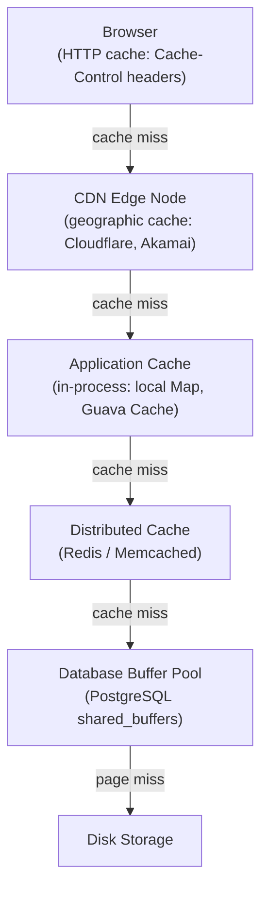

# Caching 101

A cache is a **high-speed data storage layer** that stores a subset of data, typically the most frequently accessed or recently used, so future requests for that data can be served faster than reading from the original source. Caching is the single highest-leverage performance optimization in distributed systems — nothing else comes close.

> **Why this matters in interviews:** Caching is present in virtually every system design at scale. From CPU L1 caches to browser caches to CDN edge caches to Redis application caches to database buffer pools, caching appears at every layer of the stack. When you say "we'll cache hot data in Redis," an interviewer expects you to follow up with: what data, what invalidation strategy, what consistency guarantees, and what happens on cache failure.

---

## Why Caching Works: The Principle of Locality

Caching exploits a universal pattern in how data is accessed:

**The 80/20 rule for caching:** In most systems, 20% of data accounts for 80% of all reads. If you can cache that 20%, you eliminate 80% of database load. Twitter found that caching the most popular tweets allowed their CDN to serve ~98% of timeline requests without hitting origin servers.

---

## The Cache Hierarchy

Every modern system has multiple cache layers, each progressively slower but larger:

As a system designer, you operate on the Redis and above layers. But understanding the full hierarchy builds intuition for why in-memory caching (Redis) is so much faster than database queries.

**The key numbers:**

- RAM access: ~100 ns
- Redis (in-memory, network): ~500 µs (5,000x slower than RAM, due to network)
- SSD read: ~100 µs (local), or ~1-10 ms
- PostgreSQL query (with disk I/O): ~1–100 ms
- **Caching saves 10x–1000x on latency**

---

## Cache Hit, Miss, and Hit Rate

**Hit Rate** = Cache Hits / (Cache Hits + Cache Misses)

| Hit Rate | Meaning                                      |
| -------- | -------------------------------------------- |
| 99%+     | Excellent — database barely touched          |
| 90–99%   | Good — significant load reduction            |
| 70–90%   | Moderate — cache helping but room to improve |
| < 70%    | Poor — check your cache key design and TTL   |

**Why even 90% is transformative:** If you have 10,000 req/sec and 90% hit rate, only 1,000 requests/sec reach the database. That's 9,000 req/sec that would have hammered your database — handled by Redis instead.

---

## Cache Miss Scenarios

Not all misses are the same:

### Cold Miss (Compulsory Miss)

The first access to any item — it has never been cached. Inevitable. After a server restart or a first deployment, the cache is empty (cold). Mitigate with **cache warming** (pre-populating the cache from the database on startup).

### Capacity Miss

The cache is full and an item was evicted to make room for newer data. Mitigate by increasing cache size or improving the eviction policy.

### Staleness Miss (Invalidation Miss)

The data changed and the cache entry was invalidated. The next request misses and fetches fresh data. This is intentional — it's how you maintain consistency.

---

## What to Cache (and What Not To)

### Good Cache Candidates

### Poor Cache Candidates

---

## Cache Consistency: The Core Tradeoff

Caching introduces a consistency challenge. The cache may serve **stale data** — data that has changed in the database but not yet been updated in the cache.

**The consistency-performance tradeoff:**

- **Shorter TTL** → more consistency (data goes stale for a shorter time) → lower hit rate (more misses)
- **Longer TTL** → higher hit rate (more efficient caching) → more staleness risk

**The right TTL depends on the data:**
| Data Type | Typical TTL |
|---|---|
| User profile | 5–60 minutes |
| Product catalog | 1–24 hours |
| Config/feature flags | 5–30 minutes |
| Session tokens | Match session duration |
| News articles | 5–15 minutes |
| Currency rates | 1 minute |
| Stock prices | Don't cache (or < 1 second) |

---

## Cache Stampede (Thundering Herd)

A dangerous failure mode:

**Solutions:**

1. **Mutex lock:** Only one process fetches from DB. Others wait for the cache to be populated.
2. **Probabilistic early expiration (PER):** Before TTL expires, with some probability, proactively refresh the cache. Prevents simultaneous expiry.
3. **Stale-while-revalidate:** Serve stale data while asynchronously refreshing. Client gets a fast response; refresh happens in background.
4. **Jittered TTL:** Add random offset to TTL (e.g., 3600 ± 300 seconds) so not all entries for the same data type expire simultaneously.

---

## Cache Layers in a Real System

Each layer serves requests for its cache hits, passing misses to the next layer. A well-tuned system has most requests satisfied at the CDN or Redis layer, with only a small fraction reaching the database.

---

## Real-World Cache Usage

**Facebook:** Memcached cluster with exabytes of data. 70%+ of Facebook reads are served from cache. They run thousands of Memcached servers. TAO (Facebook's graph data caching layer) serves billions of graph reads per second.

**Twitter:** Every timeline read hits an in-memory timeline cache first. The home timeline for each user is pre-computed and cached. About 98% of timeline reads are cache hits.

**Redis at GitHub:** GitHub uses Redis for session storage, rate limiting, job queues, and pub/sub. Redis cluster handles millions of operations per second with microsecond latency.

**Google:** The PageRank computation is cached. Search result pages are cached. The entire Google index is itself a specialized cache — a pre-computed representation of the web for fast query answering.

---

## Interview Talking Points

**1. What is a cache and why does caching work so well?**

> "A cache is a high-speed storage layer that sits in front of a slower data source, serving frequently accessed data without the expense of re-fetching it. Caching works because of locality: temporal locality (recently accessed data tends to be accessed again soon) and access skew (a small fraction of data, often 20%, accounts for the vast majority of reads, often 80%). If you cache that 20%, you eliminate 80% of database load. The result is dramatically lower latency (Redis ~0.5ms vs. database ~10ms) and dramatically higher throughput (serving from memory vs. disk I/O)."

**2. What is cache hit rate and why does it matter?**

> "Cache hit rate is the percentage of requests served from the cache vs. the total requests. A 99% hit rate means only 1% of requests reach the database. If you have 100,000 requests/sec and 99% hit rate, only 1,000 req/sec hit the database — that's the difference between a database that can handle the load and one that falls over. I'd monitor hit rate in production and investigate if it drops below ~90% for a hot cache. Causes of poor hit rate: TTL too short, cache key too granular (every user-specific query gets its own key), or simply caching data that isn't accessed repeatedly."

**3. What is a cache stampede and how do you prevent it?**

> "Cache stampede (thundering herd) happens when a popular cache entry expires and many concurrent requests all miss simultaneously — all of them hit the database at once with the same expensive query. If that query takes 100ms and 1,000 requests hit it simultaneously, you've effectively DDoS'd your own database. Prevention: mutex lock (only one request populates the cache, others wait), stale-while-revalidate (serve stale data while refreshing asynchronously), or probabilistic early expiration (start refreshing before the TTL expires, probabilistically, before the expiry timestamp is reached). Jittering TTLs (adding random offsets) prevents coordinated expiry of many items."

**4. What data should you NOT cache?**

> "Data that changes so frequently it's stale before being read again (real-time stock prices, live sports scores). Data that's unique to each request (one-off search queries that won't recur). Large binary objects that consume memory disproportionate to the benefit. Financial or highly sensitive data where any staleness is unacceptable — for a bank balance, you may need to go to the database every time. And in some cases, highly personalized data where every user's cached data is unique and the cache becomes as large as the database itself with no load reduction benefit."

---

## Key Takeaways

- A cache stores **frequently accessed data** in a faster medium — fundamental to performance at scale
- Caching works because of **temporal locality**, **spatial locality**, and **access skew** (80/20 rule)
- **Hit rate** is the primary cache health metric — 99% means 99% of reads never reach the database
- Three miss types: **cold** (first access), **capacity** (cache full), **staleness** (intentional invalidation)
- Cache good candidates: **read-heavy, expensive to compute, reference data, sessions** — not rapidly changing or unique-per-request data
- The core tradeoff: **consistency vs. performance** — shorter TTL = fresher data but lower hit rate
- **Cache stampede** (thundering herd) is a production failure mode — prevent with mutex locks, stale-while-revalidate, or jittered TTLs
- Caches exist at every layer: browser, CDN, application, Redis, database buffer pool — each adds a hit opportunity before disk
