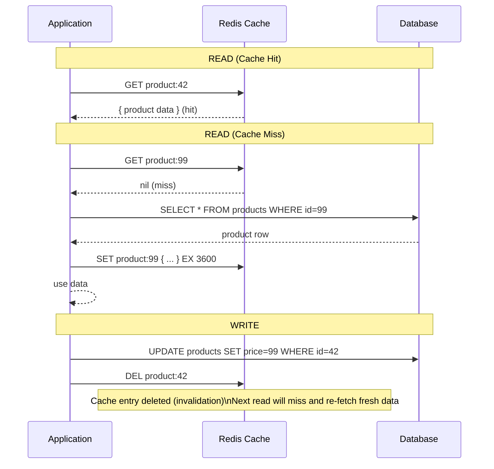
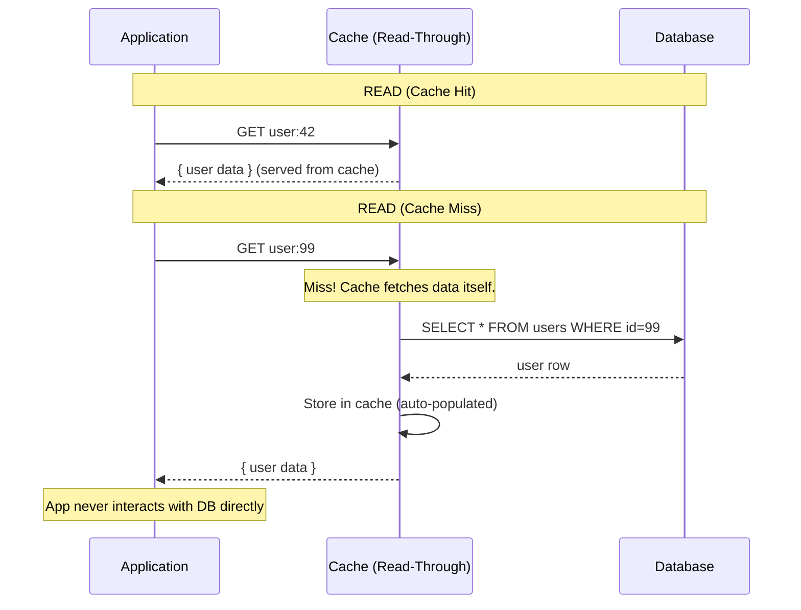
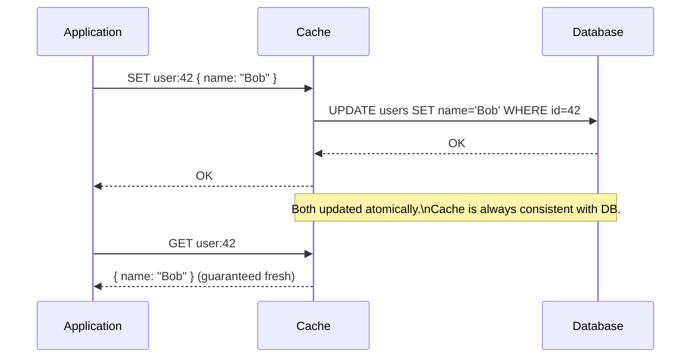
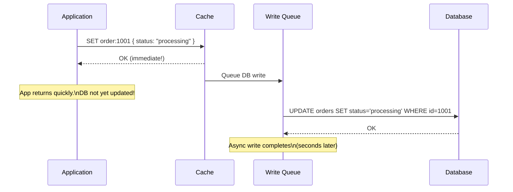
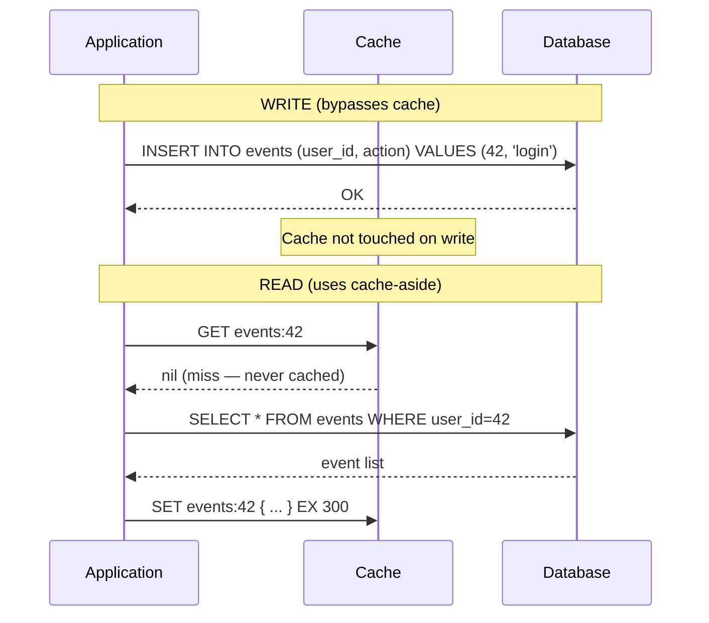
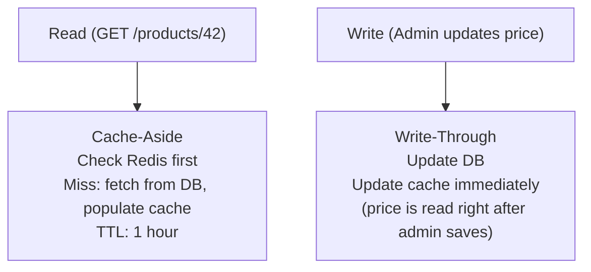
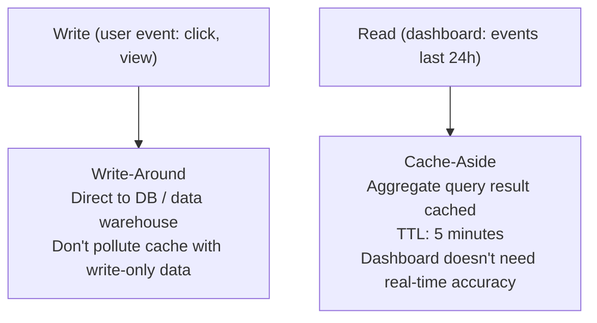
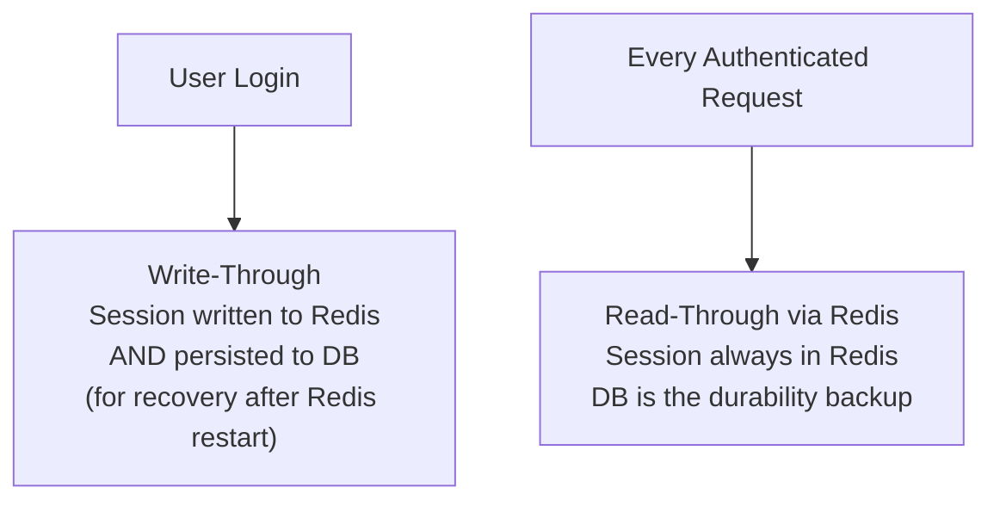

# Caching Strategies

Caching strategies define **when data is loaded into the cache and when the cache is updated** relative to reads and writes. Choosing the wrong strategy leads to stale data, cache pollution, write amplification, or thundering herd problems. There are five core strategies, each with specific use cases.

> **Why this matters in interviews:** When you say "we'll cache this in Redis," the interviewer will ask: "How does the cache get populated? What happens when the database is written? How do you handle cache misses?" These questions probe your understanding of caching strategies. Getting this right is the difference between a system that scales gracefully and one that corrupts data or falls over under load.

---

## Strategy 1: Cache-Aside (Lazy Loading)

The application code explicitly manages the cache. **The application checks the cache first; on a miss, it reads from the database and populates the cache.**



**Code pattern:**

```python
def get_product(product_id: str) -> dict:
    # 1. Check cache
    cached = redis.get(f"product:{product_id}")
    if cached:
        return json.loads(cached)

    # 2. Cache miss — fetch from DB
    product = db.query("SELECT * FROM products WHERE id = %s", [product_id])
    if not product:
        return None

    # 3. Populate cache
    redis.setex(f"product:{product_id}", 3600, json.dumps(product))
    return product

def update_product_price(product_id: str, new_price: int):
    db.execute("UPDATE products SET price = %s WHERE id = %s", [new_price, product_id])
    redis.delete(f"product:{product_id}")  # Invalidate cache
```

**Characteristics:**

| Property             | Value                                 |
| -------------------- | ------------------------------------- |
| **When populated**   | On first read (lazy)                  |
| **Cache contents**   | Only data that was actually requested |
| **Startup behavior** | Cold cache — misses until warmed      |
| **Stale data risk**  | Low if invalidation is done on write  |
| **Write path**       | DB only (with cache invalidation)     |

**Best for:** General-purpose read caching. The default strategy for most systems. Works well when reads far outnumber writes.

**Watch out for:** Cache stampede on first request. Stale data if cache invalidation is missed. Cold start after a cache server restart.

---

## Strategy 2: Read-Through

The **cache layer itself** is responsible for fetching from the database on a miss. The application only talks to the cache — never the database directly.



The application treats the cache as its data source. The cache is an **intelligent proxy** — it knows how to load data from the database.

**Difference from Cache-Aside:**

- Cache-Aside: App fetches from DB on miss, populates cache
- Read-Through: Cache fetches from DB on miss, app never touches DB

**Best for:** Frameworks like Hibernate (second-level cache), AWS ElastiCache with read-through configuration, or Redis modules with read-through plugins. Simplifies application code — one data access path.

---

## Strategy 3: Write-Through

**Every write goes to both the cache and the database synchronously.** The cache is always consistent with the database.



**Characteristics:**

| Property                | Value                                  |
| ----------------------- | -------------------------------------- |
| **Write latency**       | Higher (waits for both cache AND DB)   |
| **Read latency**        | Very low (cache always has fresh data) |
| **Consistency**         | Strong — cache and DB always in sync   |
| **Cache contents**      | Everything ever written (good and bad) |
| **Write amplification** | Every write hits both systems          |

**Problems with write-through:**

1. **Write amplification:** Every write touches two systems — latency doubles on writes.
2. **Cache pollution:** Data written once and never read again takes up cache space.
3. **Wasted writes:** If you write 1000 product records in a batch import but only 50 are ever read, you've populated cache with 950 entries that will never be hits.

**Best for:** Data that is written and immediately read back (user profiles, settings). Systems where cache misses are expensive and freshness is critical.

---

## Strategy 4: Write-Behind (Write-Back)

**Writes go to the cache first; the database is updated asynchronously later.** The application gets fast write acknowledgment; the cache queues up database writes.



**Characteristics:**

| Property            | Value                                         |
| ------------------- | --------------------------------------------- |
| **Write latency**   | Very low (just cache write)                   |
| **Read latency**    | Very low (always in cache)                    |
| **Consistency**     | Eventual — DB may be behind                   |
| **Durability risk** | If cache crashes before write-back: data loss |
| **Complexity**      | High — write queue, retry logic               |

**The durability risk is real:** If the cache server crashes between the application write and the async database write, the data is lost. Mitigation: Redis AOF persistence (write-behind durability), or acknowledge only after cache AND write-queue persistence.

**Best for:** High write throughput where write latency matters more than strict durability (analytics events, activity logs, non-critical counters). NOT for financial transactions or user data where data loss is unacceptable.

---

## Strategy 5: Write-Around

**Writes go directly to the database, bypassing the cache entirely.** Reads still use cache-aside.



**Best for:** Write-once, read-rarely data (audit logs, event logs). Data where you write in bulk (batch imports) and cache only when actually read. Prevents write-through's cache pollution problem.

---

## Strategy Comparison

| Strategy          | Write Path            | Read Path                    | Consistency                  | Write Latency      | Best For                    |
| ----------------- | --------------------- | ---------------------------- | ---------------------------- | ------------------ | --------------------------- |
| **Cache-Aside**   | DB + DEL cache        | Check cache, miss goes to DB | Good (if invalidation works) | Low (just DB)      | General purpose reads       |
| **Read-Through**  | DB (cache bypassed)   | Cache handles DB fetch       | Good                         | Low                | Simplified read path        |
| **Write-Through** | Cache + DB (sync)     | Always in cache              | Strong                       | High (both writes) | Write then immediately read |
| **Write-Behind**  | Cache only (async DB) | Always in cache              | Eventual                     | Very low           | High write throughput       |
| **Write-Around**  | DB only (no cache)    | Cache-aside                  | Good                         | Low (just DB)      | Write-heavy, read-rare data |

---

## Combining Strategies: Real-World Patterns

### E-commerce Product Catalog



### High-Volume Event Ingestion (Analytics)



### Session Store



---

## Interview Talking Points

**1. What is the difference between Cache-Aside and Read-Through?**

> "In Cache-Aside, the application is responsible for the cache: on a miss, the application queries the database and populates the cache itself. The application has two code paths: one for cache hits, one for misses that includes database access. In Read-Through, the application only talks to the cache. On a miss, the cache layer itself fetches from the database and populates itself. The application code is simpler (one data access path), but it requires a cache layer that knows how to load from the database — common in ORM second-level caches or smart cache proxies."

**2. What is write-through caching and when would you use it?**

> "Write-through updates both the cache and the database synchronously on every write. The cache is always consistent with the database — every read is guaranteed to be fresh. Use it when data is written and immediately read back (user settings, account balances), or when cache misses are very expensive. The downside is write amplification: every write touches two systems, increasing write latency. There's also cache pollution — data that's written but never read wastes cache memory."

**3. What is the risk of write-behind caching and when is it acceptable?**

> "Write-behind (write-back) writes only to the cache first, then asynchronously flushes to the database. The risk is data loss: if the cache server crashes before the async write completes, you lose the data. It's acceptable for non-critical, high-volume data where write throughput is the priority and occasional data loss is tolerable — analytics events, access logs, view counters. It's NOT acceptable for financial transactions, user account data, or anything where 'we lost that write' causes business or compliance problems. Mitigation: Redis AOF persistence ensures cache writes survive restarts even before the async DB write."

**4. How do you choose a caching strategy for a new feature?**

> "I ask four questions: How often is it read vs. written? If read-heavy, Cache-Aside works well. How fresh does cached data need to be? If users need strong consistency (account balance), write-through. If eventual is fine (product catalog), Cache-Aside with TTL. Is write throughput a concern? If writing millions of events per second, write-behind. Is the data written and then immediately read by the same user? Write-through or write-behind. Most CRUD applications start with Cache-Aside (lazy loading) for reads and cache invalidation on writes — it's simple, effective, and avoids the complexity of other patterns until you have a specific reason to need them."

---

## Key Takeaways

- **Cache-Aside:** App manages the cache explicitly. Cache is populated on read miss. Simple and general-purpose. The default starting point.
- **Read-Through:** Cache fetches from DB on miss. App only talks to cache. Simplifies application code.
- **Write-Through:** Every write updates cache + DB synchronously. Always consistent but adds write latency.
- **Write-Behind:** Writes to cache only; DB updated asynchronously. Fastest writes but risks data loss on cache crash.
- **Write-Around:** Writes bypass cache, go directly to DB. Reads still use cache. Prevents cache pollution from write-only data.
- Real systems **combine strategies**: write-through for user settings, write-around for event logs, cache-aside for product catalog
- The key decision factors: **read vs. write frequency**, **freshness requirements**, **write throughput**, and **durability tolerance**
