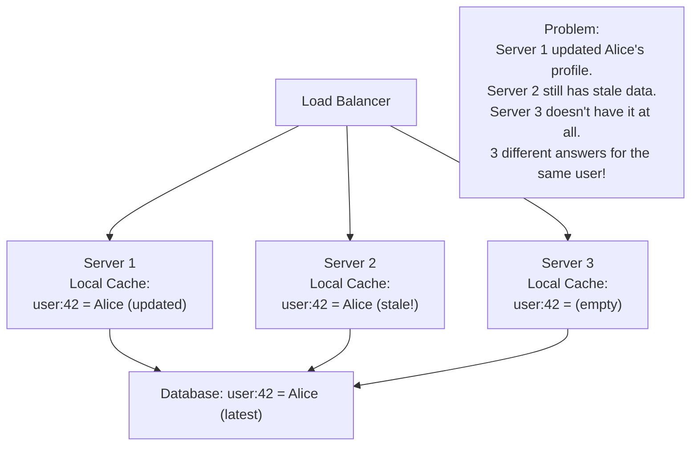
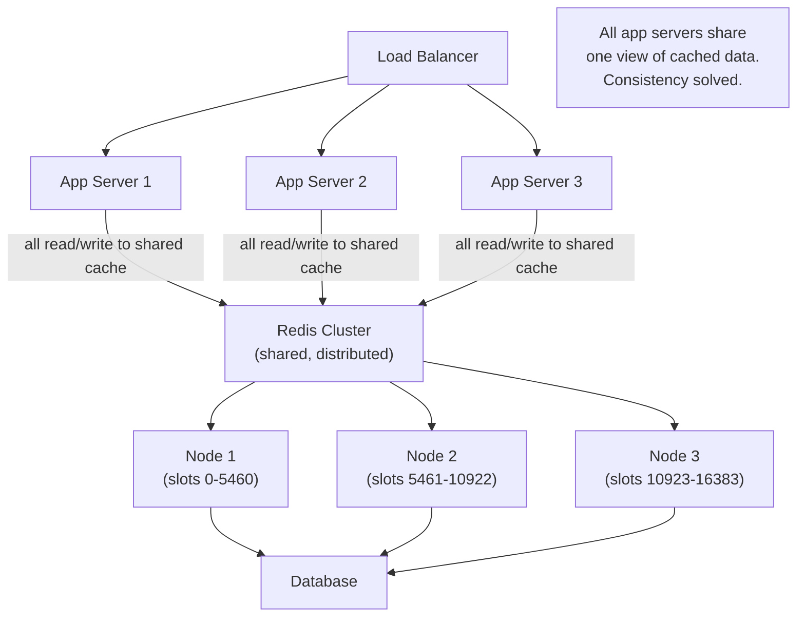
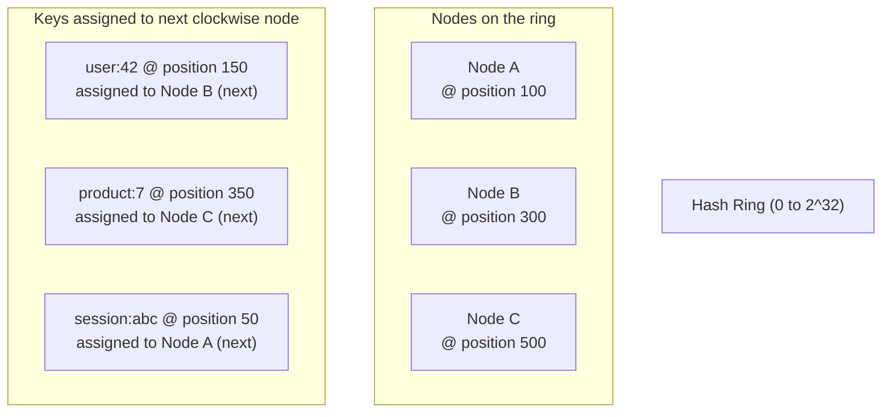
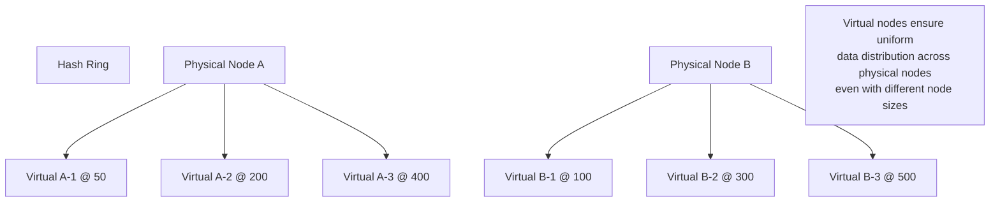
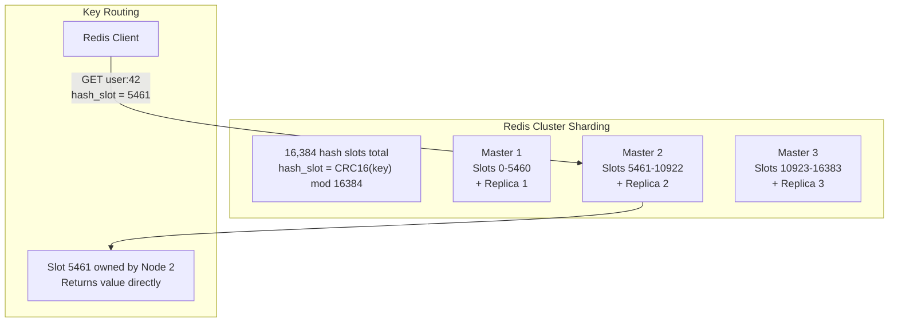
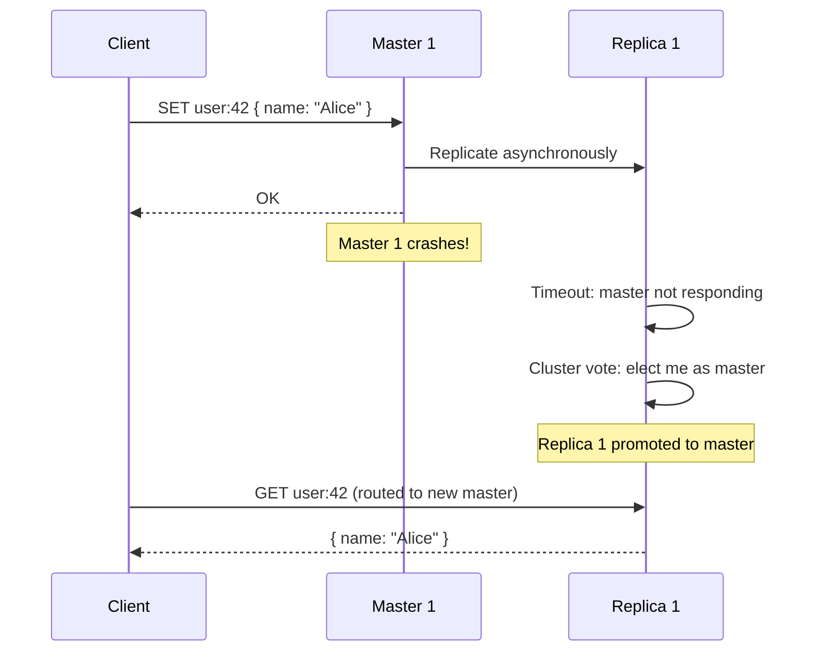
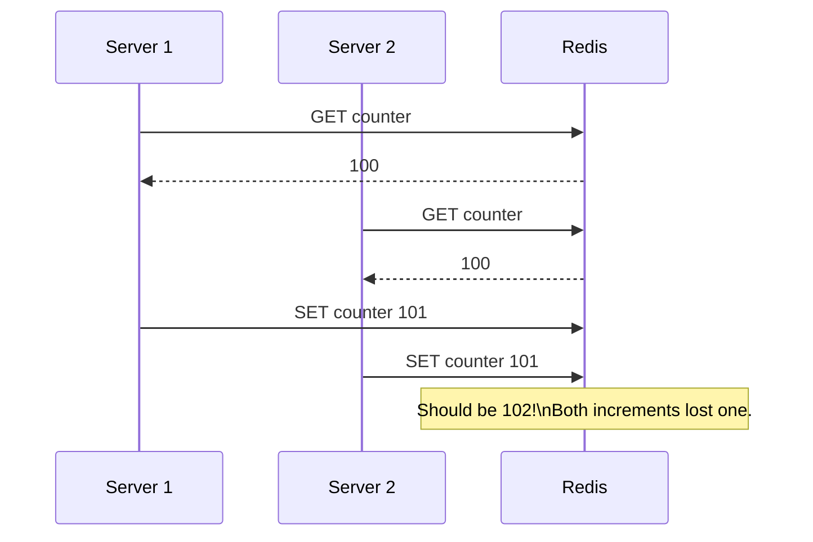
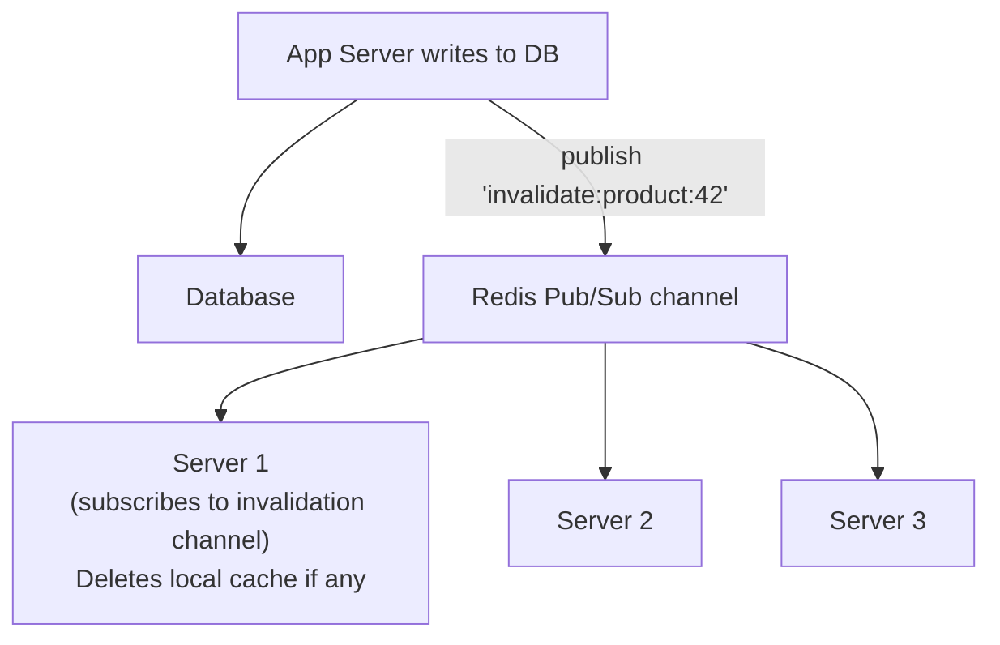

# Distributed Caching

A distributed cache is a cache that spans multiple machines, providing a shared, high-speed data store for multiple application servers. Instead of each server having its own local cache (which creates consistency problems), all servers read from and write to a shared cache cluster. Distributed caching is the standard approach for caching at scale.

> **Why this matters in interviews:** When designing systems that scale beyond a single server, local in-process caches break down — each server has its own copy, inconsistencies multiply, and a server restart clears the cache. Every scalable architecture uses a distributed cache. Knowing the internals of Redis Cluster (consistent hashing, sharding, replication, failover) is essential for answering "how would you cache this at scale?"

---

## Why Not Local (In-Process) Caching?



With 3 servers:

- **Inconsistency:** Cache invalidation on Server 1 doesn't affect Server 2 or Server 3
- **Wasted memory:** Each server independently caches the same data (3x memory use)
- **Cache cold start on deploy:** Every new server starts with an empty cache
- **Cache misses after restart:** A server restart loses all its local cache

---

## The Distributed Cache Architecture



All application servers read from and write to the same Redis cluster. User:42's profile exists in exactly one place — the specific Redis node responsible for that key. All servers get the same answer.

---

## Key Distribution: Consistent Hashing

When you have multiple cache nodes, you need to decide which node stores which key. Naive modulo hashing (`hash(key) % N`) breaks when you add or remove nodes — almost all keys remap to different nodes.

**Consistent hashing** solves this:



**Why consistent hashing beats modulo:**

| Event         | Modulo (N nodes)           | Consistent Hashing                 |
| ------------- | -------------------------- | ---------------------------------- |
| Add a node    | ~(N-1)/N of all keys remap | Only ~1/N of keys remap            |
| Remove a node | ~(N-1)/N of all keys remap | Only the removed node's keys remap |

Adding a fourth node to a three-node cluster remaps only 25% of keys with consistent hashing, vs. 75% with modulo.

### Virtual Nodes (Vnodes)

A single physical node maps to **multiple positions on the ring** — typically 150–300 virtual nodes per physical node:



Virtual nodes solve the uneven distribution problem: without them, keys cluster unevenly depending on where physical nodes land on the ring.

---

## Redis Cluster: Deep Dive

Redis Cluster is the production-standard distributed cache. It uses a variant of consistent hashing based on **hash slots**:



**Every key is assigned to exactly one hash slot, and each master node owns a range of slots.**

### Replication and Failover



Each master has one or more replicas. If a master fails, its replica is promoted via cluster election in seconds. Replication is **asynchronous** — a brief window exists where data written to the master but not yet replicated could be lost on failover.

---

## Redis Cluster vs. Memcached

Both are widely used distributed caches. The choice has been effectively settled by the industry:

| Dimension             | Redis                                              | Memcached                             |
| --------------------- | -------------------------------------------------- | ------------------------------------- |
| **Data structures**   | Strings, hashes, lists, sets, sorted sets, streams | Strings only                          |
| **Persistence**       | RDB snapshots + AOF log                            | None (pure in-memory)                 |
| **Replication**       | Built-in primary-replica replication               | Not built-in (third-party)            |
| **Cluster**           | Redis Cluster (built-in)                           | Client-side sharding only             |
| **Pub/Sub**           | Yes                                                | No                                    |
| **Lua scripting**     | Yes                                                | No                                    |
| **Atomic operations** | INCR, GETSET, transactions (MULTI/EXEC)            | INCR only                             |
| **Memory efficiency** | Slightly higher overhead                           | Slightly lower for pure string caches |
| **Multi-threading**   | Single-threaded (I/O multi-threaded since Redis 6) | Multi-threaded                        |

**Industry consensus:** Use Redis. The operational overhead of managing both systems is not worth Memcached's slight memory efficiency advantage. Almost all new deployments use Redis.

---

## Cache Coherence in Distributed Systems

With a distributed cache, multiple application servers can write to the same key simultaneously:

### Race Condition: Read-Modify-Write



**Solution: Atomic operations**

```
# Wrong approach (race condition):
val = redis.get("counter")
redis.set("counter", int(val) + 1)

# Correct approach (atomic):
redis.incr("counter")  # Atomic, no race condition

# For complex operations: Lua scripts (executed atomically)
redis.eval("""
  local val = redis.call('get', KEYS[1])
  redis.call('set', KEYS[1], val + ARGV[1])
  return val + ARGV[1]
""", 1, "counter", 1)
```

### Cache Invalidation Coordination

When data changes in the database, all relevant cache keys must be invalidated. In a distributed system with multiple writers, this requires care:



**Or simpler:** All application servers use the distributed Redis cache (not local caches), so invalidating one key in Redis invalidates it for all servers.

---

## Production Patterns

### Cache-Aside with Distributed Cache

```python
import redis
import json

redis_client = redis.RedisCluster(
    startup_nodes=[{"host": "redis-cluster", "port": "7000"}],
    decode_responses=True
)

def get_user(user_id: str) -> dict:
    key = f"user:{user_id}"

    # 1. Try cache
    cached = redis_client.get(key)
    if cached:
        return json.loads(cached)

    # 2. Cache miss — fetch from DB
    user = db.get_user(user_id)
    if not user:
        # Cache negative results too! Prevents DB hammering on missing keys.
        redis_client.setex(key, 60, "null")  # Short TTL for negatives
        return None

    # 3. Populate cache
    redis_client.setex(key, 3600, json.dumps(user))
    return user
```

**Caching negative results** (storing `null` for missing keys with a short TTL) prevents repeated database queries for non-existent records — a common attack vector and performance issue.

### Connection Pooling

Redis connections are cheap but not free. Always use a connection pool:

```python
# Don't create a new connection per request:
# redis.Redis().get(key)  -- creates new connection each time!

# Use a pool (configured once at startup):
pool = redis.ConnectionPool(host='redis', port=6379, max_connections=50)
redis_client = redis.Redis(connection_pool=pool)
```

---

## Sizing and Capacity Planning

```
Memory needed = average_item_size × number_of_items × replication_factor

Example:
- User profile: 2 KB average
- 10 million active users
- Cache 20% hot users: 2M entries
- 3x replication (3 Redis masters with replicas)

Memory = 2 KB × 2M × 3 = 12 GB total across cluster
       = 4 GB per master node

Add 20% overhead for Redis metadata and fragmentation:
= ~5 GB per master → use r6g.large (13 GB) for headroom
```

**Rule of thumb:** Size the cache for your hot working set (the 20% of data that gets 80% of reads). Add 2x headroom for growth and fragmentation.

---

## Real-World Distributed Caches

**Twitter:** Uses a distributed cache cluster with thousands of cache nodes. User timelines (pre-computed) are cached per user. The cache cluster handles ~5 million cache operations per second.

**Facebook:** TAO (The Associations and Objects) is Facebook's distributed graph cache. It caches social graph edges (friendships, likes, comments) across geographically distributed data centers, handling hundreds of millions of reads per second.

**Shopify:** Uses Redis clusters per-shop (tenant isolation) + shared clusters for catalog data. Redis Cluster handles seasonal traffic spikes (Black Friday) by scaling replicas, with read traffic distributed across replica reads.

---

## Interview Talking Points

**1. What is consistent hashing and why is it used in distributed caches?**

> "Consistent hashing maps cache keys to nodes such that adding or removing a node only remaps a small fraction of keys (1/N on average). With simple modulo hashing, adding a node remaps nearly all keys, causing a massive wave of cache misses. Consistent hashing places both nodes and keys on a hash ring; each key is assigned to the nearest clockwise node. Virtual nodes (multiple ring positions per physical node) improve load balance. Redis Cluster uses a variant with 16,384 hash slots — keys are assigned to slots via CRC16, and slot ranges are assigned to master nodes."

**2. How does Redis Cluster handle node failures?**

> "Every master in Redis Cluster has one or more replicas. Replication is asynchronous — writes go to the master and are replicated to replicas in the background. If a master fails, replicas detect the timeout, initiate a cluster election, and one replica is promoted to master within seconds (typically 10-30 seconds depending on cluster timers). The promoted replica takes ownership of the failed master's hash slot range. Because replication is asynchronous, there's a small window where data written to the failed master but not yet replicated is lost — this is Redis Cluster's trade-off: availability and partition tolerance over strict consistency."

**3. What is the difference between Redis and Memcached, and why is Redis generally preferred?**

> "Both are distributed in-memory caches, but Redis is significantly richer: it supports multiple data structures (strings, hashes, sets, sorted sets, streams), built-in replication and clustering, persistence (RDB snapshots, AOF log), pub/sub messaging, and Lua scripting for atomic multi-step operations. Memcached is pure strings with client-side sharding only. Redis's built-in clustering and replication simplify operations substantially. The only meaningful advantage Memcached retains is multi-threaded architecture — Redis was single-threaded until Redis 6 added I/O multi-threading. The industry has largely standardized on Redis."

**4. How do you prevent a thundering herd when a popular cached item expires?**

> "Several approaches: First, probabilistic early expiration — before the TTL expires, with a small probability that increases as expiry approaches, proactively refresh the cache. Second, mutex lock — when a cache miss is detected, acquire a distributed lock (Redis SET NX) and only one process fetches from the database; others wait and retry the cache. Third, stale-while-revalidate — serve stale data immediately while asynchronously refreshing in the background. Fourth, jitter on TTL — add a random offset to TTL (e.g., 3600 ± 300 seconds) so all instances of the same data type don't expire simultaneously."

---

## Key Takeaways

- **Distributed caches** (Redis Cluster, Memcached) share a single cache across all application servers — solving the consistency problem of local caches
- **Consistent hashing** distributes keys across nodes with minimal remapping when nodes are added/removed — ~1/N keys remap vs. nearly all with modulo
- **Virtual nodes** ensure even distribution across physical nodes of different sizes
- **Redis Cluster** uses 16,384 hash slots; each master owns a slot range; replicas provide failover in seconds
- **Asynchronous replication** means a brief window of data loss is possible on master failover — the Redis Cluster trade-off
- Use **atomic Redis operations** (INCR, Lua scripts, MULTI/EXEC) to prevent race conditions in distributed read-modify-write scenarios
- **Cache negative results** (null/missing keys) to prevent database hammering from repeated requests for non-existent data
- Size the cache for your **hot working set** (20% of data, 80% of reads) with 2x headroom for growth and fragmentation
