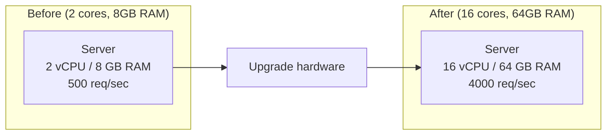
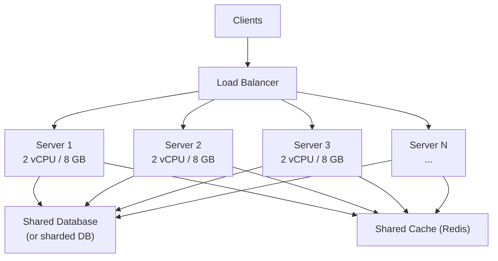
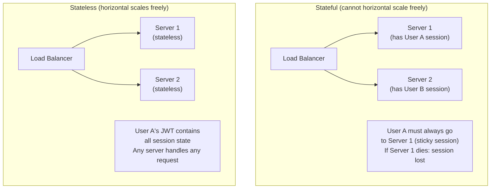
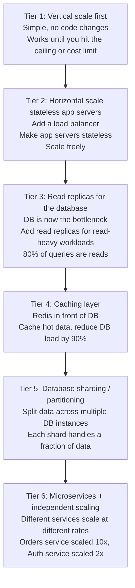
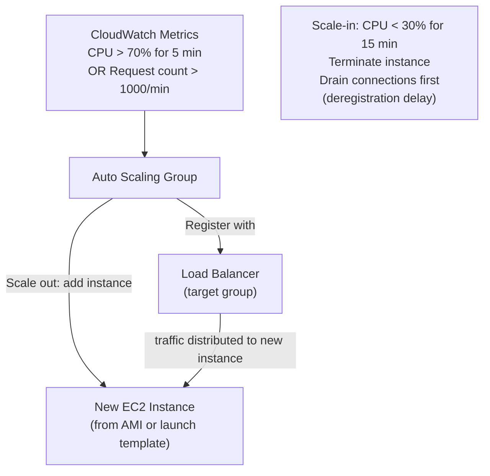
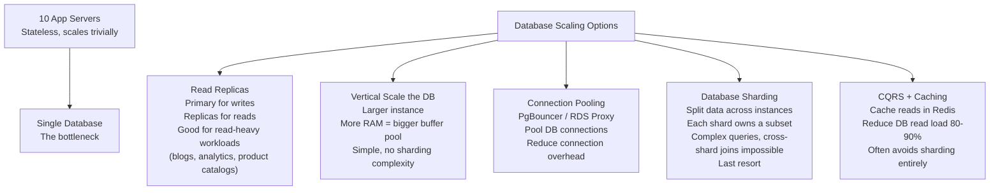

# Horizontal vs Vertical Scaling

When a system can't keep up with demand, you scale it. There are exactly two ways to do this: **vertical scaling** (give the machine more power) and **horizontal scaling** (add more machines). Every architecture decision about capacity eventually comes down to this choice — and understanding the tradeoffs at a deep level is fundamental to every system design conversation.

> **Why this matters in interviews:** "How would you scale this system?" is asked in virtually every system design interview. The answer is never just "add more servers." You need to explain what's being scaled, why, the limits of each approach, and what infrastructure changes are required. Interviewers specifically listen for understanding of stateless vs. stateful services, the role of load balancers, and the database as the typical scaling bottleneck.

---

## Vertical Scaling (Scale Up)

Give the existing server more resources: faster CPU, more RAM, faster SSD, more network bandwidth.

**Practical vertical scaling on AWS:**

| Instance      | vCPU | RAM       | Relative Cost |
| ------------- | ---- | --------- | ------------- |
| t3.medium     | 2    | 4 GB      | 1x            |
| c5.2xlarge    | 8    | 16 GB     | 8x            |
| c5.9xlarge    | 36   | 72 GB     | 36x           |
| c5.18xlarge   | 72   | 144 GB    | 72x           |
| u-24tb1.metal | 448  | 24,576 GB | (specialized) |

You can scale an AWS instance from 2 vCPUs to 448 vCPUs — a 224x increase. But the top-end instances cost hundreds of dollars per hour and there's a **hard ceiling** you can't go beyond.

### When Vertical Scaling Wins

- **Databases** — especially when sharding is expensive or impractical. A larger PostgreSQL instance with more RAM means a larger buffer pool (more data fits in memory, fewer disk reads). Amazon RDS supports instances up to 128 vCPUs and 1TB RAM.
- **Legacy applications** — systems that weren't designed for distributed operation (can't be horizontally scaled without expensive rewrites).
- **Simplicity over cost** — no load balancer, no distributed state, no network hops between shards. One machine, one failure domain, simple.
- **Low-latency inter-process communication** — in-process function calls are 1000x faster than network calls; co-locating everything on one machine eliminates network overhead.

---

## Horizontal Scaling (Scale Out)

Add more servers. Distribute the workload across multiple machines.

Each server handles a fraction of the total traffic. Adding a server increases total capacity proportionally — if three servers each handle 1,000 req/sec, the system handles 3,000. Add a fourth: 4,000.

### Requirements for Horizontal Scaling

**Stateless application servers** — the critical prerequisite:

Push state to shared external systems:

- **Session state** → Redis or JWT tokens
- **Uploaded files** → S3 / object storage
- **Application config** → environment variables or config service
- **Database** → shared relational DB, or sharded

---

## The Scaling Pyramid

In practice, you don't choose one approach forever — you apply them in layers:

**Most systems never reach Tier 5 or 6.** Premature sharding is a common and expensive mistake.

---

## Comparing the Two Approaches

| Dimension                | Vertical Scaling                | Horizontal Scaling                           |
| ------------------------ | ------------------------------- | -------------------------------------------- |
| **Complexity**           | ✅ Low — one machine            | ❌ High — distributed systems                |
| **Cost efficiency**      | ❌ Superlinear cost growth      | ✅ Near-linear cost growth                   |
| **Ceiling**              | ❌ Hard hardware limit          | ✅ Theoretically unlimited                   |
| **Redundancy**           | ❌ Single point of failure      | ✅ Other servers absorb traffic if one fails |
| **Latency**              | ✅ In-process calls, no network | ❌ Network hops between services             |
| **Downtime for scaling** | ❌ Usually requires restart     | ✅ Add servers live, zero downtime           |
| **State management**     | ✅ Local, simple                | ❌ Must externalize all state                |
| **Database**             | ✅ Easy (bigger instance)       | ❌ Sharding is complex                       |

---

## Auto-Scaling: Scaling Dynamically

Modern cloud environments scale automatically based on metrics:

**Scale-out policies:** Add N instances when CPU > 70%, or use target tracking (maintain average CPU at 60%).

**Scale-in (termination) policies:** LIFO (default: terminate newest), cost-optimized, or instance priority.

**Predictive scaling:** AWS ML models predict traffic patterns (e.g., Monday morning spike) and pre-scale before the spike arrives.

---

## Database Scaling: The Hardest Part

Application servers are easy to scale horizontally. Databases are hard:

**The database scaling order of operations:**

1. Add a read replica (read queries go to replica)
2. Add Redis caching (hot reads never hit the DB)
3. Vertically scale the DB (bigger instance, more buffer pool)
4. Connection pooling (PgBouncer)
5. Shard (only when nothing else works)

---

## Real-World Examples

**Instagram (2012):** 30 million users, 3 engineers. Single PostgreSQL + read replicas + memcached. Eventually sharded users by user_id. The story is instructive: they stayed on vertical scaling + read replicas longer than people expect, and it worked.

**Twitter timeline fanout:** Writing a tweet fans out to followers' timelines. With 100M followers (Lady Gaga), that's 100M write operations. They scale this horizontally: tens of thousands of cache servers, each holding a slice of user timelines. Horizontal scale-out is the only option — no single machine can hold 100M users' timelines.

**Stack Overflow:** Serves 1.3 billion pageviews/month from **25 web servers** (mostly vertical scaling). Their secret: aggressive caching + a small number of well-tuned, large SQL Server instances with huge RAM. Horizontal scaling is not always the answer.

---

## Interview Talking Points

**1. What is the difference between horizontal and vertical scaling?**

> "Vertical scaling means giving a single machine more resources — more CPU, RAM, or faster disk. Horizontal scaling means adding more machines and distributing load across them. Vertical is simpler operationally (no distributed systems complexity, no load balancer) but has a hard ceiling on how far you can go and creates a single point of failure. Horizontal is theoretically unlimited and provides redundancy, but requires stateless application design, a load balancer, and externalized state (Redis for sessions, S3 for files). In practice you start with vertical, then add horizontal scaling of stateless app servers, then add read replicas for the database."

**2. What's the biggest challenge in horizontally scaling a stateful application?**

> "The biggest challenge is managing state. If Server 1 holds a user's session in memory and the load balancer routes their next request to Server 2, Server 2 doesn't have their session — the user appears logged out. Solutions: sticky sessions (always route user to same server — breaks failover), shared session store (Redis — correct approach), or stateless authentication (JWT tokens encode session state client-side). The application server must be stateless: no in-memory data that must persist across requests. State lives in external systems: the database, Redis, object storage."

**3. Why is database scaling harder than application server scaling?**

> "Application servers are easy to scale horizontally because they're stateless — any server can handle any request. Databases are stateful by definition. You can add read replicas for read scaling, but all writes must go to the primary. If writes are the bottleneck, you need sharding — partitioning data across multiple database instances so each instance handles a subset of writes. Sharding introduces significant complexity: cross-shard queries are impossible or expensive, foreign keys across shards don't work, and resharding when you need to add shards is operationally painful. This is why caching (reducing DB load by 80-90%) and connection pooling often let you avoid sharding entirely."

**4. When should you NOT horizontally scale?**

> "When the bottleneck isn't the application tier. If a single database is the bottleneck and you add more app servers, you've made things worse — more servers hammering the same database. Fix the actual bottleneck first. Also, horizontal scaling has overhead: a load balancer, network serialization between tiers, distributed tracing for debugging. For an internal tool with 100 users, a single larger VM is simpler and cheaper. Stack Overflow serves over a billion monthly pageviews from 25 web servers with aggressive vertical scaling and caching — horizontal scaling is not always the answer."

---

## Key Takeaways

- **Vertical scaling** (scale up): more powerful single machine — simple, expensive, has a hard ceiling
- **Horizontal scaling** (scale out): more machines behind a load balancer — complex, near-linear cost, theoretically unlimited
- Prerequisite for horizontal scaling: **stateless application servers** — all state externalized to Redis, S3, shared database
- Scale in order: vertical → horizontal app servers → read replicas → caching → sharding (most systems stop at step 3 or 4)
- The **database is always the hardest scaling challenge** — read replicas, caching, and connection pooling before sharding
- **Auto-scaling** (AWS ASG, GCP MIG) handles dynamic load — scale out on CPU/request spike, scale in when traffic drops
- Horizontal scaling provides **redundancy**: if one server dies, others absorb traffic. Vertical scaling = single point of failure
- Real production systems use **both**: vertical for databases, horizontal for stateless app servers
