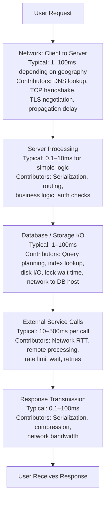
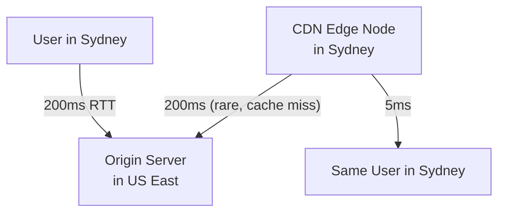
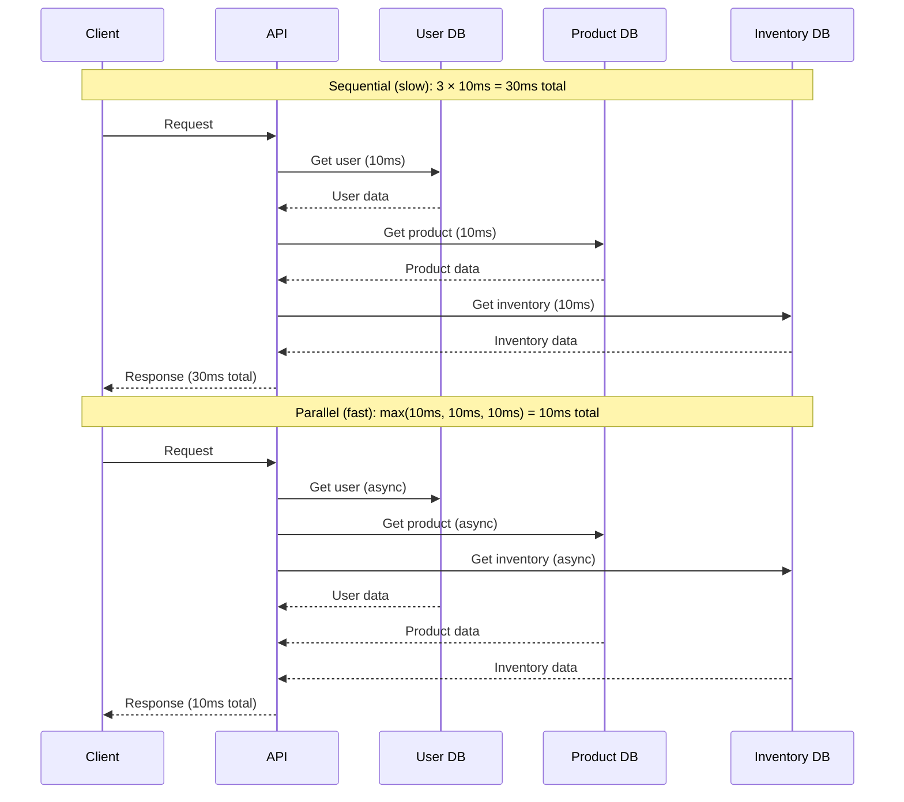
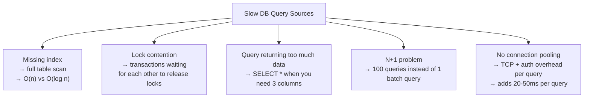
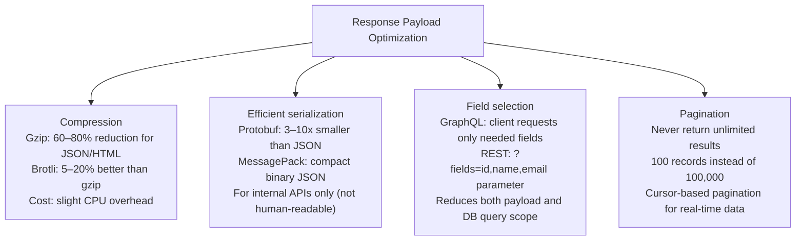
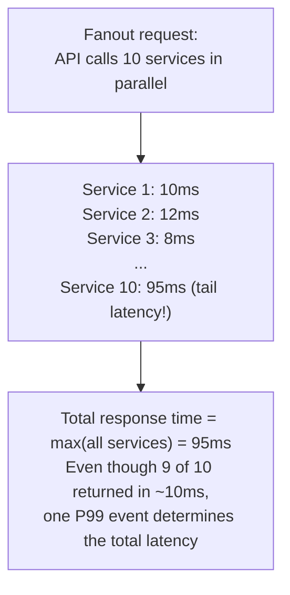
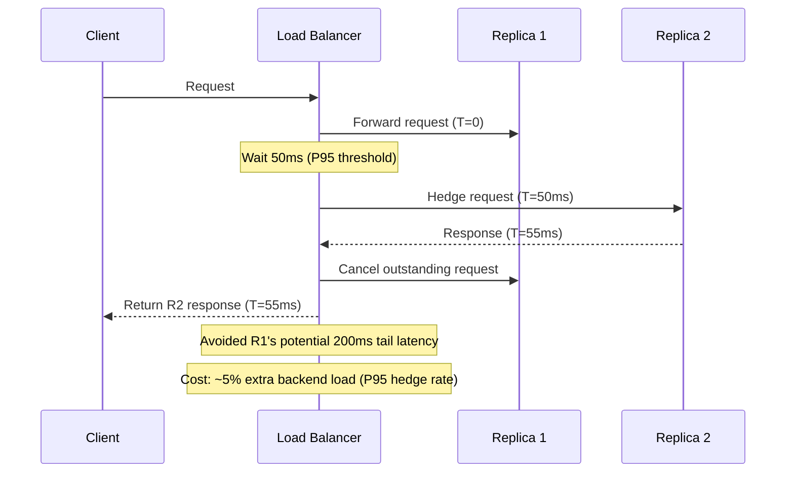
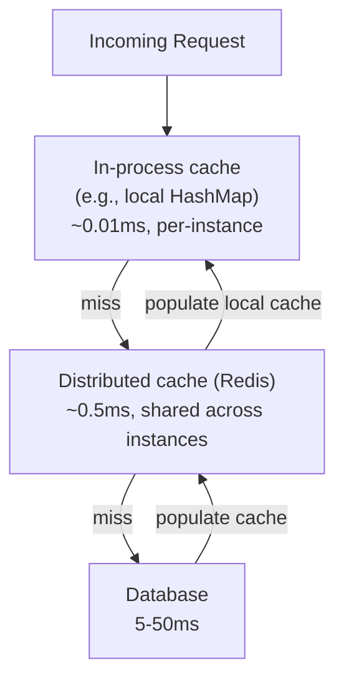

# Latency Optimization

Latency is the time between a request and its response — the delay a user experiences while waiting. It is distinct from throughput (how much work a system can do) and from availability (whether a system is up). A system can be highly available and high-throughput while still feeling slow to individual users because of high latency. Optimizing latency is the work of finding and eliminating delays in the critical path of a request.

> **Why this matters in interviews:** Latency optimization tests your ability to reason about request lifecycles — where time is actually spent. Every optimization question has the same structure: identify the bottleneck, measure it, remove it or move it off the critical path. Interviewers want to see you enumerate sources of latency systematically before jumping to solutions.

---

## Where Does Latency Come From?

Every request travels through multiple layers, each contributing delay:



**The critical path:** Latency is determined by the sequence of operations that must complete before the response can be returned. Operations on the critical path all add to latency. Operations that can be done in parallel or deferred do not.

---

## The Latency Numbers You Should Know

These approximate figures are fundamental to back-of-envelope reasoning:

| Operation                              | Approximate Latency   |
| -------------------------------------- | --------------------- |
| L1 cache reference                     | 0.5 ns                |
| L2 cache reference                     | 7 ns                  |
| Main memory (RAM) reference            | 100 ns                |
| SSD random read                        | 100 µs (100,000 ns)   |
| HDD random read                        | 10 ms (10,000,000 ns) |
| Network: same data center (LAN)        | 0.5 ms                |
| Network: cross-region (US East → West) | 40 ms                 |
| Network: cross-continent (US → Europe) | 80 ms                 |
| Network: global (US → Australia)       | 160 ms                |
| TCP handshake                          | 1 RTT                 |
| TLS 1.3 handshake                      | 1 RTT                 |
| DNS lookup (uncached)                  | 10–100 ms             |
| Redis GET (same datacenter)            | ~0.5 ms               |
| PostgreSQL query (indexed, same DC)    | 1–5 ms                |
| PostgreSQL query (table scan)          | 10–1000 ms            |

**Key insight:** RAM is 200,000x faster than disk, and disk is 20x faster than the network to another region. Cache what's worth caching. Keep data close to compute.

---

## Optimization Strategy: Work Through the Stack

### 1. Network Latency

**Problem:** Physical distance and TCP overhead add significant latency for geographically distributed users.



**Solutions:**

- **CDN (Content Delivery Network):** Cache static assets (JS, CSS, images, API responses) at edge nodes near users. Reduces network latency from 200ms to ~5ms for cache hits.
- **DNS-based routing:** Route users to the nearest data center (GeoDNS, Anycast).
- **HTTP/2 or HTTP/3:** Multiplexing eliminates head-of-line blocking; reduces connection overhead. HTTP/3 (QUIC) reduces handshake latency.
- **Connection pooling:** Reuse TCP connections instead of paying the handshake cost per request.
- **TLS 1.3:** Reduces TLS handshake from 2 RTT to 1 RTT (or 0-RTT for session resumption).
- **Keep-alive / persistent connections:** Avoid per-request TCP setup overhead.

### 2. Application / Service Latency

**Problem:** Sequential processing, serialization overhead, unnecessary computation.



**Solutions:**

- **Parallelize independent operations:** If you need data from A and B and they don't depend on each other, fetch them concurrently (Promise.all, asyncio.gather, goroutines).
- **Async I/O:** Non-blocking I/O (Node.js event loop, Python asyncio, Java NIO) allows a single thread to handle many in-flight I/O operations without blocking.
- **Efficient serialization:** JSON parsing is slow. Protocol Buffers (protobuf) are 3–10x faster for serialization/deserialization and produce smaller payloads. Use for high-throughput internal service communication.
- **Avoid N+1 queries:** Loading 100 users and then making 100 individual DB calls for their orders is an N+1 problem. Use batch queries (SELECT ... WHERE id IN (...)) or join queries instead.

### 3. Database Latency

**Problem:** Unindexed queries, lock contention, table scans, slow writes.



**Solutions:**

- **Add indexes on query predicates:** Composite indexes for multi-column WHERE clauses. Covering indexes to avoid table lookups.
- **Read replicas:** Route read-heavy queries (analytics, reports) to read replicas, leaving the primary for writes and low-latency reads.
- **Connection pooling:** Tools like PgBouncer (PostgreSQL) or ProxySQL (MySQL) pool DB connections across application instances, eliminating per-query connection overhead.
- **Query optimization:** Use EXPLAIN/EXPLAIN ANALYZE to understand query plans. Avoid SELECT \*; fetch only needed columns.
- **Caching:** Cache frequent, expensive queries in Redis. For query results that don't change often, a cache-aside pattern dramatically reduces DB query load and latency.
- **Denormalization:** Store pre-computed aggregates or duplicated data to avoid expensive JOINs at query time.

### 4. Reduce Payload Size

Smaller payloads transmit faster:



---

## Tail Latency: The Hidden Problem

**Tail latency** refers to the extreme percentile latencies (P99, P999) — requests that take much longer than the median. These disproportionately affect user-perceived performance:



**The math of parallel fan-out:** If you call N services in parallel, and each has P99 = 100ms, the probability that at least one hits P99 = 1 - (0.99)^N. For N=100 services, probability of at least one P99 = 1 - 0.99^100 ≈ 63%. This is why microservice architectures often have worse tail latency than monoliths.

### Hedged Requests

Send the same request to two replicas. Use whichever responds first. Cancel the other:



**Used by:** Google BigTable, DynamoDB, Cassandra for read operations. Dramatically reduces P99 at the cost of slightly higher backend load.

---

## Caching for Latency

Caching is the most impactful latency optimization for read-heavy workloads:

```
DB query: 5–50ms
Redis GET: 0.5ms

Cache hit: 10× to 100× faster
```

**What to cache:**

- Expensive computed results (aggregate queries, ML model predictions)
- External API responses (weather data, currency rates)
- Database query results that don't change frequently (user profile data, product catalog)
- Session data

**Cache hierarchy:**



---

## Little's Law: Latency, Throughput, and Concurrency

Little's Law gives the mathematical relationship between system metrics:

$$L = \lambda \times W$$

Where:

- $L$ = average number of requests in the system (concurrency)
- $\lambda$ = arrival rate (throughput, requests/second)
- $W$ = average time in system (latency, seconds)

**Rearranging:** $W = L / \lambda$ — latency equals concurrency divided by throughput.

**Practical implication:** If you want to reduce latency ($W$) at a fixed throughput ($\lambda$), you must reduce the number of concurrent requests in flight ($L$). This is why connection limits and backpressure are effective latency tools — they limit L, which limits W.

---

## Interview Talking Points

**1. What are the main sources of latency in a web application and how would you prioritize reducing them?**

> "Latency accumulates from network transit, application processing, database I/O, and external service calls. I'd prioritize based on impact: first, look at database query latency — adding missing indexes can reduce query time from seconds to milliseconds. Second, parallelize independent I/O operations — if you're making three sequential DB calls that don't depend on each other, parallelizing them reduces latency by 2/3. Third, add caching for expensive repeated queries — a Redis GET at 0.5ms vs. a DB query at 50ms is a 100x improvement. Fourth, for geographically distributed users, CDN and regional deployment bring data closer to users, reducing network RTT from 200ms to 5ms."

**2. What is the N+1 query problem and how do you solve it?**

> "N+1 happens when you load a list of N records and then make one additional query per record. For example, loading 100 orders and then querying the customer for each order — that's 1 + 100 = 101 queries. Solutions: (1) Use a JOIN to fetch orders and customers in a single query. (2) Use batch loading — after fetching 100 orders, collect all customer IDs and do SELECT \* FROM customers WHERE id IN (...) to get all customers in one query, then join in memory. (3) Use a dataloader pattern (popularized by GraphQL) that batches all lookups in a single event loop tick. The N+1 problem is one of the most common sources of database latency in production systems."

**3. What are hedged requests and when should you use them?**

> "Hedged requests are a technique to reduce tail latency in parallel systems. Instead of waiting for a single slow response, you send the same request to a second replica after a delay (usually the P95 latency). Whichever responds first wins; you cancel the other. This converts P99 tail events from taking the full P99 time into taking P95 + the processing time of the second replica — often dramatically reducing worst-case latency. The cost is slightly higher backend load: if you hedge at the P95 threshold, about 5% of requests generate two backend calls. Google uses hedged reads in BigTable and Spanner. Use hedged requests for read operations where slightly higher backend load is acceptable in exchange for much better tail latency."

**4. Explain Little's Law and its practical application.**

> "Little's Law states L = λW, where L is the average concurrency (requests in flight), λ is throughput (requests/second), and W is average latency. It's a fundamental queuing theory result that applies to any stable system. Practically: if you know your target throughput and acceptable latency, you can compute the required concurrency (thread pool size, connection pool size). If throughput is 1,000 req/sec and target latency is 100ms, you need L = 1,000 × 0.1 = 100 concurrent requests in flight. This tells you your thread pool or connection pool needs at least 100 slots. Conversely, if you reduce concurrency (via backpressure or throttling) at fixed throughput, latency must decrease — so limiting queue depth is a latency control mechanism."

---

## Key Takeaways

- Latency comes from **network transit, application processing, database I/O, and external calls** — measure first, then optimize
- **Parallelizing independent I/O** is often the highest-impact application change: 3 sequential 10ms calls → 1 parallel 10ms call
- **Caching** converts 5–50ms DB queries to 0.5ms Redis reads — the most impactful latency optimization for read-heavy workloads
- **Database indexes** are critical: a missing index can mean a 10ms query becomes a 1,000ms table scan
- **Hedged requests** reduce tail latency at the cost of ~5% extra load — ideal for fan-out architectures
- **CDN and regional deployment** reduce network RTT from 200ms (cross-continent) to 5ms (edge)
- **N+1 queries** are a common production latency trap — use JOINs, batch queries, or dataloaders instead
- **Little's Law** (L = λW): concurrency, throughput, and latency are mathematically linked — controlling any one affects the others
